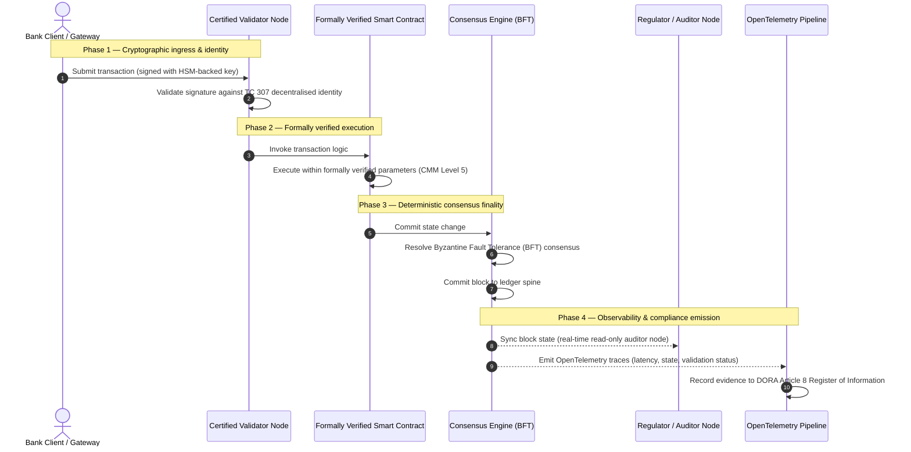

# Von der Evidenz zur Wahrheit: Warum zertifizierte Blockchains die nächste Ära des Bankvertrauens definieren werden

## Strategische Zusammenfassung (das Wesentliche)

Das Wholesale-Banking und der globale Zahlungsverkehr stehen 2026 an einem historischen Wendepunkt. Während Finanzdienstleistungen auf nativ digitale, echtzeitfähige Clearing-Netze umsteigen und künstliche Intelligenz einen probabilistischen Nichtdeterminismus einführt, werden die traditionellen analogen, rückblickenden Prüfmodelle (wie statische, entitätsbasierte Audits) den modernen Anforderungen an Risikomanagement und treuhänderische Sorgfalt nicht mehr gerecht.

Das technische Komitee ISO/IEC TC 307 hat eine standardisierte Grundlage für Distributed-Ledger-Technologien geschaffen. Eine echte institutionelle Adoption erfordert jedoch den Übergang von beschreibender Orientierung zu präskriptiver, unabhängig zertifizierbarer Blockchain-Assurance. Durch die Bewertung von Ledger-Governance, Konsensintegrität, Smart-Contract-Sicherheit und kryptografischer Agilität anhand eines strengen fünfstufigen Reifegradmodells (CMM) können Banken von uneinheitlichen, anbieterspezifischen Annahmen zu einer zertifizierbaren, vom Vorstand prüfbaren finanziellen Wahrheit gelangen.

## Kernaussagen

* **Die treuhänderische Reibungslücke**: Wir können heute die Bank (Basel III), die Cloud (ISO 27001) und die KI-Governance-Systeme (ISO 42001) zertifizieren, aber noch nicht das Distributed Ledger, das zunehmend bestimmt, was wahr ist. Diese Asymmetrie ist eine erhebliche operative Schwachstelle.  
* **DORA erzwingt direkte treuhänderische Verantwortung**: Nach Artikel 5 DORA tragen die Vorstände von Banken eine direkte, nicht delegierbare persönliche Haftung für die operative Resilienz aller Drittanbieter- und Ledger-Bereitstellungen, mit empfindlichen persönlichen Sanktionen nach dem SM&CR-Regime bei Verstößen.  
* **Das KI-Prüfrückgrat**: Wo maschinelles Lernen nicht reproduzierbare, probabilistische Ergebnisse erzeugt, liefert eine zertifizierte Blockchain eine deterministische Zustandserfassung. Das On-Chain-Festhalten von Modellversionen, Eingaben und Validierungsentscheidungen erfüllt ISO 42001 und die Standards des Modellrisikomanagements.  
* **Der Index zertifizierter Blockchains**: Dieser Index formalisiert Governance, Konsens, Smart Contracts und Beobachtbarkeit zu einer überprüfbaren, prüfbereiten Scorecard auf einer CMM-Skala von 0 bis 5 und übersetzt technische Kennzahlen in vom Vorstand genehmigte Risikoappetit-Erklärungen.

## 01. Die treuhänderische Reibungslücke im digitalen Banking

Im klassischen Banking ist Vertrauen relational, institutionell und rückblickend. Es beruht auf unabhängigen Drittprüfern, die den Finanzzustand zu festen Zeitpunkten überprüfen und Abweichungen zwischen bilateralen Ledger-Silos abgleichen. In den echtzeitfähigen, API-gesteuerten Märkten von 2026 führt dieses Modell zu prohibitiven Latenzen und strukturellen Risiken.

Wenn Transaktionen sofort abgewickelt werden, untertägige Liquiditätspools dynamisch über API-Gateways gesteuert werden und Eigentum an Vermögenswerten über gemeinsame Ledger tokenisiert wird, werden rückblickende Audits zu forensischen Übungen statt zu präventiven Kontrollen. Treuhänder können sich nicht mehr allein auf die Zertifizierung der juristischen Einheit verlassen. Sie müssen das digitale Substrat selbst zertifizieren.

Derzeit operieren Banken unter einer eklatanten architektonischen Asymmetrie:

1. **Zertifizierte Cloud-Infrastruktur**: Hardware-Knoten, virtualisierte Container und physische Rechenzentren werden gegen ISO/IEC 27001 und SOC 2 Type II geprüft.  
2. **Zertifizierte Managementprozesse**: Richtlinien zum operationellen Risiko, Notfallpläne und algorithmische Bereitstellungen unterliegen strengen Risikorahmenwerken.  
3. **Nicht zertifizierte Ledger-Engines**: Die verteilten Konsensmechanismen, die Lieferketten der Validator-Knoten, die Grenzen der Smart Contracts und die Netz-Governance-Modelle bleiben nicht zertifizierten, maßgeschneiderten oder konsortiumspezifischen Annahmen überlassen.

Diese Asymmetrie ist ein zentraler Schwachpunkt. Eine Bank kann eine validierte Anwendung in einem sicheren, ISO-27001-zertifizierten Cloud-Container betreiben; schreibt dieser Container jedoch in ein Distributed Ledger mit zentralisierter Validator-Kontrolle, anfälligen Konsensparametern oder ungeprüften Smart Contracts, ist die Transaktionsintegrität kompromittiert. Um diese Lücke zu schließen, muss die Ledger-Engine selbst zu einem zertifizierbaren Assurance-Objekt werden.

## 02. Die Standardisierungsgrundlage ISO/IEC TC 307

Die grundlegende Arbeit zur Standardisierung verteilter Ledger leistet das technische Komitee ISO/IEC TC 307 (Blockchain und Distributed-Ledger-Technologien). Statt Blockchain als isoliertes technisches Protokoll zu behandeln, betrachtet das TC 307 sie als institutionelle Vertrauensinfrastruktur und gliedert seine Arbeit in fünf Kernsäulen:

1. **Taxonomie und Terminologie (ISO 22739)**: schafft eine gemeinsame Nomenklatur und stellt konsistente rechtliche und operative Definitionen über Jurisdiktionen, Finanzsysteme und Institutionen hinweg sicher.  
2. **Referenzarchitektur (ISO/TR 23245)**: definiert die Grenzen, Schichten, Datenflüsse und funktionalen Komponenten eines konformen Distributed-Ledger-Systems.  
3. **Sicherheit, Datenschutz und Smart Contracts (ISO/TR 23244 / ISO 23613)**: legt grundlegende Sicherheitsleitlinien für digitale Vermögenssysteme fest und beschreibt bewährte Verfahren zur Minderung von Smart-Contract-Schwachstellen und zur Lebenszyklus-Governance.  
4. **Interoperabilitäts-Rahmenwerke**: adressiert die Daten- und Vermögensaustauschmechanismen zwischen heterogenen Ledger-Netzen und verhindert die Bildung isolierter tokenisierter Silos.  
5. **Dezentrale Identität und Vertrauensanker**: integriert Ledger-basierte kryptografische Identifikatoren mit formalen Public-Key-Infrastrukturen (PKI) und staatlich autorisierten Registern.

Insgesamt markiert das TC 307 den Übergang der DLT von einer maßgeschneiderten Engineering-Wahl zu einer standardisierten architektonischen Disziplin. Dennoch bleibt das TC 307 überwiegend beschreibend. Es definiert, wie Exzellenz aussieht (Orientierung), liefert jedoch nicht das präskriptive Verifikationsprotokoll (Assurance), das Risikoverantwortliche und Aufseher benötigen, um Produktivbereitstellungen kritischer oder wichtiger Funktionen (CIFs) zu autorisieren.

## 03. Orientierung versus Assurance: die treuhänderische Unterscheidung

Finanzmarktteilnehmer setzen Technologie nicht ein, weil sie innovativ oder elegant ist; sie setzen sie ein, wenn sie sich steuern, prüfen, verteidigen und mit den Eigenkapitalanforderungen abgleichen lässt. Deshalb löst sich die Standardisierung im Banking natürlich in zwei Schichten auf:

* **Orientierung (das Rahmenwerk)**: skizziert bewährte Verfahren, Referenzziele und architektonische Leitlinien (z. B. ISO/IEC TC 307, NIST-Rahmenwerke).  
* **Assurance (der Nachweis)**: liefert unabhängige, kontinuierliche und durch Dritte überprüfbare Evidenz, dass das Rahmenwerk implementiert ist und wie vorgesehen funktioniert (z. B. ISO-27001-Zertifizierung, SOC-2-Audits, regulatorische Prüfungen).

Sich auf nicht zertifizierten Ledger-Konsens zu verlassen, während man die Cloud-Infrastruktur zertifiziert, ist eine kritische regulatorische Lücke. Eine „unveränderliche“ Blockchain ist nicht zwangsläufig „institutionell vertrauenswürdig“. Unveränderlichkeit garantiert nur, dass die eingegebenen Daten unverändert bleiben; sie überprüft nicht, ob die Validator-Knoten sicher sind, das Konsensprotokoll gegen Kollusion resilient ist, die Smart-Contract-Logik mathematisch fundiert ist oder das kryptografische Schlüsselmanagement den Post-Quanten-Vorgaben entspricht.

Um diese Lücke zu schließen, formalisiert der Index zertifizierter Blockchains 2026 diese Anforderungen in einem quantifizierbaren Reifegradmodell (CMM), das auf die globalen Bankenregulierungen abgebildet ist.

## 04. Der Index zertifizierter Blockchains 2026

Damit die Geschäftsleitung ihre Ledger-Plattformen bewerten und zertifizieren kann, gliedert dieser Index die Distributed-Ledger-Infrastruktur in fünf prüfbare operative Schichten, bewertet auf einer CMM-Skala von 0 bis 5.

## Tabelle 1: die Architektur des Index zertifizierter Blockchains

| Index-Schicht | Reifegrad (CMM) | Technische und operative Kennzahl | Regulatorische / treuhänderische Kontrollreferenz |
| :---- | :---- | :---- | :---- |
| **Ledger-Governance** | **Stufe 0**: Ad-hoc-Konsortium**Stufe 3**: automatisierte Validatorprüfung & -rotation**Stufe 5**: dezentrales, mehrparteiliches kryptografisches Identitäts-Anchoring | % der von geprüften Finanzinstituten betriebenen Validator-Knoten; mittlere Bearbeitungszeit für Validator-Streitigkeiten; geografische Verteilung der Knoten | **DORA Artikel 5** (Governance und Organisation); **CPMI-IOSCO PFMI Prinzip 2** (Governance) & **Prinzip 3** (Rahmen für das umfassende Risikomanagement) |
| **Konsensintegrität** | **Stufe 0**: Einzelknoten oder opakes PoW**Stufe 3**: geprüftes BFT mit deterministischer Finalität**Stufe 5**: multijurisdiktioneller, formal verifizierter Konsens mit kontinuierlicher Latenzüberwachung | maximal tolerierbare Konsenslatenz; Schwelle der Kollusionsresistenz; Verfügbarkeits-SLA bei simulierter Knotenpartition | **DORA Artikel 6** (Rahmen für das IKT-Risikomanagement); **CPMI-IOSCO PFMI Prinzip 8** (Abwicklungsfinalität) |
| **Identität & Kryptografie** | **Stufe 0**: schwache RSA-/ECDSA-Schlüssel**Stufe 3**: Multi-Sig mit HSM-gestütztem Schlüsselmanagement**Stufe 5**: quantensichere Hybridschlüssel (FIPS 203 ML-KEM) und Zero-Knowledge-Datenschutz-Gates | % der mit HSM-gestützten Schlüsseln signierten Ledger-Transaktionen; PQC-Migrationsreife-Score; ZK-Proof-Latenz | **NIST FIPS 203 / 204**; **ISO/IEC 27001** (Informationssicherheitsmanagement) |
| **Smart-Contract-Assurance** | **Stufe 0**: ungeprüfte Solidity-Skripte**Stufe 3**: automatisierte Compiler-Validierung & externes Audit**Stufe 5**: formal verifizierte, unveränderliche Smart Contracts mit Circuit-Breaker-Upgrades | % der Smart Contracts mit mathematischer formaler Verifikation; Anzahl der Compiler-Warnungen; Abdeckung der Schwachstellen-Scans | **EBA-Leitlinien zu Auslagerungen** (Absätze 81, 113-117); **DORA Artikel 30** (Mindestvertragsklauseln) |
| **Audit & Beobachtbarkeit** | **Stufe 0**: manuelles Log-Scraping**Stufe 3**: strukturierte OTel-Traces & schreibgeschützte Prüferknoten**Stufe 5**: automatisierter, kontinuierlicher Abgleich mit dem Register nach Artikel 8 | % der durch OpenTelemetry-Traces abgedeckten Transaktionen; Latenz vom Block-Commit bis zur Prüferknoten-Synchronisation | **BCBS 239** (Risikodatenaggregation); **DORA Artikel 8** (Informationsregister / ITS-Schemata) |

## Tabelle 2: zentrale Vertrauenssignale, abgebildet auf globale Bankenstandards

| Signal / Benchmark | Kennzahl | Auswirkung auf Bankplattformen | Regulatorische Quelle |
| :---- | :---- | :---- | :---- |
| **ISO/IEC-TC-307-Fortschritt** | Übergang von ISO/TR-Fachberichten zu formalen Zertifizierungsschemata | Schafft das erste standardisierte Rahmenwerk zur Zertifizierung von Distributed-Ledger-Engines | **ISO/IEC JTC 1 / SC 44** (Distributed-Ledger-Technologien) |
| **Prototypphase des Projekts Agorá** | Über 40 teilnehmende Geschäftsbanken; Test eines einheitlichen Ledgers für tokenisierte Einlagen | Verlagert das grenzüberschreitende Clearing vom Messaging (SWIFT) zur atomaren tokenisierten Abwicklung | **Innovation Hub der Bank für Internationalen Zahlungsausgleich (BIZ)** |
| **DORA-Artikel-30-Drittprüfung** | 100 % der Knotenanbieter und Infrastruktur-Hosts nach Sicherheitskriterien geprüft | Beseitigt „Schatten-Validator-Knoten“; verlangt vollständige Lieferkettentransparenz | **Europäische Aufsichtsbehörden (ESA)** |
| **ISO/IEC 42001 (KI-Governance)** | KI-Modell- und Trainingsprotokolle kryptografisch unveränderlich on-chain | Nutzt die Blockchain als unveränderliches Beweisregister („Prüfrückgrat“) für maschinelles Lernen | **ISO/IEC 42001:2023** (Informationstechnik — Künstliche Intelligenz) |
| **Basel-III-Eigenkapitalausstattung** | Reduktion der Eigenkapitalpuffer für operationelles Risiko auf Basis dokumentierter Komplexitätsreduktion | Standardisierte Rahmenwerke für operationelles Risiko rechnen die verifizierte Ledger-Resilienz unmittelbar an | **Basler Ausschuss für Bankenaufsicht (BCBS)** |

## 05. Das „Prüfrückgrat“ der KI: probabilistische Intelligenz auf deterministischer Infrastruktur

Eine der wirkungsvollsten strategischen Rollen einer zertifizierten Blockchain im Jahr 2026 ist die eines **„Prüfrückgrats“** für Bereitstellungen künstlicher Intelligenz. Moderne Finanzsysteme sind zunehmend probabilistisch. Kreditbewertung, Echtzeit-Betrugserkennung, algorithmischer Handel und autonome Kundeninteraktionen werden von Modellen des maschinellen Lernens angetrieben, die sich im Laufe der Zeit entwickeln, driften und anpassen. Diese Modelle sind nicht deterministisch: Bei gleicher Eingabe zu zwei verschiedenen Zeitpunkten können sie aufgrund dynamischer Gewichte und kontinuierlichen Trainings unterschiedliche Ausgaben liefern.

Dieser Nichtdeterminismus stellt unter **ISO/IEC 42001 (KI-Governance)** und den Standards des Modellrisikomanagements (MRM) (wie **SR 11-7 der US-Notenbank** und **SS1/23 der britischen PRA**) eine tiefgreifende Governance-Herausforderung dar: *Wie prüft, erklärt und verteidigt man Entscheidungen, die nicht streng reproduzierbar sind?*

Ein zertifiziertes Distributed Ledger liefert das deterministische Gegengewicht. Während KI-Modelle probabilistisch arbeiten, zeichnet die zertifizierte Blockchain ihre Parameter deterministisch auf und schafft ein unveränderliches Beweisrückgrat:

* **Modellversionierung und Gewichts-Anchoring**: Jede bereitgestellte Modellversion, ihre zugehörigen Gewichte und die Prüfsummen ihrer Trainingsdaten werden zur Build-Zeit gehasht und in das Ledger geschrieben und erfüllen so die Lieferkettenanforderungen **SLSA Level 3**.  
* **Kontextuelle Eingabeprotokollierung**: Führt ein KI-Modell eine kritische Entscheidung aus (z. B. Kreditgenehmigung oder Kennzeichnung einer Transaktion), werden die exakten kontextuellen Eingaben und die Modell-Hashes in das Ledger geschrieben und schaffen so einen manipulationssicheren Verlauf.  
* **Prüfbarkeit ohne Codezugriff**: Fragt ein Aufseher „Warum hat Ihr Modell diesen Kreditantrag am 3. Juni abgelehnt?“, muss die Bank weder ihren proprietären Code offenlegen noch den exakten Modellzustand rekonstruieren. Sie legt den kryptografisch signierten On-Chain-Datensatz der Eingaben, Gewichte und des Validierungszustands vor.

Indem die probabilistischen Entscheidungen von Modellen des maschinellen Lernens am deterministischen Konsens einer zertifizierten Blockchain verankert werden, schafft die Institution eine verteidigbare, rekonstruierbare und unabhängig überprüfbare Zeitachse automatisierter Handlungen.

## 06. Visualisierung der zertifizierten Konsens-zu-Audit-Pipeline

Das folgende Sequenzdiagramm veranschaulicht den Lebenszyklus einer Transaktion, die eine zertifizierte Blockchain-Plattform durchläuft, und zeigt, wie Validierungsgates, Konsensintegrität, Smart-Contract-Ausführung und Telemetrie-Emission ineinandergreifen, um vorstandsreife regulatorische Evidenz zu erzeugen:

Der kritische Pfad dieser Transaktionssequenz erfordert, dass jeder Validierungs-, Ausführungs- und Konsensschritt kryptografisch signiert ist, was eine durchgängige Herkunft sicherstellt. Der Prüferknoten des Aufsehers synchronisiert den Blockzustand in Echtzeit und macht rückblickende, manuelle Finanzabgleiche überflüssig.

## 07. Das Vorstands-Playbook für Führungskräfte

Um den Übergang von organisatorischem zu infrastrukturellem Vertrauen erfolgreich zu bewältigen, sollten Führungskräfte und die Geschäftsleitung von Banken unverzüglich vier zentrale Direktiven umsetzen:

1. **Ledger-Audits im unternehmensweiten Risikomanagement (ERM) vorschreiben**: Eine Richtlinie durchsetzen, wonach keine Distributed-Ledger-Plattform — ob privat, öffentlich oder Konsortium — für kritische oder wichtige Funktionen (CIFs) bereitgestellt werden darf, ohne gegen die fünfschichtige **Architektur des Index zertifizierter Blockchains** geprüft worden zu sein (mindestens CMM-Stufe 3).  
2. **Blockchains als ISO-42001-Beweisrückgrat der KI integrieren**: Den Chief Risk Officer und den leitenden KI-Architekten anweisen, alle hochwirksamen Modelle des maschinellen Lernens mit einer zertifizierten Blockchain zu integrieren und so ein manipulationssicheres Prüfregister von Modellversionen, Gewichten, Eingaben und Entscheidungen zu schaffen.  
3. **Die Lieferkette der Validator-Knoten prüfen (DORA Artikel 30)**: Vom Einkauf verlangen, alle Drittparteien zu prüfen, die Validator-Knoten hosten oder das Cloud-Hosting für DLT-Netze verwalten, und dieselben Cybersicherheits- und Resilienzstandards vorschreiben wie für die internen Cloud-Knoten der Bank.  
4. **Ledger-Architekturen an CPMI-IOSCO und BCBS 239 ausrichten**: Das Plattform-Engineering-Team anweisen, die Ledger-Ausgabetelemetrie direkt an den Datenreporting-Anforderungen von **BCBS 239** auszurichten und sicherzustellen, dass die Konsens- und Abwicklungsfinalitätsparameter strikt den **CPMI-IOSCO-Prinzipien 8 und 9** entsprechen.

## 08. Häufig gestellte Fragen

**Ist ISO/IEC TC 307 ein Zertifizierungsstandard?**  
Nein. ISO/IEC TC 307 ist ein technisches Komitee, das Terminologie, Referenzarchitekturen und Sicherheitsleitlinien festlegt. Zwar definiert es, „wie Exzellenz aussieht“ (Orientierung), doch die Branche muss diese Dokumente in formale, prüfbare Zertifizierungsschemata (Assurance) überführen, um die Bankenaufsicht zufriedenzustellen.

**Wie unterstützt eine zertifizierte Blockchain die DORA-Compliance?**  
Nach Artikel 5 DORA tragen Bankvorstände direkte persönliche Haftung für die technologische Resilienz. Eine zertifizierte Blockchain liefert überprüfbare kryptografische Evidenz für Konsensintegrität, Kontrolle der Validator-Lieferkette und Smart-Contract-Sicherheit und gibt Vorstandsmitgliedern die dokumentierbaren „angemessenen Schritte“ an die Hand, die zur Verteidigung gegen persönliche Haftungsansprüche nach dem SM&CR nötig sind.

Worin besteht der Unterschied zwischen einem herkömmlichen Ledger-Audit und einem Audit einer zertifizierten Blockchain?  
Ein herkömmliches Audit ist rückblickend und überprüft manuelle Buchungen und statische Dateien, nachdem Transaktionen abgewickelt wurden. Ein Audit einer zertifizierten Blockchain ist kontinuierlich und in Echtzeit; die Validator-Knoten, die BFT-Konsens-Engine und die formal verifizierten Smart Contracts sind zertifiziert, Transaktionen deterministisch auszuführen und dabei strukturierte Telemetrie (OpenTelemetry) zu emittieren, die die Systemgesundheit fortlaufend validiert.

Können öffentliche Blockchains für den Bankgebrauch zertifiziert werden?  
In den meisten Jurisdiktionen erfüllen rein erlaubnisfreie öffentliche Blockchains die Bankenregulierung nicht, da die Validator-Identitätsprüfung fehlt, die Transaktionskosten unvorhersehbar sind und die Finalität nicht deterministisch ist (z. B. probabilistische Proof-of-Work-/Stake-Forks). Zertifizierte Blockchains im Banking nutzen typischerweise unternehmensweite, erlaubnisbasierte oder stark regulierte öffentlich-hybride Architekturen, in denen die Betreiber der Validator-Knoten identifizierte und geprüfte Finanzinstitute sind.

## 09. Referenzen

* Basler Ausschuss für Bankenaufsicht (BCBS), 2013. *Principles for effective risk data aggregation and reporting (BCBS 239)*. Basel: Bank für Internationalen Zahlungsausgleich. Verfügbar unter: [https://www.bis.org/publ/bcbs239.pdf](https://www.bis.org/publ/bcbs239.pdf).  
* Committee on Payments and Market Infrastructures und Technical Committee of the International Organization of Securities Commissions (CPMI-IOSCO), 2012. *Principles for financial market infrastructures*. Basel: Bank für Internationalen Zahlungsausgleich. Verfügbar unter: [https://www.bis.org/cpmi/publ/d101a.pdf](https://www.bis.org/cpmi/publ/d101a.pdf).  
* Europäische Bankenaufsichtsbehörde (EBA), 2019. *EBA/GL/2019/02 — Guidelines on outsourcing arrangements*. Paris: EBA. Verfügbar unter: [https://www.eba.europa.eu/regulation-and-policy/internal-governance/guidelines-on-outsourcing-arrangements](https://www.eba.europa.eu/regulation-and-policy/internal-governance/guidelines-on-outsourcing-arrangements).  
* Europäisches Parlament und Rat der Europäischen Union, 2022. *Verordnung (EU) 2022/2554 über die digitale operationale Resilienz im Finanzsektor (DORA)*. Brüssel: Amtsblatt der Europäischen Union. Verfügbar unter: [https://eur-lex.europa.eu/legal-content/DE/TXT/?uri=CELEX%3A32022R2554](https://eur-lex.europa.eu/legal-content/DE/TXT/?uri=CELEX%3A32022R2554).  
* ISO/IEC JTC 1/SC 42, 2023. *ISO/IEC 42001:2023 — Information technology — Artificial intelligence — Management system*. Genf: Internationale Organisation für Normung. Verfügbar unter: [https://www.iso.org/standard/81230.html](https://www.iso.org/standard/81230.html).  
* Technisches Komitee ISO/IEC 307, 2020. *ISO/IEC 22739:2020 — Blockchain and distributed ledger technologies — Vocabulary*. Genf: Internationale Organisation für Normung. Verfügbar unter: [https://www.iso.org/standard/73771.html](https://www.iso.org/standard/73771.html).  
* National Institute of Standards and Technology (NIST), 2026. *First Three Finalized Post-Quantum Encryption Standards (FIPS 203, 204, and 205)*. Gaithersburg: U.S. Department of Commerce. Verfügbar unter: [https://www.nist.gov/news-events/news/2024/08/nist-releases-first-3-finalized-post-quantum-encryption-standards](https://www.nist.gov/news-events/news/2024/08/nist-releases-first-3-finalized-post-quantum-encryption-standards).
