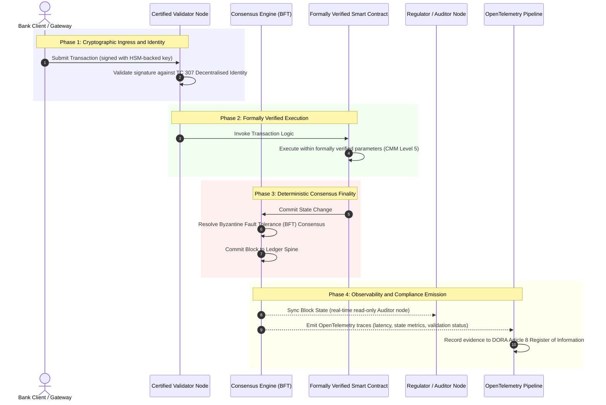

# Von der Evidenz zur Wahrheit: Warum zertifizierte Blockchains die nächste Ära des Bankvertrauens prägen werden

**Unveränderlich ist nicht dasselbe wie vertrauenswürdig.** Während das Firmenkundengeschäft zu Echtzeitabwicklung und probabilistischer KI übergeht, ist das Hauptbuch, das über die Wahrheit entscheidet, zur einen Schicht geworden, die Banken noch immer nicht zertifizieren können. Sie zertifizieren das Institut nach Basel III, die Cloud nach ISO 27001 und ihre KI nach ISO 42001, doch das verteilte Hauptbuch – dessen Governance, Konsens, Kryptografie und Smart Contracts – bleibt anbieterspezifischer Annahme überlassen. Dieser Bericht argumentiert, dass das Schließen dieser Treuhandlücke den Übergang von Leitlinien nach ISO/IEC TC 307 zu präskriptiver Prüfsicherheit erfordert: die Bewertung des Hauptbuchs anhand eines 5-stufigen Certified Blockchain Index, der Engineering-Kennzahlen in board-prüfbare, DORA-belastbare Wahrheit überführt.

<!-- lead-start -->
<aside class="post-lead" aria-label="Artikelzusammenfassung">

<strong>Kurzfassung.</strong> Banken zertifizieren das Institut, die Cloud und ihre KI, doch nicht das Hauptbuch, das zunehmend darüber bestimmt, was wahr ist. ISO/IEC TC 307 liefert Leitlinien, keine Prüfsicherheit. Ein 5-stufiger Certified Blockchain Index bewertet Hauptbuch-Governance, Konsensintegrität, Identität und Kryptografie, Smart-Contract-Prüfsicherheit sowie Observability anhand eines Reifegradmodells und schließt so die Treuhandlücke, indem er der probabilistischen KI ein deterministisches Audit-Rückgrat gibt.

<strong>Zentrale Erkenntnisse</strong>

<ul class="post-lead-takeaways">
  <li><strong>Die treuhänderische Reibungslücke.</strong> Die Bank (Basel III), die Cloud (ISO 27001) und das KI-Governance-System (ISO 42001) lassen sich zertifizieren; das verteilte Hauptbuch, das über die Wahrheit entscheidet, noch nicht. Diese Asymmetrie ist eine aktive operative Schwachstelle.</li>
  <li><strong>DORA macht es persönlich.</strong> Nach DORA Article 5 tragen Bankvorstände direkte, nicht delegierbare Haftung für die Resilienz von Drittparteien- und Hauptbuch-Bereitstellungen, mit persönlichen Sanktionen nach SM&amp;CR im Versagensfall.</li>
  <li><strong>Das KI-Audit-Rückgrat.</strong> Maschinelles Lernen ist nicht reproduzierbar; eine zertifizierte Blockchain erfasst Modellversionen, Eingaben und Validierungsentscheidungen deterministisch on-chain und erfüllt damit ISO 42001 sowie Standards des Modellrisikomanagements.</li>
  <li><strong>Der Certified Blockchain Index.</strong> Governance, Konsens, Kryptografie, Smart Contracts und Observability werden zu einer 0-bis-5-Bewertungskarte nach CMM, die Engineering-Kennzahlen in board-genehmigte Risikoappetit-Erklärungen übersetzt.</li>
</ul>

<strong>Weiterführende Lektüre:</strong> <a href="https://sebastienrousseau.com/2026-07-02-certified-blockchains-banking-trust-tc307-assurance-2026">Zertifizierte Blockchains und Bankvertrauen: Prüfsicherheit nach TC 307</a>, <a href="https://sebastienrousseau.com/2026-07-24-global-payments-outlook-operating-model-risk-revenue">Der globale Zahlungsverkehrsausblick 2026</a>.

</aside>
<!-- lead-end -->

> **Zusammenfassung für die Führungsebene**
>
> - **Das Firmenkundengeschäft steht an einem Wendepunkt.** Echtzeit-Clearing und probabilistische KI durchbrechen das analoge, rückblickende Prüfsicherheitsmodell: statische, institutsbasierte Audits genügen den modernen Anforderungen an Risikomanagement oder Treuhandpflicht nicht mehr.
> - **TC 307 ist eine Grundlinie, kein Zertifikat.** ISO/IEC TC 307 hat Vokabular, Referenzarchitektur und Sicherheitsleitlinien für verteilte Hauptbücher standardisiert, doch der Ansatz ist deskriptiv. Er definiert, wie Gutes aussieht; er liefert nicht die präskriptive Verifizierung, die Risikoverantwortliche und Aufseher benötigen, um einen Produktivbetrieb zu autorisieren.
> - **Prüfsicherheit bedeutet, das Hauptbuch zu bewerten.** Governance, Konsensintegrität, Smart-Contract-Sicherheit und kryptografische Agilität, bewertet anhand eines strengen 5-stufigen Reifegradmodells, führen Banken von flickenhafter, anbieterspezifischer Annahme zu zertifizierbarer, board-prüfbarer finanzieller Wahrheit.
> - **Das Hauptbuch ist das Audit-Rückgrat für KI.** Die Verankerung von Modellversionen, Eingaben und Validierungsentscheidungen im deterministischen Konsens gibt nicht reproduzierbarem maschinellem Lernen eine belastbare, rekonstruierbare Beweisgrundlage nach ISO 42001, SR 11-7 und PRA SS1/23.

## Die treuhänderische Reibungslücke im digitalen Bankwesen

Im klassischen Bankwesen ist Vertrauen relational, institutionell und rückblickend. Es beruht darauf, dass unabhängige externe Prüfer den Finanzstatus zu statischen Zeitpunkten überprüfen und Abweichungen über bilaterale Hauptbuch-Silos hinweg abstimmen. In den echtzeitfähigen, API-gesteuerten Märkten des Jahres 2026 führt dieses Modell zu prohibitiven Latenzen und strukturellen Risiken.

Wenn Transaktionen sofort abgewickelt werden, Intraday-Liquiditätspools dynamisch von API-Gateways gesteuert werden und Vermögenseigentum über gemeinsame Hauptbücher tokenisiert wird, werden rückblickende Audits zu forensischen Übungen statt zu präventiven Kontrollen. Treuhänder können sich nicht mehr allein darauf verlassen, das Unternehmen als Rechtsträger zu zertifizieren. Sie müssen das digitale Substrat selbst zertifizieren.

Derzeit operieren Banken unter einer eklatanten architektonischen Asymmetrie:

1. **Zertifizierte Cloud-Infrastruktur**: Hardware-Knoten, virtualisierte Container und physische Rechenzentren werden gegen ISO/IEC 27001 und SOC 2 Type II Kontrollen validiert.  
2. **Zertifizierte Managementprozesse**: Richtlinien zum operationellen Risiko, Notfallpläne und algorithmische Bereitstellungen unterliegen strengen Risiko-Rahmenwerken.  
3. **Unzertifizierte Hauptbuch-Engines**: Die zentralen verteilten Konsensmechanismen, die Lieferketten der Validator-Knoten, die Grenzen von Smart Contracts und die Netzwerk-Governance-Modelle bleiben unzertifizierten, individuellen oder konsortiumspezifischen Annahmen überlassen.

Diese Asymmetrie ist ein wesentlicher Schwachpunkt. Eine Bank kann eine validierte Anwendung in einem sicheren, ISO 27001-zertifizierten Cloud-Container betreiben, doch wenn dieser Container in ein verteiltes Hauptbuch mit zentralisierter Validator-Kontrolle, anfälligen Konsensparametern oder ungeprüften Smart Contracts schreibt, ist die Transaktionsintegrität kompromittiert. Um diese Lücke zu überbrücken, muss die Hauptbuch-Engine selbst zu einem zertifizierbaren Prüfsicherheitsobjekt werden.

## Die Standardisierungsgrundlinie von ISO/IEC TC 307

Die grundlegende Arbeit zur Standardisierung verteilter Hauptbücher wird durch das ISO/IEC Technical Committee 307 (TC 307\) (Blockchain and distributed ledger technologies) geleistet. Statt Blockchain als isoliertes technisches Protokoll zu behandeln, adressiert TC 307 sie als institutionelle Vertrauensinfrastruktur und organisiert seine Arbeit entlang fünf Kernsäulen:

1. **Taxonomie und Vokabular (ISO 22739\)**: Etabliert eine gemeinsame Nomenklatur und stellt konsistente rechtliche und operative Definitionen über verschiedene Rechtsräume, Finanzschemata und Institute hinweg sicher.  
2. **Referenzarchitektur (ISO/TR 23245\)**: Definiert die Grenzen, Schichten, Datenflüsse und funktionalen Komponenten eines konformen verteilten Hauptbuch-Systems.  
3. **Sicherheit, Datenschutz und Smart Contracts (ISO/TR 23244 / ISO 23613\)**: Etabliert grundlegende Sicherheitsleitlinien für Digital-Asset-Systeme und beschreibt bewährte Verfahren zur Minderung von Schwachstellen in Smart Contracts sowie zur Lebenszyklus-Governance.  
4. **Interoperabilitäts-Rahmenwerke**: Adressiert die Mechanismen zum Daten- und Vermögensaustausch zwischen heterogenen Hauptbuch-Netzwerken und verhindert die Bildung isolierter tokenisierter Silos.  
5. **Dezentrale Identität und Vertrauensanker**: Integriert hauptbuchbasierte kryptografische Identifikatoren mit formalen Public-Key-Infrastrukturen (PKI) und staatlich autorisierten Registern.

Insgesamt signalisiert TC 307 den Übergang der DLT von einer individuellen Engineering-Entscheidung zu einer standardisierten architektonischen Disziplin. Allerdings bleibt TC 307 überwiegend deskriptiv. Es definiert, wie Gutes aussieht (Leitlinien), liefert jedoch nicht das präskriptive Verifizierungsprotokoll (Prüfsicherheit), das Risikoverantwortliche und Aufseher benötigen, um Produktivbereitstellungen kritischer oder wichtiger Funktionen (CIFs) zu autorisieren.

## Leitlinien vs. Prüfsicherheit: Die treuhänderische Unterscheidung

Finanzmarktteilnehmer setzen Technologie nicht ein, weil sie innovativ oder elegant ist; sie setzen sie ein, wenn sie steuerbar, prüfbar, verteidigbar und mit den Eigenkapitalanforderungen abstimmbar ist. Deshalb löst sich Standardisierung im Bankwesen natürlicherweise in zwei Ebenen auf:

* **Leitlinien (Das Rahmenwerk)**: Skizzieren bewährte Verfahren, Referenzziele und architektonische Richtlinien (z. B. ISO/IEC TC 307, NIST-Rahmenwerke).  
* **Prüfsicherheit (Der Nachweis)**: Liefert unabhängige, kontinuierliche und durch Dritte überprüfbare Evidenz, dass das Rahmenwerk wie vorgesehen umgesetzt ist und funktioniert (z. B. ISO 27001-Zertifizierung, SOC 2 Audits, aufsichtliche Prüfungen).

Sich auf unzertifizierten Hauptbuch-Konsens zu verlassen, während man die Cloud-Infrastruktur zertifiziert, ist eine kritische regulatorische Lücke. Eine Blockchain, die „unveränderlich“ ist, ist nicht zwangsläufig „institutionell vertrauenswürdig“. Unveränderlichkeit garantiert nur, dass die eingegebenen Daten unverändert bleiben; sie verifiziert nicht, dass die Validator-Knoten sicher sind, das Konsensprotokoll gegen Kollusion resilient ist, die Smart-Contract-Logik mathematisch fundiert ist oder das kryptografische Schlüsselmanagement Post-Quanten-Vorgaben erfüllt.

Um diese Lücke zu schließen, formalisiert der Certified Blockchain Index 2026 diese Anforderungen in einem quantifizierbaren Reifegradmodell (CMM), das auf globale Bankregulierungen abgebildet ist.

## Der Certified Blockchain Index 2026

Um dem oberen Management die Bewertung und Zertifizierung seiner Hauptbuch-Plattformen zu ermöglichen, strukturiert dieser Index die verteilte Hauptbuch-Infrastruktur in fünf prüfbare operative Schichten, bewertet auf einer 0-bis-5-CMM-Skala.

### Tabelle 1: Die Architektur des Certified Blockchain Index

| Index-Schicht | Reifegrad (CMM) | Technische und operative Kennzahl | Regulatorische / treuhänderische Kontrollreferenz |
| ---- | ---- | ---- | ---- |
| **Hauptbuch-Governance** | **Level 0**: Ad-hoc-Konsortium**Level 3**: Automatisierte Validator-Prüfung und -Rotation**Level 5**: Dezentrale, mehrparteiige kryptografische Identitätsverankerung | % der von geprüften Finanzinstituten betriebenen Validator-Knoten; durchschnittliche Zeit zur Beilegung von Validator-Streitigkeiten; geografische Verteilung der Knoten | **DORA Article 5** (Governance und Organisation); **CPMI-IOSCO PFMI Prinzip 2** (Governance) und **Prinzip 3** (Rahmen für das umfassende Risikomanagement) |
| **Konsensintegrität** | **Level 0**: Einzelknoten oder undurchsichtiger POW**Level 3**: Geprüfter BFT mit deterministischer Endgültigkeit**Level 5**: Mehrjurisdiktionaler, formal verifizierter Konsens mit kontinuierlicher Latenzüberwachung | Maximal tolerierbare Konsenslatenz; Kollusions-Resistenzschwelle; Uptime-SLA bei simulierter Knotenpartitionierung | **DORA Article 6** (Rahmenwerk für das IKT-Risikomanagement); **CPMI-IOSCO PFMI Prinzip 8** (Abwicklungsendgültigkeit) |
| **Identität und Kryptografie** | **Level 0**: Schwache RSA- / ECDSA-Schlüssel**Level 3**: Multi-Sig mit HSM-gestütztem Schlüsselmanagement**Level 5**: Quantensichere Hybridschlüssel (FIPS 203 ML-KEM) und Zero-Knowledge-Datenschutz-Gates | % der mit HSM-gestützten Schlüsseln signierten Hauptbuch-Transaktionen; PQC-Migrationsreife-Score; ZK-Proof-Latenz | **NIST FIPS 203 / 204**; **ISO/IEC 27001** (Informationssicherheits-Management) |
| **Smart-Contract-Prüfsicherheit** | **Level 0**: Ungeprüfte Solidity-Skripte**Level 3**: Automatisierte Compiler-Validierung und externe Prüfung**Level 5**: Formal verifizierte, unveränderliche Smart Contracts mit Circuit-Breaker-Upgrades | % der Smart Contracts mit mathematischer formaler Verifizierung; Anzahl der Compiler-Warnungen; Abdeckung durch Schwachstellen-Scans | **EBA-Leitlinien zu Auslagerungen** (Absätze 81, 113-117); **DORA Article 30** (Mindestvertragsklauseln) |
| **Audit und Observability** | **Level 0**: Manuelles Log-Scraping**Level 3**: Strukturierte OTel-Traces und schreibgeschützte Prüfer-Knoten**Level 5**: Automatisierte, kontinuierliche Abstimmung mit dem Register nach Article 8 | % der durch OpenTelemetry-Traces abgedeckten Transaktionen; Latenz vom Hauptbuch-Block-Commit bis zur Prüfer-Knoten-Synchronisierung | **BCBS 239** (Risikodatenaggregation); **DORA Article 8** (Informationsregister / ITS-Schemata) |

### Tabelle 2: Zentrale Vertrauenssignale, abgebildet auf globale Bankstandards

| Signal / Benchmark | Kennzahl | Auswirkung auf Bankplattformen | Regulatorische Quelle |
| ---- | ---- | ---- | ---- |
| **Fortschritt bei ISO/IEC TC 307** | Übergang von technischen Berichten nach ISO/TR zu formalen Zertifizierungsschemata | Etabliert das erste standardisierte Rahmenwerk zur Zertifizierung verteilter Hauptbuch-Engines | **ISO/IEC JTC 1 / SC 44** (Distributed Ledger Technologies) |
| **Prototypphase von Project Agorá** | Über 40 teilnehmende Geschäftsbanken; Test tokenisierter Einlagen auf einem einheitlichen Hauptbuch | Verlagerung des grenzüberschreitenden Clearings vom Nachrichtenaustausch (SWIFT) zur atomaren tokenisierten Abwicklung | **Bank for International Settlements (BIS) Innovation Hub** |
| **Drittparteien-Audit nach DORA Article 30** | 100 % der Knotenanbieter und Infrastruktur-Hoster gegen Sicherheitskriterien geprüft | Beseitigt „Schatten-Validator-Knoten“; verlangt vollständige Transparenz der Lieferkette | **Europäische Aufsichtsbehörden (ESA)** |
| **ISO/IEC 42001 (KI-Governance)** | Kryptografisch unveränderlich gemachte KI-Modell- und Trainingsprotokolle on-chain | Setzt Blockchain als unveränderliches Beweis-Hauptbuch („Audit-Rückgrat“) für maschinelles Lernen ein | **ISO/IEC 42001:2023** (Informationstechnik, Künstliche Intelligenz) |
| **Basel III Kapitaladäquanz** | Reduzierung der Kapitalpuffer für operationelle Risiken auf Basis dokumentierter Komplexitätsreduktion | Standardisierte Rahmenwerke für operationelle Risiken rechnen verifizierte Hauptbuch-Resilienz unmittelbar an | **Basler Ausschuss für Bankenaufsicht (BCBS)** |

## Das KI-„Audit-Rückgrat“: Probabilistische Intelligenz auf deterministischer Infrastruktur

Eine der wirkungsvollsten strategischen Rollen einer zertifizierten Blockchain im Jahr 2026 ist die eines **„Audit-Rückgrats“** für den Einsatz künstlicher Intelligenz. Moderne Finanzsysteme werden zunehmend probabilistisch. Kreditbewertung, Echtzeit-Betrugserkennung, algorithmischer Handel und autonome Kundeninteraktionen werden von Modellen des maschinellen Lernens angetrieben, die sich über die Zeit weiterentwickeln, driften und anpassen. Diese Modelle sind nicht deterministisch: Bei derselben Eingabe zu zwei verschiedenen Zeitpunkten können sie aufgrund dynamischer Gewichte und kontinuierlichen Trainings unterschiedliche Ergebnisse liefern.

Dieser Nicht-Determinismus wirft unter **ISO/IEC 42001 (KI-Governance)** und den Standards des Modellrisikomanagements (MRM) (wie **US Federal Reserve SR 11-7** und **UK PRA SS1/23**) eine tiefgreifende Governance-Herausforderung auf: *Wie prüft, erklärt und verteidigt man Entscheidungen, die nicht strikt reproduzierbar sind?*

Ein zertifiziertes verteiltes Hauptbuch liefert das deterministische Gegengewicht. Während KI-Modelle probabilistisch arbeiten, erfasst die zertifizierte Blockchain ihre Parameter deterministisch und etabliert damit ein unveränderliches Beweis-Rückgrat:

* **Modellversionierung und Gewichtsverankerung**: Jede bereitgestellte Modellversion, ihre zugehörigen Gewichte und die Prüfsummen ihrer Trainingsdaten werden gehasht und zur Build-Zeit in das Hauptbuch geschrieben, wodurch die Lieferkettenanforderungen von **SLSA Level 3** erfüllt werden.  
* **Kontextbezogene Eingabeprotokollierung**: Wenn ein KI-Modell eine kritische Entscheidung ausführt (z. B. die Genehmigung eines Kredits oder das Markieren einer Transaktion), werden die genauen kontextbezogenen Eingaben und Modell-Hashes in das Hauptbuch geschrieben und so eine manipulationssichere Historie geschaffen.  
* **Prüfbarkeit ohne Code-Zugriff**: Wenn ein Aufseher fragt: „Warum hat Ihr Modell diesen Kreditantrag am 3. Juni abgelehnt?“, muss die Bank weder proprietären Code offenlegen noch versuchen, den exakten Modellzustand nachzubilden. Sie legt den kryptografisch signierten On-Chain-Hauptbuch-Datensatz der Eingaben, Gewichte und des Validierungsstatus vor.

Indem die probabilistischen Entscheidungen von Modellen des maschinellen Lernens im deterministischen Konsens einer zertifizierten Blockchain verankert werden, schafft das Institut eine belastbare, rekonstruierbare und unabhängig überprüfbare Chronologie automatisierter Handlungen.

## Visualisierung der zertifizierten Konsens-zu-Audit-Pipeline

Das folgende Sequenzdiagramm veranschaulicht den Lebenszyklus einer Transaktion, die eine zertifizierte Blockchain-Plattform durchläuft, und zeigt, wie Validierungs-Gates, Konsensintegrität, Smart-Contract-Ausführung und Telemetrie-Emission ineinandergreifen, um board-fertige regulatorische Evidenz zu erzeugen:

Der kritische Pfad dieser Transaktionssequenz erfordert, dass jeder Validierungs-, Ausführungs- und Konsensschritt kryptografisch signiert ist, um eine durchgängige Provenienz sicherzustellen. Der Prüfer-Knoten des Aufsehers synchronisiert den Blockzustand in Echtzeit und macht rückblickende, manuelle Finanzabstimmung überflüssig.

## Das Führungshandbuch für Senior Manager

Um den Wandel von organisatorischem Vertrauen zu infrastrukturellem Vertrauen erfolgreich zu steuern, sollten Bankvorstände und leitende Führungskräfte umgehend vier zentrale Direktiven umsetzen:

1. **Hauptbuch-Audits im Enterprise Risk Management (ERM) vorschreiben**: Eine Richtlinie durchsetzen, wonach keine verteilte Hauptbuch-Plattform – ob privat, öffentlich oder konsortiumsbasiert – für kritische oder wichtige Funktionen (CIFs) bereitgestellt werden darf, sofern sie nicht gegen die 5-schichtige **Architektur des Certified Blockchain Index** (mindestens CMM Level 3) geprüft wurde.  
2. **Blockchains als KI-Beweis-Rückgrat nach ISO 42001 integrieren**: Den Chief Risk Officer und den leitenden KI-Architekten anweisen, alle Modelle des maschinellen Lernens mit hoher Auswirkung mit einer zertifizierten Blockchain zu integrieren und so ein manipulationssicheres Audit-Hauptbuch der Modellversionen, Gewichte, Eingaben und Entscheidungen zu schaffen.  
3. **Die Lieferkette der Validator-Knoten prüfen (DORA Article 30\)**: Die Beschaffungsabteilung verpflichten, alle Drittparteien zu prüfen, die Validator-Knoten hosten oder das Cloud-Hosting für DLT-Netzwerke verwalten, und die Einhaltung derselben Standards für Cybersicherheit und operative Resilienz vorzuschreiben, die für die internen Cloud-Knoten der Bank gelten.  
4. **Hauptbuch-Architekturen an CPMI-IOSCO und BCBS 239 ausrichten**: Das Plattform-Engineering-Team anweisen, die Ausgabe-Telemetrie des Hauptbuchs unmittelbar an den Berichtsanforderungen von **BCBS 239** auszurichten und sicherzustellen, dass die Parameter für Konsens und Abwicklungsendgültigkeit den **CPMI-IOSCO Prinzipien 8 und 9** strikt entsprechen.

## Häufig gestellte Fragen

**Ist ISO/IEC TC 307 ein Zertifizierungsstandard?**  
Nein. ISO/IEC TC 307 ist ein technisches Komitee, das Vokabular, Referenzarchitekturen und Sicherheitsleitlinien etabliert. Während es definiert, „wie Gutes aussieht“ (Leitlinien), muss die Branche diese Dokumente in formale, prüfbare Zertifizierungsschemata (Prüfsicherheit) überführen, um Bankaufseher zufriedenzustellen.

**Wie unterstützt eine zertifizierte Blockchain die DORA-Compliance?**  
Nach DORA Article 5 tragen Bankvorstände direkte, persönliche Haftung für die Technologie-Resilienz. Eine zertifizierte Blockchain liefert überprüfbare, kryptografische Evidenz für Konsensintegrität, Kontrolle der Validator-Lieferkette und Smart-Contract-Sicherheit und gibt Vorstandsmitgliedern die dokumentierbaren „angemessenen Schritte“ an die Hand, die zur Abwehr persönlicher Haftungsansprüche nach SM\&CR erforderlich sind.

**Worin besteht der Unterschied zwischen einem traditionellen Hauptbuch-Audit und einem zertifizierten Blockchain-Audit?**  
Ein traditionelles Audit ist rückblickend und verifiziert manuelle Einträge und statische Dateien, nachdem Transaktionen abgewickelt wurden. Ein zertifiziertes Blockchain-Audit ist kontinuierlich und in Echtzeit; die Validator-Knoten, die BFT-Konsens-Engine und die formal verifizierten Smart Contracts sind zertifiziert, Transaktionen deterministisch auszuführen, und geben strukturierte Telemetrie (OpenTelemetry) aus, die den Zustand des Systems fortlaufend validiert.

**Können öffentliche Blockchains für den Bankeinsatz zertifiziert werden?**  
In den meisten Rechtsräumen erfüllen rein zugangsoffene öffentliche Blockchains die Bankregulierungen nicht, da es an Validator-Identitätsprüfung, planbaren Gas- / Transaktionskosten und deterministischer Endgültigkeit fehlt (z. B. probabilistische Proof-of-Work- / Proof-of-Stake-Forks). Zertifizierte Blockchains im Bankwesen nutzen typischerweise unternehmensweit zugangsbeschränkte oder stark regulierte öffentlich-hybride Architekturen, in denen die Betreiber der Validator-Knoten identifizierte und geprüfte Finanzinstitute sind.

## Quellenverzeichnis

* Basel Committee on Banking Supervision (BCBS), 2013\. *Principles for effective risk data aggregation and reporting (BCBS 239\)*. Basel: Bank for International Settlements. Verfügbar unter: [Basel Committee on Banking Supervision (BCBS), 2013\.](https://www.bis.org/publ/bcbs239.pdf "Basel Committee on Banking Supervision (BCBS), 2013\.").  
* Committee on Payments and Market Infrastructures and Technical Committee of the International Organisation of Securities Commissions (CPMI-IOSCO), 2012\. *Principles for financial market infrastructures*. Basel: Bank for International Settlements. Verfügbar unter: [Committee on Payments and Market Infrastructures and Technical Committee of the International Organisation of Securities Commissions (CPMI-IOSCO), 2012\.](https://www.bis.org/cpmi/publ/d101.htm "Committee on Payments and Market Infrastructures and Technical Committee of the International Organisation of Securities Commissions (CPMI-IOSCO), 2012\.").  
* European Banking Authority (EBA), 2019\. *EBA/GL/2019/02, Guidelines on outsourcing arrangements*. Paris: EBA. Verfügbar unter: [European Banking Authority (EBA), 2019\.](https://www.eba.europa.eu/regulation-and-policy/internal-governance/guidelines-on-outsourcing-arrangements "European Banking Authority (EBA), 2019\.").  
* European Parliament and Council of the European Union, 2022\. *Regulation (EU) 2022/2554 on digital operational resilience for the financial sector (DORA)*. Brussels: Official Journal of the European Union. Verfügbar unter: [European Parliament and Council of the European Union, 2022\.](https://eur-lex.europa.eu/legal-content/EN/TXT/?uri=CELEX%3A32022R2554 "European Parliament and Council of the European Union, 2022\.").  
* ISO/IEC JTC 1/SC 42, 2023\. *ISO/IEC 42001:2023, Information technology, Artificial intelligence, Management system*. Geneva: International Organisation for Standardisation. Verfügbar unter: [ISO/IEC JTC 1/SC 42, 2023\.](https://www.iso.org/standard/81230.html "ISO/IEC JTC 1/SC 42, 2023\.").  
* ISO/IEC Technical Committee 307, 2020\. *ISO/IEC 22739:2020, Blockchain and distributed ledger technologies, Vocabulary*. Geneva: International Organisation for Standardisation. Verfügbar unter: [ISO/IEC Technical Committee 307, 2020\.](https://www.iso.org/standard/73771.html "ISO/IEC Technical Committee 307, 2020\.").  
* National Institute of Standards and Technology (NIST), 2026\. *First Three Finalised Post-Quantum Encryption Standards (FIPS 203, 204, and 205\)*. Gaithersburg: U.S. Department of Commerce. Verfügbar unter: [National Institute of Standards and Technology (NIST), 2026\.](https://www.nist.gov/news-events/news/2024/08/nist-releases-first-3-finalized-post-quantum-encryption-standards "National Institute of Standards and Technology (NIST), 2026\.").
