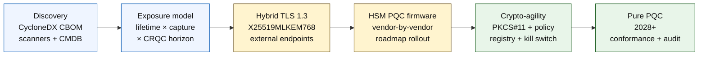

## Ο Δείκτης Κβαντικά Ασφαλούς Τραπεζικής το 2026: Μετακβαντική Κρυπτογραφία, QKD, Κρυπτο-ευελιξία και Κίνδυνος Harvest-Now-Decrypt-Later

Η κβαντικά ασφαλής τραπεζική το 2026 αφορά τη λειτουργική μετάβαση, όχι τις εικασίες. Το NIST έχει οριστικοποιήσει τα πρώτα τρία πρότυπα μετακβαντικής κρυπτογραφίας, και οι τράπεζες πρέπει τώρα να κατανοήσουν ποια συστήματα εξαρτώνται από RSA, ECC, TLS, υπογραφές, HSM, πιστοποιητικά, κανάλια πληρωμών, αρχεία και εμπιστευτικά δεδομένα μακράς διάρκειας. Το ερώτημα του δείκτη είναι απλό: μπορεί το ίδρυμα να αντικαταστήσει την κρυπτογραφία προτού η απειλή γίνει λειτουργική;

---

> **Σύνοψη για τη Διοίκηση / Βασικά Συμπεράσματα**
>
> - **Τα πρότυπα NIST είναι πλέον συγκεκριμένα.** Το FIPS 203 ορίζει το ML-KEM για ενθυλάκωση κλειδιού, το FIPS 204 ορίζει το ML-DSA για υπογραφές και το FIPS 205 ορίζει το SLH-DSA ως πρότυπο υπογραφής χωρίς κατάσταση, βασισμένο σε κατακερματισμό (hash).
> - **Η απογραφή είναι η πρώτη πύλη ωριμότητας.** Μια τράπεζα δεν μπορεί να μεταβεί από ό,τι δεν μπορεί να εντοπίσει: πιστοποιητικά, κλειδιά, πρωτόκολλα, εφαρμογές, προμηθευτές, HSM, API, αρχεία και ενσωματωμένα συστήματα πρέπει να χαρτογραφηθούν.
> - **Η κρυπτο-ευελιξία είναι ο ανθεκτικός στόχος.** Ο στόχος δεν είναι μια εφάπαξ αντικατάσταση αλγορίθμου· είναι η δυνατότητα αλλαγής κρυπτογραφικών πρωτογενών στοιχείων χωρίς επανασχεδιασμό ολόκληρων εφαρμογών.
> - **Τα δεδομένα μακράς διάρκειας αλλάζουν την επείγουσα ανάγκη.** Ο κίνδυνος harvest-now-decrypt-later σημαίνει ότι δεδομένα που καταγράφονται σήμερα ενδέχεται να γίνουν αναγνώσιμα αργότερα, εάν παραμείνουν πολύτιμα για αρκετό χρόνο.
> - **Το [QKD](/2023-12-11-quantum-key-distribution-revolutionising-security-in-banking/index.html) είναι ένα εξειδικευμένο συμπλήρωμα.** Η κβαντική διανομή κλειδιών μπορεί να είναι σχετική για τα κανάλια υψηλότερης αξίας, αλλά δεν αντικαθιστά τη μετάβαση PQC σε επίπεδο ιδρύματος.
>
---

## Γιατί το 2026 Είναι η Χρονιά που Αυτός ο Δείκτης Έχει Σημασία

Τρεις αλλαγές το 2024-2025 μετέτρεψαν την κβαντική ασφάλεια από ερευνητικό σημείο παρακολούθησης σε μετρήσιμο τραπεζικό πρόγραμμα. Πρώτον, το NIST οριστικοποίησε τα κύρια μετακβαντικά πρότυπα στις 13 Αυγούστου 2024: [FIPS 203 (ML-KEM) ⧉](https://nvlpubs.nist.gov/nistpubs/FIPS/NIST.FIPS.203.pdf "FIPS 203 — Module-Lattice-Based Key-Encapsulation Mechanism"), [FIPS 204 (ML-DSA) ⧉](https://nvlpubs.nist.gov/nistpubs/FIPS/NIST.FIPS.204.pdf "FIPS 204 — Module-Lattice-Based Digital Signature Standard"), [FIPS 205 (SLH-DSA) ⧉](https://nvlpubs.nist.gov/nistpubs/FIPS/NIST.FIPS.205.pdf "FIPS 205 — Stateless Hash-Based Digital Signature Standard"). Η συζήτηση για την επιλογή αλγορίθμου έκλεισε εκείνη την ημερομηνία· οι τράπεζες που ακόμη διεξάγουν εσωτερικές ροές εργασίας τύπου «ποιο σχήμα κερδίζει» το 2026 είναι 18 μήνες πίσω.

Δεύτερον, το [CNSA 2.0 της NSA ⧉](https://media.defense.gov/2022/Sep/07/2003071834/-1/-1/0/CSA_CNSA_2.0_ALGORITHMS_.PDF "Commercial National Security Algorithm Suite 2.0") όρισε την τελική κατάσταση για το ομοσπονδιακό επίπεδο των ΗΠΑ στο 2033, με ενδιάμεσα όρια που ξεκινούν το 2027 για την υπογραφή λογισμικού και firmware, και το 2030 για τα προγράμματα περιήγησης και τα λειτουργικά συστήματα. Οποιαδήποτε τράπεζα με έκθεση σε ομοσπονδιακούς αντισυμβαλλομένους των ΗΠΑ — FedNow, λειτουργίες Υπουργείου Οικονομικών, ομοσπονδιακοί λογαριασμοί πελατών — βρίσκεται εντός αυτής της περιμέτρου για τα συστήματα που αγγίζουν ομοσπονδιακά δεδομένα. Το ρολόι δεν είναι πλέον αφηρημένο.

Τρίτον, το [Harvest-Now-Decrypt-Later (HNDL) ⧉](https://csrc.nist.gov/Projects/post-quantum-cryptography "NIST Post-Quantum Cryptography programme") είναι το φέρον επιχείρημα κινδύνου για την επείγουσα ανάγκη. Εξελιγμένοι αντίπαλοι καταγράφουν ήδη μηνύματα πληρωμών προστατευμένα με TLS, φακέλους SWIFT, τεκμηρίωση KYC και κρυπτοκείμενο αρχείων μακράς διάρκειας σε μεγάλα χρηματοπιστωτικά κέντρα. Τα δεδομένα που καταγράφονται το 2026 χρειάζεται μόνο να παραμένουν ευαίσθητα ως προς την εμπιστευτικότητα τη στιγμή της αποκρυπτογράφησης — για 30ετή στεγαστικά δάνεια, ασφαλιστική αξιολόγηση ζωής, καταγραφές συναλλαγών MiFID II / GDPR και αρχεία διατήρησης M&A, αυτό το παράθυρο εκτείνεται πολύ πέρα από κάθε αξιόπιστη εκτίμηση για έναν Κρυπτογραφικά Σημαντικό Κβαντικό Υπολογιστή (CRQC). Ο αντίπαλος δεν χρειάζεται κβαντικό υπολογιστή σήμερα. Χρειάζεται έναν προτού τα δεδομένα πάψουν να έχουν σημασία.

Ο Δείκτης Κβαντικά Ασφαλούς Τραπεζικής μετρά κατά πόσο το ίδρυμά σας μπορεί να ολοκληρώσει τη μετάβαση προτού φτάσει εκείνη η διασταύρωση. Η εργασία δεν αφορά πλέον το αν θα μεταβεί κανείς· αφορά το αν η μετάβαση θα ολοκληρωθεί σε ένα υπερασπίσιμο χρονοδιάγραμμα.

## Η Αρχιτεκτονική του Δείκτη το 2026

| Επίπεδο Δείκτη | Κατεύθυνση 2026 | Μετρική Ετοιμότητας | Κίνδυνος σε Περίπτωση Κακού Χειρισμού |
|---|---|---|---|
| **Απογραφή** | Χαρτογράφηση κρυπτογραφικών περιουσιακών στοιχείων, πρωτοκόλλων, πιστοποιητικών, προμηθευτών και κατηγοριών δεδομένων | Ποσοστό του χαρτοφυλακίου που έχει απογραφεί | Άγνωστες εξαρτήσεις ευάλωτες στους κβαντικούς υπολογιστές |
| **Έκθεση** | Ταξινόμηση συστημάτων ανά διάρκεια εμπιστευτικότητας και κρισιμότητα συναλλαγών | Περιουσιακά στοιχεία υψηλού κινδύνου ανά αξία και διάρκεια | Λανθασμένη ιεράρχηση της μετάβασης |
| **Μετάβαση** | Υιοθέτηση υβριδικών και έτοιμων για PQC προτύπων ευθυγραμμισμένων με τα πρότυπα NIST | Ετοιμότητα ML-KEM και ML-DSA | Επείγουσα ανακατασκευή πλατφόρμας υπό προθεσμία |
| **Κρυπτο-ευελιξία** | Διαχωρισμός της λογικής της εφαρμογής από τα κρυπτογραφικά πρωτογενή στοιχεία | Κάλυψη κρυπτογραφίας ελεγχόμενη από πολιτική | Ενσωματωμένοι στον κώδικα αλγόριθμοι σε όλο το χαρτοφυλάκιο |
| **Διασφάλιση** | Δοκιμή διαλειτουργικότητας, απόδοσης, υποστήριξης HSM, πιστοποιητικών και ετοιμότητας προμηθευτών | Ποσοστό επιτυχίας δοκιμών και ανεκτέλεστο εξαιρέσεων | Κατεστραμμένα κανάλια ή αδύναμοι εφεδρικοί έλεγχοι |

### Ο Κβαντικός Πίνακας Αποτελεσμάτων σε Επίπεδο Διοικητικού Συμβουλίου

Ένας αξιόπιστος πίνακας αποτελεσμάτων κβαντικής ετοιμότητας απαιτεί την παρακολούθηση ακριβών ποσοστών, όχι απλώς της κατάστασης των έργων:

1. **Πληρότητα Απογραφής:** Το ποσοστό των εφαρμογών επιπέδου 1 (tier-1) με πλήρως χαρτογραφημένο Κρυπτογραφικό Κατάλογο Υλικών (CBOM).
2. **Έκθεση HNDL:** Ο όγκος των εμπιστευτικών δεδομένων μακράς διάρκειας (π.χ. προσωπικά δεδομένα, εμπορικά μυστικά) που μεταδίδονται μέσω δικτύων χωρίς υβριδική κβαντικά ασφαλή ενθυλάκωση κλειδιού.
3. **Πρόοδος Μετάβασης NIST:** Το ποσοστό των κλειδιών ασύμμετρης κρυπτογράφησης και των ψηφιακών υπογραφών που έχουν μεταβεί στα πρότυπα FIPS 203 (ML-KEM) και FIPS 204 (ML-DSA).
4. **Ετοιμότητα Κρυπτο-ευελιξίας:** Το ποσοστό των κρίσιμων συστημάτων όπου οι κρυπτογραφικοί αλγόριθμοι μπορούν να εναλλάσσονται μέσω κεντρικής πολιτικής, χωρίς να απαιτείται εκ νέου μεταγλώττιση του κώδικα.

## Τρέχοντα Σήματα προς Παρακολούθηση

| Σήμα | Τι Σημαίνει για τις Τράπεζες | Πηγή |
|---|---|---|
| **FIPS 203 ML-KEM** | Κύριο πρότυπο NIST για τη γενική εγκατάσταση κλειδιού κρυπτογράφησης | [NIST ⧉](https://www.nist.gov/news-events/news/2024/08/nist-releases-first-3-finalized-post-quantum-encryption-standards "First three finalized post-quantum encryption standards") |
| **FIPS 204 ML-DSA** | Κύριο πρότυπο NIST για ψηφιακές υπογραφές | [NIST ⧉](https://www.nist.gov/news-events/news/2024/08/nist-releases-first-3-finalized-post-quantum-encryption-standards "First three finalized post-quantum encryption standards") |
| **FIPS 205 SLH-DSA** | Εναλλακτική υπογραφή βασισμένη σε κατακερματισμό και εφεδρικός σχεδιασμός | [NIST ⧉](https://www.nist.gov/news-events/news/2024/08/nist-releases-first-3-finalized-post-quantum-encryption-standards "First three finalized post-quantum encryption standards") |
| **Ενθαρρύνεται η άμεση ενσωμάτωση** | Το NIST λέει ρητά στους διαχειριστές να αρχίσουν να ενσωματώνουν τα πρότυπα, επειδή η πλήρης ενσωμάτωση χρειάζεται χρόνο | [NIST ⧉](https://www.nist.gov/news-events/news/2024/08/nist-releases-first-3-finalized-post-quantum-encryption-standards "First three finalized post-quantum encryption standards") |
| **Τα κβαντικά προγράμματα των τραπεζών επεκτείνονται** | Μεγάλες τράπεζες εξερευνούν κβαντικές τεχνολογίες ενώ προετοιμάζουν τις μεταβάσεις PQC | [Quantum Insider ⧉](https://thequantuminsider.com/2026/03/27/15-plus-global-banks-probing-the-wonderful-world-of-quantum-technologies/ "Overview of global banks exploring quantum technologies") |

## Η Μετάβαση Ξεκινά με το Καθολικό της Κρυπτογραφίας

Η ακολουθία της μετάβασης είναι πλέον καλά κατανοητή. Κάθε πύλη παράγει αποδείξεις που τροφοδοτούν την επόμενη· η παράλειψη ή η συμπίεση μιας πύλης είναι αυτό που δημιουργεί τον κίνδυνο επείγουσας ανακατασκευής πλατφόρμας που εμφανίζεται στη στήλη αποτυχίας της Αρχιτεκτονικής του Δείκτη.

Το πρώτο παραδοτέο δεν είναι ένας νέος αλγόριθμος· είναι ένας κρυπτογραφικός κατάλογος υλικών (CBOM). Οι τράπεζες χρειάζονται μια ζωντανή απογραφή που συνδέει τις επιχειρηματικές υπηρεσίες με τους αλγορίθμους, τις βιβλιοθήκες, τα πιστοποιητικά, τα μήκη κλειδιών, τα HSM, τις διάρκειες δεδομένων, τους προμηθευτές και τους λειτουργικούς υπευθύνους. Χωρίς αυτό το καθολικό, η κβαντικά ασφαλής μετάβαση γίνεται εικασία.

Το σύνολο εγγραφών του CBOM θα πρέπει να καταγράφει, για κάθε κρυπτογραφικό πρωτογενές στοιχείο: το πρωτόκολλο ή τη διεπαφή (TLS 1.3, IPsec, SSH, προσαρμοσμένη μορφή μηνύματος πληρωμής), τον αλγόριθμο και το σύνολο παραμέτρων (RSA-2048, ECDH P-256, ML-KEM-768, ML-DSA-65), τη βιβλιοθήκη και την έκδοση (OpenSSL 3.4, BoringSSL commit hash, build του SDK του προμηθευτή), το όριο υλικού (διαμέρισμα HSM, TPM, ασφαλής θύλακας ή κανένα), την ταυτότητα του πιστοποιητικού εφόσον ισχύει, τον υπεύθυνο της εφαρμογής και τη διάρκεια ταξινόμησης δεδομένων. Εργαλεία που φτάνουν σε παραγωγή το 2025-2026 — IBM Quantum Safe Inventory, η ανοιχτού κώδικα [προδιαγραφή CycloneDX CBOM ⧉](https://cyclonedx.org/capabilities/cbom/ "CycloneDX Cryptography Bill of Materials"), εταιρικοί σαρωτές από CryptoNext / Sandbox / PQShield — ενσωματώνονται στις υπάρχουσες ροές CMDB. Κανένα από αυτά δεν είναι πλήρες από μόνο του· αναμείνατε έναν κύκλο κατασκευής CBOM 12-18 μηνών, ακόμη και με εργαλεία προμηθευτών και αφοσιωμένο προσωπικό.

Η μετρική προς παρακολούθηση είναι η επικαιρότητα, όχι η κάλυψη. Ένα CBOM που είναι δύο μήνες παρωχημένο είναι χειρότερο από την πλήρη απουσία CBOM, επειδή δίνει στην ομάδα ασφαλείας ψευδή αίσθηση σιγουριάς για το τι έχει μεταβεί.

## Πρώτα Υβριδικά, Πάντα Ευέλικτα

Οι περισσότερες τράπεζες δεν θα αλλάξουν τα πάντα ταυτόχρονα. Το ρεαλιστικό μοτίβο είναι η υβριδική ανάπτυξη, όπου κλασικοί και μετακβαντικοί μηχανισμοί λειτουργούν μαζί ενώ οι προμηθευτές, τα πρωτόκολλα, τα πιστοποιητικά και τα λειτουργικά εργαλεία ωριμάζουν. Ο μακροπρόθεσμος στόχος είναι η κρυπτο-ευελιξία: κρυπτογραφικές επιλογές ελεγχόμενες από πολιτική που μπορούν να αλλάξουν χωρίς την ανακατασκευή της επιχειρηματικής εφαρμογής.

[Εισαγωγή Διαδραστικού Στοιχείου: Υπολογιστής Κινδύνου Harvest-Now-Decrypt-Later (HNDL) — Ένα εργαλείο βασισμένο σε ολισθητή, όπου τα στελέχη εισάγουν τη διάρκεια ζωής των δεδομένων έναντι του εκτιμώμενου κβαντικού χρονοδιαγράμματος για να δουν το παράθυρο έκθεσής τους.]

> **Βασική διαπίστωση:** Εάν τα δεδομένα σας πρέπει να παραμείνουν εμπιστευτικά για 10 χρόνια, και ένας Κρυπτογραφικά Σημαντικός Κβαντικός Υπολογιστής (CRQC) απέχει 7 χρόνια, η προθεσμία της μετάβασής σας δεν είναι σε 7 χρόνια — ήταν 3 χρόνια πριν.

Στην πράξη αυτό σημαίνει TLS 1.3 με το υβριδικό κοινό κλειδί `X25519MLKEM768` για τα εξωτερικά σημεία πρόσβασης (οι Chrome / Firefox / Cloudflare / Akamai το υποστηρίζουν όλοι σήμερα), κλασικές αλυσίδες υπογραφών μέχρι να προλάβει η υποδομή HSM και CA, και ένα επίπεδο αφαίρεσης PKCS#11 που επιτρέπει στο μητρώο πολιτικής να εναλλάσσει αλγορίθμους χωρίς εκ νέου μεταγλώττιση των επιχειρηματικών εφαρμογών. Η κρυπτο-ευελιξία είναι αυτό που καθορίζει αν η επόμενη μετάβαση αλγορίθμου (το πότε, όχι το αν) θα είναι μια εναλλαγή έξι εβδομάδων ή ένα ακόμη επταετές πρόγραμμα.

## Πού Ταιριάζει το QKD

Η κβαντική διανομή κλειδιών ανήκει στον δείκτη ως επιλογή καναλιού υψηλής ευαισθησίας, ειδικά για την υποδομή των χρηματοπιστωτικών αγορών, τη συνδεσιμότητα με κεντρικές τράπεζες και εξαιρετικά ευαίσθητες θεσμικές ροές. Θα πρέπει να αντιμετωπίζεται ως συμπλήρωμα του PQC, όχι ως δικαιολογία για την καθυστέρηση της μετάβασης σε επίπεδο επιχείρησης.

## Τι Σημαίνει Αυτό ανά Τύπο Τράπεζας

### Παγκόσμιες Συστημικά Σημαντικές Τράπεζες

Το δύσκολο πρόβλημα είναι η κλίμακα: δεκάδες χιλιάδες σημεία πρόσβασης TLS, εκατοντάδες διαμερίσματα HSM, δεκάδες εσωτερικές αρχές πιστοποίησης, εκατοντάδες επιχειρηματικές εφαρμογές με ενσωματωμένα κρυπτογραφικά πρωτογενή στοιχεία, και SDK προμηθευτών που η τράπεζα δεν μπορεί να τροποποιήσει. Η επένδυση δεν είναι ένα ακόμη πιλοτικό έργο· είναι τα εργαλεία CBOM, το επίπεδο αφαίρεσης PKCS#11 συνδεδεμένο σε κάθε νέα κατασκευή, το σχέδιο ενοποίησης HSM που επιλέγει έναν προμηθευτή για να ηγηθεί στο firmware PQC και αποδέχεται μια πολυετή ουρά για τους υπόλοιπους, και το μητρώο πολιτικής που γίνεται η ανθεκτική επιφάνεια κρυπτο-ευελιξίας πολύ μετά την ολοκλήρωση της μετάβασης στα FIPS 203 / 204 / 205.

### Τράπεζες Συναλλαγών και Εταιρικής Τραπεζικής

Το εύρος της μετάβασης είναι στενότερο από ό,τι στο επίπεδο των G-SIB, αλλά η έκθεση HNDL είναι οξεία: διασυνοριακά μηνύματα SWIFT, δομημένα δεδομένα πληρωμών που μεταφέρουν προσωπικά δεδομένα εταιρικών αντισυμβαλλομένων, πλατφόρμες ανταλλαγής εγγράφων που κρατούν τεκμηρίωση χρηματοδότησης εμπορίου, και αρχεία αναφορών μακράς διατήρησης. Δώστε προτεραιότητα στο υβριδικό TLS σε κάθε σημείο πρόσβασης προς τους πελάτες και στο PQC σε ηρεμία (at rest) για τα αρχεία διατήρησης. Πιέστε για λογοδοσία των προμηθευτών HSM — η ομάδα της πλατφόρμας εταιρικής τραπεζικής έχει άμεση διαπραγματευτική ισχύ προμηθειών που συχνά λείπει από την ομάδα τεχνολογίας χονδρικής.

### Περιφερειακές Τράπεζες

Αγοράστε τη στοίβα προμηθευτή που διαθέτει ήδη τα πρωτογενή στοιχεία κρυπτο-ευελιξίας. Επιλέξτε μια πλατφόρμα βασικής τραπεζικής (core banking) της οποίας ο προμηθευτής δημοσιεύει CBOM και δεσμεύεται σε χρονοδιαγράμματα υποστήριξης ML-KEM / ML-DSA. Επικυρώστε ότι ο οδικός χάρτης HSM του προμηθευτή ευθυγραμμίζεται με την προθεσμία μετάβασης της τράπεζας. Η μηχανική ικανότητα που απαιτείται για την κατασκευή κρυπτο-ευελιξίας από το μηδέν είναι πολυετής· ο προμηθευτής επωμίζεται αυτό το κόστος σε πολλούς πελάτες και η τράπεζα κληρονομεί το όφελος. Το έργο επικύρωσης — ο έλεγχος ότι οι ισχυρισμοί του προμηθευτή αντέχουν στη διαδικασία διαχείρισης κινδύνου μοντέλων (MRM) του ιδρύματος — είναι το θεμιτό εσωτερικό αντικείμενο.

### Fintech, PSP και Πάροχοι Υποδομής

Το ανταγωνιστικό ερώτημα για τους προμηθευτές που πωλούν σε τράπεζες το 2026 δεν είναι «υποστηρίζετε PQC». Είναι «μπορείτε να παραγάγετε ένα CycloneDX CBOM για την πλατφόρμα σας, έναν πίνακα υποστήριξης προμηθευτών HSM και μια γραπτή συμφωνία επιπέδου υπηρεσίας (SLA) για την εναλλαγή αλγορίθμων». Οι προμηθευτές που απαντούν με ναι θα περάσουν τις πύλες προμηθειών επιπέδου 1 το 2026-2027. Οι προμηθευτές που δεν μπορούν θα χάσουν τον κύκλο ανανέωσης προς όφελος ενός ανταγωνιστή που μπορεί.

## Συμπέρασμα

Η κβαντικά ασφαλής τραπεζική το 2026 δεν είναι ερευνητικό σημείο παρακολούθησης· είναι ένα πρόγραμμα υλοποίησης με προθεσμία που ορίζεται από τη διασταύρωση δύο καμπυλών — τη διάρκεια εμπιστευτικότητας των δεδομένων που κατέχει σήμερα το ίδρυμα και τον ορίζοντα εμφάνισης ενός Κρυπτογραφικά Σημαντικού Κβαντικού Υπολογιστή. Τα ιδρύματα που θα φαίνονται αξιόπιστα στους ρυθμιστικούς φορείς και τους αντισυμβαλλομένους το 2030 είναι εκείνα που ξεκίνησαν την κατασκευή CBOM το 2024, ανέπτυξαν υβριδικό TLS σε κάθε εξωτερικό σημείο πρόσβασης έως το τέλος του 2026 και σχεδίασαν την κρυπτο-ευελιξία σε κάθε νέα κατασκευή από την πρώτη μέρα. Τα ιδρύματα που δεν το έκαναν θα ανακαλύψουν αν το παράθυρο μετάβασής τους έχει ήδη κλείσει για τα δεδομένα που ο αντίπαλός τους συλλέγει σήμερα.

Μετρήστε τη μετάβαση όπως μετράτε οποιοδήποτε λειτουργικό πρόγραμμα: γνωστό εύρος, ιεραρχημένη ακολουθία, δεσμευμένες προθεσμίες, ειλικρινή μητρώα εξαιρέσεων. Όσο πιο προσεκτικά κοιτάτε το δικό σας χαρτοφυλάκιο, τόσο μικρότερο φαίνεται το παράθυρο μετάβασης.

## Συχνές Ερωτήσεις

**Τι πρέπει να απογράψει πρώτα μια τράπεζα;**

Ξεκινήστε με το εξωτερικά εκτεθειμένο TLS, τα κανάλια πληρωμών, την ταυτοποίηση πελατών, τη διατραπεζική συνδεσιμότητα, τις υπηρεσίες που υποστηρίζονται από HSM, τα μακροπρόθεσμα αρχεία και τα συστήματα που χειρίζονται εμπιστευτικά δεδομένα με μεγάλη ωφέλιμη διάρκεια ζωής.

**Είναι το PQC μόνο ζήτημα κυβερνοασφάλειας;**

Όχι. Επηρεάζει τις πληρωμές, την ταυτότητα, τα νομικά αποδεικτικά στοιχεία, την υπογραφή συναλλαγών, την εμπιστοσύνη των πελατών, τη διατήρηση δεδομένων, τη διαχείριση προμηθευτών και τη λειτουργική ανθεκτικότητα.

**Τι σημαίνει κρυπτο-ευελιξία;**

Η κρυπτο-ευελιξία σημαίνει τη δυνατότητα αλλαγής κρυπτογραφικών πρωτογενών στοιχείων μέσω ελέγχων πολιτικής και πλατφόρμας, αντί για ενσωματωμένες στον κώδικα αλλαγές εφαρμογής.

**Πρέπει οι τράπεζες να περιμένουν περισσότερα πρότυπα;**

Όχι. Το NIST έχει ενθαρρύνει τους διαχειριστές να αρχίσουν να ενσωματώνουν τα πρώτα οριστικά πρότυπα, επειδή η πλήρης ενσωμάτωση χρειάζεται χρόνο.

## Αναφορές

- NIST, (2026). [First three finalized post-quantum encryption standards ⧉](https://www.nist.gov/news-events/news/2024/08/nist-releases-first-3-finalized-post-quantum-encryption-standards "First three finalized post-quantum encryption standards").
