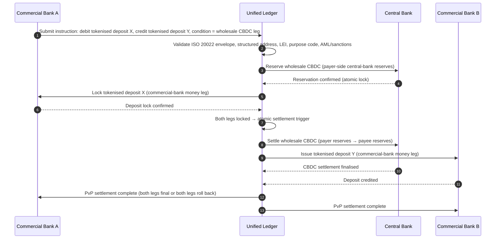

## Ο Δείκτης Πληρωμών Χονδρικής το 2026: ISO 20022, Διακριτικοποιημένες Καταθέσεις, Δίκτυα Πραγματικού Χρόνου και Διασυνοριακός Διακανονισμός

Οι πληρωμές χονδρικής το 2026 αναδιαμορφώνονται από δύο ταυτόχρονες μετατοπίσεις: τα δομημένα δεδομένα πληρωμών και τον προγραμματίσιμο διακανονισμό. Το ορόσημο δομημένης διεύθυνσης του SWIFT τον Νοέμβριο 2026 επιβάλλει την ποιότητα δεδομένων στο λειτουργικό μοντέλο, ενώ το BIS Project Agorá και οι διακριτικοποιημένες καταθέσεις δοκιμάζουν αν ο διασυνοριακός διακανονισμός μπορεί να γίνει πιο ατομικός, διαφανής και πάντα διαθέσιμος.

---

> **Σύνοψη για Στελέχη / Βασικά Συμπεράσματα**
>
> - **Ο Νοέμβριος 2026 είναι απόλυτο ορόσημο δεδομένων.** Το SWIFT αναφέρει ότι οι πληρωμές που περιέχουν μη δομημένες διευθύνσεις δεν θα υποστηρίζονται πλέον μετά την αλλαγή SR 2026.
> - **Τα δομημένα δεδομένα γίνονται υποδομή προϊόντος.** Η πόλη και η χώρα πρέπει να βρίσκονται κατ' ελάχιστο σε καθορισμένα πεδία, μετατρέποντας την ποιότητα δεδομένων πληρωμών σε ζήτημα πελατών, λειτουργιών και συμμόρφωσης.
> - **Οι διακριτικοποιημένες καταθέσεις είναι επιλογή σχεδιασμού χονδρικής.** Το Project Agorá διερευνά διακριτικοποιημένες καταθέσεις εμπορικών τραπεζών και διακριτικοποιημένα αποθεματικά κεντρικών τραπεζών σε ένα μοντέλο ενοποιημένου καθολικού.
> - **Ο δείκτης θα πρέπει να μετρά την ποιότητα διακανονισμού, όχι μόνο την ταχύτητα.** Η οριστικοποίηση, η διαφάνεια, τα ποσοστά επιδιόρθωσης, η χρήση ρευστότητας, τα δεδομένα συμμόρφωσης και η ορατότητα του πελάτη μετρούν όσο και η άμεση εκτέλεση.
> - **Οι διασυνοριακές πληρωμές παραμένουν ατζέντα δημόσιου-ιδιωτικού τομέα.** Το FSB συνεχίζει να προωθεί τον οδικό χάρτη της G20 μέσω της υλοποίησης, με συντονισμό δημόσιου και ιδιωτικού τομέα.
>
---

## Γιατί το 2026 Είναι η Χρονιά που Αυτός ο Δείκτης Έχει Σημασία

Ο Δείκτης AI του Stanford είναι χρήσιμος επειδή αντιμετωπίζει ένα ταχέως εξελισσόμενο τεχνολογικό πεδίο ως κάτι που μπορεί να μετρηθεί: η ερευνητική παραγωγή, η τεχνική απόδοση, η υπεύθυνη ανάπτυξη, τα οικονομικά, η υιοθέτηση ανά τομέα, η πολιτική και το κοινό αίσθημα εντάσσονται σε ένα ενιαίο πλαίσιο ([Stanford HAI ⧉](https://hai.stanford.edu/ai-index/2026-ai-index-report "The 2026 AI Index Report")). Οι τράπεζες και τα χρηματοπιστωτικά ιδρύματα χρειάζονται πλέον την ίδια πειθαρχία για τις υποδομές. Η agentic AI, η κβαντικά ασφαλής ασφάλεια, η cloud native ανθεκτικότητα και οι πληρωμές χονδρικής δεν είναι πλέον ξεχωριστές γραμμές καινοτομίας· συγκλίνουν σε ένα ενιαίο λειτουργικό μοντέλο.

Το πρακτικό ερώτημα για μια τράπεζα δεν είναι αν κάθε τομέας είναι σημαντικός. Είναι αν το ίδρυμα μπορεί να μετρήσει την ετοιμότητα σε όλους αυτούς ταυτόχρονα. Μια τράπεζα μπορεί να αναπτύξει agentic AI και να παραμένει εύθραυστη αν η κρυπτογραφία της δεν είναι έτοιμη για μετάβαση. Μπορεί να εκσυγχρονίσει τις πλατφόρμες cloud και να αποτύχει αν τα δεδομένα πληρωμών παραμένουν μη δομημένα. Μπορεί να τρέχει πιλότους διακριτικοποίησης και να δημιουργεί συστημικό κίνδυνο αν τα στρώματα διακανονισμού, ρευστότητας, ταυτότητας και ελέγχου δεν σχεδιαστούν από κοινού.

## Η Αρχιτεκτονική του Δείκτη 2026

| Στρώμα Δείκτη | Κατεύθυνση 2026 | Μετρική Ετοιμότητας | Κίνδυνος σε Περίπτωση Κακής Διαχείρισης |
|---|---|---|---|
| **Δεδομένα ISO 20022** | Μετάβαση από μη δομημένο κείμενο σε διακυβερνώμενα δομημένα πεδία | Ετοιμότητα δομημένης διεύθυνσης και ποσοστό απόρριψης | Απορρίψεις πληρωμών και χειροκίνητη επιδιόρθωση |
| **Ενορχήστρωση δικτύων** | Δρομολόγηση σε δίκτυα RTGS, άμεσα, ανταποκριτικά, stablecoin και διακριτικοποιημένα | Δρομολόγηση με επίγνωση κόστους, ταχύτητας, οριστικοποίησης και δικαιοδοσίας | Κατακερματισμένα δίκτυα με διπλότυπους ελέγχους |
| **Διακριτικοποιημένος διακανονισμός** | Χρήση διακριτικοποιημένων καταθέσεων και χρήματος κεντρικής τράπεζας όπου μειώνουν τις τριβές | Κάλυψη DvP, PvP, ατομικού διακανονισμού | Πιλοτικά περιουσιακά στοιχεία χωρίς επιχειρησιακή αξία ροής εργασιών |
| **Ρευστότητα** | Βελτιστοποίηση ενδοημερήσιας ρευστότητας, δεσμευμένων μετρητών και παραθύρων διακανονισμού | Εξοικονόμηση ρευστότητας και μείωση αστοχιών διακανονισμού | Ταχύτερη εκροή ρευστότητας |
| **Συμμόρφωση** | Ενσωμάτωση απαιτήσεων AML, κυρώσεων, FATF και ελέγχου στα δεδομένα πληρωμών | Συμμόρφωση straight-through και εξηγησιμότητα | Πλουσιότερα δεδομένα χωρίς ισχυρότερους ελέγχους |

## Βασικά Σήματα Πληρωμών Χονδρικής Αντιστοιχισμένα σε Παγκόσμιες Προτεραιότητες

Το σύνολο σημάτων του 2026 δεν είναι ερευνητική ατζέντα. Είναι μια λίστα ελέγχου παράδοσης βάσει της οποίας ήδη αξιολογείται ο Chief Payments Officer μιας τράπεζας. Το έργο αποκατάστασης εμφανίζεται σε τρία σημεία: τον φάκελο μηνύματος, το στρώμα ενορχήστρωσης δικτύων και το καθολικό διακανονισμού.

| Σήμα | Αναφορά G20 / SWIFT / BIS | Υλοποίηση σε Τεχνική Πλατφόρμα |
|---|---|---|
| **65 % των μηνυμάτων πληρωμών εξακολουθούν να περιέχουν μη δομημένες διευθύνσεις** | [SWIFT SR 2026 — ορόσημο δομημένης διεύθυνσης, Νοέμβριος 2026 ⧉](https://www.swift.com/news-events/news/iso-20022-milestone-november-2026-unstructured-addresses-be-removed "ISO 20022 November 2026 structured address milestone") | Επικύρωση σχήματος στο middleware πληρωμών πριν το μήνυμα φτάσει στον προσαρμογέα SWIFTNet· αυτοματοποιημένη ανάλυση διεύθυνσης στην είσοδο εταιρικού καναλιού + ανταποκρίτριας τράπεζας. |
| **Στόχος FSB G20: 75 % των διασυνοριακών πληρωμών να ολοκληρώνονται εντός 1 ώρας έως το 2027** | [Οδικός χάρτης διασυνοριακών πληρωμών FSB, φάση υλοποίησης 2026 ⧉](https://www.fsb.org/2026/03/fsb-kicks-off-new-implementation-phase-to-enhance-cross-border-payments-through-public-private-partnership/ "FSB cross-border payments implementation phase") | Πύλες μετατροπής FX πραγματικού χρόνου με προσυμφωνημένα παράθυρα ρευστότητας· άγκιστρα επιβεβαίωσης T+0 στην πύλη πελάτη· μηχανή δρομολόγησης δικτύων που αποκλείει κάθε διάδρομο που δεν μπορεί να καλύψει το παράθυρο της 1 ώρας. |
| **Στόχος FSB G20: μέσο κόστος διασυνοριακής συναλλαγής κάτω από 1 %, λιανικής κάτω από 3 %** | [Ποσοτικοί στόχοι FSB G20 ⧉](https://www.fsb.org/2026/03/fsb-kicks-off-new-implementation-phase-to-enhance-cross-border-payments-through-public-private-partnership/ "FSB cross-border payments implementation phase") | Τηλεμετρία κατανομής κόστους σε κάθε διάδρομο (spread FX, προμήθεια ανταποκριτή, κόστος lifting)· μητρώο πολιτικής περιθωρίου που αναδεικνύει μη συμμορφούμενη τιμολόγηση πριν από την προσφορά. |
| **Το BIS Project Agorá εισέρχεται σε φάση πρωτοτύπου σε επτά κεντρικές τράπεζες + 41 εμπορικές τράπεζες** | [BIS Project Agorá ⧉](https://www.bis.org/about/bisih/topics/fmis/agora.htm "Project Agorá") | Προδιαγραφή ενσωμάτωσης ενοποιημένου καθολικού: κόμβος καθολικού διακριτικοποιημένων καταθέσεων + επίπεδο διακανονισμού wholesale-CBDC + άγκιστρα KYC/AML· on-chain δεξαμενές ρευστότητας διαστασιολογημένες στο μερίδιο διαδρόμου της τράπεζας. |
| **Το πλαίσιο «ψηφιακού χρήματος» της Deutsche Bank αποκρυσταλλώνεται στην αρχιτεκτονική πελάτη** | [Deutsche Bank — Digital Money: stablecoins, tokenised deposits and CBDCs ⧉](https://flow.db.com/publications/flow-white-papers-and-guides/digital-money-a-perspective-on-stablecoins-tokenised-deposits-and-cbdcs "Digital Money: stablecoins, tokenised deposits and CBDCs") | API διακανονισμού ανεξάρτητο από πορτοφόλι που αφαιρεί την επιλογή stablecoin / διακριτικοποιημένης κατάθεσης / CBDC ανά πληρωμή· προγραμματίσιμες συνθήκες αξιολογημένες έναντι του μητρώου πολιτικής της τράπεζας, όχι του πελάτη. |

## Το Σημείο Καμπής των Δεδομένων Πληρωμών

Το ISO 20022 έχει μετακινηθεί από έργο μορφότυπου μηνυμάτων σε λειτουργικό μοντέλο ποιότητας δεδομένων. Αν τα δεδομένα δικαιούχου, οφειλέτη, πιστωτή, πράκτορα, πόλης, χώρας, σκοπού και συμβαλλομένου είναι αδύναμα, η τράπεζα θα βιώσει απορρίψεις, επιδιορθώσεις, τριβές κυρώσεων, δυσαρέσκεια πελατών και αδύναμα analytics.

**Το SR 2026 το καθιστά αυστηρή σύμβαση, όχι συμβουλευτική οδηγία.** Το SWIFT Standards Release 2026 (Νοέμβριος 2026) επιβάλλει τον κανόνα δομημένης διεύθυνσης στο επίπεδο δικτύου — μηνύματα των οποίων το στοιχείο `<PstlAdr>` δεν φέρει `<TwnNm>` και `<Ctry>` θα απορρίπτονται κατά τη λήψη από τη στοίβα επικύρωσης SWIFTNet, χωρίς να επισημαίνονται για επιδιόρθωση. Η ουρά επιδιόρθωσης παύει να είναι γραμμή κόστους back-office και γίνεται συμβάν αστοχίας διακανονισμού με καθυστέρηση ορατή στον πελάτη. Οι ομάδες λειτουργιών που αντιμετωπίζουν το SR 2026 ως «αυστηρότερη οδηγία» εργάζονται από λάθος εγχειρίδιο.

### Συμμόρφωση Δομημένων Δεδομένων Πληρωμών υπό το ISO 20022

Η επιφάνεια αποκατάστασης είναι στενή και καλά ορισμένη. Τα στοιχεία XML παρακάτω είναι όπου η στοίβα επικύρωσης SWIFTNet του Νοεμβρίου 2026 πραγματικά απορρίπτει μηνύματα· όλα τα άλλα είναι επακόλουθη συνέπεια.

| Στοιχείο Δεδομένων | Ετικέτα XML ISO 20022 | Απαίτηση SWIFT Νοεμβρίου 2026 | Στρατηγική Τεχνικής Αποκατάστασης |
|---|---|---|---|
| **Δομημένη Διεύθυνση** | `<PstlAdr>` που περιέχει `<TwnNm>` + `<Ctry>` | Υποχρεωτική. Μη δομημένο κείμενο `<AdrLine>` προκαλεί απόρριψη δικτύου στον προσαρμογέα SWIFTNet λήψης. | Αυτοματοποιημένη ανάλυση διεύθυνσης κατά την έναρξη πληρωμής· επανεγγραφή φορμών εταιρικού καναλιού· καθαρισμός παλαιού χαρτοφυλακίου σε κάθε αντισυμβαλλόμενο πριν από την επόμενη χρέωση. |
| **Αναγνωριστικό Νομικής Οντότητας (LEI)** | `<Id>` υπό `<OrgId>` | Ιδιαίτερα συνιστώμενη για την επαλήθευση μη ατομικού χρηματοπιστωτικού αντισυμβαλλομένου· υποχρεωτική σε αρκετούς διαδρόμους CBPR+. | Αναζήτηση LEI + διασταύρωση GLEIF κατά την εταιρική ένταξη· αυτόματος εμπλουτισμός για αντισυμβαλλομένους παλαιού χαρτοφυλακίου μέσω υπηρεσιών δεδομένων αναφοράς. |
| **Κωδικοί Σκοπού Πληρωμής** | `<Purp>` που περιέχει `<Cd>` | Υποχρεωτικοί σε πολλαπλούς περιφερειακούς διαδρόμους πραγματικού χρόνου (CBPR+, SEPA Inst, TIPS) για αυτοματοποιημένο έλεγχο AML / κυρώσεων. | Αντιστοίχιση παλαιών εσωτερικών κωδικών συναλλαγών της τράπεζας στην τυποποιημένη λίστα ExternalPurposeCode του ISO 20022· έκθεση επιλογής σκοπού στο UI του εταιρικού καναλιού· default-deny σε άγνωστους κωδικούς. |
| **Τελικοί Συμβαλλόμενοι** | `<UltmtDbtr>` / `<UltmtCdtr>` | Έκθεση του πλαισίου τελικού δικαιούχου για την ικανοποίηση των παραμέτρων travel-rule FATF + κυρώσεων της G20· υποχρεωτικοί για αρκετούς κωδικούς τύπου πληρωμής. | Εξαγωγή ονομάτων συμβαλλομένων end-to-end από υπολογαριασμούς καθολικού· συμφωνία έναντι του γράφου KYC· ανάδειξη του τελικού συμβαλλομένου σε κάθε επιβεβαίωση. |
| **Πληροφορίες Εμβάσματος (Δομημένες)** | `<RmtInf><Strd>` με `<RfrdDocInf>` | Απαιτούμενες για συμφιλιώσιμες εταιρικές πληρωμές συνδεδεμένες με τιμολόγιο υπό το CBPR+ Phase 2. | Καταγραφή δομημένου εμβάσματος κατά την προσφορά στην εταιρική πύλη· απόρριψη εφεδρικού ελεύθερου κειμένου για ροές υψηλής αξίας. |

## Διακριτικοποιημένες Καταθέσεις και Wholesale CBDC

Οι διακριτικοποιημένες καταθέσεις διατηρούν το μοντέλο χρήματος εμπορικής τράπεζας ενώ προσθέτουν δυνατότητα προγραμματισμού. Το χρήμα κεντρικής τράπεζας χονδρικής διατηρεί την οριστικοποίηση διακανονισμού. Το ενδιαφέρον μοτίβο σχεδιασμού είναι ο συνδυασμός: χρήμα εμπορικής τράπεζας για τις σχέσεις πελατών και τη διαμεσολάβηση πιστώσεων, χρήμα κεντρικής τράπεζας για τον τελικό διακανονισμό και τη συστημική εμπιστοσύνη.

Το Project Agorá καθιστά τον συνδυασμό συγκεκριμένο. Η παρακάτω αρχιτεκτονική είναι το μοτίβο αναφοράς του BIS για έναν ατομικό, διασυνοριακό διακανονισμό payment-versus-payment (PvP) που χρησιμοποιεί τόσο ένα καθολικό καταθέσεων εμπορικής τράπεζας όσο και ένα επίπεδο διακανονισμού wholesale-CBDC, συντονισμένα μέσω ενός ενοποιημένου καθολικού.

Ο διακανονισμός είναι ατομικός εκ κατασκευής: και τα δύο σκέλη δεσμεύονται ή και τα δύο ανατρέπονται. Η οριστικοποίηση διακανονισμού στο σκέλος wholesale-CBDC καθιστά τη μεταφορά της διακριτικοποιημένης κατάθεσης της εμπορικής τράπεζας ενεργή χωρίς κίνδυνο ανταποκριτή. Το ενοποιημένο καθολικό είναι το επίπεδο συντονισμού, όχι σύστημα πληρωμών από μόνο του — η κεντρική τράπεζα εξακολουθεί να εκδίδει το περιουσιακό στοιχείο διακανονισμού και η εμπορική τράπεζα εξακολουθεί να καταχωρεί την υποχρέωση κατάθεσης.

## Το Νέο Προϊόν Πληρωμών Χονδρικής

Το προϊόν δεν είναι πλέον απλώς μια πληρωμή. Είναι μια δέσμη εκτέλεσης, δεδομένων, ρευστότητας, συμμόρφωσης, ιχνηλασιμότητας και διαχείρισης εξαιρέσεων. Οι τράπεζες που μπορούν να εκθέσουν αυτές τις δυνατότητες μέσω API και πινάκων ελέγχου πελατών θα μετατρέψουν τη συμμόρφωση υποδομής σε αξία για τον πελάτη.

## Τι Σημαίνει Αυτό ανά Τύπο Τράπεζας

### Παγκόσμια Συστημικά Σημαντικές Τράπεζες

Οι παγκόσμιες τράπεζες θα πρέπει να αντιμετωπίσουν αυτόν τον δείκτη ως πίνακα βαθμολόγησης αρχιτεκτονικής επιχείρησης. Η προτεραιότητα δεν είναι άλλη μια απόδειξη ιδέας· είναι η τεκμηρίωση ότι οι αυτόνομες ροές εργασιών, η κρυπτογραφική μετάβαση, η εξάρτηση από cloud και ο εκσυγχρονισμός πληρωμών μπορούν να διακυβερνηθούν ως ένα ενιαίο σύστημα κινδύνου και αξίας.

### Τράπεζες Συναλλαγών και Εταιρικές Τράπεζες

Οι τράπεζες συναλλαγών θα πρέπει να εστιάσουν στις πληρωμές χονδρικής, τα δομημένα δεδομένα, τη ρευστότητα, τις διακριτικοποιημένες καταθέσεις και τις υπηρεσίες agentic treasury. Η πιο πολύτιμη πρόταση αξίας προς τον πελάτη δεν είναι μόνο η ταχύτερη μετακίνηση χρημάτων· είναι η εξηγήσιμη, ελέγξιμη, προγραμματίσιμη μετακίνηση χρημάτων με λιγότερες έρευνες και καλύτερη ορατότητα του κεφαλαίου κίνησης.

### Περιφερειακές Τράπεζες

Οι περιφερειακές τράπεζες θα πρέπει να χρησιμοποιήσουν τον δείκτη για να αποφύγουν τη διασπορά προγραμμάτων. Δεν χρειάζεται να ηγηθούν σε κάθε μέτωπο, αλλά χρειάζονται αξιόπιστες θέσεις στη διακυβέρνηση AI, την απογραφή post-quantum, την τεκμηρίωση εξόδου από cloud και την ετοιμότητα δεδομένων πληρωμών.

### Fintechs, PSP και Πάροχοι Υποδομών

Τα fintechs και οι πάροχοι υποδομών θα πρέπει να ευθυγραμμίσουν τους οδικούς χάρτες προϊόντων τους με τη μετρήσιμη ετοιμότητα των τραπεζών. Οι καλύτερες προτάσεις θα μειώσουν τον κίνδυνο ενσωμάτωσης, θα ενισχύσουν την τεκμηρίωση και θα κάνουν τις σύνθετες υποδομές πιο εύκολα διακυβερνήσιμες για τις τράπεζες.

## Συμπέρασμα

Η αξία μιας αναφοράς τύπου δείκτη είναι ότι μετατρέπει μια κατακερματισμένη τεχνολογική ατζέντα σε ένα μετρήσιμο λειτουργικό μοντέλο. Το 2026, οι νικητές στη χρηματοπιστωτική υποδομή δεν θα είναι τα ιδρύματα με τους περισσότερους πιλότους. Θα είναι τα ιδρύματα που μπορούν να αποδείξουν ετοιμότητα σε αυτονομία, ασφάλεια, ανθεκτικότητα, διακανονισμό, οικονομικά και διακυβέρνηση ταυτόχρονα.

## Συχνές Ερωτήσεις

**Γιατί το ISO 20022 είναι ακόμη ζήτημα του 2026;**

Επειδή η μετάβαση δεν ολοκληρώνεται μέχρι τα δεδομένα πληρωμών να είναι δομημένα, διακυβερνώμενα, καταγεγραμμένα στην πηγή και αξιοποιήσιμα σε όλα τα κανάλια, τους πελάτες και τις υποδομές της αγοράς.

**Τι είναι μια διακριτικοποιημένη κατάθεση;**

Μια διακριτικοποιημένη κατάθεση είναι μια ψηφιακή αναπαράσταση του χρήματος εμπορικής τράπεζας, σχεδιασμένη να διατηρεί τη σχέση τράπεζας-καταθέτη ενώ επιτρέπει τον προγραμματίσιμο διακανονισμό.

**Αντικαθιστούν οι διακριτικοποιημένες καταθέσεις τα stablecoins;**

Όχι παντού. Τα stablecoins μπορεί να παραμείνουν χρήσιμα σε ορισμένα πλαίσια ψηφιακών περιουσιακών στοιχείων και διασυνοριακών συναλλαγών, ενώ οι διακριτικοποιημένες καταθέσεις είναι δομικά ελκυστικές για τη ρυθμιζόμενη τραπεζική χονδρικής.

**Τι θα πρέπει να μετρούν οι τράπεζες;**

Να μετρούν την ετοιμότητα δομημένων δεδομένων, τις απορρίψεις πληρωμών, το κόστος επιδιόρθωσης, τον χρόνο διακανονισμού, τη χρήση ρευστότητας, τα αποτελέσματα δρομολόγησης δικτύων και την ορατότητα του πελάτη.

## Αναφορές

- SWIFT, (2026). [ISO 20022 November 2026 structured address milestone ⧉](https://www.swift.com/news-events/news/iso-20022-milestone-november-2026-unstructured-addresses-be-removed "ISO 20022 November 2026 structured address milestone").
- BIS Innovation Hub, (2026). [Project Agorá ⧉](https://www.bis.org/about/bisih/topics/fmis/agora.htm "Project Agorá").
- FSB, (2026). [Cross-border payments implementation phase ⧉](https://www.fsb.org/2026/03/fsb-kicks-off-new-implementation-phase-to-enhance-cross-border-payments-through-public-private-partnership/ "Cross-border payments implementation phase").
- Deutsche Bank, (2026). [Digital Money: stablecoins, tokenised deposits and CBDCs ⧉](https://flow.db.com/publications/flow-white-papers-and-guides/digital-money-a-perspective-on-stablecoins-tokenised-deposits-and-cbdcs "Digital Money: stablecoins, tokenised deposits and CBDCs").
