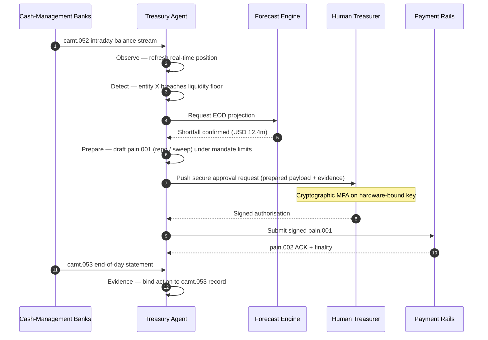

## Ο Δείκτης Αυτόνομου Treasury το 2026: Agentic Treasury, Προγραμματιζόμενη Ρευστότητα, Tokenised Καταθέσεις και Έλεγχος Μετρητών σε Πραγματικό Χρόνο

Το αυτόνομο treasury είναι το φυσικό σημείο συνάντησης για το agentic AI, τις χονδρικές πληρωμές, τις tokenised καταθέσεις και τη ρευστότητα σε πραγματικό χρόνο. Το 2026, οι καλύτερες αρχιτεκτονικές treasury δεν θα προβλέπουν απλώς τα μετρητά· θα προτείνουν, θα εξηγούν και τελικά θα εκτελούν οριοθετημένες ενέργειες ρευστότητας σε λογαριασμούς, νομίσματα, δίκτυα και περιουσιακά στοιχεία διακανονισμού.

---

> **Σύνοψη για Στελέχη / Βασικά Συμπεράσματα**
>
> - **Το treasury μετατοπίζεται από την αναφορά στον έλεγχο.** Τα υπόλοιπα σε πραγματικό χρόνο, οι προβλέψεις, η κατάσταση πληρωμών και η μετακίνηση ρευστότητας γίνονται μέρος μιας ενιαίας ροής εργασίας.
> - **Το agentic AI δημιουργεί ένα νέο περιβάλλον treasury.** Οι agents μπορούν να παρακολουθούν θέσεις, να αναδεικνύουν ανωμαλίες, να προετοιμάζουν ενέργειες χρηματοδότησης και να κλιμακώνουν αποφάσεις εντός καθορισμένων εντολών.
> - **Το προγραμματιζόμενο χρήμα αλλάζει το σκέλος των μετρητών.** Οι tokenised καταθέσεις και τα πειράματα χονδρικού CBDC δημιουργούν νέες δυνατότητες για ατομικό διακανονισμό, πληρωμές υπό όρους και πάντα διαθέσιμη ρευστότητα.
> - **Ο δείκτης πρέπει να μετρά την εξουσιοδότηση.** Το ζήτημα δεν είναι αν ο agent μπορεί να προτείνει μια ενέργεια· είναι αν η εξουσιοδότηση, τα όρια, οι εγκρίσεις και τα τεκμήρια είναι σαφή.
> - **Η αξία του treasury είναι μετρήσιμη.** Η εξοικονομημένη ρευστότητα, οι μειωμένες χειροκίνητες έρευνες, οι αποφευχθείσες αποτυχίες διακανονισμού και το απελευθερωμένο κεφάλαιο κίνησης θα πρέπει να ορίζουν την επιτυχία.
>
---

## Γιατί το 2026 Είναι η Χρονιά που Αυτός ο Δείκτης Έχει Σημασία

Ο Δείκτης AI του Stanford είναι χρήσιμος επειδή αντιμετωπίζει έναν ταχέως εξελισσόμενο τεχνολογικό τομέα ως κάτι που μπορεί να μετρηθεί: η ερευνητική παραγωγή, η τεχνική απόδοση, η υπεύθυνη ανάπτυξη, τα οικονομικά, η υιοθέτηση ανά κλάδο, η πολιτική και το κοινό αίσθημα φέρονται σε ένα ενιαίο πλαίσιο ([Stanford HAI ⧉](https://hai.stanford.edu/ai-index/2026-ai-index-report "The 2026 AI Index Report")). Οι τράπεζες και τα χρηματοπιστωτικά ιδρύματα χρειάζονται τώρα την ίδια πειθαρχία για την υποδομή. Το agentic AI, η κβαντικά ασφαλής ασφάλεια, η cloud native ανθεκτικότητα και οι χονδρικές πληρωμές δεν είναι πλέον ξεχωριστές τροχιές καινοτομίας· συγκλίνουν σε ένα ενιαίο λειτουργικό μοντέλο.

Το πρακτικό ερώτημα για μια τράπεζα δεν είναι αν κάθε τομέας είναι σημαντικός. Είναι αν το ίδρυμα μπορεί να μετρήσει την ετοιμότητα σε όλους αυτούς ταυτόχρονα. Μια τράπεζα μπορεί να αναπτύξει agentic AI και να παραμένει εύθραυστη αν η κρυπτογραφία της δεν είναι έτοιμη για μετάβαση. Μπορεί να εκσυγχρονίσει τις cloud πλατφόρμες και να αποτύχει αν τα δεδομένα πληρωμών παραμένουν αδόμητα. Μπορεί να εκτελεί πιλότους tokenisation και να δημιουργεί συστημικό κίνδυνο αν τα επίπεδα διακανονισμού, ρευστότητας, ταυτότητας και ελέγχου δεν σχεδιάζονται μαζί.

## Η Αρχιτεκτονική του Δείκτη 2026

| Επίπεδο Δείκτη | Κατεύθυνση 2026 | Μετρική Ετοιμότητας | Κίνδυνος αν Χειραγωγηθεί Λανθασμένα |
|---|---|---|---|
| **Ορατότητα** | Ενοποίηση δεδομένων λογαριασμών, πληρωμών, ρευστότητας και έκθεσης | Κάλυψη θέσεων μετρητών σε πραγματικό χρόνο | Κατακερματισμένη ορατότητα μετρητών |
| **Πρόβλεψη** | Χρήση AI για πρόβλεψη υπολοίπων, ροών και αναγκών χρηματοδότησης | Ακρίβεια πρόβλεψης και ποσοστό εξαιρέσεων | Ψευδής εμπιστοσύνη σε αδύναμα δεδομένα |
| **Αυτονομία** | Παραχώρηση οριοθετημένης εξουσιοδότησης σε agents για συστάσεις και ενέργειες | Κάλυψη εντολών και ποιότητα εγκρίσεων | Μη εξουσιοδοτημένη ή ανεξήγητη ενέργεια |
| **Προγραμματισιμότητα** | Χρήση tokenised καταθέσεων και έξυπνων όρων όπου προσθέτουν αξία | Περιπτώσεις χρήσης πληρωμών υπό όρους και ατομικού διακανονισμού | Πιλότοι treasury με τεχνολογική καθοδήγηση |
| **Έλεγχοι** | Ενσωμάτωση ορίων, κυρώσεων, FX, ρευστότητας και ελέγχων audit | Τεκμήρια ελέγχου ανά ενέργεια treasury | Χειροκίνητη διακυβέρνηση μετά την εκτέλεση |

## Τρέχοντα Σήματα προς Παρακολούθηση

| Σήμα | Τι Σημαίνει για τις Τράπεζες | Πηγή |
|---|---|---|
| **52% υιοθέτηση agentic AI στις χρηματοπιστωτικές υπηρεσίες** | Το treasury μπορεί πλέον να απορροφήσει ροές εργασίας agentic μέσω διακυβερνώμενων πλατφορμών | [Cambridge CCAF ⧉](https://www.jbs.cam.ac.uk/faculty-research/centres/alternative-finance/publications/2026-global-ai-in-financial-services-report/ "2026 Global AI in Financial Services Report") |
| **Πληρωμές υπό όρους του Project Agorá** | Η tokenisation μπορεί να επιτρέψει δυνατότητες πληρωμών υπό όρους και πάντα διαθέσιμων | [BIS ⧉](https://www.bis.org/about/bisih/topics/fmis/agora.htm "Project Agorá") |
| **Digital Securities Sandbox της Bank of England** | Ομόλογα και μετοχές που εκδίδονται μέσω DLT διακανονίζονται σε βάση Delivery-versus-Payment (DvP) — το σκέλος του περιουσιακού στοιχείου και το σκέλος των μετρητών (χονδρικό CBDC ή tokenised καταθέσεις εμπορικών τραπεζών) διακανονίζονται στην ίδια ατομική συναλλαγή, αφαιρώντας τον κίνδυνο κεφαλαίου αντισυμβαλλομένου | [Bank of England ⧉](https://www.bankofengland.co.uk/financial-stability/digital-securities-sandbox "Digital Securities Sandbox") |
| **Προθεσμία δομημένης διεύθυνσης SWIFT** | Τα δεδομένα treasury πρέπει να καταγράφονται σωστά στην πηγή | [SWIFT ⧉](https://www.swift.com/news-events/news/iso-20022-milestone-november-2026-unstructured-addresses-be-removed "ISO 20022 November 2026 structured address milestone") |
| **Τα μεγάλα χρηματοπιστωτικά ιδρύματα δυσκολεύονται να μετρήσουν την αξία του AI** | Η αυτοματοποίηση treasury χρειάζεται σκληρές οικονομικές μετρικές | [Cambridge CCAF ⧉](https://www.jbs.cam.ac.uk/faculty-research/centres/alternative-finance/publications/2026-global-ai-in-financial-services-report/ "2026 Global AI in Financial Services Report") |

## Η Εντολή του Treasury Agent

Ένας treasury agent δεν πρέπει να σχεδιάζεται ως βοηθός γενικής χρήσης. Χρειάζεται μια εντολή: να παρατηρεί λογαριασμούς, να εντοπίζει εξαιρέσεις, να προβλέπει κενά χρηματοδότησης, να προετοιμάζει ενέργειες, να ζητά εγκρίσεις, να εκτελεί εντός ορίων και να παράγει τεκμήρια. Κάθε βήμα θα πρέπει να έχει διαφορετικό μοντέλο εξουσιοδότησης.

Ο βρόχος ελέγχου εκτελεί Παρατήρηση → Εντοπισμό → Πρόβλεψη → Προετοιμασία → Αίτημα Έγκρισης — και σταματά. Ο agent δεν διασχίζει ποτέ μόνος του το όριο κρυπτογραφικής εξουσιοδότησης. Το παρακάτω διάγραμμα ιχνηλατεί έναν πλήρη κύκλο: μια ενδοημερήσια έλλειψη ρευστότητας πολλών εκατομμυρίων δολαρίων αναδύεται στην τηλεμετρία `camt.052`, ο agent προβλέπει τη θέση στο τέλος της ημέρας, προετοιμάζει ένα repo ή ενδοεταιρικό sweep ως ένα πλήρως διαμορφωμένο `pain.001` και το παραδίδει στον ανθρώπινο treasurer για κρυπτογραφική υπογραφή πολλαπλών παραγόντων σε ένα κλειδί δεσμευμένο σε υλικό. Ο agent στη συνέχεια υποβάλλει το υπογεγραμμένο φορτίο· η οριστικοποίηση προσγειώνεται ως ένα `pain.002` ACK και το επόμενο `camt.053` καταγραφής.

Το όριο είναι το ζητούμενο — κάθε ενέργεια που μετακινεί πραγματικό χρήμα βρίσκεται πίσω από μια κρυπτογραφική πύλη που ο agent δεν μπορεί να ικανοποιήσει μόνος του.

## Προγραμματιζόμενη Ρευστότητα

Η προγραμματιζόμενη ρευστότητα είναι η δυνατότητα μετακίνησης αξίας υπό όρους: αν παραβιαστεί ένα όριο, αν οι εξασφαλίσεις είναι επιλέξιμες, αν ένας αντισυμβαλλόμενος περάσει τον έλεγχο, αν είναι διαθέσιμη η οριστικοποίηση διακανονισμού, ή αν ένα ενδοημερήσιο απόθεμα ρευστότητας είναι πολύ χαμηλό. Οι tokenised καταθέσεις και οι πλατφόρμες χονδρικού διακανονισμού καθιστούν αυτά τα μοτίβα πιο πρακτικά.

Προγραμματιζόμενο δεν σημαίνει εκτός προτύπου. Η διαδρομή εκτέλεσης είναι το `pain.001` — [ISO 20022](/2023-09-29-automating-iso-20022-compliant-payment-file-creation-with-pain001/index.html) Customer Credit Transfer Initiation. Η προετοιμασμένη ενέργεια του agent είναι ένα πλήρως διαμορφωμένο φορτίο `pain.001` που δρομολογείται στην τράπεζα μέσω του ίδιου καναλιού που θα χρησιμοποιούσε ένα εταιρικό ERP, επικυρώνεται έναντι του ίδιου schema, βαθμολογείται από τις ίδιες μηχανές απάτης και κυρώσεων, και επιβεβαιώνεται στις ίδιες αναφορές κατάστασης `pain.002`. Το επίπεδο υπό-όρους (όριο, επιλεξιμότητα εξασφαλίσεων, διαθεσιμότητα οριστικοποίησης, κατώφλι αποθέματος) βρίσκεται πάνω από το μήνυμα — ελέγχει *αν* θα αποσταλεί ένα `pain.001`, όχι *ποια μορφή* θα λάβει. Οι πλατφόρμες treasury που επινοούν προσαρμοσμένα φορτία για να εκφράσουν όρους θα βγουν εκτός της διαδρομής που καταναλώνεται από τις τράπεζες και θα επιστρέψουν στην διμερή ενσωμάτωση.

## Το Δωμάτιο Ελέγχου Treasury

Το λειτουργικό μοντέλο θα πρέπει να μοιάζει με δωμάτιο ελέγχου: θέσεις, προβλέψεις, καταστάσεις πληρωμών, χρήση ορίων, εξαιρέσεις, εγκρίσεις και τεκμήρια σε ένα ενιαίο περιβάλλον. Ο δείκτης θα πρέπει να τιμωρεί τις στοίβες treasury που απαιτούν από τις ομάδες να συρράπτουν emails, υπολογιστικά φύλλα, τραπεζικές πύλες και αποσυνδεδεμένους πίνακες.

Το επίπεδο δεδομένων πίσω από αυτό το περιβάλλον είναι η διαχείριση μετρητών ISO 20022. Η ενδοημερήσια θέση είναι το `camt.052` — Bank-to-Customer Account Report — που μεταδίδεται σε ροή από κάθε τράπεζα διαχείρισης μετρητών στο επίπεδο παρατήρησης του agent με τη συχνότητα που δημοσιεύει η τράπεζα (λεπτά για παρόχους GTB tier-1, τέλος κύκλου για τη μακρά ουρά). Η συμφωνία τέλους ημέρας είναι το `camt.053` — Bank-to-Customer Statement — η ελεγχόμενη καταγραφή έναντι της οποίας βαθμολογείται η πρόβλεψη του agent το επόμενο πρωί. Οι πλατφόρμες treasury που διαβάζουν καταστάσεις PDF ή κάνουν screen-scrape σε τραπεζικές πύλες δεν μπορούν να επιτύχουν το Επίπεδο 4 του δείκτη· η ενδοημερήσια τηλεμετρία πρέπει να φτάνει ως δομημένο `camt.052` για να κλείσει ο βρόχος πρόβλεψης εγκαίρως ώστε να δράσει.

## Τι Σημαίνει Αυτό ανά Τύπο Τράπεζας

### Παγκόσμια Συστημικά Σημαντικές Τράπεζες

Οι παγκόσμιες τράπεζες θα πρέπει να αντιμετωπίσουν αυτόν τον δείκτη ως κάρτα αξιολόγησης αρχιτεκτονικής επιχείρησης. Η προτεραιότητα δεν είναι ένα ακόμη proof of concept· είναι η απόδειξη ότι οι αυτόνομες ροές εργασίας, η κρυπτογραφική μετάβαση, η εξάρτηση από cloud και ο εκσυγχρονισμός των πληρωμών μπορούν να διακυβερνηθούν ως ένα ενιαίο σύστημα κινδύνου και αξίας.

### Τράπεζες Συναλλαγών και Εταιρικές Τράπεζες

Οι τράπεζες συναλλαγών θα πρέπει να επικεντρωθούν στις χονδρικές πληρωμές, τα δομημένα δεδομένα, τη ρευστότητα, τις tokenised καταθέσεις και τις υπηρεσίες agentic treasury. Η πιο πολύτιμη πρόταση προς τους πελάτες δεν είναι μόνο η ταχύτερη μετακίνηση χρήματος· είναι η επεξηγήσιμη, ελέγξιμη, προγραμματιζόμενη μετακίνηση χρήματος με λιγότερες έρευνες και καλύτερη ορατότητα κεφαλαίου κίνησης.

### Περιφερειακές Τράπεζες

Οι περιφερειακές τράπεζες θα πρέπει να χρησιμοποιήσουν τον δείκτη για να αποφύγουν τη διάχυση προγραμμάτων. Δεν χρειάζεται να ηγούνται σε κάθε μέτωπο, αλλά χρειάζεται να έχουν αξιόπιστες θέσεις στη διακυβέρνηση AI, το μετακβαντικό απόθεμα, τα τεκμήρια εξόδου από cloud και την ετοιμότητα δεδομένων πληρωμών.

### Fintechs, PSPs και Πάροχοι Υποδομής

Τα fintechs και οι πάροχοι υποδομής θα πρέπει να ευθυγραμμίσουν τους οδικούς χάρτες προϊόντων τους με τη μετρήσιμη ετοιμότητα των τραπεζών. Οι καλύτερες προτάσεις θα μειώσουν τον κίνδυνο ενσωμάτωσης, θα ενισχύσουν τα τεκμήρια και θα κάνουν την πολύπλοκη υποδομή ευκολότερη για τις τράπεζες να τη διακυβερνήσουν.

## Συμπέρασμα

Η αξία μιας αναφοράς τύπου δείκτη είναι ότι μετατρέπει μια κατακερματισμένη τεχνολογική ατζέντα σε ένα μετρήσιμο λειτουργικό μοντέλο. Το 2026, οι νικητές στη χρηματοπιστωτική υποδομή δεν θα είναι τα ιδρύματα με τους περισσότερους πιλότους. Θα είναι τα ιδρύματα που μπορούν να αποδείξουν ετοιμότητα σε αυτονομία, ασφάλεια, ανθεκτικότητα, διακανονισμό, οικονομικά και διακυβέρνηση ταυτόχρονα.

## Συχνές Ερωτήσεις

**Τι είναι το αυτόνομο treasury;**

Το αυτόνομο treasury είναι η χρήση AI agents, δεδομένων πραγματικού χρόνου και προγραμματιζόμενων πληρωμών για την παρακολούθηση, τη σύσταση και ενδεχομένως την εκτέλεση ενεργειών treasury εντός καθορισμένων ελέγχων.

**Θα πρέπει να επιτρέπεται στους treasury agents να εκτελούν πληρωμές;**

Μόνο εντός στενών εντολών, ισχυρών ορίων, ρητών εγκρίσεων και πλήρους ελεγξιμότητας. Η εξουσιοδότηση εκτέλεσης θα πρέπει να κερδίζεται μέσω της ωριμότητας.

**Πώς βοηθούν οι tokenised καταθέσεις το treasury;**

Μπορούν να υποστηρίξουν προγραμματιζόμενο διακανονισμό, ατομική εκτέλεση και ενδεχομένως καλύτερο ενδοημερήσιο έλεγχο ρευστότητας, διατηρώντας παράλληλα τις σχέσεις χρήματος εμπορικής τράπεζας.

**Ποιο είναι το πρώτο βήμα υλοποίησης;**

Χτίστε ορατότητα πραγματικού χρόνου και ποιότητα δεδομένων πριν παραχωρήσετε αυτονομία. Οι agents δεν μπορούν να βελτιστοποιήσουν με ασφάλεια μετρητά που δεν μπορούν να δουν με ακρίβεια.

## Αναφορές

- Cambridge Centre for Alternative Finance, (2026). [2026 Global AI in Financial Services Report ⧉](https://www.jbs.cam.ac.uk/faculty-research/centres/alternative-finance/publications/2026-global-ai-in-financial-services-report/ "2026 Global AI in Financial Services Report").
- SWIFT, (2026). [ISO 20022 November 2026 structured address milestone ⧉](https://www.swift.com/news-events/news/iso-20022-milestone-november-2026-unstructured-addresses-be-removed "ISO 20022 November 2026 structured address milestone").
- BIS Innovation Hub, (2026). [Project Agorá ⧉](https://www.bis.org/about/bisih/topics/fmis/agora.htm "Project Agorá").
- Bank of England, (2026). [Shaping the UK's digital financial future ⧉](https://www.bankofengland.co.uk/speech/2025/january/sasha-mills-speech-at-the-tokenisation-summit "Shaping the UK's digital financial future").

END_TRANSLATION
