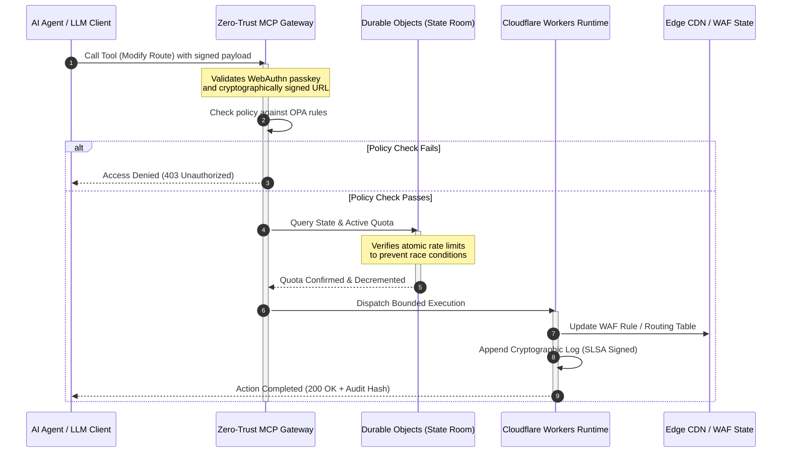

## CloudCDN: Ένα σχέδιο ανοιχτού κώδικα για το AI-native edge το 2026

Η συζήτηση για το CDN έχει λήξει. Το edge δεν είναι πλέον μια προσωρινή μνήμη· είναι το επίπεδο ελέγχου για το AI-native λογισμικό. Καθώς οι πράκτορες καλούν εργαλεία, μετακινούν δεδομένα, καθαρίζουν προσωρινές μνήμες, ζητούν υπογεγραμμένα URL και συντονίζουν ροές εργασίας, το παλιό μοντέλο των αδιαφανών dashboards και των ιδιόκτητων επιπέδων ελέγχου παύει να είναι ενόχληση και γίνεται ρυθμιστική ευθύνη. Το CloudCDN υποστηρίζει ένα διαφορετικό μοντέλο: μια ανοιχτή, επιθεωρήσιμη, ελεγχόμενη από πράκτορες πλατφόρμα edge που αντιμετωπίζει την ασφάλεια, την προσβασιμότητα, την απόδοση και την ελεγξιμότητα ως επιβεβλημένες προεπιλογές αντί για υποσχέσεις προμηθευτών.

Το σημείο αναφοράς ανοιχτού κώδικα για αυτό το άρθρο είναι το [cloudcdn.pro ⧉](https://github.com/sebastienrousseau/cloudcdn.pro "cloudcdn.pro"). Το αποθετήριο είναι ένα πολυ-ενοικιαστικό, AI-native CDN που μπορεί να διαβαστεί από άκρο σε άκρο και να αναπτυχθεί ανεξάρτητα: TTFB κάτω των 100ms σε όλα τα Cloudflare PoP, έλεγχος MCP, περιορισμός ρυθμού με Durable Objects, προσβασιμότητα WCAG-AA, υπογεγραμμένα URL, passkeys, SLSA Level 3 και 3.185 δοκιμές σε 100% κάλυψη.

---

> **Εκτελεστική σύνοψη / Βασικά συμπεράσματα**
>
> - **Το edge γίνεται το επιχειρησιακό όριο.** Το CloudCDN μετατρέπει τους τυπικούς κόμβους CDN σε ενεργές πύλες πολιτικής που εκτελούν ασφάλεια, δρομολόγηση και έλεγχο πρόσβασης σε χρόνο μικρότερο του χιλιοστού του δευτερολέπτου.
> - **Τα Durable Objects καθιστούν τον περιορισμό ρυθμού ατομικό.** Η σε πραγματικό χρόνο, παγκόσμια συνεπής επιβολή ποσοστώσεων κλείνει το παράθυρο συνθηκών ανταγωνισμού που οι εν τέλει συνεπείς περιοριστές αφήνουν ανοιχτό σε επιτιθέμενους και σε πράκτορες που δυσλειτουργούν.
> - **Οι πράκτορες χειρίζονται την υποδομή μέσω 42 οριοθετημένων εργαλείων MCP.** Κάθε κλήση επικυρώνεται έναντι των passkeys WebAuthn, των υπογεγραμμένων φορτίων και της πολιτικής OPA πριν εκτελεστεί οτιδήποτε.
> - **Η αλυσίδα εφοδιασμού είναι μέρος του προϊόντος.** Η προέλευση SLSA Level 3 μέσω Sigstore/Cosign συνδέει κρυπτογραφικά κάθε έκδοση με την ελεγμένη πηγή της.
> - **Η τηλεμετρία είναι αποδεικτικό στοιχείο συμμόρφωσης.** Οι λειτουργίες edge αντιστοιχίζονται στο Άρθρο 5 του DORA, στο BCBS 239 και στο κεφάλαιο λειτουργικού κινδύνου της Basel III — άμεσα, όχι μέσω εκ των υστέρων αναφορών.
>
---

## Γιατί αυτό το έργο ανοιχτού κώδικα έχει σημασία το 2026

Η εταιρική πληροφορική το 2026 έχει μετακινηθεί από την παροχή στατικής υποδομής στην σε πραγματικό χρόνο, καθοδηγούμενη από συμβάντα ενορχήστρωση δεδομένων. Δύο δυνάμεις της αγοράς οδηγούν αυτή τη μετατόπιση.

Η πρώτη είναι ο πολλαπλασιασμός της agentic τεχνητής νοημοσύνης. Αυτόνομα μοντέλα και πράκτορες λογισμικού εκτελούν πλέον σύνθετες επιχειρησιακές εργασίες — αυτοματοποιημένη μετρίαση απειλών, αποφάσεις δρομολόγησης, εξισορρόπηση καθολικών σε πραγματικό χρόνο. Δεν χρησιμοποιούν dashboards. Καλούν εργαλεία.

Η δεύτερη είναι η ενεργή επιβολή του [Νόμου για την ψηφιακή λειτουργική ανθεκτικότητα (DORA) ⧉](https://eur-lex.europa.eu/legal-content/EN/TXT/?uri=CELEX%3A32022R2554 "Κανονισμός (ΕΕ) 2022/2554 για την ψηφιακή λειτουργική ανθεκτικότητα του χρηματοοικονομικού τομέα"). Τα τραπεζικά ιδρύματα δεν μπορούν πλέον να βασίζονται σε αδιαφανή, ιδιόκτητα CDN τρίτων. Οι ρυθμιστικές αρχές απαιτούν πλήρη ορατότητα στην αλυσίδα εφοδιασμού λογισμικού, επαληθεύσιμη ικανότητα εξόδου και αναλλοίωτα κρυπτογραφικά ίχνη ελέγχου.

Οι κεντρικοποιημένες αρχιτεκτονικές διακομιστών επιβάλλουν ποινές καθυστέρησης που η σε πραγματικό χρόνο ενορχήστρωση δεν μπορεί να απορροφήσει. Τα ιδιόκτητα CDN λειτουργούν ως μαύρα κουτιά που εκθέτουν τα ιδρύματα σε συμβιβασμό της αλυσίδας εφοδιασμού τον οποίο δεν μπορούν να δουν, πόσο μάλλον να τεκμηριώσουν. Το CloudCDN κλείνει αυτό το κενό με ένα διαφανές, μηδενικής εμπιστοσύνης, ανοιχτού κώδικα σχέδιο που μετατρέπει το edge σε ενεργό επίπεδο ελέγχου. Για τα τεχνολογικά στελέχη, μετατοπίζει τη συζήτηση από το κόστος της συμμόρφωσης στην απόδοση της ανθεκτικότητας: κεφάλαιο που διατηρείται μέσω αυτοματοποιημένων, έτοιμων για έλεγχο επιχειρησιακών pipelines.

## Η οπτική της αρχιτεκτονικής

Η αρχιτεκτονική του CloudCDN είναι δομημένη σε πέντε επίπεδα, αντικαθιστώντας το κεντρικοποιημένο middleware με τοπικά, με κατάσταση πρωτογενή στοιχεία edge:

| Επίπεδο | Σχεδιαστική απόφαση | Γιατί έχει σημασία | Κίνδυνος αν χειριστεί λανθασμένα |
|---|---|---|---|
| **Edge runtime** | Cloudflare Workers και Pages | Εξαλείφει την καθυστέρηση των κεντρικοποιημένων VM· εκτελεί πολιτικές σε χρόνο μικρότερο του χιλιοστού του δευτερολέπτου παγκοσμίως | Κέρδη απόδοσης χωρίς πειθαρχία πολιτικής παράγουν χαοτική μετατόπιση του edge |
| **Συντονισμός κατάστασης** | Durable Objects | Εγγυάται ατομική, σε πραγματικό χρόνο συνέπεια για τα όρια ρυθμού και την κοινή κατάσταση σε όλες τις περιοχές | Κατανεμημένες συνθήκες ανταγωνισμού, κατάχρηση πόρων API, παρακαμπτόμενες ποσοστώσεις περιμέτρου |
| **Διεπαφή πράκτορα** | Πύλη MCP μηδενικής εμπιστοσύνης | Εκθέτει 42 εξειδικευμένα εργαλεία MCP ώστε οι πράκτορες AI να χειρίζονται την υποδομή εντός διακυβερνώμενων ορίων | Απεριόριστη κλήση εργαλείων και μη εξουσιοδοτημένες αλλαγές διαμόρφωσης |
| **Έλεγχος πρόσβασης** | Passkeys WebAuthn και υπογεγραμμένα URL | Αντικαθιστά τους στατικούς κωδικούς με κρυπτογραφικές υπογραφές για ελέγξιμες λειτουργίες | Ασθενώς αποδιδόμενες αλλαγές· κλοπή διαπιστευτηρίων που οδηγεί σε παραβίαση περιμέτρου |
| **Πύλες ποιότητας** | SLSA Level 3 και 100% κάλυψη δοκιμών | Επαληθεύει μαθηματικά την πηγή κατασκευής· αποκλείει την κακόβουλη εισαγωγή εξαρτήσεων | Κακόβουλος κώδικας που εισάγεται μέσω της αλυσίδας εφοδιασμού λογισμικού |

## Λειτουργικά σήματα προς παρακολούθηση

Η ετοιμότητα του edge είναι μετρήσιμη. Αυτοί είναι οι ποσοτικοί δείκτες που καταδεικνύουν ικανότητα εκτέλεσης αντί για πρόθεση:

| Σήμα | Μετρική / Benchmark | Ρυθμιστική αναφορά | Υλοποίηση πλατφόρμας |
|---|---|---|---|
| **42 εργαλεία MCP** | Οριοθετημένο πλήθος μητρώου εργαλείων για αυτοματοποιημένη διαχείριση | COBIT 2019 (BAI06) | Πύλη MCP που επικυρώνει τις υπογραφές των πρακτόρων έναντι των πολιτικών OPA |
| **Durable Objects** | Ατομική επιβολή ποσοστώσεων χωρίς διαρροές, σε χρόνο μικρότερο του χιλιοστού του δευτερολέπτου | DORA Άρθρο 6 | Durable Objects που παρακολουθούν την παγκόσμια κατάσταση ποσοστώσεων API |
| **Passkeys και υπογεγραμμένα URL** | 100% των συνεδριών διαχειριστή επαληθεύονται μέσω FIDO2 WebAuthn | DORA Άρθρο 30 | Έλεγχοι κρυπτογραφικής υπογραφής ενσωματωμένοι στον δρομολογητή του edge |
| **SLSA Level 3** | Κρυπτογραφικά υπογεγραμμένα μανιφέστα κατασκευής (Sigstore) | DORA Άρθρο 30 | Pipelines GitHub Actions που παράγουν υπογεγραμμένα μεταδεδομένα κατασκευής |
| **3.185 δοκιμές μονάδας** | 100% κάλυψη· πύλες παλινδρόμησης σε κάθε έκδοση | NIST CSF 2.0 (PR.DS-01) | Pipelines CI που σταματούν την ανάπτυξη σε οποιαδήποτε αποτυχία δοκιμής |

## Το CDN γίνεται ενεργό επίπεδο ελέγχου

Τα παραδοσιακά CDN σχεδιάστηκαν γύρω από την παθητική, στατική επιτάχυνση περιεχομένου. Το CloudCDN επαναπροσδιορίζει το μοντέλο. Με τα Cloudflare Workers και τα Durable Objects ενσωματωμένα, το edge λειτουργεί ως μια ενεργή, με κατάσταση πύλη πολιτικής.

Όταν ένας πράκτορας AI ή μια αυτοματοποιημένη διεργασία ζητά μια αλλαγή διαμόρφωσης υποδομής ή μια προσαρμογή δρομολόγησης, δεν επικοινωνεί με μια ευάλωτη, κεντρικοποιημένη βάση δεδομένων. Το αίτημα υποκλέπτεται στον πλησιέστερο κόμβο edge και περνά μέσα από ελέγχους ταυτότητας, πολιτικής και ποσόστωσης πριν εκτελεστεί οτιδήποτε:

Κάθε βήμα σε αυτή την ακολουθία παράγει μια αποδιδόμενη, υπογεγραμμένη εγγραφή. Αυτή είναι η διαφορά ανάμεσα σε ένα CDN που επιταχύνει περιεχόμενο και ένα επίπεδο ελέγχου που μπορεί να διακυβερνηθεί.

## Γιατί ο ανοιχτός κώδικας αλλάζει το μοντέλο εμπιστοσύνης

Για τους Επικεφαλής Ασφάλειας Πληροφοριών, τα αδιαφανή ιδιόκτητα CDN παρουσιάζουν έναν σωρευτικό κίνδυνο. Τα δίκτυα edge κλειστού κώδικα είναι μαύρα κουτιά: αν ο προμηθευτής υποστεί εσωτερικό συμβιβασμό, η τράπεζα έχει μηδενική ορατότητα έως ότου η παραβίαση δημοσιοποιηθεί.

Το CloudCDN αντικαθιστά αυτή την ασυμμετρία με ένα πλήρως ελέγξιμο, ανοιχτού κώδικα μοντέλο εμπιστοσύνης χτισμένο πάνω σε τρεις μηχανισμούς:

1. **Μαθηματική προέλευση κατασκευής.** Στο πλαίσιο του SLSA Level 3, κάθε έκδοση συνδέεται κρυπτογραφικά με το αποθετήριό της ανοιχτού κώδικα στο GitHub. Ένας CISO μπορεί να επαληθεύσει — μαθηματικά, όχι συμβατικά — ότι το δυαδικό αρχείο που εκτελείται στους παγκόσμιους κόμβους edge της Cloudflare περιέχει ακριβώς τον ελεγμένο πηγαίο κώδικα.
2. **Συνεχείς, δημόσιοι έλεγχοι ασφάλειας.** Ο κώδικας υποβάλλεται σε αυτοματοποιημένες σαρώσεις, δημόσια αποκάλυψη ευπαθειών και ελέγχους κώδικα με ομότιμη αξιολόγηση. Η αφάνεια δεν είναι μηχανισμός ελέγχου· η αξιολόγηση είναι.
3. **Καμία εξάρτηση από προμηθευτή (DORA Άρθρο 28).** Το DORA απαιτεί από τις τράπεζες να αποδεικνύουν μια σαφή, δοκιμασμένη στρατηγική εξόδου από κρίσιμους τρίτους παρόχους. Επειδή το CloudCDN είναι ανοιχτού κώδικα και χτισμένο πάνω σε τυπικά serverless πρωτογενή στοιχεία, τα ιδρύματα μπορούν να μεταφέρουν τις διαμορφώσεις edge από την Cloudflare σε άλλα serverless runtimes ή ιδιωτικά cluster Kubernetes — και να τεκμηριώσουν αυτή την ικανότητα στη ρυθμιστική αρχή.

## Το μοτίβο edge τραπεζικής ποιότητας

Το CloudCDN έχει σχεδιαστεί για να πληροί τα πρότυπα συμμόρφωσης του παγκόσμιου χρηματοοικονομικού τομέα, αντιστοιχίζοντας τις τεχνικές λειτουργίες edge άμεσα στα πλαίσια που πραγματικά εξετάζουν οι επόπτες:

- **Διαχείριση κινδύνου μοντέλων ([US Fed SR 11-7 ⧉](https://web.archive.org/web/20260414150921/https://www.federalreserve.gov/supervisionreg/srletters/sr1107.htm "Εποπτική καθοδήγηση για τη διαχείριση κινδύνου μοντέλων") / UK PRA SS1/23).** Τα αυτόνομα μοντέλα που εκτελούν επιχειρησιακές εργασίες εμπίπτουν στη διακυβέρνηση κινδύνου μοντέλων. Η πύλη MCP του CloudCDN αντιμετωπίζει τα agentic εργαλεία ως ποσοτικά μοντέλα: αυστηρά όρια πολιτικής, καταγραφή σε πραγματικό χρόνο και υποχρεωτικές παρακάμψεις με άνθρωπο στη διαδικασία για ενέργειες υψηλού αντικτύπου.
- **BCBS 239 (συγκέντρωση δεδομένων κινδύνου).** Με την καταγραφή, επισήμανση και δόμηση των δεδομένων συναλλαγών στο edge, οι λειτουργικές μετρικές παράγονται σε πραγματικό χρόνο — καλύπτοντας τις απαιτήσεις του BCBS 239 για ακεραιότητα δεδομένων, επικαιρότητα και ρυθμιστική ιχνηλασιμότητα.
- **DORA Άρθρο 5 (ευθύνη διοικητικού συμβουλίου).** Το διοικητικό συμβούλιο φέρει την απόλυτη προσωπική ευθύνη για τη λειτουργική ανθεκτικότητα. Το CloudCDN μεταφράζει την τηλεμετρία του edge σε ποσοτικοποιημένα, επαληθεύσιμα αποδεικτικά στοιχεία που μη τεχνικοί διευθυντές μπορούν να προσκομίσουν σε έναν έλεγχο προσωπικής ευθύνης.
- **Κεφάλαιο λειτουργικού κινδύνου Basel III.** Οι τράπεζες κρατούν ρυθμιστικό κεφάλαιο έναντι του λειτουργικού κινδύνου. Η αυτοματοποιημένη μεταγωγή αποκατάστασης καταστροφών και η προέλευση SLSA Level 3 μειώνουν το προφίλ λειτουργικού κινδύνου του ιδρύματος — διατηρώντας κεφάλαιο στον ισολογισμό, όχι απλώς ικανοποιώντας έναν έλεγχο.

## Τι σημαίνει αυτό ανά τύπο τράπεζας

### Παγκόσμια συστημικά σημαντικές τράπεζες (G-SIB)

Οι G-SIB διαχειρίζονται τεράστιους όγκους συναλλαγών σε πολλαπλές δικαιοδοσίες. Η προτεραιότητα είναι η αντικατάσταση των κατακερματισμένων παλαιών ελέγχων περιμέτρου με ένα ενιαίο, ενοποιημένο επίπεδο edge. Η ανάπτυξη του μοτίβου CloudCDN επιτρέπει σε μια G-SIB να τυποποιήσει τις πολιτικές ασφάλειας, τις πύλες API και την agentic διακυβέρνηση παγκοσμίως — και να παράγει pipelines αποδεικτικών στοιχείων συμβατά με το DORA ως υποπροϊόν της λειτουργίας παρά ως τριμηνιαία βιασύνη.

### Τράπεζες συναλλαγών και εταιρικής τραπεζικής

Για τις τράπεζες συναλλαγών, το προϊόν που απευθύνεται στον πελάτη είναι ένα πακέτο ταχύτητας εκτέλεσης, ασφάλειας και διαφάνειας δεδομένων. Το μοτίβο CloudCDN επιτρέπει σε αυτές τις τράπεζες να εκθέτουν ασφαλή dashboards API και υπηρεσίες παρακολούθησης μετρητών σε πραγματικό χρόνο σε εταιρικούς ταμίες — μια ανθεκτική στάση edge που υπερασπίζεται τις εταιρικές καταθέσεις.

### Περιφερειακές και μικρότερες τράπεζες

Οι περιφερειακές τράπεζες αντιμετωπίζουν τους ίδιους παράγοντες απειλής με τις G-SIB χωρίς τους μηχανικούς προϋπολογισμούς. Ένα ανοιχτού κώδικα, τραπεζικής ποιότητας σχέδιο edge παρέχει τους ελέγχους εκτός συσκευασίας: άμεση ρυθμιστική ευθυγράμμιση χωρίς κόστη ιδιόκτητων αδειών, και τον πηγαίο κώδικα για να το αποδείξει.

## Το εγχειρίδιο του διοικητικού συμβουλίου

Η λειτουργική ανθεκτικότητα δεν είναι πλέον μια αόρατη μετρική IT του back-office· είναι προτεραιότητα του διοικητικού συμβουλίου με προσωπική ευθύνη προσαρτημένη. Τα ιδρύματα που διατηρούν την εμπιστοσύνη των ρυθμιστικών αρχών, των πελατών και των μετόχων το 2026 αντιμετωπίζουν την τεχνολογία ως ένα επαληθεύσιμο, παρατηρήσιμο περιουσιακό στοιχείο.

Ο οδικός χάρτης για τα ανώτερα τεχνολογικά στελέχη είναι σύντομος:

1. **Καταστήστε τα αποδεικτικά στοιχεία προϊόν.** Προϋπολογίστε για αυτοματοποιημένα, αυτο-τεκμηριούμενα pipelines στο edge — αποδεικτικά στοιχεία που παράγονται από τη λειτουργία, όχι που συναρμολογούνται για τον ελεγκτή.
2. **Μεταβείτε σε έλεγχο edge με κατάσταση.** Αφαιρέστε τον περιορισμό ρυθμού, το WAF και την επαλήθευση ταυτότητας από τους κεντρικοποιημένους διακομιστές και μεταφέρετέ τα σε ατομικά πρωτογενή στοιχεία edge.
3. **Καθιερώστε κρυπτογραφικά agentic όρια.** Επιβάλετε πύλες MCP μηδενικής εμπιστοσύνης με επικύρωση passkey και OPA για κάθε αυτοματοποιημένη κλήση εργαλείου.
4. **Απαιτήστε ελέγχους κατασκευής ανοιχτού κώδικα.** Καταστήστε την προέλευση κατασκευής SLSA Level 3 προϋπόθεση ανάπτυξης, όχι επιδίωξη.

## Συχνές ερωτήσεις

**Είναι το CloudCDN έτοιμο για ελέγχους DORA;**

Ναι. Το CloudCDN έχει σχεδιαστεί για να παράγει αυτοματοποιημένα αποδεικτικά στοιχεία συμμόρφωσης που αντιστοιχίζονται άμεσα στα πρότυπα ITS του Μητρώου Πληροφοριών (RT.01 έως RT.15) και στις συμβατικές ρήτρες του Άρθρου 30 του DORA.

**Ποιο είναι το πλεονέκτημα της χρήσης των Durable Objects για τον περιορισμό ρυθμού;**

Οι παραδοσιακοί κατανεμημένοι περιοριστές ρυθμού βασίζονται στην εν τέλει συνέπεια, η οποία αφήνει ένα παράθυρο καθυστέρησης που οι επιτιθέμενοι ή οι πράκτορες που δυσλειτουργούν μπορούν να εκμεταλλευτούν. Τα Durable Objects εγγυώνται άμεση, ατομική συνέπεια παγκοσμίως, κλείνοντας πλήρως το παράθυρο συνθηκών ανταγωνισμού.

**Τι κάνει το CloudCDN AI-native;**

Οι ελεγχόμενες από MCP λειτουργίες του και το ενήμερο για πράκτορες μοντέλο ελέγχου. Η υποδομή χειρίζεται μέσω 42 διακυβερνώμενων εργαλείων με κρυπτογραφική ταυτότητα και όρια πολιτικής — σχεδιασμένη για αυτόνομες ροές εργασίας, όχι μόνο για ανθρώπινα dashboards.

**Αυξάνει ο κώδικας ανοιχτού κώδικα τον κίνδυνο εκμεταλλεύσεων zero-day;**

Όχι. Τα ιδιόκτητα, κλειστού κώδικα CDN βασίζονται στην ασφάλεια μέσω της αφάνειας. Ο κώδικας του CloudCDN υποβάλλεται συνεχώς σε αυτοματοποιημένες δοκιμές, δημόσια ομότιμη αξιολόγηση και επικύρωση SLSA Level 3 — ένα επαληθεύσιμα υψηλότερο κατώφλι εμπιστοσύνης.

## Αναφορές

- European Parliament and Council of the European Union, (2022). [Regulation (EU) 2022/2554 on digital operational resilience for the financial sector (DORA) ⧉](https://eur-lex.europa.eu/legal-content/EN/TXT/?uri=CELEX%3A32022R2554 "Regulation (EU) 2022/2554 on digital operational resilience for the financial sector (DORA)"). Brussels: Official Journal of the European Union.
- Basel Committee on Banking Supervision (BCBS), (2013). [Principles for effective risk data aggregation and risk reporting (BCBS 239) ⧉](https://www.bis.org/publ/bcbs239.htm "Principles for effective risk data aggregation and risk reporting (BCBS 239)"). Basel: Bank for International Settlements.
- Board of Governors of the Federal Reserve System, (2011). [Supervisory Guidance on Model Risk Management (SR Letter 11-7) ⧉](https://web.archive.org/web/20260414150921/https://www.federalreserve.gov/supervisionreg/srletters/sr1107.htm "Supervisory Guidance on Model Risk Management (SR Letter 11-7)"). Washington D.C.: Federal Reserve.
- Cloudflare, (2026). [Durable Objects documentation: stateful edge coordination ⧉](https://developers.cloudflare.com/durable-objects/ "Durable Objects documentation"). San Francisco: Cloudflare.
- Cloudflare, (2026). [Building AI agents with MCP, authentication and Durable Objects ⧉](https://blog.cloudflare.com/building-ai-agents-with-mcp-authn-authz-and-durable-objects/ "Building AI agents with MCP, authentication and Durable Objects").
- GitHub, (2026). [cloudcdn.pro repository ⧉](https://github.com/sebastienrousseau/cloudcdn.pro "cloudcdn.pro repository").
