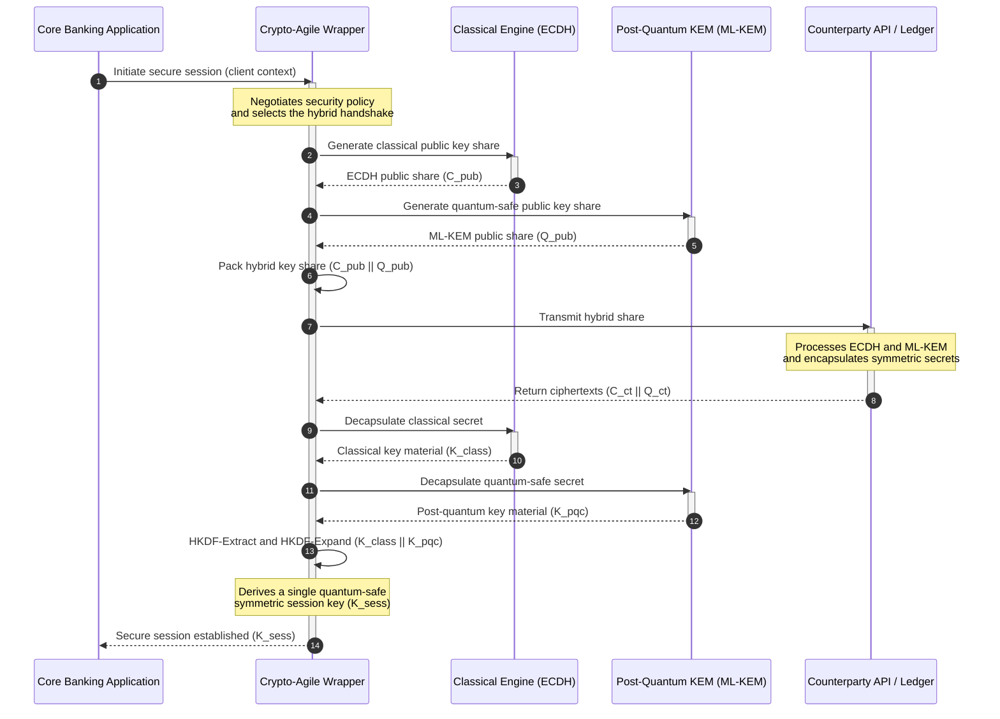

## Το KyberLib και η Μετακβαντική Τραπεζική Μετάβαση το 2026: Από τα Πρότυπα στον Κώδικα

Η μετακβαντική μετάβαση έπαψε να είναι μια άσκηση σχεδιασμού. Το 2026 αποτελεί μια ενεργή λειτουργική απαίτηση, και το κενό ανάμεσα στην κανονιστική πρόθεση και τη μηχανική υλοποίηση είναι εκεί όπου εδράζεται πλέον ο κίνδυνος. Το [KyberLib ⧉](https://github.com/sebastienrousseau/kyberlib "kyberlib") καλύπτει μέρος αυτού του κενού: μια προσανατολισμένη στην παραγωγή, μνημονικά ασφαλής βιβλιοθήκη Rust που υλοποιεί το ML-KEM σύμφωνα με τις οριστικοποιημένες παραμέτρους του FIPS 203 και το τυλίγει στα κρυπτο-ευέλικτα όρια που πραγματικά χρειάζεται το συναλλακτικό οικοσύστημα μιας τράπεζας.

---

> **Σύνοψη για Στελέχη / Βασικά Συμπεράσματα**
>
> - **Η απειλή είναι ήδη ενεργή.** Οι αντίπαλοι εκτελούν σήμερα συλλογή δεδομένων τύπου «Store Now, Decrypt Later»· η εμπιστευτικότητα των δεδομένων καταρρέει αναδρομικά την ημέρα που θα εμφανιστεί ένας κρυπτογραφικά σχετικός κβαντικός υπολογιστής.
> - **Τα πρότυπα έχουν οριστικοποιηθεί.** Τα NIST FIPS 203 (ML-KEM) και FIPS 204 (ML-DSA) δίνουν στις επιτροπές ελέγχου ένα σαφές, ελέγξιμο σημείο αναφοράς — δεν υπάρχει πλέον η δικαιολογία της «αναμονής για πρότυπα».
> - **Το KyberLib είναι το μηχανικό σχεδιάγραμμα.** Μνημονικά ασφαλής Rust, μεταγλώττιση `no_std` για HSM και έξυπνες κάρτες, και υβριδικά μοτίβα χειραψίας που διατηρούν την κλασική διαλειτουργικότητα.
> - **Η κρυπτο-ευελιξία είναι ο διαρκής στόχος.** Τα σταθερά όρια αφαίρεσης επιτρέπουν την αλλαγή των πρωτογενών στοιχείων χωρίς επανεγγραφή εφαρμογών — το μάθημα που επιβιώνει πέρα από κάθε μεμονωμένο αλγόριθμο.
> - **Τα διοικητικά συμβούλια φέρουν την ευθύνη.** Το Άρθρο 5 της DORA επιβάλλει προσωπική ευθύνη στα μέλη· ο επιθεωρήσιμος, παρατηρήσιμος κώδικας μετάβασης είναι το αποδεικτικό στοιχείο που την ικανοποιεί.
>
---

## Γιατί Αυτό το Έργο Ανοικτού Κώδικα Έχει Σημασία το 2026

Καθώς η ασύμμετρη κρυπτογραφία πλησιάζει στην απαξίωση, η απειλή δεν περιμένει την κατασκευή ενός κρυπτογραφικά σχετικού κβαντικού υπολογιστή. Οι αντίπαλοι εκτελούν **επιθέσεις «Store Now, Decrypt Later» (SNDL)** τώρα — συλλέγοντας κρυπτογραφημένες ροές δεδομένων υπό διαμετακόμιση εταιρικών τραπεζικών συναλλαγών, εμπορικών μυστικών και θεσμικών επικοινωνιών, με στόχο την αποκρυπτογράφησή τους μόλις ωριμάσουν οι κβαντικές δυνατότητες. Για μια τράπεζα, κάθε κλασική χειραψία που κινείται σήμερα στο δίκτυο είναι μια παραβίαση εμπιστευτικότητας με καθυστερημένη ημερομηνία πυροδότησης.

Οι ρυθμιστικές αρχές έχουν ανταποκριθεί με συγκεκριμένες υποχρεώσεις:

1. Το **Άρθρο 6 της DORA (διαχείριση κινδύνου ΤΠΕ)** απαιτεί από τους οργανισμούς να χαρτογραφούν, να εντοπίζουν και να μετριάζουν τις ευπάθειες σε ολόκληρο το κρυπτογραφικό τους οικοσύστημα — συμπεριλαμβανομένης της ασύμμετρης ανταλλαγής κλειδιών που είναι θαμμένη σε ενδιάμεσο λογισμικό (middleware) το οποίο κανείς δεν έχει καταγράψει.
2. Τα **NIST FIPS 203 και 204** θεσπίζουν τα επίσημα μετακβαντικά πρότυπα για την ενθυλάκωση κλειδιών (ML-KEM) και τις ψηφιακές υπογραφές (ML-DSA), δίνοντας στις επιτροπές ελέγχου ένα τυποποιημένο σημείο αναφοράς έναντι του οποίου μετράται η πρόοδος της μετάβασης.

Η εκτέλεση αυτής της μετάβασης χωρίς διακοπή των ζωντανών λειτουργιών απαιτεί την υπέρβαση των εγγράφων πολιτικής προς μια **επιθεωρήσιμη, ανοικτού κώδικα κρυπτογραφική υποδομή**. Το [KyberLib ⧉](https://github.com/sebastienrousseau/kyberlib "kyberlib") προσφέρει ακριβώς αυτό: μια μνημονικά ασφαλή βιβλιοθήκη Rust που συμμορφώνεται με το FIPS 203 και μετατρέπει τη μετακβαντική μετάβαση σε μια μετρήσιμη, επαληθεύσιμη μηχανική διαδικασία — και μετατοπίζει τη συζήτηση περί επενδύσεων σε τεχνολογία προς μια απτή Απόδοση της Ανθεκτικότητας (Return on Resilience).

## Η Αρχιτεκτονική Οπτική

Το KyberLib βρίσκεται πίσω από σταθερά όρια API, μονώνοντας τις βασικές συναλλακτικές εφαρμογές μιας τράπεζας από τις αλλαγές στα κρυπτογραφικά πρωτογενή στοιχεία χαμηλού επιπέδου.

| Επίπεδο | Σχεδιαστική Απόφαση | Γιατί Έχει Σημασία | Κίνδυνος αν Χειριστεί Λανθασμένα |
|---|---|---|---|
| **Πρωτογενές στοιχείο** | Ενθυλάκωση κλειδιών FIPS 203 ML-KEM | Αντικαθιστά την κλασική ανταλλαγή κλειδιών Diffie-Hellman και RSA με δομές βασισμένες σε πλέγματα | Μη συμμόρφωση με τις οριστικοποιημένες παραμέτρους του FIPS 203, οδηγώντας σε αποτυχημένους ελέγχους συμμόρφωσης |
| **Γλώσσα** | Μνημονικά ασφαλής υλοποίηση σε Rust | Εξαλείφει τις ευπάθειες αλλοίωσης μνήμης (υπερχειλίσεις προσωρινής μνήμης, use-after-free) που είναι ενδημικές στη C/C++ | Ανεξέλεγκτη διόγκωση εξαρτήσεων που θέτει σε κίνδυνο την ακεραιότητα της αλυσίδας κατασκευής (build-chain) |
| **Αφαίρεση** | Σταθερά κρυπτο-ευέλικτα όρια | Οι εφαρμογές αλλάζουν αλγόριθμους πίσω από μια ενοποιημένη διεπαφή καθώς εξελίσσονται τα πρότυπα | Σκληρά κωδικοποιημένα (hard-coded) πρωτογενή στοιχεία που επιβάλλουν χειροκίνητες επανεγγραφές σε κάθε μελλοντική μετάβαση |
| **Ανάπτυξη** | Υβριδικές κρυπτογραφικές χειραψίες | Συνδυάζει μετακβαντικά KEM με κλασικούς αλγόριθμους σε έναν διπλά τυλιγμένο φάκελο | Απώλεια της διαλειτουργικότητας με παλαιά συστήματα ή σιωπηλή απόκλιση διαμόρφωσης |
| **Διασφάλιση** | Προέλευση SLSA Επιπέδου 3 και επιθεωρήσιμες δοκιμές | Εγγυάται την πηγή και την προέλευση του κώδικα· τα παραδείγματα μπορούν να ελεγχθούν γραμμή προς γραμμή | Θέατρο ασφαλείας — βιβλιοθήκες «μαύρου κουτιού» των οποίων τα σφάλματα υλοποίησης εμφανίζονται στην παραγωγή |

## Λειτουργικά Σήματα προς Παρακολούθηση

Η απόδειξη της μετακβαντικής συμμόρφωσης προς τα εποπτικά συμβούλια και τις ρυθμιστικές αρχές σημαίνει την παρακολούθηση συγκεκριμένων, ποσοτικοποιήσιμων μετρικών:

| Σήμα | Μετρική | Κανονιστική Αναφορά | Υλοποίηση Πλατφόρμας |
|---|---|---|---|
| **Συμμόρφωση FIPS 203 ML-KEM** | 100% συμμόρφωση με τις οριστικοποιημένες παραμέτρους (ML-KEM-512/768/1024) | NIST FIPS 203 | Κρυπτογραφία πλέγματος με επαληθευμένες παραμέτρους, μεταγλωττισμένη μέσα στα module του KyberLib |
| **Κρυπτογραφική απογραφή** | Πλήρης απογραφή της χρήσης ασύμμετρης ανταλλαγής κλειδιών σε όλα τα συστήματα | NIST SP 1800-38 | Αυτοματοποιημένοι πράκτορες σάρωσης που καταγράφουν τις ενεργές σουίτες κρυπτογράφησης σε ένα κεντρικό μητρώο |
| **Υβριδική ανταλλαγή κλειδιών** | Ποσοστό των χειραψιών του επιπέδου μεταφοράς που εκτελούνται σε υβριδικό φάκελο | Άρθρο 6 της DORA | Διαμεσολαβητές δικτύου (proxies) που τυλίγουν τις κλασικές χειραψίες TLS 1.3 σε ενθυλάκωση PQC |
| **Μεταγλώττιση `no_std`** | Δυνατότητα μεταγλώττισης χωρίς τη standard library της Rust για περιορισμένους στόχους | Άρθρο 30 της DORA | Υπό όρους μεταγλώττιση `no_std` στο KyberLib για Hardware Security Modules |
| **Δείκτης κρυπτο-ευελιξίας** | Χρόνος σε λεπτά για την αντικατάσταση ενός κρυπτογραφικού πρωτογενούς στοιχείου σε ολόκληρη την πύλη API | UK PRA SS1/23 | Αφαιρετικά μητρώα δρομολόγησης που διαχειρίζονται την κατανομή αλγορίθμων μέσω μεταβλητών χρόνου εκτέλεσης |

## Γιατί η Rust Έχει Σημασία για τη Μετακβαντική Κρυπτογραφία

Η υλοποίηση μετακβαντικών αλγορίθμων όπως το ML-KEM απαιτεί σύνθετες, χαμηλού επιπέδου μαθηματικές πράξεις σε πολυωνυμικούς δακτυλίους. Ιστορικά, η εκτέλεση αυτών των πράξεων με ταχύτητα παραγωγής σήμαινε χειρόγραφη C/C++ ή assembly — μια μεγάλη επιφάνεια επίθεσης για αλλοίωση μνήμης, ακριβώς στον κώδικα που μια τράπεζα δεν μπορεί να αντέξει να λάθος.

Η Rust αλλάζει τη στάση ασφαλείας της κρυπτογραφικής μηχανικής με τρεις συγκεκριμένους τρόπους:

1. **Μνημονική ασφάλεια κατά τη μεταγλώττιση.** Το μοντέλο ιδιοκτησίας της Rust εγγυάται ότι οι υπερχειλίσεις προσωρινής μνήμης, οι διπλές αποδεσμεύσεις (double frees) και τα σφάλματα use-after-free αποτρέπονται κατά τη μεταγλώττιση. Αυτό έχει ιδιαίτερη σημασία για τις μετακβαντικές βιβλιοθήκες, όπου τα μεγέθη των κλειδιών και τα κρυπτοκείμενα είναι σημαντικά μεγαλύτερα από τα κλασικά αντίστοιχά τους.
2. **Ντετερμινιστικές αφαιρέσεις μηδενικού κόστους.** Η Rust μεταγλωττίζεται σε εγγενή κώδικα μηχανής χωρίς συλλέκτη απορριμμάτων (garbage collector), οπότε η ταχύτητα εκτέλεσης και το αποτύπωμα μνήμης εξισώνονται ή ξεπερνούν τις βασισμένες σε C βιβλιοθήκες, διατηρώντας παράλληλα την ασφάλεια.
3. **Συμβατότητα `no_std`.** Το KyberLib μεταγλωττίζεται χωρίς τη standard library της Rust, οπότε τρέχει σε περιορισμένα, bare-metal περιβάλλοντα — συμπεριλαμβανομένων των Hardware Security Modules και των έξυπνων καρτών — διατηρώντας την κρυπτογραφία τραπεζικού επιπέδου εντός των φυσικών ορίων ασφαλείας.

## Σχεδιάζοντας μια Κρυπτο-Ευέλικτη Αρχιτεκτονική

Ο κλασικός τρόπος αποτυχίας στις κρυπτογραφικές μεταβάσεις είναι η σκληρή κωδικοποίηση (hard-coding): υποθέσεις ειδικές ανά αλγόριθμο ενσωματωμένες απευθείας στη λογική της εφαρμογής, οι οποίες ανακαλύπτονται επώδυνα σε κάθε μετάβαση. Ο διαρκής στόχος για το 2026 είναι η **κρυπτο-ευελιξία** — ένα επίπεδο αφαίρεσης που αντιμετωπίζει τους αλγόριθμους ως εναλλάξιμα module πίσω από μια σταθερή διεπαφή, ώστε η επόμενη μετάβαση να είναι μια αλλαγή διαμόρφωσης παρά μια επανεγγραφή σε ολόκληρο το οικοσύστημα.

Η ακόλουθη ακολουθία δείχνει πώς το κρυπτο-ευέλικτο περιτύλιγμα (wrapper) του KyberLib συντονίζει μια υβριδική (κλασική συν μετακβαντική) χειραψία ανταλλαγής κλειδιών:

Ο υβριδικός φάκελος είναι η λειτουργικά σημαντική λεπτομέρεια. Έως ότου τα μετακβαντικά πρωτογενή στοιχεία συσσωρεύσουν χρόνια ελέγχου στην παραγωγή, το κλειδί συνεδρίας παράγεται τόσο από το κλασικό όσο και από το μετακβαντικό μυστικό: ένας επιτιθέμενος πρέπει να σπάσει το ECDH **και** το ML-KEM για να ανακτήσει το κανάλι. Οι αντισυμβαλλόμενοι που δεν έχουν μεταβεί εξακολουθούν να λειτουργούν· οι αντισυμβαλλόμενοι που έχουν μεταβεί αποκτούν άμεσα προστασία βασισμένη σε πλέγματα.

## Το Εγχειρίδιο του Διοικητικού Συμβουλίου

Η μετακβαντική ασφάλεια δεν είναι ζήτημα κρυπτογράφησης του back-office· είναι ζήτημα διακυβέρνησης σε επίπεδο διοικητικού συμβουλίου με προσωπικό διακύβευμα. Τα ανώτερα στελέχη θα πρέπει να πλαισιώσουν τη μετάβαση μέσα από το πρίσμα της καταπιστευματικής ευθύνης:

- Το **Άρθρο 5 της DORA (διακυβέρνηση και οργάνωση)** αναθέτει την προσωπική ευθύνη για την ασφάλεια ΤΠΕ στο διοικητικό συμβούλιο. Οι ανοικτού κώδικα, παρατηρήσιμες δοκιμές είναι το άμεσο αποδεικτικό στοιχείο που ζητά ένας έλεγχος προσωπικής ευθύνης — το «επιλέξαμε μια επιθεωρήσιμη υλοποίηση FIPS 203 και εδώ είναι οι εκτελέσεις συμμόρφωσής της» είναι μια υπερασπίσιμη απάντηση· το «ο προμηθευτής μας διαβεβαίωσε» δεν είναι.
- Η **διαχείριση κινδύνου μοντέλων (US Fed SR 11-7 / UK PRA SS1/23)** ισχύει για τις αρχιτεκτονικές κρυπτογραφικών περιτυλιγμάτων εξίσου με τα μοντέλα τιμολόγησης. Τα επίπεδα αφαίρεσης θα πρέπει να περνούν από επικύρωση MRM, συμπεριλαμβανομένων των επιδόσεων υπό σενάρια ακραίας διαταραχής.
- Το **κεφάλαιο λειτουργικού κινδύνου της Basel III** επιβραβεύει την αποδεδειγμένη ωριμότητα ελέγχων. Οι δοκιμασμένες υβριδικές χειραψίες μειώνουν το μακροπρόθεσμο προφίλ λειτουργικού κινδύνου του οργανισμού, περικόπτοντας το ασφάλιστρο κεφαλαίου και απελευθερώνοντας δυναμικότητα ισολογισμού για ενεργή αξιοποίηση από το treasury.

## Τι Σημαίνει Αυτό ανά Τύπο Τράπεζας

### Παγκόσμια Συστημικά Σημαντικές Τράπεζες (G-SIBs)

Οι G-SIB διαχειρίζονται συναλλακτικά οικοσυστήματα βαριά φορτωμένα με παλαιά συστήματα, οπότε ο δεσμευτικός τους περιορισμός είναι η ανακάλυψη: η γνώση του πού πραγματικά συμβαίνει η ασύμμετρη ανταλλαγή κλειδιών. Οι συνεχείς κρυπτογραφικές απογραφές υπό την καθοδήγηση του NIST SP 1800-38 προηγούνται· στη συνέχεια, το KyberLib παρέχει την τυποποιημένη, μνημονικά ασφαλή βιβλιοθήκη για την εκτέλεση μετακβαντικής ενθυλάκωσης κλειδιών σε κάθε σύγχρονο κόμβο που φέρνει στην επιφάνεια η απογραφή.

### Τράπεζες Συναλλαγών και Εταιρικές Τράπεζες

Η εμπιστευτικότητα σε όλες τις γραμμές πληρωμών είναι η ίδια η επιχείρηση. Επειδή το KyberLib μεταγλωττίζεται σε bare-metal `no_std` στόχους, οι τράπεζες συναλλαγών μπορούν να αναπτύξουν μετακβαντικές χειραψίες απευθείας μέσα στο υλισμικό δρομολόγησης πληρωμών και διαχείρισης ρευστότητας στο άκρο (edge) — όχι μόνο στο επίπεδο εφαρμογών.

### Περιφερειακές και Μικρότερες Τράπεζες

Οι περιφερειακοί οργανισμοί αντιμετωπίζουν την ίδια κρατικά χρηματοδοτούμενη συλλογή δεδομένων χωρίς τους ερευνητικούς προϋπολογισμούς των G-SIB. Μια επιθεωρήσιμη, ανοικτού κώδικα υλοποίηση σε Rust τους δίνει μια έτοιμη προς χρήση διαδρομή προς τη συμμόρφωση με το NIST FIPS 203 άμεσα, χωρίς να χρειάζεται να διαπραγματευτούν οδικούς χάρτες προμηθευτών «μαύρου κουτιού».

## Από τους Οδικούς Χάρτες στον Μεταγλωττιζόμενο Κώδικα

Η μετακβαντική μετάβαση είναι μια ενεργή μηχανική εργασία, και οι οργανισμοί που θα διατηρήσουν την εμπιστοσύνη των εποπτικών αρχών, των αντισυμβαλλομένων και των εταιρικών treasurers καθ' όλη τη διάρκεια του 2026 είναι εκείνοι που κινούνται από τους αφηρημένους οδικούς χάρτες στον παρατηρήσιμο, μεταγλωττιζόμενο κώδικα. Η εκτελεστική εντολή απορρέει άμεσα: ελέγξτε τα παλαιά σημεία ανταλλαγής κλειδιών, αναπτύξτε υβριδικές χειραψίες στα κανάλια υψηλότερης αξίας και οικοδομήστε τα σταθερά όρια αφαίρεσης που καθιστούν κάθε μελλοντική αντικατάσταση πρωτογενούς στοιχείου ρουτίνα. Το KyberLib μετατρέπει καθένα από αυτά τα βήματα σε μια μετρήσιμη λειτουργική δυνατότητα παρά σε μια δέσμευση σε διαφάνειες παρουσίασης.

## Συχνές Ερωτήσεις

**Είναι το KyberLib συμβατό με τα οριστικοποιημένα πρότυπα του NIST;**

Ναι. Το KyberLib είναι σχεδιασμένο γύρω από τις παραμέτρους του ML-KEM όπως οριστικοποιήθηκαν στο FIPS 203, διατηρώντας τη μεταγλωττισμένη βιβλιοθήκη ευθυγραμμισμένη με τις ομοσπονδιακές και παγκόσμιες κανονιστικές προσδοκίες.

**Απαιτεί μια μετακβαντική βιβλιοθήκη εξειδικευμένο υλισμικό;**

Όχι. Η υλοποίηση σε Rust του KyberLib μεταγλωττίζεται σε τυπικές αρχιτεκτονικές συστημάτων. Η δυνατότητα `no_std` του επιτρέπει επιπλέον να τρέχει σε εξειδικευμένα Hardware Security Modules και έξυπνες κάρτες όπου απαιτείται φυσική φύλαξη κλειδιών.

**Πώς επηρεάζει η «Store Now, Decrypt Later» την τρέχουσα συμμόρφωση;**

Εάν το επίπεδο μεταφοράς βασίζεται σε κλασικό RSA ή ECC, οι αντίπαλοι μπορούν να συλλέξουν την κίνηση σήμερα και να την αποκρυπτογραφήσουν μόλις ωριμάσει η κβαντική δυνατότητα. Η υβριδική ανταλλαγή κλειδιών που αναπτύσσεται τώρα κρατά τα δεδομένα που έχουν καταγραφεί πίσω από προστασία βασισμένη σε πλέγματα.

**Γιατί υβριδικές χειραψίες αντί για άμεση μετάβαση στα μετακβαντικά πρωτογενή στοιχεία;**

Οι υβριδικοί φάκελοι παράγουν το κλειδί συνεδρίας τόσο από ένα κλασικό όσο και από ένα μετακβαντικό μυστικό, οπότε η ασφάλεια διατηρείται εκτός εάν σπάσουν και τα δύο. Αυτό διατηρεί τη διαλειτουργικότητα με τους αντισυμβαλλόμενους που δεν έχουν μεταβεί, ενώ τα νέα πρωτογενή στοιχεία συσσωρεύουν έλεγχο στην παραγωγή.

## Παραπομπές

- National Institute of Standards and Technology, (2024). [FIPS 203: Module-Lattice-Based Key-Encapsulation Mechanism Standard ⧉](https://www.nist.gov/news-events/news/2024/08/nist-releases-first-3-finalized-post-quantum-encryption-standards "Ανακοίνωση NIST FIPS 203").
- Board of Governors of the Federal Reserve System, (2011). [Supervisory Guidance on Model Risk Management (SR Letter 11-7) ⧉](https://web.archive.org/web/20260414150921/https://www.federalreserve.gov/supervisionreg/srletters/sr1107.htm "Federal Reserve SR 11-7").
- European Parliament and Council of the European Union, (2022). [Regulation (EU) 2022/2554 on digital operational resilience for the financial sector (DORA) ⧉](https://eur-lex.europa.eu/legal-content/EN/TXT/?uri=CELEX%3A32022R2554 "Κανονισμός DORA").
- NIST National Cybersecurity Center of Excellence, (2025). [Migration to Post-Quantum Cryptography (NIST SP 1800-38) ⧉](https://www.nccoe.nist.gov/projects/migration-post-quantum-cryptography "NIST SP 1800-38").
- GitHub, (2026). [Αποθετήριο ανοικτού κώδικα kyberlib ⧉](https://github.com/sebastienrousseau/kyberlib "αποθετήριο kyberlib").
