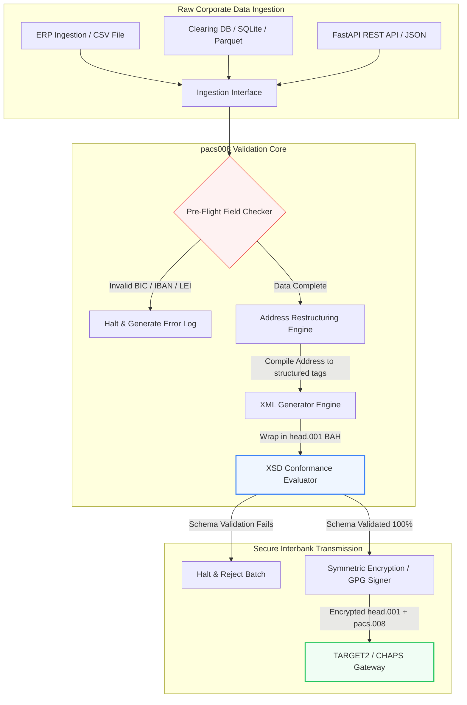

## Αυτοματοποίηση διατραπεζικών πληρωμών ISO 20022 pacs.008 με Python ανοιχτού κώδικα το 2026

Γεφυρώνοντας το χάσμα μεταξύ των παλαιών χρηματοοικονομικών δεδομένων και της δομημένης διατραπεζικής ανταλλαγής μηνυμάτων μέσω ενός ελεγχόμενου, επικυρωμένου με σχήμα pipeline της Python.

Το σημείο αναφοράς ανοιχτού κώδικα για αυτό το άρθρο είναι το [pacs008 ⧉](https://github.com/sebastienrousseau/pacs008 "pacs008 — open-source Python library"). Το αποθετήριο τοποθετείται ως μια βιβλιοθήκη Python για την αυτοματοποίηση μηνυμάτων XML [ISO 20022](/2023-09-29-automating-iso-20022-compliant-payment-file-creation-with-pain001/index.html) pacs.008 μεταφοράς πίστωσης πελάτη FI-to-FI.

## Γιατί αυτό το έργο ανοιχτού κώδικα έχει σημασία το 2026

Η παγκόσμια υποδομή εκκαθάρισης διατραπεζικών πληρωμών περνά τον βαθύτερο εκσυγχρονισμό της εδώ και σχεδόν μισό αιώνα.

Τον Ιούνιο του 2026, ο τομέας των χρηματοοικονομικών υπηρεσιών πλησιάζει με ταχείς ρυθμούς το **κατώφλι δομημένης διεύθυνσης του SWIFT της 14ης Νοεμβρίου 2026**. Από την ημερομηνία αυτή και μετά, οι οδηγίες SWIFT CBPR+, μαζί με τα TARGET2, CHAPS, Fedwire και το καναδικό Lynx, θα καταργήσουν επίσημα τις μη δομημένες γραμμές ταχυδρομικής διεύθυνσης (με χρήση μόνο του `<AdrLine>` εντός των μπλοκ `<PstlAdr>`). Όλα τα συμμετέχοντα χρηματοπιστωτικά ιδρύματα πρέπει να μεταδίδουν διευθύνσεις είτε σε υβριδική μορφή (δομημένα `<TwnNm>` και `<Ctry>`, με μέγιστο δύο στοιχεία `<AdrLine>` για τις υπόλοιπες λεπτομέρειες) είτε σε πλήρως δομημένη μορφή (ξεχωριστά στοιχεία για το όνομα οδού, τον αριθμό κτιρίου και τον ταχυδρομικό κώδικα). Οποιοδήποτε μήνυμα δεν πληροί αυτό το κριτήριο θα απορρίπτεται στα σύνορα του δικτύου.

Για τα χρηματοπιστωτικά ιδρύματα, αυτή η μετάβαση δημιουργεί σημαντικούς λειτουργικούς περιορισμούς:

1. **Η ποινή απόρριψης στα σύνορα.** Οι πληρωμές που δεν πληρούν τα κριτήρια δομημένης διεύθυνσης θα αντιμετωπίσουν άμεσες απορρίψεις δικτύου, προκαλώντας καθυστερήσεις συναλλαγών, μπλοκαρίσματα ρευστότητας και λειτουργικές συσσωρεύσεις.
2. **SEPA Verification of Payee (VoP).** Επιβάλλει σε όλους τους Παρόχους Υπηρεσιών Πληρωμών (PSP) εντός της ζώνης SEPA να επαληθεύουν την αντιστοιχία μεταξύ του ονόματος του δικαιούχου και του IBAN πριν από την εκτέλεση μεταφορών πίστωσης, προσθέτοντας ακόμη μία πύλη επικύρωσης στην έναρξη του μηνύματος.

Το [Pacs008](https://github.com/sebastienrousseau/pacs008) λύνει αυτό το πρόβλημα. Είναι μια ανοιχτού κώδικα, ελαφριά βιβλιοθήκη Python που αυτοματοποιεί τη μετατροπή ακατέργαστων χρηματοοικονομικών δεδομένων σε πλήρως επικυρωμένα, συμβατά με το σχήμα μηνύματα ISO 20022 pacs.008 διατραπεζικής μεταφοράς πίστωσης πελάτη. Γεφυρώνοντας το χάσμα μεταξύ παλαιών και δομημένων δεδομένων, το pacs008 προσφέρει υψηλή Απόδοση στην Ανθεκτικότητα (RoR), διατηρώντας το κεφάλαιο κίνησης και διασφαλίζοντας την εκτέλεση σε πραγματικό χρόνο σε όλες τις παγκόσμιες ράγες.

## Η αρχιτεκτονική οπτική του pacs008 για το 2026

Η βιβλιοθήκη pacs008 είναι δομημένη ως μια απομονωμένη μηχανή επικύρωσης και δημιουργίας, διασφαλίζοντας ότι οι ακατέργαστες είσοδοι αναλύονται, εμπλουτίζονται και ενθυλακώνονται συστηματικά σε τυποποιημένους φακέλους:

| Επίπεδο | Σχεδιαστική απόφαση | Γιατί έχει σημασία | Κίνδυνος σε περίπτωση κακού χειρισμού |
|---|---|---|---|
| **Επίπεδο εισόδου** | Εισαγωγή CSV, JSON, SQLite και Parquet | Συναντά τις τραπεζικές ομάδες ενσωμάτωσης εκεί όπου βρίσκονται ήδη τα δεδομένα τους, αποτρέποντας μεταναστεύσεις πλατφορμών. | Εισαγωγή ακατέργαστων, μη επικυρωμένων ή αλλοιωμένων φορτίων δεδομένων. |
| **Επίπεδο επικύρωσης** | Προκαταρκτική επικύρωση έναντι επίσημων σχημάτων XSD και προσαρμοσμένων επιχειρηματικών κανόνων | Σταματά την εκτέλεση και επισημαίνει σφάλματα πριν το αρχείο πληρωμής μεταδοθεί στο δίκτυο εκκαθάρισης. | Μη έγκυρα αρχεία XML που προκαλούν άμεσες απορρίψεις δικτύου και καθυστερήσεις εκκαθάρισης. |
| **Επίπεδο φακέλου BAH** | Αυτόματη ενθυλάκωση Business Application Header (head.001) | Τυποποιεί την αποστολή και δρομολόγηση μηνυμάτων βάσει της ετικέτας `<MsgDefIdr>`. | Μετάδοση ακατέργαστων φορτίων pacs.008 χωρίς τον απαιτούμενο εξωτερικό φάκελο, προκαλώντας απόρριψη από το σύστημα. |
| **Επίπεδο σειριοποίησης** | Υποστήριξη τυπικού XML και συμβατού με ISO JSON (TS 23029) | Επιτρέπει την άμεση μετάφραση μεταξύ φορτίων XML και JSON, υποστηρίζοντας σύγχρονο REST API και ροές Kafka. | Κατακερματισμένες αναπαραστάσεις δεδομένων που παραβιάζουν τις επίσημες οδηγίες ISO. |
| **Επίπεδο παρατηρησιμότητας** | Ιχνηλάτηση OpenTelemetry με κλειδί το UETR | Καταγράφει λεπτομερείς διαδρομές εκτέλεσης και αρχεία καταγραφής, παρέχοντας δυνατότητα ελέγχου σε πραγματικό χρόνο. | Κενά ιχνηλάτησης που εμποδίζουν τη λειτουργική ορατότητα και τον έλεγχο. |

## Βασικά διατραπεζικά σήματα και κανονιστικά ορόσημα

Για να αποδείξουν τη λειτουργική ανθεκτικότητα των συναλλαγών, τα ανώτερα στελέχη τεχνολογίας και κινδύνου πρέπει να παρακολουθούν συγκεκριμένους, μετρήσιμους δείκτες συμμόρφωσης:

| Σήμα | Μετρική / Λειτουργικό σημείο αναφοράς | Αναφορά G20 / SWIFT / DORA | Τεχνική υλοποίηση πλατφόρμας |
|---|---|---|---|
| **Συμμόρφωση δομημένης διεύθυνσης** | % των μηνυμάτων pacs.008 που χρησιμοποιούν πλήρως δομημένα πεδία `<PstlAdr>` με καθορισμένα `<TwnNm>` και `<Ctry>`. | Προθεσμία SWIFT SR 2026 | Προκαταρκτικοί έλεγχοι σχήματος στο pacs008 που απορρίπτουν μη δομημένες γραμμές διεύθυνσης. |
| **SEPA Verification of Payee** | Επικύρωση αντιστοιχίας μεταξύ του ονόματος του δικαιούχου και του IBAN πριν από την εκτέλεση του μηνύματος. | Κανονισμός SEPA VoP | Ενσωματωμένες βοηθητικές κλάσεις VoP που εκτελούν ερωτήματα προεπικύρωσης σε IBAN/BIC. |
| **Ενσωμάτωση BAH head.001** | Ποσοστό εξερχόμενων φορτίων πληρωμής που ενθυλακώνονται επιτυχώς σε Business Application Headers. | Οδηγίες TARGET2 / CBPR+ | Υποσύστημα ενθυλάκωσης BAH που συνθέτει αυτόματα τον εξωτερικό φάκελο XML. |
| **Άθροισμα ελέγχου LEI Modulo** | Επικύρωση ψηφίου ελέγχου ISO 7064 Modulo 97-10 στα μπλοκ `<LEI>` οφειλέτη και πιστωτή. | Εντολή της Τράπεζας της Αγγλίας | Αλγοριθμικός ελεγκτής που επαληθεύει την ακεραιότητα του αναγνωριστικού 20 χαρακτήρων. |
| **Ακρίβεια παρακολούθησης UETR** | 100% των παραγόμενων πληρωμών εισάγονται με έγκυρο Unique End-to-End Transaction Reference. | Προδιαγραφές SWIFT UETR | Αυτοματοποιημένη δημιουργία και ιχνηλάτηση του κωδικού αναφοράς UUIDv4 36 χαρακτήρων. |

## Γιατί η Python είναι το ιδανικό σημείο εισόδου για τη διατραπεζική αυτοματοποίηση

Οι σύγχρονοι κόμβοι πληρωμών και οι ομάδες λειτουργιών διαχείρισης διαθεσίμων το 2026 βασίζονται σε μεγάλο βαθμό στην Python για τον μετασχηματισμό δεδομένων, τη χρηματοοικονομική μοντελοποίηση και την ενσωμάτωση βάσεων δεδομένων ERP.

Αξιοποιώντας μια βιβλιοθήκη Python ανοιχτού κώδικα, τα ιδρύματα αποκτούν σημαντικά πλεονεκτήματα:

1. **Χαμηλό γνωστικό φορτίο και υψηλή διαλειτουργικότητα.** Η Python λειτουργεί ως μια συνεκτική γέφυρα. Επιτρέπει στους προγραμματιστές να γράφουν απλά scripts που αντλούν ακατέργαστες οδηγίες πληρωμής από παλαιές βάσεις δεδομένων, τις επικυρώνουν έναντι σύνθετων διεθνών τραπεζικών κανόνων και παράγουν συμβατό XML εντός μιας ενιαίας, ολοκληρωμένης ροής εργασίας.
2. **Εξάλειψη των αδιαφανών μεταφραστών «μαύρου κουτιού».** Οι ιδιόκτητες τραπεζικές πύλες συχνά χρεώνουν υψηλά τέλη αδειοδότησης για προσαρμοσμένους μεταφραστές αρχείων πληρωμής. Αυτοί οι μεταφραστές είναι ιδιόκτητα μαύρα κουτιά, καθιστώντας αδύνατο για τις ομάδες ασφαλείας να ελέγξουν πώς επεξεργάζονται τα δεδομένα ή πού αποθηκεύονται τα κλειδιά. Μια βιβλιοθήκη ανοιχτού κώδικα και επιθεωρήσιμη όπως το pacs008 διασφαλίζει πλήρη διαφάνεια κώδικα.
3. **Απρόσκοπτη ενσωμάτωση CI/CD.** Το Pacs008 ενσωματώνεται απευθείας σε pipelines συνεχούς ενσωμάτωσης και ανάπτυξης, επιτρέποντας στους προγραμματιστές να αυτοματοποιούν τον έλεγχο αρχείων πληρωμής ως μέρος του τυπικού κύκλου ζωής παράδοσης λογισμικού τους.

## Σχεδιάζοντας ένα οριοθετημένο διατραπεζικό pipeline

Μια σημαντική ευπάθεια στη διατραπεζική εκκαθάριση είναι η «ανεξέλεγκτη μαζική δημιουργία» — η δημιουργία αρχείων χωρίς έναν σαφή, οριοθετημένο βρόχο επαλήθευσης. Το Pacs008 έχει σχεδιαστεί για να λειτουργεί ως η κεντρική μηχανή επικύρωσης εντός ενός αυστηρά ελεγχόμενου pipeline συναλλαγών πολλαπλών σταδίων.

Η λειτουργική ροή παρακάτω δείχνει πώς τα ακατέργαστα συναλλακτικά δεδομένα περνούν μέσα από το pipeline του pacs008 για να δημιουργήσουν ένα κρυπτογραφικά ασφαλές, συμβατό με το σχήμα αρχείο pacs.008 ενθυλακωμένο σε φάκελο BAH:

## Το εγχειρίδιο του διοικητικού συμβουλίου και η καταπιστευματική ευθύνη

Η αυτοματοποίηση των διατραπεζικών πληρωμών είναι ζήτημα διαχείρισης κινδύνου και εταιρικής διακυβέρνησης σε επίπεδο διοικητικού συμβουλίου. Τα ανώτερα στελέχη πρέπει να αντιμετωπίσουν την ποιότητα των δεδομένων συναλλαγών υπό το πρίσμα της καταπιστευματικής ευθύνης και της μείωσης του λειτουργικού κινδύνου:

- **DORA Άρθρο 5 (Λογοδοσία του διοικητικού συμβουλίου).** Επιβάλλει άμεση, προσωπική ευθύνη στα μέλη του διοικητικού συμβουλίου για την ανθεκτικότητα και την ασφάλεια των λειτουργιών ΤΠΕ του ιδρύματος. Επειδή η διατραπεζική εκκαθάριση είναι μια κρίσιμη εταιρική λειτουργία, τα διοικητικά συμβούλια πρέπει να αποδείξουν ότι έχουν εφαρμόσει ισχυρούς, επικυρωμένους και αυτοματοποιημένους ελέγχους συναλλαγών για την πρόληψη λειτουργικών διαταραχών ή καθυστερημένων πληρωμών.
- **BCBS 239 (Συγκέντρωση και αναφορά δεδομένων κινδύνου).** Απαιτεί η αναφορά χρηματοοικονομικών συναλλαγών να είναι ακριβής, πλήρης και να παράγεται σε πραγματικό χρόνο. Το Pacs008 βοηθά τα ιδρύματα να επιτύχουν συμμόρφωση με το BCBS 239 διασφαλίζοντας ότι τα δεδομένα πληρωμών είναι καθαρά δομημένα και επικυρωμένα στην πηγή, εξαλείφοντας τα κενά δεδομένων και τα σφάλματα χειροκίνητης συμφωνίας που μαστίζουν τα παλαιά υπολογιστικά φύλλα.
- **Μετριασμός των κεφαλαιακών επιβαρύνσεων λειτουργικού κινδύνου (Basel III).** Σύμφωνα με τις οδηγίες Basel III, τα υψηλά ποσοστά σφαλμάτων πληρωμής και το κόστος χειροκίνητης παρέμβασης αυξάνουν τις κεφαλαιακές απαιτήσεις λειτουργικού κινδύνου της τράπεζας, δεσμεύοντας κεφάλαια που θα μπορούσαν διαφορετικά να διατεθούν για δανεισμό ή επενδύσεις. Η αυτοματοποίηση του pipeline πληρωμών ελαχιστοποιεί άμεσα αυτά τα κεφαλαιακά ασφάλιστρα, διατηρώντας την αξία του ισολογισμού.

## Τι σημαίνει αυτό ανά τύπο τράπεζας

### Παγκόσμια συστημικά σημαντικές τράπεζες (G-SIBs)

Οι G-SIBs διαχειρίζονται τεράστιους, διασυνοριακούς όγκους εταιρικών συναλλαγών. Η κύρια πρόκλησή τους είναι η αποκατάσταση των μη δομημένων παλαιών δεδομένων προτού φτάσουν στο δίκτυο εκκαθάρισης. Ενσωματώνοντας το pacs008 στις πύλες εταιρικής τραπεζικής τους, οι G-SIBs μπορούν να παρέχουν αυτοματοποιημένα εργαλεία επικύρωσης στους εταιρικούς πελάτες τους, μειώνοντας το κόστος των χειροκίνητων διορθώσεων πληρωμών και διασφαλίζοντας την εκτέλεση σε πραγματικό χρόνο σε όλο το δίκτυο SWIFT.

### Τράπεζες συναλλαγών και εταιρικές τράπεζες

Για τις τράπεζες συναλλαγών, η ποιότητα των δεδομένων πληρωμών αποτελεί ανταγωνιστικό διαφοροποιητή. Προσφέροντας ένα εργαλείο επικύρωσης ανοιχτού κώδικα και επιθεωρήσιμο όπως το pacs008 στους εταιρικούς πελάτες διαχείρισης διαθεσίμων, αυτές οι τράπεζες μπορούν να επιταχύνουν την ενσωμάτωση, να ελαχιστοποιήσουν τις απορρίψεις αρχείων πληρωμής και να οικοδομήσουν την εμπιστοσύνη των πελατών μέσω ανώτερων ποσοστών straight-through processing.

### Περιφερειακές και μικρότερες τράπεζες

Οι περιφερειακές τράπεζες πρέπει να διατηρούν τη συμμόρφωση με τα διεθνή πρότυπα πληρωμών χωρίς τους τεράστιους τεχνολογικούς προϋπολογισμούς των G-SIBs. Το Pacs008 παρέχει μια ελαφριά, οικονομικά αποδοτική και πλήρως συμβατή λύση βασισμένη στην Python, δίνοντας τη δυνατότητα σε μικρότερα ιδρύματα να προσφέρουν σύγχρονες, δομημένες δυνατότητες έναρξης πληρωμών χωρίς ακριβές άδειες ιδιόκτητου middleware.

## Συμπέρασμα: Ο οδικός χάρτης της διατραπεζικής εκκαθάρισης

Η επερχόμενη προθεσμία δομημένης διεύθυνσης του SWIFT τον Νοέμβριο του 2026 αντιπροσωπεύει ένα αυστηρό όριο για τις λειτουργίες εταιρικής διαχείρισης διαθεσίμων. Η εξάρτηση από παλαιά υπολογιστικά φύλλα, χειροκίνητη εισαγωγή δεδομένων και μη δομημένα αρχεία πληρωμών αποτελεί ενεργό επιχειρηματικό κίνδυνο.

Για να διασφαλίσουν τη συνέχεια των συναλλαγών και να ελαχιστοποιήσουν το λειτουργικό κόστος, τα ανώτερα στελέχη τεχνολογίας και οικονομικών θα πρέπει να εκτελέσουν σήμερα έναν σαφή οδικό χάρτη εκκαθάρισης:

1. **Επιβάλετε την επικύρωση στην πηγή.** Απαιτήστε όλες οι οδηγίες πληρωμής να επικυρώνονται και να μορφοποιούνται σύμφωνα με τα επίσημα σχήματα ISO 20022 XSD πριν εγκαταλείψουν τα όρια του εταιρικού ERP.
2. **Ελέγξτε το pipeline δεδομένων.** Απομακρυνθείτε από τη χειροκίνητη επεξεργασία υπολογιστικών φύλλων και εφαρμόστε αυτοματοποιημένες, επιθεωρήσιμες ροές εργασίας βασισμένες στην Python με χρήση του pacs008.
3. **Εφαρμόστε υβριδική ασφάλεια.** Διασφαλίστε ότι τα παραγόμενα αρχεία πληρωμής υπογράφονται κρυπτογραφικά και κρυπτογραφούνται πριν από τη μετάδοση, ικανοποιώντας τις προσδοκίες δικτύου μηδενικής εμπιστοσύνης.
4. **Ευθυγραμμιστείτε με τις καταπιστευματικές προτεραιότητες.** Αναφέρετε επίσημα τις μετρικές αυτοματοποίησης πληρωμών και ποιότητας δεδομένων στο διοικητικό συμβούλιο, πλαισιώνοντας την επένδυση ως ένα κρίσιμο πρόγραμμα μείωσης λειτουργικού κινδύνου στο πλαίσιο του DORA.

## Συχνές ερωτήσεις

**Είναι το pacs008 συμβατό με τους επερχόμενους κανόνες διευθύνσεων του SWIFT SR 2026;**

Ναι. Το Pacs008 έχει σχεδιαστεί για να υποστηρίζει το αυστηρό ορόσημο δομημένης διεύθυνσης του SWIFT τον Νοέμβριο του 2026, επιβάλλοντας τον υποχρεωτικό διαχωρισμό των στοιχείων ταχυδρομικής διεύθυνσης (πόλη, χώρα, ταχυδρομικός κώδικας) σε καθορισμένα πεδία XML του ISO 20022.

**Μπορεί το pacs008 να ενθυλακώσει φορτία πληρωμής σε Business Application Headers;**

Ναι. Επειδή το pacs008 υποστηρίζει εγγενώς την ενθυλάκωση Business Application Header (BAH head.001), συνθέτει αυτόματα τον εξωτερικό φάκελο που απαιτείται από τα δίκτυα TARGET2, CHAPS και CBPR+.

**Γιατί μια βιβλιοθήκη ανοιχτού κώδικα προτιμάται έναντι των ιδιόκτητων μεταφραστών αρχείων;**

Οι ιδιόκτητοι μεταφραστές είναι αδιαφανή μαύρα κουτιά, καθιστώντας αδύνατους τους ελέγχους ασφαλείας. Μια βιβλιοθήκη ανοιχτού κώδικα με αξιολόγηση από ομοτίμους όπως το pacs008 προσφέρει πλήρη διαφάνεια κώδικα, επιτρέποντας στις ομάδες ασφαλείας να επαληθεύσουν ότι κανένα ευαίσθητο δεδομένο πληρωμής δεν εκτίθεται κατά την επεξεργασία.

**Ποια αναγνωριστικά επικυρώνει το pacs008;**

Το Pacs008 διαθέτει ενσωματωμένους επικυρωτές για Bank Identifier Codes (BICs) και Legal Entity Identifiers (LEIs) με χρήση υπολογισμών αθροίσματος ελέγχου ISO 7064 Modulo 97-10, καθώς και επικύρωση ψηφίου ελέγχου IBAN και ελέγχους μοναδικότητας UETR.

## Αναφορές

- SWIFT, (2024). *ISO 20022 November 2026 Structured Address Milestone*. La Hulpe: SWIFT. Διαθέσιμο στο: [SWIFT ISO 20022 Milestone ⧉](https://www.swift.com/standards/iso-20022/iso-20022-bytes/call-action-november-2026 "SWIFT ISO 20022 milestone").
- Basel Committee on Banking Supervision (BCBS), (2013). *Principles for effective risk data aggregation and risk reporting (BCBS 239)*. Basel: Bank for International Settlements. Διαθέσιμο στο: [BCBS 239 Principles ⧉](https://www.bis.org/publ/bcbs239.htm "BCBS 239 principles").
- European Parliament and Council of the European Union, (2022). *Regulation (EU) 2022/2554 on digital operational resilience for the financial sector (DORA)*. Brussels: Official Journal of the European Union. Διαθέσιμο στο: [DORA Regulation ⧉](https://eur-lex.europa.eu/legal-content/EN/TXT/?uri=CELEX%3A32022R2554 "DORA regulation").
- GitHub, (2026). *pacs008 open-source repository*. Διαθέσιμο στο: [pacs008 Repository ⧉](https://github.com/sebastienrousseau/pacs008 "pacs008 repository").
