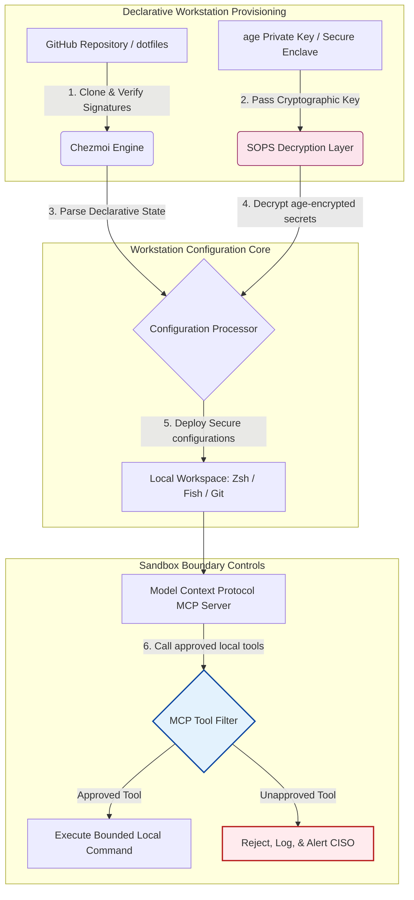

## AI-Aware Dotfiles το 2026: Δημιουργία Ασφαλούς, Αναπαραγώγιμου Σταθμού Εργασίας Προγραμματιστή για MCP, SLSA και Ισοτιμία Πολλαπλών Κελυφών

Γεφυρώνοντας το χάσμα μεταξύ της δηλωτικής διαμόρφωσης σταθμού εργασίας και των ασφαλών εφοδιαστικών αλυσίδων λογισμικού σε μια εποχή τοπικών μοντέλων AI και agentic εργαλείων ανάπτυξης.

Το σημείο αναφοράς ανοιχτού κώδικα για αυτό το άρθρο είναι το [dotfiles ⧉](https://github.com/sebastienrousseau/dotfiles "dotfiles — declarative workstation configuration"). Το αποθετήριο τοποθετείται ως: δηλωτικά dotfiles για macOS, Linux και WSL, προσφέροντας ισοτιμία πολλαπλών κελυφών, εκκίνηση σε λιγότερο από ένα δευτερόλεπτο, εκδόσεις υπογεγραμμένες με SLSA και διαμόρφωση με επίγνωση AI/MCP.

## Γιατί Έχει Σημασία Αυτό το Έργο Ανοιχτού Κώδικα το 2026

Τον Ιούνιο του 2026, ο σταθμός εργασίας του προγραμματιστή είναι ο πιο αδύναμος κρίκος στην εφοδιαστική αλυσίδα λογισμικού και ένας υψηλής αξίας στόχος για εξελιγμένα κρατικά και εγκληματικά κυβερνοσυνδικάτα.

Το τοπίο ασφάλειας του περιβάλλοντος ανάπτυξης έχει αλλάξει ριζικά με την άνοδο των βοηθών κωδικοποίησης AI βασισμένων σε τερματικό (όπως το Claude Code) και την υιοθέτηση του Model Context Protocol (MCP). Τα τοπικά τερματικά προγραμματιστών φιλοξενούν πλέον ενεργούς, αυτόνομους πράκτορες AI ικανούς να:

- Διαβάζουν και επεξεργάζονται τοπικά αρχεία πηγαίου κώδικα.
- Καλούν τοπικά εργαλεία CLI (`git`, `npm`, `aws`, `kubectl`).
- Επιθεωρούν μεταβλητές περιβάλλοντος κελύφους, τοπικές βάσεις δεδομένων και ρυθμίσεις διαμόρφωσης.

Εάν το τοπικό περιβάλλον του προγραμματιστή στερείται αυστηρών ορίων, αυτά τα αυτόνομα εργαλεία AI μπορούν κατά λάθος να διαβάσουν ευαίσθητα προσωπικά δεδομένα, να διαρρεύσουν διαπιστευτήρια cloud σε δημόσια API LLM ή να εκτελέσουν κακόβουλα πακέτα κατά τη διάρκεια αυτοματοποιημένων εκδόσεων.

Σύμφωνα με τον Κανονισμό για την Ψηφιακή Επιχειρησιακή Ανθεκτικότητα (DORA) και το NIST Cybersecurity Framework (CSF) 2.0, τα χρηματοπιστωτικά ιδρύματα υποχρεούνται νομικά να επαληθεύουν την προέλευση και την ακεραιότητα ασφάλειας κάθε συσκευής που έχει πρόσβαση στην εφοδιαστική αλυσίδα λογισμικού. Τα «snowflake laptops» — χειροκίνητα διαμορφωμένες, μη ελεγμένες, αποκλίνουσες διαμορφώσεις — δεν συμμορφώνονται πλέον με τα παγκόσμια τραπεζικά πρότυπα.

Τα [Dotfiles του Sebastien Rousseau](https://github.com/sebastienrousseau/dotfiles) λύνουν αυτό το πρόβλημα. Πρόκειται για ένα ανοιχτού κώδικα, δηλωτικό πλαίσιο διαχείρισης σταθμού εργασίας που δημιουργεί ασφαλείς, αναπαραγώγιμους σταθμούς εργασίας προγραμματιστών. Επιβάλλοντας μια τυποποιημένη, ελέγξιμη βάση διαμόρφωσης, το έργο προσφέρει υψηλή Απόδοση Ανθεκτικότητας (Return on Resilience, RoR), μειώνοντας τον χρόνο ένταξης των προγραμματιστών από εβδομάδες σε ώρες και προστατεύοντας τις ευαίσθητες χρηματοοικονομικές εφοδιαστικές αλυσίδες από ευπάθειες τερματικών σημείων.

## Ο Αρχιτεκτονικός Φακός του AI-Aware Σταθμού Εργασίας 2026

Το πλαίσιο dotfiles λειτουργεί ως ασφαλής, δηλωτικός διαχειριστής περιβάλλοντος — όλα τα τοπικά κελύφη, εργαλεία και μυστικά διαχειρίζονται, ελέγχονται και απομονώνονται συστηματικά:

| Επίπεδο | Απόφαση Σχεδιασμού | Γιατί Έχει Σημασία | Κίνδυνος σε Περίπτωση Κακής Διαχείρισης |
|---|---|---|---|
| **Επίπεδο Παροχής** | Δηλωτική διαχείριση διαμόρφωσης μέσω Chezmoi | Δημιουργεί πλήρως αναπαραγώγιμους σταθμούς εργασίας σε macOS, Linux και WSL, εξαλείφοντας την απόκλιση. | Snowflake διαμορφώσεις με μη ελεγμένες, ευάλωτες τοπικές καταστάσεις. |
| **Επίπεδο Κελύφους** | Ισοτιμία πολλαπλών κελυφών (Zsh, Fish, Nushell) | Εξασφαλίζει πανομοιότυπη εκκίνηση σε λιγότερο από ένα δευτερόλεπτο και συνεπή συμπεριφορά ψευδωνύμων σε διαφορετικά περιβάλλοντα. | Ασυνέπειες εντολών κελύφους που προκαλούν απροσδόκητα αποτελέσματα σεναρίων. |
| **Επίπεδο Μυστικών** | Κρυπτογράφηση αρχείων με χρήση SOPS και age | Αποτρέπει την υποβολή σκληροκωδικοποιημένων διαπιστευτηρίων και ακατέργαστων κλειδιών στο Git ή την έκθεσή τους σε τοπικά LLM. | Διαπιστευτήρια που διαρρέουν στα ιστορικά δημόσιων αποθετηρίων ή παραβιάζονται από τοπικούς πράκτορες. |
| **Επίπεδο AI/MCP** | Έλεγχοι ορίων του Model Context Protocol | Περιορίζει τους τοπικούς πράκτορες AI σε μια συγκεκριμένη λίστα εγκεκριμένων εργαλείων, καταγράφοντας όλες τις τοπικές εκτελέσεις. | Απεριόριστοι πράκτορες AI που εκτελούν ανεξέλεγκτες ή καταστροφικές εντολές τοπικά. |
| **Επίπεδο Εφοδιαστικής Αλυσίδας** | Εκδόσεις υπογεγραμμένες με SLSA και επαλήθευση Sigstore | Αποδεικνύει κρυπτογραφικά τη γνησιότητα των σεναρίων bootstrap και των αρχείων διαμόρφωσης. | Παραβιασμένα σενάρια ρύθμισης που εισάγουν κακόβουλες κερκόπορτες στα περιβάλλοντα προγραμματιστών. |

## Βασικά Σήματα Ασφάλειας και Αυτοματοποίησης Σταθμού Εργασίας

Για τη διατήρηση απόλυτης ασφάλειας σε όλο τον στόλο ανάπτυξης, οι Επικεφαλής Ασφάλειας Πληροφοριών (CISO) και οι διευθυντές τεχνολογίας πρέπει να παρακολουθούν συγκεκριμένους, μετρήσιμους λειτουργικούς δείκτες:

| Σήμα | Μετρική / Λειτουργικό Σημείο Αναφοράς | Αναφορά NIST CSF / DORA | Τεχνική Υλοποίηση Πλατφόρμας |
|---|---|---|---|
| **Αναπαραγωγιμότητα Σταθμού Εργασίας** | % των φορητών υπολογιστών προγραμματιστών που διαχειρίζονται πλήρως μέσω δηλωτικών αποθετηρίων dotfile χωρίς απόκλιση διαμόρφωσης. | NIST CSF 2.0 (PR.DS-01) | Έλεγχοι ανίχνευσης απόκλισης Chezmoi που εκτελούνται αυτόματα κατά την εκκίνηση του τερματικού. |
| **Υγιεινή Διαπιστευτηρίων** | Μηδέν μη κρυπτογραφημένα μυστικά ή κλειδιά αποθηκευμένα σε απλό κείμενο σε όλα τα τοπικά αρχεία διαμόρφωσης. | DORA Άρθρο 6 (Ασφάλεια ΤΠΕ) | Git pre-commit hooks και τοπικές σαρώσεις που απορρίπτουν μη κρυπτογραφημένα αρχεία. |
| **Προέλευση Έκδοσης** | 100% των βοηθητικών προγραμμάτων bootstrap σταθμού εργασίας επαληθευμένα με χρήση κρυπτογραφικά υπογεγραμμένων μανιφέστων. | DORA Άρθρο 30 (Εφοδιαστική Αλυσίδα) | Επαλήθευση Sigstore και SLSA Level 3 ενσωματωμένη στους αγωγούς ρύθμισης. |
| **Χρόνος Ένταξης Προγραμματιστή** | Χρόνος που μεσολαβεί από την παροχή του ακατέργαστου υλικού έως έναν πλήρως διαμορφωμένο, συμμορφούμενο χώρο εργασίας ανάπτυξης. | Απόδοση Ανθεκτικότητας (RoR) | Αυτοματοποιημένα, δηλωτικά σενάρια ρύθμισης που μεταγλωττίζουν το περιβάλλον σε λιγότερο από 15 λεπτά. |
| **Οριοθετημένη Πρόσβαση Πράκτορα AI** | Επαλήθευση ότι τα τοπικά εργαλεία AI λειτουργούν εντός καθορισμένων ορίων καταλόγων με προεπιλογές μόνο για ανάγνωση. | Διαχείριση Κινδύνου Μοντέλων | Προφίλ διαμόρφωσης MCP που περιορίζουν τους καταλόγους εργαλείων των πρακτόρων σε εγκεκριμένες λειτουργίες. |

## Γιατί η Δηλωτική Διαμόρφωση Αποτελεί τον Πυρήνα της Ασφάλειας του Σταθμού Εργασίας

Οι παραδοσιακές προσεγγίσεις για τη ρύθμιση του σταθμού εργασίας προγραμματιστή είναι εξαιρετικά χειροκίνητες, καταλήγοντας σε «snowflake laptops» — περιβάλλοντα όπου οι διαμορφώσεις αποκλίνουν με την πάροδο του χρόνου καθώς οι προγραμματιστές εγκαθιστούν προσαρμοσμένα εργαλεία, προσαρμόζουν μεταβλητές και τροποποιούν τοπικά σενάρια. Αυτή η απόκλιση δημιουργεί αρκετές κρίσιμες ευπάθειες:

1. **Μη παρακολουθούμενες σκιώδεις διαμορφώσεις.** Οι αποκλίνοντες φορητοί υπολογιστές συχνά εκτελούν ξεπερασμένα, ευάλωτα πακέτα λογισμικού ή τοπικά σενάρια που παρακάμπτουν τα εταιρικά εργαλεία ασφάλειας.
2. **Διαρροή μυστικών.** Οι προγραμματιστές συχνά σκληροκωδικοποιούν κλειδιά API, tokens GitHub ή διαπιστευτήρια AWS απευθείας σε σενάρια απλού κειμένου ή προφίλ κελύφους, καθιστώντας τα εξαιρετικά ευάλωτα σε κλοπή.
3. **Αναποτελεσματική ένταξη.** Η χειροκίνητη ρύθμιση ενός νέου σταθμού εργασίας προγραμματιστή μπορεί να διαρκέσει έως και δύο εβδομάδες μηχανικού χρόνου, επηρεάζοντας την ταχύτητα της ομάδας.

Με τη μετάβαση σε μια δηλωτική διαμόρφωση καθοδηγούμενη από μοντέλα με χρήση του Chezmoi, ολόκληρος ο χώρος εργασίας του προγραμματιστή γίνεται ένα σύστημα καταγραφής υπό έλεγχο εκδόσεων και αναπαραγώγιμο. Κάθε αλλαγή, ψευδώνυμο, εξάρτηση πακέτου και προεπιλογή ασφαλείας τεκμηριώνεται στο Git, επικυρώνεται έναντι των πολιτικών συμμόρφωσης του οργανισμού και επαληθεύεται κρυπτογραφικά πριν εφαρμοστεί στον φυσικό φορητό υπολογιστή.

## Σχεδιάζοντας ένα Οριοθετημένο Περιβάλλον Προγραμματιστή AI

Για να αποτραπεί η απόκτηση απεριόριστης πρόσβασης σε τοπικά περιουσιακά στοιχεία από τους τοπικούς πράκτορες AI και τα εργαλεία MCP, ο σταθμός εργασίας πρέπει να λειτουργεί ως οριοθετημένο επίπεδο εκτέλεσης.

Η λειτουργική ροή παρακάτω δείχνει πώς το πλαίσιο dotfiles συντονίζει τα Chezmoi, SOPS και age για την αποκρυπτογράφηση και ανάπτυξη ασφαλών dotfiles, διατηρώντας παράλληλα ένα απομονωμένο, sandboxed όριο εκτέλεσης για τους τοπικούς πράκτορες AI που καλούν εργαλεία MCP:

## Το Εγχειρίδιο του Διοικητικού Συμβουλίου και η Καταπιστευματική Ευθύνη

Η ασφάλεια του σταθμού εργασίας προγραμματιστή και η ακεραιότητα της εφοδιαστικής αλυσίδας αποτελούν κρίσιμες προτεραιότητες του διοικητικού συμβουλίου. Τα ανώτερα στελέχη πρέπει να αντιμετωπίζουν τον κίνδυνο του περιβάλλοντος ανάπτυξης μέσα από το πρίσμα της καταπιστευματικής ευθύνης, της κανονιστικής συμμόρφωσης και της διατήρησης της επιχειρηματικής αξίας:

- **DORA Άρθρο 5 (Λογοδοσία Διοικητικού Συμβουλίου).** Επιβάλλει ότι το διοικητικό όργανο (το συμβούλιο) φέρει την απόλυτη ευθύνη για τη διαχείριση του κινδύνου ΤΠΕ του ιδρύματος. Επειδή οι σταθμοί εργασίας των προγραμματιστών αποτελούν την πύλη προς την εφοδιαστική αλυσίδα λογισμικού, τα μέλη του διοικητικού συμβουλίου πρέπει να επαληθεύουν ότι τα τερματικά σημεία είναι ασφαλή, πλήρως ελέγξιμα και διαχειρίζονται υπό αυστηρά, αναπαραγώγιμα πλαίσια διαμόρφωσης για να ικανοποιήσουν τους κανονιστικούς ελέγχους.
- **Συμμόρφωση με το NIST CSF 2.0 (Ασφάλεια Τερματικών Σημείων).** Απαιτεί ότι μόνο εξουσιοδοτημένες και επικυρωμένες συσκευές, που εκτελούν τυποποιημένες, ασφαλείς διαμορφώσεις, μπορούν να έχουν πρόσβαση σε εταιρικά δίκτυα και αποθετήρια. Τα δηλωτικά dotfiles επιτρέπουν στις ομάδες ασφαλείας να αποδεικνύουν μαθηματικά ότι όλα τα περιβάλλοντα προγραμματιστών συμμορφώνονται με τη βάση ασφάλειας του οργανισμού, εξαλείφοντας τον κίνδυνο μη ελεγμένων ρυθμίσεων «snowflake».
- **Διατήρηση της Αξίας του Ισολογισμού.** Ένα μόνο παραβιασμένο διαπιστευτήριο προγραμματιστή ή μια παραβίαση της εφοδιαστικής αλυσίδας μπορεί να κοστίσει σε ένα ίδρυμα εκατομμύρια δολάρια σε αποκατάσταση, κανονιστικά πρόστιμα και ζημία στη φήμη. Η μετάβαση σε ένα ασφαλές, δηλωτικό περιβάλλον προγραμματιστή ελαχιστοποιεί άμεσα αυτόν τον κίνδυνο, διατηρώντας την αξία του ισολογισμού και προστατεύοντας την εμπιστοσύνη των πελατών.

## Τι Σημαίνει Αυτό ανά Τύπο Τράπεζας

### Παγκόσμια Συστημικά Σημαντικές Τράπεζες (G-SIBs)

Οι G-SIBs διαχειρίζονται χιλιάδες σταθμούς εργασίας προγραμματιστών σε πολλαπλές ηπείρους και κανονιστικές δικαιοδοσίες. Η κύρια πρόκλησή τους είναι η διατήρηση της συνέπειας της διαμόρφωσης και η αποτροπή της διαρροής διαπιστευτηρίων σε τεράστιες ομάδες μηχανικών. Υιοθετώντας ένα δηλωτικό, ανοιχτού κώδικα μοντέλο dotfiles με χρήση του Chezmoi, οι G-SIBs μπορούν να τυποποιήσουν την ασφάλεια των τερματικών σημείων, να αυτοματοποιήσουν τον έλεγχο συμμόρφωσης και να μειώσουν δραστικά τους χρόνους ένταξης προγραμματιστών από εβδομάδες σε λεπτά σε ολόκληρο τον παγκόσμιο οργανισμό.

### Τράπεζες Συναλλαγών και Εταιρικές Τράπεζες

Οι τράπεζες συναλλαγών λειτουργούν ευαίσθητες πύλες πληρωμών και υποδομές χονδρικού συμψηφισμού. Η απόδειξη της απόλυτης ακεραιότητας του κώδικα που αναπτύσσεται σε αυτά τα παραγωγικά περιβάλλοντα αποτελεί μη διαπραγματεύσιμη κανονιστική απαίτηση. Η τυποποίηση των σταθμών εργασίας προγραμματιστών υπό ένα ασφαλές, συμβατό με SLSA πλαίσιο dotfiles εγγυάται ότι η εφοδιαστική αλυσίδα λογισμικού είναι πλήρως ελεγμένη και προστατευμένη από τις ευπάθειες των τοπικών τερματικών σημείων των προγραμματιστών.

### Περιφερειακές και Μικρότερες Τράπεζες

Οι περιφερειακές τράπεζες πρέπει να διατηρούν υψηλά πρότυπα κυβερνοασφάλειας χωρίς τους τεράστιους προϋπολογισμούς ασφαλείας των G-SIBs. Αυτό το ανοιχτού κώδικα πλαίσιο dotfiles παρέχει μια ελαφριά, οικονομικά αποδοτική και εξαιρετικά ασφαλή λύση φιλική προς Python και Rust, επιτρέποντας στα μικρότερα ιδρύματα να υλοποιήσουν ασφάλεια τερματικών σημείων επιπέδου επιχείρησης και προστασία της εφοδιαστικής αλυσίδας χωρίς ακριβές άδειες ιδιόκτητου λογισμικού.

## Συμπέρασμα: Ο Οδικός Χάρτης του Σταθμού Εργασίας Προγραμματιστή

Ο σταθμός εργασίας του προγραμματιστή δεν είναι πλέον μια περιφερειακή συσκευή· αποτελεί ένα κρίσιμο επίπεδο ελέγχου στην εφοδιαστική αλυσίδα λογισμικού. Το να επιτρέπεται σε χειροκίνητα διαμορφωμένα, μη ελεγμένα «snowflake laptops» να έχουν πρόσβαση σε εταιρικά περιουσιακά στοιχεία αποτελεί σοβαρό λειτουργικό και κανονιστικό κίνδυνο.

Για να διασφαλίσουν την εφοδιαστική αλυσίδα λογισμικού και να προστατεύσουν τα τερματικά σημεία από ευπάθειες τοπικών πρακτόρων AI, οι ανώτεροι διευθυντές τεχνολογίας και ασφάλειας θα πρέπει να εκτελέσουν έναν σαφή οδικό χάρτη ανάπτυξης σήμερα:

1. **Επιβάλετε δηλωτική παροχή.** Καταργήστε σταδιακά τις χειροκίνητες, καθοδηγούμενες από έγγραφα διαδικασίες ρύθμισης και επιβάλετε την παροχή όλων των περιβαλλόντων προγραμματιστών δηλωτικά με χρήση του Chezmoi.
2. **Επιβάλετε υγιεινή μυστικών.** Επιβάλετε αυστηρά pre-commit hooks και βοηθητικά προγράμματα σάρωσης για να διασφαλίσετε ότι μηδέν ακατέργαστα διαπιστευτήρια, κλειδιά ή tokens API αποθηκεύονται σε απλό κείμενο σε όλες τις τοπικές διαμορφώσεις σταθμού εργασίας.
3. **Καθιερώστε όρια sandbox για AI.** Υλοποιήστε ασφαλή, οριοθετημένα προφίλ διαμόρφωσης MCP για να περιορίσετε τους τοπικούς βοηθούς και πράκτορες κωδικοποίησης AI σε εγκεκριμένα εργαλεία και καταλόγους μόνο για ανάγνωση.
4. **Ασφαλίστε την εφοδιαστική αλυσίδα.** Διασφαλίστε ότι όλα τα σενάρια bootstrap και οι διαμορφώσεις περιβάλλοντος επαληθεύονται κρυπτογραφικά με χρήση προέλευσης SLSA Level 3 πριν από την ανάπτυξη.

## Συχνές Ερωτήσεις

**Τι είναι το Chezmoi και γιατί χρησιμοποιείται για dotfiles;**

Το Chezmoi είναι ένας ανοιχτού κώδικα, ασφαλής, δηλωτικός διαχειριστής dotfile. Επιτρέπει στους προγραμματιστές να διαχειρίζονται τις τοπικές τους διαμορφώσεις ως αποθετήριο υπό έλεγχο εκδόσεων, διασφαλίζοντας απόλυτη συνέπεια και αναπαραγωγιμότητα σε διαφορετικά λειτουργικά συστήματα (macOS, Linux, WSL).

**Πώς προστατεύει τα μυστικά το πλαίσιο;**

Το πλαίσιο χρησιμοποιεί κρυπτογράφηση αρχείων SOPS (Secrets Operations) και age για την κρυπτογράφηση ευαίσθητων διαπιστευτηρίων (όπως tokens GitHub ή κλειδιά πρόσβασης cloud) απευθείας εντός του αποθετηρίου dotfile. Αυτό αποτρέπει την υποβολή των κλειδιών σε απλό κείμενο ή την ανάγνωσή τους από μη εξουσιοδοτημένους τοπικούς πράκτορες AI.

**Τι είναι το Model Context Protocol (MCP) και πώς επηρεάζει την ασφάλεια;**

Το MCP είναι ένα ανοιχτό πρότυπο που επιτρέπει στα μοντέλα AI να εκτελούν με ασφάλεια τοπικά εργαλεία και να έχουν πρόσβαση σε αρχεία. Το πλαίσιο dotfiles υλοποιεί αυστηρά αρχεία διαμόρφωσης MCP για να περιορίσει τα τοπικά εργαλεία και τους πράκτορες AI σε εγκεκριμένους καταλόγους και εντολές.

**Ποια κελύφη υποστηρίζει το πλαίσιο;**

Bash, Zsh, Fish, Nushell και PowerShell — με ισοτιμία σε macOS, Linux και WSL, ώστε η συμπεριφορά των εντολών να παραμένει πανομοιότυπη ανεξάρτητα από το τερματικό που ανοίγει ο προγραμματιστής.

## Αναφορές

- Open Source Security Foundation (OpenSSF), (2024). *Supply-chain Levels for Software Artifacts (SLSA)*. Διαθέσιμο στη διεύθυνση: [SLSA Framework ⧉](https://slsa.dev/ "SLSA framework").
- NIST, (2024). *NIST Cybersecurity Framework 2.0*. Gaithersburg: National Institute of Standards and Technology. Διαθέσιμο στη διεύθυνση: [NIST CSF 2.0 ⧉](https://www.nist.gov/cyberframework "NIST Cybersecurity Framework 2.0").
- European Parliament and Council of the European Union, (2022). *Regulation (EU) 2022/2554 on digital operational resilience for the financial sector (DORA)*. Brussels: Official Journal of the European Union. Διαθέσιμο στη διεύθυνση: [DORA Regulation ⧉](https://eur-lex.europa.eu/legal-content/EN/TXT/?uri=CELEX%3A32022R2554 "DORA regulation").
- GitHub, (2026). *dotfiles open-source repository*. Διαθέσιμο στη διεύθυνση: [dotfiles Repository ⧉](https://github.com/sebastienrousseau/dotfiles "dotfiles repository").
