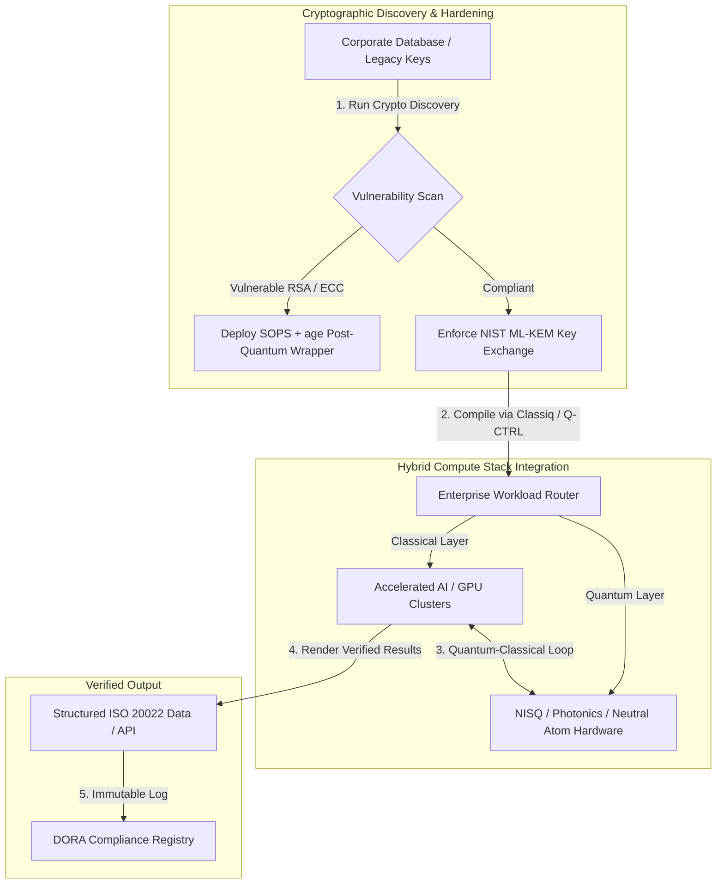

## Από τα Qubits στα Κέρδη: Στρατηγικά Συμπεράσματα από το 5ο Ετήσιο Συνέδριο Commercialising Quantum Global 2026 του Economist

Εταιρική ετοιμότητα, μεταβάσεις μετακβαντικής κρυπτογραφίας, υβριδικές στοίβες υπολογισμών και το αναδυόμενο εμπορικό τοπίο της κβαντικής ανίχνευσης και δικτύωσης.

**Εν συντομία.** Το 5ο Ετήσιο Συνέδριο Commercialising Quantum Global 2026, που φιλοξενήθηκε από το Economist Impact στις 16–17 Ιουνίου 2026 στο Business Design Centre του Λονδίνου, συγκέντρωσε πάνω από 1.100 ηγέτες παγκοσμίως από τους τομείς των επιχειρήσεων, της χρηματοοικονομικής, της πολιτικής και της έρευνας. Το κεντρικό θέμα σηματοδότησε μια σαφή δομική στροφή: η κβαντική τεχνολογία έχει μεταβεί από την κερδοσκοπική εργαστηριακή επιστήμη σε πρακτικές, υβριδικές επιχειρησιακές ροές εργασίας. Υποστηριζόμενη από $1,3 δισεκατομμύρια επιχειρηματικών κεφαλαίων που αντλήθηκαν μόνο στους πρώτους πέντε μήνες του 2026, η συζήτηση στο διοικητικό συμβούλιο δεν επικεντρώνεται πλέον στην καταμέτρηση φυσικών qubits, αλλά στη δημιουργία υβριδικών στοιβών υπολογισμών «χωρίς μετάνοια», στην προστασία των ψηφιακών περιουσιακών στοιχείων έναντι της κρυπτογραφικής απειλής «συγκομιδή τώρα, αποκρυπτογράφηση αργότερα» (SNDL) και στην ανάπτυξη συστημάτων κβαντικής ανίχνευσης βραχυπρόθεσμου ορίζοντα για πλοήγηση ανεξάρτητη από GPS.

## Βασικά συμπεράσματα

- **Η εταιρική στροφή προς πρακτικές ροές εργασίας.** Ηγέτες του κλάδου ([Steve Suarez](https://www.linkedin.com/in/stevesuarez) της HorizonX, [Phil Intallura](https://www.linkedin.com/in/intallura) της HSBC) τόνισαν ότι η κβαντική ενσωμάτωση δεν είναι πλέον πρόβλημα φυσικής αλλά επιχειρησιακό. Οι τράπεζες και οι επιχειρήσεις αναπτύσσουν υβριδικά κβαντικά-κλασικά πιλοτικά προγράμματα για να προετοιμάσουν το ταλέντο και να βελτιστοποιήσουν τα ενεργά φορτία εργασίας.
- **Η μετακβαντική κρυπτογραφία (PQC) είναι προτεραιότητα του διοικητικού συμβουλίου.** Ειδικοί σε θέματα ασφάλειας και νομικά (CMS UK, [Joanne Miller](https://www.linkedin.com/in/joanne-miller-nso) της Microsoft, [Craig Farrell](https://www.linkedin.com/in/craig-farrell) της EY) προειδοποίησαν ότι οι οργανισμοί δεν μπορούν να περιμένουν το ανθεκτικό σε σφάλματα υλικό για να αναπτύξουν PQC. Η συγκομιδή «συγκομιδή τώρα, αποκρυπτογράφηση αργότερα» συμβαίνει σήμερα, καθιστώντας τη μετάβαση στα πρότυπα NIST ML-KEM άμεσο καταπιστευματικό ζήτημα.
- **Η κβαντική ανίχνευση ηγείται της βραχυπρόθεσμης κερδοφορίας.** Ενώ ο ανθεκτικός σε σφάλματα υπολογισμός παραμένει χρόνια μακριά, η κβαντική ανίχνευση ([Matthew Kinsella](https://www.linkedin.com/in/matthewkinsella) της Infleqtion) κλιμακώνεται ραγδαία. Κβαντικά ρολόγια και αδρανειακοί αισθητήρες αναπτύσσονται σε πλοήγηση ανεξάρτητη από GPS, στην εθνική ασφάλεια και σε εξαιρετικά σταθερά ενεργειακά δίκτυα.
- **Κυριαρχία, συστάδες και επείγουσα πολιτική.** Ο Υπουργός Επιστημών του Ηνωμένου Βασιλείου [Lord Vallance](https://www.linkedin.com/in/patrick-vallance) και ο [Lord William Hague](https://www.linkedin.com/in/williamhague) σκιαγράφησαν εθνικές αποστολές για τη μετατροπή της έρευνας σε βιομηχανικής κλίμακας «υπερσυστάδες» (superclusters) που συντονίζονται με το National Quantum Computing Centre (NQCC). Ο επικείμενος EU Quantum Act υπογραμμίζει περαιτέρω τη γεωπολιτική βιασύνη για κυρίαρχη υπολογιστική ικανότητα.
- **Η Quantcore κερδίζει το βραβείο qBIG.** Η Quantcore, τεχνοβλαστός (spin-out) του Πανεπιστημίου της Γλασκώβης, εξασφάλισε το βραβείο IOP qBIG για τα πρωτοποριακά υπεραγώγιμα εξαρτήματά της με βάση το νιόβιο, τα οποία λειτουργούν σε υψηλότερες θερμοκρασίες από τα παραδοσιακά υλικά, μειώνοντας σημαντικά το κόστος της κρυογονικής υποδομής.

**Σχετική ανάγνωση:** [Το KyberLib και η Μετακβαντική Τραπεζική Μετάβαση το 2026: Από τα Πρότυπα στον Κώδικα](https://sebastienrousseau.com/2026-06-12-kyberlib-post-quantum-banking-migration-standards-code-2026/), [Ο Δείκτης Τραπεζικής Ανθεκτικότητας το 2026: AI, Cloud, Quantum, Πληρωμές και Κίνδυνος Συγκέντρωσης Τρίτων](https://sebastienrousseau.com/2026-06-08-banking-resilience-index-ai-cloud-quantum-payments-third-party-risk-2026/), [Ο Δείκτης Cloud Native Τραπεζικής το 2026: DORA, Μηχανική Πλατφορμών, Κυρίαρχο Cloud και Επιχειρησιακή Ανθεκτικότητα](https://sebastienrousseau.com/2026-06-05-cloud-native-banking-index-dora-resilience-platform-engineering-2026/).

## 01. Γιατί το Συνέδριο του 2026 έχει σημασία για το διοικητικό συμβούλιο

Η έκδοση του 2026 του συνεδρίου Commercialising Quantum Global του Economist σηματοδότησε μια μόνιμη μετατόπιση στον τρόπο με τον οποίο ο εταιρικός κόσμος αξιολογεί την προηγμένη τεχνολογία.

Ιστορικά, ο κβαντικός υπολογισμός είχε υποβιβαστεί στα τμήματα Έρευνας και Ανάπτυξης ως ένα πολυδεκαετές επιστημονικό εγχείρημα. Τον Ιούνιο του 2026, αυτή η οπτική είναι παρωχημένη. Οι οργανισμοί πρέπει να μεταβούν από τη «φυσικοκεντρική» περιέργεια στην «επιχειρηματικοκεντρική» υλοποίηση. Ο λόγος είναι διττός:

1. **Η σύγκλιση κβαντικής και AI.** Οι στοίβες υπολογισμών υψηλών επιδόσεων (HPC) συγχωνεύουν κλασικούς κόμβους, επιταχυνόμενη AI και κόμβους NISQ (Noisy Intermediate-Scale Quantum) σε ένα ενιαίο, ενοποιημένο επίπεδο υπολογισμού. Οι οργανισμοί που καθυστερούν να δημιουργήσουν εφαρμογές έτοιμες για την κβαντική εποχή θα ανακαλύψουν ότι το παράθυρο για την απόκτηση στρατηγικού πλεονεκτήματος κλείνει ταχύτερα από το αναμενόμενο.
2. **Γεωπολιτική και καταπιστευματική επείγουσα ανάγκη.** Με το καθοδηγούμενο από αποστολή κβαντικό πρόγραμμα του Ηνωμένου Βασιλείου και τον επικείμενο EU Quantum Act, η κβαντική ικανότητα έχει καταστεί ζήτημα εθνικής κυριαρχίας και εταιρικής συνέχειας.

Επιπλέον, η μετακβαντική κυβερνοασφάλεια δεν αποτελεί πλέον μελλοντική απαίτηση συμμόρφωσης. Η απειλή των εχθρικών επιθέσεων «αποθήκευση τώρα, αποκρυπτογράφηση αργότερα» (SNDL) σημαίνει ότι τα εταιρικά δεδομένα που υποκλέπτονται σήμερα θα αποκρυπτογραφηθούν όταν κλιμακωθούν τα εμπορικά κβαντικά συστήματα, δημιουργώντας άμεση ευθύνη υπό παγκόσμιες εντολές επιχειρησιακής ανθεκτικότητας όπως ο Digital Operational Resilience Act (DORA).

## 02. Το στρατηγικό πρίσμα του Commercialising Quantum 2026

Οι ηγέτες της εταιρικής τεχνολογίας πρέπει να χαρτογραφήσουν την κβαντική ωριμότητα σε πέντε διακριτά επιχειρησιακά επίπεδα, αξιολογώντας τους χρονικούς ορίζοντες και τους κινδύνους του ισολογισμού.

### Πίνακας 1: Το στρατηγικό πρίσμα του Commercialising Quantum 2026

| Επίπεδο | Εταιρική εστίαση | Χρονοδιάγραμμα / ορίζοντας | Βασικός εταιρικός κίνδυνος |
| ---- | ---- | ---- | ---- |
| **Υλικό & μεταγλωττιστής** | Επιλογή μεταξύ ανταγωνιστικών προσεγγίσεων (υπεραγώγιμα, παγιδευμένα ιόντα, ουδέτερα άτομα, φωτονική) | 3 – 5 έτη (ανθεκτικότητα σε σφάλματα) | Εγκλωβισμός σε μια αρχιτεκτονική αδιεξόδου ή υποστήριξη μιας μεμονωμένης πλατφόρμας πολύ νωρίς. |
| **Κρυπτογραφική θωράκιση** | Ανακάλυψη και καταγραφή κρυπτογραφικών εξαρτήσεων· μετάβαση στο NIST ML-KEM | Άμεση (ενεργή μετάβαση) | Συστημικές παραβιάσεις δεδομένων και αποτυχίες συμμόρφωσης υπό τον DORA και το NIST CSF 2.0. |
| **Κβαντική ανίχνευση** | Ανάπτυξη πλοήγησης ανεξάρτητης από GPS, εξαιρετικά σταθερών ρολογιών και βαρυτόμετρων | 1 – 2 έτη (άμεση εμπορική) | Επιχειρησιακή διαταραχή της εφοδιαστικής, της ναυτιλίας και των ενεργειακών δικτύων λόγω παρεμβολών GPS. |
| **Ενσωμάτωση συστημάτων** | Σύνδεση κβαντικού υλικού στα υπάρχοντα κλασικά HPC και υπερυπολογιστικά κέντρα δεδομένων | 1 – 3 έτη (υβριδική φάση) | Υψηλή καθυστέρηση, σημεία συμφόρησης μεταφοράς δεδομένων και κατακερματισμένα υπολογιστικά σιλό. |
| **Εταιρικό λογισμικό** | Έκθεση κβαντικών αλγορίθμων μέσω επιπέδων αφαίρεσης υψηλού επιπέδου και API (Classiq, Q-CTRL) | Άμεση (ανάπτυξη δεξιοτήτων) | Απομόνωση ταλέντου και ροών εργασίας από την πραγματική μηχανική εκτέλεση. |

## 03. Βασικά κβαντικά σήματα και εναύσματα για το διοικητικό συμβούλιο

Οι ηγέτες της τεχνολογίας πρέπει να παρακολουθούν συγκεκριμένες, μετρήσιμες δείκτες αγοράς και κανονιστικού πλαισίου για να καθοδηγήσουν τις κβαντικές τους επενδύσεις.

### Πίνακας 2: Βασικά κβαντικά σήματα και εναύσματα για το διοικητικό συμβούλιο

| Σήμα | Ποσοτικός δείκτης | Κανονιστική / πολιτική αναφορά | Εφαρμόσιμη προτεραιότητα πλατφόρμας |
| ---- | ---- | ---- | ---- |
| **Εκτόξευση κβαντικής χρηματοδότησης** | $1,3 δισεκατομμύρια αντλήθηκαν παγκοσμίως στους πρώτους πέντε μήνες του 2026 | Απόδοση από την Ανθεκτικότητα (RoR) | Μετατόπιση προϋπολογισμών από κερδοσκοπικά πιλοτικά σε υβριδικά κβαντικά-κλασικά φορτία εργασίας «χωρίς μετάνοια». |
| **Έκθεση αποκρυπτογράφησης δεδομένων** | Το 100% των κρυπτογραφημένων δεδομένων που μεταδίδονται μέσω δημόσιων καναλιών εκτίθεται στη συγκομιδή SNDL | DORA Άρθρο 6 (ασφάλεια ΤΠΕ) | Εφαρμογή εργαλείων κρυπτογραφικής ανακάλυψης για τον εντοπισμό ευάλωτων κλειδιών RSA/ECC σε όλη την υποδομή. |
| **Κυρίαρχη υποδομή** | Κατανομή £2,5 δισεκατομμυρίων της Εθνικής Κβαντικής Στρατηγικής του Ηνωμένου Βασιλείου | UK Quantum Missions / Lord Vallance | Δημιουργία τοπικών συνεργασιών με εθνικές υπερσυστάδες όπως το NQCC. |
| **Προθεσμίες συμμόρφωσης** | Μετάβαση σε δομημένη διεύθυνση του SWIFT στις 14 Νοεμβρίου 2026 | Οδηγία SWIFT SR 2026 | Καθαρισμός και μορφοποίηση διατραπεζικών βάσεων δεδομένων ώστε να πληρούν τις προδιαγραφές δομημένου XML. |

## 04. Εις βάθος ανάλυση των βασικών θεμάτων του συνεδρίου

### Η κβαντική τεχνολογία φτάνει σε σημείο καμπής για τις επενδύσεις

Η χρηματοδότηση επιχειρηματικών κεφαλαίων γνώρισε σημαντική επιτάχυνση, αντλώντας **$1,3 δισεκατομμύρια** μόνο στους πρώτους πέντε μήνες του 2026. Σε αντίθεση με τους κερδοσκοπικούς κύκλους υπερβολής των προηγούμενων ετών, το τρέχον κύμα κεφαλαίων υποστηρίζεται από πραγματικά, βραχυπρόθεσμα φορτία εργασίας. Ομιλητές από τη Classiq και το IBM Quantum Platform έδειξαν πώς τα επίπεδα αφαίρεσης λογισμικού και οι αυτοματοποιημένοι μεταγλωττιστές επιτρέπουν σε ομάδες προγραμματιστών χωρίς εξειδίκευση να εκτελούν υβριδικούς κβαντικούς-κλασικούς αλγορίθμους στη σημερινή κλασική υποδομή. Αυτή η στρατηγική «χωρίς μετάνοια» επιτρέπει στους οργανισμούς να δημιουργήσουν άμεσα ταλέντο και ροές εργασίας έτοιμες για την κβαντική εποχή.

### Νομικές και κανονιστικές προειδοποιήσεις για τη «συγκομιδή τώρα, αποκρυπτογράφηση αργότερα»

Νομικοί εταίροι και στελέχη κυβερνοασφάλειας προκάλεσαν έντονο ενδιαφέρον γύρω από το άμεσο του κινδύνου των δεδομένων. Εκπρόσωποι από τη χορηγό δικηγορική εταιρεία CMS UK και η CSO της Microsoft [Joanne Miller](https://www.linkedin.com/in/joanne-miller-nso) απηύθυναν μια αυστηρή προειδοποίηση προς την ανώτερη διοίκηση: *η αναμονή για την άφιξη του ανθεκτικού σε σφάλματα υλικού πριν από την ανάπτυξη μετακβαντικής κρυπτογραφίας αποτελεί κρίσιμη καταπιστευματική αποτυχία.*

Υπό το παράδειγμα «αποθήκευση τώρα, αποκρυπτογράφηση αργότερα» (SNDL), εχθρικοί δρώντες συγκομίζουν ενεργά κρυπτογραφημένα εταιρικά δεδομένα σήμερα με σκοπό να τα αποκρυπτογραφήσουν μόλις εμφανιστούν κρυπτογραφικά σημαντικοί κβαντικοί υπολογιστές. Οι οργανισμοί πρέπει να αναπτύξουν άμεσα μετακβαντικές προστασίες (όπως το NIST ML-KEM) για να προστατεύσουν μακρόβια ευαίσθητα σύνολα δεδομένων, πνευματική ιδιοκτησία και ιστορικά αρχεία πελατών.

### Η επανευθυγράμμιση της υπερβολής γύρω από την «κβαντική ανίχνευση»

Ενώ ο ανθεκτικός σε σφάλματα κβαντικός υπολογισμός παραμένει χρόνια μακριά, το συνέδριο ανέδειξε την κβαντική ανίχνευση ως το πρώτο πραγματικά κερδοφόρο κύμα ανάπτυξης στον πραγματικό κόσμο. Ο Διευθύνων Σύμβουλος [Matthew Kinsella](https://www.linkedin.com/in/matthewkinsella) της Infleqtion περιέγραψε λεπτομερώς πώς τα κβαντικά ρολόγια, οι αδρανειακοί αισθητήρες και τα ραδιοσυχνικά συστήματα κλιμακώνονται ραγδαία σε πολλαπλούς κλάδους.

Επειδή αυτές οι τεχνολογίες μετρούν φυσικές σταθερές με υποατομική ακρίβεια, καθιστούν δυνατή την **πλοήγηση ανεξάρτητη από GPS**, τα εξαιρετικά σταθερά ενεργειακά δίκτυα και τις τηλεπικοινωνίες βαθέος διαστήματος. Αυτές οι εφαρμογές είναι ιδιαίτερα σημαντικές για την αεροπορία, τις θαλάσσιες μεταφορές και τα συστήματα εθνικής άμυνας που αντιμετωπίζουν αυξανόμενες απειλές παρεμβολών GPS.

### Συνεργασία οικοσυστήματος και συστάδων

Το κβαντικό οικοσύστημα του Ηνωμένου Βασιλείου αξιοποίησε το συνέδριο του Λονδίνου για να προβάλει τις εγχώριες υπερσυστάδες καινοτομίας. Ζωντανές ενημερώσεις από το National Quantum Computing Centre (NQCC) και το Digital Catapult περιέγραψαν πώς οι τεχνοβλαστοί προηγμένης τεχνολογίας πρώιμου σταδίου μπορούν να γεφυρώσουν το «τεχνολογικό χάσμα» ενσωματώνοντας κβαντικό υλικό απευθείας σε κλασικά υπερυπολογιστικά κέντρα δεδομένων.

Ο [Wridhdhisom Karar](https://www.linkedin.com/in/wridhdhisomkarar), συνιδρυτής της σκωτσέζικης κβαντικής νεοφυούς επιχείρησης Quantcore, παρέλαβε το περίβλεπτο βραβείο Quantum Business Innovation and Growth (qBIG) του Institute of Physics (IOP) για τα υπεραγώγιμα εξαρτήματα της εταιρείας με βάση το νιόβιο. Αυτά τα εξαρτήματα λειτουργούν σε υψηλότερες θερμοκρασίες από τα παραδοσιακά υλικά, μειώνοντας σημαντικά το κόστος κρυογονικής υποδομής που απαιτείται για την κλιμάκωση των κβαντικών επεξεργαστών.

### Η μελέτη περίπτωσης της HSBC: γιατί η αναμονή για την κβαντική τεχνολογία είναι «αδικαιολόγητο σφάλμα»

Οι επισημάνσεις του [**Philip Intallura, Ph.D.**](https://www.linkedin.com/in/intallura) (Global Head of Quantum Technologies της HSBC, Σύμβουλος της Κυβέρνησης του Ηνωμένου Βασιλείου και Σύμβουλος Διοικητικού Συμβουλίου) στο 5ο Ετήσιο Κβαντικό Συνέδριο του Economist (2026) απέδωσαν μια ισχυρή οδηγία προς το διοικητικό συμβούλιο: *«Η αναμονή για ανθεκτική σε σφάλματα κβαντική τεχνολογία πριν ξεκινήσετε είναι αδικαιολόγητο σφάλμα.»*

Ο Dr Intallura υποστήριξε ότι η συνήθης προσέγγιση «περίμενε και δες» μεταξύ των χρηματοπιστωτικών ιδρυμάτων είναι αυτογκόλ που βασίζεται σε τρεις εσφαλμένες υποθέσεις:

- **Η βραχυπρόθεσμη απόδοση επένδυσης (ROI) είναι πραγματική.** Σε εμπειρικές δοκιμές, η HSBC ξεπέρασε μοντέλα που εκτελούνται σήμερα σε παραγωγή, συνέδεσε την κβαντική εργασία με άλλα μέρη της επιχείρησης, χρησιμοποίησε την κβαντική τεχνολογία για να εμβαθύνει τις σχέσεις με ορισμένους από τους μεγαλύτερους πελάτες της και προσέλκυσε σημαντική νέα δραστηριότητα στην **HSBC Innovation Banking**.
- **Η κβαντική τεχνολογία έχει απότομη καμπύλη υιοθέτησης.** Η ανάπτυξη ικανοτήτων, ο καθορισμός στρατηγικής, η εξασφάλιση χρηματοδότησης και η εκτέλεση κύκλων πειραμάτων εντός ενός αυστηρά ρυθμιζόμενου οργανισμού δεν είναι σύντομο εγχείρημα. Οι διαδικασίες πρέπει να δοκιμάζονται και να προσαρμόζονται συστηματικά για την τεχνολογία.
- **Η κβαντική τεχνολογία είναι ένα οικοσύστημα.** Κανένας μεμονωμένος παίκτης δεν φτάνει εκεί μόνος του. Κάθε ερευνητική εργασία, POC και πιλοτικό πρόγραμμα που έχει εκτελέσει η HSBC έγινε σε στενή συνεργασία με έναν πάροχο κβαντικών τεχνολογιών, και σε ορισμένες περιπτώσεις η συνεργασία επεκτείνεται στην ακαδημαϊκή κοινότητα, στις ρυθμιστικές αρχές και στην κυβέρνηση.

**Καταληκτική οδηγία προς το διοικητικό συμβούλιο:** *«Η ικανότητα που θα χρειαστείτε την πρώτη ημέρα της ανθεκτικότητας σε σφάλματα είναι η ικανότητα που χτίζετε τώρα.»*

## 05. Εταιρική Κβαντική Ενσωμάτωση και Αγωγός Κρυπτογραφίας

Για την προστασία των ψηφιακών περιουσιακών στοιχείων ενώ οικοδομείται η κβαντική ετοιμότητα, η επιχείρηση πρέπει να δημιουργήσει έναν σαφή αγωγό ενσωμάτωσης.

## 06. Το Εγχειρίδιο του Διοικητικού Συμβουλίου: Εφαρμόσιμες Επιταγές

Για να μεταφράσει τις επισημάνσεις του συνεδρίου Commercialising Quantum Global 2026 σε άμεση επιχειρηματική αξία, η ανώτερη διοίκηση θα πρέπει να εκτελέσει το ακόλουθο τετράβημα εγχειρίδιο για το διοικητικό συμβούλιο:

1. **Εντολή για κρυπτογραφική ανακάλυψη.** Δώστε εντολή στον Chief Information Security Officer (CISO) να καταγράψει όλα τα κρυπτογραφικά περιουσιακά στοιχεία, χαρτογραφώντας κάθε παλαιό κλειδί RSA και ECC σε όλη την επιχείρηση για την προετοιμασία της μετακβαντικής μετάβασης.
2. **Ανάπτυξη υβριδικής στρατηγικής «χωρίς μετάνοια».** Αποφύγετε την αναμονή για τέλειο υλικό. Επενδύστε σε λογισμικό εμπνευσμένο από την κβαντική τεχνολογία και σε υβριδικά κλασικά-κβαντικά πιλοτικά προγράμματα για να αναπτύξετε εσωτερικό ταλέντο και να βελτιστοποιήσετε σύνθετα χαρτοφυλάκια εφοδιαστικής ή κινδύνου σήμερα.
3. **Αξιολόγηση της κβαντικής ανίχνευσης για την εφοδιαστική.** Εάν ο οργανισμός σας εξαρτάται από παγκόσμιες αλυσίδες εφοδιασμού, ναυτιλία ή κρίσιμες υποδομές, αξιολογήστε ενεργά συστήματα κβαντικής ανίχνευσης (όπως η πλοήγηση ανεξάρτητη από GPS) για τον μετριασμό των κινδύνων γεωπολιτικής διαταραχής.
4. **Εγγραφή για το Insight Hour της 30ής Ιουνίου.** Φροντίστε οι ηγέτες τεχνολογίας σας να εγγραφούν στο διαδικτυακό **Commercialising Quantum Global Insight Hour** στις 30 Ιουνίου 2026, στις 3:00 μ.μ. BST (με την υποστήριξη της IonQ), για να συνεχίσουν να παρακολουθούν τις στρατηγικές διαχείρισης εταιρικού κινδύνου και κατανομής ταλέντου.

## 07. Συχνές Ερωτήσεις

**Τι είναι η «συγκομιδή τώρα, αποκρυπτογράφηση αργότερα» (SNDL) και γιατί έχει σημασία σήμερα;**
Το SNDL είναι η πρακτική της υποκλοπής και αποθήκευσης κρυπτογραφημένων δεδομένων σήμερα, με σκοπό την αποκρυπτογράφησή τους αργότερα, μόλις γίνουν διαθέσιμοι κρυπτογραφικά σημαντικοί κβαντικοί υπολογιστές. Μακρόβια ευαίσθητα σύνολα δεδομένων — πνευματική ιδιοκτησία, αρχεία πελατών, κυβερνητικές επικοινωνίες — αποτελούν ήδη στόχο. Η μετάβαση στο NIST ML-KEM είναι μια καταπιστευματική απόφαση που το διοικητικό συμβούλιο δεν μπορεί να αναβάλει.

**Γιατί η κβαντική ανίχνευση είναι το πρώτο εμπορικό κύμα αντί του υπολογισμού;**
Οι κβαντικοί αισθητήρες μετρούν φυσικές σταθερές με υποατομική ακρίβεια και δεν απαιτούν το ανθεκτικό σε σφάλματα υλικό που απαιτεί ο κβαντικός υπολογισμός. Κβαντικά ρολόγια, βαρυτόμετρα και αδρανειακοί αισθητήρες βρίσκονται ήδη σε πιλοτική ανάπτυξη για πλοήγηση ανεξάρτητη από GPS, εξαιρετικά σταθερά ενεργειακά δίκτυα και επικοινωνίες βαθέος διαστήματος.

**Είναι η κβαντική εργασία της HSBC απλώς Έρευνα και Ανάπτυξη ή έχει αποδώσει μετρήσιμες αποδόσεις;**
Σύμφωνα με τον Philip Intallura στο συνέδριο, η HSBC ξεπέρασε μοντέλα που εκτελούνται σήμερα σε παραγωγή, χρησιμοποίησε την κβαντική τεχνολογία για να εμβαθύνει τις σχέσεις με τους μεγαλύτερους πελάτες της και προσέλκυσε σημαντική νέα δραστηριότητα στην HSBC Innovation Banking. Η εργασία έχει μετακινηθεί από την έρευνα στην επιχειρησιακή ενσωμάτωση.

## 08. Αναφορές

- **Economist Impact, (2026).** *5th Annual Commercialising Quantum Global 2026.* Πρακτικά ζωντανού συνεδρίου, 16–17 Ιουνίου 2026. Λονδίνο: Business Design Centre. Διαθέσιμο στο: [Economist Impact](https://events.economist.com/commercialising-quantum/).
- **National Institute of Standards and Technology (NIST), (2024).** *First Three Finalized Post-Quantum Encryption Standards (FIPS 203, 204, and 205).* Gaithersburg: U.S. Department of Commerce. Διαθέσιμο στο: [NIST Standards](https://www.nist.gov/news-events/news/2024/08/nist-releases-first-3-finalized-post-quantum-encryption-standards).
- **European Parliament and Council of the European Union, (2022).** *Regulation (EU) 2022/2554 on digital operational resilience for the financial sector (DORA).* Βρυξέλλες: Επίσημη Εφημερίδα της Ευρωπαϊκής Ένωσης. Διαθέσιμο στο: [DORA Regulation](https://eur-lex.europa.eu/legal-content/EN/TXT/?uri=CELEX%3A32022R2554).
- **SWIFT, (2024).** *[ISO 20022](/2023-09-29-automating-iso-20022-compliant-payment-file-creation-with-pain001/index.html) November 2026 Structured Address Milestone.* La Hulpe: SWIFT. Διαθέσιμο στο: [SWIFT ISO 20022 milestone](https://www.swift.com/standards/iso-20022/iso-20022-bytes/call-action-november-2026).
