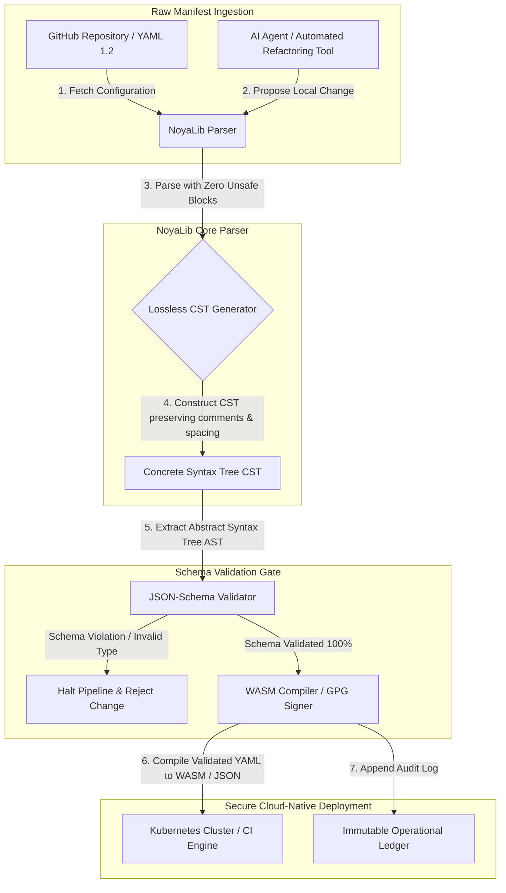

## Γιατί το YAML χρειάζεται μια ασφαλέστερη στοίβα Rust για AI, MCP και χρηματοοικονομικές υποδομές το 2026

Μια ασφαλέστερη στοίβα YAML σε Rust έχει σημασία επειδή το YAML πλέον φέρει τις ροές CI/CD, τα μανιφέστα Kubernetes, τους κανόνες [Open Policy Agent](https://www.openpolicyagent.org/) και τα μητρώα εργαλείων του Model Context Protocol (MCP) — και μια μόνο διφορούμενη ανάλυση μπορεί να καταρρίψει ένα σύστημα εκκαθάρισης, να παραμετροποιήσει λανθασμένα μια ομάδα ασφαλείας ή να παραχωρήσει σε έναν τοπικό πράκτορα AI τα λάθος δικαιώματα. Η [NoyaLib](https://github.com/sebastienrousseau/noyalib) είναι ένα οικοσύστημα ανάλυσης και επικύρωσης [YAML 1.2](https://yaml.org/spec/1.2.2/) καθαρά σε Rust και χωρίς unsafe, σχεδιασμένο ώστε να καθιστά αυτή την υποδομή ασφαλή εξ ορισμού.

## Σύντομη απάντηση

**Τι είναι η NoyaLib σε μία πρόταση;** Η NoyaLib είναι ένα οικοσύστημα ανάλυσης και επικύρωσης YAML 1.2 ανοιχτού κώδικα, καθαρά σε Rust, με μηδέν κώδικα `unsafe`, 100 % συμμόρφωση με τις προδιαγραφές σε ολόκληρη την επίσημη σουίτα 406 δοκιμών YAML, ένα Concrete Syntax Tree χωρίς απώλειες και επικύρωση [JSON Schema](https://json-schema.org/) σε πραγματικό χρόνο — σχεδιασμένο ώστε να καθιστά ασφαλή εξ ορισμού τη διαμόρφωση πρακτόρων AI, MCP, Kubernetes και χρηματοοικονομικών υποδομών.

## Εκτελεστική σύνοψη

Το YAML φαίνεται ταπεινό, μέχρι που μια διφορούμενη ανάλυση ή μια παραβίαση σχήματος καταρρίπτει ένα παραγωγικό σύστημα εκκαθάρισης πολλών δισεκατομμυρίων δολαρίων. Το 2026, το YAML είναι το de facto πρότυπο για τις ροές [CI/CD](https://docs.github.com/en/actions/learn-github-actions/workflow-syntax-for-github-actions), τα μανιφέστα [Kubernetes](https://kubernetes.io/docs/concepts/configuration/overview/), τους κανόνες [Open Policy Agent](https://www.openpolicyagent.org/) και τα μητρώα εργαλείων του Model Context Protocol (MCP). Οι αδιαφανείς παλαιοί αναλυτές — με ευπάθειες μνήμης και καταστροφική ανάλυση — αποτελούν έναν απαράδεκτο κίνδυνο ασφαλείας. Η NoyaLib είναι ένα οικοσύστημα YAML 1.2 καθαρά σε Rust και χωρίς unsafe: 100 % συμμόρφωση με τις προδιαγραφές σε όλες τις 406 επίσημες δοκιμές της σουίτας, ένα Concrete Syntax Tree (CST) χωρίς απώλειες που διατηρεί σχόλια και διαστήματα, και ενσωματωμένη επικύρωση JSON-Schema. Το αποτέλεσμα είναι ένα YAML που ανασχηματίζεται σε ένα ελέγξιμο, ασφαλές και προσβάσιμο από πράκτορες επίπεδο ελέγχου διαμόρφωσης.

## Βασικά συμπεράσματα

- **Η διαμόρφωση είναι παραγωγικός κώδικας.** Ένα μόνο δυσλειτουργικό αρχείο YAML μπορεί να παραμετροποιήσει λανθασμένα cloud-native ομάδες ασφαλείας ή δικαιώματα πρακτόρων AI. Η NoyaLib αντιμετωπίζει το YAML ως κρίσιμη υποδομή.
- **Σχεδιασμός χωρίς unsafe.** Χτισμένη εξ ολοκλήρου σε ασφαλή Rust με μηδέν μπλοκ `unsafe`, η NoyaLib εξαλείφει τις ευπάθειες ασφάλειας μνήμης — υπερχειλίσεις buffer, απομακρυσμένη εκτέλεση κώδικα — στα βασικά επίπεδα ανάλυσης.
- **Απόλυτη συμμόρφωση 406/406 με τις προδιαγραφές.** Επικυρώνει μαθηματικά τις δομές διαμόρφωσης, εξαλείφοντας τις αποκλίσεις ανάλυσης και τις δομικές παρεκκλίσεις μεταξύ των περιβαλλόντων staging και παραγωγής.
- **Concrete Syntax Tree χωρίς απώλειες.** Σε αντίθεση με τους παλαιούς αναλυτές που απορρίπτουν σχόλια και μορφοποίηση, η NoyaLib διατηρεί τα διαστήματα και τις σημειώσεις, επιτρέποντας ασφαλή, αμφίδρομη αυτοματοποιημένη αναδιάρθρωση από πράκτορες AI.
- **Καταπιστευτική αξία σε επίπεδο διοικητικού συμβουλίου.** Συνδέει την ακεραιότητα της διαμόρφωσης με το [DORA Άρθρο 5](https://eur-lex.europa.eu/legal-content/EN/TXT/?uri=CELEX%3A32022R2554) και τους δείκτες κεφαλαίου λειτουργικού κινδύνου της [Basel III](https://www.bis.org/bcbs/publ/d424.htm), προστατεύοντας άμεσα τα ανώτερα διοικητικά στελέχη από προσωπική ευθύνη.

**Σχετική ανάγνωση:** [Η KyberLib και η μετεωρική μετάβαση τραπεζών στη μετα-κβαντική εποχή το 2026: Από τα πρότυπα στον κώδικα](https://sebastienrousseau.com/2026-06-12-kyberlib-post-quantum-banking-migration-standards-code-2026/), [Ο δείκτης Cloud Native Banking το 2026: DORA, Platform Engineering, Sovereign Cloud και λειτουργική ανθεκτικότητα](https://sebastienrousseau.com/2026-06-05-cloud-native-banking-index-dora-resilience-platform-engineering-2026/), [AI-Aware Dotfiles το 2026: Χτίζοντας έναν ασφαλή, αναπαραγώγιμο σταθμό εργασίας προγραμματιστή για MCP, SLSA και ισοτιμία πολλαπλών κελυφών](https://sebastienrousseau.com/2026-06-16-ai-aware-dotfiles-secure-reproducible-workstation-2026/).

## 01. Γιατί μια ασφαλέστερη στοίβα YAML σε Rust έχει σημασία το 2026

Τον Ιούνιο του 2026, οι εταιρικές υποδομές πληροφορικής είναι εξαιρετικά κατανεμημένες και ολοένα και πιο αυτοματοποιημένες.

Το YAML έχει διακριτικά γίνει η φέρουσα γλώσσα διαμόρφωσης για ολόκληρη τη στοίβα μηχανικής λογισμικού. Φέρει τις ροές συνεχούς ενσωμάτωσης (CI) που μεταγλωττίζουν τα παραγωγικά τεχνουργήματα, τα μανιφέστα [Kubernetes](https://kubernetes.io/docs/concepts/overview/) που ενορχηστρώνουν παγκόσμιες cloud-native συστάδες, και τα σχήματα διακομιστών του [Model Context Protocol](https://modelcontextprotocol.io/) (MCP) που παραχωρούν σε τοπικούς πράκτορες AI την άδεια να εκτελούν τοπικές λειτουργίες.

Οι παλαιοί αναλυτές YAML — [PyYAML](https://pyyaml.org/), [yaml-cpp](https://github.com/jbeder/yaml-cpp), [libyaml](https://github.com/yaml/libyaml) — φέρουν δύο δομικούς κινδύνους:

1. **Ευπάθειες εξαναγκασμού τύπων (το «πρόβλημα της Νορβηγίας»).** Οι παλαιοί αναλυτές συχνά εξαναγκάζουν συμβολοσειρές χωρίς εισαγωγικά (τον κωδικό χώρας `NO` σε μια δυαδική τιμή `false`, το `yes`/`no` ομοίως) — δείτε την [ετικέτα boolean σε YAML 1.1 έναντι 1.2](https://yaml.org/type/bool.html) — προκαλώντας κρίσιμες αστοχίες συστήματος ή σιωπηλές παραμετροποιήσεις ασφαλείας.
2. **Εκμεταλλεύσεις ασφάλειας μνήμης.** Οι αδιαφανείς αναλυτές γραμμένοι σε C/C++ υποφέρουν από εκμεταλλεύσεις διαρροής μνήμης και υπερχείλισης buffer, οι οποίες μπορούν να οδηγήσουν σε απομακρυσμένη εκτέλεση κώδικα (RCE) σε βασικούς διακομιστές build.

Η [NoyaLib](https://github.com/sebastienrousseau/noyalib) επιλύει αυτές τις προκλήσεις. Είναι ένα οικοσύστημα ανάλυσης και επικύρωσης YAML 1.2 καθαρά σε Rust και χωρίς unsafe. Επιτυγχάνοντας απόλυτη συμμόρφωση 406/406 με τις προδιαγραφές και επιβάλλοντας αυστηρή επικύρωση JSON-Schema απευθείας κατά την ανάλυση, η NoyaLib προσφέρει υψηλή **Απόδοση επί της Ανθεκτικότητας (Return on Resilience, RoR)** — αποτρέποντας τον χρόνο εκτός λειτουργίας που προκαλείται από τη διαμόρφωση και θωρακίζοντας τις εφοδιαστικές αλυσίδες λογισμικού χρηματοοικονομικού επιπέδου.

## 02. Το πρίσμα αρχιτεκτονικής της NoyaLib για το 2026

Το οικοσύστημα NoyaLib λειτουργεί ως ένας ασφαλής αναλυτής διαμόρφωσης χωρίς απώλειες. Κάθε τοπικό και cloud μανιφέστο επικυρώνεται δομικά και προστατεύεται στο χαμηλότερο επίπεδο εκτέλεσης.

### Πίνακας 1: Επίπεδα αρχιτεκτονικής της NoyaLib και μετριασμός κινδύνου

| Επίπεδο | Σχεδιαστική απόφαση | Γιατί έχει σημασία | Κίνδυνος σε περίπτωση κακού χειρισμού |
| ---- | ---- | ---- | ---- |
| **Επίπεδο αναλυτή** | Αναλυτής συμβατός με YAML 1.2, καθαρά σε Rust, με μηδέν μπλοκ `unsafe` | Εξαλείφει τις ευπάθειες ασφάλειας μνήμης και τις υπερχειλίσεις buffer στο χαμηλότερο επίπεδο εκτέλεσης. | Απομακρυσμένη εκτέλεση κώδικα (RCE) σε βασικούς διακομιστές build. |
| **Επίπεδο συμμόρφωσης** | 100 % συμμόρφωση σε 406/406 επίσημες δοκιμές της σουίτας YAML 1.2 | Εξαλείφει τις αποκλίσεις ανάλυσης και την παρέκκλιση εξαναγκασμού τύπων μεταξύ staging και παραγωγής. | Σφάλματα εξαναγκασμού τύπων «προβλήματος Νορβηγίας» που απενεργοποιούν ομάδες ασφαλείας. |
| **Επίπεδο συντακτικού δέντρου** | Concrete Syntax Tree (CST) χωρίς απώλειες | Διατηρεί σχόλια, διαστήματα και σειρά κατά την αμφίδρομη ανάλυση και την προγραμματιστική αναδιάρθρωση. | Αυτοματοποιημένη αναδιάρθρωση AI που καταστρέφει τις σημειώσεις των προγραμματιστών. |
| **Επίπεδο επικύρωσης** | Επικύρωση [JSON Schema (Draft 2020-12)](https://json-schema.org/draft/2020-12/release-notes) κατά την ανάλυση | Επιβάλλει αυστηρά μοντέλα δεδομένων στα αρχεία διαμόρφωσης πριν φτάσουν στις παραγωγικές συστάδες. | Δυσλειτουργικά αρχεία διαμόρφωσης που προκαλούν καταρρεύσεις cloud-native συστάδων. |
| **Επίπεδο διεπαφής** | Συνδέσεις WebAssembly (WASM) και MCP | Επιτρέπει την επικύρωση διαμόρφωσης να τρέχει απευθείας μέσα σε προγράμματα περιήγησης, edge κόμβους και τοπικά εργαλεία πρακτόρων. | Σιλό εργαλείων όπου η επικύρωση δεν μπορεί να εκτελεστεί σε edge συσκευές. |

## 03. Βασικά σήματα ασφάλειας σταθμού εργασίας και διαμόρφωσης

Για τη διατήρηση απόλυτης ασφάλειας σε ολόκληρο το περιβάλλον ανάπτυξης και λειτουργιών, οι Επικεφαλής Ασφάλειας Πληροφοριών (CISO) πρέπει να παρακολουθούν συγκεκριμένους, μετρήσιμους δείκτες.

### Πίνακας 2: Σήματα ασφάλειας σταθμού εργασίας και διαμόρφωσης

| Σήμα | Δείκτης / λειτουργικό σημείο αναφοράς | Αναφορά NIST CSF / DORA | Τεχνική υλοποίηση πλατφόρμας |
| ---- | ---- | ---- | ---- |
| **Συμμόρφωση αναλυτή** | Ποσοστό επιτυχίας 100 % στην επίσημη σουίτα δοκιμών YAML 1.2 (406/406 δοκιμές). | [DORA Άρθρο 6](https://eur-lex.europa.eu/legal-content/EN/TXT/?uri=CELEX%3A32022R2554) (ασφάλεια ICT) | Πυρήνας αναλυτή NoyaLib που επικυρώνει όλα τα μανιφέστα πριν από την εκτέλεση CI. |
| **Προφίλ ασφάλειας μνήμης** | Μηδέν μπλοκ Rust `unsafe` μέσα στις εξαρτήσεις αναλυτή και σειριοποιητή. | DORA Άρθρο 30 (εφοδιαστική αλυσίδα) | Αυτοματοποιημένοι έλεγχοι μεταγλωττιστή ([`forbid(unsafe_code)`](https://doc.rust-lang.org/reference/attributes/diagnostics.html#the-forbid-attribute)) στα builds του cargo. |
| **Επικύρωση σχήματος** | 100 % των αναλυμένων αρχείων διαμόρφωσης επαληθευμένα έναντι έγκυρων μοντέλων [JSON Schema](https://json-schema.org/). | [NIST CSF 2.0](https://www.nist.gov/cyberframework) (PR.DS-01) | Πύλη επικύρωσης σε πραγματικό χρόνο που σταματά τις ροές build σε παραβιάσεις σχήματος. |
| **Παρέκκλιση διαμόρφωσης** | Ανίχνευση σε πραγματικό χρόνο και επαναφορά των τοπικών αρχείων διαμόρφωσης στην κατάσταση που ελέγχεται από το git. | Απόδοση επί της Ανθεκτικότητας (RoR) | Συνεχής τηλεμετρία που καταγράφει όλες τις τοπικές τροποποιήσεις αρχείων. |
| **Έλεγχος πρόσβασης πρακτόρων** | Περιορισμένα δικαιώματα μόνο ανάγνωσης για τοπικά εργαλεία AI που λειτουργούν μέσω διαμορφώσεων MCP. | Διαχείριση κινδύνου μοντέλων ([SR 11-7](https://www.federalreserve.gov/supervisionreg/srletters/sr1107.htm)) | Όρια διακομιστή MCP που περιορίζουν τις λειτουργίες πρακτόρων σε εγκεκριμένους καταλόγους. |

## 04. Η πλάνη της αδιαφανούς ανάλυσης διαμόρφωσης

Μια σημαντική ευπάθεια στις cloud-native λειτουργίες είναι η *αδιαφανής ανάλυση* — η χρήση αναλυτών που απορρίπτουν δομικά μεταδεδομένα (σχόλια, κενά διαστήματα, σειρά εγγράφου) ή εξαναγκάζουν σιωπηλά τύπους κατά τη μεταγλώττιση. Αυτή η συμπεριφορά εισάγει δύο σοβαρούς κινδύνους ασφαλείας:

1. **Καταστροφική αναδιάρθρωση.** Όταν ένας βοηθός κωδικοποίησης AI ή ένα αυτοματοποιημένο εργαλείο αναδιάρθρωσης ενημερώνει ένα μανιφέστο ανάπτυξης, οι παραδοσιακοί αναλυτές απορρίπτουν τα σχόλια και τη μορφοποίηση των προγραμματιστών, καταστρέφοντας το πλαίσιο που απαιτείται για τις ανθρώπινες αναθεωρήσεις και τη μετα-συμβαντική εγκληματολογική ανάλυση.
2. **Αποκλίσεις ανάλυσης.** Εάν ένα περιβάλλον staging χρησιμοποιεί έναν αναλυτή βασισμένο σε Python και η παραγωγή τρέχει έναν αναλυτή βασισμένο σε C, μικρές διαφορές στη συμμόρφωση με τις προδιαγραφές YAML 1.2 μπορούν να προκαλέσουν αστοχία ή διαφορετική συμπεριφορά ενός έγκυρου μανιφέστου staging στην παραγωγή, δημιουργώντας κρυφές ευπάθειες ασφαλείας.

Το **Concrete Syntax Tree (CST) χωρίς απώλειες** της NoyaLib επιλύει αυτό το ζήτημα. Διατηρεί κάθε διάστημα, σχόλιο και γραμμή εγγράφου κατά τον βρόχο ανάλυσης και σειριοποίησης. Οι αυτοματοποιημένοι βοηθοί AI μπορούν να επεξεργάζονται, να αναδιαρθρώνουν και να υποβάλλουν αρχεία διαμόρφωσης διατηρώντας το 100 % των σημειώσεων που έγραψαν άνθρωποι — μια απόλυτη διαδρομή ελέγχου.

## 05. Σχεδιάζοντας μια περιορισμένη ροή διαμόρφωσης AI

Για να αποτραπεί η άφιξη κακόβουλων αλλαγών διαμόρφωσης στα περιβάλλοντα παραγωγής, ο οργανισμός πρέπει να υλοποιήσει μια αυστηρά περιορισμένη, επικυρωμένη με σχήμα ροή διαμόρφωσης.

Η λειτουργική ροή παρακάτω δείχνει πώς η NoyaLib αναλύει ακατέργαστο YAML, κατασκευάζει ένα CST χωρίς απώλειες, επικυρώνει το AST έναντι ενός μοντέλου JSON-Schema και μεταγλωττίζει συνδέσεις WebAssembly για περιβάλλοντα προγράμματος περιήγησης ή edge.

## 06. Το εγχειρίδιο του διοικητικού συμβουλίου και η καταπιστευτική ευθύνη

Η ασφάλεια διαμόρφωσης και η ακεραιότητα της εφοδιαστικής αλυσίδας λογισμικού αποτελούν κρίσιμες προτεραιότητες του διοικητικού συμβουλίου. Τα ανώτερα διοικητικά στελέχη πρέπει να προσεγγίζουν τη διαχείριση διαμόρφωσης μέσα από το πρίσμα του καταπιστευτικού καθήκοντος και της λειτουργικής ανθεκτικότητας.

- **DORA Άρθρο 5 (λογοδοσία του συμβουλίου).** Ορίζει ότι το συμβούλιο φέρει την απόλυτη, μη μεταβιβάσιμη ευθύνη για τη διαχείριση του κινδύνου ICT του ιδρύματος. Επειδή τα αρχεία διαμόρφωσης ελέγχουν κρίσιμες cloud-native ομάδες ασφαλείας και διαδρομές δρομολόγησης πληρωμών, τα συμβούλια πρέπει να επαληθεύουν ότι τα συστήματα που αναλύουν αυτά τα μανιφέστα είναι ασφαλή ως προς τη μνήμη και πλήρως συμβατά με τις προδιαγραφές, ώστε να ικανοποιούνται οι κανονιστικοί έλεγχοι. ([Κανονισμός (ΕΕ) 2022/2554](https://eur-lex.europa.eu/legal-content/EN/TXT/?uri=CELEX%3A32022R2554))
- **BCBS 239 (συγκέντρωση και αναφορά δεδομένων κινδύνου).** Απαιτεί η αναφορά κινδύνου και οι δείκτες υποδομής να είναι ακριβείς, πλήρεις και να παράγονται υπό αυστηρούς ελέγχους ποιότητας δεδομένων. Η NoyaLib υποστηρίζει το BCBS 239 αναλύοντας και επικυρώνοντας τα αρχεία διαμόρφωσης έναντι αυστηρών σχημάτων στην πηγή, αποτρέποντας σιωπηλή διαρροή δεδομένων ή διακοπές που προκαλούνται από κακή διαμόρφωση. ([Πρότυπο BCBS 239](https://www.bis.org/publ/bcbs239.htm))
- **Μετριασμός των κεφαλαιακών επιβαρύνσεων λειτουργικού κινδύνου (Basel III).** Οι διακοπές που προκαλούνται από τη διαμόρφωση διογκώνουν άμεσα τις κεφαλαιακές επιβαρύνσεις λειτουργικού κινδύνου υπό την Basel III, δεσμεύοντας κεφάλαιο του ισολογισμού. Η τυποποίηση της εταιρικής στοίβας διαμόρφωσης σε έναν ασφαλή αναλυτή καθαρά σε Rust όπως η NoyaLib ελαχιστοποιεί αυτόν τον κίνδυνο, διατηρώντας κεφάλαιο και προστατεύοντας την εμπιστοσύνη των πελατών. ([Πρότυπα Basel III](https://www.bis.org/bcbs/publ/d424.htm))

## 07. Τι σημαίνει αυτό ανά τύπο τράπεζας

### Παγκόσμια Συστημικά Σημαντικές Τράπεζες (G-SIBs)

Οι G-SIBs διαχειρίζονται χιλιάδες microservices και ροές ανάπτυξης σε πολλαπλές δικαιοδοσίες. Η κύρια πρόκλησή τους είναι η διατήρηση της συνέπειας διαμόρφωσης και η αποτροπή της παρέκκλισης ασφαλείας σε τεράστια cloud-native περιβάλλοντα. Η τυποποίηση σε μια ασφαλέστερη στοίβα YAML σε Rust όπως η NoyaLib εγγυάται ότι όλα τα μανιφέστα Kubernetes, οι ροές CI/CD και οι πολιτικές ασφαλείας αναλύονται και επικυρώνονται υπό ένα ενιαίο, ασφαλές ως προς τη μνήμη πλαίσιο — εξαλείφοντας τον κίνδυνο μη ελεγμένων διαμορφώσεων τύπου «νιφάδας χιονιού».

### Τράπεζες συναλλαγών και εταιρικές τράπεζες

Οι τράπεζες συναλλαγών λειτουργούν ευαίσθητες πύλες πληρωμών και υποδομές εκκαθάρισης χονδρικής. Η απόδειξη της απόλυτης ασφάλειας του κώδικα και της διαμόρφωσης που αναπτύσσονται σε αυτά τα περιβάλλοντα παραγωγής αποτελεί μια μη διαπραγματεύσιμη κανονιστική απαίτηση. Η ενσωμάτωση της NoyaLib εγγυάται ότι η εφοδιαστική αλυσίδα λογισμικού είναι πλήρως ελεγμένη, χωρίς απώλειες και προστατευμένη από ευπάθειες ανάλυσης — ένας έλεγχος που αντιστοιχεί καθαρά στο DORA Άρθρο 6 και στην ενότητα 6 του [PCI DSS v4.0](https://www.pcisecuritystandards.org/document_library/).

### Περιφερειακές και μικρότερες τράπεζες

Οι περιφερειακές τράπεζες πρέπει να διατηρούν υψηλά πρότυπα κυβερνοασφάλειας χωρίς προϋπολογισμούς τεχνολογίας κλίμακας G-SIB. Το πλαίσιο ανοιχτού κώδικα NoyaLib παρέχει μια ελαφριά, οικονομικά αποδοτική και εξαιρετικά ασφαλή λύση φιλική προς το Rust, επιτρέποντας σε μικρότερα ιδρύματα να υλοποιήσουν ασφάλεια διαμόρφωσης και προστασία εφοδιαστικής αλυσίδας εταιρικού επιπέδου χωρίς τέλη ιδιόκτητης άδειας.

## 08. Συμπέρασμα: Ο οδικός χάρτης ασφάλειας διαμόρφωσης

Ο σταθμός εργασίας του προγραμματιστή και οι διαμορφώσεις cloud-native υποδομής αποτελούν κρίσιμα επίπεδα ελέγχου στην εφοδιαστική αλυσίδα λογισμικού. Η επιτροπή μη ελεγμένων, διφορούμενων ή μη ασφαλών αρχείων διαμόρφωσης να φτάνουν σε εταιρικά περιουσιακά στοιχεία αποτελεί έναν απαράδεκτο λειτουργικό και κανονιστικό κίνδυνο.

Για την ασφάλεια της εφοδιαστικής αλυσίδας λογισμικού και την προστασία των τερματικών σημείων από ευπάθειες διαμόρφωσης, τα ανώτερα στελέχη τεχνολογίας και ασφάλειας θα πρέπει να εκτελέσουν έναν σαφή οδικό χάρτη ανάπτυξης σήμερα:

1. **Καθιερώστε δηλωτική διαμόρφωση.** Καταργήστε σταδιακά τις χειροκίνητες, μη ελεγμένες προσαρμογές διαμόρφωσης και καθιερώστε ότι όλα τα μανιφέστα διαχειρίζονται ως ένα ελεγχόμενο από εκδόσεις, δηλωτικό σύστημα καταγραφής.
2. **Επιβάλετε επικύρωση σχήματος.** Επιβάλετε αυστηρά pre-commit hooks και εργαλεία σάρωσης για να διασφαλίσετε ότι όλα τα αρχεία διαμόρφωσης επικυρώνονται έναντι έγκυρων μοντέλων JSON-Schema πριν από την ανάπτυξη.
3. **Υλοποιήστε αμφίδρομη ανάλυση χωρίς απώλειες.** Διασφαλίστε ότι όλοι οι αυτοματοποιημένοι βοηθοί κωδικοποίησης AI και τα εργαλεία αναδιάρθρωσης χρησιμοποιούν ανάλυση χωρίς απώλειες για τη διατήρηση σχολίων, διαστημάτων και πλαισίου προγραμματιστή.
4. **Ασφαλίστε την εφοδιαστική αλυσίδα.** Διασφαλίστε ότι όλες οι διαμορφώσεις και τα εργαλεία ανάλυσης επαληθεύονται κρυπτογραφικά χρησιμοποιώντας βιβλιοθήκες καθαρά σε Rust και χωρίς unsafe, όπως η NoyaLib, πριν από την εκτέλεση. ([Πλαίσιο SLSA](https://slsa.dev/))

## 09. Συχνές ερωτήσεις

**Τι είναι η NoyaLib και γιατί χρησιμοποιείται για την ανάλυση YAML;**
Η NoyaLib είναι ένας αναλυτής YAML 1.2 ανοιχτού κώδικα, καθαρά σε Rust και χωρίς unsafe. Επιτυγχάνει 100 % συμμόρφωση με τις προδιαγραφές σε ολόκληρη την επίσημη σουίτα 406 δοκιμών, επιβάλλει αυστηρή επικύρωση [JSON Schema](https://json-schema.org/) κατά την ανάλυση και εκθέτει συνδέσεις WASM και [MCP](https://modelcontextprotocol.io/) — καθιστώντας την μια ασφαλέστερη στοίβα YAML σε Rust για πράκτορες AI, Kubernetes και χρηματοοικονομικές υποδομές.

**Γιατί ο σχεδιασμός χωρίς unsafe είναι σημαντικός για την ανάλυση διαμόρφωσης;**
Οι ευπάθειες ασφάλειας μνήμης — υπερχειλίσεις buffer, use-after-free — μέσα σε παλαιούς αναλυτές γραμμένους σε C/C++ μπορούν να οδηγήσουν σε απομακρυσμένη εκτέλεση κώδικα σε βασικούς διακομιστές build. Ο καθαρά σε Rust σχεδιασμός της NoyaLib με [`#![forbid(unsafe_code)]`](https://doc.rust-lang.org/reference/attributes/diagnostics.html#the-forbid-attribute) εξαλείφει μαθηματικά αυτές τις ευπάθειες κατά τον χρόνο μεταγλώττισης.

**Τι είναι ένα Concrete Syntax Tree (CST) χωρίς απώλειες και γιατί έχει σημασία;**
Οι παραδοσιακοί αναλυτές απορρίπτουν σχόλια και μορφοποίηση, καθιστώντας καταστροφικές τις αυτοματοποιημένες επεξεργασίες από πράκτορες AI. Το Concrete Syntax Tree χωρίς απώλειες της NoyaLib διατηρεί κάθε σχόλιο, διάστημα και γραμμή εγγράφου — έτσι ώστε οι βοηθοί AI να μπορούν να επεξεργάζονται και να αναδιαρθρώνουν με ασφάλεια τα αρχεία διαμόρφωσης, διατηρώντας ανέπαφα το πλαίσιο του προγραμματιστή, τη μετα-συμβαντική εγκληματολογική ανάλυση και τη διαδρομή ελέγχου.

**Πώς αντιστοιχίζεται η NoyaLib στα DORA, BCBS 239 και Basel III;**
Το DORA Άρθρο 5 θέτει τη λογοδοσία για τον κίνδυνο ICT στο συμβούλιο· το BCBS 239 απαιτεί ελέγχους ποιότητας δεδομένων στην αναφορά κινδύνου· η Basel III φορολογεί το κεφάλαιο λειτουργικού κινδύνου. Η NoyaLib παρέχει το επικυρωμένο με σχήμα, ασφαλές ως προς τη μνήμη επίπεδο ανάλυσης που απαιτούν αυτοί οι κανονισμοί για τη διαμόρφωση ως κώδικα — καθιστώντας την κανονιστική αντιστοίχιση απλή και την κεφαλαιακή επιβάρυνση λειτουργικού κινδύνου μικρότερη.

## 10. Αναφορές

- **YAML, (2026).** *Προδιαγραφή YAML 1.2*. Διαθέσιμο στο: [Προδιαγραφή YAML 1.2](https://yaml.org/spec/1.2.2/).
- **JSON Schema, (2026).** *Σημειώσεις έκδοσης JSON Schema Draft 2020-12*. Διαθέσιμο στο: [JSON Schema Draft 2020-12](https://json-schema.org/draft/2020-12/release-notes).
- **Ευρωπαϊκό Κοινοβούλιο και Συμβούλιο της Ευρωπαϊκής Ένωσης, (2022).** *Κανονισμός (ΕΕ) 2022/2554 για την ψηφιακή λειτουργική ανθεκτικότητα του χρηματοοικονομικού τομέα (DORA)*. Βρυξέλλες: Επίσημη Εφημερίδα της Ευρωπαϊκής Ένωσης. Διαθέσιμο στο: [Κανονισμός DORA](https://eur-lex.europa.eu/legal-content/EN/TXT/?uri=CELEX%3A32022R2554).
- **Επιτροπή της Βασιλείας για την Τραπεζική Εποπτεία, (2013).** *Αρχές για την αποτελεσματική συγκέντρωση δεδομένων κινδύνου και την αναφορά κινδύνου (BCBS 239)*. Βασιλεία: Τράπεζα Διεθνών Διακανονισμών. Διαθέσιμο στο: [Πρότυπο BCBS 239](https://www.bis.org/publ/bcbs239.htm).
- **Επιτροπή της Βασιλείας για την Τραπεζική Εποπτεία, (2017).** *Basel III: οριστικοποίηση των μεταρρυθμίσεων μετά την κρίση*. Βασιλεία: Τράπεζα Διεθνών Διακανονισμών. Διαθέσιμο στο: [Πρότυπα Basel III](https://www.bis.org/bcbs/publ/d424.htm).
- **Anthropic, (2025).** *Προδιαγραφή Model Context Protocol (MCP)*. Διαθέσιμο στο: [Model Context Protocol](https://modelcontextprotocol.io/).
- **GitHub, (2026).** *Αποθετήριο ανοιχτού κώδικα noyalib*. Διαθέσιμο στο: [Αποθετήριο NoyaLib](https://github.com/sebastienrousseau/noyalib).
