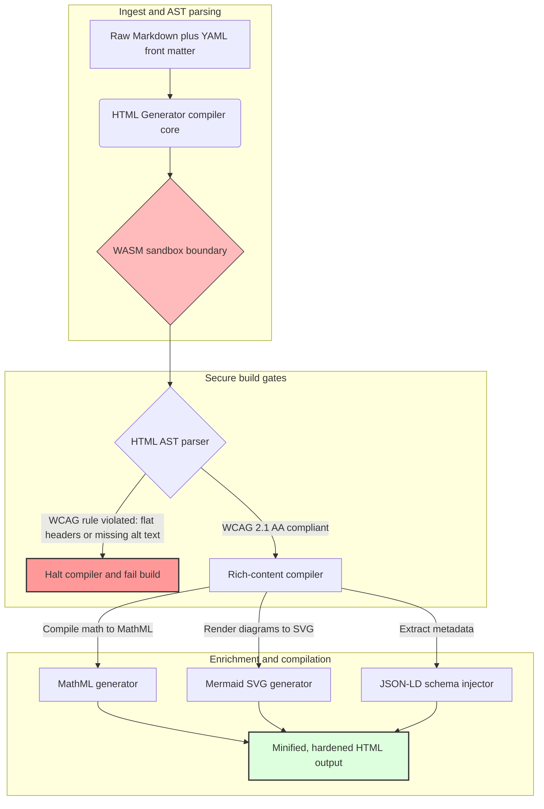

## Μετατροπή Markdown σε Προσβάσιμη, Έτοιμη για SEO, Δομημένη HTML με Rust το 2026

Το 2026, το περιεχόμενο του ιστού καταναλώνεται τόσο από ανιχνευτές αναζήτησης AI, μηχανές αναζήτησης βασισμένες σε LLM και αγωγούς Retrieval-Augmented Generation (RAG) όσο και από ανθρώπινους αναγνώστες. Η επίπεδη ή κακοδιαμορφωμένη HTML υπονομεύει τη μηχανική ανακαλυψιμότητα, ενώ η αδυναμία συμμόρφωσης με αυστηρούς παγκόσμιους κανονισμούς όπως η [Ευρωπαϊκή Πράξη για την Προσβασιμότητα (EAA)](https://www.accessibility-act.eu/) και ο [ADA Title III των ΗΠΑ](https://www.ada.gov/topics/title-iii/) αποτελεί πλέον σαφή αστική ευθύνη. Το [HTML Generator](https://github.com/sebastienrousseau/html-generator) είναι μια υψηλών επιδόσεων βιβλιοθήκη Rust, σχεδιασμένη να καλύψει αυτά τα κενά στον μεταγλωττιστή, και όχι με διορθώσεις μετά την ανάπτυξη.

## Γρήγορη απάντηση

**Τι είναι το HTML Generator σε μία πρόταση;** Το HTML Generator είναι ένας μεταγλωττιστής Markdown σε HTML, ανοιχτού κώδικα και γραμμένος αποκλειστικά σε Rust, που επιβάλλει το [WCAG 2.1 AA](https://www.w3.org/TR/WCAG21/) κατά τη μεταγλώττιση, παράγει αυτόματα σημασιολογικά ορόσημα και χαρακτηριστικά ARIA, εισάγει μεταδεδομένα [JSON-LD](https://json-ld.org/) συμβατά με σχήμα από το YAML front matter, αποδίδει διαγράμματα Mermaid και μαθηματικά σε προσβάσιμο SVG και MathML, και εκτελείται μέσα σε ένα απομονωμένο περιβάλλον [WebAssembly](https://webassembly.org/): μετατρέποντας την εταιρική δημοσίευση σε ένα επίπεδο ελέγχου με πύλη μεταγλώττισης και ποιότητα εμπιστευτικής ευθύνης.

## Σύνοψη για στελέχη

Η απόδοση Markdown μοιάζει ασήμαντη. Η HTML ποιότητας δημοσίευσης είναι όμως πρόβλημα συμμόρφωσης. Τον Ιούνιο του 2026, κάθε εταιρικό σημείο επαφής (πύλες σχέσεων με επενδυτές, κανονιστικές υποβολές, τεκμηρίωση πελατών, αναφορές API, παρουσίες μάρκετινγκ) αναλύεται τόσο από ανθρώπους όσο και από μηχανές. Δύο πιέσεις συγκρούονται σε κάθε σελίδα: η [EAA](https://www.accessibility-act.eu/) και ο [ADA Title III](https://www.ada.gov/topics/title-iii/) καθιστούν την προσβασιμότητα νομική έκθεση σε επίπεδο διοικητικού συμβουλίου, ενώ η πρόσληψη από AI και οι αγωγοί RAG ανταμείβουν τη δομημένη, αναγνώσιμη από μηχανές έξοδο. Οι τυπικές βιβλιοθήκες Markdown παράγουν επίπεδη HTML που αποτυγχάνει και στις δύο πύλες. Το HTML Generator αντιμετωπίζει τη δημιουργία εγγράφων ως αγωγό με πύλη μεταγλώττισης: η επικύρωση WCAG αποτελεί σφάλμα μεταγλώττισης, το JSON-LD προέρχεται από το YAML front matter χωρίς χειροκίνητη σφράγιση, το MathML και το Mermaid αποδίδονται με προσβάσιμο τρόπο, και ολόκληρη η μηχανή διατίθεται ως στόχος WebAssembly, ώστε η ανάλυση μη έμπιστων εγγράφων να παραμένει απομονωμένη από τον κεντρικό υπολογιστή.

## Βασικά συμπεράσματα

- **Η προσβασιμότητα ως κώδικας είναι η νέα βάση αναφοράς.** Η EAA επιβάλλει την προσβασιμότητα για τις καταναλωτικές ψηφιακές υπηρεσίες. Το HTML Generator αξιολογεί το δέντρο του εγγράφου κατά τη μεταγλώττιση, παράγοντας αυτόματα σημασιολογικά ορόσημα και χαρακτηριστικά ARIA: λιγότερες διορθώσεις μετά την ανάπτυξη, λιγότεροι προϋπολογισμοί αποκατάστασης, κανένα κείμενο alt που λείπει δεν φτάνει στην παραγωγή.
- **Δομημένα δεδομένα για ανακάλυψη από AI.** Η σύγχρονη αναζήτηση και το RAG εξαρτώνται από μεταδεδομένα αναγνώσιμα από μηχανές. Ο μεταγλωττιστής αναλύει το YAML front matter και εισάγει [JSON-LD συμβατό με το Schema.org](https://schema.org/) απευθείας στην κεφαλίδα του εγγράφου, καθιστώντας το περιεχόμενο πλήρως ερμηνεύσιμο από τα [Google Rich Results](https://developers.google.com/search/docs/appearance/structured-data/intro-structured-data), το [Bing Webmaster](https://www.bing.com/webmasters) και τους ανιχνευτές που βασίζονται σε LLM.
- **Αριστεία στο τεχνικό περιεχόμενο.** Η τεχνική δημοσίευση δεν είναι επίπεδο κείμενο. Το HTML Generator μεταγλωττίζει τις ακατέργαστες μαθηματικές επεκτάσεις του Markdown σε προσβάσιμο [MathML](https://www.w3.org/Math/) και αποδίδει διαγράμματα [Mermaid.js](https://mermaid.js.org/) σε αποκρίσιμο SVG: και τα δύο διατηρώντας δομή συμβατή με WCAG αντί να υποβαθμίζονται σε αδιαφανείς εικόνες.
- **Απομόνωση με WebAssembly.** Η ανάλυση μη έμπιστου Markdown αποτελεί κίνδυνο ασφάλειας. Στοχεύοντας στο [WASM](https://webassembly.org/), το HTML Generator εκτελείται μέσα σε ένα απομονωμένο περιβάλλον που αποτρέπει την εκτέλεση αυθαίρετου κώδικα και προστατεύει το κεντρικό σύστημα: ικανοποιώντας άμεσα τις υποχρεώσεις ασφάλειας ΤΠΕ του [DORA Άρθρο 6](https://eur-lex.europa.eu/legal-content/EN/TXT/?uri=CELEX%3A32022R2554).
- **Εμπιστευτική προστασία για τα διοικητικά συμβούλια.** Η τεχνική μη συμμόρφωση έχει μεταφερθεί στην αίθουσα του διοικητικού συμβουλίου. Η τυποποίηση σε μια μηχανή HTML με πύλη μεταγλώττισης θωρακίζει τα διευθυντικά στελέχη και την ανώτατη διοίκηση από προσωπική αστική και κανονιστική έκθεση βάσει του DORA, της EAA και του ADA Title III.

**Σχετική ανάγνωση:** [Γιατί το YAML Χρειάζεται μια Ασφαλέστερη Στοίβα Rust για AI, MCP και Χρηματοοικονομική Υποδομή το 2026](https://sebastienrousseau.com/2026-06-18-noyalib-safe-yaml-rust-ai-mcp-financial-infrastructure-2026/), [Ένας Secure-by-Default Στατικός Γεννήτορας Ιστότοπων για τη Δημοσίευση της Εποχής AI το 2026](https://sebastienrousseau.com/2026-06-17-static-site-generator-secure-default-ai-era-publishing-2026/), [CloudCDN: Ένα Σχέδιο Ανοιχτού Κώδικα για το AI-Native Edge το 2026](https://sebastienrousseau.com/2026-06-11-cloudcdn-open-source-blueprint-ai-native-edge-2026/).

## 01. Γιατί ένας μεταγλωττιστής HTML με προτεραιότητα στην προσβασιμότητα έχει σημασία το 2026

Οι εταιρικές παρουσίες στον ιστό, οι βιβλιοθήκες τεκμηρίωσης και τα κέντρα βοήθειας προϊόντων αποτελούν κρίσιμα ψηφιακά σημεία επαφής. Υπόκεινται πλέον σε δύο έντονες, αλληλοτεμνόμενες πιέσεις.

Η πρώτη είναι η **πρόσληψη από AI και η ανακαλυψιμότητα**. Το περιεχόμενο επεξεργάζεται όλο και περισσότερο από μεγάλα γλωσσικά μοντέλα και αγωγούς Retrieval-Augmented Generation. Η επίπεδη ή κακοδιαμορφωμένη HTML μπερδεύει την ανάλυση των ανιχνευτών, αφήνοντας την εταιρική έρευνα και τεκμηρίωση αόρατη στα σύγχρονα παραδείγματα αναζήτησης, συμπεριλαμβανομένων του [Google Search Generative Experience](https://blog.google/products/search/generative-ai-search/), της περιήγησης του [ChatGPT](https://chat.openai.com/) και των εταιρικών πρακτόρων RAG.

Η δεύτερη είναι η **αυστηρή παγκόσμια νομοθεσία για την προσβασιμότητα**. Βάσει της [Ευρωπαϊκής Πράξης για την Προσβασιμότητα](https://www.accessibility-act.eu/) (πλήρως εφαρμοστέας από τον Ιούνιο του 2025) και του [ADA Title III των ΗΠΑ](https://www.ada.gov/topics/title-iii/), οι εταιρικές πλατφόρμες δημοσίευσης πρέπει να εγγυώνται πλήρη ψηφιακή προσβασιμότητα. Η αδυναμία συμμόρφωσης με το [WCAG 2.1 AA](https://www.w3.org/TR/WCAG21/) δεν αποτελεί πλέον μηχανική παράβλεψη· είναι αστική και κανονιστική ευθύνη που έχει παραγάγει διακανονισμούς πολλών εκατομμυρίων δολαρίων.

Το [HTML Generator](https://github.com/sebastienrousseau/html-generator) αντιμετωπίζει άμεσα και τις δύο πιέσεις. Είναι μια thread-safe βιβλιοθήκη Rust σχεδιασμένη να μετατρέπει το Markdown σε προσβάσιμη, έτοιμη για SEO, δομημένη HTML. Αντιμετωπίζοντας τη δημιουργία εγγράφων ως αγωγό με πύλη μεταγλώττισης, η μηχανή προσφέρει υψηλή **Απόδοση Ανθεκτικότητας (Return on Resilience, RoR)**: προστατεύοντας τους ισολογισμούς από αγωγές προσβασιμότητας ενώ μεγιστοποιεί την αναγνωσιμότητα από μηχανές για ανακάλυψη από AI.

## 02. Ο αρχιτεκτονικός φακός του HTML Generator το 2026

Το πλαίσιο έχει σχεδιαστεί ως ασφαλής αγωγός μεταγλώττισης πολλαπλών σταδίων που μετατρέπει το ακατέργαστο κείμενο Markdown σε κρυπτογραφικά επαληθευμένα, άκρως προσβάσιμα στατικά περιουσιακά στοιχεία.

### Πίνακας 1: Στρώματα αρχιτεκτονικής του HTML Generator και μετριασμός κινδύνου

| Στρώμα | Απόφαση σχεδιασμού | Γιατί έχει σημασία | Κίνδυνος σε περίπτωση κακού χειρισμού |
| ---- | ---- | ---- | ---- |
| **Στρώμα εισόδου** | Αναλυτής Markdown συν YAML front matter | Συναντά τους συντάκτες εκεί που βρίσκονται· διαχωρίζει το κείμενο από τα δομικά μεταδεδομένα. | Ασυνεπή μεταδεδομένα, χαλασμένα sitemaps, κενά ευρετηρίασης. |
| **Στρώμα δομής** | Αυτοματοποιημένος Πίνακας Περιεχομένων και σημασιολογικά ορόσημα με ετικέτες ARIA | Παράγει εξ ορισμού πλοηγήσιμα, προσβάσιμα δέντρα εγγράφων. | Επίπεδη HTML που χαλάει τους αναγνώστες οθόνης και παραβιάζει το WCAG. |
| **Στρώμα εμπλουτισμένου περιεχομένου** | Εγγενής απόδοση MathML και SVG μέσω Mermaid.js | Μεταγλωττίζει τύπους και διαγράμματα σε προσβάσιμο SVG και MathML. | Καθυστέρηση απόδοσης JS στην πλευρά του πελάτη και χαλασμένη έξοδος για υποστηρικτικές τεχνολογίες. |
| **Στρώμα SEO και δεδομένων** | Ενσωματωμένη δημιουργία JSON-LD και δομημένων μεταδεδομένων | Εισάγει JSON-LD συμβατό με το [Schema.org](https://schema.org/) απευθείας στην κεφαλίδα. | Μηχανές αναζήτησης και ανιχνευτές AI που παρερμηνεύουν συγγραφέα, πλαίσιο, αδειοδότηση. |
| **Στρώμα εκτέλεσης** | Εγγενής μεταγλωττιστής Rust με στόχο WebAssembly | Επιτρέπει ασφαλή, απομονωμένη εκτέλεση σε διακομιστές, κόμβους edge και προγράμματα περιήγησης. | Εκτέλεση αυθαίρετου κώδικα κατά την ανάλυση μη έμπιστου Markdown. |

## 03. Βασικά σήματα ασφάλειας ιστού και προσβασιμότητας

Για να επαληθεύσουν ότι τα δημόσια περιουσιακά στοιχεία δημοσίευσης ικανοποιούν τους σύγχρονους κανονιστικούς ελέγχους και ελέγχους ασφάλειας, τα ανώτερα στελέχη τεχνολογίας πρέπει να παρακολουθούν συγκεκριμένες, μετρήσιμες μετρικές.

### Πίνακας 2: Σήματα ασφάλειας ιστού και προσβασιμότητας

| Σήμα | Μετρική / λειτουργικό σημείο αναφοράς | Αναφορά EAA / DORA / W3C | Τεχνική υλοποίηση |
| ---- | ---- | ---- | ---- |
| **Συμμόρφωση προσβασιμότητας** | Το 100 % των μεταγλωττισμένων σελίδων επικυρώνεται έναντι των κανόνων WCAG 2.1 AA. | [EAA](https://www.accessibility-act.eu/) και [ADA Title III](https://www.ada.gov/topics/title-iii/) | Αναλυτής HTML κατά τη μεταγλώττιση που αξιολογεί τις ετικέτες alt εικόνων και τα σημασιολογικά ορόσημα. |
| **Απομόνωση εκτέλεσης WASM** | Το 100 % των μη έμπιστων εισόδων Markdown μεταγλωττίζεται σε απομονωμένο περιβάλλον εκτέλεσης WebAssembly. | [DORA Άρθρο 6](https://eur-lex.europa.eu/legal-content/EN/TXT/?uri=CELEX%3A32022R2554) (ασφάλεια ΤΠΕ) | Απομόνωση του περιβάλλοντος ανάλυσης από τον κεντρικό διακομιστή. |
| **Κάλυψη δομημένων μεταδεδομένων** | Το 100 % των δημοσιευμένων άρθρων εμπλουτίζεται με έγκυρες, συμβατές με σχήμα κεφαλίδες JSON-LD. | Προδιαγραφές [Schema.org](https://schema.org/) | Αυτόματη ανάλυση front matter και μετατροπή σε αντικείμενα JSON-LD. |
| **Ρυθμαπόδοση μεταγλώττισης** | Στόχος σελίδων ανά δευτερόλεπτο άνω των 10.000 σε τυπικό υλικό. | Απόδοση Ανθεκτικότητας (RoR) | Άκρως παραλληλοποιημένος μεταγλωττιστής AST σε Rust. |
| **Επαλήθευση rich snippet** | Μηδέν σφάλματα ανάλυσης στις εκτελέσεις των [Google Rich Results](https://search.google.com/test/rich-results) και [Schema validator](https://validator.schema.org/). | Οδηγίες Google Search | Δομική επικύρωση του παραγόμενου JSON-LD κατά τον αγωγό μεταγλώττισης. |

## 04. Ο μύθος της απλής απόδοσης Markdown

Μια συνήθης παρανόηση μεταξύ των διευθυντών τεχνολογίας είναι ότι η μετατροπή Markdown σε HTML αποτελεί απλή άσκηση αντικατάστασης κειμένου. Πολλές τυπικές βιβλιοθήκες μεταφράζουν τη μορφοποίηση Markdown σε επίπεδη, μη δομημένη HTML. Η έξοδος αποδίδεται σε έναν βλέποντα αναγνώστη μέσα σε ένα πρόγραμμα περιήγησης, αλλά αντιπροσωπεύει μια παγίδα συμμόρφωσης.

Η επίπεδη HTML τυπικά στερείται τριών στοιχείων.

1. **Σωστές ιεραρχίες επικεφαλίδων.** Το τυπικό Markdown δεν επιβάλλει τη σειρά των επικεφαλίδων. Η μετάβαση από ένα `<h1>` σε ένα `<h4>` παραβιάζει το WCAG 2.1 AA και χαλάει την πλοήγηση του εγγράφου για τους αναγνώστες οθόνης.
2. **Ρητή σημασιολογία πινάκων.** Οι τυπικοί πίνακες Markdown σπάνια αποδίδονται με το σωστό εύρος `<th>` και τα χαρακτηριστικά `<tbody>` που απαιτούνται για προσβάσιμη ανάλυση.
3. **Μεταδεδομένα αναγνώσιμα από μηχανές.** Η τυπική HTML στερείται των αγκίστρων JSON-LD από τα οποία εξαρτώνται οι σύγχρονες πλατφόρμες αναζήτησης AI και τα συστήματα πρόσληψης RAG.

Το HTML Generator το επιλύει αναλύοντας το Markdown σε ένα **Αφηρημένο Συντακτικό Δέντρο (Abstract Syntax Tree, AST)**. Η μηχανή αξιολογεί τη δομή του εγγράφου πριν εκπέμψει HTML, επικυρώνοντας την ένθεση των επικεφαλίδων, εισάγοντας κατάλληλα χαρακτηριστικά ARIA και διασφαλίζοντας ότι κάθε πολυμεσικό στοιχείο φέρει εναλλακτικό κείμενο: μετατρέποντας την προσβασιμότητα από χειροκίνητο έλεγχο σε εγγυημένη αναλλοίωτη ιδιότητα κατά τη μεταγλώττιση.

## 05. Σχεδιάζοντας έναν αγωγό μεταγλώττισης με προσβασιμότητα ως κώδικα

Για να αποτραπεί το ενδεχόμενο μη προσβάσιμα ή μη ευρετηριασμένα περιουσιακά στοιχεία να φτάσουν ποτέ σε δημόσια ανάπτυξη, η προσβασιμότητα πρέπει να αποτελεί αυστηρή πύλη μεταγλώττισης. Ο ακόλουθος αγωγός δείχνει πώς το HTML Generator αξιολογεί το Markdown, εκτελεί επικύρωση απομονωμένη σε WebAssembly και εκπέμπει θωρακισμένη, δομημένη HTML.

## 06. Το εγχειρίδιο του διοικητικού συμβουλίου και η εμπιστευτική ευθύνη

Η σύγχρονη συμμόρφωση με την προσβασιμότητα και την ασφάλεια ιστού αποτελεί μη διαπραγματεύσιμο ζήτημα του διοικητικού συμβουλίου. Η ανώτατη διοίκηση πρέπει να προσεγγίζει την υποδομή δημοσίευσης μέσα από τον φακό του νομικού κινδύνου, της οικονομικής διαφύλαξης και της κανονιστικής έκθεσης.

- **Η Ευρωπαϊκή Πράξη για την Προσβασιμότητα (EAA).** Επιβάλλει άμεσες, νομικά δεσμευτικές εντολές συμμόρφωσης σε δημόσιες και ιδιωτικές ψηφιακές πύλες. Η μη συμμόρφωση μπορεί να επιφέρει σοβαρές οικονομικές κυρώσεις, αστικές αγωγές και άμεση απόσυρση του περιουσιακού στοιχείου από την αγορά της ΕΕ. Ενσωματώνοντας την προσβασιμότητα ως κώδικα, τα διοικητικά συμβούλια μπορούν να πιστοποιήσουν ότι μη συμμορφούμενος κώδικας δεν μπορεί να διανεμηθεί: μετατρέποντας την αντιδραστική αποκατάσταση σε δομική νομική ασπίδα.
- **DORA Άρθρο 6 (Ασφαλή Περιβάλλοντα ΤΠΕ).** Θεσπίζει αυστηρούς κανόνες για την ασφάλεια του περιβάλλοντος ΤΠΕ. Απομονώνοντας τη μεταγλώττιση Markdown μέσα σε ένα περιβάλλον WebAssembly, οι οργανισμοί διασφαλίζουν ότι η ανάλυση τεκμηρίωσης που ανεβάζουν πελάτες ή ροών από συνεργάτες δεν μπορεί να εκθέσει τους κεντρικούς διακομιστές σε εκτέλεση αυθαίρετου κώδικα, προστατεύοντας κρίσιμες τραπεζικές πύλες.
- **Μείωση κόστους στους ελέγχους συμμόρφωσης.** Η παραδοσιακή συμμόρφωση προσβασιμότητας βασίζεται σε ακριβούς, αναδρομικούς ελέγχους μετά την ανάπτυξη: δεκάδες χιλιάδες δολάρια ετησίως ανά ιστότοπο. Η υλοποίηση της επικύρωσης WCAG ως εμπόδιο κατά τη μεταγλώττιση εξαλείφει αυτά τα αναδρομικά κόστη, μετατοπίζοντας τον προϋπολογισμό συμμόρφωσης από την άμυνα στην καινοτομία.

## 07. Τι σημαίνει αυτό ανά τύπο τράπεζας / επιχείρησης

### Παγκόσμια Συστημικά Σημαντικές Τράπεζες (G-SIBs)

Οι G-SIBs λειτουργούν τεράστιες, πολύγλωσσες δημόσιες παρουσίες που δημοσιεύουν χιλιάδες ερευνητικές εργασίες, κανονιστικές γνωστοποιήσεις και έγγραφα σχέσεων με επενδυτές σε πολλαπλές δικαιοδοσίες. Η πρόκλησή τους είναι η κλίμακα και η ισοτιμία μεταξύ πολλών γλωσσών. Ο στόχος WebAssembly του HTML Generator και η υψηλής ρυθμαπόδοσης μηχανή Rust επιτρέπουν σε μεγάλης κλίμακας, τοπικοποιημένες ερευνητικές βιβλιοθήκες να ενημερώνονται, να μεταγλωττίζονται και να αναπτύσσονται παγκοσμίως μέσα σε δευτερόλεπτα, χωρίς καθυστέρηση απόδοσης ή υποβάθμιση προσβασιμότητας.

### Τράπεζες Συναλλαγών και Επιχειρηματικές Τράπεζες

Για τις τράπεζες συναλλαγών, οι πύλες πελατών, τα κέντρα τεκμηρίωσης και οι οδηγοί API για προγραμματιστές αποτελούν κρίσιμα ψηφιακά σημεία επαφής. Η μεταγλώττιση αυτών των περιουσιακών στοιχείων μέσω του HTML Generator σημαίνει ότι τα κανάλια που απευθύνονται στους πελάτες δεν φέρουν έκθεση σε XSS, ούτε φορείς επιθέσεων παραβίασης εξαρτήσεων, ούτε ελλείψεις προσβασιμότητας: διαφυλάσσοντας τη θεσμική εμπιστοσύνη και μειώνοντας την επιφάνεια δικαστικής διαμάχης.

### Περιφερειακές Τράπεζες και Fintechs

Οι περιφερειακές τράπεζες και οι ευέλικτες fintechs ανταγωνίζονται στην ψηφιακή εμπειρία χωρίς τους μηχανικούς προϋπολογισμούς των G-SIB. Το HTML Generator δίνει σε αυτές τις ομάδες έναν αγωγό δημοσίευσης εταιρικού επιπέδου έτοιμο προς χρήση, επιτρέποντας σε μικρότερες παρουσίες να διανείμουν προσβάσιμα, έτοιμα για SEO, απομονωμένα περιουσιακά στοιχεία που αντέχουν τον έλεγχο τόσο από τις ρυθμιστικές αρχές όσο και από τους υποψήφιους εταιρικούς πελάτες.

## 08. Ο οδικός χάρτης της υποδομής δημοσίευσης

Οι εταιρικές δημόσιες παρουσίες στον ιστό αποτελούν βασικό συστατικό της λειτουργικής ανθεκτικότητας. Η εξάρτηση από αργές, δυναμικά ευάλωτες, υποστηριζόμενες από βάσεις δεδομένων μηχανές ιστού, ή από μη υπογεγραμμένα στατικά περιουσιακά στοιχεία, αποτελεί μη αποδεκτό επιχειρηματικό κίνδυνο.

Για να ασφαλίσουν τα δημόσια ψηφιακά σημεία επαφής και να προστατεύσουν τους ισολογισμούς από αγωγές προσβασιμότητας, τα ανώτερα στελέχη τεχνολογίας και ασφάλειας θα πρέπει να εκτελέσουν έναν σαφή οδικό χάρτη.

1. **Μετάβαση σε στατικές αρχιτεκτονικές.** Καταργήστε σταδιακά τις παλαιές δυναμικές πλατφόρμες CMS για τις παρουσίες έρευνας, μάρκετινγκ και τεκμηρίωσης. Μεταφέρετε το περιεχόμενο σε αγωγούς με πύλη μεταγλώττισης όπως το HTML Generator.
2. **Επιβολή προσβασιμότητας κατά τη μεταγλώττιση.** Υλοποιήστε την προσβασιμότητα ως κώδικα. Αποτύχετε αυτόματα τους αγωγούς μεταγλώττισης σε οποιαδήποτε παραβίαση του WCAG 2.1 AA.
3. **Απομόνωση της ανάλυσης σε WebAssembly.** Απομονώστε όλη την ανάλυση εγγράφων και περιεχομένου μέσα σε ένα περιβάλλον WASM, ώστε η μη έμπιστη είσοδος να μην αγγίζει ποτέ τα κεντρικά συστήματα.
4. **Εισαγωγή εμπλουτισμένων μεταδεδομένων JSON-LD.** Διασφαλίστε ότι κάθε δημοσιευμένο περιουσιακό στοιχείο φέρει κεφαλίδες JSON-LD συμβατές με σχήμα για να μεγιστοποιήσετε την ανακαλυψιμότητα από AI.

## 09. Συχνές ερωτήσεις

**Πώς επιβάλλει το HTML Generator την προσβασιμότητα;**

Αναλύει το παραγόμενο Αφηρημένο Συντακτικό Δέντρο HTML κατά τη μεταγλώττιση, αξιολογώντας το έγγραφο έναντι των κανόνων [WCAG 2.1 AA](https://www.w3.org/TR/WCAG21/). Αν παραβιαστεί κάποιος κανόνας (ένα χαρακτηριστικό alt που λείπει, μια παράλειψη επικεφαλίδας, ένα μη επισημασμένο στοιχείο φόρμας), ο μεταγλωττιστής διακόπτει τη μεταγλώττιση, αντιμετωπίζοντας την προσβασιμότητα ως αναλλοίωτη ιδιότητα κατά τη μεταγλώττιση αντί για εργασία ελέγχου μετά την ανάπτυξη.

**Γιατί είναι σημαντική η απομόνωση με WebAssembly;**

Το [WebAssembly](https://webassembly.org/) επιτρέπει στη μηχανή ανάλυσης Markdown να εκτελείται μέσα σε ένα απομονωμένο περιβάλλον, διαχωρισμένο από τον κεντρικό διακομιστή. Ακόμη και όταν ένας εχθρικός δράστης ανεβάζει ένα κατασκευασμένο έγγραφο Markdown σχεδιασμένο να εκμεταλλευτεί ευπάθειες του αναλυτή, η εκτέλεση παγιδεύεται: προστατεύοντας τα κεντρικά συστήματα και ικανοποιώντας τις υποχρεώσεις ασφάλειας ΤΠΕ του DORA Άρθρο 6.

**Πώς ωφελεί το JSON-LD την ανακαλυψιμότητα στην αναζήτηση το 2026;**

Το [JSON-LD](https://json-ld.org/) παρέχει δομημένα, αναγνώσιμα από μηχανές μεταδεδομένα στην κεφαλίδα του εγγράφου. Τα [Google Rich Results](https://developers.google.com/search/docs/appearance/structured-data/intro-structured-data), οι ανιχνευτές του Bing και οι πράκτορες αναζήτησης που βασίζονται σε LLM αναγνωρίζουν αμέσως τον συγγραφέα, την άδεια, την ημερομηνία δημοσίευσης και το σημασιολογικό πλαίσιο: παρακάμπτοντας την ασάφεια της τυπικής HTML και αυξάνοντας την επιφάνεια στην ανακάλυψη που καθοδηγείται από AI.

**Ποιο είναι το κοινό του HTML Generator;**

Κατασκευαστές στατικών ιστότοπων, ομάδες τεκμηρίωσης, τεχνικοί συντάκτες, προγραμματιστές Rust και μηχανικοί πλατφορμών που διανέμουν παρουσίες κρίσιμες ως προς την προσβασιμότητα ή προσανατολισμένες στις ρυθμιστικές αρχές. Αποτελεί επίσης ένα βιώσιμο στρώμα επεξεργασίας περιεχομένου μέσα σε μεγαλύτερους αγωγούς ασφαλούς δημοσίευσης όπως ο [Static Site Generator (SSG)](https://github.com/sebastienrousseau/static-site-generator).

## 10. Αναφορές

- World Wide Web Consortium (W3C), 2024. [Web Content Accessibility Guidelines (WCAG) 2.1 ⧉](https://www.w3.org/TR/WCAG21/ "Web Content Accessibility Guidelines 2.1").
- Schema.org, 2026. [Προδιαγραφές δομημένων δεδομένων του Schema.org ⧉](https://schema.org/ "Schema.org structured-data specifications").
- European Parliament and Council of the European Union, 2022. [Κανονισμός (ΕΕ) 2022/2554 για την ψηφιακή λειτουργική ανθεκτικότητα του χρηματοοικονομικού τομέα (DORA) ⧉](https://eur-lex.europa.eu/legal-content/EN/TXT/?uri=CELEX%3A32022R2554 "DORA Regulation").
- European Commission, 2025. [Ευρωπαϊκή Πράξη για την Προσβασιμότητα ⧉](https://www.accessibility-act.eu/ "European Accessibility Act").
- US Department of Justice, 2024. [ADA Title III ⧉](https://www.ada.gov/topics/title-iii/ "ADA Title III").
- WebAssembly Community Group, 2026. [Προδιαγραφή WebAssembly ⧉](https://webassembly.org/ "WebAssembly").
- GitHub, 2026. [Αποθετήριο HTML Generator ⧉](https://github.com/sebastienrousseau/html-generator "HTML Generator open-source repository").
