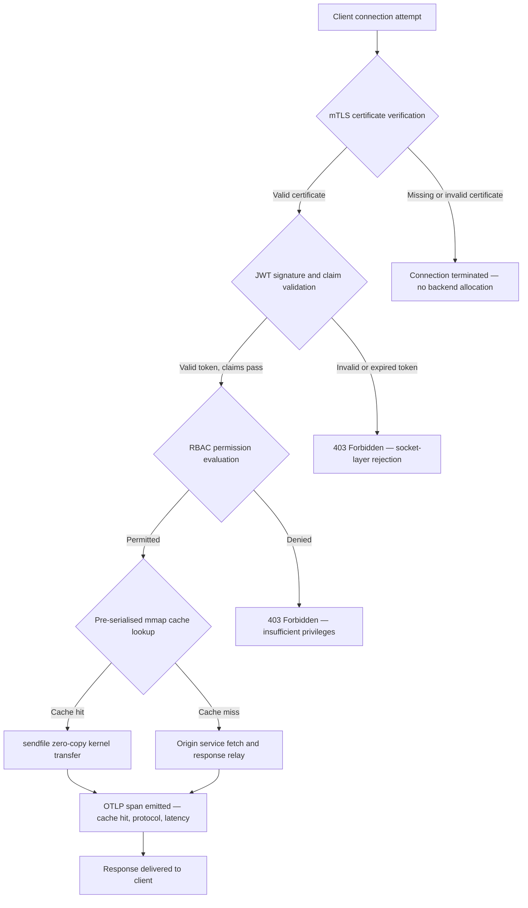

## http-handle: Υψηλών Επιδόσεων, Μηδενικών Εξαρτήσεων Edge Ingress για Τράπεζες το 2026

Το τραπεζικό άκρο έχει ένα πρόβλημα εξαρτήσεων. Κάθε instance Nginx ή Envoy που δρομολογεί κίνηση μεταξύ ενός πελάτη και μιας βασικής τραπεζικής υπηρεσίας φέρει ένα δέντρο εξαρτήσεων: builds OpenSSL, ενότητες Lua, βιβλιοθήκες gRPC και επίπεδα container — καθένα ένα δυνητικό CVE, καθένα απαιτεί έναν αποκλειστικό κύκλο επιδιόρθωσης, καθένα προσθέτει διακύμανση καθυστέρησης που περιπλέκει τη μέτρηση SLA. Υπό τον [Κανονισμό για την Ψηφιακή Επιχειρησιακή Ανθεκτικότητα (DORA)](https://eur-lex.europa.eu/eli/reg/2022/2554/oj), αυτή η πολυπλοκότητα αποτελεί πλέον κανονιστική ευθύνη εξίσου με μια λειτουργική.

Το [http-handle](https://github.com/sebastienrousseau/http-handle) ακολουθεί μια διαφορετική προσέγγιση. Είναι ένα ενιαίο, στατικά συνδεδεμένο δυαδικό αρχείο Rust με μηδενικές εξαρτήσεις χρόνου εκτέλεσης πέραν της `libc`. Παρέχει 180.000 αιτήματα ανά δευτερόλεπτο σε κόμβους ARM64, επιβάλλει αμοιβαία TLS και έλεγχο ταυτότητας JWT στο επίπεδο υποδοχής δικτύου, και διαπραγματεύεται HTTP/2 και HTTP/3 αυτόματα — όλα εντός ενός αποτυπώματος ανάπτυξης κάτω των 20 MB RAM.

## Γρήγορη απάντηση

**Τι είναι το http-handle σε μία πρόταση;** Το http-handle είναι ένα ανοιχτού κώδικα, στατικά συνδεδεμένο δυαδικό αρχείο Rust που αντικαθιστά τα βαριά container proxy στο τραπεζικό άκρο, παρέχοντας 180.000 req/s σε ARM64 μέσω μεταφορών πυρήνα μηδενικής αντιγραφής `sendfile(2)` του Linux, επιβάλλοντας mTLS, JWT και RBAC στο επίπεδο υποδοχής προτού αγγιχτεί οποιοσδήποτε πόρος backend, και εκπέμποντας εγγενείς μετρικές [OpenTelemetry](https://opentelemetry.io/) — με μηδενικές εξαρτήσεις βιβλιοθηκών χρόνου εκτέλεσης πέραν της `libc`.

## Εκτελεστική περίληψη

Οι τράπεζες τρέχουν Nginx και Envoy στο άκρο τους επί μια δεκαετία. Και τα δύο είναι ικανά· κανένα όμως δεν σχεδιάστηκε για το κανονιστικό περιβάλλον του 2026. Οι φορτωμένες με εξαρτήσεις εικόνες container δημιουργούν ουρές CVE που οι ομάδες συμμόρφωσης δεν μπορούν να εκκαθαρίσουν αρκετά γρήγορα, και κάθε αναβάθμιση έκδοσης βιβλιοθήκης φέρει κίνδυνο παλινδρόμησης. Τα Άρθρα 5 και 6 του DORA απαιτούν ο κίνδυνος ΤΠΕ να διαχειρίζεται εκ σχεδιασμού, όχι να επιδιορθώνεται μετά την ανακάλυψη. Τα πλαίσια λειτουργικού κινδύνου του Basel III τιμωρούν αρχιτεκτονικές όπου τα σημεία αστοχίας πολλαπλασιάζονται με την πολυπλοκότητα του συστήματος.

Το http-handle εξαλείφει το πρόβλημα των εξαρτήσεων στην πηγή του. Το δυαδικό αρχείο μεταγλωττίζεται μία φορά, στατικά, χωρίς απαιτήσεις εξωτερικών βιβλιοθηκών κατά τον χρόνο εκτέλεσης. Η επιφάνεια επίθεσης συρρικνώνεται στην τυπική βιβλιοθήκη της Rust συν την `libc`. Η επιβολή ασφάλειας — επαλήθευση πιστοποιητικού mTLS, επικύρωση αξίωσης JWT και έλεγχος πρόσβασης βάσει ρόλων — εκτελείται στην υποδοχή δικτύου προτού πραγματοποιηθεί οποιαδήποτε δέσμευση backend, καταρρέοντας την περίμετρο Zero Trust στη μικρότερη δυνατή έκφρασή της. Οι επιδόσεις προκύπτουν από την αρχιτεκτονική: προ-σειριοποιημένα μπλοκ cache χαρτογραφημένα στη μνήμη σε συνδυασμό με μεταφορές πυρήνα `sendfile(2)` αφαιρούν τα δεδομένα εντελώς από τη διαδρομή αντιγραφής CPU-προς-μνήμη, διατηρώντας 180.000 req/s σε υλικό ARM64. Το αποτέλεσμα είναι ένα επίπεδο ingress που ικανοποιεί τις απαιτήσεις ανθεκτικότητας του DORA, υποστηρίζει επιχειρήματα μείωσης λειτουργικού κινδύνου κατά Basel III, και δίνει σε ανώτερους ηγέτες ΤΠ υπό το SM&CR μια επαληθεύσιμη αλυσίδα λογοδοσίας ενός μόνο συστατικού για την υποδομή του άκρου.

## Βασικά συμπεράσματα

- **Μικρότερα δυαδικά αρχεία, μικρότερες ουρές CVE.** Ένα στατικά συνδεδεμένο ενιαίο δυαδικό αρχείο έχει ένα πακέτο προς επιδιόρθωση, μία έκδοση προς επικύρωση και ένα τεχνούργημα προς έλεγχο. Το Nginx με ένα τυπικό σύνολο ενοτήτων συνοδεύεται από περισσότερες από 30 εξαρτήσεις κοινόχρηστων βιβλιοθηκών· καθεμία φέρει τον δικό της κύκλο ζωής ευπαθειών.
- **Η μηδενική αντιγραφή δεν είναι βελτιστοποίηση — είναι σχεδιαστικός περιορισμός.** Στα 180.000 req/s, οποιαδήποτε αντιγραφή δεδομένων στον χώρο χρήστη εισάγει μετρήσιμη διακύμανση καθυστέρησης. Το `sendfile(2)` μεταφέρει το περιεχόμενο περιγραφέων αρχείων στην υποδοχή δικτύου εξ ολοκλήρου στον χώρο πυρήνα. Σε συνδυασμό με μπλοκ cache απόκρισης καρφωμένα με mmap, η CPU δεν αγγίζει ποτέ τη διαδρομή δεδομένων για αποθηκευμένες αποκρίσεις.
- **Η περίμετρος ασφάλειας ανήκει στην υποδοχή.** Η επικύρωση JWT και πιστοποιητικών mTLS στο middleware της εφαρμογής σημαίνει ότι το backend έχει ήδη δεσμεύσει νήματα και μνήμη προτού απορριφθεί το αίτημα. Η επικύρωση σε επίπεδο υποδοχής διασφαλίζει ότι τα μη πιστοποιημένα αιτήματα δεν καταναλώνουν κανέναν απολύτως πόρο backend.
- **Το OTLP εξαλείφει το κενό παρατηρησιμότητας.** Η εγγενής ενσωμάτωση OpenTelemetry σημαίνει ότι κάθε αίτημα, κάθε απόφαση ελέγχου ταυτότητας και κάθε διαπραγμάτευση πρωτοκόλλου παράγει δομημένη τηλεμετρία χωρίς πράκτορα sidecar. Οι υπάρχοντες πίνακες ελέγχου τραπεζών εισάγουν τα ίχνη OTLP απευθείας.

**Σχετική ανάγνωση:** [Γιατί η YAML Χρειάζεται μια Ασφαλέστερη Στοίβα Rust για AI, MCP και Χρηματοοικονομική Υποδομή το 2026](https://sebastienrousseau.com/2026-06-18-noyalib-safe-yaml-rust-ai-mcp-financial-infrastructure-2026/), [CloudCDN: Ένα Ανοιχτού Κώδικα Σχέδιο για το AI-Native Άκρο το 2026](https://sebastienrousseau.com/2026-06-11-cloudcdn-open-source-blueprint-ai-native-edge-2026/), [Η Καλύτερη Αρχιτεκτονική Υποδομής Cloud για Τράπεζες και Χρηματοπιστωτικά Ιδρύματα το 2026](https://sebastienrousseau.com/2026-05-16-best-cloud-infrastructure-architecture-2026/).

## 01. Το Πρόβλημα του Βαριού Proxy στην Τραπεζική

Τα Nginx και Envoy έχτισαν το άκρο του σύγχρονου διαδικτύου. Είναι παραμετροποιήσιμα, δοκιμασμένα στη μάχη και υποστηριζόμενα από μεγάλες κοινότητες. Είναι επίσης αρχιτεκτονικές επιλογές που έγιναν προτού υπάρξει το DORA, προτού τα πλαίσια λειτουργικού κινδύνου του Basel III απαιτήσουν ποσοτικοποιήσιμη μείωση πολυπλοκότητας, και προτού οι κόμβοι cloud ARM64 αλλάξουν τα οικονομικά του υψηλής απόδοσης υπολογισμού.

Η πρακτική συνέπεια είναι ένα χάσμα ανάμεσα σε αυτό που χρειάζονται οι τράπεζες και σε αυτό που παρέχουν τα βαριά container proxy.

**Επιφάνεια εξαρτήσεων.** Μια τυπική ανάπτυξη Envoy ενσωματώνει OpenSSL, Abseil, Protobuf, gRPC, Lua και δεκάδες δευτερεύουσες βιβλιοθήκες. Καθεμία φέρει έναν ανεξάρτητο κύκλο ζωής CVE. Όταν η Εθνική Βάση Δεδομένων Ευπαθειών δημοσιεύει μια κρίσιμη συμβουλευτική OpenSSL, κάθε instance Envoy στην υποδομή γίνεται ένα ρολόι συμμόρφωσης: αξιολόγηση, επιδιόρθωση, δοκιμή, επαναδιάθεση και επαναπιστοποίηση — σε κάθε περιβάλλον όπου εκτελείται το δυαδικό αρχείο. Υπό το Άρθρο 6 του DORA, οι τράπεζες πρέπει να αποδείξουν ότι οι διαδικασίες διαχείρισης κινδύνου ΤΠΕ είναι αναλογικές, τεκμηριωμένες και επαληθεύσιμες. Ένα δέντρο εξαρτήσεων πολλαπλών βιβλιοθηκών καθιστά αυτή την απόδειξη ακριβή στη συντήρησή της.

**Επιβάρυνση μνήμης.** Μια ελάχιστα παραμετροποιημένη διεργασία worker του Nginx καταναλώνει 40–80 MB παραμένουσας μνήμης υπό μέτριο φορτίο. Σε κλίμακα — εκατοντάδες κόμβοι ingress σε συστήματα συναλλαγών, API πληρωμών και πύλες προσανατολισμένες στον πελάτη — αυτή η επιβάρυνση συσσωρεύεται σε ένα μετρήσιμο κόστος υποδομής χωρίς αντίστοιχο όφελος επιδόσεων έναντι μιας καλά σχεδιασμένης εναλλακτικής ενιαίου δυαδικού αρχείου.

**Ταχύτητα επιδιόρθωσης.** Οι αλυσίδες εφοδιασμού εικόνων container εισάγουν καθυστέρηση πολλών ημερών μεταξύ της δημοσίευσης ενός CVE και της άφιξης μιας επικυρωμένης επιδιόρθωσης στην παραγωγή. Η βασική εικόνα πρέπει να ξαναχτιστεί, το επίπεδο της εφαρμογής να επαναστρωματοποιηθεί, το πλήρες πλέγμα δοκιμών να ξανατρέξει, και ο αγωγός ανάπτυξης να επανεκτελεστεί. Για κρίσιμα τραπεζικά συστήματα που λειτουργούν εντός των παραθύρων αναφοράς συμβάντων του DORA, αυτός ο κύκλος αποτελεί δομικό κίνδυνο.

Το http-handle αντιμετωπίζει και τα τρία. Ένα δυαδικό αρχείο. Μία επιφάνεια CVE. Ένα τεχνούργημα προς επιδιόρθωση. Κάτω των 20 MB RAM για έναν κόμβο ingress παραγωγής.

## 02. Ο Αρχιτεκτονικός Φακός του http-handle 2026

Το δυαδικό αρχείο δομείται ως πέντε αλληλεξαρτώμενα επίπεδα, καθένα σχεδιασμένο ώστε να εξαλείφει μια συγκεκριμένη κατηγορία κινδύνου που συσσωρεύουν οι παραδοσιακές αρχιτεκτονικές proxy.

### Πίνακας 1: Αρχιτεκτονικά επίπεδα του http-handle και μετριασμός κινδύνου

| Επίπεδο | Σχεδιαστική απόφαση | Γιατί έχει σημασία | Κίνδυνος σε περίπτωση κακού χειρισμού |
| ---- | ---- | ---- | ---- |
| **Πυρήνας διακομιστή** | Ενιαίο δυαδικό αρχείο Rust, στατικά συνδεδεμένο, μηδενικές εξαρτήσεις πέραν της `libc` | Ένα τεχνούργημα προς επιδιόρθωση· εξαλείφει τη διάδοση CVE βιβλιοθηκών σε όλη την υποδομή | Επιθέσεις σύγχυσης εξαρτήσεων· συσσώρευση ευπαθειών βιβλιοθηκών |
| **Μηχανή επιτάχυνσης** | Προ-σειριοποιημένα μπλοκ cache mmap και μεταφορές πυρήνα μηδενικής αντιγραφής `sendfile(2)` | 180.000 req/s σε ARM64 με επιβάρυνση proxy κάτω του χιλιοστού· κανένα δεδομένο δεν εισέρχεται στον χώρο χρήστη για αποθηκευμένες αποκρίσεις | Διαρροές χαρτογράφησης μνήμης· σημεία συμφόρησης στον χώρο πυρήνα κατά την ακύρωση cache |
| **Κρυπτογραφική ασφάλεια** | Εγγενές mTLS με υποστήριξη hot-reload πιστοποιητικών και διαπραγμάτευση ALPN | Εγγυάται την ακεραιότητα δεδομένων και τη συμβατότητα πρωτοκόλλου· εναλλαγή πιστοποιητικών χωρίς πτώση συνδέσεων | Λήξη πιστοποιητικού που προκαλεί διακοπές υπηρεσίας· αδύναμες προεπιλογές σουιτών κρυπτογράφησης |
| **Επίπεδο πολιτικής πρόσβασης** | Επικύρωση JWT σε επίπεδο υποδοχής και αξιολόγηση αξιώσεων RBAC | Τα μη πιστοποιημένα αιτήματα δεν καταναλώνουν πόρους backend· επιβολή Zero Trust στο όριο του πυρήνα | Επιθέσεις σύγχυσης αλγορίθμου JWT· εσφαλμένη διαμόρφωση RBAC που χορηγεί υπερβολικά προνόμια πρόσβασης |
| **Παρατηρησιμότητα** | Εγγενής ενσωμάτωση [OpenTelemetry (OTLP)](https://opentelemetry.io/docs/specs/otlp/) | Δομημένη τηλεμετρία χωρίς πράκτορες sidecar· άμεση εισαγωγή στις υπάρχουσες υποδομές παρακολούθησης τραπεζών | Τυφλά σημεία κατά τις διακοπές· ελλιπή ίχνη ελέγχου για την αναφορά συμβάντων DORA |

## 03. Βασικά Σήματα Επιδόσεων και Ασφάλειας

Οι τράπεζες που λειτουργούν το http-handle στο άκρο πρέπει να μετρούν πέντε ποσοτικοποιήσιμα σήματα ώστε να ικανοποιήσουν τις απαιτήσεις λειτουργικής αναφοράς του DORA και τη διακυβέρνηση εσωτερικών SLA.

### Πίνακας 2: Λειτουργικά σημεία αναφοράς και κανονιστικές παραπομπές

| Σήμα | Σημείο αναφοράς | Κανονιστική παραπομπή | Τεχνική υλοποίηση |
| ---- | ---- | ---- | ---- |
| **Ρυθμαπόδοση** | ≥ 180.000 req/s σε κόμβους ARM64 με επιβάρυνση proxy P99 ≤ 1 ms | Λειτουργικός κίνδυνος Basel III — μείωση πολυπλοκότητας συστήματος | `sendfile(2)` + προ-σειριοποιημένα μπλοκ cache mmap· καμία αντιγραφή δεδομένων στον χώρο χρήστη για επιτυχίες cache |
| **Επιφάνεια επίθεσης** | Μηδενικές εξαρτήσεις βιβλιοθηκών χρόνου εκτέλεσης· ένα δυαδικό τεχνούργημα ανά έκδοση | [Άρθρο 6 DORA](https://eur-lex.europa.eu/eli/reg/2022/2554/oj) — διαχείριση κινδύνου ΤΠΕ εκ σχεδιασμού | Στατική μεταγλώττιση με `cargo build --release --target aarch64-unknown-linux-musl` |
| **Καθυστέρηση ελέγχου ταυτότητας** | Χειραψία mTLS + επικύρωση JWT που ολοκληρώνεται πριν από το πρώτο byte της απόκρισης backend | [Άρθρο 5 DORA](https://eur-lex.europa.eu/eli/reg/2022/2554/oj) — προστασία ασφάλειας ΤΠΕ | Παρεμβολή σε επίπεδο υποδοχής· αξιολόγηση αξίωσης JWT σε Rust παρακείμενη στον πυρήνα πριν από τη δρομολόγηση backend |
| **Διαθεσιμότητα πιστοποιητικών** | Hot-reload πιστοποιητικών mTLS με μηδενικές απορριφθείσες συνδέσεις κατά την εναλλαγή | Λογοδοσία ανώτερης διοίκησης SM&CR για τη διαθεσιμότητα του άκρου | Παρακολουθητής πιστοποιητικών βασισμένος σε inotify· ατομική εναλλαγή περιγραφέα αρχείου κατά την επαναφόρτωση |
| **Κάλυψη παρατηρησιμότητας** | 100 % των αιτημάτων παράγουν spans OTLP με αποτέλεσμα ελέγχου ταυτότητας, έκδοση πρωτοκόλλου και κατάσταση cache | Άρθρο 17 DORA — ανίχνευση και αναφορά συμβάντων | Εγγενής εξαγωγέας OTLP· δεν απαιτείται sidecar· διαμορφώσιμη μεταφορά gRPC ή HTTP/Protobuf |

## 04. Η Μηχανή Μηδενικής Αντιγραφής: mmap και sendfile(2)

Οι επιδόσεις δικτύου στην υψηλής συχνότητας τραπεζική — πληρωμές πραγματικού χρόνου, API δεδομένων αγοράς, υπηρεσίες διακριτικών ελέγχου ταυτότητας — οριοθετούνται από έναν περιορισμό περισσότερο από κάθε άλλον: το κόστος της μετακίνησης byte από την αποθήκευση στην υποδοχή δικτύου.

Οι συμβατικοί διακομιστές HTTP διαβάζουν το περιεχόμενο αρχείων σε έναν buffer χώρου χρήστη, και έπειτα γράφουν αυτόν τον buffer στην υποδοχή. Αυτή η ακολουθία απαιτεί δύο αντιγραφές μνήμης και δύο εναλλαγές πλαισίου μεταξύ χώρου χρήστη και χώρου πυρήνα για κάθε απόκριση. Στα 180.000 αιτήματα ανά δευτερόλεπτο, η συσσωρευμένη επιβάρυνση είναι σημαντική.

Το http-handle εξαλείφει και τις δύο αντιγραφές.

**Μπλοκ cache χαρτογραφημένα στη μνήμη.** Όταν η υπηρεσία εκκινεί, σειριοποιεί το στατικό περιεχόμενο απόκρισης σε περιοχές χαρτογραφημένες στη μνήμη χρησιμοποιώντας `mmap(2)`. Αυτές οι περιοχές καρφώνονται στην cache σελίδων του πυρήνα. Όταν φτάνει ένα αίτημα για έναν αποθηκευμένο πόρο, η απόκριση είναι ήδη χαρτογραφημένη στη μνήμη πυρήνα — καμία ανάγνωση δίσκου, καμία δέσμευση buffer.

**Μεταφορά πυρήνα `sendfile(2)`.** Η κλήση συστήματος `sendfile(2)` του Linux μεταφέρει δεδομένα απευθείας από έναν περιγραφέα αρχείου — ή μια περιοχή χαρτογραφημένη στη μνήμη — σε έναν περιγραφέα αρχείου υποδοχής δικτύου, εξ ολοκλήρου εντός του πυρήνα. Κανένα byte δεν εισέρχεται στον χώρο χρήστη. Ο ρόλος της CPU περιορίζεται στην έκδοση της κλήσης συστήματος και στον χειρισμό του συμβάντος ολοκλήρωσης. Σε κόμβους ARM64 με αυτή την αρχιτεκτονική, το http-handle διατηρεί 180.000 req/s με επιβάρυνση proxy κάτω του χιλιοστού του δευτερολέπτου υπό διαρκές φορτίο.

Για τράπεζες που εκτελούν συμφωνία μαζικών παρτίδων τέλους μήνα, ενδοημερήσια αναφορά ρευστότητας ή κίνηση API βαθμολόγησης απάτης πραγματικού χρόνου, η μηχανική συνέπεια είναι άμεση: λιγότεροι κόμβοι ARM64 ανά επίπεδο κίνησης, χαμηλότερο κόστος υποδομής και μικρότερος κίνδυνος ανθεκτικότητας κατά DORA από ελλείψεις χωρητικότητας.

## 05. Το Επίπεδο Πολιτικής Πρόσβασης mTLS και JWT

Στην τραπεζική, ο έλεγχος ταυτότητας στο άκρο δεν είναι χαρακτηριστικό — είναι κανονιστική απαίτηση. Το DORA επιβάλλει οι έλεγχοι ασφάλειας ΤΠΕ να είναι αναλογικοί, τεκμηριωμένοι και επαληθεύσιμοι. Το SM&CR τοποθετεί προσωπική λογοδοσία για τις αποφάσεις ασφάλειας υποδομής σε ονομαστικά ανώτερα διοικητικά στελέχη. Το ερώτημα δεν είναι εάν θα γίνει έλεγχος ταυτότητας στο άκρο, αλλά σε ποιο επίπεδο.

Το http-handle επιβάλλει μια πολιτική Zero Trust τριών σταδίων προτού διατεθεί οποιοσδήποτε πόρος backend.

**Στάδιο 1: Επαλήθευση πιστοποιητικού πελάτη mTLS.** Κατά τη χειραψία TLS, το http-handle ζητά και επικυρώνει το πιστοποιητικό πελάτη έναντι ενός διαμορφώσιμου αποθετηρίου εμπιστοσύνης. Οι συνδέσεις χωρίς έγκυρο πιστοποιητικό τερματίζονται κατά τη χειραψία. Κανένα νήμα εφαρμογής δεν δημιουργείται, καμία δεξαμενή μνήμης δεν δεσμεύεται. Το backend δεν βλέπει ποτέ το αίτημα.

**Στάδιο 2: Επικύρωση αξίωσης JWT.** Για συνδέσεις που περνούν το mTLS, το http-handle εξάγει και επικυρώνει το JSON Web Token από την κεφαλίδα `Authorization` στο επίπεδο υποδοχής. Η επαλήθευση υπογραφής, οι έλεγχοι λήξης και η επικύρωση εκδότη πραγματοποιούνται προτού το αίτημα φτάσει στο επίπεδο δρομολόγησης. Οι επιθέσεις σύγχυσης αλγορίθμου — όπου ένας διακομιστής αποδέχεται έναν συμμετρικό αλγόριθμο ενώ αναμένεται ασύμμετρο κλειδί — αποκλείονται μέσω ρητής λίστας επιτρεπόμενων αλγορίθμων στη διαμόρφωση.

**Στάδιο 3: Αξιολόγηση αξίωσης RBAC.** Οι επικυρωμένες αξιώσεις JWT αντιστοιχίζονται σε έναν πίνακα ρόλων στη μνήμη. Τα αιτήματα που φέρουν ανεπαρκή δικαιώματα λαμβάνουν απόκριση 403 στο επίπεδο πολιτικής πρόσβασης. Η υπηρεσία backend δεν καλείται ποτέ για μη εξουσιοδοτημένη κίνηση.

Αυτή η αλληλουχία έχει λειτουργική σημασία. Υπό το παραδοσιακό μοντέλο — όπου ο έλεγχος ταυτότητας εκτελείται στο middleware της εφαρμογής — ένας επιτιθέμενος μπορεί να εξαντλήσει τις δεξαμενές νημάτων του backend με μη πιστοποιημένα αιτήματα προτού εκδοθεί μία μόνη απόρριψη. Ο έλεγχος ταυτότητας σε επίπεδο υποδοχής καταρρέει εντελώς αυτόν τον φορέα επίθεσης.

## 06. Δρομολόγηση ALPN και η Αλυσίδα Εναλλακτικής Λύσης HTTP/3

Η τραπεζική κίνηση φτάνει μέσω ποικίλων συνθηκών δικτύου: εταιρική οπτική ίνα για γραφεία συναλλαγών, 5G για πελάτες κινητής τραπεζικής, δορυφορική συνδεσιμότητα για απομακρυσμένες λειτουργίες, και proxy επιθεώρησης TLS σε ρυθμιζόμενα περιβάλλοντα. Ένα ingress ενός μόνο πρωτοκόλλου δημιουργεί έναν περιορισμό ελάχιστου κοινού παρονομαστή.

Το http-handle χρησιμοποιεί τη [Διαπραγμάτευση Πρωτοκόλλου σε Επίπεδο Εφαρμογής (ALPN)](https://www.rfc-editor.org/rfc/rfc7301) για να επιλέξει αυτόματα το βέλτιστο πρωτόκολλο για κάθε σύνδεση.

Το **HTTP/2** είναι η προεπιλογή για κίνηση προγράμματος περιήγησης και API μέσω TCP. Οι πολυπλεγμένες ροές μέσω μιας ενιαίας σύνδεσης εξαλείφουν το head-of-line blocking που εισάγει το HTTP/1.1 υπό ταυτόχρονα μοτίβα αιτημάτων.

Το **HTTP/3 (QUIC)** ενεργοποιείται όταν το δίκτυο υποστηρίζει UDP και ο πελάτης διαφημίζει `h3` στην επέκταση ALPN του. Η ανεξάρτητη πολυπλεξία ροών και η μετανάστευση σύνδεσης του QUIC το καθιστούν ουσιαστικά καλύτερο για πελάτες κινητής τραπεζικής σε συμφορημένα κυψελωτά δίκτυα όπου οι συνδέσεις TCP πέφτουν και επανασυνδέονται συχνά.

**Ομαλή εναλλακτική λύση.** Εάν η διαπραγμάτευση ALPN αποτύχει — επειδή ένα ενδιάμεσο proxy αφαιρεί την επέκταση ή ένας παλαιότερος πελάτης την παραλείπει — το http-handle επιστρέφει σε HTTP/1.1 διατηρώντας όλες τις κεφαλίδες ασφάλειας, την επιβολή mTLS και την επικύρωση JWT. Καμία ιδιότητα ασφάλειας δεν υποβαθμίζεται κατά την εναλλακτική λύση πρωτοκόλλου.

## 07. Ο Κύκλος Ζωής Αιτήματος Μηδενικής Αντιγραφής

Το παρακάτω διάγραμμα δείχνει την πλήρη διαδρομή αιτήματος από τη σύνδεση πελάτη έως την παράδοση απόκρισης, συμπεριλαμβανομένων των πυλών ελέγχου ταυτότητας και των σημείων εκπομπής παρατηρησιμότητας.

Η κρίσιμη διαδρομή για αποκρίσεις επιτυχίας cache διασχίζει τρεις πύλες ασφάλειας και μία κλήση συστήματος. Κανένας buffer χώρου χρήστη δεν δεσμεύεται για το σώμα της απόκρισης. Το span OTLP καταγράφει το αποτέλεσμα ελέγχου ταυτότητας, την έκδοση πρωτοκόλλου που διαπραγματεύτηκε το ALPN, την κατάσταση cache και την καθυστέρηση από άκρο σε άκρο σε μία ενιαία δομημένη εγγραφή.

## 08. Κανονιστική Ευθυγράμμιση: DORA, Basel III και SM&CR

### Άρθρα 5 και 6 του DORA — διαχείριση κινδύνου ΤΠΕ και προστασία

Το [Άρθρο 5 του DORA](https://eur-lex.europa.eu/eli/reg/2022/2554/oj) απαιτεί από τις χρηματοοικονομικές οντότητες να διατηρούν πλαίσια διαχείρισης κινδύνου ΤΠΕ. Το Άρθρο 6 τους απαιτεί να εφαρμόζουν μέτρα προστασίας και πρόληψης αναλογικά προς το προφίλ κινδύνου των συστημάτων ΤΠΕ τους.

Ένα στατικά συνδεδεμένο ενιαίο δυαδικό αρχείο ικανοποιεί και τις δύο απαιτήσεις αποτελεσματικότερα από μια στοίβα container πολλαπλών βιβλιοθηκών. Η επιφάνεια επίθεσης είναι ποσοτικοποιήσιμη — ένα τεχνούργημα, μία εξάρτηση (`libc`), μία επιφάνεια CVE — και τα μέτρα προστασίας είναι δομικά αντί για διαδικαστικά: η επιβολή mTLS και JWT δεν μπορεί να παρακαμφθεί από εσφαλμένη διαμόρφωση επειδή εκτελείται στο επίπεδο υποδοχής προτού τρέξει οποιαδήποτε διαμορφώσιμη λογική εφαρμογής.

### Basel III — Απαιτήσεις κεφαλαίου λειτουργικού κινδύνου

Το [πλαίσιο λειτουργικού κινδύνου του Basel III](https://www.bis.org/bcbs/basel3.htm) συνδέει τις απαιτήσεις κανονιστικού κεφαλαίου με αποδείξιμη μείωση κινδύνου. Οι τράπεζες που μπορούν να τεκμηριώσουν μια μετρήσιμη μείωση της πολυπλοκότητας του συστήματος και του αριθμού σημείων αστοχίας ΤΠΕ έχουν ένα ποσοτικοποιήσιμο επιχείρημα για μειωμένη κατανομή κεφαλαίου λειτουργικού κινδύνου. Η αντικατάσταση μιας υποδομής proxy πολλαπλών container με κόμβους ingress ενιαίου δυαδικού αρχείου είναι ακριβώς το είδος μείωσης πολυπλοκότητας που υποστηρίζει αυτό το επιχείρημα — υπό την προϋπόθεση ότι η ομάδα μηχανικών μπορεί να παραγάγει την τεκμηρίωση βεβαίωσης.

Τα ελεγχόμενα τεχνουργήματα έκδοσης του http-handle — αναπαραγώγιμα builds, μανιφέστα εξαρτήσεων συμβατά με SBOM και λειτουργικά αρχεία καταγραφής βασισμένα σε OTLP — υποστηρίζουν την αλυσίδα τεκμηρίωσης που απαιτούν οι συζητήσεις κεφαλαίου Basel III.

### SM&CR — Λογοδοσία ανώτερης διοίκησης

Το [Καθεστώς Ανώτερων Διοικητικών Στελεχών και Πιστοποίησης (SM&CR)](https://www.fca.org.uk/firms/senior-managers-certification-regime) τοποθετεί προσωπική ευθύνη σε ονομαστικά ανώτερα διοικητικά στελέχη για τη στάση ασφάλειας ΤΠΕ των συστημάτων υπό την ευθύνη τους. Ένα ingress ενιαίου δυαδικού αρχείου που κάνει hot-reload πιστοποιητικών χωρίς διακοπή υπηρεσίας, παράγει δομημένα αρχεία καταγραφής ελέγχου μέσω OTLP και έχει ένα τεχνούργημα καρφωμένο σε έκδοση ανά ανάπτυξη δίνει στο ονομαστικό ανώτερο διοικητικό στέλεχος μια επαληθεύσιμη, τεκμηριώσιμη αλυσίδα ασφάλειας. Μια στοίβα container πολλαπλών βιβλιοθηκών δεν το κάνει.

## 09. Τι Σημαίνει Αυτό ανά Ρόλο

### Διοικητικό συμβούλιο και ανώτατα διευθυντικά στελέχη

Η βελτιστοποίηση κανονιστικού κεφαλαίου υπό τα πλαίσια λειτουργικού κινδύνου του Basel III εξαρτάται από την αποδείξιμη μείωση πολυπλοκότητας. Η αντικατάσταση του Nginx ή του Envoy με ένα ενιαίο στατικά συνδεδεμένο δυαδικό αρχείο μειώνει τον αριθμό σημείων αστοχίας ΤΠΕ με τρόπο που είναι ελέγξιμος και παρουσιάσιμος σε προληπτικούς ρυθμιστές. Η μειωμένη επιφάνεια CVE υποστηρίζει επίσης την επαναδιαπραγμάτευση ασφαλίστρων κυβερνοασφάλισης — οι ασφαλιστές τιμολογούν βάσει αποδείξιμων μετρικών επιφάνειας επίθεσης, και ένα δυαδικό αρχείο ingress ενιαίας εξάρτησης αποτελεί ένα συγκεκριμένο σημείο δεδομένων.

### Επικεφαλής ασφάλειας πληροφοριών και επικεφαλής κινδύνου

Η συμμόρφωση με το DORA απαιτεί τα μέτρα προστασίας ΤΠΕ να είναι αναλογικά και επαληθεύσιμα. Η επιβολή mTLS και JWT σε επίπεδο υποδοχής παρέχει μια επαληθεύσιμη, μη παρακάμψιμη πύλη ελέγχου ταυτότητας στο άκρο. Η εναλλαγή πιστοποιητικών με hot-reload εξαλείφει τον κίνδυνο παραθύρου υπηρεσίας που φέρουν οι παραδοσιακές ενημερώσεις πιστοποιητικών. Το μοντέλο μεταγλώττισης μηδενικών εξαρτήσεων σημαίνει ότι όταν δημοσιεύεται μια κρίσιμη συμβουλευτική `libc`, ολόκληρη η υποδομή μπορεί να ξαναχτιστεί, να δοκιμαστεί και να επαναδιατεθεί από ένα ενιαίο τεχνούργημα πηγαίου κώδικα Rust σε ώρες αντί για ημέρες.

### Μηχανική και διοίκηση ΤΠ

Τα 180.000 req/s σε έναν τυπικό κόμβο ARM64 αλλάζουν τη συζήτηση περί διαστασιολόγησης υποδομής για API πληρωμών και υπηρεσίες ελέγχου ταυτότητας. Η εγγενής ενσωμάτωση OTLP εξαλείφει την ανάγκη για εξαγωγείς Prometheus, πράκτορες sidecar ή προσαρμοσμένους μεταφορείς αρχείων καταγραφής. Το μοντέλο ανάπτυξης Kubernetes είναι ένα τυπικό pod — κάτω των 20 MB RAM, χωρίς προνομιακά δικαιώματα container, χωρίς πρόσβαση δικτύου host. Το hot-reload πιστοποιητικών λειτουργεί χωρίς την επιβάρυνση rolling-restart του Kubernetes.

## Συχνές ερωτήσεις

**Πώς χειρίζεται το http-handle την εναλλαγή πιστοποιητικών υπό φορτίο;**
Το δυαδικό αρχείο παρακολουθεί τις διαδρομές αρχείων πιστοποιητικών χρησιμοποιώντας έναν παρακολουθητή inotify. Όταν εντοπίζονται νέα αρχεία πιστοποιητικού και κλειδιού, εκτελεί μια ατομική εναλλαγή του ενεργού πλαισίου TLS — οι υπάρχουσες συνδέσεις ολοκληρώνονται χρησιμοποιώντας το προηγούμενο πιστοποιητικό ενώ οι νέες συνδέσεις χρησιμοποιούν αμέσως το εναλλαγμένο. Καμία σύνδεση δεν απορρίπτεται. Δεν απαιτείται παράθυρο υπηρεσίας.

**Μπορεί το http-handle να τρέξει μέσα σε ένα cluster Kubernetes ως ελεγκτής ingress;**
Ναι. Το δυαδικό αρχείο τρέχει ως αυτόνομο pod με έναν τυπικό σχολιασμό υπηρεσίας ingress. Οι απαιτήσεις πόρων είναι κάτω των 20 MB RAM στην πλήρη ρυθμαπόδοση, χωρίς προνομιακά δικαιώματα container και χωρίς απαίτηση πρόσβασης δικτύου host. Μπορεί επίσης να τρέξει ως sidecar σε πλέγματα υπηρεσιών όπου η επιβολή mTLS στο επίπεδο sidecar προτιμάται έναντι του κεντρικού ελέγχου ταυτότητας πύλης.

**Ποια είναι η μετρήσιμη συνεισφορά καθυστέρησης του ίδιου του proxy;**
Για αποκρίσεις επιτυχίας cache, η επιβάρυνση του proxy — από την αποδοχή υποδοχής έως την ολοκλήρωση του `sendfile(2)` — είναι κάτω του χιλιοστού του δευτερολέπτου σε υλικό ARM64. Για αποκρίσεις αστοχίας cache που απαιτούν ανάκτηση upstream, η επιβάρυνση είναι το ίδιο μέγεθος κάτω του χιλιοστού συν τον χρόνο απόκρισης της πηγής. Το ίδιο το proxy δεν προσθέτει καθυστέρηση ουράς επειδή ο έλεγχος ταυτότητας πραγματοποιείται σύγχρονα στο επίπεδο υποδοχής χωρίς δέσμευση δεξαμενής νημάτων προτού ολοκληρωθεί η επικύρωση διαπιστευτηρίων.

**Πώς εντάσσεται το http-handle σε μια αρχιτεκτονική Zero Trust παράλληλα με μια υπάρχουσα πύλη API;**
Το http-handle λειτουργεί στο όριο Επιπέδου 4/7 του OSI: επιβάλλει mTLS σε επίπεδο μεταφοράς και επικυρώνει JWT σε επίπεδο εφαρμογής προτού δρομολογήσει σε upstream υπηρεσίες. Μπορεί να τοποθετηθεί μπροστά από μια πλήρη πύλη API — απορροφώντας μη πιστοποιημένη κίνηση προτού φτάσει στο ακριβότερο επίπεδο επεξεργασίας της πύλης — ή να αντικαταστήσει την πύλη εξ ολοκλήρου για υπηρεσίες των οποίων η πολιτική πρόσβασης είναι εκφράσιμη εξ ολοκλήρου σε αξιώσεις JWT.

**Είναι η δυαδική έξοδος αναπαραγώγιμη για σκοπούς ελέγχου αλυσίδας εφοδιασμού;**
Ναι. Το build είναι αναπαραγώγιμο με μια καρφωμένη έκδοση εργαλειοθήκης Rust και κλειδωμένο `Cargo.lock`. Η δημιουργία SBOM μέσω `cargo cyclonedx` παράγει μια λίστα υλικών συμβατή με CycloneDX για κάθε έκδοση. Και τα δύο τεχνουργήματα είναι δημοσιεύσιμα στην εσωτερική εργαλειοθήκη ανάλυσης σύνθεσης λογισμικού της τράπεζας και ικανοποιούν τις απαιτήσεις τεκμηρίωσης κινδύνου αλυσίδας εφοδιασμού του DORA.

## Συμπέρασμα

Το τραπεζικό άκρο δεν χρειάζεται περισσότερα χαρακτηριστικά — χρειάζεται λιγότερα συστατικά, καθένα να κάνει λιγότερα και να τα κάνει επαληθεύσιμα. Το http-handle μειώνει το επίπεδο ingress στο αμετάβλητο ελάχιστό του: ένα ενιαίο δυαδικό αρχείο Rust που επιβάλλει έλεγχο ταυτότητας στην υποδοχή, μεταφέρει δεδομένα χωρίς να τα αντιγράφει, και αναφέρει ό,τι κάνει σε δομημένη τηλεμετρία. Για τράπεζες που πλοηγούνται σε χρονοδιαγράμματα συμμόρφωσης DORA, ανασκοπήσεις βελτιστοποίησης κεφαλαίου Basel III και απαιτήσεις λογοδοσίας SM&CR, αυτή η απλότητα δεν είναι μηχανική προτίμηση — είναι κανονιστικό επιχείρημα.

Ο [πηγαίος κώδικας του http-handle](https://github.com/sebastienrousseau/http-handle) είναι διαθέσιμος υπό τη διπλή άδεια MIT και Apache 2.0.

---

*Αναφορές*

Basel Committee on Banking Supervision (2011). *Basel III: A global regulatory framework for more resilient banks and banking systems*. Bank for International Settlements. Διαθέσιμο στο: [https://www.bis.org/publ/bcbs189.htm](https://www.bis.org/publ/bcbs189.htm)

European Parliament and Council (2022). Regulation (EU) 2022/2554 on digital operational resilience for the financial sector (DORA). Διαθέσιμο στο: [https://eur-lex.europa.eu/legal-content/EN/TXT/?uri=CELEX:32022R2554](https://eur-lex.europa.eu/legal-content/EN/TXT/?uri=CELEX:32022R2554)

Financial Conduct Authority (2015). *Senior Managers and Certification Regime (SM&CR)*. Διαθέσιμο στο: [https://www.fca.org.uk/firms/senior-managers-certification-regime](https://www.fca.org.uk/firms/senior-managers-certification-regime)

Internet Engineering Task Force (2014). *RFC 7301: Transport Layer Security (TLS) Application-Layer Protocol Negotiation Extension*. Διαθέσιμο στο: [https://www.rfc-editor.org/rfc/rfc7301](https://www.rfc-editor.org/rfc/rfc7301)

OpenTelemetry Authors (2024). *OpenTelemetry Protocol Specification (OTLP)*. Διαθέσιμο στο: [https://opentelemetry.io/docs/specs/otlp/](https://opentelemetry.io/docs/specs/otlp/)
