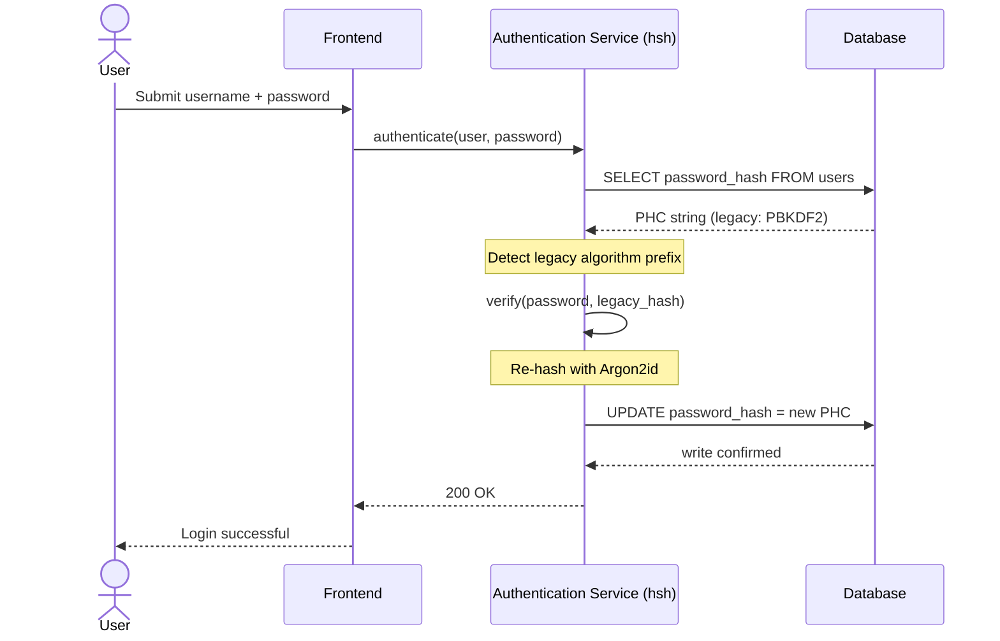
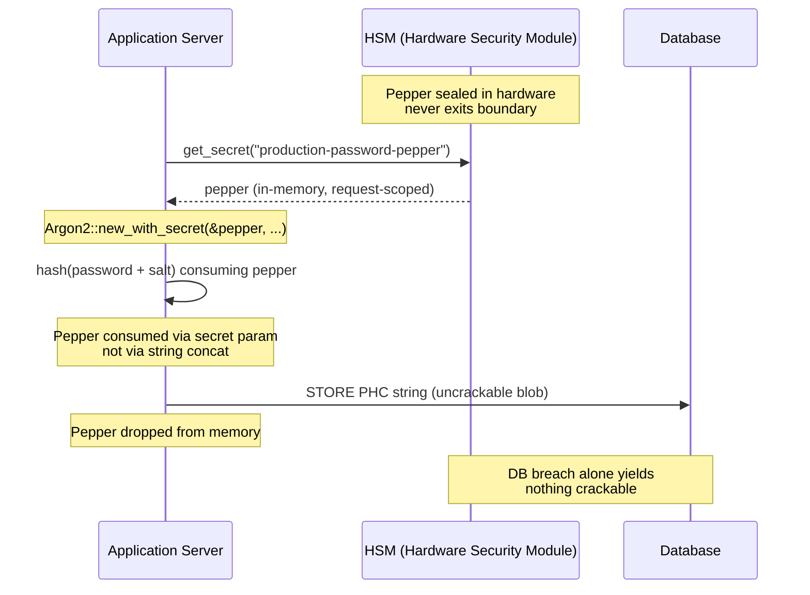

## Ασφάλεια διαχείρισης κωδικών πρόσβασης στην εταιρική τραπεζική: Κατακερματισμός πολλαπλών αλγορίθμων και αναβαθμίσεις με το hsh

> **Εκτελεστική περίληψη.** Ο τραπεζικός έλεγχος ταυτότητας που έχει σχεδιαστεί έναντι ενός μοντέλου απειλών του 2018 δεν είναι πλέον κατάλληλος για τον σκοπό του υπό το κανονιστικό καθεστώς του 2026. Το επιταχυνόμενο με GPU σπάσιμο, η πυκνότητα ASIC και ο επερχόμενος μετακβαντικός ορίζοντας έχουν καταρρεύσει το περιθώριο ασφαλείας του PBKDF2 και του scrypt πρώιμων παραμέτρων· το Άρθρο 5 του DORA μετέτρεψε αυτή τη φθορά σε ευθύνη λογοδοτούμενη στο διοικητικό συμβούλιο. Το hsh, ένα ανοιχτού κώδικα καθαρά Rust πλαίσιο, αντιμετωπίζει το πρόβλημα σε τρία επίπεδα παράλληλα: έναν dispatcher `verify_and_upgrade` που επανακατακερματίζει ένα αποθηκευμένο διαπιστευτήριο στις τρέχουσες παραμέτρους Argon2id σε κάθε επιτυχή σύνδεση χωρίς παράθυρο συντήρησης· ένα επίπεδο peppering διασυνδεδεμένο με HSM ή KMS που κάνει μια παραβίαση βάσης δεδομένων από μόνη της να μην αποδίδει τίποτα σπάσιμο· και μια ασφαλή ως προς τη μνήμη εφοδιαστική αλυσίδα που εξαλείφει την επιφάνεια επίθεσης της διεπαφής ξένων συναρτήσεων που είναι εγγενής στις κρυπτογραφικές βιβλιοθήκες με υποστήριξη C. Το αποτέλεσμα είναι ένα υπόστρωμα που ικανοποιεί το DORA, την πειθαρχία λειτουργικού κινδύνου του Basel III, τη λογοδοσία ανώτερων στελεχών του SM&CR και τον μετακβαντικό ορίζοντα μετάβασης του NIST IR 8547 — χωρίς το πρόγραμμα μαζικής επαναφοράς που ιστορικά απαιτείται για την αναβάθμιση ενός συστήματος ελέγχου ταυτότητας.

Ο περισσότερος εταιρικός τραπεζικός έλεγχος ταυτότητας εξακολουθεί να στηρίζεται σε ένα επίπεδο κωδικών πρόσβασης θωρακισμένο σε ένα μοντέλο απειλών του 2018. Το υλικό που το σπάει έχει προχωρήσει. Καθώς οι φάρμες GPU κλιμακώνονται και οι κρυπτογραφικά σχετικοί κβαντικοί υπολογιστές (CRQC) πλησιάζουν, ο παλαιός κατακερματισμός — PBKDF2, πρώιμο scrypt — φθείρεται με κάθε ώρα υπολογισμού που οι επιτιθέμενοι δαπανούν στην offline ουρά σπασίματος. Η φθορά είναι σιωπηλή: τίποτα στην παραγωγική βάση δεδομένων δεν σας λέει ότι ο κατακερματισμός που ήταν ισχυρός χθες δεν είναι πλέον.

Σύμφωνα με τον [Κανονισμό για την Ψηφιακή Λειτουργική Ανθεκτικότητα (DORA)](https://eur-lex.europa.eu/eli/reg/2022/2554/oj "Κανονισμός (ΕΕ) 2022/2554 — Κανονισμός για την Ψηφιακή Λειτουργική Ανθεκτικότητα"), η διατήρηση μη εναλλασσόμενων, παλαιών κρυπτογραφικών στοιχείων στην παραγωγή δεν αποτελεί πλέον τεχνικό χρέος. Είναι κατονομαζόμενη κανονιστική ευθύνη.

Το [hsh](https://github.com/sebastienrousseau/hsh "hsh — καθαρά Rust πλαίσιο κατακερματισμού κωδικών πρόσβασης") κλείνει το κενό. Ένα καθαρά Rust πλαίσιο, διαχειρίζεται πολλαπλές μορφές κατακερματισμού παράλληλα και αναβαθμίζει αδύναμα διαπιστευτήρια εν κινήσει κατά τη διάρκεια ενεργών συνεδριών σύνδεσης. Η υποδομή ελέγχου ταυτότητας ευθυγραμμίζεται με τις απαιτήσεις ανθεκτικότητας του 2026 χωρίς παράθυρο συντήρησης, χωρίς αναγκαστική επαναφορά, χωρίς ούτε ένα δευτερόλεπτο διακοπής λειτουργίας.

## 01. Το πρόβλημα της κρυπτογραφικής σήψης στην τραπεζική

Για να κατανοήσει κανείς την αναγκαιότητα ενός πλαισίου όπως το hsh, πρέπει να κατανοήσει τον κύκλο ζωής ενός κατακερματισμού κωδικού πρόσβασης. Οι αλγόριθμοι δεν γερνούν με χάρη· φθείρονται σε σχέση με το υλικό που είναι διαθέσιμο για να τους σπάσει.

**Το χάσμα επιτάχυνσης ASIC/GPU.** Αλγόριθμοι όπως ο PBKDF2 σχεδιάστηκαν για να είναι υπολογιστικά δαπανηροί για τις CPU. Σήμερα, οι επιτιθέμενοι χρησιμοποιούν εξαιρετικά παραλληλοποιημένες GPU για να εκτελέσουν offline επιθέσεις λεξικού. Ένας παλαιός κατακερματισμός που δημιουργήθηκε το 2018 είναι πολύ πιο αδύναμος έναντι ενός αντιπάλου του 2026.

**Ο κίνδυνος της μαζικής μετάβασης (big-bang).** Όταν ένας CISO αποφασίζει να αναβαθμίσει από PBKDF2 σε έναν αλγόριθμο σκληρό ως προς τη μνήμη όπως το Argon2id, δεν μπορεί να αντιστρέψει τους κατακερματισμούς για να τους επανακρυπτογραφήσει. Οι παραδοσιακές λύσεις —η επιβολή επαναφορών κωδικών πρόσβασης σε εκατομμύρια χρήστες— προκαλούν τεράστια τριβή στους πελάτες και λειτουργικό κίνδυνο.

**Η εφοδιαστική αλυσίδα των βιβλιοθηκών C.** Ιστορικά, το τραπεζικό middleware στηριζόταν σε βιβλιοθήκες όπως η `argonautica` ή σε ακατέργαστες συνδέσεις C για κατακερματισμό. Αυτές οι βιβλιοθήκες φέρουν έναν κρυμμένο κίνδυνο εφοδιαστικής αλυσίδας: μια μεμονωμένη υπερχείλιση buffer μνήμης στη μονάδα ελέγχου ταυτότητας μπορεί να οδηγήσει σε απομακρυσμένη εκτέλεση κώδικα (RCE) στο πιο προνομιακό επίπεδο της τραπεζικής στοίβας.

### Σύγκριση αλγορίθμων — αντίσταση υλικού και επιφάνεια ρύθμισης

Οι τρεις αλγόριθμοι που μια τράπεζα ρεαλιστικά συναντά σε ένα σώμα μετάβασης διαφέρουν λιγότερο στην επιλογή κρυπτογραφικού primitive και περισσότερο στο πώς γερνούν υπό την πίεση του υλικού. Ο παρακάτω πίνακας συνοψίζει την πρακτική στάση.

| Αλγόριθμος | Σκληρός ως προς τη μνήμη | Αντίσταση GPU / ASIC | Επιφάνεια ρύθμισης | Κατάσταση 2026 |
| ---- | ---- | ---- | ---- | ---- |
| **PBKDF2** | Όχι | Χαμηλή — διανυσματοποιείται σε GPU· υπο-χιλιοστά του δευτερολέπτου ανά υπόθεση σε τυπικό υλικό. | Μόνο αριθμός επαναλήψεων. | Παλαιός. Αποδεκτός μόνο ως εναλλακτική πλευράς επαλήθευσης κατά τη μετάβαση. |
| **scrypt** | Ναι (μέτρια) | Μεσαία — το κόστος μνήμης νικά τις απλές φάρμες GPU· αποσβέσιμος με ASIC σε κλίμακα. | `N` (CPU/μνήμη), `r` (μέγεθος μπλοκ), `p` (παραλληλισμός). | Καταργημένος για νέες εγκαταστάσεις. Ενεργός σε σώματα μετάβασης. |
| **Argon2id** | Ναι (υψηλά) | Υψηλή — σκληρός ως προς τη μνήμη και τον χρόνο· αντιστέκεται σε επιθέσεις side-channel και TMTO. | Κόστος μνήμης (`m`), κόστος χρόνου (`t`), παραλληλισμός (`p`), μυστικό (pepper). | Συνιστώμενη προεπιλογή. OWASP, προσχέδιο NIST SP 800-63B-4, FedRAMP. |

Το συμπέρασμα για το σχέδιο μετάβασης είναι στενό: ο PBKDF2 είναι μια κατάσταση *πλευράς επαλήθευσης*, όχι ένας προορισμός *πλευράς εγγραφής*. Κάθε επιτυχής σύνδεση σε μια εγγραφή PBKDF2 θα πρέπει να παράγει μια εγγραφή Argon2id κατά την έξοδο.

## 02. Ο αρχιτεκτονικός φακός του hsh 2026

Το πλαίσιο είναι δομημένο σε πέντε βασικά επίπεδα, καθένα σχεδιασμένο να μετριάζει μια συγκεκριμένη κατηγορία λειτουργικού κινδύνου.

### Πίνακας 1: Αρχιτεκτονικά επίπεδα του hsh και μετριασμός κινδύνου

| Επίπεδο | Απόφαση σχεδιασμού | Γιατί έχει σημασία | Κίνδυνος σε περίπτωση κακού χειρισμού |
| ---- | ---- | ---- | ---- |
| **Κρυπτογραφικά primitives** | Ενοποιημένη μορφή PHC String που υποστηρίζει Argon2id, scrypt και PBKDF2 | Παρέχει κορυφαία αντίσταση σε επιθέσεις GPU διατηρώντας παράλληλα προς τα πίσω συμβατότητα. | Σιλό δεδομένων· αδύναμοι αλγόριθμοι που επιτρέπουν 100 δισ.+ υποθέσεις/δευτερόλεπτο offline. |
| **Μηχανή πολιτικής** | Αποστολή `verify_and_upgrade` | Αυτοματοποιεί τη μετάβαση από παλαιές σε σύγχρονες πολιτικές δυναμικά κατά τη σύνδεση. | Σήψη ασφαλείας· ενεργοί χρήστες που παραμένουν σε εύκολα σπάσιμους παλαιούς τύπους κατακερματισμού. |
| **Διασύνδεση υλικού** | Δυνατότητες "peppering" μέσω HSM και Cloud KMS | Διασφαλίζει ότι μια παραβίαση βάσης δεδομένων από μόνη της δεν εκθέτει υποψήφιους κωδικούς πρόσβασης. | Επιτυχείς επιθέσεις offline brute-force μετά από παραβίαση SQL injection. |
| **Υγιεινή ασφαλείας** | Επιβολή `deny.toml` και καθαρή Rust | Μπλοκάρει εντελώς το ανασφαλές FFI και τις μη έμπιστες εξωτερικές εξαρτήσεις C. | Καταστροφικές επιθέσεις εφοδιαστικής αλυσίδας και CVE διαφθοράς μνήμης. |

## 03. Η διαδρομή επανακατακερματισμού χωρίς διακοπή λειτουργίας

Το μοτίβο `verify_and_upgrade` λύνει τη μετάβαση δεδομένων μέσω ενός έξυπνου, ενήμερου για την κατάσταση συστήματος αποστολής που απαιτεί μηδενική διακοπή λειτουργίας της βάσης δεδομένων.

Όταν ένας χρήστης υποβάλλει τα διαπιστευτήριά του, το hsh διαβάζει την αποθηκευμένη συμβολοσειρά Password Hashing Competition (PHC). Εάν περιέχει έναν παλαιό κατακερματισμό (π.χ., μια ξεπερασμένη διαμόρφωση PBKDF2), το σύστημα εκτελεί την ακόλουθη ροή:

1. **Αναγνώριση:** Αναλύει τον παλαιό αλγόριθμο και τις συγκεκριμένες παραμέτρους του.
2. **Επαλήθευση:** Επικυρώνει τον υποψήφιο κωδικό πρόσβασης έναντι του παλαιού κατακερματισμού.
3. **Αναβάθμιση σε πραγματικό χρόνο:** Μετά από επιτυχή αντιστοίχιση, παίρνει τον υποψήφιο κωδικό πρόσβασης σε απλό κείμενο στη μνήμη και υπολογίζει αμέσως έναν νέο κατακερματισμό χρησιμοποιώντας την εξαιρετικά ασφαλή πολιτική Argon2id.
4. **Διατήρηση:** Επιστρέφει τη νέα συμβολοσειρά PHC στην τραπεζική εφαρμογή, η οποία αντικαθιστά την παλαιά εγγραφή στη βάση δεδομένων.

Αυτή η διαδικασία είναι εντελώς διαφανής για τον τελικό χρήστη. Μεταφέρει αποτελεσματικά τους πιο ενεργούς λογαριασμούς στο υψηλότερο επίπεδο ασφαλείας από την πρώτη ημέρα, μειώνοντας δραματικά την επιφάνεια επίθεσης της τράπεζας οργανικά με την πάροδο του χρόνου.

Η ακολουθία παρακάτω δείχνει τι συμβαίνει κατά τη διάρκεια ενός μεμονωμένου συμβάντος σύνδεσης όταν η αποθηκευμένη εγγραφή βρίσκεται σε έναν παλαιό αλγόριθμο. Ο χρήστης δεν βλέπει τίποτα να αλλάζει· το σύστημα ελέγχου ταυτότητας της τράπεζας ενισχύεται κατά μία εγγραφή.



### Μοτίβο υλοποίησης — αποστολή `verify_and_upgrade`

Η επιφάνεια ενσωμάτωσης μέσα σε μια υπηρεσία ελέγχου ταυτότητας είναι μικρή. Η παλαιά διαδρομή κώδικα παραμένει ως εναλλακτική· η νέα διαδρομή κώδικα είναι ο dispatcher.

```rust
use hsh::{Hasher, UpgradeResult};

struct UserRecord {
    username: String,
    password_hash: String, // PHC string
}

async fn authenticate(user: UserRecord, password_attempt: &str) -> Result<bool, AuthError> {
    let hasher = Hasher::new();
    match hasher.verify_and_upgrade(password_attempt, &user.password_hash) {
        Ok(UpgradeResult::Verified(is_valid)) => Ok(is_valid),
        Ok(UpgradeResult::Upgraded(new_hash)) => {
            db::update_user_hash(&user.username, new_hash).await?;
            Ok(true)
        }
        Err(_) => Err(AuthError::InvalidCredentials),
    }
}
```

Τρεις ιδιότητες έχουν σημασία:

- **Ενημερότητα κατάστασης.** Η `verify_and_upgrade` επιθεωρεί το πρόθεμα της συμβολοσειράς PHC. Εάν ο δείκτης αλγορίθμου είναι παλαιός, το πλαίσιο ενεργοποιεί αυτόματα τον επανακατακερματισμό έναντι της διαμορφωμένης πολιτικής Argon2id. Καμία διακλάδωση στον καλούντα κώδικα.
- **Ατομικότητα.** Ο επανακατακερματισμός συμβαίνει μόνο μετά την επιτυχή επαλήθευση του παλαιού, μέσα στο ίδιο συμβάν ελέγχου ταυτότητας. Δεν υπάρχει ξεχωριστή εργασία δέσμης, ούτε προγραμματισμένο παράθυρο μετάβασης, ούτε καταστροφική μαζική μετάβαση προς αναίρεση.
- **Διατήρηση.** Η παραλλαγή `UpgradeResult::Upgraded` μεταφέρει τη νέα συμβολοσειρά PHC. Η εφαρμογή τη διατηρεί μέσω της ίδιας διαδρομής δεδομένων που υπάρχει ήδη για την παλαιά εγγραφή — καμία παράλληλη επιφάνεια εγγραφής, κανένα πρωτόκολλο εγγραφής δύο φάσεων.

**Τρόποι αστοχίας.** Εάν η εγγραφή στη βάση δεδομένων αποτύχει ή το KMS είναι στιγμιαία μη προσβάσιμο κατά την εγγραφή αναβάθμισης, η συνεδρία εξακολουθεί να πετυχαίνει έναντι του παλαιού κατακερματισμού και η εγγραφή παραμένει στον παλιό αλγόριθμο. Η επόμενη επιτυχής σύνδεση επαναλαμβάνει την αναβάθμιση. Δεν υπάρχει κατάσταση μερικής μετάβασης και καμία ορατή για τον χρήστη αστοχία — η μετάβαση είναι μονότονη σε όλα τα συμβάντα σύνδεσης, και το κόστος ανά εγγραφή μιας αποτυχημένης αναβάθμισης είναι ακριβώς μία επιπλέον προσπάθεια στην επόμενη σύνδεση.

## 04. Peppered κατακερματισμοί μέσω διασύνδεσης HSM / KMS

Ο τυπικός κατακερματισμός κωδικών πρόσβασης προστατεύει από άμεσες διαρροές βάσεων δεδομένων, αλλά εάν ένας επιτιθέμενος αποκτήσει και τη βάση δεδομένων (κατακερματισμούς και salts), μπορεί να εκτελέσει offline σπάσιμο.

Το hsh εισάγει ένα ισχυρό "peppered" επίπεδο ασφαλείας. Ενσωματώνοντας με Μονάδες Ασφαλείας Υλικού (HSM) ή cloud-native Υπηρεσίες Διαχείρισης Κλειδιών (KMS), η τελική έξοδος Argon2id περιτυλίγεται κρυπτογραφικά με ένα κλειδί υψηλής εντροπίας που δεν εγκαταλείπει ποτέ το ασφαλές όριο του υλικού. Εάν η βάση δεδομένων χρηστών εξαχθεί, ο επιτιθέμενος κατέχει μόνο κρυπτογραφημένα blobs. Δεν μπορεί να αρχίσει να σπάει κωδικούς πρόσβασης χωρίς να παραβιάσει επίσης τη φυσικά απομονωμένη υποδομή HSM της τράπεζας.

Το αρχιτεκτονικό διάγραμμα παρακάτω ιχνηλατεί τη διαδρομή του μυστικού. Το pepper δεν φτάνει ποτέ στη βάση δεδομένων· η βάση δεδομένων δεν κρατά ποτέ τίποτα διευθυνσιοδοτήσιμο από μόνη της. Τα δύο αποθετήρια μπορούν να αστοχήσουν ανεξάρτητα — το σύστημα χάνει την εμπιστευτικότητα μόνο εάν αστοχήσουν και τα δύο μαζί.



### Μοτίβο υλοποίησης — peppered Argon2id υποστηριζόμενο από HSM

Το pepper αντλείται από το HSM κατά τον χρόνο του αιτήματος, όχι από ένα αρχείο διαμόρφωσης. Η `Argon2::new_with_secret` το καταναλώνει μέσω της παραμέτρου μυστικού του αλγορίθμου, όχι μέσω συνένωσης συμβολοσειρών.

```rust
use argon2::{
    Argon2, Algorithm, Version, Params,
    PasswordHasher, PasswordVerifier,
    password_hash::{PasswordHash, SaltString, rand_core::OsRng},
};

async fn authenticate_with_hsm(
    user: UserRecord,
    password_attempt: &str,
) -> Result<bool, AuthError> {
    let pepper = hsm::client::get_secret("production-password-pepper").await?;
    let hasher = Argon2::new_with_secret(
        &pepper,
        Algorithm::Argon2id,
        Version::V0x13,
        Params::default(),
    )
    .map_err(|_| AuthError::Internal)?;

    let parsed = PasswordHash::new(&user.password_hash)
        .map_err(|_| AuthError::InvalidCredentials)?;
    if hasher.verify_password(password_attempt.as_bytes(), &parsed).is_ok() {
        if is_legacy_hash(&user.password_hash) {
            let new_hash = hasher
                .hash_password(
                    password_attempt.as_bytes(),
                    &SaltString::generate(&mut OsRng),
                )
                .map_err(|_| AuthError::Internal)?
                .to_string();
            db::update_user_hash(&user.username, new_hash).await?;
        }
        return Ok(true);
    }
    Err(AuthError::InvalidCredentials)
}
```

Τρεις ευθυγραμμισμένες με το DORA συνέπειες προκύπτουν από αυτή τη μορφή:

- **Η εναλλαγή κλειδιών ως πρόβλημα διαχείρισης κλειδιών.** Το pepper ζει πίσω από το όριο HSM/KMS, όχι στη βάση δεδομένων. Η εναλλαγή γίνεται αλλαγή διαχείρισης κλειδιών, όχι εκστρατεία επανακατακερματισμού σε όλο το σύστημα των χρηστών. Οι νέοι κατακερματισμοί δεσμεύονται στην τρέχουσα έκδοση του pepper· οι παλαιοί κατακερματισμοί επαληθεύονται υπό τη δεσμευμένη έκδοσή τους μέχρι να αναβαθμιστούν φυσικά.
- **Διαχωρισμός καθηκόντων.** Η ταυτότητα υπηρεσίας που διαβάζει το pepper πρέπει να είναι ελέγξιμη και ελάχιστων προνομίων. Μια πλήρης εξαγωγή βάσης δεδομένων χωρίς την αντίστοιχη παραχώρηση HSM δεν αποδίδει τίποτα σπάσιμο. Μια παραβίαση παραχώρησης HSM χωρίς τη βάση δεδομένων δεν αποδίδει τίποτα διευθυνσιοδοτήσιμο. Η ακτίνα έκρηξης οποιασδήποτε από τις δύο μεμονωμένες αστοχίες είναι περιορισμένη.
- **Αποφυγή length extension και σφαλμάτων συνένωσης.** Η χρήση της παραμέτρου μυστικού του Argon2 αντί της συνένωσης συμβολοσειρών αφαιρεί μια ολόκληρη κατηγορία κρυπτογραφικών παγίδων — length-extension, εσφαλμένα τυποποιημένη συνένωση UTF-8, σφάλματα σειράς salt/pepper — από την επιφάνεια υλοποίησης.

## 05. Κανονιστική ευθυγράμμιση: DORA, Basel III και SM&CR

- **Άρθρα 5 και 6 του DORA:** Απαιτούν από τις χρηματοπιστωτικές οντότητες να διατηρούν πλαίσια διαχείρισης κινδύνου ICT. Μια στρατηγική που βασίζεται σε μη εναλλασσόμενους, δεκαετίας κατακερματισμούς κωδικών πρόσβασης παραβιάζει αυτές τις αρχές. Το hsh παρέχει έναν τεκμηριωμένο, αυτοματοποιημένο μηχανισμό για τη συνεχή αναβάθμιση των κρυπτογραφικών προστασιών.
- **Basel III:** Συνδέει το κανονιστικό κεφάλαιο με την πιθανότητα και τη σοβαρότητα των συμβάντων ζημίας. Υλοποιώντας το Argon2id με διασύνδεση HSM, η σοβαρότητα μιας παραβίασης βάσης δεδομένων μειώνεται δραστικά, υποστηρίζοντας ποσοτικοποιήσιμα επιχειρήματα για χαμηλότερη κατανομή κεφαλαίου λειτουργικού κινδύνου.
- **Λογοδοσία SM&CR:** Η έγκριση μιας αρχιτεκτονικής που αποκαθιστά ενεργά την κρυπτογραφική σήψη παρέχει στα κατονομαζόμενα ανώτερα στελέχη μια επαληθεύσιμη, τεκμηριώσιμη αλυσίδα μείωσης κινδύνου.

## Συχνές ερωτήσεις

**Είναι το hsh έτοιμο για παραγωγή σε μια διαδρομή ελέγχου ταυτότητας τράπεζας πρώτης βαθμίδας;**
Η βιβλιοθήκη είναι ανοιχτού κώδικα, τεκμηριωμένη, και αξιοποιεί το Argon2id μέσω του ίδιου crate `argon2` που υποστηρίζει το οικοσύστημα κατακερματισμού κωδικών πρόσβασης RustCrypto. Η υιοθέτηση από τράπεζα πρώτης βαθμίδας ακολουθεί τη δική της δέουσα επιμέλεια: ανεξάρτητη αναθεώρηση κώδικα, βεβαίωση αναπαραγώγιμης δόμησης, καθήλωση δέντρου εξαρτήσεων, δοκιμές ενσωμάτωσης με προμηθευτή HSM, και έγκριση από το τμήμα Λειτουργικού Κινδύνου. Το hsh παρέχει το υπόστρωμα· η τράπεζα πιστοποιεί την ανάπτυξη.

**Πώς η `verify_and_upgrade` αποφεύγει τον κίνδυνο μαζικής μετάβασης;**
Ο επαληθευτής επιθεωρεί τη συμβολοσειρά PHC κατά τον χρόνο ανάλυσης, εκτελεί τον παλαιό αλγόριθμο για να επικυρώσει τον κωδικό πρόσβασης, και — εάν ο αποθηκευμένος αλγόριθμος ή το σύνολο παραμέτρων είναι κάτω από το τρέχον κατώφλι — επανακατακερματίζει το απλό κείμενο υπό Argon2id με το δεσμευμένο pepper του HSM και γράφει πίσω τη νέα συμβολοσειρά PHC ατομικά. Ο χρήστης βιώνει μια κανονική σύνδεση. Το σύστημα ενισχύεται κατά μία εγγραφή ανά επιτυχή έλεγχο ταυτότητας. Καμία εκστρατεία επαναφοράς, κανένα παράθυρο συντήρησης, κανένα συμβάν λειτουργικού κινδύνου.

**Τι συμβαίνει με τους αδρανείς λογαριασμούς που δεν συνδέονται ποτέ;**
Οι εγγραφές που δεν πραγματοποιούν ποτέ έλεγχο ταυτότητας δεν επανακατακερματίζονται ποτέ. Οι τράπεζες αντιμετωπίζουν αυτό με δύο συμπληρωματικές πολιτικές: ένα τεκμηριωμένο κατώφλι αδράνειας (συχνά 18–24 μήνες) μετά το οποίο ο λογαριασμός εναλλάσσεται διοικητικά υπό μια ελεγχόμενη εκστρατεία επαναφοράς, και μια συνθετική εκτέλεση επανακατακερματισμού κατά τη διάρκεια προγραμματισμένης συντήρησης για λογαριασμούς σε καθορισμένες ομάδες (υψηλής αξίας, υψηλού προνομίου, ρυθμιζόμενοι). Και τα δύο είναι πολιτικές, όχι συμπεριφορές βιβλιοθήκης· το hsh καταγράφει την απόφαση αποστολής στην τηλεμετρία ελέγχου ώστε ο λειτουργικός ιδιοκτήτης να μπορεί να αποδείξει την κάλυψη.

**Εισάγει το pepper του HSM ένα μοναδικό σημείο αστοχίας στη διαδρομή ελέγχου ταυτότητας;**
Το ίδιο HSM που υπογράφει μηνύματα πληρωμών και εναλλάσσει κλειδιά υποστηριζόμενα από KMS βρίσκεται στη διαδρομή. Ο κίνδυνος είναι ταυτόσημος με την υπάρχουσα στάση της τράπεζας· το hsh τον κληρονομεί αντί να τον εισάγει. Οι μετριασμοί είναι τυπικοί: ζεύγη HSM υψηλής διαθεσιμότητας, εφεδρικές θερμές περιοχές KMS, ανάκτηση pepper με εμβέλεια αιτήματος με εναλλακτική circuit-breaker σε λειτουργία μόνο ανάγνωσης, και ένα ρητό λειτουργικό εγχειρίδιο για τη μη διαθεσιμότητα HSM. Το pepper είναι η παράμετρος μυστικού του `argon2`, καταναλώνεται εντός διεργασίας και απορρίπτεται από τη μνήμη μετά τη χρήση.

**Πού τοποθετείται το hsh σε σχέση με τη μετακβαντική μετάβαση;**
Το hsh είναι ένα πλαίσιο κατακερματισμού κωδικών πρόσβασης και μυστικών, όχι primitive ενθυλάκωσης κλειδιών ή υπογραφής. Η μετάβαση PQC που τεκμηριώνεται στο [NIST IR 8547](https://csrc.nist.gov/pubs/ir/8547/ipd "Transition to Post-Quantum Cryptography Standards") στοχεύει στη σύναψη κλειδιών (ML-KEM, FIPS 203) και τις υπογραφές (ML-DSA, FIPS 204· SLH-DSA, FIPS 205). Το επίπεδο κατακερματισμού που καλύπτει το hsh είναι σε μεγάλο βαθμό ορθογώνιο προς αυτή τη μετάβαση. Τα δύο συγκλίνουν στο επίπεδο του υποστρώματος — και τα δύο θέλουν μια ασφαλή ως προς τη μνήμη, ελέγξιμη, αναπαραγώγιμης δόμησης κρυπτογραφική εφοδιαστική αλυσίδα — που είναι ακριβώς η στάση που το hsh επιτρέπει σήμερα.

## Συμπέρασμα

Ο κατακερματισμός κωδικών πρόσβασης «ανάπτυξε-και-ξέχνα» τελείωσε. Το DORA μετέφερε την κρυπτογραφική παθητικότητα από τεχνικό χρέος σε κατονομαζόμενη κανονιστική ευθύνη, και η καμπύλη του υλικού γίνεται πιο απότομη κάθε χρόνο. Η συνεισφορά του hsh δεν είναι ένας ισχυρότερος αλγόριθμος — το Argon2id είναι διαθέσιμο εδώ και χρόνια. Η συνεισφορά είναι ο λειτουργικός μηχανισμός για τη μετάβαση σε αυτόν χωρίς προγραμματισμό διακοπής λειτουργίας, χωρίς επιβολή επαναφορών χρηστών, και χωρίς να εμπιστεύεσαι shims FFI βασισμένα σε C με τη διαδρομή ελέγχου ταυτότητας της τράπεζας.

Ο [πηγαίος κώδικας του hsh](https://github.com/sebastienrousseau/hsh "hsh — καθαρά Rust πλαίσιο κατακερματισμού κωδικών πρόσβασης, διπλή άδεια MIT και Apache 2.0") είναι διαθέσιμος υπό τη διπλή άδεια MIT και Apache 2.0.

## Αναφορές

Basel Committee on Banking Supervision (2011). *Basel III: A global regulatory framework for more resilient banks and banking systems*. Bank for International Settlements. Διαθέσιμο στη διεύθυνση: [https://www.bis.org/publ/bcbs189.pdf](https://www.bis.org/publ/bcbs189.pdf "Basel III: A global regulatory framework for more resilient banks and banking systems")

Biryukov, A., Dinu, D., Khovratovich, D., and Josefsson, S. (2021). *RFC 9106: Argon2 Memory-Hard Function for Password Hashing and Proof-of-Work Applications*. Internet Engineering Task Force. Διαθέσιμο στη διεύθυνση: [https://datatracker.ietf.org/doc/html/rfc9106](https://datatracker.ietf.org/doc/html/rfc9106 "RFC 9106 — Argon2 Memory-Hard Function for Password Hashing")

European Parliament and Council (2022). *Regulation (EU) 2022/2554 on digital operational resilience for the financial sector (DORA)*. Διαθέσιμο στη διεύθυνση: [https://eur-lex.europa.eu/eli/reg/2022/2554/oj](https://eur-lex.europa.eu/eli/reg/2022/2554/oj "Regulation (EU) 2022/2554 — DORA")

Financial Conduct Authority (2015). *Senior Managers and Certification Regime (SM&CR)*. Διαθέσιμο στη διεύθυνση: [https://www.fca.org.uk/firms/senior-managers-certification-regime](https://www.fca.org.uk/firms/senior-managers-certification-regime "Senior Managers and Certification Regime")

National Institute of Standards and Technology (2024). *Initial Public Draft — Transition to Post-Quantum Cryptography Standards (NIST IR 8547)*. Διαθέσιμο στη διεύθυνση: [https://csrc.nist.gov/pubs/ir/8547/ipd](https://csrc.nist.gov/pubs/ir/8547/ipd "NIST IR 8547 — Transition to Post-Quantum Cryptography Standards")

OWASP Foundation (2024). *Password Storage Cheat Sheet*. Διαθέσιμο στη διεύθυνση: [https://cheatsheetseries.owasp.org/cheatsheets/Password_Storage_Cheat_Sheet.html](https://cheatsheetseries.owasp.org/cheatsheets/Password_Storage_Cheat_Sheet.html "OWASP Password Storage Cheat Sheet")
