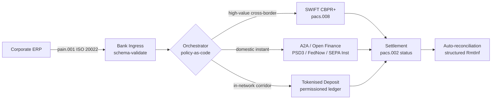

## Διασυνοριακά 2026: ISO 20022, Ανοικτή Χρηματοοικονομική και Tokenised Καταθέσεις στο Εταιρικό Treasury

> **Σύνοψη για Στελέχη.** Το διασυνοριακό εταιρικό treasury το 2026 είναι ένα πολυδικτυακό πρόβλημα μηχανικής προτού γίνει πρόβλημα διαχείρισης σχέσεων. Το PSD3 και ο κανονισμός Financial Data Access (FiDA) διευρύνουν την περίμετρο του open banking μέσα στα δεδομένα του εταιρικού treasury· η μετάβαση MT/MX του SWIFT τον Νοέμβριο του 2026 καθιστά το CBPR+-συμβατό pacs.008 τη μοναδική βιώσιμη διασυνοριακή διατραπεζική μορφή· οι tokenised καταθέσεις και τα ρυθμιζόμενα δίκτυα stablecoin χειρίζονται το σκέλος του χονδρικού διακανονισμού σε σχεδόν T+0 εντός δικτύων με άδεια πρόσβασης. Η CIB που κερδίζει σε αυτόν τον κύκλο δεν είναι εκείνη που επιλέγει ένα μόνο δίκτυο· είναι εκείνη που κατασκευάζει το επίπεδο ενορχήστρωσης που τα συνδέει. Αυτό το άρθρο διατρέχει την αρχιτεκτονική των τεσσάρων δικτύων (A2A υπό PSD3, SWIFT CBPR+, tokenised καταθέσεις εκδοθείσες από τράπεζες, ρυθμιζόμενα stablecoins) — τι κάνει καλά κάθε δίκτυο, πού πέφτουν τα όρια της πιστωτικής έκθεσης, και τι πρέπει να επιβάλλει το επίπεδο ενορχήστρωσης policy-as-code από πάνω τους ώστε η επιχείρηση να βλέπει μία πληρωμή και ο επόπτης να βλέπει ένα ελέγξιμο ίχνος.

Μια ευρωπαϊκή βιομηχανική επιχείρηση πληρώνει έναν Βραζιλιάνο προμηθευτή 4,2 εκατ. EUR ένα πρωινό Τετάρτης. Ο σταθμός εργασίας του treasury δεν επιλέγει τράπεζα. Επιλέγει δίκτυο — μια ακολουθία δικτύων. Η εντολή προς τον πελάτη προσγειώνεται σε ένα μήνυμα pain.001 A2A που δρομολογείται μέσω παρόχου ανοικτής χρηματοοικονομικής υπό PSD3. Η τράπεζα το μεταφέρει μέσω δύο ανταποκριτικών δικαιοδοσιών σε tokenised καταθέσεις εντός ενός ιδιωτικού δικτύου CIB. Η μακριά ουρά — μια εκκαθάριση τιμολογίου 80.000 USD προς έναν υποπρομηθευτή χωρίς σχέση tokenised καταθέσεων — εξακολουθεί να διεκπεραιώνεται μέσω SWIFT CBPR+ ως pacs.008. Ο πελάτης βλέπει μία πληρωμή. Η αρχιτεκτονική βλέπει τέσσερα δίκτυα. Το [ISO 20022](/2023-09-29-automating-iso-20022-compliant-payment-file-creation-with-pain001/index.html) είναι ο μοναδικός λόγος που όλα αυτά στέκονται μαζί.

Αυτό είναι το λειτουργικό μοντέλο που περιγράφει η Mastercard όταν μιλά για [την εξέλιξη από το open banking στην ανοικτή χρηματοοικονομική](https://www.mastercard.com/us/en/news-and-trends/Insights/2026/open-banking-to-open-finance-the-evolution-of-financial-data.html "Mastercard: open banking to open finance, the evolution of financial data") — δεδομένα και πληρωμές συγχωνευμένα σε ένα επίπεδο ενορχήστρωσης, με το δίκτυο να επιλέγεται από το σύστημα, όχι από τον πελάτη. Το ενδιαφέρον ερώτημα για τους έμπειρους τεχνολόγους των τραπεζών δεν είναι ποιο δίκτυο κερδίζει. Είναι πώς το επίπεδο ενορχήστρωσης σχεδιάζεται, διακυβερνάται και συμφωνείται.

## 01. Από τις κάρτες στο A2A — η μετάβαση στην ανοικτή χρηματοοικονομική

Τα δίκτυα καρτών δεν εξαφανίζονται. Επαναπροσδιορίζονται.

Καθ' όλη τη διάρκεια του 2025 και μέσα στο 2026, [το PSD3 και ο κανονισμός Financial Data Access (FiDA)](https://www.consultancy.uk/news/42202/orchestrating-open-banking-for-platform-growth-2026-outlook "Consultancy.uk: orchestrating open banking for platform growth, 2026 outlook") επέκτειναν την υποχρέωση open banking πέρα από τους λογαριασμούς πληρωμών σε συντάξεις, στεγαστικά δάνεια, αποταμιεύσεις, ασφάλειες και δεδομένα εταιρικού treasury. Η συνέπεια για το εταιρικό treasury είναι άμεση: ένας διαχειριστής σχέσεων CIB μπορεί πλέον να καταναλώσει την πλήρη εικόνα ρευστότητας μιας επιχείρησης σε πολλαπλές τράπεζες μέσω ενός συμβολαίου API, κατ' εντολή της επιχείρησης.

Δύο φορείς κατασκευάζουν εμφανώς το επίπεδο ενορχήστρωσης που θα καταναλώσουν οι επιχειρήσεις. Η Nexi επέκτεινε το αποτύπωμα acquiring της στην έναρξη A2A σε διαδρομές SEPA Instant και πανευρωπαϊκές RTGS, εγγενώς ISO 20022 από άκρο σε άκρο. Η πλατφόρμα ανοικτής χρηματοοικονομικής της Mastercard — αγκυρωμένη στην εξαγορά των Aiia και Finicity — παρέχει το επίπεδο συγκέντρωσης δεδομένων και συναίνεσης από κάτω, με την έναρξη πληρωμών να αναδύεται μέσα από την ίδια υποδομή API που προηγουμένως εξυπηρετούσε τις εξουσιοδοτήσεις καρτών.

Η μετάβαση έχει σημασία για τρεις λόγους:

1. **Οικονομικά μονάδας.** Το A2A που ξεκινά υπό PSD3 αφαιρεί το interchange από την πληρωμή. Για ροές B2B υψηλής αξίας, η εξοικονόμηση είναι ουσιαστική· για καταναλωτικές ροές χαμηλής αξίας, η στοίβα κόστους του εμπόρου καταρρέει.
2. **Ποιότητα δεδομένων.** Το A2A υπό ISO 20022 μεταφέρει δομημένα δεδομένα εμβασμάτων που οι κάρτες ποτέ δεν μπορούσαν. Ποσοστά αυτόματης συμφωνίας άνω του 95% είναι πλέον αυτονόητα.
3. **Μοντέλο κινδύνου.** Το A2A είναι μεταφορά πίστωσης, όχι εξουσιοδότηση κάρτας. Η επιφάνεια απάτης, το μοντέλο chargeback και το μοντέλο διαφορών είναι όλα διαφορετικά. Οι ομάδες εταιρικού treasury πρέπει να κατανοήσουν ότι το επίπεδο προστασίας του πελάτη ανακατασκευάζεται, δεν κληρονομείται.

Η CIB που πουλά μια πολυδικτυακή πρόταση το 2026 πουλά ενορχήστρωση — όχι πρόσβαση. Η πρόσβαση είναι πλέον ρυθμισμένη.

## 02. Το ISO 20022 ως lingua franca σε όλα τα δίκτυα

Ο λόγος που το multi-rail είναι καν εφικτό είναι ότι η μορφή του μηνύματος είναι πλέον συνεπής σε όλα τα δίκτυα.

Η Επιτροπή Πληρωμών και Υποδομών Αγοράς (CPMI) της BIS διατύπωσε ξεκάθαρα την αρχιτεκτονική επιχειρηματολογία στις [απαιτήσεις εναρμόνισης ISO 20022 για την ενίσχυση των διασυνοριακών πληρωμών](https://www.bis.org/cpmi/publ/d230.pdf "BIS CPMI: ISO 20022 harmonisation requirements for enhancing cross-border payments"). Η μετάβαση στο CBPR+ τον Νοέμβριο του 2025 έκλεισε την εποχή MT103 / MT202 για τη διασυνοριακή διατραπεζική επικοινωνία. Από εκείνο το σημείο, κάθε μεγάλο δίκτυο — SWIFT, FedNow, SEPA Instant, RTP και τα μεγάλα συστήματα άμεσων πληρωμών στην Ασία και τη Λατινική Αμερική — μιλά την ίδια γραμματική pacs.008 / pacs.009 / pain.001.

Η πρακτική συνέπεια για το εταιρικό treasury:

- **Η δρομολόγηση καθοδηγείται από δεδομένα.** Ο σταθμός εργασίας του treasury μπορεί να διαβάσει ένα pain.001 μία φορά και να αποφασίσει το δίκτυο ανά πληρωμή με βάση τη διαδρομή, το μέγεθος συναλλαγής, το cut-off και τη σχέση με τον αντισυμβαλλόμενο — χωρίς επαναχαρτογράφηση του μηνύματος.
- **Τα δεδομένα εμβασμάτων επιβιώνουν του άλματος.** Τα δομημένα πεδία εμβασμάτων (`<RmtInf><Strd>`) διαπερνούν τα ανταποκριτικά σκέλη χωρίς αποκοπή. Τα ποσοστά αυτόματης συμφωνίας ανεβαίνουν επειδή τα δεδομένα δεν χάνονται πλέον στο όριο του δικτύου.
- **Ο έλεγχος κυρώσεων γίνεται ελέγξιμος.** Δομημένα πεδία `<Dbtr>` / `<Cdtr>` / `<DbtrAgt>` / `<CdtrAgt>` με αναφορές LEI αντικαθιστούν τον έλεγχο ονομάτων ελεύθερου κειμένου. Τα ποσοστά θετικών αντιστοιχίσεων πέφτουν. Οι ουρές διερεύνησης συρρικνώνονται.

Το παρακάτω διάγραμμα ιχνηλατεί ένα μοναδικό pain.001 μέσα από την είσοδο της τράπεζας, στον ενορχηστρωτή policy-as-code, και έξω προς όποιο δίκτυο απαιτούν η διαδρομή και το μέγεθος συναλλαγής — ένα μήνυμα, πολλά δίκτυα, καμία επαναχαρτογράφηση.

Το κόστος αυτής της συνέπειας είναι η μηχανική πειθαρχία. Το ISO 20022 είναι επιτρεπτικό. Δύο τράπεζες μπορεί να είναι πλήρως συμβατές με το CBPR+ και παρόλα αυτά να παράγουν μηνύματα pacs.008 που διαφέρουν στη χρήση πεδίων, στο σύνολο χαρακτήρων και στη δομή των δεδομένων εμβασμάτων. Η CIB που κερδίζει στα διασυνοριακά το 2026 επιβάλλει ένα αυστηρότερο προφίλ μηνύματος από όσο απαιτεί το πρότυπο — και απορρίπτει κατά την ανάλυση, όχι κατά τον διακανονισμό.

## 03. Tokenised καταθέσεις και σταθερά δίκτυα

Το σκέλος του χονδρικού διακανονισμού είναι εκεί όπου η ιστορία των δικτύων γίνεται ενδιαφέρουσα.

Η εικόνα του 2026, όπως αποτυπώνεται εύστοχα στην [ανάλυση της Trade Treasury Payments για την αυτοματοποίηση, τα εφεδρικά δίκτυα, το ISO 20022 και τα stablecoins](https://tradetreasurypayments.com/articles/automation-contingency-rails-iso-20022-and-stablecoins-the-2026-trends-reshaping-corporate-finance-and-b2b-payments "Trade Treasury Payments: automation, contingency rails, ISO 20022 and stablecoins, the 2026 trends reshaping corporate finance and B2B payments"), διαχωρίζει το επίπεδο χονδρικού διακανονισμού σε δύο δομικά διαφορετικά μοντέλα.

**Tokenised καταθέσεις εκδοθείσες από τράπεζες.** Μια εμπορική τράπεζα εκδίδει μια tokenised υποχρέωση σε ένα ledger με άδεια πρόσβασης — JPM Coin, το καταθετικό token της HSBC συνδεδεμένο με το Orion, τα αντίστοιχα των μεγάλων ευρωπαϊκών CIB. Το token είναι άμεση απαίτηση επί της εκδότριας τράπεζας. Ο διακανονισμός είναι σχεδόν T+0 εντός του δικτύου. Η συμμόρφωση είναι ευθύνη της εκδότριας τράπεζας. Το δίκτυο είναι πλήρως ρυθμισμένο, πλήρως ιχνηλατήσιμο και περιορισμένο στους συμμετέχοντες που έχει εντάξει η εκδότρια.

**Ενσωματωμένα δίκτυα stablecoin.** Ένα ρυθμιζόμενο stablecoin — πλήρως αποθεματοποιημένο, ελεγμένο και λειτουργώντας υπό MiCA ή το αντίστοιχο περιφερειακό καθεστώς — διακανονίζει μια διαδρομή όπου οι tokenised καταθέσεις εκδοθείσες από τράπεζες δεν φτάνουν ακόμη. Το token είναι απαίτηση επί του αποθεματικού, όχι επί ενός τραπεζικού ισολογισμού. Η συμμόρφωση επιμερίζεται μεταξύ του εκδότη, του on-ramp και του off-ramp.

Τα δύο μοντέλα δεν ανταγωνίζονται. Στοιβάζονται. Ένα διασυνοριακό προϊόν CIB το 2026 χρησιμοποιεί τυπικά tokenised καταθέσεις εκδοθείσες από τράπεζες για το εντός-δικτύου σκέλος και ένα ρυθμιζόμενο stablecoin για τη διαδρομή όπου τερματίζει το εντός-δικτύου σκέλος. Η επιχείρηση βλέπει μία πληρωμή ISO 20022. Η ιστορία του διακανονισμού από κάτω είναι πολυδιακριτική (multi-token).

Το ερώτημα σε επίπεδο διοικητικού συμβουλίου είναι το ίδιο που θέτουν οι επιτροπές λειτουργικού κινδύνου από τα πρώτα πιλοτικά προγράμματα προγραμματιζόμενης ρευστότητας: ποιος φέρει την πιστωτική έκθεση στο token, και για πόσο; Οι tokenised καταθέσεις δίνουν μια καθαρή απάντηση — η εκδότρια τράπεζα, μέχρι το burn. Τα ενσωματωμένα δίκτυα stablecoin δίνουν μια πιο σύνθετη — το αποθεματικό, υπό τον κύκλο ελέγχου και την εγγύηση εξαργύρωσης. Μια ομάδα treasury που δεν τεκμηριώνει την απάντηση ανά δίκτυο ανά διαδρομή φέρει αμέτρητο πιστωτικό κίνδυνο στον ισολογισμό της.

## 04. Η αυτόνομη στοίβα treasury

Πάνω από το επίπεδο των δικτύων βρίσκεται το επίπεδο ενορχήστρωσης. Πάνω από το επίπεδο ενορχήστρωσης βρίσκεται το επίπεδο των πρακτόρων.

Έχω παρουσιάσει την αρχιτεκτονική λεπτομερώς στο [The Autonomous Treasury Index 2026: Programmable Liquidity and Tokenised Deposits](https://sebastienrousseau.com/2026-06-07-autonomous-treasury-index-programmable-liquidity-tokenised-deposits-2026 "Sebastien Rousseau: The Autonomous Treasury Index 2026"). Η σύντομη εκδοχή: το πρακτορικό treasury το 2026 είναι το επίπεδο ενορχήστρωσης, εκφρασμένο ως policy-as-code, με οριοθετημένους πράκτορες να εκτελούν μέσα σε αυτό.

Η στοίβα είναι:

1. **Επίπεδο δικτύων.** SWIFT CBPR+, άμεσο A2A, tokenised καταθέσεις, ρυθμιζόμενα stablecoins. Κάθε δίκτυο έχει δημοσιευμένο προφίλ, πίνακα cut-off, καμπύλη κόστους και μοντέλο οριστικότητας διακανονισμού.
2. **Επίπεδο ενορχήστρωσης.** ISO 20022 μέσα, ISO 20022 έξω. Απόφαση δικτύου ανά πληρωμή με βάση τη διαδρομή, τη συναλλαγή, το cut-off, τη σχέση με τον αντισυμβαλλόμενο και την πολιτική. Η πολιτική είναι εκδοχοποιημένη, υπογεγραμμένη και ελέγξιμη.
3. **Επίπεδο πρακτόρων.** Οριοθετημένοι πράκτορες treasury εκτελούν την πολιτική ενορχήστρωσης με όρια κλήσεων εργαλείων, ημερολόγια ελέγχου και διακόπτες τερματισμού. Ο πράκτορας δεν επιλέγει το δίκτυο. Η πολιτική επιλέγει το δίκτυο. Ο πράκτορας εκτελεί την πολιτική.
4. **Επίπεδο συμφωνίας.** Τα μηνύματα ISO 20022 pacs.008 / pacs.002 / camt.054 συμφωνούνται έναντι της αρχικής εντολής pain.001, με τα δομημένα δεδομένα εμβασμάτων να κλείνουν τον κύκλο χωρίς χειροκίνητη παρέμβαση.

Η CIB που πουλά αυτή τη στοίβα το 2026 πουλά τέσσερα πράγματα ταυτόχρονα — και τα τιμολογεί ξεχωριστά. Η επιχείρηση που την αγοράζει αγοράζει προαιρετικότητα σε όλα τα δίκτυα, με ένα πρότυπο μηνύματος, ένα επίπεδο πολιτικής, μία ροή συμφωνίας. Αυτή είναι η αρχιτεκτονική μετατόπιση. Όλα τα υπόλοιπα είναι λεπτομέρειες υλοποίησης.

## Συχνές Ερωτήσεις

**Είναι η «ανοικτή χρηματοοικονομική» απλώς επαναπροσδιορισμένο open banking;**
Όχι. Το open banking υπό PSD2 κάλυπτε λογαριασμούς πληρωμών. Το PSD3 και ο κανονισμός Financial Data Access (FiDA) επεκτείνουν την υποχρέωση κοινοποίησης δεδομένων σε συντάξεις, στεγαστικά δάνεια, αποταμιεύσεις, ασφάλειες και δεδομένα εταιρικού treasury. Η συνέπεια για το εταιρικό treasury είναι άμεση: ένας διαχειριστής σχέσεων CIB μπορεί πλέον να καταναλώσει την πλήρη εικόνα ρευστότητας μιας επιχείρησης σε πολλαπλές τράπεζες μέσω ενός συμβολαίου API, κατ' εντολή της επιχείρησης, όχι μόνο το ιστορικό του λογαριασμού πληρωμών της.

**Γιατί το επίπεδο ενορχήστρωσης είναι το αρχιτεκτονικό επίκεντρο, και όχι το δίκτυο;**
Επειδή τα δίκτυα εμπορευματοποιούνται πλέον. Το SWIFT CBPR+ pacs.008, το A2A υπό PSD3, οι tokenised καταθέσεις και τα ρυθμιζόμενα stablecoins μεταφέρουν όλα την ίδια γραμματική ISO 20022 σε επίπεδο μηνύματος. Αυτό που διαφοροποιεί μια CIB του 2026 είναι η μηχανή policy-as-code που επιλέγει το δίκτυο ανά πληρωμή με βάση τη διαδρομή, το μέγεθος συναλλαγής, την απαίτηση οριστικότητας διακανονισμού και τη σχέση με τον αντισυμβαλλόμενο — και που καταγράφει την επιλογή σε τηλεμετρία ελέγχου που θα ζητήσει ο επόπτης. Χωρίς αυτή τη μηχανή, το multi-rail είναι απλώς προαιρετικότητα χωρίς διακυβέρνηση.

**Πού πέφτει το όριο της πιστωτικής έκθεσης σε ένα σκέλος tokenised κατάθεσης;**
Οι tokenised καταθέσεις εκδοθείσες από τράπεζες σε ledger με άδεια πρόσβασης είναι άμεση απαίτηση επί της εκδότριας τράπεζας — η πιστωτική έκθεση τερματίζεται στο burn. Τα ρυθμιζόμενα δίκτυα stablecoin (εποπτευόμενα από MiCA στην ΕΕ, το καθεστώς του discussion paper της Bank of England στο ΗΒ, ανάλογα αλλού) είναι απαίτηση επί του αποθεματικού, με το παράθυρο έκθεσης να υπόκειται στον κύκλο ελέγχου και στους όρους της εγγύησης εξαργύρωσης. Μια ομάδα treasury που δεν τεκμηριώνει την απάντηση ανά δίκτυο ανά διαδρομή φέρει αμέτρητο πιστωτικό κίνδυνο στον ισολογισμό της.

**Τι απογίνεται το SWIFT σε αυτή την αρχιτεκτονική;**
Το SWIFT δεν εξαφανίζεται — αγκυροβολεί τη μακριά ουρά. Διαδρομές όπου οι tokenised καταθέσεις εκδοθείσες από τράπεζες δεν φτάνουν ακόμη (οι περισσότερες σχέσεις υποπρομηθευτών σε αναδυόμενες αγορές, οι περισσότερες διασυνοριακές ροές χαμηλής συχνότητας / χαμηλής αξίας), και διαδρομές όπου η επιχείρηση ή η τράπεζα απαιτεί το ίχνος ελέγχου ανταποκριτικής τραπεζικής του CBPR+, συνεχίζουν μέσω SWIFT pacs.008. Η αρχιτεκτονική του 2026 είναι «SWIFT + νέα δίκτυα», όχι «νέα δίκτυα αντί για SWIFT».

**Τι αγοράζει η επιχείρηση όταν αγοράζει αυτή τη στοίβα;**
Προαιρετικότητα σε όλα τα δίκτυα, με ένα πρότυπο μηνύματος (ISO 20022), ένα επίπεδο πολιτικής (τη μηχανή ενορχήστρωσης) και μία ροή συμφωνίας (κατάσταση pacs.002 + επιβεβαίωση camt.054 + δομημένα statements camt.053). Η επιχείρηση δεν πληρώνει για τέσσερις ξεχωριστές συνδέσεις δικτύων. Πληρώνει για το επίπεδο ενορχήστρωσης που κάνει τα τέσσερα δίκτυα να συμπεριφέρονται ως ένα λειτουργικά — και για το ίχνος ελέγχου που της επιτρέπει να απαντήσει «ποιο δίκτυο διεκπεραίωσε εκείνη την πληρωμή των 4,2 εκατ. EUR, και γιατί;» το πρωί μετά το επόμενο εποπτικό αίτημα.

## Συμπέρασμα

Το διασυνοριακό εταιρικό treasury το 2026 είναι ένα πολυδικτυακό πρόβλημα μηχανικής. Το ISO 20022 είναι η γραμματική που κάνει το multi-rail διαχειρίσιμο. Το PSD3 και το FiDA διευρύνουν την περίμετρο των δεδομένων και επιβάλλουν την ανοικτή χρηματοοικονομική στη ροή εργασίας του εταιρικού treasury. Οι tokenised καταθέσεις και τα ρυθμιζόμενα stablecoins χειρίζονται το σκέλος του χονδρικού διακανονισμού. Το SWIFT εξακολουθεί να αγκυροβολεί τη μακριά ουρά.

Η CIB που κερδίζει είναι εκείνη που κατασκευάζει το επίπεδο ενορχήστρωσης — όχι εκείνη που επιλέγει ένα μόνο δίκτυο και ποντάρει το franchise της σε αυτό. Η ομάδα εταιρικού treasury που κερδίζει είναι εκείνη που τεκμηριώνει την πιστωτική έκθεση ανά δίκτυο ανά διαδρομή, επιβάλλει ένα αυστηρότερο προφίλ ISO 20022 από όσο απαιτεί ο ρυθμιστής, και αντιμετωπίζει την απόφαση δικτύου ως πολιτική, όχι ως κρίση ανά πληρωμή.

Η ενδιαφέρουσα δουλειά βρίσκεται στο επίπεδο ενορχήστρωσης. Κατασκευάστε το προσεκτικά.

## Αναφορές

Bank for International Settlements, Committee on Payments and Market Infrastructures (2023). *Harmonised ISO 20022 data requirements for enhancing cross-border payments* (CPMI Papers No. 230). Διαθέσιμο στο: [https://www.bis.org/cpmi/publ/d230.htm](https://www.bis.org/cpmi/publ/d230.htm "BIS CPMI 230 — Harmonised ISO 20022 data requirements")

Bank for International Settlements (2024). *Project Agorá: cross-border payments with tokenised commercial bank deposits and central bank money*. BIS Innovation Hub. Διαθέσιμο στο: [https://www.bis.org/about/bisih/topics/fmis/agora.htm](https://www.bis.org/about/bisih/topics/fmis/agora.htm "BIS Project Agorá")

Bank of England (2023). *Regulatory regime for systemic payment systems using stablecoins and related service providers — Discussion Paper*. Διαθέσιμο στο: [https://www.bankofengland.co.uk/paper/2023/dp/regulatory-regime-for-systemic-payment-systems-using-stablecoins-and-related-service-providers](https://www.bankofengland.co.uk/paper/2023/dp/regulatory-regime-for-systemic-payment-systems-using-stablecoins-and-related-service-providers "Bank of England — Regulatory regime for stablecoins discussion paper")

European Commission (2023). *Proposal for a Directive on payment services and electronic money services (PSD3)*. Διαθέσιμο στο: [https://finance.ec.europa.eu/regulation-and-supervision/financial-services-legislation/implementing-and-delegated-acts/payment-services-directive_en](https://finance.ec.europa.eu/regulation-and-supervision/financial-services-legislation/implementing-and-delegated-acts/payment-services-directive_en "European Commission — Payment Services Directive proposal")

European Parliament and Council (2023). *Regulation (EU) 2023/1114 on markets in crypto-assets (MiCA)*. Διαθέσιμο στο: [https://eur-lex.europa.eu/eli/reg/2023/1114/oj](https://eur-lex.europa.eu/eli/reg/2023/1114/oj "Regulation (EU) 2023/1114 — Markets in Crypto-Assets (MiCA)")

Financial Action Task Force (2023). *International standards on combating money laundering and the financing of terrorism — Recommendation 16 on wire transfers*. Διαθέσιμο στο: [https://www.fatf-gafi.org/en/publications/Fatfrecommendations/Fatf-recommendations.html](https://www.fatf-gafi.org/en/publications/Fatfrecommendations/Fatf-recommendations.html "FATF Recommendations")

International Organization for Standardization (2020). *ISO 17442 Financial services — Legal entity identifier (LEI)*. Διαθέσιμο στο: [https://www.gleif.org/en/about-lei/iso-17442-the-lei-code-structure](https://www.gleif.org/en/about-lei/iso-17442-the-lei-code-structure "ISO 17442 — Legal Entity Identifier")

SWIFT (2024). *Cross-Border Payments and Reporting Plus (CBPR+) usage guidelines*. Διαθέσιμο στο: [https://www.swift.com/standards/iso-20022/iso-20022-programme](https://www.swift.com/standards/iso-20022/iso-20022-programme "SWIFT CBPR+ usage guidelines")
