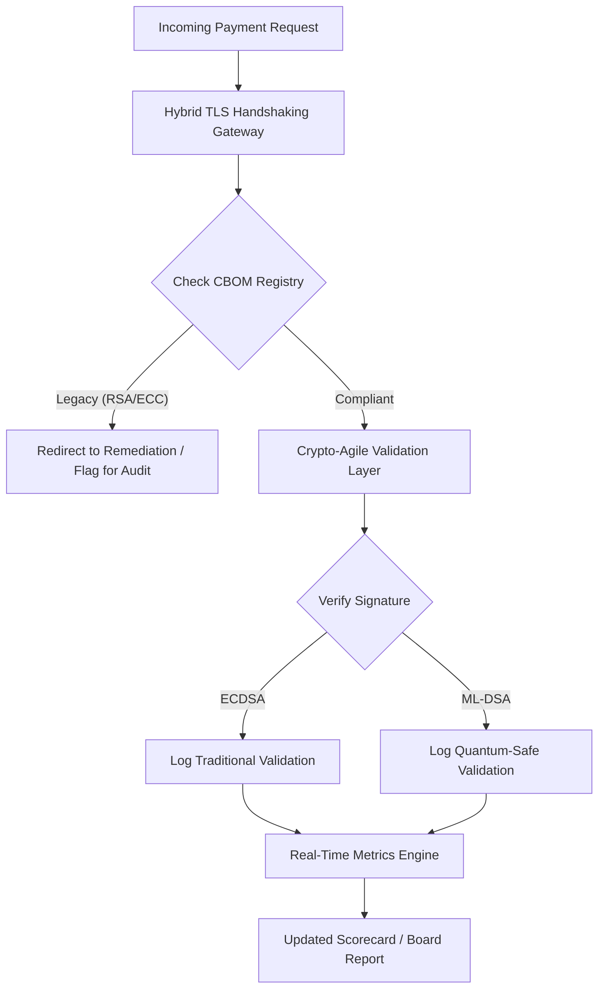

## Η Κάρτα Βαθμολογίας Μετακβαντικής Ασφάλειας 2026: Ένα Πλαίσιο Μετρικών σε Επίπεδο Διοικητικού Συμβουλίου για την Καταπιστευματική Κρυπτογραφική Ευελιξία

Η μετακβαντική ασφάλεια δεν είναι πλέον ερευνητικό έργο. Το «εποπτικό ρολόι» μετράει αντίστροφα προς τις προθεσμίες επιβολής των τελών της δεκαετίας του 2020. Η οριστικοποίηση των [NIST FIPS 203 (ML-KEM)](https://csrc.nist.gov/pubs/fips/203/final) και [NIST FIPS 204 (ML-DSA)](https://csrc.nist.gov/pubs/fips/204/final) έχει κωδικοποιήσει τα πρότυπα για την ενθυλάκωση κλειδιών και τις ψηφιακές υπογραφές.

Οι ρυθμιστικοί φορείς αναμένουν πλέον από τις τράπεζες πρώτης βαθμίδας να προχωρήσουν πέρα από τα πιλοτικά προγράμματα. Το 2026, η εστίαση έχει μετατοπιστεί στη βιομηχανοποίηση αυτών των προτύπων. Η αδυναμία επίδειξης μιας σαφούς πορείας μετάβασης συνεπάγεται σημαντικές ρυθμιστικές κυρώσεις βάσει της [Πράξης για την Ψηφιακή Επιχειρησιακή Ανθεκτικότητα (DORA)](https://eur-lex.europa.eu/eli/reg/2022/2554/oj) και πιθανή προσωπική ευθύνη για τους διευθυντές που αγνοούν την προβλέψιμη απειλή της κβαντικά υποβοηθούμενης αποκρυπτογράφησης.

## 01. Η Κβαντική Κάρτα Βαθμολογίας σε Επίπεδο Διοικητικού Συμβουλίου

Οι ακόλουθες μετρικές παρέχουν ένα τυποποιημένο πλαίσιο ώστε τα διοικητικά συμβούλια να αξιολογούν την κβαντική ετοιμότητα και την κρυπτογραφική υγεία σε όλες τις υποδομές Εμπορικής και Επενδυτικής Τραπεζικής (CIB).

### Πίνακας 1: Μετρικές και Ανοχές της Κάρτας Βαθμολογίας PQC

| Μετρική | Μαθηματικός Τύπος | Ανοχές Εγκεκριμένες από το Συμβούλιο | Κίνδυνος σε περίπτωση Υπέρβασης Ανοχής |
| ---- | ---- | ---- | ---- |
| **Ποσοστό Πληρότητας Ευρετηρίου (ICP)** | (Εντοπισμένα Κρυπτογραφικά Στοιχεία / Συνολικά Εκτιμώμενα Στοιχεία) × 100 | > 98% | Σκιώδης κρυπτογράφηση και τυφλά σημεία στις διαδρομές δεδομένων εκκαθάρισης υψηλής αξίας. |
| **Ρυθμός Έκθεσης HNDL (HER)** | (Μακρόβια Δεδομένα σε Παλαιά Κρυπτογραφία / Συνολικά Μακρόβια Δεδομένα) × 100 | < 5% | Μόνιμη παραβίαση εμπορικών μυστικών, μητρώων κρατικού χρέους και αρχείων πληρωμών χονδρικής. |
| **Ρυθμός Προόδου Μετάβασης NIST (MPR)** | (Συστήματα που εκτελούν FIPS 203/204 / Συνολικά Κρίσιμα Συστήματα) × 100 | > 60% (έως το τέλος του 2026) | Ρυθμιστική μη συμμόρφωση και αποκλεισμός από αντισυμβαλλόμενους ευθυγραμμισμένους με την G20. |
| **Δείκτης Ετοιμότητας Κρυπτογραφικής Ευελιξίας (CARI)** | (Εφαρμογές με Αφαιρετικά Κρυπτογραφικά Στρώματα / Συνολικές Βασικές Εφαρμογές) × 100 | > 85% | Σοβαρό τεχνικό χρέος και αδυναμία απόκρισης σε μελλοντικές καταργήσεις αλγορίθμων. |

## 02. Ο Κρυπτογραφικός Κατάλογος Υλικών (CBOM)

Η μετρική ICP βασικοποιείται μέσω μιας ολοκληρωμένης **Φάσης Ανακάλυψης CBOM**. Πρόκειται για μια αυτοματοποιημένη διαδικασία που εντοπίζει κάθε κρυπτογραφικό τερματικό σημείο εντός της επιχείρησης.

- **Ανακάλυψη Τερματικών Σημείων:** Σάρωση εσωτερικών και νεφικών δικτύων για ενεργές συνεδρίες TLS με σκοπό τον εντοπισμό χρήσης παλαιού RSA ή ECC.
- **Ευρετήριο Κλειδιών:** Αντιστοίχιση δημόσιων/ιδιωτικών ζευγών κλειδιών στους αντίστοιχους κατόχους τους και χαρτογράφηση των ακριβών ημερομηνιών λήξης.
- **Χαρτογράφηση Εξαρτήσεων:** Εντοπισμός βιβλιοθηκών και API τρίτων που βασίζονται σε καταργημένους αλγορίθμους.

Αυτή η φάση ανακάλυψης δημιουργεί μια ενιαία πηγή αλήθειας, επιτρέποντας στον CISO να αναφέρει για την κρυπτογραφική υγεία με την ίδια λεπτομέρεια όπως και για τη χρηματοοικονομική απόδοση.

## 03. Εξάλειψη της Έκθεσης HNDL στις Πληρωμές Χονδρικής

Οι αντίπαλοι στοχεύουν ενεργά τις πληρωμές χονδρικής και τις μακρόβιες εταιρικές βάσεις δεδομένων. Αυτές οι επιθέσεις «Harvest-Now-Decrypt-Later» (HNDL) περιλαμβάνουν την υποκλοπή και την αρχειοθέτηση της σημερινής κρυπτογραφημένης κίνησης.

Ακόμη και αν σήμερα δεν υπάρχει ένας κρυπτογραφικά σχετικός κβαντικός υπολογιστής (CRQC), τα δεδομένα που υποκλέπτονται τώρα θα είναι ευάλωτα στο μέλλον. Ο μετριασμός αυτού απαιτεί μετάβαση υψηλής προτεραιότητας των μακρόβιων δεδομένων (π.χ. αρχείων ταυτότητας, 30ετών ομολογιακών συμβάσεων και νομικών αρχείων), κάτι που μειώνει άμεσα τη μετρική HER. Η αναβάθμιση των καναλιών πληρωμών σε υβριδική κρυπτογράφηση PQC-παραδοσιακής (χρησιμοποιώντας ML-KEM παράλληλα με το X25519) παρέχει άμεση άμυνα έναντι των αρχειακών απειλών.

## 04. Λειτουργικοποίηση της Κρυπτογραφικής Ευελιξίας μέσω Καλά Σχεδιασμένων Διεπαφών

Η κρυπτογραφική ευελιξία υλοποιείται μέσω μηχανικών αφαιρέσεων. Σύγχρονες βιβλιοθήκες όπως το [KyberLib](https://sebastienrousseau.com/2026-06-12-kyberlib-post-quantum-banking-migration-standards-code-2026) καταδεικνύουν πώς οι προγραμματιστές μπορούν να υλοποιήσουν κβαντικά ασφαλή αρθρώματα χωρίς να ξαναγράψουν ολόκληρη τη στοίβα της εφαρμογής.

- **Αφαιρετικά Περιτυλίγματα (Wrappers):** Οι εφαρμογές καλούν μια γενική συνάρτηση `encrypt()` ή `sign()` αντί για ρουτίνες ειδικές για κάθε αλγόριθμο.
- **Αντικατάσταση κατά τον Χρόνο Εκτέλεσης:** Το υποκείμενο άρθρωμα μπορεί να αντικατασταθεί από ECDSA σε ML-DSA μέσω αλλαγών διαμόρφωσης αντί για πολύπλοκες αναπτύξεις κώδικα.

Αυτή η αρχιτεκτονική διασφαλίζει ότι εάν ένας συγκεκριμένος αλγόριθμος PQC παραβιαστεί στο μέλλον, ο οργανισμός μπορεί να προσαρμοστεί μέσα σε ώρες αντί για χρόνια.

## 05. Η Ροή Εργασίας Επικύρωσης Εισερχομένων Κβαντικά Ασφαλούς

Το ακόλουθο διάγραμμα απεικονίζει τον κύκλο ζωής των δεδομένων που εισέρχονται στην ασφαλή περίμετρο σε ένα κβαντικά ευέλικτο τραπεζικό περιβάλλον.

## Συμπέρασμα

Η κρυπτογραφική υποδομή μιας τράπεζας πρώτης βαθμίδας δεν αποτελεί πλέον ζήτημα του CISO. Είναι καταπιστευματική υποδομή. Τα NIST FIPS 203 και 204 ορίζουν τους αλγορίθμους· το Άρθρο 5 του DORA ορίζει την επιφάνεια λογοδοσίας· το SM&CR το αναθέτει σε ένα κατονομαζόμενο ανώτερο διοικητικό στέλεχος. Η παραπάνω κάρτα βαθμολογίας — Πληρότητα Ευρετηρίου, Έκθεση HNDL, Πρόοδος Μετάβασης, Κρυπτογραφική Ευελιξία — δίνει σε ένα διοικητικό συμβούλιο τους τέσσερις αριθμούς που χρειάζεται για να διακυβερνήσει αυτή την υποδομή χωρίς να χρειάζεται να διαβάσει τον κρυπτογραφικό κώδικα.

Ο αριθμός που έχει τη μεγαλύτερη σημασία είναι η Έκθεση HNDL. Κάθε εγγραφή κρυπτογραφημένη με παλαιά κρυπτογραφία που βρίσκεται σήμερα σε ένα αρχείο πληρωμών χονδρικής θα είναι αναγνώσιμη την ημέρα που θα κυκλοφορήσει ο πρώτος κρυπτογραφικά σχετικός κβαντικός υπολογιστής. Η αντίστροφη μέτρηση είναι σιωπηλή και ασύμμετρη: οι αμυνόμενοι μπορούν να ενεργήσουν μόνο επί των δεδομένων που κατέχουν, ενώ οι αντίπαλοι μπορούν να ενεργήσουν επί δεδομένων που έχουν ήδη διαρρεύσει πριν από χρόνια. Μια 30ετής εταιρική ομολογιακή σύμβαση κρυπτογραφημένη με RSA-2048 το 2024 είναι μια σύμβαση που χάνει την εγγύηση εμπιστευτικότητάς της την ημέρα που ένας CRQC τίθεται σε λειτουργία.

Το [KyberLib](https://sebastienrousseau.com/2026-06-12-kyberlib-post-quantum-banking-migration-standards-code-2026) και τα ομόλογά του μετατρέπουν αυτό από μια πολυετή αναδόμηση πλατφόρμας σε μια αλλαγή διαμόρφωσης. Η δουλειά του διοικητικού συμβουλίου δεν είναι να γράψει τον κώδικα. Η δουλειά του διοικητικού συμβουλίου είναι να απαιτήσει ο Δείκτης Ετοιμότητας Κρυπτογραφικής Ευελιξίας — το ποσοστό των βασικών εφαρμογών πίσω από μια αφαιρετική κρυπτογραφική διεπαφή — να ξεπεράσει το 85 % εντός δώδεκα μηνών, και να διαβάζει την τριμηνιαία κάρτα βαθμολογίας.
