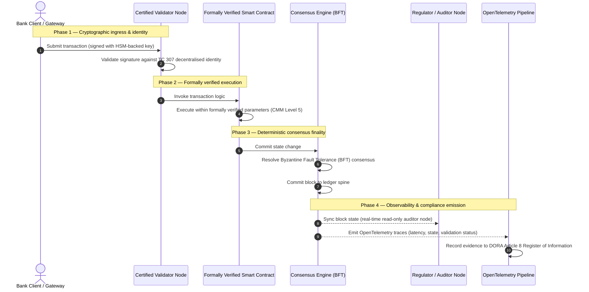

## Από τα Στοιχεία στην Αλήθεια: Γιατί τα Πιστοποιημένα Blockchain θα Καθορίσουν την Επόμενη Εποχή της Τραπεζικής Εμπιστοσύνης

## Επιτελική Σύνοψη & Στρατηγικό Πλαίσιο (TL;DR)

Η χονδρική τραπεζική και οι παγκόσμιες συναλλαγές το 2026 βρίσκονται σε ένα ιστορικό σημείο καμπής. Καθώς οι χρηματοπιστωτικές υπηρεσίες μεταβαίνουν σε εγγενώς ψηφιακά δίκτυα εκκαθάρισης πραγματικού χρόνου, και καθώς η τεχνητή νοημοσύνη εισάγει πιθανοτικό μη-ντετερμινισμό, τα παραδοσιακά αναλογικά, αναδρομικά μοντέλα διασφάλισης (όπως οι στατικοί έλεγχοι βασισμένοι σε οντότητες) αδυνατούν να ανταποκριθούν στις σύγχρονες απαιτήσεις διαχείρισης κινδύνου και καταπιστευτικής ευθύνης.

Η Τεχνική Επιτροπή ISO/IEC 307 (TC 307) έχει θεσπίσει μια τυποποιημένη βάση για τις τεχνολογίες κατανεμημένου καθολικού. Ωστόσο, η πραγματική εταιρική και θεσμική υιοθέτηση απαιτεί μια μετάβαση από την περιγραφική καθοδήγηση σε μια συνταγογραφική, ανεξάρτητα πιστοποιήσιμη διασφάλιση blockchain. Βαθμολογώντας τη διακυβέρνηση του καθολικού, την ακεραιότητα της συναίνεσης, την ασφάλεια των έξυπνων συμβολαίων και την κρυπτογραφική ευελιξία έναντι ενός αυστηρού Μοντέλου Ωριμότητας Ικανοτήτων (CMM) 5 επιπέδων, οι τράπεζες μπορούν να μεταβούν από αποσπασματικές, εξαρτώμενες από τον προμηθευτή υποθέσεις σε πιστοποιήσιμη, ελέγξιμη από το διοικητικό συμβούλιο οικονομική αλήθεια.

## Βασικά Συμπεράσματα

* **Το Καταπιστευτικό Κενό Τριβής**: Επί του παρόντος μπορούμε να πιστοποιήσουμε την τράπεζα (Basel III), το cloud (ISO 27001) και τα συστήματα διακυβέρνησης ΤΝ (ISO 42001), αλλά δεν μπορούμε ακόμη να πιστοποιήσουμε το κατανεμημένο καθολικό που ολοένα και περισσότερο καθορίζει τι είναι αληθές. Αυτή η ασυμμετρία αποτελεί μια σημαντική λειτουργική ευπάθεια.
* **Το DORA Επιβάλλει Άμεση Καταπιστευτική Ευθύνη**: Σύμφωνα με το Άρθρο 5 του DORA, τα διοικητικά συμβούλια των τραπεζών φέρουν άμεση, μη μεταβιβάσιμη προσωπική ευθύνη για τη λειτουργική ανθεκτικότητα όλων των αναπτύξεων τρίτων μερών και καθολικών, με αυστηρές προσωπικές κυρώσεις SM&CR για τις αποτυχίες.
* **Η Ραχοκοκαλιά Ελέγχου ΤΝ**: Ενώ η μηχανική μάθηση εισάγει μη αναπαραγώγιμα, πιθανοτικά αποτελέσματα, ένα πιστοποιημένο blockchain παρέχει ντετερμινιστική καταγραφή κατάστασης. Η καταγραφή των εκδόσεων μοντέλων, των εισόδων και των αποφάσεων επικύρωσης on-chain ικανοποιεί το ISO 42001 και τα πρότυπα Διαχείρισης Κινδύνου Μοντέλων.
* **Ο Δείκτης Πιστοποιημένου Blockchain**: Αυτός ο δείκτης τυποποιεί τη διακυβέρνηση, τη συναίνεση, τα έξυπνα συμβόλαια και την παρατηρησιμότητα σε μια επαληθεύσιμη, έτοιμη για έλεγχο κάρτα βαθμολογίας σε κλίμακα CMM από 0 έως 5, μεταφράζοντας τις μηχανικές μετρικές σε εγκεκριμένες από το διοικητικό συμβούλιο Δηλώσεις Διάθεσης Ανάληψης Κινδύνου.

## 01. Το Καταπιστευτικό Κενό Τριβής στην Ψηφιακή Τραπεζική

Στην κλασική τραπεζική, η εμπιστοσύνη είναι σχεσιακή, θεσμική και αναδρομική. Εξαρτάται από ανεξάρτητους ελεγκτές τρίτων μερών που εξετάζουν την οικονομική κατάσταση σε στατικά χρονικά σημεία, συμφιλιώνοντας τις αποκλίσεις μεταξύ διμερών απομονωμένων καθολικών. Στις αγορές πραγματικού χρόνου, βασισμένες σε API του 2026, αυτό το μοντέλο εισάγει απαγορευτικές καθυστερήσεις και δομικούς κινδύνους.

Όταν οι συναλλαγές διακανονίζονται άμεσα, οι ενδοημερήσιες δεξαμενές ρευστότητας διαχειρίζονται δυναμικά από πύλες API και η κυριότητα των περιουσιακών στοιχείων tokenίζεται σε κοινόχρηστα καθολικά, οι αναδρομικοί έλεγχοι γίνονται εγκληματολογικές ασκήσεις παρά προληπτικοί έλεγχοι. Οι καταπιστευματούχοι δεν μπορούν πλέον να βασίζονται αποκλειστικά στην πιστοποίηση της εταιρικής οντότητας. Πρέπει να πιστοποιήσουν το ίδιο το ψηφιακό υπόστρωμα.

Επί του παρόντος, οι τράπεζες λειτουργούν υπό μια κραυγαλέα αρχιτεκτονική ασυμμετρία:

1. **Πιστοποιημένη Υποδομή Cloud**: Οι κόμβοι υλικού, τα εικονικοποιημένα κοντέινερ και τα φυσικά κέντρα δεδομένων επικυρώνονται έναντι των ελέγχων ISO/IEC 27001 και SOC 2 Type II.
2. **Πιστοποιημένες Διαδικασίες Διαχείρισης**: Οι πολιτικές λειτουργικού κινδύνου, τα σχέδια επιχειρησιακής συνέχειας και οι αλγοριθμικές αναπτύξεις διέπονται από αυστηρά πλαίσια κινδύνου.
3. **Μη Πιστοποιημένες Μηχανές Καθολικού**: Οι βασικοί μηχανισμοί κατανεμημένης συναίνεσης, οι αλυσίδες εφοδιασμού κόμβων επικύρωσης, τα όρια των έξυπνων συμβολαίων και τα μοντέλα διακυβέρνησης δικτύου αφήνονται σε μη πιστοποιημένες, προσαρμοσμένες ή ειδικές για κοινοπραξίες υποθέσεις.

Αυτή η ασυμμετρία αποτελεί ένα σημαντικό σημείο αποτυχίας. Μια τράπεζα μπορεί να εκτελεί μια επικυρωμένη εφαρμογή μέσα σε ένα ασφαλές, πιστοποιημένο κατά ISO 27001 κοντέινερ cloud, αλλά αν αυτό το κοντέινερ γράφει σε ένα κατανεμημένο καθολικό με συγκεντρωτικό έλεγχο επικυρωτή, ευάλωτες παραμέτρους συναίνεσης ή μη ελεγμένα έξυπνα συμβόλαια, η ακεραιότητα της συναλλαγής διακυβεύεται. Για να γεφυρωθεί αυτό το κενό, η ίδια η μηχανή του καθολικού πρέπει να γίνει ένα πιστοποιήσιμο αντικείμενο διασφάλισης.

## 02. Η Βάση Τυποποίησης ISO/IEC TC 307

Το θεμελιώδες έργο που απαιτείται για την τυποποίηση των κατανεμημένων καθολικών θεσπίζεται από την Τεχνική Επιτροπή ISO/IEC 307 (TC 307) (Τεχνολογίες blockchain και κατανεμημένου καθολικού). Αντί να αντιμετωπίζει το blockchain ως ένα απομονωμένο τεχνικό πρωτόκολλο, η TC 307 το προσεγγίζει ως υποδομή θεσμικής εμπιστοσύνης, οργανώνοντας το έργο της γύρω από πέντε βασικούς πυλώνες:

1. **Ταξινομία και Ορολογία (ISO 22739)**: Θεσπίζει μια κοινή ονοματολογία, διασφαλίζοντας συνεπείς νομικούς και λειτουργικούς ορισμούς σε διαφορετικές δικαιοδοσίες, χρηματοπιστωτικά σχήματα και ιδρύματα.
2. **Αρχιτεκτονική Αναφοράς (ISO/TR 23245)**: Ορίζει τα όρια, τα επίπεδα, τις ροές δεδομένων και τα λειτουργικά στοιχεία ενός συμμορφούμενου συστήματος κατανεμημένου καθολικού.
3. **Ασφάλεια, Ιδιωτικότητα και Έξυπνα Συμβόλαια (ISO/TR 23244 / ISO 23613)**: Θεσπίζει βασικές κατευθυντήριες γραμμές ασφάλειας για συστήματα ψηφιακών περιουσιακών στοιχείων και περιγράφει τις βέλτιστες πρακτικές για τον μετριασμό ευπαθειών έξυπνων συμβολαίων και τη διακυβέρνηση του κύκλου ζωής τους.
4. **Πλαίσια Διαλειτουργικότητας**: Αντιμετωπίζει τους μηχανισμούς ανταλλαγής δεδομένων και περιουσιακών στοιχείων μεταξύ ετερογενών δικτύων καθολικού, αποτρέποντας τον σχηματισμό απομονωμένων tokenised σιλό.
5. **Αποκεντρωμένη Ταυτότητα και Άγκυρες Εμπιστοσύνης**: Ενσωματώνει κρυπτογραφικά αναγνωριστικά βασισμένα σε καθολικό με τυπικές υποδομές δημόσιου κλειδιού (PKI) και εξουσιοδοτημένα από το κράτος μητρώα.

Συλλογικά, η TC 307 σηματοδοτεί τη μετάβαση της DLT από μια προσαρμοσμένη μηχανική επιλογή σε μια τυποποιημένη αρχιτεκτονική πειθαρχία. Ωστόσο, η TC 307 παραμένει κατά κύριο λόγο περιγραφική. Ορίζει το πώς μοιάζει το καλό (καθοδήγηση), αλλά δεν παρέχει το συνταγογραφικό πρωτόκολλο επαλήθευσης (διασφάλιση) που απαιτούν οι υπεύθυνοι κινδύνου και οι εποπτικές αρχές για να εγκρίνουν τις παραγωγικές αναπτύξεις κρίσιμων ή σημαντικών λειτουργιών (CIFs).

## 03. Καθοδήγηση έναντι Διασφάλισης: Η Καταπιστευτική Διάκριση

Οι συμμετέχοντες στις χρηματοπιστωτικές αγορές δεν αναπτύσσουν τεχνολογία επειδή είναι καινοτόμος ή κομψή· την αναπτύσσουν όταν μπορεί να διακυβερνηθεί, να ελεγχθεί, να υπερασπιστεί και να συμφιλιωθεί με τις απαιτήσεις κεφαλαιακών αποθεματικών. Γι' αυτό η τυποποίηση στην τραπεζική αναλύεται φυσικά σε δύο επίπεδα:

* **Καθοδήγηση (Το Πλαίσιο)**: Περιγράφει τις βέλτιστες πρακτικές, τους στόχους αναφοράς και τις αρχιτεκτονικές κατευθυντήριες γραμμές (π.χ. ISO/IEC TC 307, πλαίσια NIST).
* **Διασφάλιση (Η Απόδειξη)**: Παρέχει ανεξάρτητα, συνεχή και επαληθεύσιμα από τρίτους στοιχεία ότι το πλαίσιο έχει υλοποιηθεί και λειτουργεί όπως σχεδιάστηκε (π.χ. πιστοποίηση ISO 27001, έλεγχοι SOC 2, κανονιστικές εξετάσεις).

Το να βασίζεσαι σε μη πιστοποιημένη συναίνεση καθολικού ενώ πιστοποιείς την υποδομή cloud αποτελεί ένα κρίσιμο κανονιστικό κενό. Ένα blockchain που είναι «αμετάβλητο» δεν είναι κατ' ανάγκη «θεσμικά έμπιστο». Η αμεταβλητότητα εγγυάται μόνο ότι τα δεδομένα που εισήχθησαν παραμένουν αμετάβλητα· δεν επαληθεύει ότι οι κόμβοι επικύρωσης είναι ασφαλείς, ότι το πρωτόκολλο συναίνεσης είναι ανθεκτικό σε συμπαιγνία, ότι η λογική των έξυπνων συμβολαίων είναι μαθηματικά ορθή ή ότι η διαχείριση κρυπτογραφικών κλειδιών συμμορφώνεται με τις μετακβαντικές εντολές.

Για να κλείσει αυτό το κενό, ο Δείκτης Πιστοποιημένου Blockchain 2026 τυποποιεί αυτές τις απαιτήσεις σε ένα ποσοτικοποιήσιμο Μοντέλο Ωριμότητας Ικανοτήτων (CMM) αντιστοιχισμένο στους παγκόσμιους τραπεζικούς κανονισμούς.

## 04. Ο Δείκτης Πιστοποιημένου Blockchain 2026

Για να δώσει τη δυνατότητα στην ανώτατη διοίκηση να αξιολογήσει και να πιστοποιήσει τις πλατφόρμες καθολικού της, αυτός ο δείκτης δομεί την υποδομή κατανεμημένου καθολικού σε πέντε ελέγξιμα λειτουργικά επίπεδα, βαθμολογημένα σε κλίμακα CMM από 0 έως 5.

## Πίνακας 1: Η Αρχιτεκτονική του Δείκτη Πιστοποιημένου Blockchain

| Επίπεδο Δείκτη | Επίπεδο Ωριμότητας Ικανοτήτων (CMM) | Τεχνική και Λειτουργική Μετρική | Αναφορά Κανονιστικού / Καταπιστευτικού Ελέγχου |
| ---- | ---- | ---- | ---- |
| **Διακυβέρνηση Καθολικού** | **Επίπεδο 0**: Ad-hoc κοινοπραξία**Επίπεδο 3**: Αυτοματοποιημένος έλεγχος & εναλλαγή επικυρωτών**Επίπεδο 5**: Αποκεντρωμένη, πολυμερής κρυπτογραφική αγκύρωση ταυτότητας | % κόμβων επικύρωσης που λειτουργούν από ελεγμένες χρηματοπιστωτικές οντότητες· μέσος χρόνος επίλυσης διαφορών επικυρωτών· γεωγραφική κατανομή κόμβων | **DORA Άρθρο 5** (Διακυβέρνηση και Οργάνωση)· **CPMI-IOSCO PFMI Αρχή 2** (Διακυβέρνηση) & **Αρχή 3** (Πλαίσιο για τη συνολική διαχείριση κινδύνων) |
| **Ακεραιότητα Συναίνεσης** | **Επίπεδο 0**: Μονός κόμβος ή αδιαφανές POW**Επίπεδο 3**: Ελεγμένο BFT με ντετερμινιστική οριστικότητα**Επίπεδο 5**: Πολυδικαιοδοτική, τυπικά επαληθευμένη συναίνεση με συνεχή παρακολούθηση καθυστέρησης | Μέγιστη ανεκτή καθυστέρηση συναίνεσης· κατώφλι αντοχής σε συμπαιγνία· SLA διαθεσιμότητας υπό προσομοιωμένη κατάτμηση κόμβων | **DORA Άρθρο 6** (Πλαίσιο Διαχείρισης Κινδύνου ΤΠΕ)· **CPMI-IOSCO PFMI Αρχή 8** (Οριστικότητα Διακανονισμού) |
| **Ταυτότητα & Κρυπτογραφία** | **Επίπεδο 0**: Αδύναμα κλειδιά RSA / ECDSA**Επίπεδο 3**: Multi-sig με διαχείριση κλειδιών υποστηριζόμενη από HSM**Επίπεδο 5**: Κβαντικά ασφαλή υβριδικά κλειδιά (FIPS 203 ML-KEM) και πύλες ιδιωτικότητας μηδενικής γνώσης | % συναλλαγών καθολικού υπογεγραμμένων με κλειδιά υποστηριζόμενα από HSM· βαθμολογία ετοιμότητας μετάβασης PQC· καθυστέρηση απόδειξης ZK | **NIST FIPS 203 / 204**· **ISO/IEC 27001** (Διαχείριση Ασφάλειας Πληροφοριών) |
| **Διασφάλιση Έξυπνων Συμβολαίων** | **Επίπεδο 0**: Μη ελεγμένα scripts solidity**Επίπεδο 3**: Αυτοματοποιημένη επικύρωση compiler & εξωτερικός έλεγχος**Επίπεδο 5**: Τυπικά επαληθευμένα, αμετάβλητα έξυπνα συμβόλαια με αναβαθμίσεις circuit-breaker | % έξυπνων συμβολαίων με μαθηματική τυπική επαλήθευση· αριθμός προειδοποιήσεων compiler· κάλυψη σάρωσης ευπαθειών | **Κατευθυντήριες Γραμμές EBA για τις Ρυθμίσεις Εξωτερικής Ανάθεσης** (Παράγραφοι 81, 113-117)· **DORA Άρθρο 30** (Ελάχιστες Συμβατικές Ρήτρες) |
| **Έλεγχος & Παρατηρησιμότητα** | **Επίπεδο 0**: Χειροκίνητη εξαγωγή αρχείων καταγραφής**Επίπεδο 3**: Δομημένα ίχνη OTel & κόμβοι ελεγκτών μόνο για ανάγνωση**Επίπεδο 5**: Αυτοματοποιημένη, συνεχής συμφιλίωση με το μητρώο του Άρθρου 8 | % συναλλαγών που καλύπτονται από ίχνη OpenTelemetry· καθυστέρηση από την υποβολή μπλοκ καθολικού έως τον συγχρονισμό κόμβου ελεγκτή | **BCBS 239** (Συγκέντρωση Δεδομένων Κινδύνου)· **DORA Άρθρο 8** (Μητρώο Πληροφοριών / Σχήματα ITS) |

## Πίνακας 2: Βασικά Σήματα Εμπιστοσύνης Αντιστοιχισμένα στα Παγκόσμια Τραπεζικά Πρότυπα

| Σήμα / Benchmark | Μετρική | Επίπτωση στις Τραπεζικές Πλατφόρμες | Κανονιστική Πηγή |
| ---- | ---- | ---- | ---- |
| **Πρόοδος ISO/IEC TC 307** | Μετάβαση από τεχνικές εκθέσεις ISO/TR σε τυπικά σχήματα πιστοποίησης | Θεσπίζει το πρώτο τυποποιημένο πλαίσιο για την πιστοποίηση μηχανών κατανεμημένου καθολικού | **ISO/IEC JTC 1 / SC 44** (Τεχνολογίες Κατανεμημένου Καθολικού) |
| **Φάση Πρωτοτύπου Project Agorá** | 40+ συμμετέχουσες εμπορικές τράπεζες· δοκιμή ενοποιημένου καθολικού tokenised καταθέσεων | Μετατόπιση της διασυνοριακής εκκαθάρισης από τη μηνυματοδότηση (SWIFT) σε ατομικό tokenised διακανονισμό | **Bank for International Settlements (BIS) Innovation Hub** |
| **Έλεγχος Τρίτων DORA Άρθρο 30** | 100% των παρόχων κόμβων και φιλοξενητών υποδομής ελεγμένοι έναντι κριτηρίων ασφάλειας | Εξαλείφει τους «κόμβους σκιώδους επικύρωσης»· επιβάλλει πλήρη διαφάνεια της αλυσίδας εφοδιασμού | **European Supervisory Authorities (ESA)** |
| **ISO/IEC 42001 (Διακυβέρνηση ΤΝ)** | Κρυπτογραφικά αμετάβλητα αρχεία μοντέλων ΤΝ και εκπαίδευσης on-chain | Χρησιμοποιεί το blockchain ως το αμετάβλητο αποδεικτικό καθολικό («ραχοκοκαλιά ελέγχου») για τη μηχανική μάθηση | **ISO/IEC 42001:2023** (Τεχνολογία πληροφοριών — Τεχνητή νοημοσύνη) |
| **Κεφαλαιακή Επάρκεια Basel III** | Μείωση των κεφαλαιακών αποθεμάτων λειτουργικού κινδύνου βάσει τεκμηριωμένης μείωσης πολυπλοκότητας | Τα τυποποιημένα πλαίσια λειτουργικού κινδύνου πιστώνουν άμεσα την επαληθευμένη ανθεκτικότητα του καθολικού | **Basel Committee on Banking Supervision (BCBS)** |

## 05. Η «Ραχοκοκαλιά Ελέγχου» ΤΝ: Πιθανοτική Νοημοσύνη σε Ντετερμινιστική Υποδομή

Ένας από τους πιο ισχυρούς στρατηγικούς ρόλους για ένα πιστοποιημένο blockchain το 2026 είναι να λειτουργεί ως **«Ραχοκοκαλιά Ελέγχου»** για τις αναπτύξεις τεχνητής νοημοσύνης. Τα σύγχρονα χρηματοπιστωτικά συστήματα είναι ολοένα και πιο πιθανοτικά. Η πιστοληπτική βαθμολόγηση, η ανίχνευση απάτης πραγματικού χρόνου, οι αλγοριθμικές συναλλαγές και οι αυτόνομες αλληλεπιδράσεις με τους πελάτες καθοδηγούνται από μοντέλα μηχανικής μάθησης που εξελίσσονται, παρεκκλίνουν και προσαρμόζονται με την πάροδο του χρόνου. Αυτά τα μοντέλα είναι μη ντετερμινιστικά: δεδομένης της ίδιας εισόδου σε δύο διαφορετικές χρονικές στιγμές, ενδέχεται να παράγουν διαφορετικά αποτελέσματα λόγω δυναμικών βαρών και συνεχούς εκπαίδευσης.

Αυτός ο μη-ντετερμινισμός εισάγει μια βαθιά πρόκληση διακυβέρνησης υπό τα πρότυπα **ISO/IEC 42001 (Διακυβέρνηση ΤΝ)** και **Διαχείρισης Κινδύνου Μοντέλων (MRM)** (όπως το **US Federal Reserve SR 11-7** και το **UK PRA SS1/23**): *Πώς ελέγχετε, εξηγείτε και υπερασπίζεστε αποφάσεις που δεν είναι αυστηρά αναπαραγώγιμες;*

Ένα πιστοποιημένο κατανεμημένο καθολικό παρέχει το ντετερμινιστικό αντίβαρο. Ενώ τα μοντέλα ΤΝ λειτουργούν πιθανοτικά, το πιστοποιημένο blockchain καταγράφει τις παραμέτρους τους ντετερμινιστικά, θεσπίζοντας μια αναλλοίωτη αποδεικτική ραχοκοκαλιά:

* **Έκδοση Μοντέλου και Αγκύρωση Βαρών**: Κάθε αναπτυγμένη έκδοση μοντέλου, τα σχετικά βάρη της και τα αθροίσματα ελέγχου των δεδομένων εκπαίδευσής της κατακερματίζονται και γράφονται στο καθολικό κατά τον χρόνο κατασκευής (build-time), ικανοποιώντας τις απαιτήσεις αλυσίδας εφοδιασμού **SLSA Level 3**.
* **Καταγραφή Συμφραζόμενης Εισόδου**: Όταν ένα μοντέλο ΤΝ εκτελεί μια κρίσιμη απόφαση (π.χ. έγκριση δανείου ή επισήμανση συναλλαγής), οι ακριβείς συμφραζόμενες είσοδοι και τα hashes του μοντέλου γράφονται στο καθολικό, δημιουργώντας ένα ιστορικό με εμφανή σημάδια παραποίησης.
* **Ελεγξιμότητα χωρίς Πρόσβαση στον Κώδικα**: Αν μια ρυθμιστική αρχή ρωτήσει, «Γιατί το μοντέλο σας απέρριψε αυτή την αίτηση πίστωσης στις 3 Ιουνίου;», η τράπεζα δεν χρειάζεται να εκθέσει ιδιόκτητο κώδικα ή να επιχειρήσει να αναδημιουργήσει την ακριβή κατάσταση του μοντέλου. Παρουσιάζει την κρυπτογραφικά υπογεγραμμένη, on-chain εγγραφή καθολικού των εισόδων, των βαρών και της κατάστασης επικύρωσης.

Αγκυρώνοντας τις πιθανοτικές αποφάσεις των μοντέλων μηχανικής μάθησης στη ντετερμινιστική συναίνεση ενός πιστοποιημένου blockchain, το ίδρυμα δημιουργεί ένα υπερασπίσιμο, ανακατασκευάσιμο και ανεξάρτητα επαληθεύσιμο χρονοδιάγραμμα αυτοματοποιημένων ενεργειών.

## 06. Οπτικοποίηση της Διοχέτευσης Πιστοποιημένης Συναίνεσης-προς-Έλεγχο

Το ακόλουθο διάγραμμα ακολουθίας απεικονίζει τον κύκλο ζωής μιας συναλλαγής που διέρχεται από μια πιστοποιημένη πλατφόρμα blockchain, καταδεικνύοντας πώς οι πύλες επικύρωσης, η ακεραιότητα συναίνεσης, η εκτέλεση έξυπνων συμβολαίων και η εκπομπή τηλεμετρίας αλληλοσυνδέονται για να παραγάγουν έτοιμα για το διοικητικό συμβούλιο κανονιστικά στοιχεία:

Η κρίσιμη διαδρομή για αυτή τη συναλλακτική ακολουθία απαιτεί κάθε βήμα επικύρωσης, εκτέλεσης και συναίνεσης να είναι κρυπτογραφικά υπογεγραμμένο, διασφαλίζοντας την προέλευση από άκρο σε άκρο. Ο κόμβος ελεγκτή της ρυθμιστικής αρχής συγχρονίζει την κατάσταση των μπλοκ σε πραγματικό χρόνο, εξαλείφοντας την ανάγκη για αναδρομική, χειροκίνητη οικονομική συμφιλίωση.

## 07. Το Εγχειρίδιο Διοικητικού Συμβουλίου για Ανώτερα Στελέχη

Για να πλοηγηθούν επιτυχώς στη μετάβαση από την οργανωσιακή εμπιστοσύνη στην υποδομική εμπιστοσύνη, τα διοικητικά στελέχη και οι ανώτεροι διαχειριστές των τραπεζών πρέπει να εκτελέσουν άμεσα τέσσερις βασικές οδηγίες:

1. **Επιβολή Ελέγχων Καθολικού στη Διαχείριση Επιχειρησιακού Κινδύνου (ERM)**: Επιβάλετε μια πολιτική σύμφωνα με την οποία καμία πλατφόρμα κατανεμημένου καθολικού—είτε ιδιωτική, δημόσια ή βασισμένη σε κοινοπραξία—δεν μπορεί να αναπτυχθεί για κρίσιμες ή σημαντικές λειτουργίες (CIFs) εκτός εάν έχει ελεγχθεί έναντι της 5-επίπεδης **Αρχιτεκτονικής του Δείκτη Πιστοποιημένου Blockchain** (CMM Επίπεδο 3 κατ' ελάχιστον).
2. **Ενσωμάτωση των Blockchain ως Αποδεικτική Ραχοκοκαλιά ΤΝ κατά ISO 42001**: Δώστε εντολή στον Επικεφαλής Υπεύθυνο Κινδύνου και στον Επικεφαλής Αρχιτέκτονα ΤΝ να ενσωματώσουν όλα τα μοντέλα μηχανικής μάθησης υψηλού αντικτύπου με ένα πιστοποιημένο blockchain, δημιουργώντας ένα ελεγκτικό καθολικό με εμφανή σημάδια παραποίησης για τις εκδόσεις μοντέλων, τα βάρη, τις εισόδους και τις αποφάσεις.
3. **Έλεγχος της Αλυσίδας Εφοδιασμού Κόμβων Επικύρωσης (DORA Άρθρο 30)**: Απαιτήστε από το τμήμα προμηθειών να ελέγξει όλες τις τρίτες οντότητες που φιλοξενούν κόμβους επικύρωσης ή διαχειρίζονται τη φιλοξενία cloud για δίκτυα DLT, επιβάλλοντας συμμόρφωση με τα ίδια πρότυπα κυβερνοασφάλειας και λειτουργικής ανθεκτικότητας που εφαρμόζονται στους εσωτερικούς κόμβους cloud της τράπεζας.
4. **Ευθυγράμμιση των Αρχιτεκτονικών Καθολικού με τα CPMI-IOSCO και BCBS 239**: Δώστε εντολή στην ομάδα μηχανικής πλατφόρμας να ευθυγραμμίσει την τηλεμετρία εξόδου του καθολικού απευθείας με τις απαιτήσεις αναφοράς δεδομένων **BCBS 239** και διασφαλίστε ότι οι παράμετροι συναίνεσης και οριστικότητας διακανονισμού συμμορφώνονται αυστηρά με τις **Αρχές 8 και 9 των CPMI-IOSCO**.

## 08. Συχνές Ερωτήσεις

**Είναι το ISO/IEC TC 307 πρότυπο πιστοποίησης;**
Όχι. Το ISO/IEC TC 307 είναι μια τεχνική επιτροπή που θεσπίζει ορολογία, αρχιτεκτονικές αναφοράς και κατευθυντήριες γραμμές ασφάλειας. Ενώ ορίζει το «πώς μοιάζει το καλό» (καθοδήγηση), ο κλάδος πρέπει να λειτουργικοποιήσει αυτά τα έγγραφα σε τυπικά, ελέγξιμα σχήματα πιστοποίησης (διασφάλιση) για να ικανοποιήσει τις τραπεζικές εποπτικές αρχές.

**Πώς υποστηρίζει ένα πιστοποιημένο blockchain τη συμμόρφωση με το DORA;**
Σύμφωνα με το Άρθρο 5 του DORA, τα διοικητικά συμβούλια των τραπεζών φέρουν άμεση, προσωπική ευθύνη για την τεχνολογική ανθεκτικότητα. Ένα πιστοποιημένο blockchain παρέχει επαληθεύσιμα, κρυπτογραφικά στοιχεία ακεραιότητας συναίνεσης, ελέγχου της αλυσίδας εφοδιασμού επικυρωτών και ασφάλειας έξυπνων συμβολαίων, δίνοντας στα μέλη του συμβουλίου τα τεκμηριώσιμα «εύλογα βήματα» που απαιτούνται για την υπεράσπιση έναντι αξιώσεων προσωπικής ευθύνης SM&CR.

Ποια είναι η διαφορά μεταξύ ενός παραδοσιακού ελέγχου καθολικού και ενός ελέγχου πιστοποιημένου blockchain;
Ένας παραδοσιακός έλεγχος είναι αναδρομικός, επαληθεύοντας χειροκίνητες καταχωρήσεις και στατικά αρχεία αφού οι συναλλαγές έχουν εκκαθαριστεί. Ένας έλεγχος πιστοποιημένου blockchain είναι συνεχής και σε πραγματικό χρόνο· οι κόμβοι επικύρωσης, η μηχανή συναίνεσης BFT και τα τυπικά επαληθευμένα έξυπνα συμβόλαια είναι πιστοποιημένα να εκτελούν συναλλαγές ντετερμινιστικά, εκπέμποντας δομημένη τηλεμετρία (OpenTelemetry) που επικυρώνει συνεχώς την υγεία του συστήματος.

Μπορούν τα δημόσια blockchain να πιστοποιηθούν για τραπεζική χρήση;
Στις περισσότερες δικαιοδοσίες, τα καθαρά permissionless δημόσια blockchain αποτυγχάνουν να ικανοποιήσουν τους τραπεζικούς κανονισμούς λόγω της έλλειψης επαλήθευσης ταυτότητας επικυρωτών, του απρόβλεπτου κόστους gas/συναλλαγών και της μη ντετερμινιστικής οριστικότητας (π.χ. πιθανοτικά forks proof-of-work/stake). Τα πιστοποιημένα blockchain στην τραπεζική χρησιμοποιούν τυπικά επιχειρησιακές permissioned ή αυστηρά ρυθμιζόμενες δημόσιες-υβριδικές αρχιτεκτονικές όπου οι διαχειριστές κόμβων επικύρωσης είναι ταυτοποιημένες και ελεγμένες χρηματοπιστωτικές οντότητες.

## 09. Αναφορές

* Basel Committee on Banking Supervision (BCBS), 2013. *Principles for effective risk data aggregation and reporting (BCBS 239)*. Basel: Bank for International Settlements. Available at: [https://www.bis.org/publ/bcbs239.pdf](https://www.bis.org/publ/bcbs239.pdf).
* Committee on Payments and Market Infrastructures and Technical Committee of the International Organization of Securities Commissions (CPMI-IOSCO), 2012. *Principles for financial market infrastructures*. Basel: Bank for International Settlements. Available at: [https://www.bis.org/cpmi/publ/d101.htm](https://www.bis.org/cpmi/publ/d101.htm).
* European Banking Authority (EBA), 2019. *EBA/GL/2019/02 — Guidelines on outsourcing arrangements*. Paris: EBA. Available at: [https://www.eba.europa.eu/regulation-and-policy/internal-governance/guidelines-on-outsourcing-arrangements](https://www.eba.europa.eu/regulation-and-policy/internal-governance/guidelines-on-outsourcing-arrangements).
* European Parliament and Council of the European Union, 2022. *Regulation (EU) 2022/2554 on digital operational resilience for the financial sector (DORA)*. Brussels: Official Journal of the European Union. Available at: [https://eur-lex.europa.eu/legal-content/EN/TXT/?uri=CELEX%3A32022R2554](https://eur-lex.europa.eu/legal-content/EN/TXT/?uri=CELEX%3A32022R2554).
* ISO/IEC JTC 1/SC 42, 2023. *ISO/IEC 42001:2023 — Information technology — Artificial intelligence — Management system*. Geneva: International Organization for Standardization. Available at: [https://www.iso.org/standard/81230.html](https://www.iso.org/standard/81230.html).
* ISO/IEC Technical Committee 307, 2020. *ISO/IEC 22739:2020 — Blockchain and distributed ledger technologies — Vocabulary*. Geneva: International Organization for Standardization. Available at: [https://www.iso.org/standard/73771.html](https://www.iso.org/standard/73771.html).
* National Institute of Standards and Technology (NIST), 2026. *First Three Finalized Post-Quantum Encryption Standards (FIPS 203, 204, and 205)*. Gaithersburg: U.S. Department of Commerce. Available at: [https://www.nist.gov/news-events/news/2024/08/nist-releases-first-3-finalized-post-quantum-encryption-standards](https://www.nist.gov/news-events/news/2024/08/nist-releases-first-3-finalized-post-quantum-encryption-standards).
