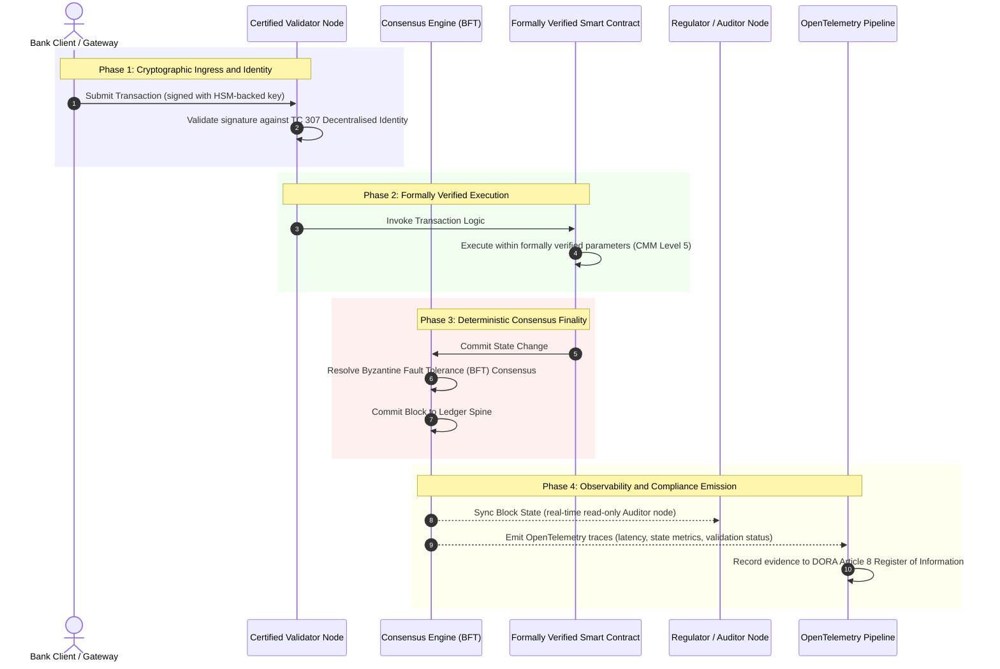

# From Evidence to Truth: Why Certified Blockchains Will Define the Next Era of Banking Trust

**Το αμετάβλητο δεν ταυτίζεται με το αξιόπιστο.** Καθώς η χονδρική τραπεζική μεταβαίνει στον διακανονισμό σε πραγματικό χρόνο και στην πιθανοτική ΤΝ, το καθολικό που κρίνει τι είναι αληθές έχει γίνει το ένα στρώμα που οι τράπεζες ακόμη δεν μπορούν να πιστοποιήσουν. Πιστοποιούν την οντότητα βάσει Basel III, το cloud βάσει ISO 27001 και την ΤΝ τους βάσει ISO 42001, αλλά το κατανεμημένο καθολικό, η διακυβέρνησή του, η συναίνεση, η κρυπτογραφία και τα έξυπνα συμβόλαιά του, αφήνονται σε παραδοχές εξαρτώμενες από τον προμηθευτή. Αυτή η αναφορά υποστηρίζει ότι το κλείσιμο αυτού του καταπιστευτικού κενού απαιτεί τη μετάβαση από την καθοδήγηση του ISO/IEC TC 307 σε ρητά προδιαγεγραμμένη διασφάλιση: τη βαθμολόγηση του καθολικού έναντι ενός 5βάθμιου Δείκτη Πιστοποιημένου Blockchain που μετατρέπει τις τεχνικές μετρικές σε αλήθεια ελέγξιμη από το συμβούλιο και υπερασπίσιμη κατά DORA.

<!-- lead-start -->
<aside class="post-lead" aria-label="Περίληψη άρθρου">

<strong>Με λίγα λόγια.</strong> Οι τράπεζες πιστοποιούν την οντότητα, το cloud και την ΤΝ τους, αλλά όχι το καθολικό που όλο και περισσότερο καθορίζει τι είναι αληθές. Το ISO/IEC TC 307 παρέχει καθοδήγηση, όχι διασφάλιση. Ένας 5βάθμιος Δείκτης Πιστοποιημένου Blockchain βαθμολογεί τη διακυβέρνηση του καθολικού, την ακεραιότητα της συναίνεσης, την ταυτότητα και την κρυπτογραφία, τη διασφάλιση έξυπνων συμβολαίων και την παρατηρησιμότητα έναντι ενός Μοντέλου Ωριμότητας Ικανοτήτων, κλείνοντας το καταπιστευτικό κενό και δίνοντας στην πιθανοτική ΤΝ μια ντετερμινιστική ραχοκοκαλιά ελέγχου.

<strong>Βασικά συμπεράσματα</strong>

<ul class="post-lead-takeaways">
  <li><strong>Το καταπιστευτικό κενό τριβής.</strong> Η τράπεζα (Basel III), το cloud (ISO 27001) και το σύστημα διακυβέρνησης ΤΝ (ISO 42001) μπορούν να πιστοποιηθούν· το κατανεμημένο καθολικό που κρίνει τι είναι αληθές δεν μπορεί ακόμη. Αυτή η ασυμμετρία είναι μια ενεργή λειτουργική ευπάθεια.</li>
  <li><strong>Το DORA το καθιστά προσωπικό.</strong> Βάσει του DORA Article 5, τα διοικητικά συμβούλια των τραπεζών φέρουν άμεση, μη μεταβιβάσιμη ευθύνη για την ανθεκτικότητα των αναπτύξεων τρίτων μερών και καθολικού, με προσωπικές κυρώσεις SM&amp;CR σε περίπτωση αποτυχίας.</li>
  <li><strong>Η ραχοκοκαλιά ελέγχου της ΤΝ.</strong> Η μηχανική μάθηση δεν είναι αναπαραγώγιμη· ένα πιστοποιημένο blockchain καταγράφει εκδόσεις μοντέλων, εισόδους και αποφάσεις επικύρωσης ντετερμινιστικά επί της αλυσίδας, ικανοποιώντας το ISO 42001 και τα πρότυπα διαχείρισης κινδύνου μοντέλων.</li>
  <li><strong>Ο Δείκτης Πιστοποιημένου Blockchain.</strong> Η διακυβέρνηση, η συναίνεση, η κρυπτογραφία, τα έξυπνα συμβόλαια και η παρατηρησιμότητα γίνονται μια κάρτα βαθμολογίας CMM από 0 έως 5 που μεταφράζει τις τεχνικές μετρικές σε Δηλώσεις Διάθεσης Κινδύνου εγκεκριμένες από το συμβούλιο.</li>
</ul>

<strong>Σχετική ανάγνωση:</strong> <a href="https://sebastienrousseau.com/2026-07-02-certified-blockchains-banking-trust-tc307-assurance-2026">Πιστοποιημένα Blockchain και Τραπεζική Εμπιστοσύνη: Διασφάλιση TC 307</a>, <a href="https://sebastienrousseau.com/2026-07-24-global-payments-outlook-operating-model-risk-revenue">Οι Προοπτικές Παγκόσμιων Πληρωμών 2026</a>.

</aside>
<!-- lead-end -->

> **Εκτελεστική Σύνοψη**
>
> - **Η χονδρική τραπεζική βρίσκεται σε σημείο καμπής.** Ο συμψηφισμός σε πραγματικό χρόνο και η πιθανοτική ΤΝ διαρρηγνύουν το αναλογικό, αναδρομικό μοντέλο διασφάλισης: οι στατικοί έλεγχοι βασισμένοι στην οντότητα δεν ανταποκρίνονται πλέον στις σύγχρονες απαιτήσεις διαχείρισης κινδύνου ή καταπιστευτικής ευθύνης.
> - **Το TC 307 είναι βάση αναφοράς, όχι πιστοποιητικό.** Το ISO/IEC TC 307 έχει τυποποιήσει το λεξιλόγιο, την αρχιτεκτονική αναφοράς και την καθοδήγηση ασφάλειας για τα κατανεμημένα καθολικά, αλλά είναι περιγραφικό. Ορίζει πώς μοιάζει το καλό· δεν παρέχει την ρητά προδιαγεγραμμένη επαλήθευση που χρειάζονται οι υπεύθυνοι κινδύνου και οι εποπτικές αρχές για να εγκρίνουν την ανάπτυξη σε παραγωγή.
> - **Διασφάλιση σημαίνει βαθμολόγηση του καθολικού.** Η διακυβέρνηση, η ακεραιότητα της συναίνεσης, η ασφάλεια των έξυπνων συμβολαίων και η κρυπτογραφική ευελιξία, βαθμολογημένες έναντι ενός αυστηρού 5βάθμιου Μοντέλου Ωριμότητας Ικανοτήτων, μετακινούν τις τράπεζες από τις αποσπασματικές, εξαρτώμενες από τον προμηθευτή παραδοχές σε πιστοποιήσιμη, ελέγξιμη από το συμβούλιο χρηματοοικονομική αλήθεια.
> - **Το καθολικό είναι η ραχοκοκαλιά ελέγχου για την ΤΝ.** Η αγκύρωση εκδόσεων μοντέλων, εισόδων και αποφάσεων επικύρωσης σε ντετερμινιστική συναίνεση δίνει στη μη αναπαραγώγιμη μηχανική μάθηση ένα υπερασπίσιμο, ανασυγκροτήσιμο αποδεικτικό αρχείο βάσει ISO 42001, SR 11-7 και PRA SS1/23.

## Το Καταπιστευτικό Κενό Τριβής στην Ψηφιακή Τραπεζική

Στην κλασική τραπεζική, η εμπιστοσύνη είναι σχεσιακή, θεσμική και αναδρομική. Εξαρτάται από ανεξάρτητους, τρίτους ελεγκτές που εξετάζουν τη χρηματοοικονομική κατάσταση σε στατικά χρονικά σημεία, συμφιλιώνοντας αποκλίσεις μεταξύ διμερών σιλό καθολικού. Στις αγορές του 2026, που λειτουργούν σε πραγματικό χρόνο και βασίζονται σε API, αυτό το μοντέλο εισάγει απαγορευτικές καθυστερήσεις και δομικούς κινδύνους.

Όταν οι συναλλαγές διακανονίζονται ακαριαία, οι ενδοημερήσιες δεξαμενές ρευστότητας διαχειρίζονται δυναμικά από πύλες API, και η κυριότητα περιουσιακών στοιχείων γίνεται token σε κοινόχρηστα καθολικά, οι αναδρομικοί έλεγχοι γίνονται εγκληματολογικές ασκήσεις αντί για προληπτικά μέτρα ελέγχου. Οι καταπιστευματοδόχοι δεν μπορούν πλέον να βασίζονται αποκλειστικά στην πιστοποίηση της εταιρικής οντότητας. Πρέπει να πιστοποιήσουν το ίδιο το ψηφιακό υπόστρωμα.

Σήμερα, οι τράπεζες λειτουργούν υπό μια κραυγαλέα αρχιτεκτονική ασυμμετρία:

1. **Πιστοποιημένη Υποδομή Cloud**: Οι κόμβοι υλικού, τα εικονικοποιημένα κοντέινερ και τα φυσικά κέντρα δεδομένων επικυρώνονται έναντι των μέτρων ελέγχου ISO/IEC 27001 και SOC 2 Type II.  
2. **Πιστοποιημένες Διαδικασίες Διαχείρισης**: Οι πολιτικές λειτουργικού κινδύνου, τα σχέδια επιχειρησιακής συνέχειας και οι αλγοριθμικές αναπτύξεις διέπονται από αυστηρά πλαίσια κινδύνου.  
3. **Μη Πιστοποιημένες Μηχανές Καθολικού**: Οι πυρηνικοί μηχανισμοί κατανεμημένης συναίνεσης, οι εφοδιαστικές αλυσίδες κόμβων επικύρωσης, τα όρια των έξυπνων συμβολαίων και τα μοντέλα διακυβέρνησης δικτύου αφήνονται σε μη πιστοποιημένες, προσαρμοσμένες ή εξαρτώμενες από την κοινοπραξία παραδοχές.

Αυτή η ασυμμετρία είναι ένα σημαντικό σημείο αστοχίας. Μια τράπεζα μπορεί να εκτελεί μια επικυρωμένη εφαρμογή μέσα σε ένα ασφαλές, πιστοποιημένο κατά ISO 27001 κοντέινερ cloud, αλλά αν αυτό το κοντέινερ γράφει σε ένα κατανεμημένο καθολικό με συγκεντρωτικό έλεγχο επικύρωσης, ευάλωτες παραμέτρους συναίνεσης ή μη ελεγμένα έξυπνα συμβόλαια, η ακεραιότητα της συναλλαγής υπονομεύεται. Για να γεφυρωθεί αυτό το κενό, η ίδια η μηχανή καθολικού πρέπει να γίνει ένα πιστοποιήσιμο αντικείμενο διασφάλισης.

## Η Βάση Τυποποίησης ISO/IEC TC 307

Το θεμελιώδες έργο που απαιτείται για την τυποποίηση των κατανεμημένων καθολικών θεσπίζεται από την Τεχνική Επιτροπή 307 της ISO/IEC (TC 307\) (Blockchain και τεχνολογίες κατανεμημένου καθολικού). Αντί να αντιμετωπίζει το blockchain ως ένα απομονωμένο τεχνικό πρωτόκολλο, το TC 307 το προσεγγίζει ως μια θεσμική υποδομή εμπιστοσύνης, οργανώνοντας το έργο του σε πέντε πυρηνικούς πυλώνες:

1. **Ταξινομία και Λεξιλόγιο (ISO 22739\)**: Θεσπίζει μια κοινή ονοματολογία, διασφαλίζοντας συνεπείς νομικούς και λειτουργικούς ορισμούς σε διαφορετικές δικαιοδοσίες, χρηματοοικονομικά σχήματα και θεσμούς.  
2. **Αρχιτεκτονική Αναφοράς (ISO/TR 23245\)**: Ορίζει τα όρια, τα στρώματα, τις ροές δεδομένων και τα λειτουργικά συστατικά ενός συμμορφούμενου συστήματος κατανεμημένου καθολικού.  
3. **Ασφάλεια, Ιδιωτικότητα και Έξυπνα Συμβόλαια (ISO/TR 23244 / ISO 23613\)**: Θεσπίζει βασικές κατευθυντήριες γραμμές ασφάλειας για συστήματα ψηφιακών περιουσιακών στοιχείων και περιγράφει λεπτομερώς τις βέλτιστες πρακτικές για τον μετριασμό ευπαθειών έξυπνων συμβολαίων και τη διακυβέρνηση του κύκλου ζωής τους.  
4. **Πλαίσια Διαλειτουργικότητας**: Αντιμετωπίζει τους μηχανισμούς ανταλλαγής δεδομένων και περιουσιακών στοιχείων μεταξύ ετερογενών δικτύων καθολικού, αποτρέποντας τη δημιουργία απομονωμένων σιλό tokens.  
5. **Αποκεντρωμένη Ταυτότητα και Άγκυρες Εμπιστοσύνης**: Ενσωματώνει κρυπτογραφικά αναγνωριστικά βασισμένα σε καθολικό με τυπικές υποδομές δημόσιου κλειδιού (PKI) και κρατικά εξουσιοδοτημένα μητρώα.

Συλλογικά, το TC 307 σηματοδοτεί τη μετάβαση της DLT από μια προσαρμοσμένη τεχνική επιλογή σε μια τυποποιημένη αρχιτεκτονική πειθαρχία. Ωστόσο, το TC 307 παραμένει κατά κύριο λόγο περιγραφικό. Ορίζει πώς μοιάζει το καλό (καθοδήγηση), αλλά δεν παρέχει το ρητά προδιαγεγραμμένο πρωτόκολλο επαλήθευσης (διασφάλιση) που απαιτούν οι υπεύθυνοι κινδύνου και οι εποπτικές αρχές για να εγκρίνουν αναπτύξεις σε παραγωγή κρίσιμων ή σημαντικών λειτουργιών (CIFs).

## Καθοδήγηση έναντι Διασφάλισης: Η Καταπιστευτική Διάκριση

Οι συμμετέχοντες στις χρηματοοικονομικές αγορές δεν αναπτύσσουν τεχνολογία επειδή είναι καινοτόμα ή κομψή· την αναπτύσσουν όταν μπορεί να διακυβερνηθεί, να ελεγχθεί, να υπερασπιστεί και να συμφιλιωθεί με τις απαιτήσεις κεφαλαιακών αποθεμάτων. Γι' αυτό η τυποποίηση στην τραπεζική αναλύεται φυσικά σε δύο στρώματα:

* **Καθοδήγηση (Το Πλαίσιο)**: Περιγράφει βέλτιστες πρακτικές, στόχους αναφοράς και αρχιτεκτονικές κατευθυντήριες γραμμές (π.χ., ISO/IEC TC 307, πλαίσια NIST).  
* **Διασφάλιση (Η Απόδειξη)**: Παρέχει ανεξάρτητη, συνεχή και επαληθεύσιμη από τρίτους απόδειξη ότι το πλαίσιο υλοποιείται και λειτουργεί όπως σχεδιάστηκε (π.χ., πιστοποίηση ISO 27001, έλεγχοι SOC 2, κανονιστικές εξετάσεις).

Η εξάρτηση από μη πιστοποιημένη συναίνεση καθολικού ενώ πιστοποιείται η υποδομή cloud είναι ένα κρίσιμο κανονιστικό κενό. Ένα blockchain που είναι "αμετάβλητο" δεν είναι απαραίτητα "θεσμικά αξιόπιστο". Το αμετάβλητο εγγυάται μόνο ότι τα δεδομένα που εισήχθησαν παραμένουν αναλλοίωτα· δεν επαληθεύει ότι οι κόμβοι επικύρωσης είναι ασφαλείς, ότι το πρωτόκολλο συναίνεσης είναι ανθεκτικό σε αθέμιτη σύμπραξη, ότι η λογική των έξυπνων συμβολαίων είναι μαθηματικά ορθή, ή ότι η διαχείριση κρυπτογραφικών κλειδιών συμμορφώνεται με τις μετακβαντικές εντολές.

Για να κλείσει αυτό το κενό, ο Δείκτης Πιστοποιημένου Blockchain 2026 τυποποιεί αυτές τις απαιτήσεις σε ένα ποσοτικοποιήσιμο Μοντέλο Ωριμότητας Ικανοτήτων (CMM) αντιστοιχισμένο σε παγκόσμιους τραπεζικούς κανονισμούς.

## Ο Δείκτης Πιστοποιημένου Blockchain 2026

Για να μπορέσει η ανώτερη διοίκηση να αξιολογήσει και να πιστοποιήσει τις πλατφόρμες καθολικού της, αυτός ο δείκτης δομεί την υποδομή κατανεμημένου καθολικού σε πέντε ελέγξιμα λειτουργικά στρώματα, βαθμολογημένα σε κλίμακα CMM από 0 έως 5.

### Πίνακας 1: Η Αρχιτεκτονική του Δείκτη Πιστοποιημένου Blockchain

| Στρώμα Δείκτη | Επίπεδο Ωριμότητας Ικανοτήτων (CMM) | Τεχνική και Λειτουργική Μετρική | Αναφορά Κανονιστικού / Καταπιστευτικού Ελέγχου |
| ---- | ---- | ---- | ---- |
| **Διακυβέρνηση Καθολικού** | **Level 0**: Ad-hoc κοινοπραξία**Level 3**: Αυτοματοποιημένος έλεγχος και εναλλαγή επικυρωτών**Level 5**: Αποκεντρωμένη, πολυμερής κρυπτογραφική αγκύρωση ταυτότητας | % κόμβων επικύρωσης που λειτουργούν από ελεγμένες χρηματοοικονομικές οντότητες· μέσος χρόνος επίλυσης διαφορών επικυρωτών· γεωγραφική κατανομή κόμβων | **DORA Article 5** (Διακυβέρνηση και Οργάνωση)· **CPMI-IOSCO PFMI Principle 2** (Διακυβέρνηση) & **Principle 3** (Πλαίσιο για τη συνολική διαχείριση κινδύνων) |
| **Ακεραιότητα Συναίνεσης** | **Level 0**: Μονός κόμβος ή αδιαφανές POW**Level 3**: Ελεγμένο BFT με ντετερμινιστική οριστικότητα**Level 5**: Πολυδικαιοδοτική, τυπικά επαληθευμένη συναίνεση με συνεχή παρακολούθηση καθυστέρησης | Μέγιστη ανεκτή καθυστέρηση συναίνεσης· κατώφλι αντοχής σε αθέμιτη σύμπραξη· SLA διαθεσιμότητας υπό προσομοιωμένη κατάτμηση κόμβων | **DORA Article 6** (Πλαίσιο Διαχείρισης Κινδύνου ΤΠΕ)· **CPMI-IOSCO PFMI Principle 8** (Οριστικότητα Διακανονισμού) |
| **Ταυτότητα & Κρυπτογραφία** | **Level 0**: Αδύναμα κλειδιά RSA / ECDSA**Level 3**: Πολλαπλών υπογραφών με διαχείριση κλειδιών υποστηριζόμενη από HSM**Level 5**: Κβαντικά ασφαλή υβριδικά κλειδιά (FIPS 203 ML-KEM) και πύλες ιδιωτικότητας μηδενικής γνώσης | % συναλλαγών καθολικού υπογεγραμμένων με κλειδιά υποστηριζόμενα από HSM· βαθμολογία ετοιμότητας μετάβασης PQC· καθυστέρηση απόδειξης ZK | **NIST FIPS 203 / 204**· **ISO/IEC 27001** (Διαχείριση Ασφάλειας Πληροφοριών) |
| **Διασφάλιση Έξυπνων Συμβολαίων** | **Level 0**: Μη ελεγμένα scripts solidity**Level 3**: Αυτοματοποιημένη επικύρωση μεταγλωττιστή & εξωτερικός έλεγχος**Level 5**: Τυπικά επαληθευμένα, αμετάβλητα έξυπνα συμβόλαια με αναβαθμίσεις διακόπτη κυκλώματος | % έξυπνων συμβολαίων με μαθηματική τυπική επαλήθευση· αριθμός προειδοποιήσεων μεταγλωττιστή· κάλυψη σάρωσης ευπαθειών | **EBA Guidelines on Outsourcing Arrangements** (Παράγραφοι 81, 113-117)· **DORA Article 30** (Ελάχιστες Συμβατικές Ρήτρες) |
| **Έλεγχος & Παρατηρησιμότητα** | **Level 0**: Χειροκίνητη εξαγωγή αρχείων καταγραφής**Level 3**: Δομημένα ίχνη OTel & κόμβοι ελεγκτή μόνο για ανάγνωση**Level 5**: Αυτοματοποιημένη, συνεχής συμφιλίωση με το μητρώο του Article 8 | % συναλλαγών που καλύπτονται από ίχνη OpenTelemetry· καθυστέρηση από την οριστικοποίηση μπλοκ καθολικού έως τον συγχρονισμό κόμβου ελεγκτή | **BCBS 239** (Συγκέντρωση Δεδομένων Κινδύνου)· **DORA Article 8** (Μητρώο Πληροφοριών / Σχήματα ITS) |

### Πίνακας 2: Βασικά Σήματα Εμπιστοσύνης Αντιστοιχισμένα σε Παγκόσμια Τραπεζικά Πρότυπα

| Σήμα / Σημείο Αναφοράς | Μετρική | Επίπτωση στις Τραπεζικές Πλατφόρμες | Κανονιστική Πηγή |
| ---- | ---- | ---- | ---- |
| **Πρόοδος ISO/IEC TC 307** | Μετάβαση από τεχνικές αναφορές ISO/TR σε τυπικά σχήματα πιστοποίησης | Θεσπίζει το πρώτο τυποποιημένο πλαίσιο για την πιστοποίηση μηχανών κατανεμημένου καθολικού | **ISO/IEC JTC 1 / SC 44** (Τεχνολογίες Κατανεμημένου Καθολικού) |
| **Φάση Πρωτοτύπου Project Agorá** | 40+ συμμετέχουσες εμπορικές τράπεζες· ενοποιημένη δοκιμή καθολικού για tokenized καταθέσεις | Μετατόπιση του διασυνοριακού συμψηφισμού από την ανταλλαγή μηνυμάτων (SWIFT) στον ατομικό tokenized διακανονισμό | **Bank for International Settlements (BIS) Innovation Hub** |
| **Έλεγχος Τρίτων DORA Article 30** | 100% των παρόχων κόμβων και των φιλοξενητών υποδομής ελεγμένοι έναντι κριτηρίων ασφάλειας | Εξαλείφει τους "κόμβους επικύρωσης-σκιά"· επιβάλλει πλήρη διαφάνεια εφοδιαστικής αλυσίδας | **European Supervisory Authorities (ESA)** |
| **ISO/IEC 42001 (Διακυβέρνηση ΤΝ)** | Κρυπτογραφικά αμετάβλητα αρχεία καταγραφής μοντέλου και εκπαίδευσης ΤΝ επί της αλυσίδας | Χρησιμοποιεί το blockchain ως το αμετάβλητο αποδεικτικό καθολικό ("ραχοκοκαλιά ελέγχου") για τη μηχανική μάθηση | **ISO/IEC 42001:2023** (Τεχνολογία πληροφοριών, Τεχνητή νοημοσύνη) |
| **Κεφαλαιακή Επάρκεια Basel III** | Μείωση των κεφαλαιακών αποθεμάτων λειτουργικού κινδύνου βάσει τεκμηριωμένης μείωσης πολυπλοκότητας | Τα τυποποιημένα πλαίσια λειτουργικού κινδύνου πιστώνουν άμεσα την επαληθευμένη ανθεκτικότητα του καθολικού | **Basel Committee on Banking Supervision (BCBS)** |

## Η "Ραχοκοκαλιά Ελέγχου" της ΤΝ: Πιθανοτική Νοημοσύνη σε Ντετερμινιστική Υποδομή

Ένας από τους πιο ισχυρούς στρατηγικούς ρόλους για ένα πιστοποιημένο blockchain το 2026 είναι να λειτουργεί ως **"Ραχοκοκαλιά Ελέγχου"** για τις αναπτύξεις τεχνητής νοημοσύνης. Τα σύγχρονα χρηματοοικονομικά συστήματα είναι όλο και περισσότερο πιθανοτικά. Η βαθμολόγηση πιστοληπτικής ικανότητας, η ανίχνευση απάτης σε πραγματικό χρόνο, οι αλγοριθμικές συναλλαγές και οι αυτόνομες αλληλεπιδράσεις με πελάτες καθοδηγούνται από μοντέλα μηχανικής μάθησης που εξελίσσονται, μετατοπίζονται και προσαρμόζονται με την πάροδο του χρόνου. Αυτά τα μοντέλα είναι μη ντετερμινιστικά: με την ίδια είσοδο σε δύο διαφορετικές χρονικές στιγμές, ενδέχεται να παράγουν διαφορετικά αποτελέσματα λόγω δυναμικών βαρών και συνεχούς εκπαίδευσης.

Αυτός ο μη ντετερμινισμός εισάγει μια βαθιά πρόκληση διακυβέρνησης βάσει των προτύπων **ISO/IEC 42001 (Διακυβέρνηση ΤΝ)** και **Διαχείρισης Κινδύνου Μοντέλων (MRM)** (όπως το **US Federal Reserve SR 11-7** και το **UK PRA SS1/23**): *Πώς ελέγχετε, εξηγείτε και υπερασπίζεστε αποφάσεις που δεν είναι αυστηρά αναπαραγώγιμες;*

Ένα πιστοποιημένο κατανεμημένο καθολικό παρέχει το ντετερμινιστικό αντίβαρο. Ενώ τα μοντέλα ΤΝ λειτουργούν πιθανοτικά, το πιστοποιημένο blockchain καταγράφει τις παραμέτρους τους ντετερμινιστικά, θεσπίζοντας μια αναλλοίωτη αποδεικτική ραχοκοκαλιά:

* **Εκδοσιολόγηση Μοντέλων και Αγκύρωση Βαρών**: Κάθε αναπτυγμένη έκδοση μοντέλου, τα σχετικά της βάρη και τα αθροίσματα ελέγχου των δεδομένων εκπαίδευσής της κατακερματίζονται και εγγράφονται στο καθολικό κατά τον χρόνο δόμησης, ικανοποιώντας τις απαιτήσεις εφοδιαστικής αλυσίδας **SLSA Level 3**.  
* **Καταγραφή Εισόδων Πλαισίου**: Όταν ένα μοντέλο ΤΝ εκτελεί μια κρίσιμη απόφαση (π.χ., έγκριση δανείου ή επισήμανση συναλλαγής), οι ακριβείς είσοδοι πλαισίου και οι κατακερματισμοί μοντέλου εγγράφονται στο καθολικό, δημιουργώντας ένα ιστορικό με εμφανή σημάδια παραποίησης.  
* **Ελεγξιμότητα χωρίς Πρόσβαση στον Κώδικα**: Αν μια κανονιστική αρχή ρωτήσει, "Γιατί το μοντέλο σας απέρριψε αυτή την αίτηση πίστωσης στις 3 Ιουνίου;" η τράπεζα δεν χρειάζεται να εκθέσει ιδιόκτητο κώδικα ή να προσπαθήσει να αναδημιουργήσει την ακριβή κατάσταση του μοντέλου. Παρουσιάζει το κρυπτογραφικά υπογεγραμμένο, επί της αλυσίδας αρχείο καθολικού των εισόδων, των βαρών και της κατάστασης επικύρωσης.

Αγκυρώνοντας τις πιθανοτικές αποφάσεις των μοντέλων μηχανικής μάθησης στην ντετερμινιστική συναίνεση ενός πιστοποιημένου blockchain, ο θεσμός δημιουργεί μια υπερασπίσιμη, ανασυγκροτήσιμη και ανεξάρτητα επαληθεύσιμη χρονογραμμή αυτοματοποιημένων ενεργειών.

## Οπτικοποίηση της Διοχέτευσης από την Πιστοποιημένη Συναίνεση στον Έλεγχο

Το ακόλουθο διάγραμμα ακολουθίας απεικονίζει τον κύκλο ζωής μιας συναλλαγής που περνά μέσα από μια πλατφόρμα πιστοποιημένου blockchain, δείχνοντας πώς οι πύλες επικύρωσης, η ακεραιότητα της συναίνεσης, η εκτέλεση έξυπνων συμβολαίων και η εκπομπή τηλεμετρίας αλληλοσυνδέονται για να παραγάγουν κανονιστικές αποδείξεις έτοιμες για το συμβούλιο:

Η κρίσιμη διαδρομή για αυτή τη συναλλακτική ακολουθία απαιτεί κάθε βήμα επικύρωσης, εκτέλεσης και συναίνεσης να είναι κρυπτογραφικά υπογεγραμμένο, διασφαλίζοντας την προέλευση από άκρο σε άκρο. Ο κόμβος ελεγκτή της κανονιστικής αρχής συγχρονίζει την κατάσταση μπλοκ σε πραγματικό χρόνο, εξαλείφοντας την ανάγκη για αναδρομική, χειροκίνητη χρηματοοικονομική συμφιλίωση.

## Το Εγχειρίδιο Αίθουσας Συμβουλίου για τα Ανώτερα Στελέχη

Για να διαχειριστούν με επιτυχία τη μετάβαση από την οργανωσιακή εμπιστοσύνη στην εμπιστοσύνη υποδομής, τα στελέχη και τα ανώτερα διοικητικά στελέχη των τραπεζών θα πρέπει να εκτελέσουν άμεσα τέσσερις βασικές εντολές:

1. **Καθιέρωση Ελέγχων Καθολικού στη Διαχείριση Επιχειρησιακού Κινδύνου (ERM)**: Επιβάλετε μια πολιτική σύμφωνα με την οποία καμία πλατφόρμα κατανεμημένου καθολικού, είτε ιδιωτική, δημόσια ή βασισμένη σε κοινοπραξία, δεν μπορεί να αναπτυχθεί για κρίσιμες ή σημαντικές λειτουργίες (CIFs) εκτός αν έχει ελεγχθεί έναντι της 5στρωματικής **Αρχιτεκτονικής Δείκτη Πιστοποιημένου Blockchain** (ελάχιστο CMM Level 3).  
2. **Ενσωμάτωση των Blockchain ως Αποδεικτική Ραχοκοκαλιά ΤΝ κατά ISO 42001**: Καθοδηγήστε τον Επικεφαλής Υπεύθυνο Κινδύνου και τον Επικεφαλής Αρχιτέκτονα ΤΝ να ενσωματώσουν όλα τα μοντέλα μηχανικής μάθησης υψηλής επίπτωσης με ένα πιστοποιημένο blockchain, δημιουργώντας ένα καθολικό ελέγχου με εμφανή σημάδια παραποίησης για εκδόσεις μοντέλων, βάρη, εισόδους και αποφάσεις.  
3. **Έλεγχος της Εφοδιαστικής Αλυσίδας Κόμβων Επικύρωσης (DORA Article 30\)**: Απαιτήστε από το τμήμα προμηθειών να ελέγξει όλες τις τρίτες οντότητες που φιλοξενούν κόμβους επικύρωσης ή διαχειρίζονται φιλοξενία cloud για δίκτυα DLT, επιβάλλοντας συμμόρφωση με τα ίδια πρότυπα κυβερνοασφάλειας και λειτουργικής ανθεκτικότητας που εφαρμόζονται στους εσωτερικούς κόμβους cloud της τράπεζας.  
4. **Ευθυγράμμιση των Αρχιτεκτονικών Καθολικού με CPMI-IOSCO και BCBS 239**: Δώστε εντολή στην ομάδα μηχανικής πλατφόρμας να ευθυγραμμίσει την τηλεμετρία εξόδου του καθολικού άμεσα με τις απαιτήσεις αναφοράς δεδομένων **BCBS 239**, και να διασφαλίσει ότι οι παράμετροι συναίνεσης και οριστικότητας διακανονισμού συμμορφώνονται αυστηρά με τις **CPMI-IOSCO Principles 8 and 9**.

## Συχνές Ερωτήσεις

**Είναι το ISO/IEC TC 307 πρότυπο πιστοποίησης?**  
Όχι. Το ISO/IEC TC 307 είναι μια τεχνική επιτροπή που θεσπίζει λεξιλόγιο, αρχιτεκτονικές αναφοράς και κατευθυντήριες γραμμές ασφάλειας. Ενώ ορίζει "πώς μοιάζει το καλό" (καθοδήγηση), ο κλάδος πρέπει να λειτουργικοποιήσει αυτά τα έγγραφα σε τυπικά, ελέγξιμα σχήματα πιστοποίησης (διασφάλιση) για να ικανοποιήσει τις τραπεζικές εποπτικές αρχές.

**Πώς υποστηρίζει ένα πιστοποιημένο blockchain τη συμμόρφωση με το DORA?**  
Βάσει του DORA Article 5, τα διοικητικά συμβούλια των τραπεζών φέρουν άμεση, προσωπική ευθύνη για την τεχνολογική ανθεκτικότητα. Ένα πιστοποιημένο blockchain παρέχει επαληθεύσιμη, κρυπτογραφική απόδειξη της ακεραιότητας της συναίνεσης, του ελέγχου της εφοδιαστικής αλυσίδας επικυρωτών και της ασφάλειας των έξυπνων συμβολαίων, δίνοντας στα μέλη του συμβουλίου τα τεκμηριώσιμα "εύλογα μέτρα" που χρειάζονται για να υπερασπιστούν έναντι αξιώσεων προσωπικής ευθύνης SM\&CR.

**Ποια είναι η διαφορά μεταξύ ενός παραδοσιακού ελέγχου καθολικού και ενός ελέγχου πιστοποιημένου blockchain?**  
Ένας παραδοσιακός έλεγχος είναι αναδρομικός, επαληθεύοντας χειροκίνητες εγγραφές και στατικά αρχεία αφού οι συναλλαγές έχουν εκκαθαριστεί. Ένας έλεγχος πιστοποιημένου blockchain είναι συνεχής και σε πραγματικό χρόνο· οι κόμβοι επικύρωσης, η μηχανή συναίνεσης BFT και τα τυπικά επαληθευμένα έξυπνα συμβόλαια είναι πιστοποιημένα να εκτελούν συναλλαγές ντετερμινιστικά, εκπέμποντας δομημένη τηλεμετρία (OpenTelemetry) που επικυρώνει συνεχώς την υγεία του συστήματος.

**Μπορούν τα δημόσια blockchain να πιστοποιηθούν για τραπεζική χρήση?**  
Στις περισσότερες δικαιοδοσίες, τα καθαρά χωρίς άδεια δημόσια blockchain αποτυγχάνουν να ικανοποιήσουν τους τραπεζικούς κανονισμούς λόγω της έλλειψης επαλήθευσης ταυτότητας επικυρωτή, του απρόβλεπτου κόστους gas/συναλλαγών και της μη ντετερμινιστικής οριστικότητας (π.χ., πιθανοτικές διακλαδώσεις proof-of-work/stake). Τα πιστοποιημένα blockchain στην τραπεζική συνήθως χρησιμοποιούν εταιρικές αρχιτεκτονικές με άδεια ή υψηλά ρυθμιζόμενες δημόσιες-υβριδικές αρχιτεκτονικές όπου οι διαχειριστές κόμβων επικύρωσης είναι ταυτοποιημένες και ελεγμένες χρηματοοικονομικές οντότητες.

## Αναφορές

* Basel Committee on Banking Supervision (BCBS), 2013\. *Principles for effective risk data aggregation and reporting (BCBS 239\)*. Basel: Bank for International Settlements. Διαθέσιμο στο: [Basel Committee on Banking Supervision (BCBS), 2013\.](https://www.bis.org/publ/bcbs239.pdf "Basel Committee on Banking Supervision (BCBS), 2013\.").  
* Committee on Payments and Market Infrastructures and Technical Committee of the International Organisation of Securities Commissions (CPMI-IOSCO), 2012\. *Principles for financial market infrastructures*. Basel: Bank for International Settlements. Διαθέσιμο στο: [Committee on Payments and Market Infrastructures and Technical Committee of the International Organisation of Securities Commissions (CPMI-IOSCO), 2012\.](https://www.bis.org/cpmi/publ/d101.htm "Committee on Payments and Market Infrastructures and Technical Committee of the International Organisation of Securities Commissions (CPMI-IOSCO), 2012\.").  
* European Banking Authority (EBA), 2019\. *EBA/GL/2019/02, Guidelines on outsourcing arrangements*. Paris: EBA. Διαθέσιμο στο: [European Banking Authority (EBA), 2019\.](https://www.eba.europa.eu/regulation-and-policy/internal-governance/guidelines-on-outsourcing-arrangements "European Banking Authority (EBA), 2019\.").  
* European Parliament and Council of the European Union, 2022\. *Regulation (EU) 2022/2554 on digital operational resilience for the financial sector (DORA)*. Brussels: Official Journal of the European Union. Διαθέσιμο στο: [European Parliament and Council of the European Union, 2022\.](https://eur-lex.europa.eu/legal-content/EN/TXT/?uri=CELEX%3A32022R2554 "European Parliament and Council of the European Union, 2022\.").  
* ISO/IEC JTC 1/SC 42, 2023\. *ISO/IEC 42001:2023, Information technology, Artificial intelligence, Management system*. Geneva: International Organisation for Standardisation. Διαθέσιμο στο: [ISO/IEC JTC 1/SC 42, 2023\.](https://www.iso.org/standard/81230.html "ISO/IEC JTC 1/SC 42, 2023\.").  
* ISO/IEC Technical Committee 307, 2020\. *ISO/IEC 22739:2020, Blockchain and distributed ledger technologies, Vocabulary*. Geneva: International Organisation for Standardisation. Διαθέσιμο στο: [ISO/IEC Technical Committee 307, 2020\.](https://www.iso.org/standard/73771.html "ISO/IEC Technical Committee 307, 2020\.").  
* National Institute of Standards and Technology (NIST), 2026\. *First Three Finalised Post-Quantum Encryption Standards (FIPS 203, 204, and 205\)*. Gaithersburg: U.S. Department of Commerce. Διαθέσιμο στο: [National Institute of Standards and Technology (NIST), 2026\.](https://www.nist.gov/news-events/news/2024/08/nist-releases-first-3-finalized-post-quantum-encryption-standards "National Institute of Standards and Technology (NIST), 2026\.").
