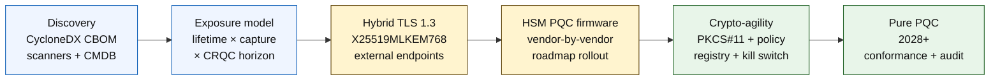

# El Índice de Banca Quantum-Safe en 2026: Criptografía Poscuántica, QKD, Criptoagilidad y Riesgo Harvest-Now-Decrypt-Later

<!-- lead-start: manual -->
<aside class="post-lead" aria-label="Resumen del artículo">

<strong>TL;DR.</strong> La banca quantum-safe en 2026 es un programa de entrega con una fecha límite fijada por la intersección de dos curvas: la vida útil de confidencialidad de los datos que la institución conserva hoy y el horizonte de llegada de un Ordenador Cuántico Criptográficamente Relevante (CRQC). El NIST FIPS 203 / 204 / 205 son definitivos desde agosto de 2024; CNSA 2.0 fija el estado final federal estadounidense en 2033; harvest-now-decrypt-later ya está ocurriendo sobre datos longevos. El Cuadro de Mando Cuántico para el Consejo monitoriza cuatro porcentajes exactos: completitud del inventario, exposición HNDL, progreso de migración NIST y preparación de criptoagilidad.

<strong>Conclusiones clave</strong>

<ul class="post-lead-takeaways">
  <li><strong>El debate sobre algoritmos se cerró el 13 de agosto de 2024.</strong> ML-KEM (FIPS 203), ML-DSA (FIPS 204) y SLH-DSA (FIPS 205) son las respuestas. Los bancos que aún ejecutan evaluaciones internas para «elegir al ganador» llevan 18 meses de retraso.</li>
  <li><strong>Harvest-now-decrypt-later ya aplica.</strong> Cualquier dato cuya vida útil de confidencialidad supere la llegada creíble de un CRQC —hipotecas a 30 años, suscripción de seguros de vida, grabaciones de transacciones bajo MiFID II / RGPD, archivos de retención de operaciones de M&amp;A— debe migrar ya a encapsulación de claves híbrida quantum-safe, no cuando se anuncie un CRQC.</li>
  <li><strong>El inventario es la madurez bloqueante.</strong> Un Cryptographic Bill of Materials (CBOM) —protocolo, biblioteca, certificado, partición HSM, dependencia de proveedor, responsable de aplicación, vida útil por clasificación de datos— es la condición previa de todo lo demás. Hay que medir frescura, no cobertura.</li>
  <li><strong>El TLS 1.3 híbrido es el despliegue de 2026.</strong> El key share híbrido X25519MLKEM768 es lo que Chrome / Firefox / Cloudflare / Akamai negocian hoy de hecho. El TLS con ML-KEM puro espera firmware de HSM y preparación de las CA.</li>
  <li><strong>La criptoagilidad es el entregable duradero.</strong> Abstracción PKCS#11, claves etiquetadas, registro de políticas que asocia servicio de negocio a conjunto de algoritmos permitidos. Sin eso, la próxima transición de algoritmo será otro programa de varios años.</li>
</ul>
</aside>
<!-- lead-end -->

La banca quantum-safe en 2026 trata de migración operativa, no de especulación. El NIST ha finalizado los tres primeros estándares de criptografía poscuántica, y los bancos deben entender ahora qué sistemas dependen de RSA, ECC, TLS, firmas, HSM, certificados, canales de pago, archivos y datos confidenciales longevos. La pregunta del índice es sencilla: ¿puede la institución reemplazar la criptografía antes de que la amenaza se vuelva operativa?

---

> **Resumen ejecutivo / Conclusiones clave**
>
> - **Los estándares del NIST son ya concretos.** FIPS 203 define ML-KEM para encapsulación de claves, FIPS 204 define ML-DSA para firmas y FIPS 205 define SLH-DSA como estándar de firma sin estado basado en hash.
> - **El inventario es la primera puerta de madurez.** Un banco no puede migrar lo que no encuentra: certificados, claves, protocolos, aplicaciones, proveedores, HSM, API, archivos y sistemas embebidos deben estar mapeados.
> - **La criptoagilidad es el objetivo duradero.** La meta no es un intercambio puntual de algoritmo; es la capacidad de cambiar primitivas criptográficas sin rediseñar aplicaciones enteras.
> - **Los datos longevos cambian la urgencia.** El riesgo harvest-now-decrypt-later implica que datos capturados hoy pueden ser legibles después si conservan suficiente valor.
> - **El QKD es un complemento especializado.** La distribución cuántica de claves puede ser relevante para los canales de mayor valor, pero no sustituye a una migración PQC institucional.
>
---

## Por qué 2026 es el año en el que este índice importa

Tres cambios en 2024-2025 convirtieron quantum-safe en un programa bancario medible en lugar de un punto de observación de investigación. Primero, el NIST finalizó los estándares poscuánticos principales el 13 de agosto de 2024: [FIPS 203 (ML-KEM) ⧉](https://nvlpubs.nist.gov/nistpubs/FIPS/NIST.FIPS.203.pdf "FIPS 203 — Mecanismo de encapsulación de claves basado en retículos de módulo"), [FIPS 204 (ML-DSA) ⧉](https://nvlpubs.nist.gov/nistpubs/FIPS/NIST.FIPS.204.pdf "FIPS 204 — Estándar de firma digital basado en retículos de módulo"), [FIPS 205 (SLH-DSA) ⧉](https://nvlpubs.nist.gov/nistpubs/FIPS/NIST.FIPS.205.pdf "FIPS 205 — Estándar de firma digital sin estado basado en hash"). El debate sobre selección de algoritmos se cerró ese día; los bancos que aún ejecutan en 2026 flujos internos del tipo «qué esquema gana» llevan 18 meses de retraso.

Segundo, la [CNSA 2.0 de la NSA ⧉](https://media.defense.gov/2022/Sep/07/2003071834/-1/-1/0/CSA_CNSA_2.0_ALGORITHMS_.PDF "Commercial National Security Algorithm Suite 2.0") fija el estado final federal estadounidense en 2033, con cortes intermedios que arrancan en 2027 para firma de software y firmware y en 2030 para navegadores y sistemas operativos. Cualquier banco con exposición a contrapartes federales estadounidenses —FedNow, operaciones del Treasury, cuentas de clientes federales— queda dentro de ese perímetro para los sistemas que tocan datos federales. El reloj ha dejado de ser abstracto.

Tercero, [Harvest-Now-Decrypt-Later (HNDL) ⧉](https://csrc.nist.gov/Projects/post-quantum-cryptography "Programa de Criptografía Poscuántica del NIST") es el argumento de riesgo que sostiene la urgencia. Adversarios sofisticados ya están capturando mensajes de pago protegidos por TLS, sobres SWIFT, documentación KYC y cifrado de archivos longevos en los principales centros financieros. Los datos capturados en 2026 solo necesitan seguir siendo sensibles a la confidencialidad en el momento del descifrado: para hipotecas a 30 años, suscripción de seguros de vida, grabaciones de transacciones bajo MiFID II / RGPD y archivos de retención de M&A, esa ventana se extiende mucho más allá de cualquier estimación creíble para un Ordenador Cuántico Criptográficamente Relevante (CRQC). El adversario no necesita un ordenador cuántico hoy. Lo necesita antes de que los datos dejen de importar.

El Índice de Banca Quantum-Safe mide si la institución es capaz de entregar la migración antes de que llegue esa intersección. El trabajo ya no consiste en decidir si migrar; consiste en si la migración se completa en un plazo defendible.

## La arquitectura del Índice 2026

| Capa del índice | Dirección en 2026 | Métrica de preparación | Riesgo si se gestiona mal |
|---|---|---|---|
| **Inventario** | Mapear activos criptográficos, protocolos, certificados, proveedores y clases de datos | Porcentaje del estate inventariado | Dependencias vulnerables al cuántico no identificadas |
| **Exposición** | Clasificar sistemas por vida útil de confidencialidad y criticidad transaccional | Activos de alto riesgo por valor y vida útil | Migración mal priorizada |
| **Migración** | Adoptar patrones híbridos y preparados para PQC alineados con los estándares NIST | Preparación para ML-KEM y ML-DSA | Re-platforming de emergencia bajo fecha límite |
| **Criptoagilidad** | Separar lógica de aplicación de las primitivas criptográficas | Cobertura de cripto controlada por políticas | Algoritmos cableados en el código a lo largo del estate |
| **Aseguramiento** | Probar interoperabilidad, rendimiento, soporte HSM, certificados y preparación de proveedores | Tasa de pruebas superadas y backlog de excepciones | Canales rotos o controles de fallback débiles |

### El Cuadro de Mando Cuántico para el Consejo

Un cuadro de mando creíble de preparación cuántica exige monitorizar porcentajes exactos, no solo estados de proyecto:

1. **Completitud del inventario:** porcentaje de aplicaciones tier-1 con un Cryptographic Bill of Materials (CBOM) totalmente mapeado.
2. **Exposición HNDL:** volumen de datos confidenciales longevos (p. ej., PII, secretos comerciales) transmitidos por red sin encapsulación de claves híbrida quantum-safe.
3. **Progreso de migración NIST:** porcentaje de claves de cifrado asimétrico y firmas digitales migradas a los estándares FIPS 203 (ML-KEM) y FIPS 204 (ML-DSA).
4. **Preparación de criptoagilidad:** porcentaje de sistemas críticos en los que los algoritmos criptográficos pueden rotarse mediante política centralizada sin recompilación de código.

## Señales actuales que monitorizar

| Señal | Qué significa para los bancos | Fuente |
|---|---|---|
| **FIPS 203 ML-KEM** | Estándar NIST principal para establecimiento general de claves de cifrado | [NIST ⧉](https://www.nist.gov/news-events/news/2024/08/nist-releases-first-3-finalized-post-quantum-encryption-standards "Primeros tres estándares finalizados de cifrado poscuántico") |
| **FIPS 204 ML-DSA** | Estándar NIST principal para firmas digitales | [NIST ⧉](https://www.nist.gov/news-events/news/2024/08/nist-releases-first-3-finalized-post-quantum-encryption-standards "Primeros tres estándares finalizados de cifrado poscuántico") |
| **FIPS 205 SLH-DSA** | Alternativa de firma basada en hash y diseño de respaldo | [NIST ⧉](https://www.nist.gov/news-events/news/2024/08/nist-releases-first-3-finalized-post-quantum-encryption-standards "Primeros tres estándares finalizados de cifrado poscuántico") |
| **Integración inmediata recomendada** | El NIST indica explícitamente a los administradores que empiecen a integrar los estándares porque la integración completa lleva tiempo | [NIST ⧉](https://www.nist.gov/news-events/news/2024/08/nist-releases-first-3-finalized-post-quantum-encryption-standards "Primeros tres estándares finalizados de cifrado poscuántico") |
| **Los programas cuánticos de los bancos se expanden** | Los principales bancos exploran tecnologías cuánticas mientras preparan transiciones PQC | [Quantum Insider ⧉](https://thequantuminsider.com/2026/03/27/15-plus-global-banks-probing-the-wonderful-world-of-quantum-technologies/ "Visión general de bancos globales que exploran tecnologías cuánticas") |

## La migración empieza por el libro mayor de la criptografía

La secuencia de migración está ya bien comprendida. Cada puerta produce evidencia que impulsa la siguiente; saltarse o comprimir una puerta es lo que genera el riesgo de re-platforming de emergencia que aparece en la columna de fallos de la arquitectura del índice.

El primer entregable no es un algoritmo nuevo; es un cryptographic bill of materials (CBOM). Los bancos necesitan un inventario vivo que conecte servicios de negocio con algoritmos, bibliotecas, certificados, longitudes de clave, HSM, vidas útiles de datos, proveedores y responsables operativos. Sin ese libro mayor, la migración quantum-safe se convierte en conjetura.

El conjunto de registros del CBOM debe capturar, para cada primitiva criptográfica: el protocolo o interfaz (TLS 1.3, IPsec, SSH, formato de mensaje de pago propietario), el algoritmo y conjunto de parámetros (RSA-2048, ECDH P-256, ML-KEM-768, ML-DSA-65), la biblioteca y versión (OpenSSL 3.4, hash de commit de BoringSSL, build de SDK de proveedor), la frontera hardware (partición HSM, TPM, enclave seguro o ninguna), la identidad del certificado si aplica, el responsable de la aplicación y la vida útil por clasificación de datos. Las herramientas que llegan a producción en 2025-2026 —IBM Quantum Safe Inventory, la [especificación CycloneDX CBOM ⧉](https://cyclonedx.org/capabilities/cbom/ "CycloneDX Cryptography Bill of Materials") de código abierto, los scanners empresariales de CryptoNext / Sandbox / PQShield— se integran en los pipelines CMDB existentes. Ninguna es completa por sí sola; cuente con un ciclo de construcción del CBOM de 12 a 18 meses incluso con herramientas de proveedor y plantilla dedicada.

La métrica a monitorizar es la frescura, no la cobertura. Un CBOM con dos meses de retraso es peor que no tener CBOM, porque da al equipo de seguridad una falsa confianza sobre lo que se ha migrado.

## Híbrido primero, ágil siempre

La mayoría de los bancos no van a cambiarlo todo de golpe. El patrón realista es el despliegue híbrido, en el que mecanismos clásicos y poscuánticos conviven mientras maduran proveedores, protocolos, certificados y herramienta operativa. El objetivo a largo plazo es la criptoagilidad: elecciones criptográficas controladas por política que pueden cambiarse sin reconstruir la aplicación de negocio.

[Insertar componente interactivo: Calculadora de riesgo Harvest-Now-Decrypt-Later (HNDL) — herramienta con deslizadores en la que los directivos introducen la vida útil del dato frente al calendario cuántico estimado para visualizar su ventana de exposición.]

> **Idea clave:** si tus datos deben permanecer confidenciales 10 años y un Ordenador Cuántico Criptográficamente Relevante (CRQC) está a 7 años vista, tu fecha límite de migración no es dentro de 7 años; era hace 3 años.

En la práctica esto significa TLS 1.3 con el key share híbrido `X25519MLKEM768` para endpoints expuestos al exterior (Chrome / Firefox / Cloudflare / Akamai lo soportan hoy), cadenas de firma clásicas hasta que la infraestructura de HSM y CA se ponga al día, y una capa de abstracción PKCS#11 que permita al registro de políticas rotar algoritmos sin recompilar aplicaciones de negocio. La criptoagilidad es lo que determina si la próxima transición de algoritmo (cuándo, no si) será una rotación de seis semanas u otro programa de siete años.

## Dónde encaja el QKD

La distribución cuántica de claves pertenece al índice como opción de canal de alta sensibilidad, sobre todo para infraestructuras de mercado financiero, conectividad de banca central y flujos institucionales de extrema sensibilidad. Debe tratarse como complemento de la PQC, no como excusa para retrasar la migración corporativa.

## Qué implica esto por tipo de banco

### Bancos de Importancia Sistémica Global

El problema duro es la escala: decenas de miles de endpoints TLS, cientos de particiones HSM, decenas de autoridades de certificación internas, cientos de aplicaciones de negocio con primitivas criptográficas embebidas y SDK de proveedor que el banco no puede modificar. La inversión no es otro piloto; es la herramienta CBOM, la capa de abstracción PKCS#11 cableada en cada build nuevo, el plan de consolidación de HSM que elige un proveedor para liderar el firmware PQC y acepta una cola de varios años en los demás, y el registro de políticas que se convierte en la superficie de criptoagilidad duradera mucho después de que se complete la migración a FIPS 203 / 204 / 205.

### Banca transaccional y corporativa

El alcance de migración es más estrecho que en el tier G-SIB, pero la exposición HNDL es aguda: mensajería transfronteriza SWIFT, datos de pago estructurados con PII de contraparte corporativa, plataformas de intercambio documental que custodian documentación de trade finance, y archivos de reporting con retención prolongada. Priorice TLS híbrido en cada endpoint de cara al cliente y PQC en reposo para archivos de retención. Empuje la rendición de cuentas del proveedor de HSM: el equipo de plataforma de banca corporativa tiene apalancamiento directo en procurement del que el equipo de tecnología mayorista a menudo carece.

### Bancos regionales

Compre el stack de proveedor que ya tenga las primitivas de criptoagilidad. Escoja una plataforma de core bancario cuyo proveedor publique un CBOM y se comprometa con plazos de soporte de ML-KEM / ML-DSA. Valide que la hoja de ruta de HSM del proveedor encaje con la fecha límite de migración del banco. La capacidad de ingeniería necesaria para construir criptoagilidad desde cero es de varios años; el proveedor paga ese coste repartido entre muchos clientes y el banco hereda el beneficio. El trabajo de validación —comprobar que las afirmaciones del proveedor sobreviven al proceso MRM de la institución— es el alcance interno legítimo.

### Fintechs, PSP y proveedores de infraestructura

La pregunta competitiva para los proveedores que venden a bancos en 2026 no es «¿soportas PQC?». Es «¿puedes producir un CycloneDX CBOM de tu plataforma, una matriz de soporte de proveedores de HSM y un SLA escrito de rotación de algoritmos?». Los proveedores que respondan que sí pasarán las puertas de procurement tier-1 en 2026-2027. Los que no, perderán el ciclo de renovación frente a un competidor que sí pueda.

## Conclusión

La banca quantum-safe en 2026 no es un punto de observación de investigación; es un programa de entrega con una fecha límite fijada por la intersección de dos curvas: la vida útil de confidencialidad de los datos que la institución conserva hoy y el horizonte de llegada de un Ordenador Cuántico Criptográficamente Relevante. Las instituciones que en 2030 parezcan creíbles ante supervisores y contrapartes serán las que iniciaron la construcción del CBOM en 2024, desplegaron TLS híbrido en todo endpoint externo a finales de 2026 y diseñaron criptoagilidad en cada build nuevo desde el primer día. Las que no, descubrirán si su ventana de migración ya se ha cerrado para los datos que su adversario está recolectando hoy.

Mida la migración como mide cualquier programa operativo: alcance conocido, secuenciación priorizada, fechas comprometidas, registros de excepciones honestos. Cuanto más mire su propio estate, más estrecha le parecerá la ventana de migración.

## Preguntas frecuentes

**¿Qué debe inventariar primero un banco?**

Empiece por TLS expuesto al exterior, canales de pago, autenticación de clientes, conectividad interbancaria, servicios respaldados por HSM, archivos de largo plazo y sistemas que manejan datos confidenciales con vida útil prolongada.

**¿Es la PQC solo un asunto de ciberseguridad?**

No. Afecta a pagos, identidad, evidencia legal, firma de transacciones, confianza del cliente, retención de datos, gestión de proveedores y resiliencia operativa.

**¿Qué significa criptoagilidad?**

Criptoagilidad significa la capacidad de cambiar primitivas criptográficas mediante controles de política y plataforma en lugar de cambios cableados en el código de la aplicación.

**¿Deben los bancos esperar a más estándares?**

No. El NIST ha animado a los administradores a empezar a integrar los primeros estándares finales porque la integración completa lleva tiempo.

## Referencias

- NIST, (2026). [Primeros tres estándares finalizados de cifrado poscuántico ⧉](https://www.nist.gov/news-events/news/2024/08/nist-releases-first-3-finalized-post-quantum-encryption-standards "Primeros tres estándares finalizados de cifrado poscuántico").

<!-- enrich-start -->
<aside class="author-card" aria-label="Acerca del autor"><strong class="author-card-name"><a href="/about/index.html">Sebastien Rousseau</a></strong>Tecnólogo bancario sénior, escribe sobre IA aplicada, infraestructura de pagos, dinero tokenizado, ISO 20022, seguridad poscuántica, servicios financieros nativos en la nube y mercados digitales regulados.Más de 20 años en HSBC Commercial &amp; Investment Bank, PayPal, Barclays, Shazam, AKQA, Virgin Group. <a href="/about/index.html">Perfil completo</a> &middot; <a href="https://www.linkedin.com/in/sebastienrousseau/" rel="external noopener">LinkedIn</a> &middot; <a href="https://github.com/sebastienrousseau" rel="external noopener">GitHub</a></aside>

Última revisión <time datetime="2026-06-04">2026-06-04</time>.

<!-- enrich-end -->
