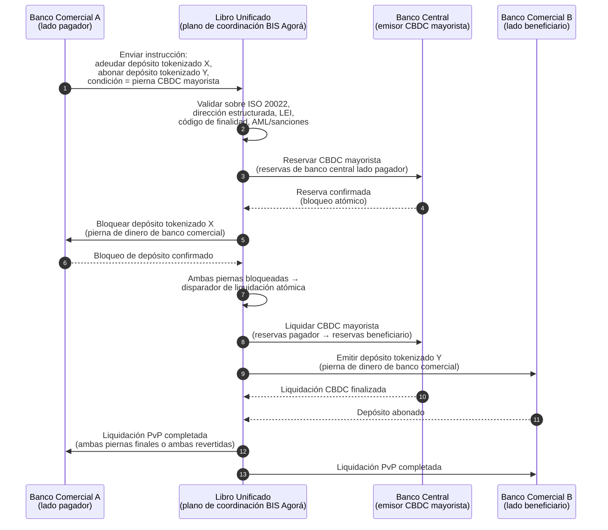

<!-- lead-start: manual -->
<aside class="post-lead" aria-label="Resumen del artículo">

<strong>En resumen.</strong> Los pagos mayoristas en 2026 se sitúan en la intersección de dos cambios estructurales: ISO 20022 obliga a meter datos de pago estructurados dentro del modelo operativo, y los depósitos tokenizados junto con BIS Project Agorá empujan la liquidación transfronteriza hacia rieles atómicos, programables y siempre activos. La pregunta de 2026 para un banco ya no es «¿migramos los mensajes?», sino «¿son nuestras operaciones de pago medibles, enrutadas y supervisables?» — y el índice lo desglosa en cuatro porcentajes exactos: completitud de datos estructurados, optimalidad del enrutado de rieles, retraso de finalidad de liquidación y cobertura del corredor Agorá.

<strong>Conclusiones clave</strong>

<ul class="post-lead-takeaways">
  <li><strong>Noviembre de 2026 es un plazo duro, no una orientación.</strong> SWIFT retira el soporte de direcciones no estructuradas en SR 2026; los pagos sin localidad y país en los campos designados dejan de compensar. Coste de reparación, tasa de rechazo y capacidad de operaciones pasan de «métrica» a «postura visible para el supervisor».</li>
  <li><strong>Los depósitos tokenizados superan a las stablecoins en el mayorista regulado.</strong> Preservan la relación banco-depositante y el activo de liquidación del banco central a la vez que exponen programabilidad. Las stablecoins mantienen un papel en el borde; los depósitos tokenizados anclan el núcleo.</li>
  <li><strong>BIS Project Agorá es la referencia de corredor.</strong> Si el producto transfronterizo de un banco no puede operar dentro de un corredor Agorá antes de 2027, compite en un riel del que el resto del mercado ya está saliendo.</li>
  <li><strong>La orquestación de rieles en tiempo real es el modelo operativo.</strong> La decisión multi-riel de 2026 (FedNow / RTP / TIPS / SEPA Inst / on-chain) no es «qué riel» — es el registro de políticas, el perfil de liquidez y el motor de enrutado que elige el riel por pago.</li>
  <li><strong>Medir o ser medido.</strong> Cuatro porcentajes — completitud de datos estructurados, optimalidad del enrutado de rieles, retraso de finalidad de liquidación, cobertura del corredor Agorá — convierten la postura de pagos en evidencia lista para el supervisor antes de la ventana de auditoría 2026/27.</li>
</ul>
</aside>
<!-- lead-end -->

# El Índice de Pagos Mayoristas en 2026: ISO 20022, Depósitos Tokenizados, Rieles en Tiempo Real y Liquidación Transfronteriza

Los pagos mayoristas en 2026 están siendo reconfigurados por dos cambios simultáneos: datos de pago estructurados y liquidación programable. El hito de noviembre de 2026 de SWIFT sobre dirección estructurada obliga a la calidad de datos a entrar en el modelo operativo, mientras que BIS Project Agorá y los depósitos tokenizados están probando si la liquidación transfronteriza puede volverse más atómica, transparente y siempre activa.

---

> **Resumen ejecutivo / Conclusiones clave**
>
> - **Noviembre de 2026 es un hito de datos duro.** SWIFT indica que los pagos que contengan direcciones no estructuradas dejarán de soportarse tras el cambio de SR 2026.
> - **Los datos estructurados se vuelven infraestructura de producto.** Localidad y país deben figurar como mínimo en los campos designados, lo que convierte la calidad de datos de pago en un asunto de cliente, operaciones y cumplimiento.
> - **Los depósitos tokenizados son una opción de diseño mayorista.** Project Agorá explora depósitos tokenizados de bancos comerciales y reservas tokenizadas de bancos centrales en un modelo de libro unificado.
> - **El índice debe medir la calidad de la liquidación, no solo la velocidad.** Finalidad, transparencia, tasas de reparación, uso de liquidez, datos de cumplimiento y visibilidad para el cliente importan tanto como la ejecución instantánea.
> - **Los pagos transfronterizos siguen siendo agenda público-privada.** El FSB sigue impulsando la hoja de ruta del G20 hasta la implementación, con coordinación entre sector público y privado.
>
---

## Por qué 2026 es el año en que este índice importa

El Stanford AI Index es útil porque trata un campo tecnológico acelerado como algo que se puede medir: producción investigadora, rendimiento técnico, despliegue responsable, economía, adopción sectorial, política y opinión pública se enmarcan en un único cuadro ([Stanford HAI ⧉](https://hai.stanford.edu/ai-index/2026-ai-index-report "Informe Stanford AI Index 2026")). Los bancos y las entidades financieras necesitan ahora la misma disciplina para la infraestructura. La IA agéntica, la seguridad cuántico-segura, la resiliencia nativa en la nube y los pagos mayoristas ya no son vías de innovación separadas; convergen en un único modelo operativo.

La pregunta práctica para un banco no es si cada ámbito es importante. Es si la institución puede medir la preparación en todos ellos a la vez. Un banco puede desplegar IA agéntica y seguir siendo frágil si su criptografía no está lista para migrar. Puede modernizar plataformas en la nube y aun así fallar si los datos de pago siguen sin estructurar. Puede ejecutar pilotos de tokenización y aun así crear riesgo sistémico si las capas de liquidación, liquidez, identidad y auditoría no se diseñan juntas.

## La arquitectura del índice 2026

| Capa del índice | Dirección en 2026 | Métrica de preparación | Riesgo si se gestiona mal |
|---|---|---|---|
| **Datos ISO 20022** | Pasar del texto no estructurado a campos estructurados gobernados | Preparación de dirección estructurada y tasa de rechazo | Rechazos de pago y reparación manual |
| **Orquestación de rieles** | Enrutar entre RTGS, instantáneo, corresponsal, stablecoin y rieles tokenizados | Coste, velocidad, finalidad y enrutado consciente de la jurisdicción | Rieles fragmentados con controles duplicados |
| **Liquidación tokenizada** | Usar depósitos tokenizados y dinero de banco central donde reducen fricción | Cobertura DvP, PvP y de liquidación atómica | Activos piloto sin valor de flujo de negocio |
| **Liquidez** | Optimizar liquidez intradía, efectivo atrapado y ventanas de liquidación | Liquidez ahorrada y reducción de fallos de liquidación | Drenajes más rápidos de liquidez |
| **Cumplimiento** | Integrar PBC, sanciones, FATF y requisitos de auditoría en los datos de pago | Cumplimiento straight-through y explicabilidad | Datos más ricos sin controles más fuertes |

## Señales clave de pagos mayoristas mapeadas a prioridades globales

El conjunto de señales de 2026 no es una agenda de investigación. Es una lista de entrega sobre la que ya se está midiendo al Chief Payments Officer de un banco. El trabajo de remediación aparece en tres lugares: el sobre del mensaje, la capa de orquestación de rieles y el libro de liquidación.

| Señal | Referencia G20 / SWIFT / BIS | Implementación técnica de plataforma |
|---|---|---|
| **El 65 % de los mensajes de pago siguen conteniendo direcciones no estructuradas** | [SWIFT SR 2026 — hito de dirección estructurada, noviembre de 2026 ⧉](https://www.swift.com/news-events/news/iso-20022-milestone-november-2026-unstructured-addresses-be-removed "Hito ISO 20022 de noviembre de 2026 sobre dirección estructurada") | Validación de esquema en el middleware de pagos antes de que el mensaje llegue al adaptador SWIFTNet; parseo automático de direcciones en la entrada de canales corporativos y de bancos corresponsales. |
| **Objetivo G20 del FSB: el 75 % de los pagos transfronterizos completados en menos de 1 hora antes de 2027** | [Hoja de ruta de pagos transfronterizos del FSB, fase de implementación 2026 ⧉](https://www.fsb.org/2026/03/fsb-kicks-off-new-implementation-phase-to-enhance-cross-border-payments-through-public-private-partnership/ "Fase de implementación de pagos transfronterizos del FSB") | Pasarelas de conversión FX en tiempo real con ventanas de liquidez preacordadas; ganchos de confirmación T+0 hacia el portal del cliente; motor de enrutado de rieles que excluye cualquier corredor que no pueda cumplir el sobre de 1 h. |
| **Objetivo G20 del FSB: coste medio de transacción transfronteriza por debajo del 1 %, minorista por debajo del 3 %** | [Objetivos cuantitativos G20 del FSB ⧉](https://www.fsb.org/2026/03/fsb-kicks-off-new-implementation-phase-to-enhance-cross-border-payments-through-public-private-partnership/ "Fase de implementación de pagos transfronterizos del FSB") | Telemetría de atribución de costes en cada corredor (spread FX, comisión de corresponsal, lifting cost); registro de políticas de margen que aflora precios no conformes antes de la cotización. |
| **BIS Project Agorá entra en fase de prototipo con siete bancos centrales + 41 bancos comerciales** | [BIS Project Agorá ⧉](https://www.bis.org/about/bisih/topics/fmis/agora.htm "Project Agorá") | Especificación de integración de libro unificado: nodo de libro de depósitos tokenizados + plano de liquidación CBDC mayorista + ganchos KYC/AML; pools de liquidez on-chain dimensionados a la cuota de corredor del banco. |
| **El marco de «dinero digital» de Deutsche Bank cristaliza en la arquitectura cliente** | [Deutsche Bank — Dinero digital: stablecoins, depósitos tokenizados y CBDC ⧉](https://flow.db.com/publications/flow-white-papers-and-guides/digital-money-a-perspective-on-stablecoins-tokenised-deposits-and-cbdcs "Dinero digital: stablecoins, depósitos tokenizados y CBDC") | API de liquidación agnóstica al wallet que abstrae la selección stablecoin / depósito tokenizado / CBDC por pago; condiciones programables evaluadas contra el registro de políticas del banco, no del cliente. |

## El punto de inflexión de los datos de pago

ISO 20022 ha pasado de ser un proyecto de formato de mensajería a ser un modelo operativo de calidad de datos. Si los datos de beneficiario, deudor, acreedor, agente, localidad, país, finalidad y parte son débiles, el banco experimentará rechazos, reparaciones, fricción de sanciones, frustración del cliente y analítica débil.

**SR 2026 convierte esto en un contrato duro, no en una recomendación.** La Standards Release 2026 de SWIFT (noviembre de 2026) impone la regla de dirección estructurada en la capa de red — los mensajes cuyo elemento `<PstlAdr>` no contenga `<TwnNm>` ni `<Ctry>` serán rechazados en recepción por la pila de validación SWIFTNet, no marcados para reparación. La cola de reparación deja de ser una línea de coste de back-office y pasa a ser un evento de fallo de liquidación con retraso visible para el cliente. Los equipos de operaciones que han venido tratando SR 2026 como «orientación más estricta» trabajan a partir del runbook equivocado.

### Cumplimiento de datos estructurados de pago bajo ISO 20022

La superficie de remediación es estrecha y está bien definida. Los elementos XML siguientes son el lugar donde la pila de validación SWIFTNet de noviembre de 2026 rechaza efectivamente los mensajes; todo lo demás es consecuencia aguas abajo.

| Elemento de datos | Etiqueta XML ISO 20022 | Requisito SWIFT noviembre de 2026 | Estrategia de remediación técnica |
|---|---|---|---|
| **Dirección estructurada** | `<PstlAdr>` con `<TwnNm>` + `<Ctry>` | Obligatorio. El texto no estructurado en `<AdrLine>` provoca el rechazo en red en el adaptador SWIFTNet receptor. | Parseo automático de direcciones en la iniciación del pago; reescritura de formularios en canales corporativos; saneamiento del back-book en cada contraparte antes del siguiente adeudo. |
| **Legal Entity Identifier (LEI)** | `<Id>` dentro de `<OrgId>` | Altamente recomendado para verificación de contrapartes financieras no individuales; obligatorio en varios corredores CBPR+. | Búsqueda de LEI + verificación cruzada con GLEIF en el onboarding corporativo; enriquecimiento automático para contrapartes de back-book mediante servicios de datos de referencia. |
| **Códigos de finalidad de pago** | `<Purp>` con `<Cd>` | Obligatorio en múltiples corredores regionales en tiempo real (CBPR+, SEPA Inst, TIPS) para el cribado AML / sanciones automatizado. | Mapear los códigos de transacción internos heredados del banco a la lista estándar ISO 20022 ExternalPurposeCode; exponer la selección de finalidad en la UI del canal corporativo; denegación por defecto ante códigos desconocidos. |
| **Partes finales** | `<UltmtDbtr>` / `<UltmtCdtr>` | Exponer el contexto del beneficiario final para satisfacer la travel rule del FATF G20 + parámetros de sanciones; obligatorio para varios códigos de tipo de pago. | Extraer nombres de parte end-to-end desde subcuentas del ledger; conciliar contra el grafo KYC; mostrar la parte final en cada confirmación. |
| **Información de remesa (estructurada)** | `<RmtInf><Strd>` con `<RfrdDocInf>` | Obligatorio para pagos corporativos conciliables vinculados a factura bajo CBPR+ Fase 2. | Capturar la remesa estructurada en el momento de la cotización en el portal corporativo; rechazar el fallback en texto libre para flujos de alto valor. |

## Depósitos tokenizados y CBDC mayorista

Los depósitos tokenizados preservan el modelo de dinero de banco comercial mientras añaden programabilidad. El dinero de banco central mayorista preserva la finalidad de liquidación. El patrón de diseño interesante es la combinación: dinero de banco comercial para las relaciones con el cliente y la intermediación crediticia, dinero de banco central para la liquidación final y la confianza sistémica.

Project Agorá concreta esa combinación. La arquitectura siguiente es el patrón de referencia del BIS para una liquidación transfronteriza atómica, payment-versus-payment (PvP), utilizando a la vez un libro de depósitos de banco comercial y un plano de liquidación CBDC mayorista, coordinados a través de un libro unificado.

La liquidación es atómica por construcción: ambas piernas se confirman o ambas se revierten. La finalidad de liquidación en la pierna CBDC mayorista hace efectiva la transferencia del depósito tokenizado del banco comercial sin riesgo de corresponsalía. El libro unificado es el plano de coordinación, no un sistema de pago en sí mismo — el banco central sigue emitiendo el activo de liquidación y el banco comercial sigue contabilizando el pasivo por depósito.

## El nuevo producto de pago mayorista

El producto ya no es simplemente un pago. Es un paquete de ejecución, datos, liquidez, cumplimiento, trazabilidad y gestión de excepciones. Los bancos que sepan exponer esas capacidades a través de API y paneles de cliente convertirán el cumplimiento de infraestructura en valor para el cliente.

## Qué significa esto por tipo de banco

### Bancos sistémicamente importantes a escala global

Los bancos globales deben tratar este índice como un cuadro de mando de arquitectura empresarial. La prioridad no es otra prueba de concepto; es la evidencia de que los flujos autónomos, la migración criptográfica, la dependencia de la nube y la modernización de pagos pueden gobernarse como un único sistema de riesgo y valor.

### Bancos transaccionales y corporativos

Los bancos transaccionales deben centrarse en pagos mayoristas, datos estructurados, liquidez, depósitos tokenizados y servicios de tesorería agénticos. La propuesta de cliente más valiosa no es el mero movimiento más rápido del dinero; es el movimiento de dinero explicable, auditable y programable, con menos investigaciones y mejor visibilidad del capital circulante.

### Bancos regionales

Los bancos regionales deben usar el índice para evitar la dispersión de programas. No necesitan liderar todas las fronteras, pero sí posiciones creíbles en gobernanza de IA, inventario poscuántico, evidencia de salida en la nube y preparación de datos de pago.

### Fintechs, PSP y proveedores de infraestructura

Las fintechs y los proveedores de infraestructura deben alinear sus hojas de ruta de producto con una preparación bancaria medible. Las mejores propuestas reducirán el riesgo de integración, reforzarán la evidencia y harán más fácil para los bancos gobernar una infraestructura compleja.

## Conclusión

El valor de un informe en formato de índice es que convierte una agenda tecnológica fragmentada en un modelo operativo medible. En 2026, los ganadores en infraestructura financiera no serán las instituciones con más pilotos. Serán las que puedan demostrar preparación en autonomía, seguridad, resiliencia, liquidación, economía y gobernanza al mismo tiempo.

## Preguntas frecuentes

**¿Por qué sigue ISO 20022 siendo un tema de 2026?**

Porque la migración no está completa hasta que los datos de pago están estructurados, gobernados, capturados en origen y son utilizables a través de canales, clientes e infraestructuras de mercado.

**¿Qué es un depósito tokenizado?**

Un depósito tokenizado es una representación digital de dinero de banco comercial, diseñada para preservar la relación banco-depositante a la vez que habilita la liquidación programable.

**¿Sustituyen los depósitos tokenizados a las stablecoins?**

No en todos los casos. Las stablecoins pueden seguir siendo útiles en algunos contextos de activos digitales y transfronterizos, mientras que los depósitos tokenizados son estructuralmente atractivos para la banca mayorista regulada.

**¿Qué deben medir los bancos?**

Medir preparación de datos estructurados, rechazos de pago, coste de reparación, tiempo de liquidación, uso de liquidez, resultados de enrutado de rieles y visibilidad para el cliente.

## Referencias

- SWIFT, (2026). [Hito ISO 20022 de noviembre de 2026 sobre dirección estructurada ⧉](https://www.swift.com/news-events/news/iso-20022-milestone-november-2026-unstructured-addresses-be-removed "Hito ISO 20022 de noviembre de 2026 sobre dirección estructurada").
- BIS Innovation Hub, (2026). [Project Agorá ⧉](https://www.bis.org/about/bisih/topics/fmis/agora.htm "Project Agorá").
- FSB, (2026). [Fase de implementación de pagos transfronterizos ⧉](https://www.fsb.org/2026/03/fsb-kicks-off-new-implementation-phase-to-enhance-cross-border-payments-through-public-private-partnership/ "Fase de implementación de pagos transfronterizos").
- Deutsche Bank, (2026). [Dinero digital: stablecoins, depósitos tokenizados y CBDC ⧉](https://flow.db.com/publications/flow-white-papers-and-guides/digital-money-a-perspective-on-stablecoins-tokenised-deposits-and-cbdcs "Dinero digital: stablecoins, depósitos tokenizados y CBDC").

<!-- enrich-start -->
<aside class="author-card" aria-label="Acerca del autor"><strong class="author-card-name"><a href="/about/index.html">Sebastien Rousseau</a></strong>Tecnólogo bancario sénior, escribe sobre IA aplicada, infraestructura de pagos, dinero tokenizado, ISO 20022, seguridad poscuántica, servicios financieros nativos en la nube y mercados digitales regulados.Más de 20 años en HSBC Commercial &amp; Investment Bank, PayPal, Barclays, Shazam, AKQA, Virgin Group. <a href="/about/index.html">Perfil completo</a> &middot; <a href="https://www.linkedin.com/in/sebastienrousseau/" rel="external noopener">LinkedIn</a> &middot; <a href="https://github.com/sebastienrousseau" rel="external noopener">GitHub</a></aside>

Última revisión <time datetime="2026-06-06">2026-06-06</time>.

<!-- enrich-end -->
