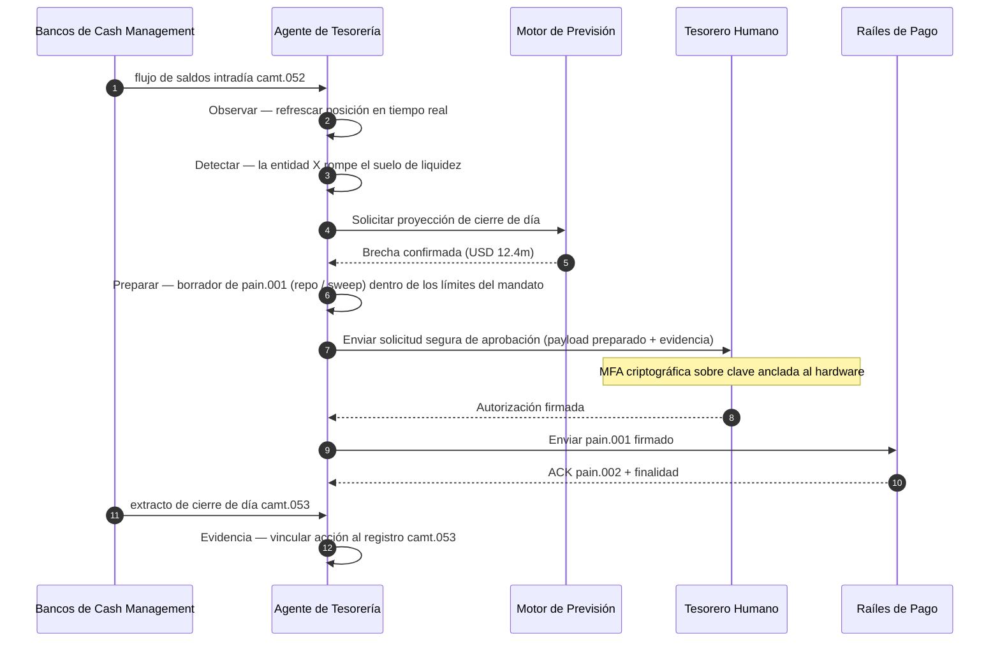

# Índice de Tesorería Autónoma 2026: agéntica, liquidez programable y depósitos tokenizados

<!-- lead-start -->
<aside class="post-lead" aria-label="Resumen del artículo">

<strong>En resumen.</strong> Un índice 2026 de tesorería autónoma: mide workflows agénticos, cobertura de liquidez programable, integración de depósitos tokenizados, orquestación de pagos en tiempo real y control de caja automatizado como un único modelo operativo.

<strong>Conclusiones clave</strong>

<ul class="post-lead-takeaways">
  <li><strong>La tesorería se convierte en un sistema operativo en tiempo real.</strong> Las previsiones de tesorería estáticas y los barridos por lotes han dejado de ser la unidad de medida; lo son los workflows agénticos que se ejecutan sobre datos en tiempo real.</li>
  <li><strong>La liquidez programable ya es viable.</strong> Depósitos tokenizados + raíles en tiempo real convierten la provisión de liquidez por evento en una primitiva de workflow, no en una iniciativa trimestral.</li>
  <li><strong>Los depósitos tokenizados son el dinero digital preferido del tesorero.</strong> Economía del dinero bancario, programabilidad y certeza intradía, sin las dudas de riesgo de emisor y reservas que arrastran las stablecoins.</li>
  <li><strong>El plano de control es la nueva superficie de auditoría.</strong> Mandatos, límites, vías de invalidación manual y evidencia de reversión deben funcionar como primitivas de plataforma, no como aprobaciones manuales por acción.</li>
  <li><strong>El cuadro de mando del CFO es por decisión, no por trimestre.</strong> Coste de la caja, reducción del colchón de liquidez intradía, eficiencia FX y precisión de la previsión de tesorería se miden a velocidad de workflow.</li>
</ul>

<strong>Lecturas relacionadas:</strong> <a href="https://sebastienrousseau.com/es/2026-05-25-programmable-liquidity-ai-tokenised-deposits-real-time-treasury-2026/index.html">Liquidez programable en 2026: IA, depósitos tokenizados y orquestación de tesorería en tiempo real</a>, <a href="https://sebastienrousseau.com/es/2026-05-21-tokenised-deposits-banking-services-status-2026/index.html">Depósitos tokenizados en 2026: servicios bancarios, competencia stablecoin y el estado del dinero bancario programable</a>.

</aside>
<!-- lead-end -->

La tesorería autónoma es el punto de encuentro natural entre IA agéntica, pagos mayoristas, depósitos tokenizados y liquidez en tiempo real. En 2026, las mejores arquitecturas de tesorería no se limitarán a prever la caja: recomendarán, explicarán y, llegado el caso, ejecutarán acciones de liquidez acotadas en cuentas, divisas, raíles y activos de liquidación.

---

> **Resumen ejecutivo / conclusiones clave**
>
> - **La tesorería pasa del reporte al control.** Los saldos en tiempo real, las previsiones, el estado de los pagos y el movimiento de liquidez forman parte de un mismo workflow.
> - **La IA agéntica crea una nueva interfaz de tesorería.** Los agentes pueden monitorizar posiciones, aflorar anomalías, preparar acciones de financiación y escalar decisiones dentro de mandatos definidos.
> - **El dinero programable cambia la pata de caja.** Los depósitos tokenizados y los experimentos de CBDC mayorista abren nuevas posibilidades de liquidación atómica, pagos condicionales y liquidez siempre disponible.
> - **El índice debe medir la autoridad.** La pregunta no es si el agente puede sugerir una acción; es si la autoridad, los límites, las aprobaciones y la evidencia están claros.
> - **El valor de la tesorería es medible.** Liquidez ahorrada, investigaciones manuales reducidas, fallos de liquidación evitados y capital circulante liberado deben definir el éxito.
>
---

## Por qué 2026 es el año en que este índice importa

El Stanford AI Index resulta útil porque trata un campo tecnológico de evolución rápida como algo que se puede medir: producción investigadora, rendimiento técnico, despliegue responsable, economía, adopción sectorial, política y opinión pública se integran en un único marco ([Stanford HAI ⧉](https://hai.stanford.edu/ai-index/2026-ai-index-report "The 2026 AI Index Report")). La banca y las entidades financieras necesitan ya la misma disciplina para su infraestructura. IA agéntica, seguridad quantum-safe, resiliencia cloud-native y pagos mayoristas han dejado de ser vías de innovación separadas; convergen en un único modelo operativo.

La pregunta práctica para un banco no es si cada dominio importa. Es si la entidad puede medir la preparación en todos ellos al mismo tiempo. Un banco puede desplegar IA agéntica y seguir siendo frágil si su criptografía no está lista para migrar. Puede modernizar plataformas cloud y aun así fallar si los datos de pago siguen sin estructurarse. Puede ejecutar pilotos de tokenización y aun así generar riesgo sistémico si las capas de liquidación, liquidez, identidad y auditoría no se diseñan de forma conjunta.

## La arquitectura del índice 2026

| Capa del índice | Dirección 2026 | Métrica de preparación | Riesgo si se gestiona mal |
|---|---|---|---|
| **Visibilidad** | Unificar datos de cuenta, pago, liquidez y exposición | Cobertura de posiciones de caja en tiempo real | Visibilidad de caja fragmentada |
| **Previsión** | Usar IA para prever saldos, flujos y necesidades de financiación | Precisión de la previsión y tasa de excepción | Falsa confianza en datos débiles |
| **Autonomía** | Conceder a los agentes autoridad acotada para recomendaciones y acciones | Cobertura de mandatos y calidad de las aprobaciones | Acción no autorizada o sin explicación |
| **Programabilidad** | Usar depósitos tokenizados y condiciones inteligentes donde aporten valor | Casos de uso de pagos condicionales y liquidación atómica | Pilotos de tesorería guiados por tecnología |
| **Controles** | Embeber límites, sanciones, FX, liquidez y controles de auditoría | Evidencia de control por acción de tesorería | Gobernanza manual a posteriori |

## Señales actuales a vigilar

| Señal | Lo que significa para la banca | Fuente |
|---|---|---|
| **52% de adopción de IA agéntica en servicios financieros** | La tesorería puede ya absorber workflows agénticos a través de plataformas gobernadas | [Cambridge CCAF ⧉](https://www.jbs.cam.ac.uk/faculty-research/centres/alternative-finance/publications/2026-global-ai-in-financial-services-report/ "Informe Global IA en Servicios Financieros 2026") |
| **Pagos condicionales de Project Agorá** | La tokenización puede habilitar capacidades de pago condicional y siempre disponibles | [BIS ⧉](https://www.bis.org/about/bisih/topics/fmis/agora.htm "Project Agorá") |
| **Bank of England Digital Securities Sandbox** | Los bonos y la renta variable emitidos en DLT se liquidan en modalidad de Entrega contra Pago (DvP): la pata de activo y la pata de caja (CBDC mayorista o depósitos tokenizados de banca comercial) se liquidan en la misma transacción atómica, eliminando el riesgo principal de contraparte | [Bank of England ⧉](https://www.bankofengland.co.uk/financial-stability/digital-securities-sandbox "Digital Securities Sandbox") |
| **Fecha límite de SWIFT para direcciones estructuradas** | Los datos de tesorería deben capturarse correctamente en origen | [SWIFT ⧉](https://www.swift.com/news-events/news/iso-20022-milestone-november-2026-unstructured-addresses-be-removed "Hito ISO 20022 de noviembre de 2026 sobre direcciones estructuradas") |
| **Las grandes entidades luchan por medir el valor de la IA** | La automatización de tesorería necesita métricas económicas duras | [Cambridge CCAF ⧉](https://www.jbs.cam.ac.uk/faculty-research/centres/alternative-finance/publications/2026-global-ai-in-financial-services-report/ "Informe Global IA en Servicios Financieros 2026") |

## El mandato del agente de tesorería

Un agente de tesorería no debe diseñarse como un asistente de propósito general. Necesita un mandato: observar cuentas, detectar excepciones, prever brechas de financiación, preparar acciones, solicitar aprobaciones, ejecutar dentro de los límites y producir evidencia. Cada paso debe contar con un modelo de autoridad distinto.

El bucle de control ejecuta Observar → Detectar → Prever → Preparar → Solicitar aprobación, y se detiene. El agente nunca cruza por sí solo la frontera de autorización criptográfica. El diagrama siguiente recorre un ciclo completo: una brecha intradía de liquidez de varios millones de dólares aflora en la telemetría `camt.052`, el agente prevé la posición de cierre de día, prepara un repo o un sweep intercompañía como un `pain.001` plenamente conformado y lo entrega al tesorero humano para la firma criptográfica multifactor sobre una clave anclada al hardware. El agente envía entonces el payload firmado; la finalidad llega como ACK `pain.002` y queda en el siguiente `camt.053` de registro.

La frontera es el punto: cada acción que mueve dinero real queda detrás de una puerta criptográfica que el agente no puede satisfacer por sí solo.

## Liquidez programable

La liquidez programable es la capacidad de mover valor bajo condiciones: si se rebasa un umbral, si el colateral es elegible, si la contraparte supera el cribado, si hay finalidad de liquidación o si el colchón de liquidez intradía es demasiado bajo. Los depósitos tokenizados y las plataformas de liquidación mayorista hacen que estos patrones sean más prácticos.

Programable no significa fuera de estándar. La ruta de ejecución es `pain.001`: ISO 20022 Customer Credit Transfer Initiation. La acción preparada por el agente es un payload `pain.001` plenamente conformado, enrutado al banco por el mismo canal que usaría un ERP corporativo, validado contra el mismo esquema, puntuado por los mismos motores de fraude y sanciones y confirmado en los mismos informes de estado `pain.002`. La capa de condicionalidad (umbral, elegibilidad de colateral, disponibilidad de finalidad, suelo de colchón) vive por encima del mensaje: gobierna *si* se envía un `pain.001`, no *qué forma* adopta. Las plataformas de tesorería que inventan payloads ad hoc para expresar condiciones quedarán fuera de la ruta consumible por la banca y volverán a la integración bilateral.

## La sala de control de tesorería

El modelo operativo debe parecerse a una sala de control: posiciones, previsiones, estados de pago, uso de límites, excepciones, aprobaciones y evidencia en una sola interfaz. El índice debe penalizar las pilas de tesorería que obligan a los equipos a coser correos, hojas de cálculo, portales bancarios y cuadros de mando desconectados.

El plano de datos detrás de esa interfaz es el cash management ISO 20022. La posición intradía es `camt.052` — Bank-to-Customer Account Report — transmitida desde cada banco de cash management hacia la capa de observación del agente con la frecuencia que publique el banco (minutos para proveedores GTB de primer nivel, fin de ciclo para la cola larga). La conciliación de cierre de día es `camt.053` — Bank-to-Customer Statement — el registro auditable contra el que se mide la previsión del agente a la mañana siguiente. Las plataformas de tesorería que leen extractos en PDF o hacen screen-scraping de portales bancarios no pueden alcanzar el Nivel 4 del índice; la telemetría intradía tiene que llegar como `camt.052` estructurado para que el bucle de previsión cierre a tiempo de actuar.

## Qué implica según el tipo de banco

### Bancos globales sistémicamente importantes

Los bancos globales deben tratar este índice como un cuadro de mando de arquitectura empresarial. La prioridad no es otra prueba de concepto; es la evidencia de que los workflows autónomos, la migración criptográfica, la dependencia cloud y la modernización de pagos pueden gobernarse como un único sistema de riesgo y valor.

### Bancos de transacción y bancos corporativos

Los bancos de transacción deben centrarse en pagos mayoristas, dato estructurado, liquidez, depósitos tokenizados y servicios de tesorería agéntica. La propuesta de cliente más valiosa no es solo mover el dinero más rápido; es un movimiento de dinero explicable, auditable y programable, con menos investigaciones y mejor visibilidad del capital circulante.

### Bancos regionales

Los bancos regionales deben utilizar el índice para evitar la dispersión de programas. No tienen que liderar todas las fronteras, pero sí necesitan posiciones creíbles sobre gobernanza de IA, inventario poscuántico, evidencia de salida cloud y preparación del dato de pago.

### Fintech, PSP y proveedores de infraestructura

Las fintech y los proveedores de infraestructura deben alinear sus hojas de ruta de producto con la preparación medible de la banca. Las mejores propuestas reducirán el riesgo de integración, reforzarán la evidencia y harán que la infraestructura compleja sea más fácil de gobernar para los bancos.

## Conclusión

El valor de un informe-índice es que convierte una agenda tecnológica fragmentada en un modelo operativo medible. En 2026, los ganadores de la infraestructura financiera no serán las entidades con más pilotos. Serán las entidades capaces de demostrar preparación en autonomía, seguridad, resiliencia, liquidación, economía y gobernanza al mismo tiempo.

## Preguntas frecuentes

**¿Qué es la tesorería autónoma?**

La tesorería autónoma es el uso de agentes de IA, datos en tiempo real y pagos programables para monitorizar, recomendar y, potencialmente, ejecutar acciones de tesorería dentro de controles definidos.

**¿Debe permitirse a los agentes de tesorería ejecutar pagos?**

Solo dentro de mandatos estrechos, límites estrictos, aprobaciones explícitas y auditabilidad completa. La autoridad de ejecución debe ganarse con la madurez.

**¿Cómo ayudan los depósitos tokenizados a la tesorería?**

Pueden soportar liquidación programable, ejecución atómica y, potencialmente, un mejor control de la liquidez intradía sin renunciar a la relación con el dinero bancario comercial.

**¿Cuál es el primer paso de implantación?**

Construir visibilidad y calidad del dato en tiempo real antes de conceder autonomía. Los agentes no pueden optimizar con seguridad una caja que no ven con precisión.

## Referencias

- Cambridge Centre for Alternative Finance, (2026). [Informe Global IA en Servicios Financieros 2026 ⧉](https://www.jbs.cam.ac.uk/faculty-research/centres/alternative-finance/publications/2026-global-ai-in-financial-services-report/ "Informe Global IA en Servicios Financieros 2026").
- SWIFT, (2026). [Hito ISO 20022 de noviembre de 2026 sobre direcciones estructuradas ⧉](https://www.swift.com/news-events/news/iso-20022-milestone-november-2026-unstructured-addresses-be-removed "Hito ISO 20022 de noviembre de 2026 sobre direcciones estructuradas").
- BIS Innovation Hub, (2026). [Project Agorá ⧉](https://www.bis.org/about/bisih/topics/fmis/agora.htm "Project Agorá").
- Bank of England, (2026). [Dando forma al futuro financiero digital del Reino Unido ⧉](https://www.bankofengland.co.uk/speech/2025/january/sasha-mills-speech-at-the-tokenisation-summit "Dando forma al futuro financiero digital del Reino Unido").

<!-- enrich-start -->
<aside class="author-card" aria-label="Sobre el autor"><strong class="author-card-name"><a href="/about/index.html">Sebastien Rousseau</a></strong>Tecnólogo bancario sénior, escribe sobre IA aplicada, infraestructura de pagos, dinero tokenizado, ISO 20022, seguridad postcuántica, servicios financieros cloud-native y mercados digitales regulados.Más de 20 años en HSBC Commercial &amp; Investment Bank, PayPal, Barclays, Shazam, AKQA, Virgin Group. <a href="/about/index.html">Perfil completo</a> &middot; <a href="https://www.linkedin.com/in/sebastienrousseau/" rel="external noopener">LinkedIn</a> &middot; <a href="https://github.com/sebastienrousseau" rel="external noopener">GitHub</a></aside>

Última revisión <time datetime="2026-06-07">2026-06-07</time>.

<!-- enrich-end -->
