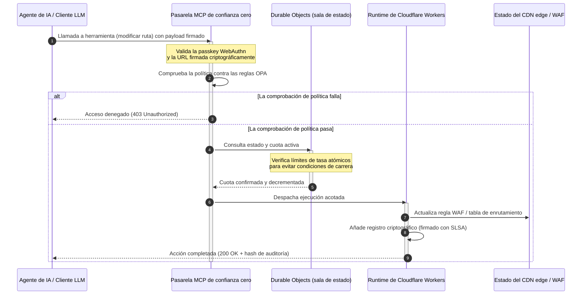

---

# Front Matter (YAML)

author: "contact@sebastienrousseau.com (Sebastien Rousseau)"
banner_alt: "Rack de centro de datos iluminado de noche — símbolo del edge de código abierto, inspeccionable y controlable por agentes sobre el que se construye CloudCDN"
banner_height: "1597"
banner_width: "2584"
banner: "https://cloudcdn.pro/stocks/images/alis-po-IdVNRv-5wJo.webp"
cdn: "https://cloudcdn.pro"
charset: "UTF-8"
cname: "sebastienrousseau.com"
copyright: "© Copyright 2025 - 2026 - Sebastien Rousseau. All rights reserved."
date: "11 de junio de 2026"
description: "CloudCDN convierte el CDN en un plano de control edge controlable por agentes: pasarela MCP de confianza cero, Durable Objects, SLSA Level 3 y evidencia DORA."
format-detection: "telephone=no"
hreflang: "es"
icon: "https://cloudcdn.pro/clients/sebastienrousseau/v1/logos/sebastienrousseau.svg"
id: "https://sebastienrousseau.com/es/2026-06-11-cloudcdn-open-source-blueprint-ai-native-edge-2026"
image_alt: "Retrato en blanco y negro de Sebastien Rousseau"
image_height: "162"
image_width: "162"
image: "https://cloudcdn.pro/stocks/images/sebastienrousseau.webp"
keywords: "CloudCDN, edge nativo de IA, CDN de código abierto, servidor MCP, Cloudflare Workers, Durable Objects, confianza cero, WebAuthn, URLs firmadas, SLSA Level 3, DORA, plano de control edge"
language: "es"
last_reviewed: "2026-06-11"
layout: "report"
locale: "es_ES"
logo_alt: "Logotipo de Sebastien Rousseau"
logo_height: "44"
logo_width: "44"
logo: "https://cloudcdn.pro/clients/sebastienrousseau/v1/logos/sebastienrousseau.svg"
menu: ""
measurementID: "G-169G4ET5HQ"
name: "Sebastien Rousseau"
permalink: "https://sebastienrousseau.com/es/2026-06-11-cloudcdn-open-source-blueprint-ai-native-edge-2026"
rating: "general"
referrer: "no-referrer"
robots: "index, follow"
schema: "FAQPage, Article"
seo_title: "CloudCDN: modelo de código abierto para el edge nativo de IA"
short_name: "sebastienrousseau"
subtitle: "Del CDN global como caché de contenido estático a un plano de control edge criptográficamente seguro y controlable por agentes."
tags: "CloudCDN, código abierto, CDN, edge, agentes de IA, MCP, Cloudflare Workers, Durable Objects, limitación de tasa, confianza cero, WebAuthn, SLSA, DORA, BCBS 239, Basel III, banca nativa en la nube"
theme-color: "0, 83, 191"
title: "CloudCDN: modelo de código abierto para el edge nativo de IA en 2026"
url: "https://sebastienrousseau.com/es/2026-06-11-cloudcdn-open-source-blueprint-ai-native-edge-2026"
viewport: "width=device-width, initial-scale=1, shrink-to-fit=no"

# RSS - The RSS feed front matter (YAML).
atom_link: "https://sebastienrousseau.com/2026-06-11-cloudcdn-open-source-blueprint-ai-native-edge-2026/rss.xml"
category: "Technology"
docs: https://validator.w3.org/feed/docs/rss2.html
generator: "Static Site Generator (SSG) (version 0.0.26)"
item_description: "CloudCDN convierte el CDN en un plano de control edge controlable por agentes: pasarela MCP de confianza cero, Durable Objects, SLSA Level 3 y evidencia DORA."
item_guid: "https://sebastienrousseau.com/2026-06-11-cloudcdn-open-source-blueprint-ai-native-edge-2026/rss.xml"
item_link: "https://sebastienrousseau.com/2026-06-11-cloudcdn-open-source-blueprint-ai-native-edge-2026/rss.xml"
item_pub_date: "Thu, 11 Jun 2026 06:06:06 +0000"
item_title: "CloudCDN: modelo de código abierto para el edge nativo de IA en 2026"
last_build_date: "Thu, 11 Jun 2026 06:06:06 +0000"
managing_editor: "contact@sebastienrousseau.com (Sebastien Rousseau)"
pub_date: "Thu, 11 Jun 2026 06:06:06 +0000"
ttl: "60"
type: "article"
webmaster: "contact@sebastienrousseau.com"

# Apple - The Apple front matter (YAML).
apple_mobile_web_app_orientations: "portrait"
apple_touch_icon_sizes: "192x192"
apple-mobile-web-app-capable: "yes"
apple-mobile-web-app-status-bar-inset: "black"
apple-mobile-web-app-status-bar-style: "black-translucent"
apple-mobile-web-app-title: "CloudCDN: modelo de código abierto para el edge nativo de IA"
apple-touch-fullscreen: "yes"

# MS Application - The MS Application front matter (YAML).

msapplication-navbutton-color: "0, 83, 191"

# Twitter Card - The Twitter Card front matter (YAML).

twitter_card: "summary_large_image"
twitter_creator: "@wwdseb"
twitter_description: "CloudCDN convierte el CDN en un plano de control edge controlable por agentes: pasarela MCP de confianza cero, Durable Objects, SLSA Level 3 y evidencia DORA."
twitter_image: "https://cloudcdn.pro/clients/sebastienrousseau/v1/logos/sebastienrousseau.svg"
twitter_image_alt: "Logotipo de Sebastien Rousseau"
twitter_site: "@wwdseb"
twitter_title: "CloudCDN: modelo de código abierto para el edge nativo de IA"
twitter_url: "https://sebastienrousseau.com/2026-06-11-cloudcdn-open-source-blueprint-ai-native-edge-2026"

excerpt: "CloudCDN es un modelo de código abierto para el edge nativo de IA: una pasarela MCP de confianza cero con 42 herramientas, limitación de tasa atómica con Durable Objects, passkeys WebAuthn, URLs firmadas, procedencia SLSA Level 3 y 3.185 pruebas al 100 % de cobertura, alineado con DORA, BCBS 239 y Basel III."

# Humans.txt - The Humans.txt front matter (YAML).
author_website: "https://sebastienrousseau.com"
author_twitter: "@wwdseb"
author_location: "London, UK"
thanks: "¡Gracias por leer!"
site_last_updated: "2026-06-11"
site_standards: "HTML5, CSS3, RSS, Atom, JSON, XML, YAML, Markdown, TOML"
site_components: "Kaishi, Kaishi Builder, Kaishi CLI, Kaishi Templates, Kaishi Themes"
site_software: "Static Site Generator, Rust"

---

# CloudCDN: modelo de código abierto para el edge nativo de IA en 2026

<!-- lead-start: manual -->
<aside class="post-lead" aria-label="Resumen del artículo">

<strong>En resumen.</strong> La tecnología empresarial de 2026 está definida por la convergencia de la ejecución serverless distribuida globalmente y la IA agéntica. Los CDN estándar — construidos para cachear ficheros estáticos y enrutar tráfico básico — han quedado estructuralmente obsoletos en una era de orquestación de datos activa y en tiempo real. CloudCDN es un modelo de código abierto que reconvierte el edge en un plano de control activo: runtimes serverless, coordinación con estado mediante Cloudflare Durable Objects y una pasarela Model Context Protocol (MCP) de confianza cero que permite a los agentes de IA autónomos operar la infraestructura web dentro de envolventes operativas acotadas y aseguradas criptográficamente.

<strong>Conclusiones clave</strong>

<ul class="post-lead-takeaways">
  <li><strong>Del caché estático al plano de control acotado.</strong> CloudCDN desplaza la frontera operativa al edge y convierte los nodos del CDN en puertas de política activas que ejecutan decisiones de seguridad, enrutamiento y control de acceso en menos de un milisegundo.</li>
  <li><strong>Coordinación de estado en el edge.</strong> Cloudflare Durable Objects imponen una limitación de tasa atómica y en tiempo real y coordinan el estado a escala global: sin condiciones de carrera distribuidas ni abuso sistémico de cuotas entre regiones edge.</li>
  <li><strong>Gestión agéntica segura de la infraestructura vía MCP.</strong> Una pasarela de confianza cero expone 42 herramientas MCP especializadas que permiten a los agentes de IA inspeccionar, configurar y operar la infraestructura bajo límites firmados criptográficamente.</li>
  <li><strong>La seguridad de la cadena de suministro como entregable del pipeline.</strong> Procedencia de build SLSA Level 3 vía Sigstore/Cosign y 3.185 pruebas unitarias al 100 % de cobertura en cada versión.</li>
  <li><strong>Evidencia para el consejo, no paneles.</strong> La telemetría del edge se corresponde directamente con la responsabilidad del consejo del artículo 5 de DORA, los informes de riesgo BCBS 239 y las normas de capital por riesgo operacional de Basel III.</li>
</ul>

<strong>Lectura relacionada:</strong> <a href="/2026-05-16-best-cloud-infrastructure-architecture-2026/">La mejor arquitectura de infraestructura cloud en 2026</a> · <a href="/2026-06-05-cloud-native-banking-index-dora-resilience-platform-engineering-2026/">Índice de banca nativa en la nube 2026</a> · <a href="/2026-06-03-agentic-ai-index-banks-autonomy-governance-auditability-2026/">Índice de IA agéntica para bancos 2026</a>

</aside>
<!-- lead-end -->

El debate sobre el CDN ha terminado. El edge ya no es una caché; es el plano de control del software nativo de IA. A medida que los agentes llaman a herramientas, mueven datos, purgan cachés, solicitan URLs firmadas y coordinan flujos de trabajo, el viejo modelo de paneles opacos y planos de control propietarios deja de ser una incomodidad y se convierte en un pasivo regulatorio. CloudCDN defiende otro modelo: una plataforma edge abierta, inspeccionable y controlable por agentes, que trata la seguridad, la accesibilidad, el rendimiento y la auditabilidad como valores por defecto exigibles, no como promesas del proveedor.

La referencia de código abierto de este artículo es [cloudcdn.pro ⧉](https://github.com/sebastienrousseau/cloudcdn.pro "cloudcdn.pro"). El repositorio es un CDN multi-tenant y nativo de IA que puede leerse de extremo a extremo y desplegarse de forma independiente: TTFB inferior a 100 ms en los PoP de Cloudflare, control MCP, limitación de tasa con Durable Objects, accesibilidad WCAG-AA, URLs firmadas, passkeys, SLSA Level 3 y 3.185 pruebas al 100 % de cobertura.

---

> **Resumen ejecutivo / conclusiones clave**
>
> - **El edge se convierte en la frontera operativa.** CloudCDN convierte los nodos estándar del CDN en puertas de política activas que ejecutan seguridad, enrutamiento y control de acceso en menos de un milisegundo.
> - **Durable Objects hacen atómica la limitación de tasa.** El cumplimiento de cuotas en tiempo real y globalmente consistente cierra la ventana de condiciones de carrera que los limitadores eventualmente consistentes dejan abierta a atacantes y agentes con fallos.
> - **Los agentes operan la infraestructura mediante 42 herramientas MCP acotadas.** Cada invocación se valida contra passkeys WebAuthn, payloads firmados y política OPA antes de que nada se ejecute.
> - **La cadena de suministro forma parte del producto.** La procedencia SLSA Level 3 vía Sigstore/Cosign vincula criptográficamente cada versión a su código fuente auditado.
> - **La telemetría es evidencia de cumplimiento.** Las operaciones edge se corresponden con el artículo 5 de DORA, BCBS 239 y el capital por riesgo operacional de Basel III — directamente, no mediante informes a posteriori.
>
---

## Por qué este proyecto de código abierto importa en 2026

El TI corporativo de 2026 ha pasado del aprovisionamiento de infraestructura estática a la orquestación de datos en tiempo real y dirigida por eventos. Dos fuerzas de mercado impulsan el cambio.

La primera es la proliferación de la IA agéntica. Modelos autónomos y agentes de software ejecutan hoy tareas operativas complejas — mitigación automatizada de amenazas, decisiones de enrutamiento, cuadre contable en tiempo real. No usan paneles. Llaman a herramientas.

La segunda es la aplicación activa del [Reglamento de Resiliencia Operativa Digital (DORA) ⧉](https://eur-lex.europa.eu/legal-content/EN/TXT/?uri=CELEX%3A32022R2554 "Reglamento (UE) 2022/2554 sobre la resiliencia operativa digital del sector financiero"). Las entidades bancarias ya no pueden apoyarse en CDN de terceros opacos y propietarios. Los reguladores exigen visibilidad completa de la cadena de suministro de software, capacidad de salida verificable y trazas de auditoría criptográficas inalterables.

Las arquitecturas de servidores centralizados imponen penalizaciones de latencia que la orquestación en tiempo real no puede absorber. Los CDN propietarios funcionan como cajas negras que exponen a las entidades a compromisos de la cadena de suministro que no pueden ver, y mucho menos evidenciar. CloudCDN cierra esa brecha con un modelo transparente, de confianza cero y de código abierto que convierte el edge en un plano de control activo. Para los directivos tecnológicos, desplaza la conversación del coste del cumplimiento al Return on Resilience: capital preservado mediante pipelines operativos automatizados y listos para auditoría.

## La lente de arquitectura

La arquitectura de CloudCDN se estructura en cinco capas que sustituyen el middleware centralizado por primitivas edge localizadas y con estado:

| Capa | Decisión de diseño | Por qué importa | Riesgo si se gestiona mal |
|---|---|---|---|
| **Runtime de edge** | Cloudflare Workers y Pages | Elimina la latencia de las VM centralizadas; ejecuta políticas en menos de un milisegundo a escala global | Ganancias de rendimiento sin disciplina de política producen una deriva edge caótica |
| **Coordinación de estado** | Durable Objects | Garantiza consistencia atómica y en tiempo real para límites de tasa y estado compartido entre regiones | Condiciones de carrera distribuidas, abuso de recursos de API, cuotas perimetrales eludidas |
| **Interfaz de agente** | Pasarela MCP de confianza cero | Expone 42 herramientas MCP especializadas para que los agentes de IA operen la infraestructura bajo límites gobernados | Invocación de herramientas sin acotar y cambios de configuración no autorizados |
| **Control de acceso** | Passkeys WebAuthn y URLs firmadas | Sustituye contraseñas estáticas por firmas criptográficas para operaciones auditables | Cambios débilmente atribuidos; robo de credenciales que desemboca en una brecha del perímetro |
| **Puertas de calidad** | SLSA Level 3 y 100 % de cobertura de pruebas | Verifica matemáticamente el origen del build; bloquea la inyección de dependencias maliciosas | Código malicioso insertado a través de la cadena de suministro de software |

## Señales operativas que seguir

La preparación del edge es medible. Estos son los indicadores cuantitativos que demuestran capacidad de ejecución, no intenciones:

| Señal | Métrica / referencia | Referencia regulatoria | Implementación en la plataforma |
|---|---|---|---|
| **42 herramientas MCP** | Registro de herramientas acotado para la gestión automatizada | COBIT 2019 (BAI06) | Pasarela MCP que valida las firmas de los agentes contra políticas OPA |
| **Durable Objects** | Cumplimiento de cuotas atómico, sin fugas y en menos de un milisegundo | Artículo 6 de DORA | Durable Objects que rastrean el estado global de las cuotas de API |
| **Passkeys y URLs firmadas** | 100 % de las sesiones de administración verificadas vía FIDO2 WebAuthn | Artículo 30 de DORA | Comprobaciones de firma criptográfica integradas en el router edge |
| **SLSA Level 3** | Manifiestos de build firmados criptográficamente (Sigstore) | Artículo 30 de DORA | Pipelines de GitHub Actions que generan metadatos de build firmados |
| **3.185 pruebas unitarias** | 100 % de cobertura; puertas de regresión en cada versión | NIST CSF 2.0 (PR.DS-01) | Pipelines de CI que detienen el despliegue ante cualquier fallo de prueba |

## El CDN se convierte en un plano de control activo

Los CDN tradicionales se diseñaron en torno a la aceleración pasiva de contenido estático. CloudCDN redefine el modelo. Con Cloudflare Workers y Durable Objects integrados, el edge funciona como una puerta de política activa y con estado.

Cuando un agente de IA o un proceso automatizado solicita un cambio de configuración de infraestructura o un ajuste de enrutamiento, no habla con una base de datos centralizada y vulnerable. La petición se intercepta en el nodo edge más cercano y atraviesa comprobaciones de identidad, política y cuota antes de que nada se ejecute:

Cada paso de esa secuencia produce un registro firmado e imputable. Esa es la diferencia entre un CDN que acelera contenido y un plano de control que se puede gobernar.

## Por qué el código abierto cambia el modelo de confianza

Para los responsables de seguridad de la información (CISO), los CDN propietarios opacos presentan un riesgo que se acumula. Las redes edge de código cerrado son cajas negras: si el proveedor sufre un compromiso interno, el banco tiene visibilidad cero hasta que la brecha se divulga públicamente.

CloudCDN sustituye esa asimetría por un modelo de confianza de código abierto, plenamente auditable, basado en tres mecanismos:

1. **Procedencia matemática del build.** Con SLSA Level 3, cada versión queda vinculada criptográficamente a su repositorio de código abierto en GitHub. Un CISO puede verificar — matemáticamente, no por contrato — que el binario que se ejecuta en los nodos edge globales de Cloudflare contiene exactamente el código fuente auditado.
2. **Auditorías de seguridad continuas y públicas.** El código base se somete a escaneos automatizados, divulgación pública de vulnerabilidades y auditorías de código revisadas por pares. La oscuridad no es un control; la revisión, sí.
3. **Sin dependencia del proveedor (artículo 28 de DORA).** DORA exige a los bancos demostrar una estrategia de salida clara y probada frente a los proveedores terceros críticos. Como CloudCDN es de código abierto y se construye sobre primitivas serverless estándar, las entidades pueden migrar las configuraciones edge de Cloudflare a otros runtimes serverless o a clústeres Kubernetes privados — y evidenciar esa capacidad ante el regulador.

## El patrón edge de grado bancario

CloudCDN está diseñado para cumplir los estándares de conformidad del sector financiero global, con una correspondencia directa entre las operaciones técnicas del edge y los marcos que los supervisores examinan de verdad:

- **Gestión del riesgo de modelo ([SR 11-7 de la Fed estadounidense ⧉](https://www.federalreserve.gov/supervisionreg/srletters/sr1107.htm "Guía supervisora sobre la gestión del riesgo de modelo") / SS1/23 de la PRA británica).** Los modelos autónomos que ejecutan tareas operativas caen bajo la gobernanza del riesgo de modelo. La pasarela MCP de CloudCDN trata las herramientas agénticas como modelos cuantitativos: límites de política estrictos, registro en tiempo real y supervisión humana obligatoria para las acciones de alto impacto.
- **BCBS 239 (agregación de datos de riesgo).** Al capturar, etiquetar y estructurar los datos de transacción en el edge, las métricas operativas se generan en tiempo real — en línea con los requisitos de BCBS 239 sobre integridad de los datos, puntualidad y trazabilidad regulatoria.
- **Artículo 5 de DORA (responsabilidad del consejo).** El consejo asume la responsabilidad personal última sobre la resiliencia operativa. CloudCDN traduce la telemetría del edge en evidencia cuantificada y verificable que los consejeros no técnicos pueden llevar a una auditoría con responsabilidad personal.
- **Capital por riesgo operacional de Basel III.** Los bancos mantienen capital regulatorio frente al riesgo operacional. El failover de recuperación ante desastres automatizado y la procedencia SLSA Level 3 reducen el perfil de riesgo operacional de la entidad — preservando capital en el balance, no solo satisfaciendo una auditoría.

## Qué implica según el tipo de banco

### Bancos de importancia sistémica global (G-SIB)

Los G-SIB gestionan volúmenes masivos de transacciones en múltiples jurisdicciones. La prioridad es sustituir los controles perimetrales heredados y fragmentados por un único plano edge unificado. Desplegar el patrón CloudCDN permite a un G-SIB estandarizar globalmente las políticas de seguridad, las pasarelas de API y la gobernanza agéntica — y generar pipelines de evidencia conformes con DORA como subproducto de la operación, no como una carrera trimestral.

### Bancos transaccionales y corporativos

Para los bancos transaccionales, el producto de cara al cliente es un paquete de velocidad de ejecución, seguridad y transparencia de datos. El patrón CloudCDN permite a estos bancos exponer paneles de API seguros y servicios de seguimiento de tesorería en tiempo real a los tesoreros corporativos: una postura edge resiliente que defiende los depósitos corporativos.

### Bancos regionales y de menor tamaño

Los bancos regionales se enfrentan a los mismos actores de amenaza que los G-SIB sin sus presupuestos de ingeniería. Un modelo edge de grado bancario y de código abierto proporciona los controles de serie: alineamiento regulatorio inmediato sin costes de licencias propietarias, y el código fuente para demostrarlo.

## El manual para el consejo

La resiliencia operativa ya no es una métrica invisible del back-office de TI; es una prioridad del consejo con responsabilidad personal asociada. Las entidades que conserven la confianza de reguladores, clientes y accionistas en 2026 tratan la tecnología como un activo verificable y observable.

La hoja de ruta para los líderes tecnológicos sénior es corta:

1. **Exigir la evidencia como producto.** Presupuestar pipelines automatizados y autodocumentados en el edge — evidencia generada por la operación, no ensamblada para el auditor.
2. **Pasar al control edge con estado.** Sacar la limitación de tasa, el WAF y la verificación de identidad de los servidores centralizados y llevarlos a primitivas edge atómicas.
3. **Establecer límites agénticos criptográficos.** Imponer pasarelas MCP de confianza cero con validación de passkey y OPA para cada llamada a herramienta automatizada.
4. **Exigir auditorías de build de código abierto.** Hacer de la procedencia de build SLSA Level 3 una condición de despliegue, no una aspiración.

## Preguntas frecuentes

**¿Está CloudCDN listo para las auditorías de DORA?**

Sí. CloudCDN está diseñado para producir evidencia de cumplimiento automatizada que se corresponde directamente con las plantillas ITS del Registro de Información (RT.01 a RT.15) y con las cláusulas contractuales del artículo 30 de DORA.

**¿Cuál es la ventaja de usar Durable Objects para la limitación de tasa?**

Los limitadores de tasa distribuidos tradicionales se apoyan en la consistencia eventual, que deja una ventana de latencia explotable por atacantes o por agentes con fallos. Durable Objects garantizan consistencia atómica e inmediata a escala global y cierran por completo la ventana de condiciones de carrera.

**¿Qué hace que CloudCDN sea nativo de IA?**

Sus operaciones controladas por MCP y su modelo de control consciente de agentes. La infraestructura se opera a través de 42 herramientas gobernadas con identidad criptográfica y límites de política — diseñadas para flujos de trabajo autónomos, no solo para paneles humanos.

**¿El código abierto aumenta el riesgo de exploits de día cero?**

No. Los CDN propietarios de código cerrado se apoyan en la seguridad por oscuridad. El código base de CloudCDN se somete de forma continua a pruebas automatizadas, revisión pública por pares y validación SLSA Level 3 — un umbral de confianza verificablemente más alto.

## Referencias

- Parlamento Europeo y Consejo de la Unión Europea, (2022). [Reglamento (UE) 2022/2554 sobre la resiliencia operativa digital del sector financiero (DORA) ⧉](https://eur-lex.europa.eu/legal-content/EN/TXT/?uri=CELEX%3A32022R2554 "Reglamento (UE) 2022/2554 sobre la resiliencia operativa digital del sector financiero (DORA)"). Bruselas: Diario Oficial de la Unión Europea.
- Comité de Supervisión Bancaria de Basilea (BCBS), (2013). [Principios para una eficaz agregación de datos sobre riesgos y presentación de informes de riesgos (BCBS 239) ⧉](https://www.bis.org/publ/bcbs239.htm "Principios para una eficaz agregación de datos sobre riesgos y presentación de informes de riesgos (BCBS 239)"). Basilea: Banco de Pagos Internacionales.
- Junta de Gobernadores del Sistema de la Reserva Federal, (2011). [Guía supervisora sobre la gestión del riesgo de modelo (SR Letter 11-7) ⧉](https://www.federalreserve.gov/supervisionreg/srletters/sr1107.htm "Guía supervisora sobre la gestión del riesgo de modelo (SR Letter 11-7)"). Washington D. C.: Reserva Federal.
- Cloudflare, (2026). [Documentación de Durable Objects: coordinación edge con estado ⧉](https://developers.cloudflare.com/durable-objects/ "Documentación de Durable Objects"). San Francisco: Cloudflare.
- Cloudflare, (2026). [Construir agentes de IA con MCP, autenticación y Durable Objects ⧉](https://blog.cloudflare.com/building-ai-agents-with-mcp-authn-authz-and-durable-objects/ "Construir agentes de IA con MCP, autenticación y Durable Objects").
- GitHub, (2026). [Repositorio cloudcdn.pro ⧉](https://github.com/sebastienrousseau/cloudcdn.pro "Repositorio cloudcdn.pro").

<!-- enrich-start -->
<aside class="author-card" aria-label="Acerca del autor"><strong class="author-card-name"><a href="/about/index.html">Sebastien Rousseau</a></strong>Tecnólogo bancario sénior, escribe sobre IA aplicada, infraestructura de pagos, dinero tokenizado, ISO 20022, seguridad postcuántica, servicios financieros cloud-native, infraestructura de código abierto y mercados digitales regulados.Más de 20 años en HSBC Commercial &amp; Investment Bank, PayPal, Barclays, Shazam, AKQA, Virgin Group. <a href="/about/index.html">Perfil completo</a> &middot; <a href="https://www.linkedin.com/in/sebastienrousseau/" rel="external noopener">LinkedIn</a> &middot; <a href="https://github.com/sebastienrousseau" rel="external noopener">GitHub</a></aside>

Última revisión <time datetime="2026-06-11">2026-06-11</time>.

<!-- enrich-end -->
