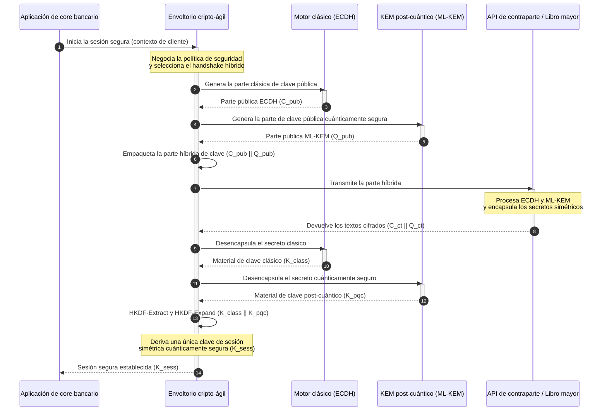

# KyberLib y la migración post-cuántica de la banca en 2026: de estándares a código

<!-- lead-start: manual -->
<aside class="post-lead" aria-label="Resumen del artículo">

<strong>En resumen.</strong> La infraestructura bancaria afronta en 2026 una amenaza sistémica con un desenlace conocido: la computación a escala cuántica romperá el intercambio de claves RSA y ECC que protege el tráfico en tránsito de hoy. Los estándares federales y los documentos de política supervisora han elevado la concienciación; la ejecución técnica sigue fragmentada en silos. <a href="https://github.com/sebastienrousseau/kyberlib">KyberLib</a> es un plano de ingeniería de código abierto que lleva la narrativa post-cuántica a código Rust concreto y seguro en memoria — implementa ML-KEM (FIPS 203), estandarizado por el NIST, tras fronteras de abstracción cripto-ágiles, de modo que las entidades puedan reforzar la seguridad del transporte y el encapsulamiento de claves antes de que los ataques «Store Now, Decrypt Later» alcancen sus archivos.

<strong>Conclusiones clave</strong>

<ul class="post-lead-takeaways">
  <li><strong>De la política al código inspeccionable.</strong> KyberLib lleva la criptografía post-cuántica de las hojas de ruta estratégicas abstractas a implementaciones Rust concretas, auditables y de alto rendimiento.</li>
  <li><strong>Ejecución estandarizada de ML-KEM FIPS 203.</strong> La biblioteca implementa ML-KEM — el algoritmo de establecimiento de claves finalizado bajo NIST FIPS 203 — y mantiene la conformidad alineada con las expectativas regulatorias globales.</li>
  <li><strong>Cripto-agilidad por diseño.</strong> Unas fronteras de abstracción estables permiten a las aplicaciones bancarias sustituir primitivas criptográficas sin reescrituras costosas y propensas a errores.</li>
  <li><strong>Seguridad de memoria con Rust.</strong> Las reglas de propiedad en tiempo de compilación erradican los desbordamientos de búfer y las fugas de memoria que lastran las bibliotecas criptográficas heredadas en C, a velocidad de abstracción de coste cero.</li>
  <li><strong>Mitigación de la responsabilidad fiduciaria.</strong> Una evidencia de migración observable y verificable da a los consejeros el registro de «medidas razonables» que exigen las auditorías de responsabilidad personal del artículo 5 de DORA.</li>
</ul>

<strong>Lecturas relacionadas:</strong> <a href="/2026-05-18-quantum-cryptography-standards-developments-2026/">Estándares de criptografía cuántica 2026</a>, <a href="/2026-05-28-dora-ai-act-data-sovereignty-banking-compliance-stack-2026/">Stack de cumplimiento DORA + AI Act</a>, <a href="/2026-05-20-cloud-native-banking-financial-institutions-2026/">Banca cloud-native</a>.

</aside>
<!-- lead-end -->

La migración post-cuántica dejó de ser un ejercicio de planificación. En 2026 es un requisito operativo activo, y la brecha entre la intención regulatoria y la ejecución de ingeniería es donde reside ahora el riesgo. [KyberLib ⧉](https://github.com/sebastienrousseau/kyberlib "kyberlib") cierra parte de esa brecha: una biblioteca Rust orientada a producción y segura en memoria que implementa ML-KEM con los parámetros finalizados de FIPS 203 y lo envuelve en las fronteras cripto-ágiles que el parque transaccional de un banco necesita de verdad.

---

> **Resumen ejecutivo / conclusiones clave**
>
> - **La amenaza ya es operativa.** Los adversarios ejecutan hoy la recolección «Store Now, Decrypt Later»; la confidencialidad de los datos falla de forma retroactiva el día que llegue un ordenador cuántico criptográficamente relevante.
> - **Los estándares están finalizados.** NIST FIPS 203 (ML-KEM) y FIPS 204 (ML-DSA) dan a los comités de auditoría un referente claro y verificable — ya no existe la defensa de «estamos esperando los estándares».
> - **KyberLib es el plano de ingeniería.** Rust seguro en memoria, compilación `no_std` para HSM y tarjetas inteligentes, y patrones de handshake híbrido que preservan la interoperabilidad clásica.
> - **La cripto-agilidad es el objetivo duradero.** Unas fronteras de abstracción estables permiten cambiar primitivas sin reescribir aplicaciones — la lección que sobrevive a cualquier algoritmo concreto.
> - **Los consejos cargan con la responsabilidad.** El artículo 5 de DORA impone responsabilidad personal a los consejeros; el código de migración inspeccionable y observable es la evidencia que la satisface.
>
---

## Por qué este proyecto de código abierto importa en 2026

A medida que la criptografía asimétrica se acerca a la obsolescencia, la amenaza no espera a que se construya un ordenador cuántico criptográficamente relevante. Los adversarios ejecutan ya ataques **«Store Now, Decrypt Later» (SNDL)**: recolectan flujos cifrados en tránsito de transacciones de banca corporativa, secretos comerciales y comunicaciones institucionales con la intención de descifrarlos cuando maduren las capacidades cuánticas. Para un banco, cada handshake clásico que circula hoy por la red es una brecha de confidencialidad con fecha de detonación diferida.

Los reguladores han respondido con obligaciones concretas:

1. **El artículo 6 de DORA (gestión del riesgo TIC)** exige a las entidades mapear, identificar y mitigar las vulnerabilidades de todo su parque criptográfico — incluido el intercambio asimétrico de claves enterrado en middleware que nadie ha inventariado.
2. **NIST FIPS 203 y 204** establecen los estándares post-cuánticos oficiales para el encapsulamiento de claves (ML-KEM) y las firmas digitales (ML-DSA), y dan a los comités de auditoría un referente estandarizado contra el que medir el avance de la migración.

Ejecutar esta migración sin interrumpir las operaciones en vivo exige ir más allá de los documentos de política hacia una **infraestructura criptográfica de código abierto e inspeccionable**. [KyberLib ⧉](https://github.com/sebastienrousseau/kyberlib "kyberlib") ofrece exactamente eso: una biblioteca Rust segura en memoria y conforme a FIPS 203 que convierte la transición post-cuántica en un pipeline de ingeniería medible y verificable — y desplaza la conversación sobre inversión tecnológica hacia un retorno de resiliencia tangible.

## Lente arquitectónica

KyberLib se sitúa tras fronteras de API estables y aísla las aplicaciones transaccionales centrales de un banco de los cambios en las primitivas criptográficas de bajo nivel.

| Capa | Decisión de diseño | Por qué importa | Riesgo si se gestiona mal |
|---|---|---|---|
| **Primitiva** | Encapsulamiento de clave ML-KEM FIPS 203 | Sustituye el intercambio de claves clásico Diffie-Hellman y RSA por estructuras basadas en retículos | No conformidad con los parámetros finalizados de FIPS 203, con auditorías de cumplimiento fallidas |
| **Lenguaje** | Implementación en Rust segura en memoria | Elimina las vulnerabilidades de corrupción de memoria (desbordamientos de búfer, use-after-free) endémicas de C/C++ | Proliferación de dependencias que compromete la integridad de la cadena de compilación |
| **Abstracción** | Fronteras cripto-ágiles estables | Las aplicaciones cambian de algoritmo tras una interfaz unificada a medida que evolucionan los estándares | Primitivas cableadas en duro que fuerzan reescrituras manuales en cada migración futura |
| **Despliegue** | Handshakes de cifrado híbrido | Combina KEM post-cuánticos con algoritmos clásicos en un sobre de doble envoltura | Pérdida de interoperabilidad heredada o deriva de configuración silenciosa |
| **Aseguramiento** | Procedencia SLSA Level 3 y pruebas inspeccionables | Garantiza el origen y la procedencia del código; los ejemplos pueden auditarse línea a línea | Teatro de seguridad — bibliotecas de caja negra cuyos errores de implementación afloran en producción |

## Señales operativas que seguir

Demostrar el cumplimiento post-cuántico ante consejos supervisores y reguladores significa seguir métricas específicas y cuantificables:

| Señal | Métrica | Referencia regulatoria | Implementación en plataforma |
|---|---|---|---|
| **Conformidad ML-KEM FIPS 203** | Cumplimiento del 100 % con los parámetros finalizados (ML-KEM-512/768/1024) | NIST FIPS 203 | Criptografía de retículos con parámetros verificados compilada dentro de los módulos de KyberLib |
| **Inventario criptográfico** | Inventario completo del uso de intercambio asimétrico de claves en todos los sistemas | NIST SP 1800-38 | Agentes de escaneo automatizado que registran las suites de cifrado activas en un registro central |
| **Intercambio híbrido de claves** | Porcentaje de handshakes de la capa de transporte ejecutados en un sobre híbrido | Artículo 6 de DORA | Proxies de red que envuelven handshakes TLS 1.3 clásicos en encapsulamiento PQC |
| **Compilación `no_std`** | Capacidad de compilar sin la biblioteca estándar de Rust para objetivos restringidos | Artículo 30 de DORA | Compilación condicional `no_std` en KyberLib para módulos de seguridad hardware (HSM) |
| **Índice de cripto-agilidad** | Tiempo en minutos para sustituir una primitiva criptográfica en la pasarela de API | UK PRA SS1/23 | Registros de enrutamiento abstraídos que gestionan la asignación de algoritmos mediante variables de runtime |

## Por qué Rust importa para la criptografía post-cuántica

Implementar algoritmos post-cuánticos como ML-KEM exige operaciones matemáticas complejas de bajo nivel sobre anillos de polinomios. Históricamente, ejecutar esas operaciones a velocidad de producción significaba C/C++ o ensamblador escritos a mano — una gran superficie de ataque para la corrupción de memoria, precisamente en el código que un banco menos puede permitirse hacer mal.

Rust cambia la postura de seguridad de la ingeniería criptográfica de tres maneras concretas:

1. **Seguridad de memoria en tiempo de compilación.** El modelo de propiedad de Rust garantiza que los desbordamientos de búfer, las liberaciones dobles y los errores use-after-free quedan prevenidos en tiempo de compilación. Esto importa de forma aguda en las bibliotecas post-cuánticas, donde los tamaños de clave y los textos cifrados son significativamente mayores que sus equivalentes clásicos.
2. **Abstracciones deterministas de coste cero.** Rust compila a código máquina nativo sin recolector de basura, de modo que la velocidad de ejecución y la huella de memoria igualan o superan a las bibliotecas basadas en C, preservando la seguridad.
3. **Compatibilidad `no_std`.** KyberLib compila sin la biblioteca estándar de Rust, por lo que funciona en entornos restringidos y bare-metal — módulos de seguridad hardware (HSM) y tarjetas inteligentes incluidos — y mantiene la criptografía de grado bancario dentro de las fronteras de seguridad física.

## Diseñar una arquitectura cripto-ágil

El modo de fallo clásico de las migraciones criptográficas es el cableado en duro: supuestos específicos de algoritmo incrustados directamente en la lógica de aplicación, redescubiertos dolorosamente en cada transición. El objetivo duradero para 2026 es la **cripto-agilidad** — una capa de abstracción que trata los algoritmos como módulos intercambiables tras una interfaz estable, de modo que la próxima migración sea un cambio de configuración y no una reescritura de todo el parque.

La secuencia siguiente muestra cómo el envoltorio cripto-ágil de KyberLib coordina un handshake híbrido (clásico más post-cuántico) de intercambio de claves:

El sobre híbrido es el detalle operativamente importante. Hasta que las primitivas post-cuánticas acumulen años de escrutinio en producción, la clave de sesión se deriva tanto del secreto clásico como del post-cuántico: un atacante debe romper ECDH **y** ML-KEM para recuperar el canal. Las contrapartes que no han migrado siguen funcionando; las que sí lo han hecho obtienen de inmediato protección basada en retículos.

## El manual del consejo de administración

La seguridad post-cuántica no es un asunto de cifrado de back-office; es una cuestión de gobernanza del consejo con consecuencias personales. Los altos directivos deben encuadrar la migración en términos de responsabilidad fiduciaria:

- **El artículo 5 de DORA (gobernanza y organización)** impone al consejo de administración la responsabilidad personal sobre la seguridad TIC. Las pruebas de código abierto y observables son la evidencia directa que pide una auditoría de responsabilidad personal — «seleccionamos una implementación inspeccionable de FIPS 203 y aquí están sus ejecuciones de conformidad» es una respuesta defendible; «nuestro proveedor nos lo aseguró» no lo es.
- **La gestión del riesgo de modelos (SR 11-7 de la Fed estadounidense / SS1/23 de la PRA británica)** se aplica a las arquitecturas de envoltorios criptográficos tanto como a los modelos de valoración. Las capas de abstracción deben pasar por la validación de riesgo de modelos, incluido el rendimiento en escenarios de disrupción extrema.
- **El capital por riesgo operacional de Basel III** premia la madurez de control demostrada. Los handshakes híbridos probados reducen el perfil de riesgo operacional a largo plazo de la entidad, recortan la prima de capital y liberan capacidad de balance para el despliegue activo de tesorería.

## Lo que esto significa según el tipo de banco

### Bancos de importancia sistémica global (G-SIB)

Los G-SIB operan parques transaccionales cargados de sistemas heredados, así que su restricción vinculante es el descubrimiento: saber dónde ocurre realmente el intercambio asimétrico de claves. Los inventarios criptográficos continuos bajo la guía de NIST SP 1800-38 van primero; KyberLib aporta después la biblioteca estandarizada y segura en memoria para ejecutar el encapsulamiento post-cuántico de claves en cada nodo moderno que el inventario haga aflorar.

### Banca transaccional y corporativa

La confidencialidad en los raíles de pago es la franquicia. Como KyberLib compila para objetivos `no_std` bare-metal, los bancos transaccionales pueden desplegar handshakes post-cuánticos directamente dentro del hardware de enrutamiento de pagos y gestión de liquidez en el extremo de la red — no solo en la capa de aplicación.

### Bancos regionales y de menor tamaño

Las entidades regionales afrontan la misma recolección patrocinada por Estados sin los presupuestos de investigación de un G-SIB. Una implementación Rust de código abierto e inspeccionable les da una vía llave en mano hacia la conformidad con NIST FIPS 203 de inmediato, sin negociar hojas de ruta de proveedor de caja negra.

## De las hojas de ruta al código que compila

La transición post-cuántica es una tarea de ingeniería activa, y las entidades que conserven la confianza de supervisores, contrapartes y tesoreros corporativos a lo largo de 2026 son las que pasen de hojas de ruta abstractas a código observable que compila. El mandato ejecutivo se deduce directamente: auditar los puntos heredados de intercambio de claves, desplegar handshakes híbridos en los canales de mayor valor y construir las fronteras de abstracción estables que conviertan en rutina cada futura sustitución de primitivas. KyberLib hace de cada uno de esos pasos una capacidad operativa medible y no un compromiso de diapositivas.

## Preguntas frecuentes

**¿Es KyberLib conforme con los estándares finalizados del NIST?**

Sí. KyberLib está diseñada en torno a los parámetros de ML-KEM tal como quedaron finalizados en FIPS 203, lo que mantiene la biblioteca compilada alineada con las expectativas regulatorias federales y globales.

**¿Requiere una biblioteca post-cuántica hardware especializado?**

No. La implementación Rust de KyberLib compila para arquitecturas de sistema estándar. Su capacidad `no_std` le permite además funcionar en módulos de seguridad hardware (HSM) especializados y en tarjetas inteligentes donde se exige la custodia física de claves.

**¿Cómo afecta «Store Now, Decrypt Later» al cumplimiento actual?**

Si la capa de transporte depende de RSA o ECC clásicos, los adversarios pueden recolectar tráfico hoy y descifrarlo cuando madure la capacidad cuántica. El intercambio híbrido de claves desplegado ahora mantiene los datos capturados tras protección basada en retículos.

**¿Por qué handshakes híbridos en lugar de pasar directamente a primitivas post-cuánticas?**

Los sobres híbridos derivan la clave de sesión de un secreto clásico y de otro post-cuántico, de modo que la seguridad se mantiene salvo que ambos se rompan. Eso preserva la interoperabilidad con contrapartes no migradas mientras las nuevas primitivas acumulan escrutinio en producción.

## Referencias

- National Institute of Standards and Technology, (2024). [FIPS 203: estándar de mecanismo de encapsulamiento de claves basado en retículos modulares ⧉](https://www.nist.gov/news-events/news/2024/08/nist-releases-first-3-finalized-post-quantum-encryption-standards "Anuncio de NIST FIPS 203").
- Board of Governors of the Federal Reserve System, (2011). [Guía supervisora sobre la gestión del riesgo de modelos (SR Letter 11-7) ⧉](https://www.federalreserve.gov/supervisionreg/srletters/sr1107.htm "Federal Reserve SR 11-7").
- European Parliament and Council of the European Union, (2022). [Reglamento (UE) 2022/2554 sobre la resiliencia operativa digital del sector financiero (DORA) ⧉](https://eur-lex.europa.eu/legal-content/EN/TXT/?uri=CELEX%3A32022R2554 "Reglamento DORA").
- NIST National Cybersecurity Center of Excellence, (2025). [Migración a la criptografía post-cuántica (NIST SP 1800-38) ⧉](https://www.nccoe.nist.gov/projects/migration-post-quantum-cryptography "NIST SP 1800-38").
- GitHub, (2026). [repositorio de código abierto kyberlib ⧉](https://github.com/sebastienrousseau/kyberlib "Repositorio kyberlib").

<!-- enrich-start -->
<aside class="author-card" aria-label="Acerca del autor"><strong class="author-card-name"><a href="/about/index.html">Sebastien Rousseau</a></strong>Tecnólogo bancario sénior, escribe sobre IA aplicada, infraestructura de pagos, dinero tokenizado, ISO 20022, seguridad postcuántica, servicios financieros cloud-native y mercados digitales regulados.Más de 20 años en HSBC Commercial &amp; Investment Bank, PayPal, Barclays, Shazam, AKQA, Virgin Group. <a href="/about/index.html">Perfil completo</a> &middot; <a href="https://www.linkedin.com/in/sebastienrousseau/" rel="external noopener">LinkedIn</a> &middot; <a href="https://github.com/sebastienrousseau" rel="external noopener">GitHub</a></aside>

Última revisión <time datetime="2026-06-12">2026-06-12</time>.

<!-- enrich-end -->
