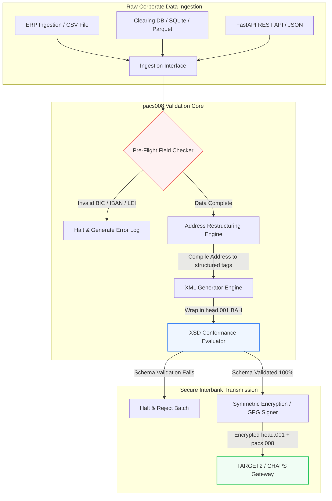

---

# Front Matter (YAML)

author: "contact@sebastienrousseau.com (Sebastien Rousseau)"
banner_alt: "Empleada de oficina con asistente de voz y portátil — símbolo de los mensajes interbancarios estructurados y legibles por máquina que la automatización de pacs.008 vuelve programables"
banner_height: "1597"
banner_width: "2584"
banner: "https://cloudcdn.pro/stocks/images/tyler-prahm-lmV3gJSAgbo.webp"
cdn: "https://cloudcdn.pro"
charset: "UTF-8"
cname: "sebastienrousseau.com"
copyright: "© Copyright 2025 - 2026 - Sebastien Rousseau. All rights reserved."
date: "June 15, 2026"
description: "Pacs008 es una librería Python de código abierto que automatiza la generación y validación de pacs.008 FI-to-FI: dirección estructurada, BAH head.001, control de BIC/LEI/IBAN y trazas UETR con OpenTelemetry."
format-detection: "telephone=no"
hreflang: "es"
icon: "https://cloudcdn.pro/clients/sebastienrousseau/v1/logos/sebastienrousseau.svg"
id: "https://sebastienrousseau.com/2026-06-15-pacs008-automation-iso-20022-interbank-payments-2026"
image_alt: "Retrato en blanco y negro de Sebastien Rousseau"
image_height: "162"
image_width: "162"
image: "https://cloudcdn.pro/stocks/images/sebastienrousseau.webp"
keywords: "pacs008, ISO 20022 pacs.008, transferencia de crédito de cliente FI-to-FI, dirección estructurada, SWIFT CBPR+, BAH head.001, TARGET2, CHAPS, Fedwire, DORA, BCBS 239, Basel III, UETR, validación de LEI, SEPA VoP"
language: "es-ES"
last_reviewed: "2026-06-15"
layout: "report"
locale: "es_ES"
logo_alt: "Logotipo de Sebastien Rousseau"
logo_height: "44"
logo_width: "44"
logo: "https://cloudcdn.pro/clients/sebastienrousseau/v1/logos/sebastienrousseau.svg"
menu: ""
measurementID: "G-169G4ET5HQ"
name: "Sebastien Rousseau"
permalink: "https://sebastienrousseau.com/2026-06-15-pacs008-automation-iso-20022-interbank-payments-2026"
rating: "general"
referrer: "no-referrer"
robots: "index, follow"
schema: "FAQPage, Article"
seo_title: "Automatización pacs.008 para la era ISO 20022"
short_name: "sebastienrousseau"
subtitle: "El mensaje pacs.008 es donde convergen los datos interbancarios, las direcciones estructuradas, el cumplimiento, el enrutamiento y las operaciones de liquidación."
tags: "pacs008, ISO 20022, pagos interbancarios, pagos mayoristas, Python"
theme-color: "0, 83, 191"
title: "Construir la automatización de pacs.008 para la era interbancaria ISO 20022 en 2026"
url: "https://sebastienrousseau.com/2026-06-15-pacs008-automation-iso-20022-interbank-payments-2026"
viewport: "width=device-width, initial-scale=1, shrink-to-fit=no"

# RSS - The RSS feed front matter (YAML).
atom_link: "https://sebastienrousseau.com/2026-06-15-pacs008-automation-iso-20022-interbank-payments-2026/rss.xml"
category: "Finance"
docs: https://validator.w3.org/feed/docs/rss2.html
generator: "Static Site Generator (SSG) (version 0.0.26)"
item_description: "Pacs008 ofrece una base Python de código abierto para automatizar mensajes ISO 20022 FI-to-FI de transferencia de crédito de cliente en la era de los pagos interbancarios."
item_guid: "https://sebastienrousseau.com/2026-06-15-pacs008-automation-iso-20022-interbank-payments-2026/rss.xml"
item_link: "https://sebastienrousseau.com/2026-06-15-pacs008-automation-iso-20022-interbank-payments-2026/rss.xml"
item_pub_date: "Mon, 15 Jun 2026 06:06:06 +0000"
item_title: "Construir la automatización de pacs.008 para la era interbancaria ISO 20022 en 2026"
last_build_date: "Mon, 15 Jun 2026 06:06:06 +0000"
managing_editor: "contact@sebastienrousseau.com (Sebastien Rousseau)"
pub_date: "Mon, 15 Jun 2026 06:06:06 +0000"
ttl: "60"
type: "article"
webmaster: "contact@sebastienrousseau.com"

# Apple - The Apple front matter (YAML).
apple_mobile_web_app_orientations: "portrait"
apple_touch_icon_sizes: "192x192"
apple-mobile-web-app-capable: "yes"
apple-mobile-web-app-status-bar-inset: "black"
apple-mobile-web-app-status-bar-style: "black-translucent"
apple-mobile-web-app-title: "Automatización pacs.008 ISO 20022"
apple-touch-fullscreen: "yes"

# MS Application - The MS Application front matter (YAML).

msapplication-navbutton-color: "0, 83, 191"

# Twitter Card - The Twitter Card front matter (YAML).

twitter_card: "summary_large_image"
twitter_creator: "@wwdseb"
twitter_description: "Pacs008 ofrece una base Python de código abierto para automatizar mensajes ISO 20022 FI-to-FI de transferencia de crédito de cliente en la era de los pagos interbancarios."
twitter_image: "https://cloudcdn.pro/clients/sebastienrousseau/v1/logos/sebastienrousseau.svg"
twitter_image_alt: "Logotipo de Sebastien Rousseau"
twitter_site: "@wwdseb"
twitter_title: "Automatización pacs.008 para la era ISO 20022"
twitter_url: "https://sebastienrousseau.com/2026-06-15-pacs008-automation-iso-20022-interbank-payments-2026"

excerpt: "pacs008 es un toolkit Python de código abierto que hace programables los mensajes ISO 20022 pacs.008 FI-to-FI: dirección estructurada, validación, enrutamiento, ganchos de cumplimiento y la fecha límite SWIFT de noviembre de 2026 ya incorporada por defecto."

# Humans.txt - The Humans.txt front matter (YAML).
author_website: "https://sebastienrousseau.com"
author_twitter: "@wwdseb"
author_location: "London, UK"
thanks: "¡Gracias por leer!"
site_last_updated: "2026-06-15"
site_standards: "HTML5, CSS3, RSS, Atom, JSON, XML, YAML, Markdown, TOML"
site_components: "Kaishi, Kaishi Builder, Kaishi CLI, Kaishi Templates, Kaishi Themes"
site_software: "Static Site Generator, Rust"

---

# Automatizar los pagos interbancarios ISO 20022 pacs.008 con Python de código abierto en 2026

<!-- lead-start -->
<aside class="post-lead" aria-label="Resumen del artículo">

<strong>En síntesis.</strong> Bajo las directrices CBPR+ de SWIFT, el corte de dirección estructurada del 14 de noviembre de 2026 retira las direcciones postales no estructuradas en TARGET2, CHAPS, Fedwire, Lynx y SEPA. Pacs008 es una librería Python de código abierto que automatiza la generación y validación de mensajes ISO 20022 FI-to-FI de transferencia de crédito de cliente (pacs.008), envuelve los pagos en cabeceras BAH (head.001) e integra el cumplimiento de dirección estructurada en la ruta del dato antes de que el mensaje llegue a la red de compensación.

<strong>Conclusiones clave</strong>

<ul class="post-lead-takeaways">
  <li><strong>La fecha límite de dirección estructurada es absoluta.</strong> A partir del 14 de noviembre de 2026, los bloques de dirección no estructurada quedan retirados. Pacs008 impone los elementos postales estructurados (<code>&lt;TwnNm&gt;</code>, <code>&lt;Ctry&gt;</code>, <code>&lt;PstCd&gt;</code>) en la compilación del dato para evitar rechazos en el borde.</li>
  <li><strong>Orquestación unificada del mensaje.</strong> Envuelve la carga útil pacs.008 en un sobre Business Application Header (head.001) conforme, ofreciendo un modelo estándar de procesamiento de ida y vuelta.</li>
  <li><strong>Integridad algorítmica.</strong> Validadores integrados para BIC e Identificadores de Entidad Legal (LEI) mediante cálculos de suma de control ISO 7064 Modulo 97-10.</li>
  <li><strong>Trazabilidad de nivel DORA.</strong> Instrumentación OpenTelemetry completa con clave en el Unique End-to-End Transaction Reference (UETR) para registros de auditoría en tiempo real y firmas criptográficas de auditoría.</li>
  <li><strong>Preservación fiduciaria a nivel de consejo.</strong> Alinea la exactitud del mensaje interbancario con el artículo 5 de DORA, los informes BCBS 239 y el ahorro de capital de riesgo operacional bajo Basel III.</li>
</ul>

<strong>Lecturas relacionadas:</strong> <a href="https://sebastienrousseau.com/2026-05-19-global-wholesale-payments-economics-2026">Pagos mayoristas globales en 2026: ISO 20022, renovación RTGS y la economía de la interoperabilidad</a>, <a href="https://sebastienrousseau.com/2026-05-27-ai-operating-system-payments-fraud-routing-resilience-compliance-2026">La IA como sistema operativo de los pagos: fraude, enrutamiento, resiliencia y cumplimiento en 2026</a>, <a href="https://sebastienrousseau.com/2026-05-12-iso-20022-pacs008-structured-address-deadline">La fecha límite de pacs.008 de noviembre de 2026 sobre dirección estructurada: una vista a seis meses</a>.

</aside>
<!-- lead-end -->

Cerrar la brecha entre los datos financieros heredados y la mensajería interbancaria estructurada mediante un pipeline Python auditable y validado contra esquema.

La referencia de código abierto de este artículo es [pacs008 ⧉](https://github.com/sebastienrousseau/pacs008 "pacs008 — librería Python de código abierto"). El repositorio se posiciona como una librería Python para automatizar los mensajes XML ISO 20022 pacs.008 FI-to-FI de transferencia de crédito de cliente.

## Por qué este proyecto de código abierto importa en 2026

La infraestructura mundial de compensación de pagos interbancarios atraviesa la modernización más profunda en casi medio siglo.

En junio de 2026, el sector de servicios financieros se acerca rápidamente al **corte de dirección estructurada de SWIFT del 14 de noviembre de 2026**. Desde esa fecha, las directrices CBPR+ de SWIFT, junto con TARGET2, CHAPS, Fedwire y el canadiense Lynx, retirarán oficialmente las líneas de dirección postal no estructuradas (uso exclusivo de `<AdrLine>` dentro de bloques `<PstlAdr>`). Todas las entidades financieras participantes deberán transmitir las direcciones en formato híbrido (`<TwnNm>` y `<Ctry>` estructurados, con un máximo de dos elementos `<AdrLine>` para detalles residuales) o totalmente estructurado (elementos individuales para nombre de calle, número de edificio y código postal). Cualquier mensaje que no cumpla este criterio será rechazado en el borde de la red.

Para las entidades financieras, esta transición impone restricciones operativas relevantes:

1. **La penalización por rechazo en el borde.** Los pagos que no cumplan los criterios de dirección estructurada sufrirán rechazos inmediatos en la red, con retrasos en las operaciones, bloqueos de liquidez y atascos operativos.
2. **Verification of Payee (VoP) de SEPA.** Obliga a todos los Proveedores de Servicios de Pago (PSP) dentro de la zona SEPA a verificar que el nombre del beneficiario coincide con el IBAN antes de ejecutar las transferencias de crédito, añadiendo otro filtro de validación a la iniciación del mensaje.

[Pacs008](https://github.com/sebastienrousseau/pacs008) resuelve este problema. Es una librería Python ligera y de código abierto que automatiza la conversión de datos financieros en bruto en mensajes ISO 20022 pacs.008 de transferencia de crédito de cliente interbancaria totalmente validados y conformes a esquema. Al cerrar la brecha entre el dato heredado y el dato estructurado, pacs008 entrega un alto Retorno de la Resiliencia (RoR), preservando capital de trabajo y asegurando la ejecución en tiempo real en las vías globales.

## La lente de arquitectura pacs008 2026

La librería pacs008 se estructura como un motor aislado de validación y generación, que asegura que los datos en bruto se analizan, enriquecen y envuelven sistemáticamente en sobres estándar:

| Capa | Decisión de diseño | Por qué importa | Riesgo si se gestiona mal |
|---|---|---|---|
| **Capa de entrada** | Ingesta de CSV, JSON, SQLite y Parquet | Encuentra a los equipos de integración bancaria donde ya residen sus datos, evitando migraciones de plataforma. | Ingesta de cargas de datos en bruto, sin validar o corruptas. |
| **Capa de validación** | Validación previa contra esquemas XSD oficiales y reglas de negocio personalizadas | Detiene la ejecución y señala los errores antes de transmitir el archivo de pago a la red de compensación. | Archivos XML inválidos que provocan rechazos inmediatos en red y retrasos en la compensación. |
| **Capa de sobre BAH** | Envoltura automática de Business Application Header (head.001) | Estandariza el envío y el enrutamiento del mensaje sobre la base de la etiqueta `<MsgDefIdr>`. | Transmitir cargas pacs.008 en bruto sin el sobre externo requerido, lo que provoca el rechazo del sistema. |
| **Capa de serialización** | Soporte de XML estándar y JSON conforme a ISO (TS 23029) | Permite la traducción directa entre cargas XML y JSON, dando soporte a REST APIs modernas y a streaming Kafka. | Representaciones de dato fragmentadas que violan las directrices ISO oficiales. |
| **Capa de observabilidad** | Trazado OpenTelemetry con clave en el UETR | Captura rutas de ejecución y registros detallados, ofreciendo auditabilidad en tiempo real. | Lagunas de trazado que bloquean la visibilidad operativa y la auditoría. |

## Señales interbancarias clave e hitos regulatorios

Para demostrar resiliencia operativa transaccional, los responsables sénior de tecnología y riesgo deben seguir indicadores de cumplimiento concretos y cuantificables:

| Señal | Métrica / referencia operativa | Referencia G20 / SWIFT / DORA | Implementación en la plataforma técnica |
|---|---|---|---|
| **Cumplimiento de dirección estructurada** | % de mensajes pacs.008 que utilizan campos `<PstlAdr>` totalmente estructurados con `<TwnNm>` y `<Ctry>` designados. | Fecha límite SWIFT SR 2026 | Comprobaciones de esquema previas en pacs008 que rechazan las líneas de dirección no estructuradas. |
| **Verification of Payee SEPA** | Validación de coincidencia entre el nombre del beneficiario y el IBAN antes de la ejecución del mensaje. | Reglamento SEPA VoP | Clases auxiliares VoP integradas que ejecutan consultas de prevalidación sobre IBAN/BIC. |
| **Integración BAH head.001** | Porcentaje de cargas de pago salientes envueltas con éxito en Business Application Headers. | Directrices TARGET2 / CBPR+ | Subsistema de envoltura BAH que compila automáticamente el sobre XML externo. |
| **Suma de control Modulo LEI** | Validación de dígito de control ISO 7064 Modulo 97-10 sobre los bloques `<LEI>` de deudor y acreedor. | Mandato del Bank of England | Comprobador algorítmico que verifica la integridad del identificador de 20 caracteres. |
| **Exactitud del trazado UETR** | 100% de los pagos generados inyectados con un Unique End-to-End Transaction Reference válido. | Especificaciones UETR de SWIFT | Generación y trazado automáticos del código de referencia UUIDv4 de 36 caracteres. |

## Por qué Python es la rampa de entrada idónea para la automatización interbancaria

En 2026, los hubs de pago modernos y los equipos de operaciones de tesorería dependen fuertemente de Python para la transformación de datos, la modelización financiera y la integración con bases de datos ERP.

Al apoyarse en una librería Python de código abierto, las entidades obtienen ventajas significativas:

1. **Baja carga cognitiva y alta interoperabilidad.** Python actúa como puente cohesivo. Permite a los desarrolladores escribir scripts simples que extraen instrucciones de pago en bruto desde bases de datos heredadas, las validan contra reglas bancarias internacionales complejas y emiten XML conforme dentro de un único flujo unificado.
2. **Eliminación de traductores opacos "caja negra".** Los portales bancarios propietarios suelen cobrar altas tarifas de licencia por traductores de archivos de pago a medida. Esos traductores son cajas negras propietarias, lo que impide a los equipos de seguridad auditar cómo se procesan los datos o dónde se almacenan las claves. Una librería de código abierto e inspeccionable como pacs008 garantiza la transparencia total del código.
3. **Integración fluida con CI/CD.** Pacs008 se integra directamente en los pipelines de integración y despliegue continuos, permitiendo a los desarrolladores automatizar las pruebas de archivos de pago como parte de su ciclo estándar de entrega de software.

## Diseño de un pipeline interbancario acotado

Una vulnerabilidad importante en la compensación interbancaria es la "generación de lotes descontrolada": producir archivos sin un bucle de verificación claramente acotado. Pacs008 está diseñado para operar como el motor de validación nuclear dentro de un pipeline transaccional estrictamente controlado y de varias etapas.

El flujo operativo siguiente muestra cómo los datos transaccionales en bruto atraviesan el pipeline pacs008 para generar un archivo pacs.008 criptográficamente seguro y conforme a esquema, envuelto en un sobre BAH:

## Manual del consejo y responsabilidad fiduciaria

La automatización de pagos interbancarios es una cuestión de gestión de riesgos y gobierno corporativo a nivel de consejo. Los directivos sénior deben abordar la calidad del dato transaccional desde la responsabilidad fiduciaria y la reducción del riesgo operativo:

- **DORA artículo 5 (responsabilidad del consejo).** Impone responsabilidad directa y personal a los miembros del consejo sobre la resiliencia y la seguridad de las operaciones TIC de la entidad. Dado que la compensación interbancaria es una función corporativa crítica, los consejos deben demostrar que han implantado controles transaccionales robustos, validados y automatizados para evitar interrupciones operativas o retrasos en los pagos.
- **BCBS 239 (agregación y reporte de datos de riesgo).** Exige que el reporte de transacciones financieras sea exacto, completo y generado en tiempo real. Pacs008 ayuda a las entidades a cumplir BCBS 239 asegurando que el dato de pago está limpio, estructurado y validado en el origen, eliminando las lagunas de dato y los errores manuales de conciliación que asolan las hojas de cálculo heredadas.
- **Mitigación de las cargas de capital por riesgo operacional (Basel III).** Bajo las directrices de Basel III, las altas tasas de error en los pagos y el coste de la intervención manual elevan los requisitos de capital por riesgo operacional del banco, inmovilizando capital que podría destinarse a préstamo o inversión. Automatizar el pipeline de pagos minimiza directamente esas primas de capital, preservando el valor del balance.

## Qué significa por tipo de banco

### Bancos de importancia sistémica global (G-SIB)

Los G-SIB gestionan volúmenes transaccionales corporativos masivos y transfronterizos. Su reto principal es la remediación del dato heredado no estructurado antes de que llegue a la red de compensación. Al integrar pacs008 en sus pasarelas de banca corporativa, los G-SIB pueden ofrecer utilidades automatizadas de validación a sus clientes corporativos, reduciendo el coste de las reparaciones manuales de pago y asegurando la ejecución en tiempo real en la red SWIFT.

### Bancos de transacción y banca corporativa

Para los bancos de transacción, la calidad del dato de pago es un diferenciador competitivo. Al ofrecer una herramienta de validación abierta e inspeccionable como pacs008 a los clientes de tesorería corporativa, estos bancos pueden acelerar el onboarding, minimizar los rechazos de archivos de pago y construir confianza de cliente con tasas de straight-through processing superiores.

### Bancos regionales y de menor tamaño

Los bancos regionales deben mantener el cumplimiento de los estándares internacionales de pago sin los presupuestos tecnológicos masivos de los G-SIB. Pacs008 aporta una solución basada en Python ligera, rentable y totalmente conforme, permitiendo a las entidades más pequeñas ofrecer capacidades modernas de iniciación de pagos estructurados sin caras licencias de middleware propietario.

## Conclusión: la hoja de ruta de la compensación interbancaria

La próxima fecha límite de SWIFT de noviembre de 2026 sobre dirección estructurada marca un límite firme para las operaciones de tesorería corporativa. Apoyarse en hojas de cálculo heredadas, entrada manual de datos y archivos de pago no estructurados es un riesgo de negocio activo.

Para asegurar la continuidad transaccional y minimizar el coste operativo, los responsables sénior de tecnología y finanzas deben ejecutar hoy una hoja de ruta de compensación clara:

1. **Imponer la validación en el origen.** Exigir que todas las instrucciones de pago se validen y formateen conforme a los esquemas XSD oficiales de ISO 20022 antes de abandonar el perímetro del ERP corporativo.
2. **Auditar el pipeline de dato.** Abandonar el procesamiento manual con hojas de cálculo e implantar flujos automatizados e inspeccionables basados en Python con pacs008.
3. **Implantar seguridad híbrida.** Asegurar que los archivos de pago generados se firman criptográficamente y se cifran antes de la transmisión, satisfaciendo las expectativas de redes de confianza cero.
4. **Alinear con prioridades fiduciarias.** Reportar formalmente las métricas de automatización y calidad de dato de pago al consejo, encuadrando la inversión como programa crítico de reducción de riesgo operativo bajo DORA.

## Preguntas frecuentes

**¿Es pacs008 conforme con las próximas reglas de dirección de SWIFT SR 2026?**

Sí. Pacs008 está diseñado para soportar el estricto hito de dirección estructurada de SWIFT de noviembre de 2026, imponiendo la separación obligatoria de los elementos de dirección postal (localidad, país, código postal) en campos XML ISO 20022 designados.

**¿Puede pacs008 envolver cargas de pago en Business Application Headers?**

Sí. Como pacs008 soporta de forma nativa la envoltura Business Application Header (BAH head.001), compila automáticamente el sobre externo requerido por las redes TARGET2, CHAPS y CBPR+.

**¿Por qué se prefiere una librería de código abierto a los traductores de archivos propietarios?**

Los traductores propietarios son cajas negras opacas que imposibilitan las auditorías de seguridad. Una librería abierta y revisada por pares como pacs008 ofrece transparencia total del código, permitiendo a los equipos de seguridad verificar que no se expone dato de pago sensible durante el procesamiento.

**¿Qué identificadores valida pacs008?**

Pacs008 incluye validadores integrados para Bank Identifier Codes (BIC) e Identificadores de Entidad Legal (LEI) mediante cálculos de suma de control ISO 7064 Modulo 97-10, además de validación de dígito de control IBAN y comprobaciones de unicidad de UETR.

## Referencias

- SWIFT, (2024). *ISO 20022 November 2026 Structured Address Milestone*. La Hulpe: SWIFT. Disponible en: [Hito ISO 20022 de SWIFT ⧉](https://www.swift.com/standards/iso-20022/iso-20022-bytes/call-action-november-2026 "Hito ISO 20022 de SWIFT").
- Basel Committee on Banking Supervision (BCBS), (2013). *Principles for effective risk data aggregation and risk reporting (BCBS 239)*. Basilea: Bank for International Settlements. Disponible en: [Principios BCBS 239 ⧉](https://www.bis.org/publ/bcbs239.htm "Principios BCBS 239").
- Parlamento Europeo y Consejo de la Unión Europea, (2022). *Reglamento (UE) 2022/2554 sobre la resiliencia operativa digital del sector financiero (DORA)*. Bruselas: Diario Oficial de la Unión Europea. Disponible en: [Reglamento DORA ⧉](https://eur-lex.europa.eu/legal-content/EN/TXT/?uri=CELEX%3A32022R2554 "Reglamento DORA").
- GitHub, (2026). *Repositorio de código abierto pacs008*. Disponible en: [Repositorio pacs008 ⧉](https://github.com/sebastienrousseau/pacs008 "Repositorio pacs008").

<!-- enrich-start -->
<aside class="author-card" aria-label="Acerca del autor"><strong class="author-card-name"><a href="/about/index.html">Sebastien Rousseau</a></strong>Tecnólogo bancario sénior que escribe sobre IA aplicada, migración a ISO 20022, criptografía postcuántica para servicios financieros y la transformación estructural de los pagos mayoristas.Más de 20 años en HSBC Commercial &amp; Investment Bank, PayPal, Barclays, Shazam, AKQA, Virgin Group. <a href="/about/index.html">Perfil completo</a> &middot; <a href="https://www.linkedin.com/in/sebastienrousseau/" rel="external noopener">LinkedIn</a> &middot; <a href="https://github.com/sebastienrousseau" rel="external noopener">GitHub</a></aside>

Última revisión <time datetime="2026-06-15">2026-06-15</time>.

<aside class="related-posts" aria-labelledby="related-heading">
<h2 id="related-heading" class="related-heading">Lecturas relacionadas</h2>

<article class="related-card"><footer class="related-body"><h3><a href="https://sebastienrousseau.com/2026-05-19-global-wholesale-payments-economics-2026">Pagos mayoristas globales en 2026: ISO 20022, renovación RTGS y la economía de la interoperabilidad</a></h3>
<time datetime="2026-05-19">2026-05-19</time>
</footer></article>
<article class="related-card"><footer class="related-body"><h3><a href="https://sebastienrousseau.com/2026-05-27-ai-operating-system-payments-fraud-routing-resilience-compliance-2026">La IA como sistema operativo de los pagos: fraude, enrutamiento, resiliencia y cumplimiento en 2026</a></h3>
<time datetime="2026-05-27">2026-05-27</time>
</footer></article>
<article class="related-card"><footer class="related-body"><h3><a href="https://sebastienrousseau.com/2026-05-12-iso-20022-pacs008-structured-address-deadline">La fecha límite de pacs.008 de noviembre de 2026 sobre dirección estructurada: una vista a seis meses</a></h3>
<time datetime="2026-05-12">2026-05-12</time>
</footer></article>

</aside>
<!-- enrich-end -->
