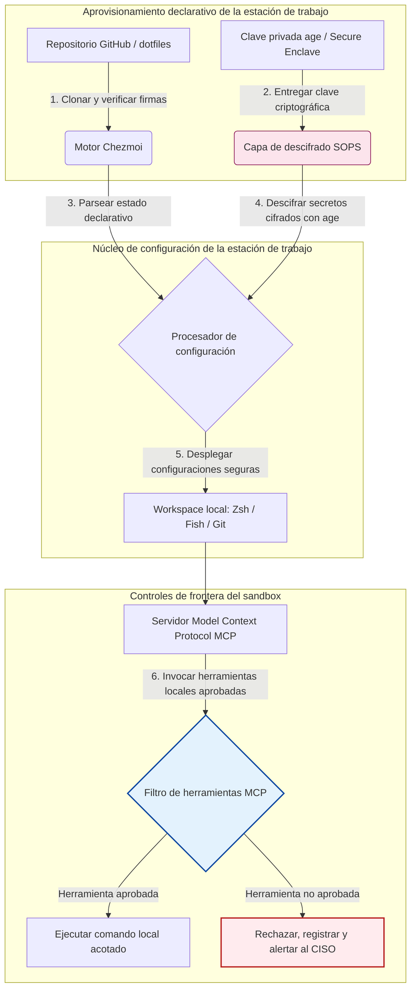

---

# Front Matter (YAML)

author: "contact@sebastienrousseau.com (Sebastien Rousseau)"
banner_alt: "Estación de trabajo del desarrollador con luz tenue — simboliza dotfiles con conciencia de IA, reproducibles y seguros, para servidores MCP, firma SLSA, secretos con age/SOPS y paridad multi-shell"
banner_height: "1597"
banner_width: "2584"
banner: "https://cloudcdn.pro/stocks/images/almas-salakhov-Vq2ap8aFFEs.webp"
cdn: "https://cloudcdn.pro"
charset: "UTF-8"
cname: "sebastienrousseau.com"
copyright: "© Copyright 2025 - 2026 - Sebastien Rousseau. All rights reserved."
date: "June 16, 2026"
description: "Los dotfiles con conciencia de IA son un patrón seguro y reproducible para la estación de trabajo en la era MCP: configuración declarativa con Chezmoi, secretos SOPS/age, procedencia SLSA Nivel 3, paridad multi-shell y límites de sandbox acotados para agentes de IA locales."
format-detection: "telephone=no"
hreflang: "es"
icon: "https://cloudcdn.pro/clients/sebastienrousseau/v1/logos/sebastienrousseau.svg"
id: "https://sebastienrousseau.com/2026-06-16-ai-aware-dotfiles-secure-reproducible-workstation-2026"
image_alt: "Retrato en blanco y negro de Sebastien Rousseau"
image_height: "162"
image_width: "162"
image: "https://cloudcdn.pro/stocks/images/sebastien-rousseau.png"
keywords: "dotfiles, Chezmoi, MCP, Model Context Protocol, SLSA, SOPS, cifrado age, configuración declarativa, estación de trabajo del desarrollador, DORA artículo 5, NIST CSF 2.0, seguridad de la cadena de suministro, IA agentiva, paridad multi-shell, Zsh, Fish, Nushell"
language: "es-ES"
last_reviewed: "2026-06-16"
layout: "report"
locale: "es_ES"
logo_alt: "Logo de Sebastien Rousseau"
logo_height: "44"
logo_width: "44"
logo: "https://cloudcdn.pro/clients/sebastienrousseau/v1/logos/sebastienrousseau.svg"
menu: ""
measurementID: "G-169G4ET5HQ"
name: "Sebastien Rousseau"
permalink: "https://sebastienrousseau.com/2026-06-16-ai-aware-dotfiles-secure-reproducible-workstation-2026"
rating: "general"
referrer: "no-referrer"
robots: "index, follow"
schema: "FAQPage, Article"
seo_title: "Dotfiles con conciencia de IA para una estación segura"
short_name: "sebastienrousseau"
subtitle: "La estación de trabajo del desarrollador ya forma parte de la cadena de suministro de IA; los dotfiles necesitan seguridad, reproducibilidad, higiene de secretos y workflows conscientes de MCP."
tags: "dotfiles, herramientas de desarrollo, MCP, SLSA, estación de trabajo segura, chezmoi, macOS, Linux, WSL"
theme-color: "0, 83, 191"
title: "Dotfiles con conciencia de IA en 2026: estación de trabajo segura y reproducible para MCP, SLSA y paridad multi-shell"
url: "https://sebastienrousseau.com/2026-06-16-ai-aware-dotfiles-secure-reproducible-workstation-2026"
viewport: "width=device-width, initial-scale=1, shrink-to-fit=no"

# RSS - The RSS feed front matter (YAML).
atom_link: "https://sebastienrousseau.com/2026-06-16-ai-aware-dotfiles-secure-reproducible-workstation-2026/rss.xml"
category: "Technology"
docs: https://validator.w3.org/feed/docs/rss2.html
generator: "Static Site Generator (SSG) (version 0.0.26)"
item_description: "Dotfiles declarativos para una estación de trabajo del desarrollador segura y reproducible en macOS, Linux y WSL, con conciencia MCP, SLSA, age, SOPS y paridad multi-shell."
item_guid: "https://sebastienrousseau.com/2026-06-16-ai-aware-dotfiles-secure-reproducible-workstation-2026/rss.xml"
item_link: "https://sebastienrousseau.com/2026-06-16-ai-aware-dotfiles-secure-reproducible-workstation-2026/rss.xml"
item_pub_date: "Tue, 16 Jun 2026 06:06:06 +0000"
item_title: "Dotfiles con conciencia de IA en 2026: estación de trabajo segura y reproducible para MCP, SLSA y paridad multi-shell"
last_build_date: "Tue, 16 Jun 2026 06:06:06 +0000"
managing_editor: "contact@sebastienrousseau.com (Sebastien Rousseau)"
pub_date: "Tue, 16 Jun 2026 06:06:06 +0000"
ttl: "60"
type: "article"
webmaster: "contact@sebastienrousseau.com"

# Apple - The Apple front matter (YAML).
apple_mobile_web_app_orientations: "portrait"
apple_touch_icon_sizes: "192x192"
apple-mobile-web-app-capable: "yes"
apple-mobile-web-app-status-bar-inset: "black"
apple-mobile-web-app-status-bar-style: "black-translucent"
apple-mobile-web-app-title: "Dotfiles con conciencia de IA"
apple-touch-fullscreen: "yes"

# MS Application - The MS Application front matter (YAML).

msapplication-navbutton-color: "0, 83, 191"

# Twitter Card - The Twitter Card front matter (YAML).

twitter_card: "summary_large_image"
twitter_creator: "@wwdseb"
twitter_description: "Dotfiles declarativos para una estación de trabajo del desarrollador segura y reproducible en macOS, Linux y WSL, con conciencia MCP, SLSA, age, SOPS y paridad multi-shell."
twitter_image: "https://cloudcdn.pro/clients/sebastienrousseau/v1/logos/sebastienrousseau.svg"
twitter_image_alt: "Logo de Sebastien Rousseau"
twitter_site: "@wwdseb"
twitter_title: "Dotfiles con conciencia de IA para una estación segura"
twitter_url: "https://sebastienrousseau.com/2026-06-16-ai-aware-dotfiles-secure-reproducible-workstation-2026"

excerpt: "Los dotfiles con conciencia de IA en 2026 tratan la estación de trabajo del desarrollador como infraestructura de cadena de suministro: configuración declarativa con chezmoi, conciencia MCP, releases firmadas con SLSA, secretos age/SOPS, arranque sub-segundo y paridad macOS/Linux/WSL."

# Humans.txt - The Humans.txt front matter (YAML).
author_website: "https://sebastienrousseau.com"
author_twitter: "@wwdseb"
author_location: "London, UK"
thanks: "Gracias por leer."
site_last_updated: "2026-06-16"
site_standards: "HTML5, CSS3, RSS, Atom, JSON, XML, YAML, Markdown, TOML"
site_components: "Kaishi, Kaishi Builder, Kaishi CLI, Kaishi Templates, Kaishi Themes"
site_software: "Static Site Generator, Rust"

---

# Dotfiles con conciencia de IA en 2026: estación de trabajo segura y reproducible para MCP, SLSA y paridad multi-shell

<!-- lead-start -->
<aside class="post-lead" aria-label="Resumen del artículo">

<strong>En resumen.</strong> La estación de trabajo del desarrollador ya no es un endpoint. Es un participante activo en la cadena de suministro de software y una interfaz directa con el plano de control local de la IA. Los asistentes de IA en terminal y los servidores del <a href="https://modelcontextprotocol.io">Model Context Protocol (MCP)</a> ejecutan comandos de shell locales, inspeccionan repositorios y leen ficheros de configuración sensibles. <a href="https://github.com/sebastienrousseau/dotfiles">Sebastien Rousseau's Dotfiles</a> es un framework declarativo de código abierto que construye estaciones de trabajo seguras y reproducibles en macOS, Linux y Windows Subsystem for Linux (WSL): integra <a href="https://www.chezmoi.io/">Chezmoi</a>, <a href="https://github.com/getsops/sops">SOPS, age</a> y procedencia de build SLSA Nivel 3 para aislar secretos con seguridad de memoria y acotar las rutas de ejecución de los modelos de IA locales.

<strong>Conclusiones clave</strong>

<ul class="post-lead-takeaways">
  <li><strong>Las estaciones de trabajo son infraestructura de cadena de suministro.</strong> La configuración del entorno del desarrollador debe tratarse con el mismo rigor declarativo que un despliegue de servidor de producción, eliminando la deriva manual.</li>
  <li><strong>El reto del plano de control de IA.</strong> Los modelos de IA en terminal y las herramientas MCP pueden acceder a directorios locales. Los dotfiles deben imponer límites de sandbox acotados, listas estrictas de permisos de herramientas y registros locales inalterables para evitar fugas de datos.</li>
  <li><strong>Paridad multiplataforma absoluta.</strong> Rendimiento de shell idéntico y sub-segundo, con perfiles de seguridad equivalentes en macOS, Linux (Zsh, Fish, Nushell) y WSL: el onboarding del desarrollador pasa de semanas a minutos.</li>
  <li><strong>Aislamiento criptográfico de secretos.</strong> El cifrado de ficheros con SOPS y age impide que credenciales hardcodeadas (tokens de GitHub, claves de acceso cloud) acaben en Git o sean leídas por LLM locales.</li>
  <li><strong>Valor fiduciario a nivel de consejo.</strong> Traduce el cumplimiento de la configuración de la estación de trabajo en prioridades claras de consejo de administración, apoyando el artículo 5 de DORA, los estándares de endpoint del NIST CSF 2.0 y la reducción del riesgo operacional de Basilea III.</li>
</ul>

<strong>Lecturas relacionadas:</strong> <a href="https://sebastienrousseau.com/2026-05-23-agentic-payments-banking-consent-liability-new-payment-ux-2026">Pagos agentivos en banca: consentimiento, responsabilidad y la nueva UX de pagos en 2026</a>, <a href="https://sebastienrousseau.com/2024-03-12-revolutionising-real-time-speech-recognition-on-macos-with-openai-whisper/index.html">Reconocimiento de voz en tiempo real en macOS: OpenAI Whisper</a>, <a href="https://sebastienrousseau.com/2024-02-26-google-gemma-ai-transforming-open-source-ai-development/index.html">Google Gemma AI: transformar el desarrollo de IA de código abierto</a>.

</aside>
<!-- lead-end -->

Salvar la distancia entre configuración declarativa de la estación de trabajo y cadenas de suministro de software seguras en la era de los modelos de IA locales y las herramientas agentivas para desarrolladores.

La referencia de código abierto de este artículo es [dotfiles ⧉](https://github.com/sebastienrousseau/dotfiles "dotfiles — configuración declarativa de la estación de trabajo"). El repositorio se posiciona así: dotfiles declarativos para macOS, Linux y WSL, con paridad multi-shell, arranque sub-segundo, releases firmadas con SLSA y configuración con conciencia de IA/MCP.

## Por qué este proyecto de código abierto importa en 2026

En junio de 2026, la estación de trabajo del desarrollador es el eslabón más débil de la cadena de suministro de software y un objetivo de alto valor para sindicatos cibernéticos sofisticados, tanto estatales como criminales.

La seguridad del entorno de desarrollo ha cambiado de forma radical con la llegada de los asistentes de codificación de IA en terminal (como Claude Code) y la adopción del Model Context Protocol (MCP). Las terminales locales del desarrollador alojan ahora agentes de IA activos y autónomos capaces de:

- Leer y editar ficheros fuente locales.
- Invocar herramientas CLI locales (`git`, `npm`, `aws`, `kubectl`).
- Inspeccionar variables de entorno del shell, bases de datos locales y parámetros de configuración.

Si el entorno local del desarrollador carece de límites estrictos, estas herramientas autónomas de IA pueden leer sin querer datos personales sensibles, filtrar credenciales cloud a APIs públicas de LLM o ejecutar paquetes maliciosos durante builds automatizados.

Bajo el Reglamento de Resiliencia Operativa Digital (DORA) y el NIST Cybersecurity Framework (CSF) 2.0, las entidades financieras están legalmente obligadas a verificar la procedencia y la integridad de seguridad de cada dispositivo que accede a la cadena de suministro de software. Los "portátiles únicos" — configuraciones manuales, sin auditar y a la deriva — han dejado de ser compatibles con los estándares bancarios globales.

[Sebastien Rousseau's Dotfiles](https://github.com/sebastienrousseau/dotfiles) resuelve este problema. Es un framework declarativo y open-source de gestión de la estación de trabajo que establece entornos de desarrollo seguros y reproducibles. Al imponer una línea base de configuración estandarizada y auditable, el proyecto ofrece un alto Return on Resilience (RoR), reduce el onboarding de desarrolladores de semanas a horas y protege las cadenas de suministro financieras frente a vulnerabilidades en el endpoint.

## Lente de arquitectura para la estación de trabajo con conciencia de IA 2026

El framework de dotfiles actúa como un gestor de entorno declarativo y seguro: todos los shells, herramientas y secretos locales se gestionan, auditan y aíslan de forma sistemática:

| Capa | Decisión de diseño | Por qué importa | Riesgo si se gestiona mal |
|---|---|---|---|
| **Capa de aprovisionamiento** | Gestión de configuración declarativa con Chezmoi | Construye estaciones de trabajo totalmente reproducibles en macOS, Linux y WSL, eliminando la deriva. | Configuraciones únicas, con estados locales vulnerables y sin auditar. |
| **Capa de shell** | Paridad multi-shell (Zsh, Fish, Nushell) | Garantiza arranque sub-segundo idéntico y comportamiento consistente de alias entre entornos distintos. | Inconsistencias en comandos de shell que producen resultados inesperados en scripts. |
| **Capa de secretos** | Cifrado de ficheros con SOPS y age | Evita que credenciales hardcodeadas y claves en crudo lleguen a Git o queden expuestas a LLM locales. | Credenciales filtradas en el historial del repositorio público o comprometidas por agentes locales. |
| **Capa IA/MCP** | Controles de frontera del Model Context Protocol | Restringe a los agentes de IA locales a una lista concreta de herramientas aprobadas y registra todas las ejecuciones locales. | Agentes de IA sin límites ejecutando comandos descontrolados o destructivos en local. |
| **Capa de cadena de suministro** | Releases firmadas con SLSA y verificación con Sigstore | Demuestra criptográficamente la autenticidad de scripts de bootstrap y ficheros de configuración. | Scripts de setup comprometidos que inyectan puertas traseras en los entornos de desarrollo. |

## Señales clave de seguridad y automatización en la estación de trabajo

Para mantener una seguridad absoluta en el parque de desarrollo, los Chief Information Security Officers (CISOs) y los responsables de tecnología deben seguir indicadores operativos concretos y cuantificables:

| Señal | Métrica / referencia operativa | Referencia NIST CSF / DORA | Implementación técnica |
|---|---|---|---|
| **Reproducibilidad de la estación de trabajo** | % de portátiles de desarrollo gestionados íntegramente con repositorios declarativos de dotfiles, sin deriva de configuración. | NIST CSF 2.0 (PR.DS-01) | Auditorías de deriva de Chezmoi ejecutadas automáticamente al iniciar la terminal. |
| **Higiene de credenciales** | Cero secretos o claves sin cifrar almacenados en texto plano en los ficheros de configuración locales. | DORA artículo 6 (seguridad TIC) | Hooks pre-commit de Git y escaneos locales que rechazan ficheros sin cifrar. |
| **Procedencia del build** | 100% de las utilidades de bootstrap de la estación de trabajo verificadas con manifiestos firmados criptográficamente. | DORA artículo 30 (cadena de suministro) | Verificación con Sigstore y SLSA Nivel 3 integrada en los pipelines de setup. |
| **Tiempo de onboarding del desarrollador** | Tiempo transcurrido desde la entrega del hardware hasta un entorno de desarrollo plenamente configurado y conforme. | Return on Resilience (RoR) | Scripts declarativos automatizados que compilan el entorno en menos de 15 minutos. |
| **Acceso acotado del agente de IA** | Verificación de que las herramientas de IA locales operan dentro de límites de directorio definidos y con valores por defecto de solo lectura. | Model Risk Management | Perfiles de configuración MCP que restringen el catálogo de herramientas del agente a operaciones aprobadas. |

## Por qué la configuración declarativa es el núcleo de la seguridad de la estación de trabajo

Los enfoques tradicionales de setup de la estación de trabajo del desarrollador son muy manuales y producen "portátiles únicos": entornos cuyas configuraciones derivan con el tiempo a medida que los desarrolladores instalan herramientas personalizadas, ajustan variables y modifican scripts locales. Esa deriva crea varias vulnerabilidades críticas:

1. **Configuraciones en la sombra y sin trazar.** Los portátiles a la deriva suelen ejecutar paquetes de software desactualizados y vulnerables o scripts locales que esquivan las herramientas corporativas de seguridad.
2. **Fugas de secretos.** Los desarrolladores hardcodean con frecuencia claves de API, tokens de GitHub o credenciales de AWS directamente en scripts en texto plano o perfiles de shell, lo que los hace muy vulnerables al robo.
3. **Onboarding ineficiente.** Montar manualmente la estación de trabajo de un nuevo desarrollador puede consumir hasta dos semanas de ingeniería, lastrando la velocidad del equipo.

Al pasar a una configuración declarativa basada en modelo con Chezmoi, todo el entorno del desarrollador se convierte en un sistema de registro reproducible y controlado por versiones. Cada cambio, alias, dependencia de paquete y valor por defecto de seguridad queda documentado en Git, validado contra las políticas de cumplimiento de la organización y verificado criptográficamente antes de aplicarse al portátil físico.

## Diseño de un entorno de desarrollo de IA acotado

Para impedir que los agentes de IA locales y las herramientas MCP obtengan acceso sin límites a los activos locales, la estación de trabajo debe operar como un plano de ejecución acotado.

El flujo operativo siguiente muestra cómo el framework de dotfiles coordina Chezmoi, SOPS y age para descifrar y desplegar dotfiles seguros, manteniendo a la vez una frontera de ejecución aislada y en sandbox para los agentes de IA locales que invocan herramientas MCP:

## El manual de consejo y la responsabilidad fiduciaria

La seguridad de la estación de trabajo del desarrollador y la integridad de la cadena de suministro son prioridades críticas para el consejo. Los altos directivos deben abordar el riesgo del entorno de desarrollo desde la lente de la responsabilidad fiduciaria, el cumplimiento regulatorio y la preservación del valor del negocio:

- **DORA artículo 5 (responsabilidad del consejo).** Establece que el órgano de dirección (el consejo) ostenta la responsabilidad última sobre la gestión del riesgo TIC de la entidad. Como las estaciones de trabajo del desarrollador son la puerta de entrada a la cadena de suministro de software, los consejeros deben verificar que los endpoints son seguros, plenamente auditables y están gestionados bajo frameworks de configuración estrictos y reproducibles, capaces de superar las auditorías regulatorias.
- **Cumplimiento del NIST CSF 2.0 (seguridad de endpoint).** Exige que solo dispositivos autorizados y validados, ejecutando configuraciones estandarizadas y seguras, puedan acceder a las redes corporativas y a los repositorios. Los dotfiles declarativos permiten a los equipos de seguridad demostrar matemáticamente que todos los entornos de desarrollo cumplen la línea base de seguridad de la organización, eliminando el riesgo de los "portátiles únicos" sin auditar.
- **Preservación del valor del balance.** Una sola credencial de desarrollador comprometida o una brecha en la cadena de suministro puede costar a una entidad millones de dólares en remediación, multas regulatorias y daño reputacional. Pasar a un entorno de desarrollo declarativo y seguro minimiza directamente ese riesgo, preserva el valor del balance y protege la confianza del cliente.

## Qué significa según el tipo de banco

### Bancos sistémicamente importantes globales (G-SIB)

Los G-SIB gestionan miles de estaciones de trabajo de desarrollo distribuidas por varios continentes y jurisdicciones regulatorias. Su reto principal es mantener la consistencia de configuración y evitar la fuga de credenciales en equipos de ingeniería masivos. Al adoptar un modelo declarativo y open-source de dotfiles con Chezmoi, los G-SIB pueden estandarizar la seguridad del endpoint, automatizar la auditoría de cumplimiento y reducir el onboarding de desarrolladores de semanas a minutos en toda la organización global.

### Bancos transaccionales y corporativos

Los bancos transaccionales operan pasarelas de pagos sensibles e infraestructuras mayoristas de clearing. Demostrar la integridad absoluta del código desplegado en esos entornos de producción es una exigencia regulatoria innegociable. Estandarizar las estaciones de trabajo del desarrollador bajo un framework de dotfiles seguro y compatible con SLSA garantiza que la cadena de suministro de software está plenamente auditada y protegida frente a las vulnerabilidades del endpoint local.

### Bancos regionales y de menor tamaño

Los bancos regionales deben mantener estándares de ciberseguridad elevados sin contar con los presupuestos masivos de seguridad de los G-SIB. Este framework open-source de dotfiles ofrece una solución ligera, rentable y altamente segura, compatible con Python y Rust, que permite a entidades menores implementar seguridad de endpoint y protección de cadena de suministro de nivel enterprise sin licencias propietarias costosas.

## Conclusión: la hoja de ruta de la estación de trabajo del desarrollador

La estación de trabajo del desarrollador ya no es un dispositivo periférico. Es un plano de control crítico de la cadena de suministro de software. Permitir que "portátiles únicos" configurados a mano y sin auditar accedan a los activos corporativos es un riesgo operacional y regulatorio grave.

Para asegurar la cadena de suministro de software y proteger los endpoints frente a las vulnerabilidades de los agentes de IA locales, los altos directivos de tecnología y seguridad deben ejecutar una hoja de ruta clara desde hoy:

1. **Mandar el aprovisionamiento declarativo.** Eliminar los procesos manuales de setup guiados por documentación y exigir que todos los entornos de desarrollo se aprovisionen de forma declarativa con Chezmoi.
2. **Imponer la higiene de secretos.** Aplicar hooks estrictos de pre-commit y utilidades de escaneo para garantizar cero credenciales, claves o tokens de API en crudo y en texto plano en las configuraciones locales de la estación de trabajo.
3. **Establecer límites de sandbox para la IA.** Implementar perfiles seguros de configuración MCP que restrinjan a los asistentes y agentes de codificación de IA locales a herramientas y directorios aprobados y de solo lectura.
4. **Asegurar la cadena de suministro.** Verificar criptográficamente todos los scripts de bootstrap y las configuraciones de entorno con procedencia SLSA Nivel 3 antes del despliegue.

## Preguntas frecuentes

**¿Qué es Chezmoi y por qué se utiliza para los dotfiles?**

Chezmoi es un gestor de dotfiles open-source, seguro y declarativo. Permite a los desarrolladores gestionar sus configuraciones locales como un repositorio controlado por versiones, garantizando consistencia y reproducibilidad absolutas entre sistemas operativos (macOS, Linux, WSL).

**¿Cómo protege el framework los secretos?**

El framework usa SOPS (Secrets Operations) y cifrado de ficheros con age para cifrar credenciales sensibles (como tokens de GitHub o claves de acceso cloud) dentro del propio repositorio de dotfiles. Así evita que las claves se commiteen en texto plano o las lean agentes de IA locales no autorizados.

**¿Qué es el Model Context Protocol (MCP) y cómo afecta a la seguridad?**

MCP es un estándar abierto que permite a los modelos de IA ejecutar herramientas locales y acceder a ficheros de forma segura. El framework de dotfiles implementa ficheros estrictos de configuración MCP que restringen las herramientas y agentes de IA locales a directorios y comandos aprobados.

**¿Qué shells soporta el framework?**

Bash, Zsh, Fish, Nushell y PowerShell, con paridad entre macOS, Linux y WSL, de modo que el comportamiento de los comandos se mantiene idéntico sea cual sea el terminal que abra el desarrollador.

## Referencias

- Open Source Security Foundation (OpenSSF), (2024). *Supply-chain Levels for Software Artifacts (SLSA)*. Disponible en: [Marco SLSA ⧉](https://slsa.dev/ "Marco SLSA").
- NIST, (2024). *NIST Cybersecurity Framework 2.0*. Gaithersburg: National Institute of Standards and Technology. Disponible en: [NIST CSF 2.0 ⧉](https://www.nist.gov/cyberframework "NIST Cybersecurity Framework 2.0").
- Parlamento Europeo y Consejo de la Unión Europea, (2022). *Reglamento (UE) 2022/2554 sobre resiliencia operativa digital para el sector financiero (DORA)*. Bruselas: Diario Oficial de la Unión Europea. Disponible en: [Reglamento DORA ⧉](https://eur-lex.europa.eu/legal-content/EN/TXT/?uri=CELEX%3A32022R2554 "Reglamento DORA").
- GitHub, (2026). *Repositorio open-source dotfiles*. Disponible en: [Repositorio dotfiles ⧉](https://github.com/sebastienrousseau/dotfiles "Repositorio dotfiles").

<!-- enrich-start -->
<aside class="author-card" aria-label="Acerca del autor"><strong class="author-card-name"><a href="/about/index.html">Sebastien Rousseau</a></strong>Tecnólogo bancario sénior; escribe sobre IA aplicada, migración a ISO 20022, criptografía postcuántica para servicios financieros y la transformación estructural de los pagos mayoristas.Más de 20 años en HSBC Commercial &amp; Investment Bank, PayPal, Barclays, Shazam, AKQA, Virgin Group. <a href="/about/index.html">Perfil completo</a> &middot; <a href="https://www.linkedin.com/in/sebastienrousseau/" rel="external noopener">LinkedIn</a> &middot; <a href="https://github.com/sebastienrousseau" rel="external noopener">GitHub</a></aside>

Última revisión <time datetime="2026-06-16">2026-06-16</time>.

<aside class="related-posts" aria-labelledby="related-heading">
<h2 id="related-heading" class="related-heading">Lecturas relacionadas</h2>

<article class="related-card"><footer class="related-body"><h3><a href="https://sebastienrousseau.com/2026-05-23-agentic-payments-banking-consent-liability-new-payment-ux-2026">Pagos agentivos en banca: consentimiento, responsabilidad y la nueva UX de pagos en 2026</a></h3>
<time datetime="2026-05-23">2026-05-23</time>
</footer></article>
<article class="related-card"><footer class="related-body"><h3><a href="https://sebastienrousseau.com/2024-03-12-revolutionising-real-time-speech-recognition-on-macos-with-openai-whisper/index.html">Reconocimiento de voz en tiempo real en macOS: OpenAI Whisper</a></h3>
<time datetime="2024-03-12">2024-03-12</time>
</footer></article>
<article class="related-card"><footer class="related-body"><h3><a href="https://sebastienrousseau.com/2024-02-26-google-gemma-ai-transforming-open-source-ai-development/index.html">Google Gemma AI: transformar el desarrollo de IA de código abierto</a></h3>
<time datetime="2024-02-26">2024-02-26</time>
</footer></article>

</aside>
<!-- enrich-end -->
