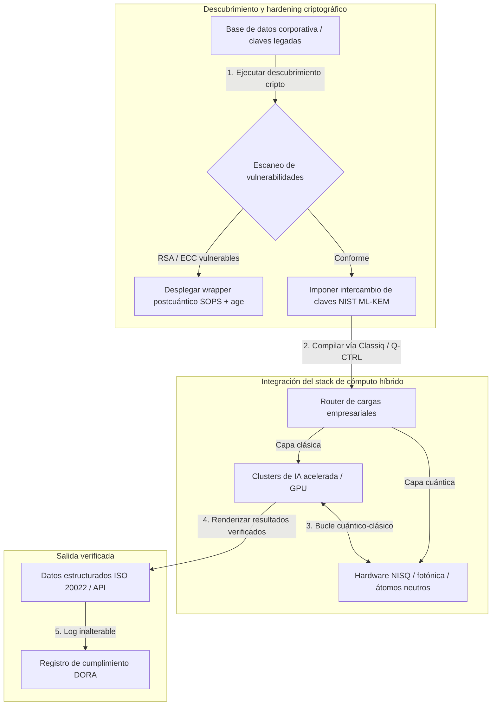

---

# Front Matter (YAML)

author: "contact@sebastienrousseau.com (Sebastien Rousseau)"
banner_alt: "Vista del escenario de la 5.ª Cumbre Anual Commercialising Quantum Global 2026 de Economist Impact en Londres — simboliza la transición de la tecnología cuántica desde la investigación en física hacia workflows empresariales listos para producción"
banner_height: "1597"
banner_width: "2584"
banner: "https://cloudcdn.pro/stocks/images/sebastien-rousseau-20260617-5th-commercialising-quantum-2.webp"
cdn: "https://cloudcdn.pro"
charset: "UTF-8"
cname: "sebastienrousseau.com"
copyright: "© Copyright 2025 - 2026 - Sebastien Rousseau. All rights reserved."
date: "June 17, 2026"
description: "Conclusiones para el consejo de administración tras la 5.ª Cumbre Anual Commercialising Quantum Global 2026 de Economist Impact: aluvión de financiación de 1.300 millones de dólares, stacks híbridos sin remordimientos, urgencia en la migración a criptografía postcuántica, comercialización del sensado cuántico y la directriz de HSBC: esperar es un error no forzado."
format-detection: "telephone=no"
hreflang: "es"
icon: "https://cloudcdn.pro/clients/sebastienrousseau/v1/logos/sebastienrousseau.svg"
id: "https://sebastienrousseau.com/2026-06-17-economist-commercialising-quantum-summit-2026"
image_alt: "Retrato en blanco y negro de Sebastien Rousseau"
image_height: "162"
image_width: "162"
image: "https://cloudcdn.pro/stocks/images/sebastienrousseau.webp"
keywords: "Commercialising Quantum Global 2026, cumbre Economist Impact, criptografía postcuántica, NIST ML-KEM, recolectar ahora descifrar después, SNDL, HSBC cuántico, Philip Intallura, sensado cuántico, navegación independiente de GPS, NQCC, Ley Cuántica de la UE, Quantcore, premio qBIG, Lord Vallance, híbrido cuántico-clásico, DORA artículo 6"
language: "es-ES"
last_reviewed: "2026-06-17"
layout: "report"
locale: "es_ES"
logo_alt: "Logo de Sebastien Rousseau"
logo_height: "44"
logo_width: "44"
logo: "https://cloudcdn.pro/clients/sebastienrousseau/v1/logos/sebastienrousseau.svg"
menu: ""
measurementID: "G-169G4ET5HQ"
name: "Sebastien Rousseau"
permalink: "https://sebastienrousseau.com/2026-06-17-economist-commercialising-quantum-summit-2026"
rating: "general"
referrer: "no-referrer"
robots: "index, follow"
schema: "FAQPage, Article"
seo_title: "Commercialising Quantum 2026: claves para el consejo"
short_name: "sebastienrousseau"
subtitle: "La computación cuántica ha cruzado de la ciencia especulativa de laboratorio a los workflows híbridos empresariales; el consejo debe responder a los 1.300 millones de dólares de financiación en 2026, a la migración postcuántica inmediata y a la directriz de HSBC: dejar de esperar."
tags: "cuántica, criptografía postcuántica, NIST ML-KEM, recolectar ahora descifrar después, sensado cuántico, HSBC, Economist Impact, cómputo híbrido, DORA, Ley Cuántica de la UE, NQCC, conclusiones de la cumbre"
theme-color: "0, 83, 191"
title: "De los qubits a los beneficios: claves estratégicas de la 5.ª Cumbre Anual Commercialising Quantum Global 2026 de The Economist"
url: "https://sebastienrousseau.com/2026-06-17-economist-commercialising-quantum-summit-2026"
viewport: "width=device-width, initial-scale=1, shrink-to-fit=no"

# RSS - The RSS feed front matter (YAML).
atom_link: "https://sebastienrousseau.com/2026-06-17-economist-commercialising-quantum-summit-2026/rss.xml"
category: "Technology"
docs: https://validator.w3.org/feed/docs/rss2.html
generator: "Static Site Generator (SSG) (version 0.0.26)"
item_description: "Conclusiones para el consejo de administración tras la 5.ª Cumbre Anual Commercialising Quantum Global 2026 de Economist Impact: aluvión de financiación de 1.300 millones de dólares, stacks híbridos sin remordimientos, urgencia en la migración a criptografía postcuántica, comercialización del sensado cuántico y la directriz de HSBC: esperar es un error no forzado."
item_guid: "https://sebastienrousseau.com/2026-06-17-economist-commercialising-quantum-summit-2026/rss.xml"
item_link: "https://sebastienrousseau.com/2026-06-17-economist-commercialising-quantum-summit-2026/rss.xml"
item_pub_date: "Wed, 17 Jun 2026 06:06:06 +0000"
item_title: "De los qubits a los beneficios: claves estratégicas de la 5.ª Cumbre Anual Commercialising Quantum Global 2026 de The Economist"
last_build_date: "Wed, 17 Jun 2026 06:06:06 +0000"
managing_editor: "contact@sebastienrousseau.com (Sebastien Rousseau)"
pub_date: "Wed, 17 Jun 2026 06:06:06 +0000"
ttl: "60"
type: "article"
webmaster: "contact@sebastienrousseau.com"

# Apple - The Apple front matter (YAML).
apple_mobile_web_app_orientations: "portrait"
apple_touch_icon_sizes: "192x192"
apple-mobile-web-app-capable: "yes"
apple-mobile-web-app-status-bar-inset: "black"
apple-mobile-web-app-status-bar-style: "black-translucent"
apple-mobile-web-app-title: "Commercialising Quantum 2026: claves para el consejo"
apple-touch-fullscreen: "yes"

# MS Application - The MS Application front matter (YAML).

msapplication-navbutton-color: "0, 83, 191"

# Twitter Card - The Twitter Card front matter (YAML).

twitter_card: "summary_large_image"
twitter_creator: "@wwdseb"
twitter_description: "Conclusiones para el consejo de administración tras la 5.ª Cumbre Anual Commercialising Quantum Global 2026 de Economist Impact: aluvión de financiación de 1.300 millones de dólares, stacks híbridos sin remordimientos, urgencia en la migración a criptografía postcuántica, comercialización del sensado cuántico y la directriz de HSBC: esperar es un error no forzado."
twitter_image: "https://cloudcdn.pro/clients/sebastienrousseau/v1/logos/sebastienrousseau.svg"
twitter_image_alt: "Logo de Sebastien Rousseau"
twitter_site: "@wwdseb"
twitter_title: "Commercialising Quantum 2026: claves para el consejo"
twitter_url: "https://sebastienrousseau.com/2026-06-17-economist-commercialising-quantum-summit-2026"

excerpt: "La 5.ª Cumbre Anual Commercialising Quantum Global 2026 de Economist Impact confirmó el giro cuántico hacia los workflows empresariales: 1.300 millones de dólares levantados en cinco meses, la criptografía postcuántica es una cuestión fiduciaria a nivel de consejo bajo la recolección SNDL, el sensado cuántico ya se despliega para navegación independiente de GPS, y Philip Intallura, de HSBC, lanzó la directriz: esperar al hardware tolerante a fallos es un error no forzado."

# Humans.txt - The Humans.txt front matter (YAML).
author_website: "https://sebastienrousseau.com"
author_twitter: "@wwdseb"
author_location: "London, UK"
thanks: "Gracias por leer."
site_last_updated: "2026-06-17"
site_standards: "HTML5, CSS3, RSS, Atom, JSON, XML, YAML, Markdown, TOML"
site_components: "Kaishi, Kaishi Builder, Kaishi CLI, Kaishi Templates, Kaishi Themes"
site_software: "Static Site Generator, Rust"

---

# De los qubits a los beneficios: claves estratégicas de la 5.ª Cumbre Anual Commercialising Quantum Global 2026 de The Economist

Madurez empresarial, migraciones a criptografía postcuántica, stacks de cómputo híbrido y el panorama comercial emergente del sensado y las redes cuánticas.

**En resumen.** La 5.ª Cumbre Anual Commercialising Quantum Global 2026, organizada por Economist Impact los días 16 y 17 de junio de 2026 en el Business Design Centre de Londres, reunió a más de 1.100 líderes globales del mundo empresarial, financiero, político y de la investigación. El tema central marcó un giro estructural claro: la tecnología cuántica ha dejado atrás la ciencia especulativa de laboratorio para convertirse en workflows empresariales híbridos y operativos. Respaldada por 1.300 millones de dólares de capital riesgo levantados solo en los cinco primeros meses de 2026, la conversación en el consejo ya no gira en torno a contar qubits físicos, sino a construir stacks híbridos de cómputo «sin remordimientos», proteger los activos digitales frente a la amenaza criptográfica de la recolección «harvest-now, decrypt-later» (SNDL) y desplegar sistemas de sensado cuántico de corto plazo para navegación independiente de GPS.

## Conclusiones clave

- **Giro empresarial hacia workflows operativos.** Líderes del sector ([Steve Suarez](https://www.linkedin.com/in/stevesuarez), de HorizonX, y [Phil Intallura](https://www.linkedin.com/in/intallura), de HSBC) subrayaron que la integración cuántica ya no es un problema de física, sino operativo. Bancos y empresas están desplegando pilotos híbridos cuántico-clásicos para formar talento y optimizar cargas activas.
- **La criptografía postcuántica (PQC) es prioridad del consejo.** Expertos en seguridad y derecho (CMS UK, [Joanne Miller](https://www.linkedin.com/in/joanne-miller-nso), de Microsoft, y [Craig Farrell](https://www.linkedin.com/in/craig-farrell), de EY) advirtieron de que las organizaciones no pueden esperar al hardware tolerante a fallos para desplegar PQC. La recolección «harvest-now, decrypt-later» sucede hoy, y eso convierte la migración a los estándares NIST ML-KEM en una cuestión fiduciaria inmediata.
- **El sensado cuántico lidera la rentabilidad de corto plazo.** Mientras la computación tolerante a fallos sigue a años de distancia, el sensado cuántico ([Matthew Kinsella](https://www.linkedin.com/in/matthewkinsella), de Infleqtion) escala con rapidez. Los relojes cuánticos y los sensores inerciales ya se despliegan en navegación independiente de GPS, seguridad nacional y redes eléctricas ultraestables.
- **Soberanía, clusters y urgencia política.** El Ministro de Ciencia británico [Lord Vallance](https://www.linkedin.com/in/patrick-vallance) y [Lord William Hague](https://www.linkedin.com/in/williamhague) detallaron misiones nacionales para convertir la investigación en «superclusters» de escala industrial coordinados con el National Quantum Computing Centre (NQCC). La inminente Ley Cuántica de la UE refuerza la carrera geopolítica por la capacidad soberana de cómputo.
- **Quantcore gana el premio qBIG.** La spin-out de la Universidad de Glasgow Quantcore obtuvo el premio qBIG del IOP por sus componentes superconductores basados en niobio, que operan a temperaturas más altas que los materiales tradicionales y reducen de forma significativa el sobrecoste de la infraestructura criogénica.

**Lecturas relacionadas:** [KyberLib y la migración postcuántica de la banca en 2026: de los estándares al código](https://sebastienrousseau.com/2026-06-12-kyberlib-post-quantum-banking-migration-standards-code-2026/), [El Índice de Resiliencia Bancaria en 2026: IA, cloud, cuántica, pagos y riesgo de concentración de terceros](https://sebastienrousseau.com/2026-06-08-banking-resilience-index-ai-cloud-quantum-payments-third-party-risk-2026/), [El Índice de Banca Cloud Native en 2026: DORA, ingeniería de plataforma, cloud soberano y resiliencia operativa](https://sebastienrousseau.com/2026-06-05-cloud-native-banking-index-dora-resilience-platform-engineering-2026/).

## 01. Por qué la Cumbre 2026 importa al consejo de administración

La edición 2026 de la cumbre Commercialising Quantum Global de The Economist marcó un cambio permanente en la forma en que el mundo corporativo evalúa la deep tech.

Históricamente, la computación cuántica quedaba relegada a los departamentos de I+D como una aventura científica de varias décadas. En junio de 2026, esa perspectiva ha caducado. Las organizaciones deben pasar de la curiosidad «centrada en la física» a la implementación «centrada en el negocio». Por dos razones:

1. **La convergencia cuántico-IA.** Los stacks de cómputo de alto rendimiento (HPC) están fusionando los nodos clásicos, los aceleradores de IA y los NISQ (Noisy Intermediate-Scale Quantum) en una capa única y unificada de cómputo. Las organizaciones que retrasen la construcción de aplicaciones quantum-ready descubrirán que la ventana para capturar ventaja estratégica se cierra más rápido de lo previsto.
2. **Urgencia geopolítica y fiduciaria.** Con el programa cuántico británico dirigido por misiones y la inminente Ley Cuántica de la UE, la capacidad cuántica ha pasado a ser una cuestión de soberanía nacional y continuidad corporativa.

Además, la ciberseguridad postcuántica ya no es un requisito de cumplimiento futuro. La amenaza de los ataques adversarios «store now, decrypt later» (SNDL) significa que los datos corporativos interceptados hoy serán descifrados cuando los sistemas cuánticos comerciales escalen, generando responsabilidad inmediata bajo los mandatos globales de resiliencia operativa, como el Reglamento de Resiliencia Operativa Digital (DORA).

## 02. La lente estratégica Commercialising Quantum 2026

Los líderes tecnológicos empresariales deben mapear la madurez cuántica en cinco capas operativas distintas, evaluando horizontes temporales y riesgos de balance.

### Tabla 1: La lente estratégica Commercialising Quantum 2026

| Capa | Foco corporativo | Horizonte temporal | Riesgo corporativo clave |
| ---- | ---- | ---- | ---- |
| **Hardware y compilador** | Elegir entre enfoques rivales (superconductores, iones atrapados, átomos neutros, fotónica) | 3 – 5 años (tolerancia a fallos) | Quedar atrapado en una arquitectura sin salida o apostar demasiado pronto por una sola plataforma. |
| **Hardening criptográfico** | Descubrimiento e inventario de dependencias criptográficas; migración a NIST ML-KEM | Inmediato (migración activa) | Brechas de datos sistémicas y fallos de cumplimiento bajo DORA y NIST CSF 2.0. |
| **Sensado cuántico** | Despliegue de navegación independiente de GPS, relojes ultraestables y gravímetros | 1 – 2 años (comercial inmediato) | Interrupción operativa de logística, transporte marítimo y redes eléctricas por inhibición de GPS. |
| **Integración de sistemas** | Conectar hardware cuántico a centros de datos HPC y supercomputación clásica existentes | 1 – 3 años (fase híbrida) | Alta latencia, cuellos de botella en transferencia de datos y silos de cómputo fragmentados. |
| **Software empresarial** | Exponer algoritmos cuánticos mediante capas de abstracción de alto nivel y APIs (Classiq, Q-CTRL) | Inmediato (formación de talento) | Aislamiento del talento y del workflow respecto a la ejecución real de ingeniería. |

## 03. Señales cuánticas clave y disparadores para el consejo

Los líderes tecnológicos deben monitorizar métricas de mercado y regulatorias específicas y cuantificables para orientar sus inversiones en cuántica.

### Tabla 2: Señales cuánticas clave y disparadores para el consejo

| Señal | Métrica cuantitativa | Referencia regulatoria / política | Prioridad accionable de plataforma |
| ---- | ---- | ---- | ---- |
| **Aluvión de financiación cuántica** | 1.300 millones de dólares levantados a nivel global en los cinco primeros meses de 2026 | Return on Resilience (RoR) | Reorientar presupuestos desde pilotos especulativos hacia cargas híbridas cuántico-clásicas «sin remordimientos». |
| **Exposición al descifrado de datos** | 100% de los datos cifrados transmitidos por canales públicos expuestos a la recolección SNDL | DORA artículo 6 (seguridad TIC) | Desplegar herramientas de descubrimiento criptográfico para identificar claves vulnerables RSA/ECC en todo el parque. |
| **Infraestructura soberana** | 2.500 millones de libras asignados a la UK National Quantum Strategy | UK Quantum Missions / Lord Vallance | Establecer alianzas locales con superclusters nacionales como el NQCC. |
| **Plazos de cumplimiento** | Corte a estructura de direcciones SWIFT el 14 de noviembre de 2026 | Directiva SWIFT SR 2026 | Depurar y formatear las bases de datos interbancarias para cumplir las especificaciones XML estructuradas. |

## 04. Análisis en profundidad de los temas centrales de la cumbre

### La cuántica alcanza un punto de inflexión inversor

La financiación de capital riesgo se ha acelerado de forma significativa, captando **1.300 millones de dólares** solo en los cinco primeros meses de 2026. A diferencia de los ciclos especulativos de años anteriores, la actual ola de capital se apoya en cargas reales y de corto plazo. Los ponentes de Classiq y de la plataforma IBM Quantum demostraron cómo las capas de abstracción de software y los compiladores automatizados permiten a equipos de desarrolladores no especialistas ejecutar algoritmos híbridos cuántico-clásicos sobre la infraestructura clásica de hoy. Esta estrategia «sin remordimientos» permite a las organizaciones formar talento y workflows quantum-ready de inmediato.

### Advertencias legales y regulatorias sobre «harvest now, decrypt later»

Los socios jurídicos y los responsables de ciberseguridad generaron una fuerte expectación en torno a la inmediatez del riesgo sobre los datos. Representantes del bufete patrocinador CMS UK y la CSO de Microsoft [Joanne Miller](https://www.linkedin.com/in/joanne-miller-nso) lanzaron una advertencia tajante a la alta dirección: *esperar a que llegue el hardware tolerante a fallos antes de desplegar criptografía postcuántica es un fallo fiduciario crítico.*

Bajo el paradigma «store now, decrypt later» (SNDL), los actores hostiles ya están recolectando hoy datos corporativos cifrados con la intención de descifrarlos en cuanto surjan ordenadores cuánticos criptográficamente relevantes. Las organizaciones deben desplegar protecciones postcuánticas (como NIST ML-KEM) de inmediato para proteger los conjuntos de datos sensibles de larga vida, la propiedad intelectual y los registros históricos de clientes.

### El reajuste del hype del «sensado cuántico»

Mientras la computación cuántica tolerante a fallos sigue a años de distancia, la cumbre destacó el sensado cuántico como la primera ola realmente rentable de despliegue real. El Chief Executive [Matthew Kinsella](https://www.linkedin.com/in/matthewkinsella), de Infleqtion, detalló cómo los relojes cuánticos, los sensores inerciales y los sistemas de radiofrecuencia están escalando con rapidez en múltiples industrias.

Como estas tecnologías miden constantes físicas con precisión subatómica, permiten **navegación independiente de GPS**, redes eléctricas ultraestables y telecomunicaciones de espacio profundo. Estas aplicaciones son muy relevantes para la aviación, el transporte marítimo y los sistemas de defensa nacional ante la amenaza creciente de inhibición de GPS.

### Ecosistema y colaboración entre clusters

El ecosistema cuántico británico aprovechó la cumbre de Londres para exhibir sus superclusters de innovación domésticos. Las actualizaciones en directo del National Quantum Computing Centre (NQCC) y del Digital Catapult detallaron cómo las spin-outs deep tech en etapa temprana pueden salvar la «brecha tecnológica» integrando hardware cuántico directamente en centros de datos de supercomputación clásica.

[Wridhdhisom Karar](https://www.linkedin.com/in/wridhdhisomkarar), cofundador de la startup cuántica escocesa Quantcore, recogió el prestigioso premio Quantum Business Innovation and Growth (qBIG) del Institute of Physics (IOP) por los componentes superconductores basados en niobio de la empresa. Estos componentes operan a temperaturas más altas que los materiales tradicionales, lo que reduce significativamente el sobrecoste de la infraestructura criogénica necesaria para escalar procesadores cuánticos.

### El caso HSBC: por qué esperar a la cuántica es un «error no forzado»

Las reflexiones de [**Philip Intallura, Ph.D.**](https://www.linkedin.com/in/intallura) (Global Head of Quantum Technologies de HSBC, asesor del Gobierno británico y consejero) en la 5.ª Cumbre Anual Commercialising Quantum de The Economist (2026) dejaron una directriz contundente para el consejo: *«Esperar al cuántico tolerante a fallos antes de empezar es un error no forzado».*

El Dr. Intallura argumentó que el enfoque habitual de «esperar y ver» entre las entidades financieras es un autogol construido sobre tres supuestos incorrectos:

- **El ROI a corto plazo es real.** En pruebas empíricas, HSBC ha superado a los modelos que están actualmente en producción, ha conectado el trabajo cuántico con otras áreas del negocio, ha utilizado la cuántica para profundizar las relaciones con algunos de sus mayores clientes y ha atraído nuevo negocio significativo hacia **HSBC Innovation Banking**.
- **La cuántica tiene una curva de adopción pronunciada.** Construir capacidad, fijar estrategia, asegurar financiación y ejecutar ciclos de experimentación dentro de una organización fuertemente regulada no es tarea corta. Los procesos deben probarse y adaptarse de forma sistemática a la tecnología.
- **La cuántica es un ecosistema.** Ningún actor llega solo. Cada paper de investigación, POC y piloto que HSBC ha ejecutado se ha hecho en estrecha colaboración con un proveedor cuántico — y, en algunos casos, la colaboración se extiende a la academia, los reguladores y el Gobierno.

**Directriz de cierre para el consejo:** *«La capacidad que necesitarán el primer día de la tolerancia a fallos es la capacidad que construyan ahora».*

## 05. Integración cuántica corporativa y pipeline criptográfico

Para proteger los activos digitales mientras se construye madurez cuántica, la empresa debe establecer un pipeline de integración claro.

## 06. El manual de consejo: imperativos accionables

Para traducir las conclusiones de la cumbre Commercialising Quantum Global 2026 en valor de negocio inmediato, la alta dirección debe ejecutar el siguiente manual de consejo en cuatro pasos:

1. **Mandar el descubrimiento criptográfico.** Encomendar al Chief Information Security Officer (CISO) catalogar todos los activos criptográficos, mapeando cada clave legada RSA y ECC en toda la empresa para preparar la migración postcuántica.
2. **Desplegar una estrategia híbrida «sin remordimientos».** Evite esperar al hardware perfecto. Invierta en software inspirado en cuántica y en pilotos híbridos clásico-cuánticos para desarrollar talento interno y optimizar logística compleja o carteras de riesgo hoy.
3. **Evaluar el sensado cuántico para logística.** Si su organización depende de cadenas de suministro globales, transporte marítimo o infraestructura crítica, evalúe activamente sistemas de sensado cuántico (como la navegación independiente de GPS) para mitigar los riesgos de disrupción geopolítica.
4. **Inscríbanse en la Insight Hour del 30 de junio.** Asegúrese de que sus líderes tecnológicos se inscriben en la **Commercialising Quantum Global Insight Hour** virtual del 30 de junio de 2026, a las 15:00 BST (con el respaldo de IonQ), para seguir trazando estrategias de gestión de riesgos empresariales y de asignación de talento.

## 07. Preguntas frecuentes

**¿Qué es «harvest now, decrypt later» (SNDL) y por qué importa hoy?**
SNDL es la práctica de interceptar y almacenar datos cifrados hoy con la intención de descifrarlos más adelante, cuando estén disponibles ordenadores cuánticos criptográficamente relevantes. Los conjuntos de datos sensibles de larga vida — propiedad intelectual, registros de clientes, comunicaciones gubernamentales — ya están en el punto de mira. Migrar a NIST ML-KEM es una decisión fiduciaria que el consejo no puede aplazar.

**¿Por qué el sensado cuántico es la primera ola comercial, y no la computación?**
Los sensores cuánticos miden constantes físicas con precisión subatómica y no requieren el hardware tolerante a fallos que sí necesita la computación cuántica. Los relojes cuánticos, los gravímetros y los sensores inerciales ya están en despliegue piloto para navegación independiente de GPS, redes eléctricas ultraestables y comunicaciones de espacio profundo.

**¿El trabajo cuántico de HSBC es solo I+D o ha generado retornos medibles?**
Según Philip Intallura en la cumbre, HSBC ha superado a los modelos que están actualmente en producción, ha utilizado la cuántica para profundizar las relaciones con sus mayores clientes y ha atraído nuevo negocio significativo hacia HSBC Innovation Banking. El trabajo ha pasado de la investigación a la integración operativa.

## 08. Referencias

- **Economist Impact, (2026).** *5th Annual Commercialising Quantum Global 2026.* Actas en directo de la conferencia, 16 y 17 de junio de 2026. Londres: Business Design Centre. Disponible en: [Economist Impact](https://events.economist.com/commercialising-quantum/).
- **National Institute of Standards and Technology (NIST), (2024).** *First Three Finalized Post-Quantum Encryption Standards (FIPS 203, 204 y 205).* Gaithersburg: U.S. Department of Commerce. Disponible en: [NIST Standards](https://www.nist.gov/news-events/news/2024/08/nist-releases-first-3-finalized-post-quantum-encryption-standards).
- **Parlamento Europeo y Consejo de la Unión Europea, (2022).** *Reglamento (UE) 2022/2554 sobre resiliencia operativa digital para el sector financiero (DORA).* Bruselas: Diario Oficial de la Unión Europea. Disponible en: [Reglamento DORA](https://eur-lex.europa.eu/legal-content/EN/TXT/?uri=CELEX%3A32022R2554).
- **SWIFT, (2024).** *ISO 20022 November 2026 Structured Address Milestone.* La Hulpe: SWIFT. Disponible en: [Hito SWIFT ISO 20022](https://www.swift.com/standards/iso-20022/iso-20022-bytes/call-action-november-2026).
