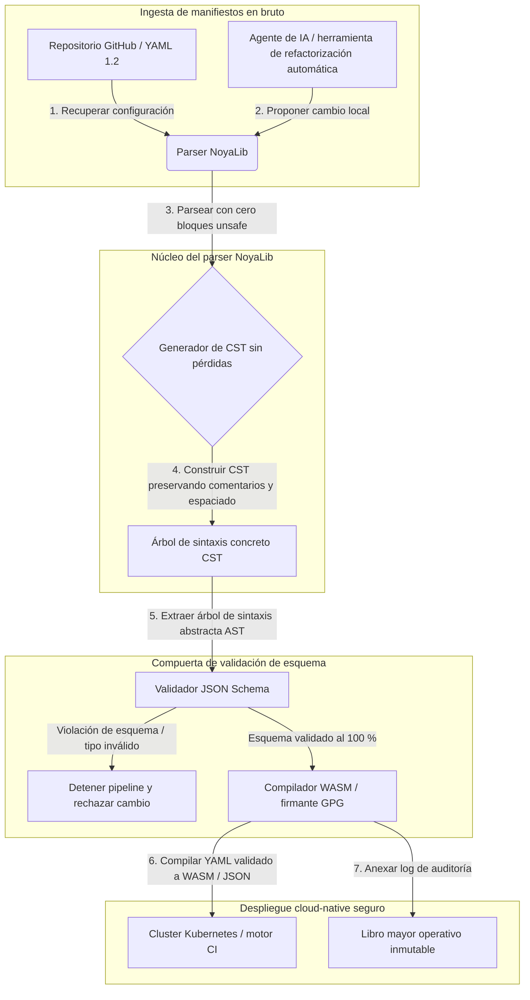

---

# Front Matter (YAML)

author: "contact@sebastienrousseau.com (Sebastien Rousseau)"
banner_alt: "Geometría arquitectónica bajo luz dramática — simboliza el papel de NoyaLib como parser YAML seguro en Rust que sostiene CI, Kubernetes, MCP y la configuración de servicios financieros"
banner_height: "1597"
banner_width: "2584"
banner: "https://cloudcdn.pro/stocks/images/ken-cheung-KonWFWUaAuk.webp"
cdn: "https://cloudcdn.pro"
charset: "UTF-8"
cname: "sebastienrousseau.com"
copyright: "© Copyright 2025 - 2026 - Sebastien Rousseau. All rights reserved."
date: "June 18, 2026"
description: "NoyaLib: parser YAML 1.2 en Rust sin unsafe, 406/406 de conformidad, validación JSON Schema, CST sin pérdidas y bindings MCP/WASM para banca."
format-detection: "telephone=no"
hreflang: "es"
icon: "https://cloudcdn.pro/clients/sebastienrousseau/v1/logos/sebastienrousseau.svg"
id: "https://sebastienrousseau.com/2026-06-18-noyalib-safe-yaml-rust-ai-mcp-financial-infrastructure-2026"
image_alt: "Retrato en blanco y negro de Sebastien Rousseau"
image_height: "162"
image_width: "162"
image: "https://cloudcdn.pro/stocks/images/sebastienrousseau.webp"
keywords: "parser YAML seguro en Rust, NoyaLib, conformidad YAML 1.2, Rust sin unsafe, validación JSON Schema, árbol de sintaxis concreto sin pérdidas, CST, MCP, Model Context Protocol, WebAssembly, manifiestos Kubernetes, configuración CI/CD, DORA artículo 5, BCBS 239, riesgo operacional Basel III, infraestructura financiera, seguridad de la configuración, cadena de suministro de software"
language: "es-ES"
last_reviewed: "2026-06-18"
layout: "report"
locale: "es_ES"
logo_alt: "Logo de Sebastien Rousseau"
logo_height: "44"
logo_width: "44"
logo: "https://cloudcdn.pro/clients/sebastienrousseau/v1/logos/sebastienrousseau.svg"
menu: ""
measurementID: "G-169G4ET5HQ"
name: "Sebastien Rousseau"
permalink: "https://sebastienrousseau.com/2026-06-18-noyalib-safe-yaml-rust-ai-mcp-financial-infrastructure-2026"
rating: "general"
referrer: "no-referrer"
robots: "index, follow"
schema: "FAQPage, Article"
seo_title: "Parser YAML seguro en Rust para IA, MCP y banca"
short_name: "sebastienrousseau"
subtitle: "Un stack YAML más seguro en Rust — NoyaLib — convierte YAML 1.2, de marcado de conveniencia, en un plano de control de configuración criptográficamente seguro y conforme a la especificación para agentes de IA, MCP, Kubernetes e infraestructura de servicios financieros."
tags: "parser YAML seguro en Rust, NoyaLib, YAML 1.2, Rust sin unsafe, JSON Schema, MCP, WebAssembly, Kubernetes, DORA, BCBS 239, Basel III, infraestructura financiera, seguridad de la cadena de suministro"
theme-color: "0, 83, 191"
title: "Por qué YAML necesita un stack Rust más seguro para IA, MCP e infraestructura financiera en 2026"
url: "https://sebastienrousseau.com/2026-06-18-noyalib-safe-yaml-rust-ai-mcp-financial-infrastructure-2026"
viewport: "width=device-width, initial-scale=1, shrink-to-fit=no"

# RSS - The RSS feed front matter (YAML).
atom_link: "https://sebastienrousseau.com/2026-06-18-noyalib-safe-yaml-rust-ai-mcp-financial-infrastructure-2026/rss.xml"
category: "Technology"
docs: https://validator.w3.org/feed/docs/rss2.html
generator: "Static Site Generator (SSG) (version 0.0.26)"
item_description: "NoyaLib: parser YAML 1.2 en Rust sin unsafe, 406/406 de conformidad, validación JSON Schema, CST sin pérdidas y bindings MCP/WASM para banca."
item_guid: "https://sebastienrousseau.com/2026-06-18-noyalib-safe-yaml-rust-ai-mcp-financial-infrastructure-2026/rss.xml"
item_link: "https://sebastienrousseau.com/2026-06-18-noyalib-safe-yaml-rust-ai-mcp-financial-infrastructure-2026/rss.xml"
item_pub_date: "Thu, 18 Jun 2026 06:06:06 +0000"
item_title: "Por qué YAML necesita un stack Rust más seguro para IA, MCP e infraestructura financiera en 2026"
last_build_date: "Thu, 18 Jun 2026 06:06:06 +0000"
managing_editor: "contact@sebastienrousseau.com (Sebastien Rousseau)"
pub_date: "Thu, 18 Jun 2026 06:06:06 +0000"
ttl: "60"
type: "article"
webmaster: "contact@sebastienrousseau.com"

# Apple - The Apple front matter (YAML).
apple_mobile_web_app_orientations: "portrait"
apple_touch_icon_sizes: "192x192"
apple-mobile-web-app-capable: "yes"
apple-mobile-web-app-status-bar-inset: "black"
apple-mobile-web-app-status-bar-style: "black-translucent"
apple-mobile-web-app-title: "Parser YAML seguro en Rust para IA, MCP y banca"
apple-touch-fullscreen: "yes"

# MS Application - The MS Application front matter (YAML).

msapplication-navbutton-color: "0, 83, 191"

# Twitter Card - The Twitter Card front matter (YAML).

twitter_card: "summary_large_image"
twitter_creator: "@wwdseb"
twitter_description: "NoyaLib: parser YAML 1.2 en Rust sin unsafe, 406/406 de conformidad, validación JSON Schema, CST sin pérdidas y bindings MCP/WASM para banca."
twitter_image: "https://cloudcdn.pro/clients/sebastienrousseau/v1/logos/sebastienrousseau.svg"
twitter_image_alt: "Logo de Sebastien Rousseau"
twitter_site: "@wwdseb"
twitter_title: "Parser YAML seguro en Rust para IA, MCP y banca"
twitter_url: "https://sebastienrousseau.com/2026-06-18-noyalib-safe-yaml-rust-ai-mcp-financial-infrastructure-2026"

excerpt: "NoyaLib es un stack YAML más seguro en Rust — cero bloques unsafe, 406/406 de conformidad con la especificación YAML 1.2, árbol de sintaxis concreto sin pérdidas, validación JSON Schema (Draft 2020-12) y bindings MCP/WASM — diseñado para agentes de IA, Kubernetes, CI/CD y el plano de control de configuración que sustenta la infraestructura financiera."

# Humans.txt - The Humans.txt front matter (YAML).
author_website: "https://sebastienrousseau.com"
author_twitter: "@wwdseb"
author_location: "London, UK"
thanks: "Gracias por leer."
site_last_updated: "2026-06-18"
site_standards: "HTML5, CSS3, RSS, Atom, JSON, XML, YAML, Markdown, TOML"
site_components: "Kaishi, Kaishi Builder, Kaishi CLI, Kaishi Templates, Kaishi Themes"
site_software: "Static Site Generator, Rust"

---

# Por qué YAML necesita un stack Rust más seguro para IA, MCP e infraestructura financiera en 2026

Un stack YAML más seguro en Rust importa porque YAML hoy transporta los pipelines CI/CD, los manifiestos de Kubernetes, las reglas de [Open Policy Agent](https://www.openpolicyagent.org/) y los registros de herramientas de Model Context Protocol (MCP) — y un único parseo ambiguo puede romper un sistema de compensación, configurar mal un security group o entregar a un agente de IA local los permisos equivocados. [NoyaLib](https://github.com/sebastienrousseau/noyalib) es un ecosistema de parseo y validación de [YAML 1.2](https://yaml.org/spec/1.2.2/) en Rust puro y sin `unsafe`, diseñado para que esa infraestructura sea segura por defecto.

## Respuesta rápida

**¿Qué es NoyaLib en una frase?** NoyaLib es un ecosistema open source de parseo y validación YAML 1.2 en Rust puro, con cero código `unsafe`, 100 % de conformidad con la suite oficial de 406 pruebas, un árbol de sintaxis concreto (CST) sin pérdidas y validación [JSON Schema](https://json-schema.org/) en tiempo real — diseñado para que la configuración de agentes de IA, MCP, Kubernetes e infraestructura financiera sea segura por defecto.

## Resumen ejecutivo

YAML parece humilde hasta que un parseo ambiguo o una violación de esquema rompe un sistema de compensación en producción de varios miles de millones de dólares. En 2026, YAML es el estándar de facto para los pipelines [CI/CD](https://docs.github.com/en/actions/learn-github-actions/workflow-syntax-for-github-actions), los manifiestos de [Kubernetes](https://kubernetes.io/docs/concepts/configuration/overview/), las reglas de [Open Policy Agent](https://www.openpolicyagent.org/) y los registros de herramientas de Model Context Protocol (MCP). Los parsers legados opacos — con vulnerabilidades de memoria y parseo destructivo — son un riesgo de seguridad inaceptable. NoyaLib es un ecosistema YAML 1.2 en Rust puro y sin `unsafe`: 100 % de conformidad con las 406 pruebas oficiales de la suite, un árbol de sintaxis concreto (CST) sin pérdidas que preserva comentarios y espaciado, y validación JSON Schema integrada. El resultado es YAML reconvertido en un plano de control de configuración auditable, seguro y accesible para agentes.

## Conclusiones clave

- **La configuración es código de producción.** Un único archivo YAML mal formado puede configurar mal security groups cloud-native o permisos de agentes de IA. NoyaLib trata YAML como infraestructura crítica.
- **Diseño sin unsafe.** Construido íntegramente en Rust seguro y con cero bloques `unsafe`, NoyaLib elimina las vulnerabilidades de seguridad de memoria — buffer overflows, ejecución remota de código — en las capas centrales de parseo.
- **Conformidad absoluta 406/406 con la especificación.** Valida matemáticamente las estructuras de configuración, eliminando discrepancias de parseo y desviaciones estructurales entre los entornos de staging y producción.
- **Árbol de sintaxis concreto sin pérdidas.** A diferencia de los parsers legados, que descartan comentarios y formato, NoyaLib preserva el espaciado y las anotaciones, permitiendo refactorización automatizada de ida y vuelta segura por parte de agentes de IA.
- **Valor fiduciario a nivel de consejo.** Vincula la integridad de la configuración con el [DORA artículo 5](https://eur-lex.europa.eu/legal-content/EN/TXT/?uri=CELEX%3A32022R2554) y las métricas de capital por riesgo operacional de [Basel III](https://www.bis.org/bcbs/publ/d424.htm), protegiendo directamente a la alta dirección de la responsabilidad personal.

**Lecturas relacionadas:** [KyberLib y la migración postcuántica de la banca en 2026: de los estándares al código](https://sebastienrousseau.com/2026-06-12-kyberlib-post-quantum-banking-migration-standards-code-2026/), [El Índice de Banca Cloud Native en 2026: DORA, ingeniería de plataforma, cloud soberano y resiliencia operativa](https://sebastienrousseau.com/2026-06-05-cloud-native-banking-index-dora-resilience-platform-engineering-2026/), [Dotfiles conscientes de la IA en 2026: construir un puesto de trabajo de desarrollador seguro y reproducible para MCP, SLSA y paridad multi-shell](https://sebastienrousseau.com/2026-06-16-ai-aware-dotfiles-secure-reproducible-workstation-2026/).

## 01. Por qué un stack YAML más seguro en Rust importa en 2026

En junio de 2026, las infraestructuras de TI empresariales están altamente distribuidas y cada vez más automatizadas.

YAML se ha convertido silenciosamente en el lenguaje de configuración portante de todo el stack de ingeniería de software. Transporta los workflows de integración continua (CI) que compilan los artefactos de producción, los manifiestos de [Kubernetes](https://kubernetes.io/docs/concepts/overview/) que orquestan clusters cloud-native globales y los esquemas de servidores [Model Context Protocol](https://modelcontextprotocol.io/) (MCP) que conceden a los agentes de IA locales permiso para ejecutar operaciones locales.

Los parsers YAML legados — [PyYAML](https://pyyaml.org/), [yaml-cpp](https://github.com/jbeder/yaml-cpp), [libyaml](https://github.com/yaml/libyaml) — arrastran dos riesgos estructurales:

1. **Vulnerabilidades de coerción de tipos (el «problema de Noruega»).** Los parsers legados coaccionan con frecuencia cadenas sin entrecomillar (el código de país `NO` se convierte en el booleano `false`, igual ocurre con `yes`/`no`) — véase la [etiqueta booleana YAML 1.1 vs 1.2](https://yaml.org/type/bool.html) —, lo que provoca fallos críticos del sistema o configuraciones de seguridad incorrectas silenciosas.
2. **Exploits de seguridad de memoria.** Los parsers opacos escritos en C/C++ sufren exploits de fugas de memoria y desbordamientos de búfer, que pueden derivar en ejecución remota de código (RCE) sobre los servidores de compilación centrales.

[NoyaLib](https://github.com/sebastienrousseau/noyalib) resuelve estos desafíos. Es un ecosistema de parseo y validación YAML 1.2 en Rust puro y sin `unsafe`. Al alcanzar una conformidad absoluta de 406/406 con la especificación y aplicar una validación JSON Schema estricta directamente durante el parseo, NoyaLib ofrece un alto **Return on Resilience (RoR)** — previene las caídas inducidas por configuración y asegura cadenas de suministro de software de grado financiero.

## 02. La lente de arquitectura NoyaLib 2026

El ecosistema NoyaLib opera como un parser de configuración seguro y sin pérdidas. Cada manifiesto local y en la nube se valida estructuralmente y se protege en la capa de ejecución más baja.

### Tabla 1: capas de arquitectura de NoyaLib y mitigación de riesgos

| Capa | Decisión de diseño | Por qué importa | Riesgo si se gestiona mal |
| ---- | ---- | ---- | ---- |
| **Capa de parser** | Parser en Rust puro, conforme a YAML 1.2, con cero bloques `unsafe` | Elimina las vulnerabilidades de seguridad de memoria y los desbordamientos de búfer en la capa de ejecución más baja. | Ejecución remota de código (RCE) sobre servidores de compilación centrales. |
| **Capa de conformidad** | 100 % de conformidad con las 406/406 pruebas oficiales de la suite YAML 1.2 | Elimina las discrepancias de parseo y las desviaciones de coerción de tipos entre staging y producción. | Errores de coerción de tipos al estilo «problema de Noruega» que desactivan security groups. |
| **Capa de árbol sintáctico** | Árbol de sintaxis concreto (CST) sin pérdidas | Preserva comentarios, espaciado y orden durante el parseo de ida y vuelta y la refactorización programática. | Refactorización automatizada por IA que destruye las anotaciones del desarrollador. |
| **Capa de validación** | Validación [JSON Schema (Draft 2020-12)](https://json-schema.org/draft/2020-12/release-notes) durante el parseo | Impone modelos de datos estrictos sobre los archivos de configuración antes de que lleguen a los clusters de producción. | Archivos de configuración mal formados que provocan caídas de clusters cloud-native. |
| **Capa de interfaz** | Bindings WebAssembly (WASM) y MCP | Permite que la validación de configuración se ejecute directamente dentro de navegadores, nodos edge y toolkits de agentes locales. | Silos de tooling donde la validación no puede ejecutarse en dispositivos edge. |

## 03. Señales clave de seguridad del puesto de trabajo y la configuración

Para mantener una seguridad absoluta en todo el perímetro de desarrollo y operaciones, los Chief Information Security Officers (CISO) deben monitorizar métricas específicas y cuantificables.

### Tabla 2: señales de seguridad del puesto de trabajo y la configuración

| Señal | Métrica / referencia operativa | Referencia NIST CSF / DORA | Implementación técnica en plataforma |
| ---- | ---- | ---- | ---- |
| **Conformidad del parser** | 100 % de éxito en la suite oficial de pruebas YAML 1.2 (406/406 pruebas). | [DORA artículo 6](https://eur-lex.europa.eu/legal-content/EN/TXT/?uri=CELEX%3A32022R2554) (seguridad TIC) | Núcleo del parser NoyaLib validando todos los manifiestos antes de la ejecución de CI. |
| **Perfil de seguridad de memoria** | Cero bloques `unsafe` de Rust dentro del parser y de las dependencias del serializador. | DORA artículo 30 (cadena de suministro) | Comprobaciones automáticas del compilador ([`forbid(unsafe_code)`](https://doc.rust-lang.org/reference/attributes/diagnostics.html#the-forbid-attribute)) en los builds de cargo. |
| **Validación de esquema** | 100 % de los archivos de configuración parseados verificados contra modelos válidos de [JSON Schema](https://json-schema.org/). | [NIST CSF 2.0](https://www.nist.gov/cyberframework) (PR.DS-01) | Compuerta de validación en tiempo real que detiene los pipelines de build ante violaciones de esquema. |
| **Deriva de configuración** | Detección y recuperación en tiempo real de los archivos de configuración locales al estado versionado en git. | Return on Resilience (RoR) | Telemetría continua que registra todas las modificaciones locales de archivos. |
| **Control de acceso de agentes** | Permisos limitados y de solo lectura para las herramientas de IA locales que operan vía configuraciones MCP. | Gestión del riesgo de modelos ([SR 11-7](https://web.archive.org/web/20260414150921/https://www.federalreserve.gov/supervisionreg/srletters/sr1107.htm)) | Límites del servidor MCP que restringen las operaciones del agente a directorios aprobados. |

## 04. La falacia del parseo opaco de configuración

Una vulnerabilidad mayor en las operaciones cloud-native es el *parseo opaco* — el uso de parsers que descartan metadatos estructurales (comentarios, espacios en blanco, orden de documento) o coaccionan tipos en silencio durante la compilación. Este comportamiento introduce dos riesgos de seguridad severos:

1. **Refactorización destructiva.** Cuando un asistente de codificación de IA o una herramienta automatizada de refactorización actualiza un manifiesto de despliegue, los parsers tradicionales descartan los comentarios y el formato del desarrollador, destruyendo el contexto necesario para las revisiones humanas y el análisis forense post-incidente.
2. **Discrepancias de parseo.** Si un entorno de staging utiliza un parser basado en Python y producción ejecuta un parser basado en C, las pequeñas diferencias de conformidad con la especificación YAML 1.2 pueden hacer que un manifiesto válido en staging falle o se comporte de forma distinta en producción, creando vulnerabilidades de seguridad ocultas.

El **árbol de sintaxis concreto (CST) sin pérdidas** de NoyaLib resuelve esto. Preserva cada espacio, comentario y línea de documento durante el bucle de parseo y serialización. Los asistentes de IA automatizados pueden editar, refactorizar y hacer commit de archivos de configuración preservando el 100 % de las anotaciones escritas por humanos — un rastro de auditoría absoluto.

## 05. Diseño de un pipeline de configuración de IA acotado

Para evitar que cambios de configuración maliciosos lleguen a los entornos de producción, la organización debe implementar un pipeline de configuración estrictamente acotado y validado por esquema.

El flujo operativo siguiente muestra cómo NoyaLib parsea YAML en bruto, construye un CST sin pérdidas, valida el AST contra un modelo JSON Schema y compila bindings WebAssembly para entornos de navegador o edge.

## 06. El manual de consejo y la responsabilidad fiduciaria

La seguridad de la configuración y la integridad de la cadena de suministro de software son prioridades críticas a nivel de consejo. Los altos directivos deben abordar la gestión de configuración desde la óptica del deber fiduciario y la resiliencia operativa.

- **DORA artículo 5 (responsabilidad del consejo).** Dicta que el consejo asume la responsabilidad última e indelegable de gestionar el riesgo TIC de la entidad. Como los archivos de configuración controlan security groups cloud-native críticos y rutas de enrutamiento de pagos, los consejos deben verificar que los sistemas que parsean estos manifiestos son seguros en memoria y plenamente conformes a la especificación para superar las auditorías regulatorias. ([Reglamento (UE) 2022/2554](https://eur-lex.europa.eu/legal-content/EN/TXT/?uri=CELEX%3A32022R2554))
- **BCBS 239 (agregación y reporting de datos de riesgo).** Exige que el reporting de riesgo y las métricas de infraestructura sean precisos, completos y generados bajo controles estrictos de calidad de datos. NoyaLib respalda BCBS 239 parseando y validando archivos de configuración contra esquemas estrictos en origen, evitando la fuga silenciosa de datos o las caídas inducidas por configuración errónea. ([Estándar BCBS 239](https://www.bis.org/publ/bcbs239.htm))
- **Mitigación de los cargos de capital por riesgo operacional (Basel III).** Las caídas inducidas por configuración inflan directamente los cargos de capital por riesgo operacional bajo Basel III, inmovilizando capital del balance. Estandarizar el stack de configuración empresarial sobre un parser en Rust puro y seguro como NoyaLib minimiza este riesgo, preservando capital y protegiendo la confianza del cliente. ([Estándares Basel III](https://www.bis.org/bcbs/publ/d424.htm))

## 07. Qué significa esto por tipo de banco

### Bancos sistémicos globales (G-SIB)

Los G-SIB gestionan miles de microservicios y pipelines de despliegue en múltiples jurisdicciones. Su reto principal es mantener la coherencia de configuración y evitar la deriva de seguridad en patrimonios cloud-native masivos. Estandarizar sobre un stack YAML más seguro en Rust como NoyaLib garantiza que todos los manifiestos de Kubernetes, los pipelines CI/CD y las políticas de seguridad se parseen y validen bajo un marco uniforme y seguro en memoria — eliminando el riesgo de configuraciones «copo de nieve» no auditadas.

### Bancos de transacción y banca corporativa

Los bancos de transacción operan pasarelas de pago sensibles e infraestructuras mayoristas de compensación. Demostrar la seguridad absoluta del código y de la configuración desplegados en estos entornos de producción es una demanda regulatoria no negociable. Integrar NoyaLib garantiza que la cadena de suministro de software esté plenamente auditada, sin pérdidas y protegida frente a vulnerabilidades de parseo — un control que se alinea limpiamente con el DORA artículo 6 y la sección 6 de [PCI DSS v4.0](https://www.pcisecuritystandards.org/document_library/).

### Bancos regionales y de menor tamaño

Los bancos regionales deben mantener altos estándares de ciberseguridad sin disponer de presupuestos tecnológicos a escala G-SIB. El framework open source NoyaLib aporta una solución ligera, rentable y altamente segura, amigable con Rust, que permite a las entidades de menor tamaño implementar seguridad de configuración de grado empresarial y protección de la cadena de suministro sin costes de licencia propietaria.

## 08. Conclusión: la hoja de ruta de seguridad de la configuración

El puesto de trabajo del desarrollador y las configuraciones de infraestructura cloud-native son planos de control críticos en la cadena de suministro de software. Permitir que archivos de configuración no auditados, ambiguos o inseguros lleguen a los activos corporativos es un riesgo operacional y regulatorio inaceptable.

Para asegurar la cadena de suministro de software y proteger los endpoints frente a vulnerabilidades de configuración, los altos responsables tecnológicos y de seguridad deben ejecutar hoy una hoja de ruta de desarrollo clara:

1. **Imponga la configuración declarativa.** Retire de forma progresiva los ajustes manuales y no auditados y exija que todos los manifiestos se gestionen como un sistema de registro declarativo y versionado.
2. **Imponga la validación de esquema.** Exija hooks pre-commit estrictos y utilidades de escaneo para asegurar que todos los archivos de configuración se validen contra modelos JSON Schema válidos antes del despliegue.
3. **Implemente ida y vuelta sin pérdidas.** Asegúrese de que todos los asistentes automatizados de codificación de IA y herramientas de refactorización utilicen parseo sin pérdidas para preservar comentarios, espaciado y contexto del desarrollador.
4. **Asegure la cadena de suministro.** Asegúrese de que todas las configuraciones y utilidades de parseo se verifiquen criptográficamente usando librerías en Rust puro y sin unsafe, como NoyaLib, antes de su ejecución. ([Framework SLSA](https://slsa.dev/))

## 09. Preguntas frecuentes

**¿Qué es NoyaLib y por qué se utiliza para parsear YAML?**
NoyaLib es un parser YAML 1.2 open source, en Rust puro y sin `unsafe`. Alcanza el 100 % de conformidad con la suite oficial de 406 pruebas, impone validación estricta de [JSON Schema](https://json-schema.org/) durante el parseo y expone bindings WASM y [MCP](https://modelcontextprotocol.io/) — convirtiéndolo en un stack YAML más seguro en Rust para agentes de IA, Kubernetes e infraestructura financiera.

**¿Por qué es importante el diseño sin unsafe para parsear configuración?**
Las vulnerabilidades de seguridad de memoria — desbordamientos de búfer, use-after-free — dentro de los parsers legados escritos en C/C++ pueden derivar en ejecución remota de código sobre servidores de compilación centrales. El diseño en Rust puro de NoyaLib con [`#![forbid(unsafe_code)]`](https://doc.rust-lang.org/reference/attributes/diagnostics.html#the-forbid-attribute) elimina matemáticamente estas vulnerabilidades en tiempo de compilación.

**¿Qué es un árbol de sintaxis concreto (CST) sin pérdidas y por qué importa?**
Los parsers tradicionales descartan comentarios y formato, haciendo destructivas las ediciones automatizadas por parte de agentes de IA. El árbol de sintaxis concreto sin pérdidas de NoyaLib preserva cada comentario, espacio y línea de documento — de modo que los asistentes de IA pueden editar y refactorizar archivos de configuración con seguridad, manteniendo intacto el contexto del desarrollador, el análisis forense post-incidente y el rastro de auditoría.

**¿Cómo se alinea NoyaLib con DORA, BCBS 239 y Basel III?**
El DORA artículo 5 sitúa la responsabilidad del riesgo TIC en el consejo; BCBS 239 exige controles de calidad de datos sobre el reporting de riesgo; Basel III grava el capital por riesgo operacional. NoyaLib aporta la capa de parseo segura en memoria y validada por esquema que esas regulaciones exigen para la configuración como código — simplificando la trazabilidad regulatoria y reduciendo el cargo de capital por riesgo operacional.

## 10. Referencias

- **YAML, (2026).** *Especificación YAML 1.2.* Disponible en: [Especificación YAML 1.2](https://yaml.org/spec/1.2.2/).
- **JSON Schema, (2026).** *Notas de versión de JSON Schema Draft 2020-12.* Disponible en: [JSON Schema Draft 2020-12](https://json-schema.org/draft/2020-12/release-notes).
- **Parlamento Europeo y Consejo de la Unión Europea, (2022).** *Reglamento (UE) 2022/2554 sobre resiliencia operativa digital para el sector financiero (DORA).* Bruselas: Diario Oficial de la Unión Europea. Disponible en: [Reglamento DORA](https://eur-lex.europa.eu/legal-content/EN/TXT/?uri=CELEX%3A32022R2554).
- **Comité de Supervisión Bancaria de Basilea, (2013).** *Principios para una agregación y reporting eficaces de datos de riesgo (BCBS 239).* Basilea: Banco de Pagos Internacionales. Disponible en: [Estándar BCBS 239](https://www.bis.org/publ/bcbs239.htm).
- **Comité de Supervisión Bancaria de Basilea, (2017).** *Basel III: finalización de las reformas poscrisis.* Basilea: Banco de Pagos Internacionales. Disponible en: [Estándares Basel III](https://www.bis.org/bcbs/publ/d424.htm).
- **Anthropic, (2025).** *Especificación del Model Context Protocol (MCP).* Disponible en: [Model Context Protocol](https://modelcontextprotocol.io/).
- **GitHub, (2026).** *Repositorio open source noyalib.* Disponible en: [Repositorio NoyaLib](https://github.com/sebastienrousseau/noyalib).
