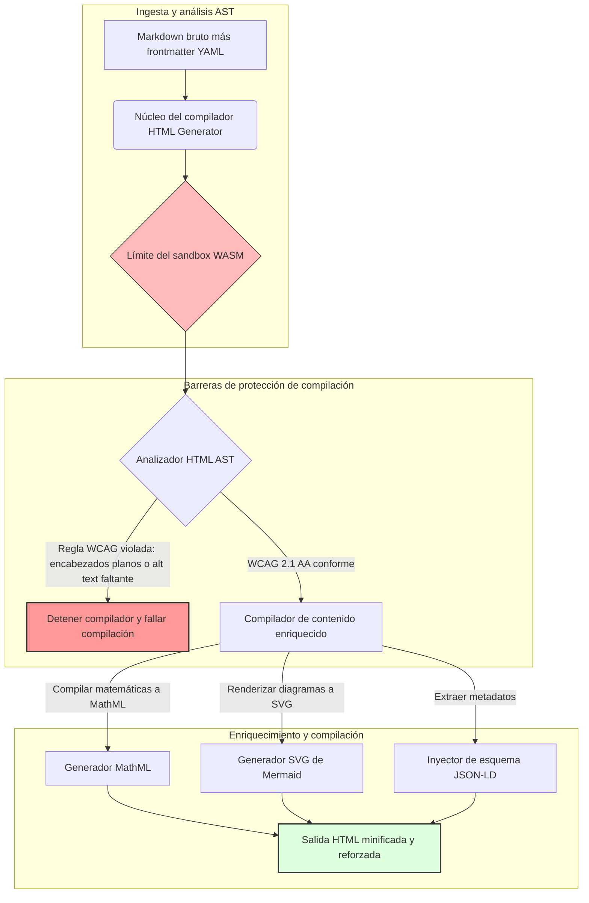

---

# Front Matter (YAML)

author: "contact@sebastienrousseau.com (Sebastien Rousseau)"
banner_alt: "Geometría arquitectónica bajo luz estructurada — símbolo del papel de HTML Generator como pipeline Markdown a HTML controlado por compilador para infraestructura de publicación accesible, lista para SEO y en sandbox"
banner_height: "1597"
banner_width: "2584"
banner: "https://cloudcdn.pro/api/transform?url=/stocks/images/markus-winkler-IrRbSND5EUc-unsplash.webp&w=1200&format=webp&q=80"
cdn: "https://cloudcdn.pro"
charset: "UTF-8"
cname: "sebastienrousseau.com"
copyright: "© Copyright 2025 - 2026 - Sebastien Rousseau. All rights reserved."
date: "June 20, 2026"
description: "HTML Generator es una biblioteca Rust que convierte Markdown en HTML conforme a WCAG, listo para SEO y enriquecido con JSON-LD — accesibilidad como código, soporte de MathML y Mermaid, y ejecución en sandbox WebAssembly para publicación empresarial segura."
format-detection: "telephone=no"
hreflang: "es"
icon: "https://cloudcdn.pro/clients/sebastienrousseau/v1/logos/sebastienrousseau.svg"
id: "https://sebastienrousseau.com/2026-06-20-html-generator-accessible-seo-structured-markdown-rust-2026"
image_alt: "Retrato en blanco y negro de Sebastien Rousseau"
image_height: "162"
image_width: "162"
image: "https://cloudcdn.pro/stocks/images/sebastien-rousseau.png"
keywords: "html-generator, Rust Markdown a HTML, accesibilidad como código, WCAG 2.1 AA, HTML listo para SEO, JSON-LD, MathML, Mermaid, WebAssembly, EAA, DORA, ADA Title III, publicación accesible, análisis en sandbox, código abierto"
language: "es-ES"
last_reviewed: "2026-06-20"
layout: "report"
locale: "es_ES"
logo_alt: "Logotipo de Sebastien Rousseau"
logo_height: "44"
logo_width: "44"
logo: "https://cloudcdn.pro/clients/sebastienrousseau/v1/logos/sebastienrousseau.svg"
menu: ""
measurementID: "G-169G4ET5HQ"
name: "Sebastien Rousseau"
permalink: "https://sebastienrousseau.com/2026-06-20-html-generator-accessible-seo-structured-markdown-rust-2026"
rating: "general"
referrer: "no-referrer"
robots: "index, follow"
schema: "FAQPage, Article"
seo_title: "Accesibilidad como Código: Markdown a HTML AAA con Rust en 2026"
short_name: "sebastienrousseau"
subtitle: "Transformar la publicación web corporativa, la documentación de productos y los portales de clientes de archivos de texto inaccesibles en activos digitales altamente estructurados, conformes y en sandbox."
tags: "html-generator, Rust, Markdown, accesibilidad, WCAG, SEO, JSON-LD, MathML, Mermaid, WebAssembly, EAA, DORA, ADA, descubrimiento por IA, RAG, código abierto, infraestructura bancaria"
theme-color: "0, 83, 191"
title: "Convertir Markdown en HTML Accesible, Listo para SEO y Estructurado con Rust en 2026"
url: "https://sebastienrousseau.com/2026-06-20-html-generator-accessible-seo-structured-markdown-rust-2026"
viewport: "width=device-width, initial-scale=1, shrink-to-fit=no"

# RSS - The RSS feed front matter (YAML).
atom_link: "https://sebastienrousseau.com/2026-06-20-html-generator-accessible-seo-structured-markdown-rust-2026/rss.xml"
category: "Technology"
docs: https://validator.w3.org/feed/docs/rss2.html
generator: "Static Site Generator (SSG) (version 0.0.40)"
item_description: "HTML Generator es una biblioteca Rust que convierte Markdown en HTML conforme a WCAG, listo para SEO y enriquecido con JSON-LD — accesibilidad como código, soporte de MathML y Mermaid, y ejecución en sandbox WebAssembly para publicación empresarial segura."
item_guid: "https://sebastienrousseau.com/2026-06-20-html-generator-accessible-seo-structured-markdown-rust-2026/rss.xml"
item_link: "https://sebastienrousseau.com/2026-06-20-html-generator-accessible-seo-structured-markdown-rust-2026/rss.xml"
item_pub_date: "Sat, 20 Jun 2026 06:06:06 +0000"
item_title: "Convertir Markdown en HTML Accesible, Listo para SEO y Estructurado con Rust en 2026"
last_build_date: "Sat, 20 Jun 2026 06:06:06 +0000"
managing_editor: "contact@sebastienrousseau.com (Sebastien Rousseau)"
pub_date: "Sat, 20 Jun 2026 06:06:06 +0000"
ttl: "60"
type: "article"
webmaster: "contact@sebastienrousseau.com"

# Apple - The Apple front matter (YAML).
apple_mobile_web_app_orientations: "portrait"
apple_touch_icon_sizes: "192x192"
apple-mobile-web-app-capable: "yes"
apple-mobile-web-app-status-bar-inset: "black"
apple-mobile-web-app-status-bar-style: "black-translucent"
apple-mobile-web-app-title: "Markdown a HTML AAA con Rust"
apple-touch-fullscreen: "yes"

# MS Application - The MS Application front matter (YAML).

msapplication-navbutton-color: "0, 83, 191"

# Twitter Card - The Twitter Card front matter (YAML).

twitter_card: "summary_large_image"
twitter_creator: "@wwdseb"
twitter_description: "HTML Generator es una biblioteca Rust que convierte Markdown en HTML conforme a WCAG, listo para SEO y enriquecido con JSON-LD — accesibilidad como código, soporte de MathML y Mermaid, y ejecución en sandbox WebAssembly para publicación empresarial segura."
twitter_image: "https://cloudcdn.pro/clients/sebastienrousseau/v1/logos/sebastienrousseau.svg"
twitter_image_alt: "Logotipo de Sebastien Rousseau"
twitter_site: "@wwdseb"
twitter_title: "Accesibilidad como Código: Markdown a HTML AAA con Rust"
twitter_url: "https://sebastienrousseau.com/2026-06-20-html-generator-accessible-seo-structured-markdown-rust-2026"

# Humans.txt - The Humans.txt front matter (YAML).
author_website: "https://sebastienrousseau.com"
author_twitter: "@wwdseb"
author_location: "London, UK"
thanks: "¡Gracias por leer!"
site_last_updated: "2026-06-20"
site_standards: "HTML5, CSS3, RSS, Atom, JSON, XML, YAML, Markdown, TOML"
site_components: "Kaishi, Kaishi Builder, Kaishi CLI, Kaishi Templates, Kaishi Themes"
site_software: "Static Site Generator, Rust"

---

# Convertir Markdown en HTML Accesible, Listo para SEO y Estructurado con Rust en 2026

<!-- lead-start -->
<aside class="post-lead" aria-label="Resumen del artículo">

<strong>TL;DR.</strong> HTML Generator es un compilador Markdown a HTML en Rust puro que aplica WCAG 2.1 AA en tiempo de compilación, inyecta JSON-LD conforme a esquemas, renderiza MathML y SVG de Mermaid de forma nativa, y aísla el análisis dentro de un sandbox WebAssembly — convirtiendo la publicación en un plano de control controlado por compilador para accesibilidad, SEO y seguridad TIC.

<strong>Puntos clave</strong>

<ul class="post-lead-takeaways">
  <li><strong>Respuesta rápida.</strong> ¿Qué es HTML Generator en una frase?</li>
  <li><strong>Resumen ejecutivo.</strong> El renderizado de Markdown parece trivial; obtener HTML de calidad de publicación es un problema de cumplimiento normativo.</li>
  <li><strong>01. Por qué importa un compilador HTML centrado en la accesibilidad en 2026.</strong> La EAA y ADA Title III han convertido la accesibilidad de higiene de ingeniería en responsabilidad fiduciaria.</li>
  <li><strong>02. La perspectiva arquitectónica de HTML Generator en 2026.</strong> Un pipeline de compilación multietapa y controlado por compilador, desde Markdown bruto hasta salida HTML reforzada.</li>
</ul>

<strong>Lectura relacionada:</strong> <a href="https://sebastienrousseau.com/2026-06-18-noyalib-safe-yaml-rust-ai-mcp-financial-infrastructure-2026">Por qué YAML necesita una pila Rust más segura para IA, MCP e infraestructura financiera en 2026</a>, <a href="https://sebastienrousseau.com/2026-06-17-static-site-generator-secure-default-ai-era-publishing-2026">Un Static Site Generator seguro por defecto para la publicación en la era de la IA en 2026</a>, <a href="https://sebastienrousseau.com/2026-06-11-cloudcdn-open-source-blueprint-ai-native-edge-2026">CloudCDN: Un modelo de referencia de código abierto para el edge nativo en la nube con IA en 2026</a>.

</aside>
<!-- lead-end -->

En 2026, el contenido web es consumido tanto por rastreadores de búsqueda de IA, motores de búsqueda respaldados por LLM y pipelines de Generación Aumentada por Recuperación (RAG) como por lectores humanos. El HTML plano o malformado compromete la descubribilidad por máquinas, mientras que el incumplimiento de regulaciones globales estrictas como la [Ley Europea de Accesibilidad (EAA)](https://www.accessibility-act.eu/) y el [ADA Title III de EE. UU.](https://www.ada.gov/topics/title-iii/) constituye ya una responsabilidad civil inequívoca. [HTML Generator](https://github.com/sebastienrousseau/html-generator) es una biblioteca Rust de alto rendimiento diseñada para cerrar esas brechas — en el compilador, no en parches post-despliegue.

## Respuesta rápida

**¿Qué es HTML Generator en una frase?** HTML Generator es un compilador de código abierto Markdown a HTML en Rust puro que aplica [WCAG 2.1 AA](https://www.w3.org/TR/WCAG21/) en tiempo de compilación, genera referencias semánticas y atributos ARIA automáticamente, inyecta metadatos [JSON-LD](https://json-ld.org/) conformes a esquemas desde el frontmatter YAML, renderiza diagramas Mermaid y matemáticas en SVG accesible y MathML, y se ejecuta dentro de un sandbox [WebAssembly](https://webassembly.org/) — convirtiendo la publicación corporativa en un plano de control controlado por compilador de calidad fiduciaria.

## Resumen ejecutivo

El renderizado de Markdown parece trivial. El HTML de calidad de publicación es un problema de cumplimiento normativo. En junio de 2026, cada punto de contacto corporativo — portales de relaciones con inversores, registros regulatorios, documentación de clientes, referencias de API, activos de marketing — es analizado tanto por humanos como por máquinas. Dos presiones coinciden en cada página: la [EAA](https://www.accessibility-act.eu/) y el [ADA Title III](https://www.ada.gov/topics/title-iii/) convierten la accesibilidad en una exposición legal a nivel de consejo de administración, mientras que los pipelines de ingesta de IA y RAG premian la salida estructurada y legible por máquinas. Las bibliotecas Markdown estándar producen HTML plano que falla ambos controles. HTML Generator trata la generación de documentos como un pipeline controlado por compilador: la validación WCAG es un error de compilación, JSON-LD proviene del frontmatter YAML sin marcado manual, MathML y Mermaid se renderizan de forma accesible, y todo el motor se distribuye como objetivo WebAssembly para que el análisis de documentos no confiables permanezca en sandbox fuera del host.

## Puntos clave

- **La accesibilidad como código es la nueva línea base.** La EAA exige accesibilidad para los servicios digitales de consumo. HTML Generator evalúa el árbol de documentos en tiempo de compilación, generando referencias semánticas y atributos ARIA automáticamente — menos correcciones post-despliegue, menos presupuestos de remediación, sin texto alternativo faltante que llegue a producción.
- **Datos estructurados para el descubrimiento por IA.** La búsqueda moderna y RAG dependen de metadatos legibles por máquinas. El compilador analiza el frontmatter YAML e inyecta [JSON-LD conforme a Schema.org](https://schema.org/) directamente en el encabezado del documento, haciendo el contenido completamente interpretable por [Google Rich Results](https://developers.google.com/search/docs/appearance/structured-data/intro-structured-data), [Bing Webmaster](https://www.bing.com/webmasters) y rastreadores respaldados por LLM.
- **Excelencia en contenido técnico.** La publicación técnica no es texto plano. HTML Generator compila extensiones matemáticas de Markdown en [MathML](https://www.w3.org/Math/) accesible y renderiza diagramas [Mermaid.js](https://mermaid.js.org/) a SVG responsivo — ambos preservando la estructura conforme a WCAG en lugar de degradarse a imágenes opacas.
- **Sandbox WebAssembly.** El análisis de Markdown no confiable es un riesgo de seguridad. Al apuntar a [WASM](https://webassembly.org/), HTML Generator se ejecuta dentro de un sandbox aislado que previene la ejecución de código arbitrario y protege el sistema host — satisfaciendo directamente las obligaciones de seguridad TIC del [DORA Artículo 6](https://eur-lex.europa.eu/legal-content/EN/TXT/?uri=CELEX%3A32022R2554).
- **Protección fiduciaria para consejos de administración.** El incumplimiento técnico ha llegado a la sala del consejo. Estandarizar en un motor HTML controlado por compilador protege a los consejeros y a la alta dirección de la exposición civil y regulatoria personal bajo DORA, la EAA y ADA Title III.

**Lectura relacionada:** [Por qué YAML necesita una pila Rust más segura para IA, MCP e infraestructura financiera en 2026](https://sebastienrousseau.com/2026-06-18-noyalib-safe-yaml-rust-ai-mcp-financial-infrastructure-2026/), [Un Static Site Generator seguro por defecto para la publicación en la era de la IA en 2026](https://sebastienrousseau.com/2026-06-17-static-site-generator-secure-default-ai-era-publishing-2026/), [CloudCDN: Un modelo de referencia de código abierto para el edge nativo en la nube con IA en 2026](https://sebastienrousseau.com/2026-06-11-cloudcdn-open-source-blueprint-ai-native-edge-2026/).

## 01. Por Qué Importa un Compilador HTML Centrado en la Accesibilidad en 2026

Los activos web corporativos, las bibliotecas de documentación y los centros de ayuda de productos son puntos de contacto digitales críticos. Están sujetos ahora a dos presiones intensas que se entrecruzan.

La primera es la **ingesta y descubribilidad por IA**. El contenido es procesado cada vez más por grandes modelos de lenguaje y pipelines de Generación Aumentada por Recuperación. El HTML plano o malformado confunde el análisis de los rastreadores, dejando la investigación corporativa y la documentación invisible para los paradigmas de búsqueda modernos — incluida la [Google Search Generative Experience](https://blog.google/products/search/generative-ai-search/), la navegación de [ChatGPT](https://chat.openai.com/) y los agentes RAG empresariales.

La segunda es la **estricta legislación global de accesibilidad**. Bajo la [Ley Europea de Accesibilidad](https://www.accessibility-act.eu/) (plenamente aplicable desde junio de 2025) y el [ADA Title III de EE. UU.](https://www.ada.gov/topics/title-iii/), las plataformas de publicación corporativa deben garantizar la accesibilidad digital completa. No cumplir con [WCAG 2.1 AA](https://www.w3.org/TR/WCAG21/) ya no es un descuido de ingeniería; es una responsabilidad civil y regulatoria que ha generado acuerdos de varios millones de dólares.

[HTML Generator](https://github.com/sebastienrousseau/html-generator) aborda ambas presiones directamente. Es una biblioteca Rust segura para subprocesos diseñada para transformar Markdown en HTML accesible, listo para SEO y estructurado. Al tratar la generación de documentos como un pipeline controlado por compilador, el motor ofrece un alto **Retorno sobre la Resiliencia (RoR)** — protegiendo los balances de la litigación por accesibilidad mientras maximiza la legibilidad por máquinas para el descubrimiento por IA.

## 02. La Perspectiva Arquitectónica de HTML Generator en 2026

El framework está diseñado como un pipeline de compilación seguro y multietapa que convierte texto Markdown bruto en activos estáticos altamente accesibles verificados criptográficamente.

### Tabla 1: Capas de arquitectura de HTML Generator y mitigación de riesgos

| Capa | Decisión de diseño | Por qué importa | Riesgo si se gestiona mal |
| ---- | ---- | ---- | ---- |
| **Capa de entrada** | Markdown más analizador de frontmatter YAML | Encuentra a los redactores donde están; separa la prosa de los metadatos estructurales. | Metadatos inconsistentes, sitemaps rotos, brechas de indexación. |
| **Capa de estructura** | Tabla de contenidos automatizada y referencias semánticas con etiquetas ARIA | Produce árboles de documentos navegables y accesibles por construcción. | HTML plano que rompe los lectores de pantalla y viola WCAG. |
| **Capa de contenido enriquecido** | Renderizado nativo de MathML y SVG de Mermaid.js | Compila fórmulas y diagramas en SVG y MathML accesibles. | Retraso de renderizado JS en el lado del cliente y salida rota para tecnología de asistencia. |
| **Capa de SEO y datos** | Generación integrada de JSON-LD y metadatos estructurados | Inyecta JSON-LD conforme a [Schema.org](https://schema.org/) directamente en el encabezado. | Motores de búsqueda y rastreadores de IA malinterpretando autor, contexto, licencia. |
| **Capa de ejecución** | Compilador Rust nativo con objetivo WebAssembly | Permite ejecución segura en sandbox en servidores, nodos edge y navegadores. | Ejecución de código arbitrario durante el análisis de Markdown no confiable. |

## 03. Señales Clave de Seguridad Web y Accesibilidad

Para verificar que los activos de publicación de cara al público cumplen las auditorías regulatorias y de seguridad modernas, los altos responsables de tecnología deben monitorizar métricas específicas y cuantificables.

### Tabla 2: Señales de seguridad web y accesibilidad

| Señal | Métrica / referencia operativa | Referencia EAA / DORA / W3C | Implementación técnica |
| ---- | ---- | ---- | ---- |
| **Conformidad de accesibilidad** | 100 % de páginas compiladas validadas contra las reglas WCAG 2.1 AA. | [EAA](https://www.accessibility-act.eu/) y [ADA Title III](https://www.ada.gov/topics/title-iii/) | Analizador HTML en tiempo de compilación que evalúa atributos alt de imágenes y referencias semánticas. |
| **Sandbox de ejecución WASM** | 100 % de entradas Markdown no confiables compiladas en un entorno de ejecución WebAssembly aislado. | [DORA Artículo 6](https://eur-lex.europa.eu/legal-content/EN/TXT/?uri=CELEX%3A32022R2554) (seguridad TIC) | Aislamiento del entorno de análisis respecto al servidor host. |
| **Cobertura de metadatos estructurados** | 100 % de artículos publicados con encabezados JSON-LD válidos y conformes al esquema. | Especificaciones de [Schema.org](https://schema.org/) | Análisis automático del frontmatter y conversión a objetos JSON-LD. |
| **Rendimiento de compilación** | Objetivo de páginas por segundo superior a 10.000 en hardware estándar. | Retorno sobre la Resiliencia (RoR) | Compilador AST en Rust altamente paralelizado. |
| **Verificación de fragmentos enriquecidos** | Cero errores de análisis en [Google Rich Results](https://search.google.com/test/rich-results) y ejecuciones del [Schema validator](https://validator.schema.org/). | Directrices de Google Search | Validación estructural del JSON-LD generado durante el pipeline de compilación. |

## 04. El Mito del Renderizado Simple de Markdown

Un error común entre los responsables de tecnología es que convertir Markdown a HTML es un simple ejercicio de sustitución de texto. Muchas bibliotecas estándar traducen el formato Markdown en HTML plano y no estructurado. El resultado se muestra a un lector con visión en un navegador, pero representa una trampa de cumplimiento normativo.

El HTML plano típicamente carece de tres elementos.

1. **Jerarquías de encabezados correctas.** El Markdown estándar no impone el orden de los encabezados. Saltar de un `<h1>` a un `<h4>` viola WCAG 2.1 AA y rompe la navegación del documento para los lectores de pantalla.
2. **Semántica de tablas explícita.** Las tablas Markdown estándar rara vez se renderizan con los atributos correctos de ámbito `<th>` y `<tbody>` requeridos para el análisis accesible.
3. **Metadatos legibles por máquinas.** El HTML estándar carece de los ganchos JSON-LD de los que dependen las plataformas de búsqueda de IA modernas y los sistemas de ingesta RAG.

HTML Generator resuelve esto analizando Markdown en un **Árbol de Sintaxis Abstracta (AST)**. El motor evalúa la estructura del documento antes de emitir HTML, validando el anidamiento de encabezados, inyectando los atributos ARIA apropiados y verificando que cada activo multimedia lleve texto alternativo — convirtiendo la accesibilidad de una auditoría manual en una invariante garantizada en tiempo de compilación.

## 05. Diseñar un Pipeline de Compilación de Accesibilidad como Código

Para evitar que activos inaccesibles o no indexados lleguen al despliegue público, la accesibilidad debe ser una barrera estricta del compilador. El siguiente pipeline muestra cómo HTML Generator evalúa Markdown, ejecuta la validación aislada en WebAssembly y emite HTML reforzado y estructurado.

## 06. El Manual del Consejo de Administración y la Responsabilidad Fiduciaria

El cumplimiento moderno de la accesibilidad y la seguridad web son cuestiones no negociables en la sala del consejo. La alta dirección debe abordar la infraestructura de publicación desde la perspectiva del riesgo legal, la preservación financiera y la exposición regulatoria.

- **La Ley Europea de Accesibilidad (EAA).** Impone mandatos de cumplimiento directamente vinculantes a los portales digitales públicos y privados. El incumplimiento puede acarrear sanciones financieras severas, litigación civil y la retirada inmediata del activo del mercado europeo. Al integrar la accesibilidad como código, los consejos pueden certificar que el código no conforme no puede publicarse — convirtiendo la remediación reactiva en un escudo legal estructural.
- **DORA Artículo 6 (Entornos TIC seguros).** Establece normas estrictas para la seguridad del entorno TIC. Al aislar la compilación de Markdown dentro de un sandbox WebAssembly, las organizaciones garantizan que el análisis de documentación cargada por clientes o feeds de socios no pueda exponer los servidores host a la ejecución de código arbitrario, protegiendo los portales bancarios críticos.
- **Reducción de costes en auditorías de cumplimiento.** El cumplimiento tradicional de accesibilidad depende de auditorías post-despliegue retrospectivas y costosas — decenas de miles de dólares anuales por sitio. Implementar la validación WCAG como bloqueo en tiempo de compilación elimina esos costes retrospectivos, desplazando el presupuesto de cumplimiento de la defensa a la innovación.

## 07. Lo que Esto Significa por Tipo de Banco / Empresa

### Bancos Globales de Importancia Sistémica (G-SIBs)

Los G-SIBs operan activos públicos masivos y multilingües que publican miles de informes de investigación, divulgaciones regulatorias y documentos de relaciones con inversores en múltiples jurisdicciones. Su reto es la escala y la paridad multilingüe. El objetivo WebAssembly de HTML Generator y el motor Rust de alto rendimiento permiten que las bibliotecas de investigación localizadas a gran escala se actualicen, compilen y desplieguen globalmente en segundos — sin retraso de renderizado ni regresión de accesibilidad.

### Bancos de Transacciones y Corporativos

Para los bancos de transacciones, los portales de clientes, los centros de documentación y las guías de API de desarrollo son puntos de contacto digitales críticos. Compilar esos activos a través de HTML Generator significa que los canales de cara al cliente no presentan exposición a XSS, vectores de secuestro de dependencias ni déficits de accesibilidad — preservando la confianza institucional y reduciendo la superficie de litigación.

### Bancos Regionales y Fintechs

Los bancos regionales y las fintechs ágiles compiten en experiencia digital sin los presupuestos de ingeniería de un G-SIB. HTML Generator proporciona a esos equipos un pipeline de publicación de calidad empresarial listo para usar, permitiendo que los activos más pequeños publiquen activos accesibles, listos para SEO y en sandbox que resisten el escrutinio tanto de los reguladores como de los clientes corporativos potenciales.

## 08. La Hoja de Ruta de la Infraestructura de Publicación

Los activos web de cara al público corporativo son un componente central de la resiliencia operativa. Depender de motores web lentos, dinámicamente vulnerables y respaldados por bases de datos — o activos estáticos sin firma — es un riesgo empresarial inaceptable.

Para asegurar los puntos de contacto digitales públicos y proteger los balances de la litigación por accesibilidad, los altos responsables de tecnología y seguridad deben ejecutar una hoja de ruta clara.

1. **Transición a arquitecturas estáticas.** Eliminar gradualmente las plataformas CMS dinámicas heredadas para activos de investigación, marketing y documentación. Migrar el contenido a pipelines controlados por compilador como HTML Generator.
2. **Aplicar la accesibilidad en tiempo de compilación.** Implementar la accesibilidad como código. Fallar los pipelines de compilación automáticamente ante cualquier violación de WCAG 2.1 AA.
3. **Aislar el análisis en WebAssembly.** Ejecutar en sandbox todo el análisis de documentos y contenido dentro de un entorno de ejecución WASM para que las entradas no confiables nunca toquen los sistemas host.
4. **Inyectar metadatos JSON-LD enriquecidos.** Garantizar que cada activo publicado lleve encabezados JSON-LD conformes al esquema para maximizar la descubribilidad por IA.

## 09. Preguntas Frecuentes

**¿Cómo aplica HTML Generator la accesibilidad?**

Analiza el Árbol de Sintaxis Abstracta HTML generado en tiempo de compilación, evaluando el documento contra las reglas de [WCAG 2.1 AA](https://www.w3.org/TR/WCAG21/). Si se viola una regla — un atributo alt faltante, un salto de encabezado, un control de formulario sin etiqueta — el compilador detiene la compilación, tratando la accesibilidad como una invariante en tiempo de compilación en lugar de una tarea de auditoría post-despliegue.

**¿Por qué es importante el aislamiento en WebAssembly?**

[WebAssembly](https://webassembly.org/) permite que el motor de análisis de Markdown se ejecute dentro de un sandbox aislado, segregado del servidor host. Incluso cuando un actor hostil carga un documento Markdown elaborado para explotar vulnerabilidades del analizador, la ejecución queda atrapada — protegiendo los sistemas host y satisfaciendo las obligaciones de seguridad TIC del DORA Artículo 6.

**¿Cómo beneficia JSON-LD a la descubribilidad en búsquedas en 2026?**

[JSON-LD](https://json-ld.org/) proporciona metadatos estructurados y legibles por máquinas en el encabezado del documento. [Google Rich Results](https://developers.google.com/search/docs/appearance/structured-data/intro-structured-data), los rastreadores de Bing y los agentes de búsqueda respaldados por LLM identifican inmediatamente al autor, la licencia, la fecha de publicación y el contexto semántico — superando la ambigüedad del HTML estándar y aumentando la superficie en el descubrimiento impulsado por IA.

**¿A quién va dirigido HTML Generator?**

Constructores de sitios estáticos, equipos de documentación, redactores técnicos, desarrolladores Rust e ingenieros de plataformas que publican activos críticos para la accesibilidad o de cara a reguladores. También es una capa de procesamiento de contenido viable dentro de pipelines de publicación segura más amplios como [Static Site Generator (SSG)](https://github.com/sebastienrousseau/static-site-generator).

## 10. Referencias

- World Wide Web Consortium (W3C), 2024. [Pautas de Accesibilidad para el Contenido Web (WCAG) 2.1 ⧉](https://www.w3.org/TR/WCAG21/ "Web Content Accessibility Guidelines 2.1").
- Schema.org, 2026. [Especificaciones de datos estructurados de Schema.org ⧉](https://schema.org/ "Schema.org structured-data specifications").
- Parlamento Europeo y Consejo de la Unión Europea, 2022. [Reglamento (UE) 2022/2554 sobre la resiliencia operativa digital del sector financiero (DORA) ⧉](https://eur-lex.europa.eu/legal-content/EN/TXT/?uri=CELEX%3A32022R2554 "DORA Regulation").
- Comisión Europea, 2025. [Ley Europea de Accesibilidad ⧉](https://www.accessibility-act.eu/ "European Accessibility Act").
- Departamento de Justicia de EE. UU., 2024. [ADA Title III ⧉](https://www.ada.gov/topics/title-iii/ "ADA Title III").
- WebAssembly Community Group, 2026. [Especificación WebAssembly ⧉](https://webassembly.org/ "WebAssembly").
- GitHub, 2026. [Repositorio HTML Generator ⧉](https://github.com/sebastienrousseau/html-generator "HTML Generator open-source repository").

<!-- enrich-start -->
<aside class="author-card" aria-label="Sobre el autor"><strong class="author-card-name"><a href="/about/index.html">Sebastien Rousseau</a></strong>Tecnólogo bancario senior que escribe sobre IA aplicada, infraestructura de pagos, dinero tokenizado, ISO 20022, seguridad poscuántica, servicios financieros nativo en la nube, infraestructura de código abierto y mercados digitales regulados.Más de 20 años en HSBC Commercial &amp; Investment Bank, PayPal, Barclays, Shazam, AKQA, Virgin Group. <a href="/about/index.html">Perfil completo</a> &middot; <a href="https://www.linkedin.com/in/sebastienrousseau/" rel="external noopener">LinkedIn</a> &middot; <a href="https://github.com/sebastienrousseau" rel="external noopener">GitHub</a></aside>

Última revisión <time datetime="2026-06-20">2026-06-20</time>.

<!-- enrich-end -->
