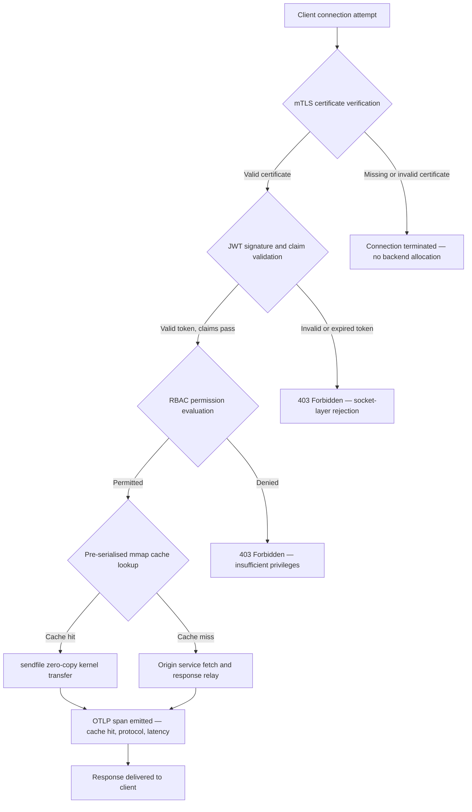

---

# Front Matter (YAML)

author: "contact@sebastienrousseau.com (Sebastien Rousseau)"
banner_alt: "Paisaje urbano abstracto de placas de circuitos de noche — visualizando el edge bancario donde las transferencias zero-copy a nivel de kernel, los handshakes mTLS y la validación JWT convergen en un único binario enlazado estáticamente"
banner_height: "1597"
banner_width: "2584"
banner: "https://cloudcdn.pro/stocks/images/bit-cloud-GlqbGLCPnQ4.webp"
cdn: "https://cloudcdn.pro"
charset: "UTF-8"
cname: "sebastienrousseau.com"
copyright: "© Copyright 2025 - 2026 - Sebastien Rousseau. All rights reserved."
date: "June 20, 2026"
description: "http-handle es un binario Rust enlazado estáticamente que entrega 180.000 solicitudes por segundo en el edge bancario sin dependencias en tiempo de ejecución, con validación mTLS y JWT integrada, HTTP/2 y HTTP/3 negociados por ALPN, y observabilidad OTLP — cerrando las brechas de seguridad y resiliencia que Nginx y Envoy dejan abiertas."
format-detection: "telephone=no"
hreflang: "es"
icon: "https://cloudcdn.pro/clients/sebastienrousseau/v1/logos/sebastienrousseau.svg"
id: "https://sebastienrousseau.com/2026-06-20-http-handle-zero-dependency-edge-ingress-banking-rust-2026"
image_alt: "Retrato en blanco y negro de Sebastien Rousseau"
image_height: "162"
image_width: "162"
image: "https://cloudcdn.pro/stocks/images/sebastien-rousseau.png"
keywords: "http-handle, ingress edge Rust, proxy sin dependencias, infraestructura bancaria, mTLS JWT, sendfile zero-copy, ALPN HTTP3, cumplimiento DORA, Basilea III, observabilidad OTLP, binario estático, ARM64 banca, zero trust banca, ingress ligero, seguridad Rust banca"
language: "es-ES"
last_reviewed: "2026-06-20"
layout: "report"
locale: "es_ES"
logo_alt: "Logo de Sebastien Rousseau"
logo_height: "44"
logo_width: "44"
logo: "https://cloudcdn.pro/clients/sebastienrousseau/v1/logos/sebastienrousseau.svg"
menu: ""
measurementID: "G-169G4ET5HQ"
name: "Sebastien Rousseau"
permalink: "https://sebastienrousseau.com/2026-06-20-http-handle-zero-dependency-edge-ingress-banking-rust-2026"
rating: "general"
referrer: "no-referrer"
robots: "index, follow"
schema: "FAQPage, Article"
seo_title: "http-handle: Ingress Rust sin dependencias para banca a 180k req/s"
short_name: "sebastienrousseau"
subtitle: "Cómo un único binario Rust enlazado estáticamente entrega 180.000 solicitudes por segundo con mTLS, JWT y ALPN en el edge bancario — y qué significa para el cumplimiento de DORA y Basilea III."
tags: "http-handle, Rust, banking, edge-ingress, mTLS, JWT, ALPN, HTTP3, DORA, Basel-III, zero-copy, sendfile, ARM64, zero-trust, OTLP, observability, open-source, infrastructure"
theme-color: "0, 83, 191"
title: "http-handle: Edge Ingress de Alto Rendimiento sin Dependencias para Banca en 2026"
url: "https://sebastienrousseau.com/2026-06-20-http-handle-zero-dependency-edge-ingress-banking-rust-2026"
viewport: "width=device-width, initial-scale=1, shrink-to-fit=no"

# RSS - The RSS feed front matter (YAML).
atom_link: "https://sebastienrousseau.com/2026-06-20-http-handle-zero-dependency-edge-ingress-banking-rust-2026/rss.xml"
category: "Technology"
docs: https://validator.w3.org/feed/docs/rss2.html
generator: "Static Site Generator (SSG) (version 0.0.40)"
item_description: "http-handle es un binario Rust enlazado estáticamente que entrega 180.000 solicitudes por segundo en el edge bancario sin dependencias en tiempo de ejecución, con validación mTLS y JWT integrada, HTTP/2 y HTTP/3 negociados por ALPN, y observabilidad OTLP — cerrando las brechas de seguridad y resiliencia que Nginx y Envoy dejan abiertas."
item_guid: "https://sebastienrousseau.com/2026-06-20-http-handle-zero-dependency-edge-ingress-banking-rust-2026/rss.xml"
item_link: "https://sebastienrousseau.com/2026-06-20-http-handle-zero-dependency-edge-ingress-banking-rust-2026/rss.xml"
item_pub_date: "Sat, 20 Jun 2026 07:07:07 +0000"
item_title: "http-handle: Edge Ingress de Alto Rendimiento sin Dependencias para Banca en 2026"
last_build_date: "Sat, 20 Jun 2026 07:07:07 +0000"
managing_editor: "contact@sebastienrousseau.com (Sebastien Rousseau)"
pub_date: "Sat, 20 Jun 2026 07:07:07 +0000"
ttl: "60"
type: "article"
webmaster: "contact@sebastienrousseau.com"

# Apple - The Apple front matter (YAML).
apple_mobile_web_app_orientations: "portrait"
apple_touch_icon_sizes: "192x192"
apple-mobile-web-app-capable: "yes"
apple-mobile-web-app-status-bar-inset: "black"
apple-mobile-web-app-status-bar-style: "black-translucent"
apple-mobile-web-app-title: "Edge Bancario sin Dependencias"
apple-touch-fullscreen: "yes"

# MS Application - The MS Application front matter (YAML).

msapplication-navbutton-color: "0, 83, 191"

# Twitter Card - The Twitter Card front matter (YAML).

twitter_card: "summary_large_image"
twitter_creator: "@wwdseb"
twitter_description: "http-handle es un binario Rust enlazado estáticamente que entrega 180.000 solicitudes por segundo en el edge bancario sin dependencias en tiempo de ejecución, con mTLS, JWT y observabilidad OTLP."
twitter_image: "https://cloudcdn.pro/clients/sebastienrousseau/v1/logos/sebastienrousseau.svg"
twitter_image_alt: "Logo of Sebastien Rousseau"
twitter_site: "@wwdseb"
twitter_title: "http-handle: Ingress Rust sin dependencias para banca a 180k req/s"
twitter_url: "https://sebastienrousseau.com/2026-06-20-http-handle-zero-dependency-edge-ingress-banking-rust-2026"

# Humans.txt - The Humans.txt front matter (YAML).
author_website: "https://sebastienrousseau.com"
author_twitter: "@wwdseb"
author_location: "London, UK"
thanks: "Thanks for reading!"
site_last_updated: "2026-06-20"
site_standards: "HTML5, CSS3, RSS, Atom, JSON, XML, YAML, Markdown, TOML"
site_components: "Kaishi, Kaishi Builder, Kaishi CLI, Kaishi Templates, Kaishi Themes"
site_software: "Static Site Generator, Rust"

---

# http-handle: Edge Ingress de Alto Rendimiento sin Dependencias para Banca en 2026

<!-- lead-start -->
<aside class="post-lead" aria-label="Resumen del artículo">

<strong>Resumen.</strong> http-handle es un binario Rust de código abierto enlazado estáticamente que reemplaza a Nginx y Envoy en el edge bancario. Entrega 180.000 solicitudes por segundo en nodos ARM64 mediante transferencias zero-copy de Linux <code>sendfile(2)</code>, impone la verificación mTLS y JWT en la capa de socket de red antes de ejecutar cualquier código de aplicación, negocia automáticamente HTTP/2 y HTTP/3 mediante ALPN, y emite métricas de OpenTelemetry de forma nativa — todo sin dependencias en tiempo de ejecución más allá de <code>libc</code>.

<strong>Conclusiones clave</strong>

<ul class="post-lead-takeaways">
  <li><strong>El problema del proxy pesado.</strong> Nginx y Envoy arrastran árboles de dependencias que amplían la superficie CVE y complican los ciclos de remediación de riesgo ICT de DORA.</li>
  <li><strong>Rendimiento zero-copy a escala.</strong> Los bloques de caché mmap pre-serializados y las transferencias de kernel <code>sendfile(2)</code> sostienen 180.000 req/s en ARM64 con una latencia de proxy inferior a un milisegundo.</li>
  <li><strong>Seguridad en el socket, no en la aplicación.</strong> La verificación del certificado de cliente mTLS, la validación JWT y la evaluación RBAC se completan antes de que se asigne cualquier recurso de backend a la solicitud.</li>
  <li><strong>Alineación regulatoria integrada.</strong> La superficie de ataque reducida y el despliegue auditable de binario único abordan directamente los artículos 5 y 6 de DORA, el riesgo operativo de Basilea III y las cadenas de responsabilidad SM&CR.</li>
</ul>

<strong>Lectura relacionada:</strong> <a href="https://sebastienrousseau.com/2026-06-18-noyalib-safe-yaml-rust-ai-mcp-financial-infrastructure-2026">Por qué YAML necesita una pila Rust más segura para IA, MCP e infraestructura financiera en 2026</a>, <a href="https://sebastienrousseau.com/2026-06-11-cloudcdn-open-source-blueprint-ai-native-edge-2026">CloudCDN: Un blueprint de código abierto para el edge nativo de IA en 2026</a>, <a href="https://sebastienrousseau.com/2026-05-16-best-cloud-infrastructure-architecture-2026">Mejor arquitectura de infraestructura cloud para bancos e instituciones financieras en 2026</a>.

</aside>
<!-- lead-end -->

El edge bancario tiene un problema de dependencias. Cada instancia de Nginx o Envoy que enruta el tráfico entre un cliente y un servicio bancario central arrastra un árbol de dependencias: compilaciones de OpenSSL, módulos Lua, bibliotecas gRPC y capas de contenedor — cada una un posible CVE, cada una requiriendo un ciclo de parches dedicado, cada una añadiendo varianza de latencia que complica la medición del SLA. Bajo el [Reglamento de Resiliencia Operativa Digital (DORA)](https://eur-lex.europa.eu/eli/reg/2022/2554/oj), esa complejidad es ahora una responsabilidad regulatoria tanto como operativa.

[http-handle](https://github.com/sebastienrousseau/http-handle) adopta un enfoque diferente. Es un único binario Rust enlazado estáticamente sin dependencias en tiempo de ejecución más allá de `libc`. Entrega 180.000 solicitudes por segundo en nodos ARM64, impone TLS mutuo y autenticación JWT en la capa de socket de red, y negocia automáticamente HTTP/2 y HTTP/3 — todo dentro de una huella de despliegue inferior a 20 MB de RAM.

## Respuesta rápida

**¿Qué es http-handle en una frase?** http-handle es un binario Rust de código abierto enlazado estáticamente que reemplaza los contenedores de proxy pesados en el edge bancario, entregando 180.000 req/s en ARM64 mediante transferencias de kernel zero-copy `sendfile(2)` de Linux, imponiendo mTLS, JWT y RBAC en la capa de socket antes de tocar cualquier recurso de backend, y emitiendo métricas nativas de [OpenTelemetry](https://opentelemetry.io/) — sin dependencias de biblioteca en tiempo de ejecución más allá de `libc`.

## Resumen ejecutivo

Los bancos han ejecutado Nginx y Envoy en su edge durante una década. Ambos son capaces; ninguno fue diseñado para el entorno regulatorio de 2026. Las imágenes de contenedores cargadas de dependencias generan colas de CVE que los equipos de cumplimiento no pueden limpiar con suficiente rapidez, y cada actualización de versión de biblioteca conlleva riesgo de regresión. Los artículos 5 y 6 de DORA exigen que el riesgo ICT se gestione por diseño, no se parchee tras el descubrimiento. Los marcos de riesgo operativo de Basilea III penalizan las arquitecturas donde los puntos de fallo se multiplican con la complejidad del sistema.

http-handle elimina el problema de dependencias en la fuente. El binario se compila una vez, estáticamente, sin requisitos de biblioteca externa en tiempo de ejecución. La superficie de ataque se contrae a la biblioteca estándar de Rust más `libc`. La aplicación de seguridad — verificación de certificados mTLS, validación de claims JWT y control de acceso basado en roles — se ejecuta en el socket de red antes de cualquier asignación de backend, colapsando el perímetro Zero Trust a su expresión mínima posible. El rendimiento sigue a la arquitectura: los bloques de caché mapeados en memoria pre-serializados combinados con transferencias de kernel `sendfile(2)` eliminan los datos del camino de copia de CPU a memoria por completo, sosteniendo 180.000 req/s en hardware ARM64. El resultado es una capa de ingress que satisface los requisitos de resiliencia de DORA, apoya los argumentos de reducción de riesgo operativo de Basilea III y ofrece a los líderes senior de TI bajo SM&CR una cadena de responsabilidad de un único componente verificable para la infraestructura edge.

## Conclusiones clave

- **Binarios más pequeños, colas CVE más cortas.** Un único binario enlazado estáticamente tiene un paquete para parchear, un release para validar y un artefacto para auditar. Nginx con un conjunto de módulos estándar se entrega con más de 30 dependencias de biblioteca compartida; cada una lleva su propio ciclo de vida de vulnerabilidad.
- **Zero-copy no es una optimización — es una restricción de diseño.** A 180.000 req/s, cualquier copia de datos en el espacio de usuario introduce varianza de latencia medible. `sendfile(2)` transfiere el contenido del descriptor de archivo — o una región mapeada en memoria — a un descriptor de archivo de socket de red, completamente dentro del kernel. Combinado con bloques de caché de respuesta anclados con mmap, la CPU nunca toca la ruta de datos para las respuestas en caché.
- **El perímetro de seguridad pertenece al socket.** Validar JWTs y certificados mTLS en el middleware de la aplicación significa que el backend ya ha asignado hilos y memoria antes de rechazar la solicitud. La validación en la capa de socket garantiza que las solicitudes no autenticadas no consuman ningún recurso de backend.
- **OTLP elimina la brecha de observabilidad.** La integración nativa de OpenTelemetry significa que cada solicitud, cada decisión de autenticación y cada negociación de protocolo produce telemetría estructurada sin un agente sidecar. Los paneles bancarios existentes ingieren trazas OTLP directamente.

**Lectura relacionada:** [Por qué YAML necesita una pila Rust más segura para IA, MCP e infraestructura financiera en 2026](https://sebastienrousseau.com/2026-06-18-noyalib-safe-yaml-rust-ai-mcp-financial-infrastructure-2026/), [CloudCDN: Un blueprint de código abierto para el edge nativo de IA en 2026](https://sebastienrousseau.com/2026-06-11-cloudcdn-open-source-blueprint-ai-native-edge-2026/), [Mejor arquitectura de infraestructura cloud para bancos e instituciones financieras en 2026](https://sebastienrousseau.com/2026-05-16-best-cloud-infrastructure-architecture-2026/).

## 01. El Problema del Proxy Pesado en Banca

Nginx y Envoy construyeron el edge del internet moderno. Son configurables, probados en batalla y respaldados por grandes comunidades. También son elecciones arquitectónicas tomadas antes de que existiera DORA, antes de que los marcos de riesgo operativo de Basilea III exigieran reducciones de complejidad cuantificables, y antes de que los nodos ARM64 en la nube cambiaran la economía del cómputo de alto rendimiento.

La consecuencia práctica es una brecha entre lo que los bancos necesitan y lo que entregan los contenedores de proxy pesados.

**Superficie de dependencias.** Un despliegue estándar de Envoy tira de OpenSSL, Abseil, Protobuf, gRPC, Lua y docenas de bibliotecas secundarias. Cada una lleva un ciclo de vida CVE independiente. Cuando la Base de Datos Nacional de Vulnerabilidades publica un aviso crítico de OpenSSL, cada instancia de Envoy en el patrimonio se convierte en un reloj de cumplimiento: evaluar, parchear, probar, volver a desplegar y re-certificar — en cada entorno donde corre el binario. Bajo el artículo 6 de DORA, los bancos deben demostrar que los procesos de gestión de riesgo ICT son proporcionados, documentados y verificables. Un árbol de dependencias de múltiples bibliotecas hace que esa demostración sea cara de mantener.

**Sobrecarga de memoria.** Un proceso de trabajador Nginx configurado mínimamente consume 40–80 MB de memoria residente bajo carga moderada. A escala — cientos de nodos de ingress a través de sistemas de trading, APIs de pago y portales orientados al cliente — esa sobrecarga se acumula en un costo de infraestructura medible sin el beneficio de rendimiento correspondiente sobre una alternativa de binario único bien diseñada.

**Velocidad de parches.** Las cadenas de suministro de imágenes de contenedores introducen un retraso de varios días entre la publicación de un CVE y un parche validado que llega a producción. La imagen base debe reconstruirse, la capa de aplicación re-estratificarse, la matriz de pruebas completa re-ejecutarse y el pipeline de despliegue re-ejecutarse. Para los sistemas bancarios críticos que operan bajo ventanas de notificación de incidentes de DORA, este ciclo es un riesgo estructural.

http-handle aborda los tres. Un binario. Una superficie CVE. Un artefacto para parchear. Menos de 20 MB de RAM para un nodo de ingress de producción.

## 02. La Perspectiva Arquitectónica de http-handle 2026

El binario está estructurado como cinco capas interdependientes, cada una diseñada para eliminar una categoría específica de riesgo que las arquitecturas de proxy tradicionales acumulan.

### Tabla 1: Capas arquitectónicas de http-handle y mitigación de riesgos

| Capa | Decisión de diseño | Por qué importa | Riesgo si se gestiona mal |
| ---- | ---- | ---- | ---- |
| **Núcleo del servidor** | Binario Rust único, enlazado estáticamente, cero dependencias más allá de `libc` | Un artefacto para parchear; elimina la propagación de CVE de bibliotecas en todo el patrimonio | Ataques de confusión de dependencias; acumulación de vulnerabilidades de bibliotecas |
| **Motor de aceleración** | Bloques de caché mmap pre-serializados y transferencias de kernel zero-copy `sendfile(2)` | 180.000 req/s en ARM64 con sobrecarga de proxy inferior a un milisegundo; sin datos en espacio de usuario para respuestas en caché | Fugas de mapeo de memoria; cuellos de botella en el espacio del kernel bajo invalidación de caché |
| **Seguridad criptográfica** | mTLS nativo con soporte de recarga en caliente de certificados y negociación ALPN | Garantiza integridad de datos y compatibilidad de protocolo; rotación de certificados sin caídas de conexión | Expiración de certificado causando interrupciones de servicio; valores predeterminados de conjunto de cifrado débiles |
| **Plano de política de acceso** | Validación JWT en capa de socket y evaluación de claims RBAC | Las solicitudes no autenticadas no consumen recursos de backend; Zero Trust impuesto en el límite del kernel | Ataques de confusión de algoritmos JWT; mala configuración de RBAC otorgando acceso con privilegios excesivos |
| **Observabilidad** | Integración nativa de [OpenTelemetry (OTLP)](https://opentelemetry.io/docs/specs/otlp/) | Telemetría estructurada sin agentes sidecar; ingesta directa en patrimonios de monitoreo bancarios existentes | Puntos ciegos durante interrupciones; trazas de auditoría incompletas para notificación de incidentes DORA |

## 03. Señales Clave de Rendimiento y Seguridad

Los bancos que operan http-handle en el edge deben instrumentar cinco señales cuantificables para satisfacer los requisitos de notificación operativa de DORA y la gobernanza interna del SLA.

### Tabla 2: Benchmarks operativos y referencias regulatorias

| Señal | Benchmark | Referencia regulatoria | Implementación técnica |
| ---- | ---- | ---- | ---- |
| **Rendimiento** | ≥ 180.000 req/s en nodos ARM64 en P99 ≤ 1 ms de sobrecarga de proxy | Riesgo operativo Basilea III — reducción de complejidad del sistema | `sendfile(2)` + bloques de caché mmap pre-serializados; sin copia de datos en espacio de usuario para aciertos de caché |
| **Superficie de ataque** | Cero dependencias de biblioteca en tiempo de ejecución; un artefacto binario por release | [Artículo 6 DORA](https://eur-lex.europa.eu/eli/reg/2022/2554/oj) — gestión del riesgo ICT por diseño | Compilación estática con `cargo build --release --target aarch64-unknown-linux-musl` |
| **Latencia de autenticación** | Handshake mTLS + validación JWT completados antes del primer byte de respuesta de backend | [Artículo 5 DORA](https://eur-lex.europa.eu/eli/reg/2022/2554/oj) — protección de seguridad ICT | Interceptación en capa de socket; evaluación de claims JWT en Rust adyacente al kernel antes del enrutamiento de backend |
| **Disponibilidad de certificados** | Recarga en caliente de certificados mTLS con cero conexiones perdidas durante la rotación | Responsabilidad de gestión sénior SM&CR para disponibilidad edge | Vigilante de certificados impulsado por inotify; intercambio atómico de descriptor de archivo durante la recarga |
| **Cobertura de observabilidad** | 100% de solicitudes produciendo tramos OTLP con resultado de autenticación, versión de protocolo y estado de caché | Artículo 17 DORA — detección y notificación de incidentes | Exportador OTLP nativo; sin sidecar requerido; transporte gRPC o HTTP/Protobuf configurable |

## 04. El Motor Zero-Copy: mmap y sendfile(2)

El rendimiento de red en la banca de alta frecuencia — pagos en tiempo real, APIs de datos de mercado, servicios de token de autenticación — está limitado por una restricción más que cualquier otra: el costo de mover bytes del almacenamiento al socket de red.

Los servidores HTTP convencionales leen el contenido del archivo en un búfer de espacio de usuario, luego escriben ese búfer en el socket. Esa secuencia requiere dos copias de memoria y dos cambios de contexto entre el espacio de usuario y el espacio del kernel para cada respuesta. A 180.000 solicitudes por segundo, la sobrecarga acumulada es sustancial.

http-handle elimina ambas copias.

**Bloques de caché mapeados en memoria.** Cuando el servicio arranca, serializa el contenido de respuesta estático en regiones mapeadas en memoria usando `mmap(2)`. Estas regiones están ancladas en la caché de páginas del kernel. Cuando llega una solicitud para un recurso en caché, la respuesta ya está mapeada en la memoria del kernel — sin lectura de disco, sin asignación de búfer.

**Transferencia de kernel `sendfile(2)`.** La llamada al sistema `sendfile(2)` de Linux transfiere datos directamente desde un descriptor de archivo — o una región mapeada en memoria — a un descriptor de archivo de socket de red, completamente dentro del kernel. Ningún byte entra en el espacio de usuario. El papel de la CPU se reduce a emitir la llamada al sistema y manejar el evento de finalización. En nodos ARM64 con esta arquitectura, http-handle sostiene 180.000 req/s con sobrecarga de proxy inferior a un milisegundo bajo carga sostenida.

Para los bancos que ejecutan reconciliación de lotes de fin de mes, informes de liquidez intradía o tráfico de API de puntuación de fraude en tiempo real, la consecuencia de ingeniería es directa: menos nodos ARM64 por nivel de tráfico, menor costo de infraestructura y menor riesgo de resiliencia DORA por déficits de capacidad.

## 05. El Plano de Política de Acceso mTLS y JWT

En banca, la autenticación en el edge no es una característica — es un requisito regulatorio. DORA exige que los controles de seguridad ICT sean proporcionados, documentados y verificables. SM&CR coloca responsabilidad personal por las decisiones de seguridad de infraestructura en gestores sénior nombrados. La pregunta no es si autenticar en el edge, sino en qué capa.

http-handle impone una política Zero Trust de tres etapas antes de que se asigne cualquier recurso de backend.

**Etapa 1: Verificación del certificado de cliente mTLS.** Durante el handshake TLS, http-handle solicita y valida el certificado del cliente contra un almacén de confianza configurable. Las conexiones sin un certificado válido se terminan en el handshake. No se genera ningún hilo de aplicación, no se asigna ningún pool de memoria. El backend nunca ve la solicitud.

**Etapa 2: Validación de claims JWT.** Para las conexiones que superan mTLS, http-handle extrae y valida el JSON Web Token del encabezado `Authorization` en la capa de socket. La verificación de firma, las comprobaciones de expiración y la validación del emisor ocurren antes de que la solicitud llegue a la capa de enrutamiento. Los ataques de confusión de algoritmos — donde un servidor acepta un algoritmo simétrico cuando se espera una clave asimétrica — son bloqueados por la lista blanca explícita de algoritmos en la configuración.

**Etapa 3: Evaluación de claims RBAC.** Los claims JWT validados se asignan a una tabla de roles en memoria. Las solicitudes con permisos insuficientes reciben una respuesta 403 en el plano de política de acceso. El servicio de backend nunca se invoca para el tráfico no autorizado.

Esta secuenciación importa operativamente. Bajo el modelo tradicional — donde la autenticación se ejecuta en el middleware de la aplicación — un atacante puede agotar los pools de hilos del backend con solicitudes no autenticadas antes de que se emita un solo rechazo. La autenticación en la capa de socket colapsa ese vector de ataque por completo.

## 06. Enrutamiento ALPN y la Cadena de Fallback HTTP/3

El tráfico bancario llega a través de condiciones de red diversas: fibra corporativa para mesas de trading, 5G para clientes de banca móvil, conectividad satelital para operaciones remotas y proxies de inspección TLS en entornos regulados. Un ingress de protocolo único crea una restricción de mínimo común denominador.

http-handle usa [Application-Layer Protocol Negotiation (ALPN)](https://www.rfc-editor.org/rfc/rfc7301) para seleccionar automáticamente el protocolo óptimo para cada conexión.

**HTTP/2** es el predeterminado para el tráfico de navegador y API sobre TCP. Los flujos multiplexados sobre una única conexión eliminan el bloqueo de cabeza de línea que HTTP/1.1 introduce bajo patrones de solicitudes concurrentes.

**HTTP/3 (QUIC)** se activa cuando la red admite UDP y el cliente anuncia `h3` en su extensión ALPN. El multiplexado de flujos independientes y la migración de conexión de QUIC lo hacen materialmente mejor para los clientes de banca móvil en redes celulares congestionadas donde las conexiones TCP se caen y reconectan con frecuencia.

**Fallback elegante.** Si la negociación ALPN falla — porque un proxy intermedio elimina la extensión o un cliente heredado la omite — http-handle cae de vuelta a HTTP/1.1 mientras mantiene todos los encabezados de seguridad, la imposición mTLS y la validación JWT. Ninguna propiedad de seguridad se degrada durante el fallback de protocolo.

## 07. El Ciclo de Vida de Solicitud Zero-Copy

El siguiente diagrama muestra la ruta completa de solicitud desde la conexión del cliente hasta la entrega de la respuesta, incluyendo las puertas de autenticación y los puntos de emisión de observabilidad.

La ruta crítica para las respuestas de acierto de caché atraviesa tres puertas de seguridad y una llamada al sistema. No se asigna ningún búfer de espacio de usuario para el cuerpo de la respuesta. El tramo OTLP captura el resultado de autenticación, la versión de protocolo negociada por ALPN, el estado de caché y la latencia de extremo a extremo en un único registro estructurado.

## 08. Alineación Regulatoria: DORA, Basilea III y SM&CR

### Artículos 5 y 6 de DORA — Gestión del riesgo ICT y protección

El [Artículo 5 de DORA](https://eur-lex.europa.eu/eli/reg/2022/2554/oj) exige que las entidades financieras mantengan marcos de gestión de riesgo ICT. El Artículo 6 les exige que implementen medidas de protección y prevención proporcionadas al perfil de riesgo de sus sistemas ICT.

Un único binario enlazado estáticamente satisface ambos requisitos de forma más eficiente que una pila de contenedores de múltiples bibliotecas. La superficie de ataque es cuantificable — un artefacto, una dependencia (`libc`), una superficie CVE — y las medidas de protección son estructurales en lugar de procedimentales: la imposición de mTLS y JWT no puede ser omitida por mala configuración porque se ejecuta en la capa de socket antes de que se ejecute cualquier lógica de aplicación configurable.

### Basilea III — Requisitos de capital por riesgo operativo

[El marco de riesgo operativo de Basilea III](https://www.bis.org/bcbs/basel3.htm) vincula los requisitos de capital regulatorio a la reducción demostrable de riesgos. Los bancos que pueden documentar una disminución medible en la complejidad del sistema y el recuento de puntos de fallo ICT tienen un argumento cuantificable para la reducción de la asignación de capital por riesgo operativo. Reemplazar un patrimonio de proxy de múltiples contenedores con nodos de ingress de binario único es precisamente el tipo de reducción de complejidad que apoya este argumento — siempre que el equipo de ingeniería pueda producir la documentación de atestación.

Los artefactos de release auditables de http-handle — compilaciones reproducibles, manifiestos de dependencias compatibles con SBOM y registros operativos basados en OTLP — respaldan la cadena de documentación que requieren las discusiones de capital de Basilea III.

### SM&CR — Responsabilidad de gestores sénior

El [Régimen de Gestores Sénior y Certificación (SM&CR)](https://www.fca.org.uk/firms/senior-managers-certification-regime) coloca responsabilidad personal en gestores sénior nombrados por la postura de seguridad ICT de los sistemas bajo su responsabilidad. Un ingress de binario único que recarga certificados en caliente sin interrupción del servicio, produce registros de auditoría estructurados mediante OTLP y tiene un artefacto de versión anclada por despliegue da al gestor sénior nombrado una cadena de seguridad verificable y documentable. Una pila de contenedores de múltiples bibliotecas no lo hace.

## 09. Lo que Esto Significa por Rol

### Consejo de administración y directores ejecutivos

La optimización del capital regulatorio bajo los marcos de riesgo operativo de Basilea III depende de la reducción demostrable de la complejidad. Reemplazar Nginx o Envoy con un único binario enlazado estáticamente reduce el recuento de puntos de fallo ICT de una manera que es auditable y presentable a los reguladores prudenciales. La superficie CVE reducida también apoya la renegociación de primas de ciberseguro — los aseguradores fijan precios en métricas de superficie de ataque demostrables, y un binario de ingress de dependencia única es un punto de datos concreto.

### Directores de seguridad de la información y directores de riesgos

El cumplimiento de DORA requiere que las medidas de protección ICT sean proporcionadas y verificables. La imposición de mTLS y JWT en la capa de socket proporciona una puerta de autenticación verificable y no eludible en el edge. La rotación de certificados con recarga en caliente elimina el riesgo de ventana de servicio que conllevan las actualizaciones de certificados tradicionales. El modelo de compilación sin dependencias significa que cuando se publica un aviso crítico de `libc`, todo el patrimonio puede reconstruirse, probarse y volver a desplegarse desde un único artefacto fuente de Rust en horas en lugar de días.

### Ingeniería y gestión de TI

180.000 req/s en un nodo ARM64 estándar cambia la conversación de dimensionamiento de infraestructura para APIs de pago y servicios de autenticación. La integración OTLP nativa elimina la necesidad de exportadores de Prometheus, agentes sidecar o shipper de registros personalizados. El modelo de despliegue de Kubernetes es un pod estándar — menos de 20 MB de RAM, sin permisos de contenedor privilegiado, sin requisito de acceso a red del host. La recarga en caliente de certificados opera sin la sobrecarga de reinicio progresivo de Kubernetes.

## Preguntas Frecuentes

**¿Cómo gestiona http-handle la rotación de certificados bajo carga?**
El binario monitorea las rutas de archivos de certificados usando un vigilante inotify. Cuando se detectan nuevos archivos de certificado y clave, realiza un intercambio atómico del contexto TLS activo — las conexiones existentes se completan usando el certificado anterior mientras las nuevas conexiones usan inmediatamente el rotado. No se pierde ninguna conexión. No se requiere ventana de servicio.

**¿Puede http-handle ejecutarse dentro de un clúster Kubernetes como controlador de ingress?**
Sí. El binario se ejecuta como un pod independiente con una anotación de servicio de ingress estándar. Los requisitos de recursos son inferiores a 20 MB de RAM a pleno rendimiento, sin permisos de contenedor privilegiado y sin requisito de acceso a red del host. También puede ejecutarse como sidecar en mallas de servicios donde se prefiere la imposición de mTLS en la capa sidecar sobre la autenticación de gateway centralizada.

**¿Cuál es la contribución de latencia medible del proxy en sí?**
Para las respuestas de acierto de caché, la sobrecarga del proxy — desde la aceptación del socket hasta la finalización de `sendfile(2)` — es inferior a un milisegundo en hardware ARM64. Para las respuestas de fallo de caché que requieren fetch upstream, la sobrecarga es la misma cifra inferior a un milisegundo más el tiempo de respuesta del origen. El proxy en sí no añade latencia de encolamiento porque la autenticación ocurre sincrónicamente en la capa de socket sin asignación de pool de hilos antes de que se complete la validación de credenciales.

**¿Cómo encaja http-handle en una arquitectura Zero Trust junto a un gateway de API existente?**
http-handle opera en el límite OSI Capa 4/7: impone mTLS en la capa de transporte y valida JWTs en la capa de aplicación antes de enrutar a los servicios upstream. Puede situarse frente a un gateway de API completo — absorbiendo el tráfico no autenticado antes de que llegue a la capa de procesamiento más costosa del gateway — o reemplazar el gateway por completo para servicios cuya política de acceso es expresable completamente en claims JWT.

**¿Es la salida binaria reproducible para propósitos de auditoría de cadena de suministro?**
Sí. La compilación es reproducible con una versión de cadena de herramientas Rust anclada y `Cargo.lock` bloqueado. La generación de SBOM mediante `cargo cyclonedx` produce una lista de materiales compatible con CycloneDX para cada release. Ambos artefactos son publicables en la cadena de herramientas de análisis de composición de software interna del banco y satisfacen los requisitos de documentación de riesgo de cadena de suministro de DORA.

## Conclusión

El edge bancario no necesita más características — necesita menos componentes, cada uno haciendo menos y haciéndolo de manera verificable. http-handle reduce la capa de ingress a su mínimo irreducible: un único binario Rust que impone la autenticación en el socket, transfiere datos sin copiarlos e informa de todo lo que hace en telemetría estructurada. Para los bancos que navegan por los plazos de cumplimiento de DORA, las revisiones de optimización de capital de Basilea III y los requisitos de responsabilidad SM&CR, esa simplicidad no es una preferencia de ingeniería — es un argumento regulatorio.

El [código fuente de http-handle](https://github.com/sebastienrousseau/http-handle) está disponible bajo la licencia dual MIT y Apache 2.0.

---

*Referencias*

Basel Committee on Banking Supervision (2011). *Basel III: A global regulatory framework for more resilient banks and banking systems*. Bank for International Settlements. Available at: [https://www.bis.org/publ/bcbs189.pdf](https://www.bis.org/publ/bcbs189.pdf)

European Parliament and Council (2022). Regulation (EU) 2022/2554 on digital operational resilience for the financial sector (DORA). Available at: [https://eur-lex.europa.eu/legal-content/EN/TXT/?uri=CELEX:32022R2554](https://eur-lex.europa.eu/legal-content/EN/TXT/?uri=CELEX:32022R2554)

Financial Conduct Authority (2015). *Senior Managers and Certification Regime (SM&CR)*. Available at: [https://www.fca.org.uk/firms/senior-managers-certification-regime](https://www.fca.org.uk/firms/senior-managers-certification-regime)

Internet Engineering Task Force (2014). *RFC 7301: Transport Layer Security (TLS) Application-Layer Protocol Negotiation Extension*. Available at: [https://www.rfc-editor.org/rfc/rfc7301](https://www.rfc-editor.org/rfc/rfc7301)

OpenTelemetry Authors (2024). *OpenTelemetry Protocol Specification (OTLP)*. Available at: [https://opentelemetry.io/docs/specs/otlp/](https://opentelemetry.io/docs/specs/otlp/)
