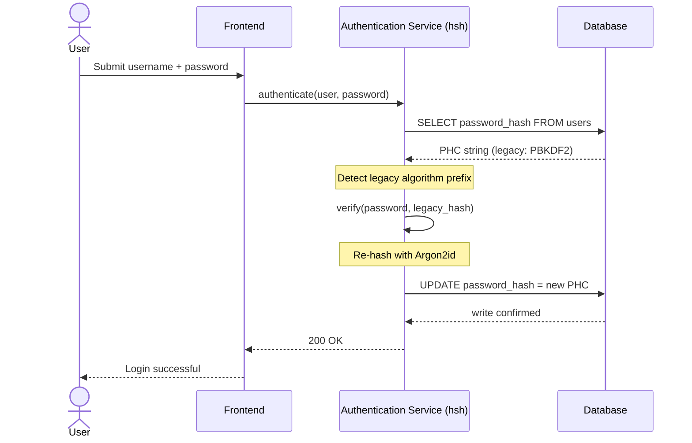
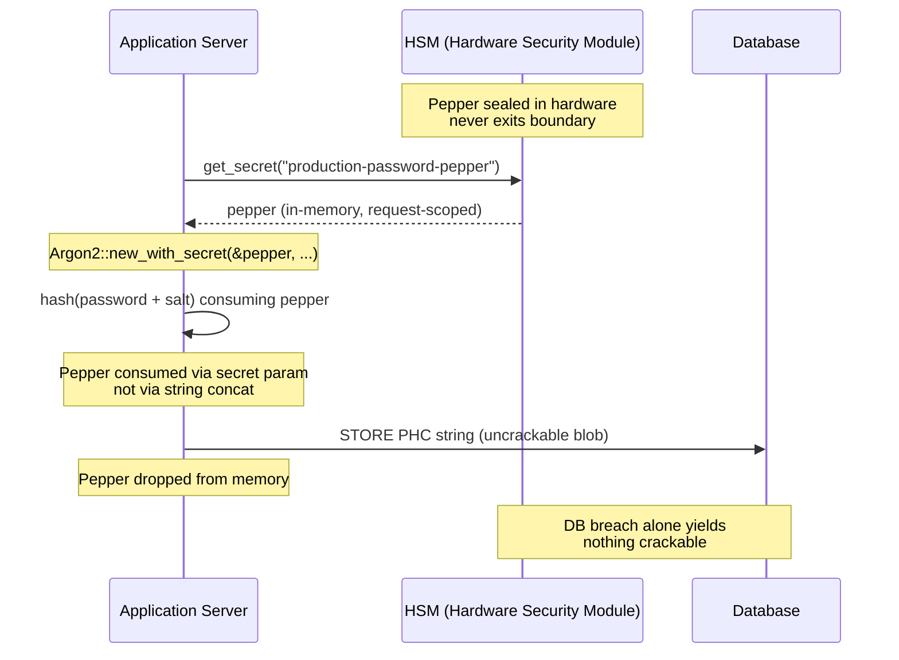

---
# Front Matter (YAML)
author: "contact@sebastienrousseau.com (Sebastien Rousseau)"
banner_alt: "Primer plano de un terminal de desarrollador que muestra la salida del compilador de Rust — la disciplina visible de un sustrato criptográfico seguro en memoria y auditable bajo un parque de autenticación bancaria corporativa"
banner_height: "1597"
banner_width: "2584"
banner: "https://cloudcdn.pro/stocks/images/rustlogs.webp"
cdn: "https://cloudcdn.pro"
charset: "UTF-8"
cname: "sebastienrousseau.com"
copyright: "© Copyright 2025 - 2026 - Sebastien Rousseau. All rights reserved."
date: "June 22, 2026"
description: "hsh: framework criptográfico en Rust puro que migra hashes de contraseña legados a Argon2id sin downtime, con peppering HSM y sin FFI en C."
format-detection: "telephone=no"
hreflang: "es"
icon: "https://cloudcdn.pro/clients/sebastienrousseau/v1/logos/sebastienrousseau.svg"
id: "https://sebastienrousseau.com/2026-06-22-hsh-zero-downtime-cryptographic-stewardship-rust-banking-2026"
image_alt: "Retrato en blanco y negro de Sebastien Rousseau"
image_height: "162"
image_width: "162"
image: "https://cloudcdn.pro/stocks/images/sebastienrousseau.webp"
keywords: "hsh, criptografía en Rust, hashing de contraseñas, Argon2id, seguridad bancaria, interlock HSM, cumplimiento DORA, Basel III, migración sin downtime, seguridad de memoria, PBKDF2, scrypt, cyber recovery"
language: "es-ES"
last_reviewed: "2026-06-22"
layout: "report"
locale: "es_ES"
logo_alt: "Logo de Sebastien Rousseau"
logo_height: "44"
logo_width: "44"
logo: "https://cloudcdn.pro/clients/sebastienrousseau/v1/logos/sebastienrousseau.svg"
measurementID: "G-169G4ET5HQ"
name: "Sebastien Rousseau"
permalink: "https://sebastienrousseau.com/2026-06-22-hsh-zero-downtime-cryptographic-stewardship-rust-banking-2026"
rating: "general"
referrer: "no-referrer"
robots: "index, follow"
schema: "FAQPage, Article"
seo_title: "hsh: custodia criptográfica sin downtime en Rust para banca"
short_name: "sebastienrousseau"
subtitle: "Cómo un framework criptográfico en Rust puro permite a la banca actualizar sin fricciones contraseñas legadas a Argon2id con interlocks HSM — y qué significa para el cumplimiento de DORA y Basel III."
tags: "hsh, Rust, banca, criptografía, Argon2id, HSM, DORA, Basel-III, seguridad, open-source, resiliencia-operativa"
theme-color: "0, 83, 191"
title: "Asegurar la gestión de contraseñas en la banca corporativa: hashing multialgoritmo y upgrades con hsh"
url: "https://sebastienrousseau.com/2026-06-22-hsh-zero-downtime-cryptographic-stewardship-rust-banking-2026"
viewport: "width=device-width, initial-scale=1, shrink-to-fit=no"

# RSS
atom_link: "https://sebastienrousseau.com/2026-06-22-hsh-zero-downtime-cryptographic-stewardship-rust-banking-2026/rss.xml"
category: "Technology"
generator: "Static Site Generator (SSG) (version 0.0.40)"
item_description: "hsh: framework criptográfico en Rust puro que migra hashes de contraseña legados a Argon2id sin downtime, con peppering HSM y sin FFI en C."
item_pub_date: "Mon, 22 Jun 2026 07:07:07 +0000"
item_title: "Asegurar la gestión de contraseñas en la banca corporativa: hashing multialgoritmo y upgrades con hsh"
pub_date: "Mon, 22 Jun 2026 07:07:07 +0000"
type: "article"

# Twitter Card
twitter_card: "summary_large_image"
twitter_creator: "@wwdseb"
twitter_description: "hsh permite a la banca tier-1 migrar hashes de contraseña legados a Argon2id sin downtime, con interlocks HSM y Rust seguro en memoria."
twitter_image: "https://cloudcdn.pro/clients/sebastienrousseau/v1/logos/sebastienrousseau.svg"
twitter_title: "hsh: custodia criptográfica sin downtime en Rust"
twitter_url: "https://sebastienrousseau.com/2026-06-22-hsh-zero-downtime-cryptographic-stewardship-rust-banking-2026"

excerpt: "En la era del descifrado acelerado por GPU y de los mandatos de DORA, la podredumbre criptográfica es un riesgo sistémico. Cada hash PBKDF2 o scrypt heredado que reposa en una base de datos bancaria es una cuenta atrás hacia el compromiso. hsh introduce upgrades sin downtime y seguros en memoria..."

# Added by fix_hsh_frontmatter.py (template completeness)
apple_mobile_web_app_orientations: "portrait"
apple_touch_icon_sizes: "192x192"
apple-mobile-web-app-capable: "yes"
apple-mobile-web-app-status-bar-inset: "black"
apple-mobile-web-app-status-bar-style: "black-translucent"
apple-touch-fullscreen: "yes"
author_location: "London, United Kingdom"
author_twitter: "@wwdseb"
author_website: "https://sebastienrousseau.com"
docs: https://validator.w3.org/feed/docs/rss2.html
item_guid: "https://sebastienrousseau.com/2026-06-22-hsh-zero-downtime-cryptographic-stewardship-rust-banking-2026/rss.xml"
item_link: "https://sebastienrousseau.com/2026-06-22-hsh-zero-downtime-cryptographic-stewardship-rust-banking-2026/rss.xml"
last_build_date: "Mon, 22 Jun 2026 06:06:06 +0000"
managing_editor: "contact@sebastienrousseau.com (Sebastien Rousseau)"
menu: "active"
msapplication-navbutton-color: "0, 83, 191"
site_components: "Kaishi, Kaishi Builder, Kaishi CLI, Kaishi Templates, Kaishi Themes"
site_last_updated: "2023-07-05"
site_software: "Static Site Generator, Rust"
site_standards: "HTML5, CSS3, RSS, Atom, JSON, XML, YAML, Markdown, TOML"
ttl: "60"
twitter_site: "@wwdseb"
webmaster: "contact@sebastienrousseau.com"
apple-mobile-web-app-title: "hsh: Rust password hashing"
thanks: "¡Gracias por leer!"
twitter_image_alt: "Retrato en blanco y negro de Sebastien Rousseau"
---

# Asegurar la gestión de contraseñas en la banca corporativa: hashing multialgoritmo y upgrades con hsh

<!-- lead-start: manual -->
<aside class="post-lead" aria-label="Resumen del artículo">
<p class="post-lead-tldr"><strong>TL;DR.</strong> <a href="https://github.com/sebastienrousseau/hsh">hsh</a> es un framework criptográfico open source en Rust puro que permite a la banca tier-1 migrar hashes de contraseña legados a estándares modernos como Argon2id sin interrumpir el servicio. Al integrar peppering respaldado por HSM e imponer seguridad de memoria estricta sin wrappers FFI en C, cierra las vulnerabilidades de podredumbre criptográfica que amenazan directamente el cumplimiento de DORA y Basel III.</p>
<p class="post-lead-heading"><strong>Conclusiones clave</strong></p>
<ul class="post-lead-takeaways">
  <li><strong>El problema de la podredumbre criptográfica.</strong> Los algoritmos legados como PBKDF2 se debilitan exponencialmente a medida que el hardware se acelera, ampliando la superficie de ataque ante campañas de credential-stuffing y de fuerza bruta offline.</li>
  <li><strong>Migración sin downtime.</strong> El patrón <code>verify_and_upgrade</code> rehashea las credenciales de usuario de forma transparente durante los eventos de login estándar, eliminando el riesgo operativo de las migraciones masivas de base de datos.</li>
  <li><strong>Interlock hardware y peppering.</strong> Los hashes se envuelven mediante Hardware Security Modules (HSM) o arquitecturas KMS en la nube, garantizando que una brecha de la base de datos por sí sola no entregue contraseñas candidatas crackeables.</li>
  <li><strong>Seguridad de memoria como línea base regulatoria.</strong> Reescrito íntegramente en Rust seguro y reforzado con higiene estricta de dependencias, hsh elimina los riesgos de buffer overflow y de cadena de suministro inherentes a las librerías criptográficas legadas en C.</li>
</ul>
<p class="post-lead-related"><strong>Lecturas relacionadas:</strong> <a href="https://sebastienrousseau.com/2026-06-20-http-handle-zero-dependency-edge-ingress-banking-rust-2026">http-handle: ingress edge sin dependencias y de alto rendimiento para banca en 2026</a>, <a href="https://sebastienrousseau.com/2026-06-07-autonomous-treasury-index-programmable-liquidity-tokenised-deposits-2026/index.html">El índice de tesorería autónoma en 2026</a>.</p>
</aside>
<!-- lead-end -->

> **Resumen ejecutivo.** Una autenticación bancaria construida frente a un modelo de amenazas de 2018 ya no es apta para el régimen regulatorio de 2026. El cracking acelerado por GPU, la densidad ASIC y el horizonte postcuántico que se aproxima han colapsado el margen de seguridad de PBKDF2 y de scrypt con parámetros tempranos; el artículo 5 de DORA ha convertido esa degradación en una responsabilidad imputable al consejo. hsh, un framework open source en Rust puro, aborda el problema en tres capas en paralelo: un despachador `verify_and_upgrade` que rehashea una credencial almacenada a los parámetros actuales de Argon2id en cada login exitoso sin ventana de mantenimiento; una capa de peppering con interlock HSM o KMS que hace que una brecha de base de datos por sí sola no entregue nada crackeable; y una cadena de suministro segura en memoria que elimina la superficie de ataque del FFI inherente a las librerías criptográficas respaldadas por C. El resultado es un sustrato que satisface DORA, la disciplina de riesgo operacional de Basel III, la rendición de cuentas de los altos directivos bajo SM&CR y el horizonte de migración postcuántica de NIST IR 8547 — sin la campaña de reseteo masivo históricamente necesaria para actualizar un parque de autenticación.

La mayor parte de la autenticación en banca corporativa sigue descansando sobre una capa de contraseñas endurecida frente a un modelo de amenazas de 2018. El hardware que la rompe ha avanzado. A medida que las granjas de GPU escalan y los ordenadores cuánticos criptográficamente relevantes (CRQC) se aproximan, el hashing legado — PBKDF2, scrypt temprano — se degrada con cada hora de cómputo que los atacantes invierten en la cola de cracking offline. La degradación es silenciosa: nada en la base de datos de producción avisa de que el hash que ayer era fuerte ya no lo es.

Bajo el [Reglamento de Resiliencia Operativa Digital (DORA)](https://eur-lex.europa.eu/eli/reg/2022/2554/oj "Reglamento (UE) 2022/2554 — Ley de Resiliencia Operativa Digital (DORA)"), dejar activos criptográficos legados sin rotar en producción ya no es deuda técnica. Es responsabilidad regulatoria nombrada.

[hsh](https://github.com/sebastienrousseau/hsh "hsh — marco pure-Rust de hashing de contraseñas") cierra esa brecha. Un framework en Rust puro, gestiona múltiples formatos de hash en paralelo y actualiza credenciales débiles en vuelo durante las sesiones de login activas. La infraestructura de autenticación se alinea con los mandatos de resiliencia de 2026 sin ventana de mantenimiento, sin reseteo forzado y sin un solo segundo de downtime.

## 01. El problema de la podredumbre criptográfica en banca

Para entender la necesidad de un framework como hsh hay que entender el ciclo de vida de un hash de contraseña. Los algoritmos no envejecen con elegancia; se degradan en proporción al hardware disponible para romperlos.

**La brecha de aceleración ASIC/GPU.** Algoritmos como PBKDF2 se diseñaron para ser computacionalmente costosos en CPU. Hoy, los atacantes usan GPU altamente paralelizadas para ejecutar ataques de diccionario offline. Un hash legado generado en 2018 es radicalmente más débil frente a un adversario de 2026.

**El riesgo de la migración big-bang.** Cuando un CISO decide actualizar de PBKDF2 a un algoritmo memory-hard como Argon2id, no puede invertir los hashes para reencriptarlos. Las soluciones tradicionales —forzar el reseteo de contraseñas de millones de usuarios— provocan fricción masiva al cliente y riesgo operativo.

**La cadena de suministro de librerías C.** Históricamente, el middleware bancario ha dependido de librerías como `argonautica` o de bindings directos a C para el hashing. Estas librerías arrastran un riesgo oculto de cadena de suministro: un único buffer overflow en el módulo de autenticación puede derivar en ejecución remota de código (RCE) en la capa más privilegiada del stack bancario.

### Comparativa de algoritmos — resistencia hardware y superficie de ajuste

Los tres algoritmos que un banco encuentra de forma realista en un corpus de migración se diferencian menos por la elección de la primitiva criptográfica y más por cómo envejecen bajo presión del hardware. La tabla siguiente resume la postura práctica.

| Algoritmo | Memory-hard | Resistencia GPU / ASIC | Superficie de ajuste | Estado en 2026 |
| ---- | ---- | ---- | ---- | ---- |
| **PBKDF2** | No | Baja — vectoriza sobre GPU; sub-milisegundo por intento en hardware de consumo. | Solo número de iteraciones. | Legado. Aceptable únicamente como fallback en el lado de verificación durante la migración. |
| **scrypt** | Sí (modesto) | Media — el coste de memoria frena granjas GPU simples; amortizable en ASIC a escala. | `N` (CPU/memoria), `r` (tamaño de bloque), `p` (paralelismo). | Depreciado para greenfield. Activo en corpus de migración. |
| **Argon2id** | Sí (alto) | Alta — duro en memoria y en tiempo; resiste ataques de canal lateral y TMTO. | Coste de memoria (`m`), coste de tiempo (`t`), paralelismo (`p`), secreto (pepper). | Predeterminado recomendado. OWASP, borrador NIST SP 800-63B-4, FedRAMP. |

La conclusión para el plan de migración es estrecha: PBKDF2 es un estado *del lado de verificación*, no un destino *del lado de escritura*. Cada login exitoso sobre un registro PBKDF2 debe producir un registro Argon2id a la salida.

## 02. La lente de arquitectura hsh 2026

El framework se estructura en cinco capas principales, cada una diseñada para mitigar una categoría específica de riesgo operativo.

### Tabla 1: capas de arquitectura de hsh y mitigación de riesgos

| Capa | Decisión de diseño | Por qué importa | Riesgo si se gestiona mal |
| ---- | ---- | ---- | ---- |
| **Primitivas criptográficas** | Formato unificado PHC String que soporta Argon2id, scrypt y PBKDF2 | Aporta resistencia best-in-class frente a ataques GPU manteniendo compatibilidad hacia atrás. | Silos de datos; algoritmos débiles que permiten más de 100 000 millones de intentos por segundo offline. |
| **Motor de políticas** | Despacho `verify_and_upgrade` | Automatiza la transición de políticas legadas a modernas de forma dinámica en el login. | Podredumbre de seguridad; usuarios activos atrapados en tipos de hash legados fáciles de romper. |
| **Interlock hardware** | Capacidades de «peppering» con HSM y KMS en la nube | Asegura que una brecha de base de datos por sí sola no exponga contraseñas candidatas. | Ataques de fuerza bruta offline exitosos tras una brecha por inyección SQL. |
| **Higiene de seguridad** | Imposición de `deny.toml` y Rust puro | Bloquea por completo FFI inseguro y dependencias externas en C no fiables. | Ataques catastróficos de cadena de suministro y CVE de corrupción de memoria. |

## 03. La ruta de rehash sin downtime

El patrón `verify_and_upgrade` resuelve la migración de datos mediante un sistema de despacho inteligente y consciente del estado que no requiere downtime de base de datos.

Cuando un usuario envía sus credenciales, hsh lee la cadena Password Hashing Competition (PHC) almacenada. Si contiene un hash legado (por ejemplo, una configuración PBKDF2 obsoleta), el sistema ejecuta el siguiente flujo:

1. **Identificación:** parsea el algoritmo legado y sus parámetros específicos.
2. **Verificación:** valida la contraseña candidata contra el hash legado.
3. **Upgrade en tiempo real:** tras una coincidencia exitosa, toma la contraseña candidata en texto plano en memoria y computa de inmediato un nuevo hash usando la política altamente segura Argon2id.
4. **Persistencia:** devuelve la nueva cadena PHC a la aplicación bancaria, que sobrescribe el registro legado en la base de datos.

El proceso es totalmente transparente para el usuario final. Migra eficazmente las cuentas más activas al nivel de seguridad más alto desde el día uno, reduciendo de forma orgánica y drástica la superficie de ataque del banco con el tiempo.

La secuencia siguiente muestra qué ocurre durante un único evento de login cuando el registro almacenado está sobre un algoritmo legado. El usuario no percibe ningún cambio; el parque de autenticación del banco se refuerza en un registro.



### Patrón de implementación — despacho `verify_and_upgrade`

La superficie de integración dentro de un servicio de autenticación es reducida. La ruta de código legada permanece como fallback; la nueva ruta de código es el despachador.

```rust
use hsh::{Hasher, UpgradeResult};

struct UserRecord {
    username: String,
    password_hash: String, // PHC string
}

async fn authenticate(user: UserRecord, password_attempt: &str) -> Result<bool, AuthError> {
    let hasher = Hasher::new();
    match hasher.verify_and_upgrade(password_attempt, &user.password_hash) {
        Ok(UpgradeResult::Verified(is_valid)) => Ok(is_valid),
        Ok(UpgradeResult::Upgraded(new_hash)) => {
            db::update_user_hash(&user.username, new_hash).await?;
            Ok(true)
        }
        Err(_) => Err(AuthError::InvalidCredentials),
    }
}
```

Tres propiedades importan:

- **Consciencia de estado.** `verify_and_upgrade` inspecciona el prefijo de la cadena PHC. Si el marcador de algoritmo es legado, el framework dispara el re-hash de forma automática contra la política Argon2id configurada. Sin ramificaciones en el código que invoca.
- **Atomicidad.** El re-hash ocurre solo después de que la verificación legada tenga éxito, dentro del mismo evento de autenticación. No hay batch job aparte, no hay ventana de migración planificada y no hay migración masiva destructiva que revertir.
- **Persistencia.** La variante `UpgradeResult::Upgraded` transporta la nueva cadena PHC. La aplicación la persiste por la misma ruta de datos que ya existe para el registro legado — sin superficie de escritura paralela, sin protocolo de escritura en dos fases.

**Modos de fallo.** Si la escritura en base de datos falla o el KMS queda brevemente inalcanzable durante la escritura del upgrade, la sesión sigue siendo exitosa contra el hash legado y el registro permanece en el algoritmo antiguo. El siguiente login exitoso reintenta el upgrade. No hay estado migrado a medias y no hay fallo visible para el usuario — la migración es monótona a lo largo de los eventos de login, y el coste por registro de un upgrade fallido es exactamente un reintento extra en el próximo login.

## 04. Hashes con pepper vía interlock HSM / KMS

El hashing de contraseñas estándar protege frente a fugas directas de base de datos, pero si un atacante obtiene tanto la base de datos (hashes y salts), puede ejecutar cracking offline.

hsh introduce una capa de seguridad robusta de «peppering». Al integrarse con Hardware Security Modules (HSM) o con servicios cloud-native de gestión de claves (KMS), la salida final de Argon2id se envuelve criptográficamente con una clave de alta entropía que nunca abandona la frontera de hardware seguro. Si la base de datos de usuarios se exfiltra, el atacante solo dispone de blobs cifrados. No puede empezar a romper contraseñas sin vulnerar también la infraestructura HSM físicamente aislada del banco.

El diagrama de arquitectura siguiente traza la ruta del secreto. El pepper nunca aterriza en la base de datos; la base de datos nunca contiene nada direccionable por sí solo. Los dos almacenes pueden fallar de forma independiente — el sistema solo pierde confidencialidad si ambos fallan a la vez.



### Patrón de implementación — Argon2id con pepper respaldado por HSM

El pepper se obtiene del HSM en el momento de la petición, no de un archivo de configuración. `Argon2::new_with_secret` lo consume a través del parámetro secret del algoritmo, no mediante concatenación de cadenas.

```rust
use argon2::{
    Argon2, Algorithm, Version, Params,
    PasswordHasher, PasswordVerifier,
    password_hash::{PasswordHash, SaltString, rand_core::OsRng},
};

async fn authenticate_with_hsm(
    user: UserRecord,
    password_attempt: &str,
) -> Result<bool, AuthError> {
    let pepper = hsm::client::get_secret("production-password-pepper").await?;
    let hasher = Argon2::new_with_secret(
        &pepper,
        Algorithm::Argon2id,
        Version::V0x13,
        Params::default(),
    )
    .map_err(|_| AuthError::Internal)?;

    let parsed = PasswordHash::new(&user.password_hash)
        .map_err(|_| AuthError::InvalidCredentials)?;
    if hasher.verify_password(password_attempt.as_bytes(), &parsed).is_ok() {
        if is_legacy_hash(&user.password_hash) {
            let new_hash = hasher
                .hash_password(
                    password_attempt.as_bytes(),
                    &SaltString::generate(&mut OsRng),
                )
                .map_err(|_| AuthError::Internal)?
                .to_string();
            db::update_user_hash(&user.username, new_hash).await?;
        }
        return Ok(true);
    }
    Err(AuthError::InvalidCredentials)
}
```

De esta forma se desprenden tres consecuencias alineadas con DORA:

- **Rotación de claves como problema de gestión de claves.** El pepper vive detrás de la frontera HSM/KMS, no en la base de datos. La rotación se vuelve un cambio de gestión de claves, no una campaña de re-hash en todo el parque de usuarios. Los nuevos hashes se vinculan a la versión actual del pepper; los hashes antiguos se verifican bajo su versión vinculada hasta que se actualicen de forma natural.
- **Segregación de funciones.** La identidad de servicio que lee el pepper debe ser auditable y de mínimo privilegio. Una exfiltración completa de base de datos sin el permiso HSM correspondiente no entrega nada crackeable. Un compromiso del permiso HSM sin la base de datos no entrega nada direccionable. El radio de impacto de cualquiera de los dos fallos aislados queda acotado.
- **Evitar fallos de extensión de longitud y de concatenación.** Usar el parámetro secret de Argon2 en lugar de concatenación de cadenas elimina toda una clase de errores criptográficos — extensión de longitud, concatenación UTF-8 mal tipada, fallos de orden de salt/pepper — de la superficie de implementación.

## 05. Alineación regulatoria: DORA, Basel III y SM&CR

- **DORA artículos 5 y 6:** exigen que las entidades financieras mantengan marcos de gestión del riesgo TIC. Una estrategia que dependa de hashes de contraseña sin rotar y con una década de antigüedad viola estos principios. hsh aporta un mecanismo documentado y automatizado para elevar de forma continua las protecciones criptográficas.
- **Basel III:** vincula el capital regulatorio a la probabilidad y severidad de los eventos de pérdida. Al implementar Argon2id con interlock HSM, la severidad de una brecha de base de datos se reduce drásticamente, sustentando argumentos cuantificables a favor de una menor asignación de capital por riesgo operacional.
- **Responsabilidad SM&CR:** aprobar una arquitectura que remedia activamente la podredumbre criptográfica proporciona a los altos directivos nombrados una cadena verificable y documentable de reducción de riesgo.

## Preguntas frecuentes

**¿Está hsh listo para producción en una ruta de autenticación bancaria tier-1?**
La librería es open source, está documentada y ejercita Argon2id mediante el mismo crate `argon2` que sustenta el ecosistema de hashing de contraseñas de RustCrypto. La adopción tier-1 sigue la propia due-diligence del banco: revisión de código independiente, atestación de builds reproducibles, fijación del árbol de dependencias, pruebas de integración con el proveedor HSM y aprobación de Riesgo Operacional. hsh aporta el sustrato; el banco certifica el despliegue.

**¿Cómo evita `verify_and_upgrade` el riesgo de migración masiva?**
El verificador inspecciona la cadena PHC en tiempo de parseo, ejecuta el algoritmo legado para validar la contraseña y — si el algoritmo o el conjunto de parámetros almacenado está por debajo del umbral actual — rehashea el texto plano bajo Argon2id con el pepper HSM vinculado y reescribe la nueva cadena PHC de forma atómica. El usuario experimenta un login normal. El parque se refuerza en un registro por cada autenticación exitosa. Sin campaña de reseteo, sin ventana de mantenimiento, sin evento de riesgo operacional.

**¿Qué ocurre con las cuentas inactivas que nunca inician sesión?**
Los registros que nunca se autentican nunca se rehashean. Los bancos lo abordan con dos políticas complementarias: un umbral documentado de inactividad (habitualmente 18-24 meses) tras el cual la cuenta se rota administrativamente en una campaña de reseteo controlada, y una ejecución sintética de re-hash durante mantenimientos planificados para cuentas en cohortes definidas (alto valor, alto privilegio, reguladas). Ambas son políticas, no comportamientos de la librería; hsh registra la decisión de despacho en la telemetría de auditoría para que el responsable operativo pueda demostrar cobertura.

**¿Introduce el pepper HSM un punto único de fallo en la ruta de autenticación?**
El mismo HSM que firma los mensajes de pago y rota las claves respaldadas por KMS ya está en la ruta. El riesgo es idéntico a la postura existente del banco; hsh lo hereda en lugar de introducirlo. Las mitigaciones son estándar: parejas HSM en alta disponibilidad, regiones KMS en hot-spare, obtención del pepper acotada a la petición con caída controlada por circuit-breaker hacia modo de solo lectura y un runbook operativo explícito para indisponibilidad del HSM. El pepper es el parámetro secret de `argon2`, consumido en proceso y eliminado de memoria tras su uso.

**¿Dónde se sitúa hsh respecto a la migración postcuántica?**
hsh es un framework de hashing de contraseñas y de secretos, no una primitiva de encapsulación de claves ni de firma. La transición PQC documentada en [NIST IR 8547](https://csrc.nist.gov/pubs/ir/8547/ipd "Transition to Post-Quantum Cryptography Standards") apunta al establecimiento de claves (ML-KEM, FIPS 203) y a las firmas (ML-DSA, FIPS 204; SLH-DSA, FIPS 205). La capa de hashing que cubre hsh es en gran medida ortogonal a esa migración. Las dos convergen a nivel de sustrato — ambas quieren una cadena de suministro criptográfica segura en memoria, auditable y de builds reproducibles — que es exactamente la postura que hsh habilita hoy.

## Conclusión

El hashing de contraseñas deploy-and-forget se ha acabado. DORA ha desplazado la pasividad criptográfica de deuda técnica a responsabilidad regulatoria nombrada, y la curva del hardware se inclina más cada año. La contribución de hsh no es un algoritmo más fuerte — Argon2id lleva años disponible. La contribución es la maquinaria operativa para migrar a él sin planificar downtime, sin forzar reseteos de usuario y sin confiar en shims FFI en C la ruta de autenticación del banco.

El [código fuente de hsh](https://github.com/sebastienrousseau/hsh "hsh — marco pure-Rust de hashing de contraseñas, doble licencia MIT y Apache 2.0") está disponible bajo licencia dual MIT y Apache 2.0.

## Referencias

Basel Committee on Banking Supervision (2011). *Basel III: marco regulatorio global para bancos y sistemas bancarios más resilientes*. Banco de Pagos Internacionales. Disponible en: [https://www.bis.org/publ/bcbs189.pdf](https://www.bis.org/publ/bcbs189.pdf "Basel III: marco regulatorio global para bancos y sistemas bancarios más resilientes")

Biryukov, A., Dinu, D., Khovratovich, D. y Josefsson, S. (2021). *RFC 9106: función memory-hard Argon2 para hashing de contraseñas y aplicaciones de proof-of-work*. Internet Engineering Task Force. Disponible en: [https://datatracker.ietf.org/doc/html/rfc9106](https://datatracker.ietf.org/doc/html/rfc9106 "RFC 9106 — función memory-hard Argon2 para hashing de contraseñas")

Parlamento Europeo y Consejo (2022). *Reglamento (UE) 2022/2554 sobre resiliencia operativa digital para el sector financiero (DORA)*. Disponible en: [https://eur-lex.europa.eu/eli/reg/2022/2554/oj](https://eur-lex.europa.eu/eli/reg/2022/2554/oj "Reglamento (UE) 2022/2554 — DORA")

Financial Conduct Authority (2015). *Régimen de Altos Directivos y de Certificación (SM&CR)*. Disponible en: [https://www.fca.org.uk/firms/senior-managers-certification-regime](https://www.fca.org.uk/firms/senior-managers-certification-regime "Régimen de Altos Directivos y de Certificación")

National Institute of Standards and Technology (2024). *Borrador público inicial — Transición a estándares de criptografía postcuántica (NIST IR 8547)*. Disponible en: [https://csrc.nist.gov/pubs/ir/8547/ipd](https://csrc.nist.gov/pubs/ir/8547/ipd "NIST IR 8547 — Transición a estándares de criptografía postcuántica")

OWASP Foundation (2024). *Guía rápida de almacenamiento de contraseñas*. Disponible en: [https://cheatsheetseries.owasp.org/cheatsheets/Password_Storage_Cheat_Sheet.html](https://cheatsheetseries.owasp.org/cheatsheets/Password_Storage_Cheat_Sheet.html "OWASP — guía rápida de almacenamiento de contraseñas")

<!-- enrich-start -->
<aside class="author-card" aria-label="Sobre el autor"><span class="author-card-body"><strong class="author-card-name"><a href="/about/index.html">Sebastien Rousseau</a></strong><span class="author-card-bio">Tecnólogo bancario sénior que escribe sobre IA aplicada, migración a ISO 20022, criptografía postcuántica para servicios financieros y la transformación estructural de los pagos mayoristas.</span><span class="author-credentials">Más de 20 años en HSBC Commercial &amp; Investment Bank, PayPal, Barclays y Shazam. <a href="https://www.linkedin.com/in/sebastienrousseau/" rel="external noopener">LinkedIn</a> &middot; <a href="https://github.com/sebastienrousseau" rel="external noopener">GitHub</a></span></span></aside>
<p class="post-reviewed">Última revisión <time datetime="2026-06-22">2026-06-22</time>.</p>
<!-- enrich-end -->
