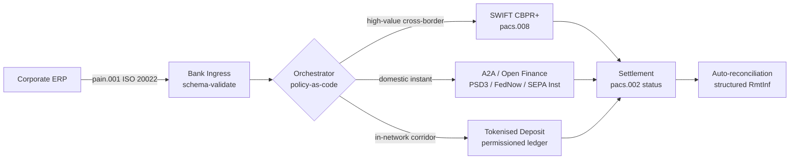

---

# Front Matter (YAML)

author: "contact@sebastienrousseau.com (Sebastien Rousseau)"
banner_alt: "Buque portacontenedores en un puerto de aguas profundas al amanecer — símbolo del movimiento transfronterizo multi-rail del valor corporativo a través de ISO 20022, las finanzas abiertas y las redes de liquidación con depósitos tokenizados en 2026"
banner_height: "1597"
banner_width: "2584"
banner: "https://cloudcdn.pro/stocks/images/viktor-forgacs-KxVRDiFdTVo.webp"
cdn: "https://cloudcdn.pro"
charset: "UTF-8"
cname: "sebastienrousseau.com"
copyright: "© Copyright 2025 - 2026 - Sebastien Rousseau. All rights reserved."
date: "24 de junio de 2026"
description: "Cómo ISO 20022, A2A, las finanzas abiertas bajo PSD3/FiDA y los depósitos tokenizados rediseñan la tesorería corporativa transfronteriza junto a SWIFT en 2026."
format-detection: "telephone=no"
hreflang: "es"
icon: "https://cloudcdn.pro/clients/sebastienrousseau/v1/logos/sebastienrousseau.svg"
id: "https://sebastienrousseau.com/2026-06-24-cross-border-iso-20022-open-finance-tokenised-deposits-treasury-2026"
image_alt: "Retrato en blanco y negro de Sebastien Rousseau"
image_height: "162"
image_width: "162"
image: "https://cloudcdn.pro/stocks/images/sebastien-rousseau.png"
keywords: "pagos transfronterizos, ISO 20022, finanzas abiertas, PSD3, FiDA, depósitos tokenizados, stablecoins, A2A, tesorería, CIB, Nexi, Mastercard, multi-rail, pacs.008, pain.001, SWIFT, FedNow, SEPA Instant, RTP, CBPR+"
language: "es-ES"
last_reviewed: "2026-06-24"
layout: "report"
locale: "es_ES"
logo_alt: "Logo de Sebastien Rousseau"
logo_height: "44"
logo_width: "44"
logo: "https://cloudcdn.pro/clients/sebastienrousseau/v1/logos/sebastienrousseau.svg"
menu: ""
measurementID: "G-169G4ET5HQ"
name: "Sebastien Rousseau"
permalink: "https://sebastienrousseau.com/2026-06-24-cross-border-iso-20022-open-finance-tokenised-deposits-treasury-2026"
rating: "general"
referrer: "no-referrer"
robots: "index, follow"
schema: "FAQPage, Article"
seo_title: "Transfronterizo 2026: ISO 20022, finanzas abiertas y rails tokenizados"
short_name: "sebastienrousseau"
subtitle: "La tesorería corporativa transfronteriza en 2026 opera con mecánica multi-rail — ISO 20022 como gramática común, A2A y las finanzas abiertas como rail de cara al cliente, los depósitos tokenizados como tramo de liquidación mayorista, y SWIFT todavía anclando la cola larga."
tags: "pagos transfronterizos, ISO 20022, finanzas abiertas, PSD3, FiDA, depósitos tokenizados, A2A, tesorería, CIB, multi-rail, pacs.008, pain.001, SWIFT, FedNow, SEPA Instant, RTP, CBPR+"
theme-color: "0, 83, 191"
title: "Transfronterizo 2026: ISO 20022, finanzas abiertas y depósitos tokenizados en la tesorería corporativa"
url: "https://sebastienrousseau.com/2026-06-24-cross-border-iso-20022-open-finance-tokenised-deposits-treasury-2026"
viewport: "width=device-width, initial-scale=1, shrink-to-fit=no"

# RSS - The RSS feed front matter (YAML).
atom_link: "https://sebastienrousseau.com/2026-06-24-cross-border-iso-20022-open-finance-tokenised-deposits-treasury-2026/rss.xml"
category: "Technology"
docs: https://validator.w3.org/feed/docs/rss2.html
generator: "Static Site Generator (SSG) (version 0.0.26)"
item_description: "Cómo ISO 20022, A2A, las finanzas abiertas bajo PSD3/FiDA y los depósitos tokenizados rediseñan la tesorería corporativa transfronteriza junto a SWIFT en 2026."
item_guid: "https://sebastienrousseau.com/2026-06-24-cross-border-iso-20022-open-finance-tokenised-deposits-treasury-2026/rss.xml"
item_link: "https://sebastienrousseau.com/2026-06-24-cross-border-iso-20022-open-finance-tokenised-deposits-treasury-2026/rss.xml"
item_pub_date: "Wed, 24 Jun 2026 07:07:07 +0000"
item_title: "Transfronterizo 2026: ISO 20022, finanzas abiertas y depósitos tokenizados en la tesorería corporativa"
last_build_date: "Wed, 24 Jun 2026 06:06:06 +0000"
managing_editor: "contact@sebastienrousseau.com (Sebastien Rousseau)"
pub_date: "Wed, 24 Jun 2026 07:07:07 +0000"
ttl: "60"
type: "article"
webmaster: "contact@sebastienrousseau.com"

# Apple - The Apple front matter (YAML).
apple_mobile_web_app_orientations: "portrait"
apple_touch_icon_sizes: "192x192"
apple-mobile-web-app-capable: "yes"
apple-mobile-web-app-status-bar-inset: "black"
apple-mobile-web-app-status-bar-style: "black-translucent"
apple-mobile-web-app-title: "Transfronterizo 2026: ISO 20022, finanzas abiertas y rails tokenizados"
apple-touch-fullscreen: "yes"

# MS Application - The MS Application front matter (YAML).

msapplication-navbutton-color: "0, 83, 191"

# Twitter Card - The Twitter Card front matter (YAML).

twitter_card: "summary_large_image"
twitter_creator: "@wwdseb"
twitter_description: "Cómo ISO 20022, A2A, las finanzas abiertas bajo PSD3/FiDA y los depósitos tokenizados rediseñan la tesorería corporativa transfronteriza junto a SWIFT en 2026."
twitter_image: "https://cloudcdn.pro/clients/sebastienrousseau/v1/logos/sebastienrousseau.svg"
twitter_image_alt: "Logo de Sebastien Rousseau"
twitter_site: "@wwdseb"
twitter_title: "Transfronterizo 2026: ISO 20022, finanzas abiertas y rails tokenizados"
twitter_url: "https://sebastienrousseau.com/2026-06-24-cross-border-iso-20022-open-finance-tokenised-deposits-treasury-2026"

excerpt: "La tesorería corporativa transfronteriza en 2026 es un problema de ingeniería multi-rail. ISO 20022 es la gramática común, A2A y las finanzas abiertas bajo PSD3/FiDA son el rail de cara al cliente, los depósitos tokenizados resuelven el tramo de liquidación mayorista y SWIFT sigue anclando la cola larga. El trabajo interesante está en la capa de orquestación, no en el modelo."

# Humans.txt - The Humans.txt front matter (YAML).
author_website: "https://sebastienrousseau.com"
author_twitter: "@wwdseb"
author_location: "London, UK"
thanks: "Gracias por leer."
site_last_updated: "2026-06-24"
site_standards: "HTML5, CSS3, RSS, Atom, JSON, XML, YAML, Markdown, TOML"
site_components: "Kaishi, Kaishi Builder, Kaishi CLI, Kaishi Templates, Kaishi Themes"
site_software: "Static Site Generator, Rust"

---

# Transfronterizo 2026: ISO 20022, finanzas abiertas y depósitos tokenizados en la tesorería corporativa

<!-- lead-start -->
<aside class="post-lead" aria-label="Resumen del artículo">

<strong>TL;DR.</strong> La tesorería corporativa transfronteriza en 2026 opera sobre cuatro rails en paralelo — SWIFT CBPR+, A2A instantáneo bajo PSD3/FiDA, depósitos tokenizados y rails de stablecoins — cosidos por ISO 20022 como gramática común. El trabajo de los equipos CIB y de tesorería corporativa es orquestación, no selección de rail.

<strong>Puntos clave</strong>

<ul class="post-lead-takeaways">
  <li><strong>Multi-rail es el valor por defecto.</strong> Ningún rail cubre todos los corredores, todos los tamaños de ticket ni todos los horarios de corte. La tesorería elige el rail por pago, no por banco.</li>
  <li><strong>ISO 20022 es la lingua franca.</strong> pacs.008, pacs.009 y pain.001 ya transportan datos de remesa a través de rails RTGS, instantáneos, A2A y de depósitos tokenizados — lo que hace que las decisiones de enrutamiento se basen en datos en lugar de estar atadas al rail.</li>
  <li><strong>Las finanzas abiertas amplían el perímetro.</strong> PSD3 y FiDA llevan el modelo de open banking a pensiones, seguros y datos de tesorería; Nexi y Mastercard están construyendo la capa de orquestación que consumen las empresas.</li>
  <li><strong>Los depósitos tokenizados son el tramo mayorista.</strong> Los depósitos tokenizados emitidos por bancos y los rails integrados de stablecoins se sitúan por debajo del rail instantáneo de cara al cliente y liquidan el tramo mayorista cerca de T+0.</li>
</ul>

<strong>Lecturas relacionadas:</strong> <a href="https://sebastienrousseau.com/2026-06-07-autonomous-treasury-index-programmable-liquidity-tokenised-deposits-2026">El Autonomous Treasury Index 2026: liquidez programable y depósitos tokenizados</a>, <a href="https://sebastienrousseau.com/2026-06-15-pacs008-automation-iso-20022-interbank-payments-2026">Automatización de pacs.008: pagos interbancarios ISO 20022 en 2026</a>.

</aside>
<!-- lead-end -->

> **Resumen ejecutivo.** La tesorería corporativa transfronteriza en 2026 es un problema de ingeniería multi-rail antes que un problema de gestión de relaciones. PSD3 y el reglamento de Financial Data Access (FiDA) amplían el perímetro del open banking hacia los datos de tesorería corporativa; el paso de SWIFT MT a MX de noviembre de 2026 convierte a pacs.008 conforme a CBPR+ en el único formato interbancario transfronterizo viable; los depósitos tokenizados y los rails regulados de stablecoins resuelven el tramo de liquidación mayorista cerca de T+0 dentro de redes permisionadas. El CIB que gana este ciclo no es el que escoge un único rail; es el que diseña la capa de orquestación que los une. Este artículo recorre la arquitectura de cuatro rails (A2A bajo PSD3, SWIFT CBPR+, depósitos tokenizados emitidos por bancos, stablecoins reguladas) — qué hace bien cada rail, dónde caen las fronteras de exposición de crédito y qué debe imponer la capa de orquestación de policy-as-code que se sitúa por encima para que la empresa vea un solo pago y el supervisor vea un único rastro auditable.

Una corporación industrial europea paga 4,2 millones de euros a un proveedor brasileño un miércoles por la mañana. La estación de trabajo de tesorería no elige un banco. Elige un rail — una secuencia de rails. La instrucción de cara al cliente aterriza en un mensaje A2A pain.001 enrutado a través de un proveedor de finanzas abiertas bajo PSD3. El banco la traslada entre dos jurisdicciones corresponsales sobre depósitos tokenizados en una red privada CIB. La cola larga — una regularización de factura por 80 000 USD a un subproveedor sin relación de depósitos tokenizados — viaja aún por SWIFT CBPR+ como un pacs.008. El cliente ve un pago. La arquitectura ve cuatro rails. ISO 20022 es la única razón por la que todo encaja.

Este es el modelo operativo que describe Mastercard cuando habla de [la evolución del open banking hacia las finanzas abiertas](https://www.mastercard.com/us/en/news-and-trends/Insights/2026/open-banking-to-open-finance-the-evolution-of-financial-data.html "Mastercard: del open banking a las finanzas abiertas, la evolución de los datos financieros") — datos y pagos fundidos en una sola capa de orquestación, con el rail elegido por el sistema, no por el cliente. La pregunta interesante para los tecnólogos bancarios senior no es qué rail gana. Es cómo se diseña, gobierna y concilia la capa de orquestación.

## 01. De las tarjetas al A2A — el giro hacia las finanzas abiertas

Los rails de tarjeta no van a desaparecer. Se están replanteando.

Durante 2025 y entrando en 2026, [PSD3 y el reglamento de Financial Data Access (FiDA)](https://www.consultancy.uk/news/42202/orchestrating-open-banking-for-platform-growth-2026-outlook "Consultancy.uk: orquestación del open banking para el crecimiento de plataformas, perspectiva 2026") extendieron la obligación de open banking más allá de las cuentas de pago hasta pensiones, hipotecas, ahorro, seguros y datos de tesorería corporativa. La implicación para la tesorería corporativa es directa: un relationship manager CIB ya puede consumir la imagen completa de liquidez de una empresa a través de varios bancos mediante un único contrato de API, por instrucción de la empresa.

Hay dos operadores construyendo visiblemente la capa de orquestación que consumirán las empresas. Nexi ha extendido su huella de adquirencia a la iniciación A2A en SEPA Instant y en los corredores RTGS paneuropeos, ISO 20022 nativo de extremo a extremo. La plataforma de finanzas abiertas de Mastercard — apoyada en sus adquisiciones de Aiia y Finicity — proporciona la capa de agregación de datos y consentimiento por debajo, con la iniciación de pagos emergiendo a través del mismo conjunto de APIs que antes servía a las autorizaciones de tarjeta.

El cambio importa por tres motivos:

1. **Economía unitaria.** El A2A iniciado bajo PSD3 saca el interchange del pago. Para flujos B2B de ticket alto, el ahorro es material; para flujos de consumo de ticket bajo, la pila de coste del comercio se desploma.
2. **Calidad del dato.** El A2A bajo ISO 20022 transporta datos de remesa estructurados que las tarjetas nunca pudieron. Tasas de conciliación automática por encima del 95 % son ya el mínimo exigible.
3. **Modelo de riesgo.** El A2A es una transferencia de crédito, no una autorización de tarjeta. La superficie de fraude, el modelo de chargeback y el modelo de disputa son todos distintos. Los equipos de tesorería corporativa deben entender que la capa de protección al cliente se está reconstruyendo, no se hereda.

El CIB que vende una propuesta multi-rail en 2026 vende orquestación — no acceso. El acceso ya está regulado.

## 02. ISO 20022 como lingua franca entre rails

La razón por la que multi-rail funciona en absoluto es que el formato del mensaje es ya consistente entre rails.

El Committee on Payments and Market Infrastructures (CPMI) del BIS dejó claro el argumento arquitectónico en sus [requisitos de armonización de ISO 20022 para mejorar los pagos transfronterizos](https://www.bis.org/cpmi/publ/d230.pdf "BIS CPMI: requisitos de armonización de ISO 20022 para mejorar los pagos transfronterizos"). El paso a CBPR+ en noviembre de 2025 cerró la era MT103 / MT202 en la mensajería interbancaria transfronteriza. A partir de ese momento, todos los rails principales — SWIFT, FedNow, SEPA Instant, RTP y los grandes sistemas de pagos instantáneos en Asia y Latinoamérica — hablan la misma gramática pacs.008 / pacs.009 / pain.001.

La consecuencia práctica para la tesorería corporativa:

- **El enrutamiento se basa en datos.** La estación de trabajo de tesorería puede leer un pain.001 una sola vez y decidir el rail por pago según corredor, tamaño del ticket, horario de corte y relación con la contraparte — sin volver a mapear el mensaje.
- **Los datos de remesa sobreviven al salto.** Los campos de remesa estructurados (`<RmtInf><Strd>`) atraviesan los tramos corresponsales sin truncamiento. Las tasas de conciliación automática suben porque el dato deja de perderse en la frontera del rail.
- **El cribado de sanciones se vuelve auditable.** Los campos estructurados `<Dbtr>` / `<Cdtr>` / `<DbtrAgt>` / `<CdtrAgt>` con referencias LEI sustituyen al cribado de nombres en texto libre. Los hits caen. Las colas de investigación se reducen.

El diagrama siguiente sigue un pain.001 a través del ingreso del banco, hacia el orquestador de policy-as-code y hasta el rail que exigen el corredor y el tamaño del ticket — un mensaje, varios rails, sin re-mapeo.

El coste de esta consistencia es disciplina de ingeniería. ISO 20022 es permisivo. Dos bancos pueden ser plenamente conformes con CBPR+ y aun así producir mensajes pacs.008 que difieren en uso de campos, conjunto de caracteres y estructura de los datos de remesa. El CIB que gana en transfronterizo en 2026 impone un perfil de mensaje más estricto que el que exige el estándar — y rechaza en el parseo, no en la liquidación.

## 03. Depósitos tokenizados y rails estables

El tramo de liquidación mayorista es donde la historia de los rails se pone interesante.

La fotografía de 2026, bien capturada en el [análisis de Trade Treasury Payments sobre automatización, rails de contingencia, ISO 20022 y stablecoins](https://tradetreasurypayments.com/articles/automation-contingency-rails-iso-20022-and-stablecoins-the-2026-trends-reshaping-corporate-finance-and-b2b-payments "Trade Treasury Payments: automatización, rails de contingencia, ISO 20022 y stablecoins, las tendencias de 2026 que reformulan las finanzas corporativas y los pagos B2B"), divide la capa de liquidación mayorista en dos modelos estructuralmente distintos.

**Depósitos tokenizados emitidos por bancos.** Un banco comercial emite un pasivo tokenizado sobre un libro mayor permisionado — JPM Coin, el token de depósito vinculado a Orion de HSBC, los equivalentes en los grandes CIB europeos. El token es un derecho directo sobre el banco emisor. La liquidación se produce cerca de T+0 dentro de la red. El cumplimiento es responsabilidad del banco emisor. El rail está plenamente regulado, es plenamente trazable y queda restringido a los participantes que el emisor ha incorporado.

**Rails integrados de stablecoins.** Una stablecoin regulada — plenamente respaldada, auditada y operando bajo MiCA o el régimen regional equivalente — liquida un corredor al que los depósitos tokenizados emitidos por bancos aún no llegan. El token es un derecho sobre la reserva, no sobre el balance de un banco. El cumplimiento se reparte entre el emisor, el on-ramp y el off-ramp.

Los dos modelos no compiten. Se apilan. Un producto transfronterizo CIB en 2026 utiliza típicamente depósitos tokenizados emitidos por bancos para el tramo intrarred y una stablecoin regulada para el corredor donde el rail intrarred termina. La empresa ve un pago ISO 20022. La historia de liquidación subyacente es multi-token.

La pregunta a nivel de consejo es la misma que los comités de riesgo operacional vienen haciendo desde los primeros pilotos de liquidez programable: ¿quién soporta la exposición de crédito sobre el token, y durante cuánto tiempo? Los depósitos tokenizados dan una respuesta limpia — el banco emisor, hasta el burn. Los rails integrados de stablecoins dan una más matizada — la reserva, sujeta al ciclo de auditoría y a la garantía de redención. Un equipo de tesorería que no documenta la respuesta por rail y por corredor está cargando riesgo de crédito no medido en su balance.

## 04. La pila de tesorería autónoma

Por encima de la capa de rails se sitúa la capa de orquestación. Por encima de la capa de orquestación se sitúa la capa de agentes.

He expuesto la arquitectura en detalle en [El Autonomous Treasury Index 2026: liquidez programable y depósitos tokenizados](https://sebastienrousseau.com/2026-06-07-autonomous-treasury-index-programmable-liquidity-tokenised-deposits-2026 "Sebastien Rousseau: El Autonomous Treasury Index 2026"). La versión corta: la tesorería agentica en 2026 es la capa de orquestación, expresada como política como código, con agentes acotados ejecutando dentro de ella.

La pila es:

1. **Capa de rails.** SWIFT CBPR+, A2A instantáneo, depósitos tokenizados, stablecoins reguladas. Cada rail tiene un perfil publicado, una tabla de horarios de corte, una curva de coste y un modelo de firmeza de liquidación.
2. **Capa de orquestación.** ISO 20022 a la entrada, ISO 20022 a la salida. Decisión de rail por pago según corredor, ticket, horario de corte, relación con la contraparte y política. La política está versionada, firmada y auditada.
3. **Capa de agentes.** Agentes de tesorería acotados ejecutan la política de orquestación con límites en las llamadas a herramienta, registros de auditoría e interruptores de emergencia. El agente no elige el rail. La política elige el rail. El agente ejecuta la política.
4. **Capa de conciliación.** Los mensajes ISO 20022 pacs.008 / pacs.002 / camt.054 concilian contra la instrucción pain.001 original, con datos de remesa estructurados que cierran el ciclo sin intervención manual.

El CIB que vende esta pila en 2026 vende cuatro cosas a la vez — y las tarifica por separado. La empresa que la compra está comprando opcionalidad entre rails, con un estándar de mensaje, una capa de política y un feed de conciliación. Ese es el cambio arquitectónico. Todo lo demás es detalle de implementación.

## Preguntas frecuentes

**¿Son las "finanzas abiertas" un open banking rebautizado?**
No. El open banking bajo PSD2 cubría las cuentas de pago. PSD3 y el reglamento de Financial Data Access (FiDA) extienden la obligación de compartir datos a pensiones, hipotecas, ahorro, seguros y datos de tesorería corporativa. La implicación para la tesorería corporativa es directa: un relationship manager CIB ya puede consumir la imagen completa de liquidez de una empresa a través de varios bancos mediante un único contrato de API, por instrucción de la empresa, no únicamente su historial de cuenta de pago.

**¿Por qué la capa de orquestación es el foco arquitectónico, y no el rail?**
Porque los rails se están comoditizando. SWIFT CBPR+ pacs.008, A2A bajo PSD3, depósitos tokenizados y stablecoins reguladas transportan todos la misma gramática ISO 20022 a nivel de mensaje. Lo que diferencia a un CIB en 2026 es el motor de policy-as-code que selecciona el rail por pago según corredor, tamaño del ticket, requisito de firmeza de liquidación y relación con la contraparte — y que registra la decisión en telemetría auditable que el supervisor pedirá. Sin ese motor, multi-rail no es más que opcionalidad sin gobierno.

**¿Dónde cae la frontera de exposición de crédito en un tramo de depósitos tokenizados?**
Los depósitos tokenizados emitidos por bancos sobre un libro mayor permisionado son un derecho directo sobre el banco emisor — la exposición de crédito termina con el burn. Los rails de stablecoins reguladas (supervisadas bajo MiCA en la UE, bajo el régimen del documento de discusión del Bank of England en Reino Unido, con análogos en otras jurisdicciones) son un derecho sobre la reserva, con la ventana de exposición sujeta al ciclo de auditoría y a los términos de la garantía de redención. Un equipo de tesorería que no documenta la respuesta por rail y por corredor está cargando riesgo de crédito no medido en su balance.

**¿Qué pasa con SWIFT en esta arquitectura?**
SWIFT no desaparece — ancla la cola larga. Los corredores donde los depósitos tokenizados emitidos por bancos aún no llegan (la mayor parte de las relaciones con subproveedores en mercados emergentes, la mayor parte del flujo transfronterizo de baja frecuencia y bajo ticket), y los corredores donde la empresa o el banco exigen el rastro de auditoría de banca corresponsal CBPR+, siguen circulando por SWIFT pacs.008. La arquitectura de 2026 es "SWIFT + nuevos rails", no "nuevos rails en lugar de SWIFT".

**¿Qué compra la empresa cuando compra esta pila?**
Opcionalidad entre rails, con un único estándar de mensaje (ISO 20022), una única capa de política (el motor de orquestación) y un único feed de conciliación (estado pacs.002 + confirmación camt.054 + extractos estructurados camt.053). La empresa no paga por cuatro conexiones de rail separadas. Paga por la capa de orquestación que hace que cuatro rails se comporten como uno solo a efectos operativos — y por el rastro de auditoría que le permite responder "¿por qué rail circuló ese pago de 4,2 M EUR, y por qué?" la mañana siguiente al próximo requerimiento supervisor.

## Conclusión

La tesorería corporativa transfronteriza en 2026 es un problema de ingeniería multi-rail. ISO 20022 es la gramática que hace tratable el multi-rail. PSD3 y FiDA amplían el perímetro de datos y empujan las finanzas abiertas hacia el flujo de tesorería corporativa. Los depósitos tokenizados y las stablecoins reguladas resuelven el tramo de liquidación mayorista. SWIFT sigue anclando la cola larga.

El CIB que gana es el que construye la capa de orquestación — no el que elige un único rail y juega la franquicia a esa carta. El equipo de tesorería corporativa que gana es el que documenta la exposición de crédito por rail y por corredor, impone un perfil ISO 20022 más estricto que el que exige el regulador y trata la decisión de rail como política, no como juicio por pago.

El trabajo interesante está en la capa de orquestación. Constrúyala con cuidado.

## Referencias

Bank for International Settlements, Committee on Payments and Market Infrastructures (2023). *Harmonised ISO 20022 data requirements for enhancing cross-border payments* (CPMI Papers n.º 230). Disponible en: [https://www.bis.org/cpmi/publ/d230.htm](https://www.bis.org/cpmi/publ/d230.htm "BIS CPMI 230 — Requisitos armonizados de datos ISO 20022")

Bank for International Settlements (2024). *Project Agorá: cross-border payments with tokenised commercial bank deposits and central bank money*. BIS Innovation Hub. Disponible en: [https://www.bis.org/about/bisih/topics/fmis/agora.htm](https://www.bis.org/about/bisih/topics/fmis/agora.htm "BIS Project Agorá")

Bank of England (2023). *Regulatory regime for systemic payment systems using stablecoins and related service providers — Discussion Paper*. Disponible en: [https://www.bankofengland.co.uk/paper/2023/dp/regulatory-regime-for-systemic-payment-systems-using-stablecoins-and-related-service-providers](https://www.bankofengland.co.uk/paper/2023/dp/regulatory-regime-for-systemic-payment-systems-using-stablecoins-and-related-service-providers "Bank of England — Documento de discusión sobre el régimen regulatorio de stablecoins")

Comisión Europea (2023). *Propuesta de Directiva sobre servicios de pago y servicios de dinero electrónico (PSD3)*. Disponible en: [https://finance.ec.europa.eu/regulation-and-supervision/financial-services-legislation/implementing-and-delegated-acts/payment-services-directive_en](https://finance.ec.europa.eu/regulation-and-supervision/financial-services-legislation/implementing-and-delegated-acts/payment-services-directive_en "Comisión Europea — Propuesta de Directiva sobre servicios de pago")

Parlamento Europeo y Consejo (2023). *Reglamento (UE) 2023/1114 relativo a los mercados de criptoactivos (MiCA)*. Disponible en: [https://eur-lex.europa.eu/eli/reg/2023/1114/oj](https://eur-lex.europa.eu/eli/reg/2023/1114/oj "Reglamento (UE) 2023/1114 — Mercados de criptoactivos (MiCA)")

Grupo de Acción Financiera Internacional (2023). *Estándares internacionales sobre la lucha contra el blanqueo de capitales y la financiación del terrorismo — Recomendación 16 sobre transferencias electrónicas*. Disponible en: [https://www.fatf-gafi.org/en/publications/Fatfrecommendations/Fatf-recommendations.html](https://www.fatf-gafi.org/en/publications/Fatfrecommendations/Fatf-recommendations.html "Recomendaciones del GAFI")

Organización Internacional de Normalización (2020). *ISO 17442 Servicios financieros — Identificador de entidad jurídica (LEI)*. Disponible en: [https://www.gleif.org/en/about-lei/iso-17442-the-lei-code-structure](https://www.gleif.org/en/about-lei/iso-17442-the-lei-code-structure "ISO 17442 — Identificador de Entidad Jurídica")

SWIFT (2024). *Cross-Border Payments and Reporting Plus (CBPR+) usage guidelines*. Disponible en: [https://www.swift.com/standards/iso-20022/iso-20022-programme](https://www.swift.com/standards/iso-20022/iso-20022-programme "Guías de uso SWIFT CBPR+")

<!-- enrich-start -->
<aside class="author-card" aria-label="Sobre el autor"><strong class="author-card-name"><a href="/about/index.html">Sebastien Rousseau</a></strong>Tecnólogo bancario senior que escribe sobre IA aplicada, migración a ISO 20022, criptografía post-cuántica para servicios financieros y la transformación estructural de los pagos mayoristas.Más de 20 años en HSBC Commercial &amp; Investment Bank, PayPal, Barclays, Shazam, AKQA, Virgin Group. <a href="/about/index.html">Perfil completo</a> &middot; <a href="https://www.linkedin.com/in/sebastienrousseau/" rel="external noopener">LinkedIn</a> &middot; <a href="https://github.com/sebastienrousseau" rel="external noopener">GitHub</a></aside>

Última revisión <time datetime="2026-06-24">2026-06-24</time>.

<!-- enrich-end -->
