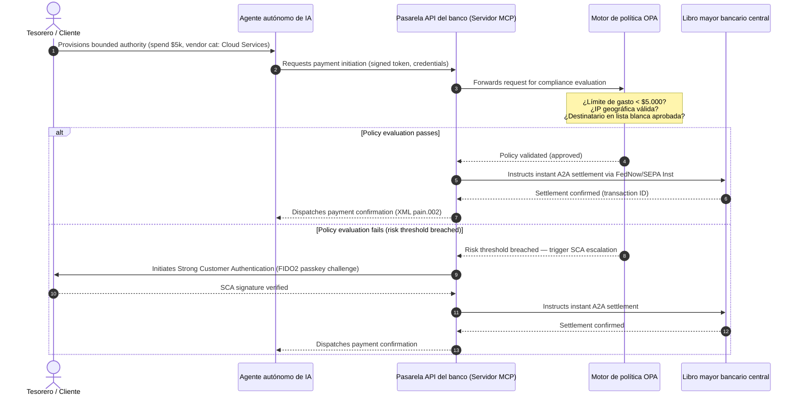

# Perspectivas globales de pagos 2026: modelo operativo, riesgo e ingresos en un mundo agéntico, invisible y en tiempo real

El ciclo global de pagos 2026 lo definen tres fuerzas convergentes — comercio agéntico, pagos integrados invisibles y ejecución en tiempo real — sobre un libro mayor unificado tokenizado bajo Project Agorá y una migración SWIFT de dirección estructurada con fecha firme en noviembre de 2026.

<!-- lead-start -->
<aside class="post-lead" aria-label="Resumen del artículo">

<strong>TL;DR.</strong> El panorama de pagos 2026 ha pasado de la migración de mensajería a un modelo operativo multidimensional donde el riesgo y los ingresos los dicta la ejecución en tiempo real. Este texto sintetiza las perspectivas 2026 de J.P. Morgan, Global Payments, HSBC y The Payments Association en un plan operativo G-SIB de cuatro pilares que cubre el comercio agéntico iniciado por modelos, las APIs de tesorería continuas, los libros mayores unificados tokenizados bajo BIS Project Agorá y la fecha límite SWIFT de dirección estructurada del 14 de noviembre de 2026.

<strong>Conclusiones clave</strong>

<ul class="post-lead-takeaways">
  <li><strong>El comercio agéntico abre una frontera de responsabilidad delegada.</strong> Las proyecciones sitúan a los agentes autónomos de IA intermediando $3-$5 trillion de comercio anual hacia 2030. Los bancos deben definir el control de acceso MCP, la delegación de SCA bajo PSD3/PSR y la titularidad de KYC/AML dentro de cadenas de pago multiagente.</li>
  <li><strong>La liquidez continua es ya línea base operativa y regulatoria.</strong> Las APIs de tesorería 24/7 y las cuentas virtuales minimizan el efectivo atrapado y elevan el listón de resiliencia. Bajo DORA, los productos de liquidez en tiempo real requieren infraestructura geo-redundante y activo-activo que sostenga el 99.999% de disponibilidad.</li>
  <li><strong>La tokenización ha pasado a libros mayores unificados regulados.</strong> Project Agorá es el mayor marco público-privado para depósitos tokenizados de banca comercial y reservas de banco central. Los bancos necesitan un recorrido de tokenización de cinco etapas, con tratamiento prudencial explícito.</li>
  <li><strong>La migración del 14 de noviembre de 2026 a dirección estructurada tiene fecha firme.</strong> Los campos de dirección postal no estructurados en mensajes CBPR+ y SEPA provocarán rechazos inmediatos. Se requiere gobernanza de datos limpia entre producto, tecnología y cumplimiento.</li>
</ul>

<strong>Lectura relacionada:</strong> <a href="https://sebastienrousseau.com/2026-06-23-iso-20022-pain001-programmable-liquidity-autonomic-treasury-2026">From Pain.001 to Programmable Liquidity: ISO 20022 as the Autonomic Nervous System of Treasury in 2026</a>, <a href="https://sebastienrousseau.com/2026-06-24-cross-border-iso-20022-open-finance-tokenised-deposits-treasury-2026">Cross-Border 2026: ISO 20022, Open Finance and Tokenised Deposits in Corporate Treasury</a>, <a href="https://sebastienrousseau.com/2026-06-25-quantum-dawn-cib-kyberlib-quantum-resilient-payments-stack-2026">Quantum Dawn for CIB: From KyberLib to a Quantum-Resilient Payments Stack</a>.

</aside>
<!-- lead-end -->

Para la banca transaccional global, el ciclo 2026-2028 abre una ventana estructural. La infraestructura moderna de pagos ha dejado de ser una utilidad administrativa: constituye el núcleo de la estrategia tecnológica de grado bancario. Dentro de los G-SIB y las grandes entidades regionales, tecnología, regulación y expectativa del cliente han convergido en un único plano operativo.

Tres fuerzas definen este ciclo, y cada una se proyecta directamente sobre una preocupación del comité ejecutivo.

- **Comercio agéntico** — distribución de canal, diseño de producto, asignación de responsabilidad y gestión del riesgo de modelos bajo escrutinio supervisor.
- **Pagos invisibles** — experiencia de cliente, con riesgo de desintermediación cuando los bancos no logran integrar su libro mayor en los front-ends corporativos y de comerciantes.
- **Ejecución en tiempo real** — velocidad del capital, con cambio consiguiente en la gestión de liquidez, el riesgo de crédito, la resiliencia operativa y la defensa frente al fraude.

La apuesta financiera es material. El fraude escala en velocidad y sofisticación; los plazos regulatorios son firmes; y los bancos que modernizan proactivamente sus sistemas centrales abren oportunidades sustanciales de ingresos por comisiones. El coste de la inacción es el opuesto: rechazos inmediatos de transacciones, cuellos de botella operativos, sanciones regulatorias y rápida erosión de cuota de mercado.

## La convergencia de las autoridades globales de pagos

Este informe sintetiza las perspectivas 2026 de pagos y comercio de cuatro voces autorizadas del sector — [J.P. Morgan Payments](https://www.jpmorgan.com/payments/newsroom/payments-outlook-2026-trends-report-released "J.P. Morgan Payments — Outlook 2026"), [Global Payments](https://investors.globalpayments.com/news-events/press-releases/detail/497/global-payments-releases-its-2026-commerce-and-payment "Global Payments — 2026 Commerce and Payment Trends Report"), HSBC y The Payments Association — y las triangula con la [Hoja de Ruta del G20 para Mejorar los Pagos Transfronterizos](https://www.fsb.org/2026/03/fsb-kicks-off-new-implementation-phase-to-enhance-cross-border-payments-through-public-private-partnership/ "FSB — fase de implementación de pagos transfronterizos, marzo de 2026").

Cada organización aborda el ecosistema desde un ángulo de mercado distinto, pero sus conclusiones convergen en tres invariantes.

1. **Los rails instantáneos basados en API son la línea base.** Los modelos legados de procesamiento por lotes quedan marginados para los flujos transfronterizos y de alto valor; la velocidad transaccional en esos segmentos la dicta la mensajería continua en tiempo real.
2. **La IA es a la vez amenaza y defensa.** Las herramientas generativas y los ultrafalsos (deepfake) escalan el fraude transaccional, lo que exige contradefensas de aprendizaje automático en tiempo real y multicapa.
3. **La tokenización es infraestructura lista para producción.** Los libros mayores se unifican para alojar pasivos comerciales tokenizados y monedas digitales mayoristas de banco central.

| Informe | Audiencia primaria | Enfoque | Pilar clave | Implicación bancaria |
| --- | --- | --- | --- | --- |
| **J.P. Morgan Payments** | Tesoreros corporativos, G-SIB | Liquidez en tiempo real, fraude | APIs, biometría con IA | Reconstruir los sistemas de liquidez, divisas y riesgo para liquidación continua los 365 días. |
| **Global Payments** | Comerciantes, e-commerce | Evolución del TPV, omnicanal | Comercio agéntico, pago sin fricción | Construir corredores de pago de comerciantes seguros y mediados por API para agentes autónomos de IA. |
| **HSBC Insights** | Corporaciones multinacionales | Integraciones ERP (SAP/Oracle), efectivo en tiempo real | Treasury-as-a-Service, visibilidad de caja | Monetizar suites de APIs transaccionales e integrar reporting de caja en tiempo real desde el origen. |
| **The Payments Association** | Fintechs, entidades de pago | Stablecoins, tokenización, regulación global | Activos digitales regulados, cumplimiento normativo | Preparar balances para depósitos tokenizados y navegar las estructuras de responsabilidad PSD3/PSR. |

Las cuatro perspectivas definen, en la práctica, la pila operativa del sector privado que se ejecuta sobre la infraestructura de política pública del G20, traduciendo la intención política en decisiones concretas sobre liquidez, tokenización, datos y control del fraude dentro de los bancos.

## Pilar 1 — Comercio agéntico y pagos invisibles

El comercio agéntico es la transición del pago dirigido por humanos con clic-para-comprar a la iniciación de transacciones autónoma y dirigida por modelos. Las previsiones del sector convergen en $3-$5 trillion de comercio anual intermediado por agentes autónomos hacia 2030 — una cuota de un dígito bajo del volumen global de pagos ejecutada sin que un humano pulse "comprar".

El ecosistema minorista y comercial presenta una brecha equivalente. Una mayoría clara de consumidores espera ya pagos casi sin fricción, pero menos de la mitad de los comerciantes ha priorizado el pago a un clic o los catálogos de producto accesibles por API. Los agentes de IA no pueden navegar pantallas de pago legadas y multipágina diseñadas para ojos humanos; necesitan handshakes API estructurados y máquina a máquina.

### Prioridades bancarias e impacto operativo

- **Titularidad de KYC y AML.** Los bancos deben definir quién ostenta la obligación de cumplimiento dentro de una cadena transaccional agéntica. Si el agente personal de IA de un consumidor inicia una transacción a través del pago agéntico de un comerciante, el banco debe verificar que la autoridad delegada de origen está vinculada criptográficamente al titular principal de la cuenta.
- **Rediseño de responsabilidad y contracargo.** Los esquemas de tarjeta y los rails A2A se diseñaron en torno a la autorización humana. Cuando un agente de IA ejecuta una compra errónea — adquiriendo inventario industrial incorrecto por un error de análisis de datos, por ejemplo — los bancos deben asignar responsabilidad con claridad entre consumidor, proveedor del agente y comerciante.
- **Clasificación de riesgo de flujos agénticos.** Los motores de enrutamiento de pagos deben calificar el riesgo de los pagos agénticos de forma dinámica, aplicando requisitos de reserva o tasas de intercambio superiores a las transacciones no iniciadas por humanos hasta que exista un historial de liquidación estable.

### Acción acotada y autoridad acotada

Para mitigar la "acción no acotada" — un agente corporativo de compras ejecutando un bucle de adquisición recursivo infinito por un fallo de software — los bancos deben desplegar **puertas de API de autoridad acotada**. Esas puertas hacen cumplir límites a nivel de política a lo largo de tres dimensiones.

1. **Límites financieros escalonados** — gasto del agente restringido por tamaño de transacción, valor acumulado diario y categoría de comerciante.
2. **Salvaguardas conscientes del contexto** — señales secundarias (hora del día, geolocalización IP, frecuencia transaccional) evaluadas antes de que el libro mayor libere los fondos.
3. **Escalado con humano en el bucle** — autorización humana obligatoria activada vía Strong Customer Authentication (SCA) bajo PSD3 / PSR siempre que una transacción supere los umbrales de riesgo.

La secuencia Mermaid siguiente muestra la arquitectura objetivo que muchos bancos reconocerán como el flujo de pago agéntico de autoridad acotada.

### El Model Context Protocol (MCP)

Para conectar modelos de IA localizados con capas de ejecución gobernadas por el banco, el sector se está estandarizando en torno al [Model Context Protocol (MCP)](https://modelcontextprotocol.io "Model Context Protocol — open standard for LLM tool integration") — un protocolo abierto que permite a los LLM invocar herramientas y APIs claramente acotadas y auditables sin acceso directo a los sistemas centrales.

Envolver las APIs bancarias (iniciación de pago, consulta de saldo, verificación de contraparte) dentro de un servidor MCP mantiene a los LLM lejos de las tablas de base de datos y de los controles de sistema raíz. El modelo interactúa con el libro mayor únicamente a través de endpoints estructurados, auditados y con límite de tasa — la seguridad se aplica en la frontera de la ejecución de herramientas agénticas, no enterrada dentro del modelo.

## Pilar 2 — Transformación de la tesorería y liquidez reimaginada

La velocidad de la banca transaccional en 2026 la fija el desplazamiento del procesamiento por lotes al cierre del día hacia operaciones de tesorería continuas y en tiempo real. Las corporaciones multinacionales ya no toleran el efectivo atrapado — liquidez ociosa en cuentas locales durante fines de semana o festivos porque los sistemas de liquidación están cerrados.

### El argumento económico de la liquidez en tiempo real

J.P. Morgan y HSBC coinciden en que las corporaciones con capacidades avanzadas de caja y datos en tiempo real tienen una probabilidad materialmente mayor de superar a sus pares en crecimiento de ingresos y eficiencia de capital, principalmente al reducir la liquidez atrapada y optimizar los ciclos de capital circulante.

Para capturar ese valor, los bancos lanzan **productos de API Treasury-as-a-Service (TaaS)** que permiten que los ERP corporativos (SAP, Oracle) se conecten directamente al libro mayor del banco.

- **APIs de saldo en tiempo real** con el esquema `camt.052` — sustituyendo los protocolos de transferencia de archivos por reporting instantáneo y orientado a eventos de la posición de caja.
- **APIs de iniciación de pago en lote** con `pain.001` — ejecución directa y straight-through de lotes de pago a proveedores desde el libro mayor del ERP.
- **APIs de divisas continuas** — los motores de tesorería fijan tipos de cambio algorítmicos en tiempo real para la liquidación transfronteriza, eliminando el riesgo de hueco de mercado nocturno.
- **APIs de cuenta virtual** — las corporaciones crean y retiran dinámicamente miles de subcuentas para conciliación automatizada de cobros y separación del libro mayor.

### Resiliencia operativa y DORA

Ofrecer liquidez continua transforma el perfil de riesgo del banco. La plataforma debe sostener un **99.999% de disponibilidad operativa** bajo carga continua y en tiempo real.

Bajo el [Reglamento de Resiliencia Operativa Digital (DORA)](https://eur-lex.europa.eu/legal-content/EN/TXT/?uri=CELEX%3A32022R2554 "Regulation (EU) 2022/2554 — Digital Operational Resilience Act"), eso no es un KPI de TI — es un requisito regulatorio estricto. Los supervisores esperan que los bancos demuestren que la superficie de API de tesorería en tiempo real y la base de datos del libro mayor pueden absorber ciberataques severos pero plausibles, cortes de red e interrupciones de hyperscaler sin interrumpir pagos críticos ni comprometer la liquidez sistémica. Ello exige arquitecturas de base de datos multinube geo-redundantes y activo-activo, capas de detección de amenazas en tiempo real y conmutación automática — visibles en la línea de coste de cambio, no solo en el dossier de auditoría.

### Divisas continuas e innovación transfronteriza

La tesorería en tiempo real no puede vivir dentro de un perímetro de una sola divisa. Los G-SIB están desplegando infraestructura de divisas continua — la plataforma [Wire 365](https://www.jpmorgan.com/insights/payments/fx-cross-border/wire-365-global-clearing "J.P. Morgan — Wire 365 global clearing reinvented") de J.P. Morgan procesa pagos transfronterizos y conversiones de divisas cualquier día del año, más allá de los horarios tradicionales de RTGS de los bancos centrales. Esa capa engrana directamente con los sistemas de depósitos tokenizados y libros mayores unificados que se tratan en el Pilar 3.

## Pilar 3 — Depósitos tokenizados y el libro mayor unificado

La tokenización ha pasado de pilotos aislados de prueba de concepto a infraestructura monetaria de grado bancario y escalada. El foco se ha desplazado de las stablecoins privadas y los criptoactivos especulativos hacia los **depósitos tokenizados de banca comercial** y las **monedas digitales mayoristas de banco central (wCBDC)** que operan sobre libros mayores unificados programables.

El marco de referencia es [Project Agorá](https://www.bis.org/about/bisih/topics/fmis/agora.htm "BIS Project Agorá — tokenisation of wholesale cross-border payments") — una colaboración público-privada de gran envergadura convocada por el BIS y el IIF, con siete bancos centrales y más de 40 entidades financieras privadas. El proyecto explora cómo los depósitos tokenizados de banca comercial se integran con las wCBDC tokenizadas en un libro mayor programable compartido para eliminar la fricción de la liquidación transfronteriza, coordinar las comprobaciones de cumplimiento y habilitar la finalidad atómica 24/7.

### El recorrido de tokenización en cinco etapas

Para los G-SIB y los principales bancos regionales, la tokenización es un recorrido por etapas que va de la optimización interna a la interoperabilidad en mercado abierto.

1. **Liquidez de tesorería interna** — tokenización de los saldos de caja corporativos internos (p. ej., JPM Coin o libros mayores bancarios privados equivalentes) para habilitar transferencia y netting transfronterizos 24/7 e instantáneos entre las sucursales del propio banco.
2. **Corredores multibancarios acotados** — consorcios cerrados y regulados (el sandbox de Project Agorá) para probar la liquidación interbancaria y el estado compartido del libro mayor entre instituciones distintas.
3. **Divisas continuas programables** — los contratos inteligentes sobre el libro mayor unificado ejecutan divisas instantáneas Pago-contra-Pago (PvP), eliminando el riesgo de liquidación entre zonas horarias.
4. **Activos del mundo real tokenizados (RWA)** — la pata de caja tokenizada se integra con libros mayores tokenizados de valores, deuda o trade finance para finalidad instantánea de Entrega-contra-Pago (DvP), reduciendo el bloqueo de capital de días a milisegundos.
5. **Interoperabilidad pública/híbrida regulada** — los envoltorios seguros de pasarela permiten que la liquidez institucional interactúe con seguridad con redes públicas abiertas.

### Implicaciones prudenciales y de balance

La caja tokenizada debe navegarse por los marcos prudenciales con cuidado. Los supervisores subrayan que un depósito tokenizado debe ser económicamente equivalente a un depósito tradicional de banca comercial — es decir, un pasivo no garantizado en el balance del banco con la misma cobertura de garantía de depósitos.

Desde el plano operativo, los depósitos tokenizados introducen riesgos que los modelos clásicos de estrés de liquidez no fueron diseñados para simular. Los contratos inteligentes ejecutan retiradas programables a velocidades y volúmenes que los supuestos legados no capturan. Bajo Basel III, los bancos deben asegurar que el motor de riesgo modela las retiradas programables de caja y que el libro mayor tokenizado interopera con limpieza con los sistemas RTGS legados a lo largo del ciclo diario de liquidez.

### Stablecoins frente a depósitos tokenizados — una posición matizada

Las stablecoins privadas plenamente reservadas (USDC, etc.) siguen capturando cuota de mercado en la remesa minorista transfronteriza y en el comercio descentralizado, pero carecen de la capacidad de creación de crédito y de la finalidad de liquidación del sistema bancario comercial.

En lugar de competir en rails minoristas, la banca transaccional se está estableciendo en custodia, emitiendo sus propios instrumentos de pasivo tokenizado regulado y construyendo pasarelas seguras de entrada/salida. Los clientes corporativos obtienen flexibilidad de programación mientras conservan el capital dentro del perímetro regulado.

### Preguntas que un consejo debe formular sobre el dinero tokenizado

- **Participación en el libro mayor unificado.** ¿Cuál es nuestra hoja de ruta estratégica activa para participar en iniciativas público-privadas mayoristas de libro mayor unificado como Project Agorá?
- **Balance y modelización del riesgo.** ¿Han actualizado nuestros motores de riesgo y nuestros marcos de adecuación de capital sus pruebas de estrés para tener en cuenta la velocidad de las retiradas de tokens activadas por contrato inteligente?
- **Segmentos de cliente pioneros.** ¿Cuáles de nuestros segmentos de tesorería corporativa y banca comercial se beneficiarían de inmediato de la liquidación programable y tokenizada DvP/PvP?

## Pilar 4 — Datos estructurados y defensa frente al fraude

El cumplimiento de infraestructura en 2026 lo domina la **migración a dirección estructurada del 14 de noviembre de 2026** establecida bajo la [Standards Release (SR) 2026 de SWIFT](https://www.swift.com/standards/iso-20022/removal-unstructured-address "SWIFT — Removal of unstructured address, November 2026"). A partir de esa fecha, las redes de pagos CBPR+ y SEPA dejan de aceptar bloques de dirección postal totalmente no estructurados y de texto libre (`<AdrLine>`) en los mensajes de pago. Todo mensaje transfronterizo o doméstico que porte una dirección no estructurada donde se esperan elementos estructurados quedará retrasado o rechazado por la red.

La mayoría de las entidades conoce la fecha. Muchas la tratan como un ejercicio superficial de mapeo en la capa de interfaz. La realidad es un reto más profundo de calidad y gobernanza de datos. Para evitar tasas catastróficas de rechazo, las operaciones de pagos necesitan un marco de gobernanza interfuncional claro.

- **Producto y operaciones.** Captura de datos en origen. Los portales digitales de cara al cliente, las interfaces de onboarding y los campos de entrada del ERP corporativo deben imponer campos de dirección estructurada (`<StrtNm>`, `<PstCd>`, `<TwnNm>`, `<Ctry>`) en el punto de iniciación del pago.
- **Tecnología.** Análisis sintáctico, mapeo y validación de esquemas. Los motores de validación bloquean los archivos legados antes de que alcancen la interfaz SWIFT. Los modelos de aprendizaje automático desplegados localmente analizan los bloques de dirección no estructurados legados convirtiéndolos en etiquetas conformes a XML bajo `<PstlAdr>`.
- **Cumplimiento y riesgo.** Cribado de sanciones, monitorización transaccional y lógica AML actualizadas para ingerir los campos XML estructurados — reduciendo las tasas de falsos positivos y las investigaciones manuales.

### El caso de negocio para los datos estructurados

Tratado como coste de cumplimiento, el programa de datos estructurados es caro. Tratado como habilitador de ingresos, se paga por sí mismo.

1. **Decisión crediticia avanzada.** Los datos estructurados de factura, remesa y deudor último permiten a los bancos construir programas automatizados y precisos de financiación de circulante y factoring de cadena de suministro para clientes corporativos.
2. **Conciliación automatizada de cobros.** Exponer identificadores estructurados de contraparte y de factura sustenta productos premium de conciliación de caja y pooling de cuentas virtuales, generando nuevos ingresos por comisión transaccional.
3. **Analítica transaccional monetizable.** Los bancos empaquetan y venden cuadros de mando granulares y en tiempo real de liquidez y patrones de compra a los CFO y tesoreros corporativos.

### Defensa frente al fraude con IA por capas

A medida que las velocidades transaccionales aceleran al tiempo real, las técnicas de fraude han escalado. Investigaciones recientes indican que los ultrafalsos (deepfake) representan en torno al 40 % de los intentos de fraude biométrico, con uso creciente de medios sintéticos para vencer los controles de reconocimiento de voz y facial en onboarding y flujos de pago.

La defensa es un **modelo de fraude con IA en tres capas**.

1. **Capa de identidad.** Passkeys [FIDO2](https://fidoalliance.org/fido2/ "FIDO Alliance — FIDO2 specification") verificadas biométricamente, vinculación criptográficamente firmada de dispositivo por hardware y monederos de ID digital descentralizados para asegurar el acceso al pago.
2. **Capa comportamental.** Biometría comportamental continua — ritmo de navegación en sesión, cadencia de tecleo, orientación del dispositivo — para detectar ejecución automatizada por bots o intentos de secuestro de sesión.
3. **Capa transaccional.** Los campos estructurados de ISO 20022 alimentan motores de riesgo de aprendizaje automático en tiempo real, cruzando los metadatos de transacción con inteligencia de consorcio compartida a nivel de red para identificar transacciones sospechosas en milisegundos desde la iniciación.

Para satisfacer a los supervisores, los modelos de IA de capa transaccional incorporan **parámetros estrictos de explicabilidad** y operan bajo un programa dedicado de Gestión del Riesgo de Modelos (MRM). Los reguladores esperan que los bancos expliquen los puntos de datos concretos y la lógica algorítmica que activaron un bloqueo automático o una alerta de fraude, en línea con la [SR 11-7 de la Reserva Federal de EE. UU.](https://www.federalreserve.gov/frrs/guidance/supervisory-guidance-on-model-risk-management.htm "US Federal Reserve — Supervisory Guidance on Model Risk Management, SR 11-7") y la [PRA SS1/23 del Banco de Inglaterra](https://www.bankofengland.co.uk/prudential-regulation/publication/2023/may/model-risk-management-principles-for-banks-ss "Bank of England PRA SS1/23 — Model Risk Management principles for banks").

## Agenda del consejo 2026-2028

Para ejecutar a lo largo de los cuatro pilares, los órganos de dirección de los G-SIB y de la banca regional deben organizar las inversiones operativas y tecnológicas en una hoja de ruta clara de tres horizontes.

### Horizonte 1 — Cumplimiento inmediato y endurecimiento del núcleo (0-12 meses)

- **Foco.** Estandarizar la calidad de datos ISO 20022 y asegurar las rutas básicas de transacción en tiempo real.
- **Indicador de éxito (KPI).** Cero rechazos por dirección no estructurada en SWIFT y SEPA tras la migración del 14 de noviembre de 2026.
- **Responsable ejecutivo.** Director de Operaciones / Director de Operaciones de Pagos.
- **Tipo de entregable.** Movimiento sin arrepentimientos. Actualizaciones del esquema central de base de datos y el motor de validación SWIFT SR 2026.

### Horizonte 2 — Automatización y salvaguardas agénticas (12-24 meses)

- **Foco.** Puertas de API agénticas acotadas y arquitectura de defensa continua frente al fraude.
- **Indicador de éxito (KPI).** 100 % de las transacciones API máquina a máquina e iniciadas por IA validadas mediante vinculación de hardware FIDO2 y motores de política de autoridad acotada.
- **Responsable ejecutivo.** Director de Sistemas / Director de Riesgos.
- **Tipo de entregable.** Movimiento sin arrepentimientos (defensa frente al fraude) más opción estratégica (comercio agéntico). Despliegue de MCP y la IA de fraude en tres capas.

### Horizonte 3 — Tokenización de plataforma y libros mayores unificados (24-36 meses)

- **Foco.** Transición de los activos de tesorería a depósitos tokenizados y participación en libros mayores transfronterizos compartidos.
- **Indicador de éxito (KPI).** Al menos el 15 % del volumen de liquidación de tesorería corporativa de alto valor procesado de forma nativa mediante instrumentos de depósito tokenizado o acuerdos de libro mayor unificado (p. ej., corredores de Project Agorá).
- **Responsable ejecutivo.** Tesorero del grupo / Director de Banca Transaccional.
- **Tipo de entregable.** Opción estratégica. Infraestructura de libro mayor programable, reglas de liquidez basadas en contratos inteligentes y adaptadores de liquidación DvP/PvP.

## FAQ

**¿Alcanzará realmente el comercio agéntico los $3-$5 trillion en 2030?**
La base de McKinsey apunta a $5 trillion de ventas de comercio agéntico en 2030, con un abanico de previsiones independientes que se agrupan entre $3 trillion y $5 trillion. La varianza refleja la rapidez con la que los comerciantes desplieguen APIs de pago legibles por máquina y la rapidez con la que los bancos permitan a los agentes transaccionar bajo delegación de SCA — el cuello de botella está en el lado del banco y del comerciante, no en el de la capacidad del agente.

**¿La migración SWIFT del 14 de noviembre de 2026 se aplica también a los flujos domésticos de SEPA?**
Sí. El requisito de dirección estructurada se aplica al transfronterizo CBPR+ y a los mensajes de pago SEPA. Los bancos que operan ambos rails necesitan un único esquema canónico de dirección aguas arriba de la interfaz SWIFT, no dos mapeos paralelos.

**¿Un depósito tokenizado es lo mismo que una stablecoin?**
No. Un depósito tokenizado es un pasivo no garantizado en el balance de un banco regulado, con la misma cobertura de garantía de depósitos que un depósito tradicional. Una stablecoin es típicamente un instrumento plenamente reservado emitido por un no banco, sin capacidad de creación de crédito. El diseño de Project Agorá supone que los depósitos tokenizados conviven con las wCBDC en un libro mayor programable compartido; las stablecoins no aparecen en la pata de liquidación mayorista.

**¿Cómo se relaciona Project Agorá con los pilotos wCBDC existentes?**
Agorá es el marco integrador. Los experimentos nacionales de wCBDC cubren la pata de dinero de banco central; Agorá lleva los depósitos comerciales tokenizados al mismo libro mayor programable de modo que la liquidación transfronteriza es atómica entre ambos tipos de dinero. Los siete bancos centrales participantes y las más de 40 entidades privadas lo convierten en el mayor terreno de diseño público-privado para la arquitectura de dinero tokenizado mayorista.

**¿Cuál es la postura mínima de cumplimiento de DORA para una API TaaS?**
Despliegue geo-redundante activo-activo, escenarios cibernéticos severos pero plausibles documentados con responsables nominados bajo SM&CR (Reino Unido) y una conmutación probada que no interrumpa los pagos críticos. Sin eso, el producto TaaS es un pasivo regulatorio antes que una línea de ingresos.

## Referencias

- Bank for International Settlements (BIS) Innovation Hub. (2026). *Project Agorá: exploring tokenisation of wholesale cross-border payments*. [BIS Project Agorá](https://www.bis.org/about/bisih/topics/fmis/agora.htm).
- Deutsche Bank. (2026). *Digital Money: a perspective on stablecoins, tokenised deposits and CBDCs*. [Deutsche Bank Flow](https://flow.db.com/publications/flow-white-papers-and-guides/digital-money-a-perspective-on-stablecoins-tokenised-deposits-and-cbdcs).
- European Parliament and Council. (2022). *Regulation (EU) 2022/2554 on Digital Operational Resilience (DORA)*. [DORA Regulation](https://eur-lex.europa.eu/legal-content/EN/TXT/?uri=CELEX%3A32022R2554).
- Financial Stability Board. (2026). *FSB kicks off new implementation phase to enhance cross-border payments*. [FSB statement](https://www.fsb.org/2026/03/fsb-kicks-off-new-implementation-phase-to-enhance-cross-border-payments-through-public-private-partnership/).
- Global Payments. (2025). *2026 Commerce and Payment Trends Report — press release*. [Global Payments press release](https://investors.globalpayments.com/news-events/press-releases/detail/497/global-payments-releases-its-2026-commerce-and-payment).
- J.P. Morgan Payments. (2026). *Payments Outlook 2026 Trends Report Released*. [J.P. Morgan Newsroom](https://www.jpmorgan.com/payments/newsroom/payments-outlook-2026-trends-report-released).
- J.P. Morgan Insights. (2026). *5 Payment Trends to Watch for in 2026*. [J.P. Morgan Trends](https://www.jpmorgan.com/insights/payments/trends-innovation/five-payment-trends-in-2026).
- J.P. Morgan FX & Cross-Border. (2026). *Wire 365: Global Clearing Reinvented*. [J.P. Morgan FX Wire 365](https://www.jpmorgan.com/insights/payments/fx-cross-border/wire-365-global-clearing).
- SWIFT. (2026). *ISO 20022 milestone for November 2026: unstructured addresses to be removed*. [SWIFT ISO 20022 Milestone](https://www.swift.com/news-events/news/iso-20022-milestone-november-2026-unstructured-addresses-be-removed).
- SWIFT Standards. (2026). *Removal of unstructured address*. [SWIFT Standards](https://www.swift.com/standards/iso-20022/removal-unstructured-address).
- Bank of England. (2023). *Supervisory Statement (SS1/23) — Model Risk Management principles for banks*. [Bank of England PRA SS1/23](https://www.bankofengland.co.uk/prudential-regulation/publication/2023/may/model-risk-management-principles-for-banks-ss).
- US Federal Reserve. (2011). *Supervisory Guidance on Model Risk Management (SR 11-7)*. [SR 11-7](https://www.federalreserve.gov/frrs/guidance/supervisory-guidance-on-model-risk-management.htm).
- McKinsey & Company. (2025). *McKinsey forecast: $5 trillion in agentic commerce sales by 2030* (via Digital Commerce 360). [McKinsey agentic forecast](https://www.digitalcommerce360.com/2025/10/20/mckinsey-forecast-5-trillion-agentic-commerce-sales-2030/).
- HSBC Business. (2026). *HSBC Business Insights*. [HSBC Insights](https://www.business.hsbc.com/en-gb/insights).
- Bright Defense. (2026). *Deepfake Statistics: A Growing Security Concern*. [Deepfake fraud statistics](https://www.brightdefense.com/resources/deepfake-statistics/).
- European Banking Authority. (2019). *Guidelines on outsourcing arrangements (EBA/GL/2019/02)*. [EBA Outsourcing Guidelines](https://www.eba.europa.eu/regulation-and-policy/internal-governance/guidelines-on-outsourcing-arrangements).

<!-- enrich-start -->
<aside class="author-card" aria-label="Sobre el autor"><strong class="author-card-name"><a href="/about/index.html">Sebastien Rousseau</a></strong>Tecnólogo bancario sénior que escribe sobre IA aplicada, migración ISO 20022, criptografía post-cuántica para servicios financieros y la transformación estructural de los pagos mayoristas.Más de 20 años en HSBC Commercial &amp; Investment Bank, PayPal, Barclays, Shazam, AKQA, Virgin Group. <a href="/about/index.html">Perfil completo</a> &middot; <a href="https://www.linkedin.com/in/sebastienrousseau/" rel="external noopener">LinkedIn</a> &middot; <a href="https://github.com/sebastienrousseau" rel="external noopener">GitHub</a></aside>

Última revisión <time datetime="2026-06-25">2026-06-25</time>.

<!-- enrich-end -->
