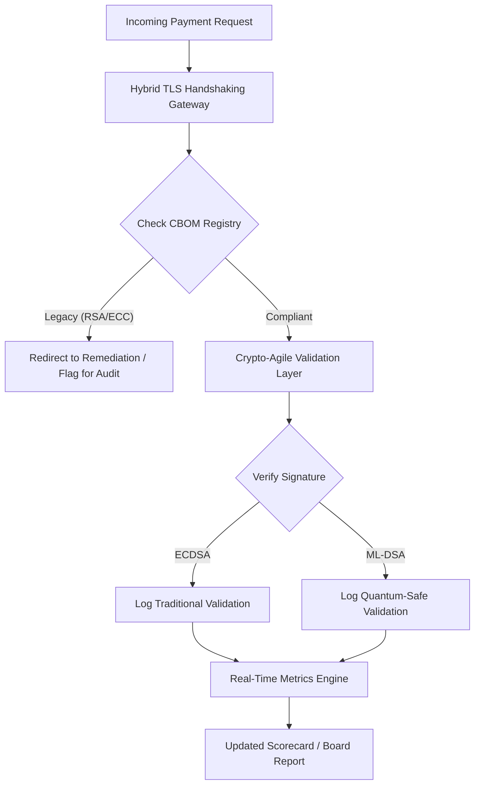

# Cuadro de Mando de Seguridad Poscuántica 2026: un marco de métricas para el consejo orientado a la agilidad criptográfica fiduciaria

<aside class="post-lead" aria-label="Resumen del artículo">

<strong>TL;DR.</strong> En junio de 2026, la criptografía poscuántica (PQC) ha pasado de ser una preocupación técnica experimental a una obligación fiduciaria de primer orden. Los consejos deben supervisar la migración sistemática del cifrado heredado a los estándares NIST FIPS 203 y 204 para mitigar los riesgos financieros y operativos sistémicos bajo DORA.

<strong>Conclusiones clave</strong>

<ul class="post-lead-takeaways">
  <li><strong>Alineación G20 y plazos firmes.</strong> Los reguladores internacionales han fijado el final de la década como plazo firme para las transiciones cuánticamente seguras, exigiendo a las entidades demostrar un avance de migración cuantificable.</li>
  <li><strong>El Cryptographic Bill of Materials (CBOM).</strong> Análogo a un BOM de software, un CBOM es un inventario vivo y automatizado de todos los activos criptográficos, imprescindible para garantizar la visibilidad en toda la cadena de suministro.</li>
  <li><strong>Exposición Harvest-Now-Decrypt-Later (HNDL).</strong> Los adversarios están interceptando y almacenando ya datos cifrados de pagos mayoristas de alto valor; mitigarlo exige el despliegue inmediato de arquitecturas PQC híbridas.</li>
  <li><strong>Gobernanza fiduciaria mediante agilidad criptográfica.</strong> La agilidad criptográfica es una métrica de gobernanza medible. La capacidad de intercambiar primitivas criptográficas sin reescribir los sistemas centrales (con librerías como KyberLib) es ya una responsabilidad del consejo bajo SM&CR.</li>
</ul>

<strong>Lecturas relacionadas:</strong> <a href="https://sebastienrousseau.com/2026-06-12-kyberlib-post-quantum-banking-migration-standards-code-2026">KyberLib y la migración bancaria poscuántica en 2026</a>, <a href="https://sebastienrousseau.com/2023-11-19-crystals-kyber-the-safeguarding-algorithm-in-a-quantum-age/index.html">CRYSTALS-Kyber: el algoritmo de protección en la era cuántica</a>.

</aside>
La seguridad poscuántica ha dejado de ser un proyecto de investigación. El "reloj supervisor" avanza hacia los plazos de aplicación de finales de esta década. La finalización de [NIST FIPS 203 (ML-KEM)](https://csrc.nist.gov/pubs/fips/203/final) y [NIST FIPS 204 (ML-DSA)](https://csrc.nist.gov/pubs/fips/204/final) ha codificado los estándares de encapsulación de claves y firma digital.

Los reguladores esperan ahora que los bancos de primer nivel superen la fase de pilotos. En 2026, el foco se ha desplazado a la industrialización de estos estándares. No demostrar una ruta de migración clara conlleva sanciones regulatorias relevantes bajo el [Reglamento de Resiliencia Operativa Digital (DORA)](https://eur-lex.europa.eu/eli/reg/2022/2554/oj) y posible responsabilidad personal para los consejeros que ignoren la amenaza previsible del descifrado habilitado por ordenadores cuánticos.

## 01. El cuadro de mando cuántico para el consejo

Las métricas siguientes ofrecen un marco estandarizado para que los consejos evalúen la preparación cuántica y la salud criptográfica de sus operaciones de Banca Comercial y de Inversión (CIB).

### Tabla 1: métricas del cuadro de mando PQC y tolerancias

| Métrica | Fórmula matemática | Tolerancias aprobadas por el consejo | Riesgo si está fuera de tolerancia |
| ---- | ---- | ---- | ---- |
| **Porcentaje de Integridad del Inventario (ICP)** | (Activos criptográficos identificados / Total de activos estimados) × 100 | > 98 % | Cifrado en la sombra y puntos ciegos en las rutas de datos de compensación de alto valor. |
| **Tasa de Exposición HNDL (HER)** | (Datos de larga vida sobre criptografía heredada / Total de datos de larga vida) × 100 | < 5 % | Compromiso permanente de secretos comerciales, libros de deuda soberana y registros de pagos mayoristas. |
| **Tasa de Avance de Migración NIST (MPR)** | (Sistemas que ejecutan FIPS 203/204 / Total de sistemas críticos) × 100 | > 60 % (a cierre de 2026) | Incumplimiento regulatorio y exclusión de contrapartes alineadas con el G20. |
| **Índice de Preparación para la Agilidad Criptográfica (CARI)** | (Aplicaciones con capas criptográficas abstractas / Total de aplicaciones centrales) × 100 | > 85 % | Deuda técnica grave e incapacidad para responder a futuras retiradas de algoritmos. |

## 02. El Cryptographic Bill of Materials (CBOM)

La métrica ICP se establece como línea base mediante una **fase de descubrimiento del CBOM** exhaustiva. Es un proceso automatizado que identifica cada punto final criptográfico de la entidad.

- **Descubrimiento de puntos finales:** escaneo de redes internas y de nube para identificar el uso heredado de RSA o ECC en sesiones TLS activas.
- **Inventario de claves:** asociación de pares de claves públicas/privadas a sus propietarios y registro de las fechas exactas de caducidad.
- **Mapeo de dependencias:** identificación de librerías y APIs de terceros que dependen de algoritmos obsoletos.

Esta fase de descubrimiento crea una única fuente de verdad y permite al CISO informar sobre la salud criptográfica con el mismo nivel de detalle que sobre el rendimiento financiero.

## 03. Eliminar la exposición HNDL en pagos mayoristas

Los adversarios atacan ya activamente los pagos mayoristas y las bases de datos corporativas de larga vida. Estos ataques "Harvest-Now-Decrypt-Later" (HNDL) consisten en la interceptación y el archivado del tráfico cifrado actual.

Aunque hoy no exista un ordenador cuántico criptográficamente relevante (CRQC), los datos interceptados ahora serán vulnerables en el futuro. Mitigarlo requiere una migración prioritaria de los datos de larga vida (por ejemplo, registros de identidad, contratos de bonos a 30 años y archivos legales), lo que reduce directamente la métrica HER. Actualizar los canales de pago a cifrado híbrido PQC-tradicional (utilizando ML-KEM junto con X25519) proporciona defensa inmediata frente a las amenazas de archivado.

## 04. Operacionalizar la agilidad criptográfica mediante interfaces bien diseñadas

La agilidad criptográfica se materializa mediante abstracciones de ingeniería. Librerías modernas como [KyberLib](https://sebastienrousseau.com/2026-06-12-kyberlib-post-quantum-banking-migration-standards-code-2026) muestran cómo los desarrolladores pueden implantar módulos cuánticamente seguros sin reescribir toda la pila de aplicación.

- **Wrappers abstractos:** las aplicaciones invocan una función genérica `encrypt()` o `sign()` en lugar de rutinas específicas del algoritmo.
- **Intercambio en tiempo de ejecución:** el módulo subyacente puede pasar de ECDSA a ML-DSA mediante cambios de configuración en lugar de despliegues de código complejos.

Esta arquitectura asegura que, si un algoritmo PQC concreto resulta comprometido en el futuro, la organización pueda reaccionar en horas y no en años.

## 05. El flujo de validación de entrada cuánticamente seguro

El diagrama siguiente muestra el ciclo de vida de los datos que entran en el perímetro seguro de un entorno bancario con agilidad cuántica.

## Conclusión

El patrimonio criptográfico de un banco de primer nivel ya no es asunto del CISO. Es infraestructura fiduciaria. NIST FIPS 203 y 204 fijan los algoritmos; el artículo 5 de DORA fija la superficie de responsabilidad; SM&CR la ancla a un directivo con nombre y apellidos. El cuadro de mando anterior — Integridad del Inventario, Exposición HNDL, Avance de Migración, Agilidad Criptográfica — entrega al consejo las cuatro cifras que necesita para gobernar ese patrimonio sin tener que leer el código criptográfico.

La cifra que más importa es la Exposición HNDL. Cada registro cifrado con tecnología heredada que hoy reposa en un archivo de pagos mayoristas será legible el día en que se entregue el primer ordenador cuántico criptográficamente relevante. La cuenta atrás es silenciosa y asimétrica: los defensores solo pueden actuar sobre los datos que custodian, mientras que los adversarios pueden actuar sobre datos que ya exfiltraron hace años. Un contrato de bono corporativo a 30 años cifrado con RSA-2048 en 2024 es un contrato que pierde su garantía de confidencialidad el día que un CRQC entre en servicio.

[KyberLib](https://sebastienrousseau.com/2026-06-12-kyberlib-post-quantum-banking-migration-standards-code-2026) y sus pares convierten lo que sería una reescritura de plataforma plurianual en un cambio de configuración. El consejo no tiene que escribir el código. El consejo tiene que exigir que el Índice de Preparación para la Agilidad Criptográfica — la proporción de aplicaciones centrales tras una interfaz criptográfica abstracta — supere el 85 % en doce meses, y leer el cuadro de mando trimestral.

<aside class="author-card" aria-label="Sobre el autor"><strong class="author-card-name"><a href="/about/index.html">Sebastien Rousseau</a></strong>Tecnólogo bancario sénior que escribe sobre IA aplicada, migración a ISO 20022, criptografía poscuántica para servicios financieros y la transformación estructural de los pagos mayoristas.Más de 20 años en HSBC Commercial & Investment Bank, PayPal, Barclays, Shazam. <a href="https://www.linkedin.com/in/sebastienrousseau/" rel="external noopener">LinkedIn</a> &middot; <a href="https://github.com/sebastienrousseau" rel="external noopener">GitHub</a></aside>

Última revisión <time datetime="2026-06-29">2026-06-29</time>.

