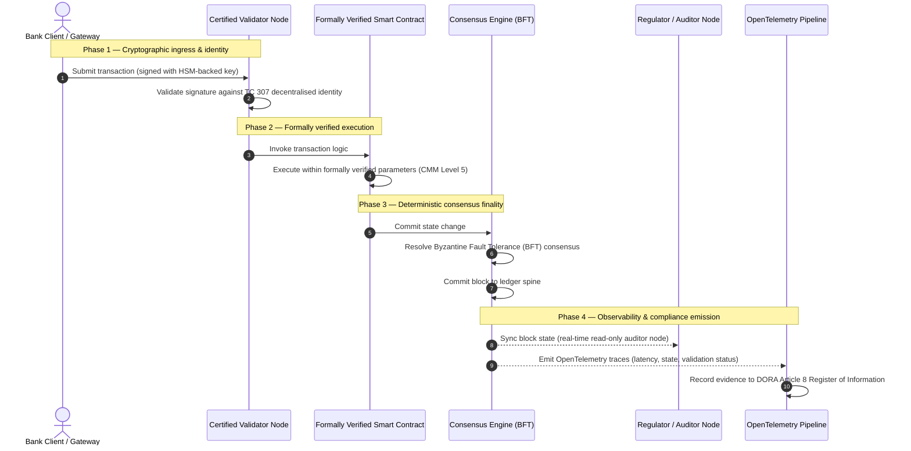

# De la evidencia a la verdad: por qué las cadenas de bloques certificadas definirán la próxima era de la confianza bancaria

## Resumen estratégico (lo esencial)

La banca mayorista y las transacciones globales se encuentran, en 2026, en un punto de inflexión histórico. A medida que los servicios financieros migran a redes de compensación nativamente digitales y en tiempo real, y a medida que la inteligencia artificial introduce un no determinismo probabilístico, los modelos de aseguramiento tradicionales —analógicos y retrospectivos (como las auditorías estáticas basadas en la entidad)— dejan de satisfacer las exigencias modernas de gestión de riesgos y responsabilidad fiduciaria.

El Comité Técnico ISO/IEC TC 307 ha establecido una base normalizada para las tecnologías de registro distribuido. Sin embargo, una verdadera adopción institucional exige pasar de una orientación descriptiva a un aseguramiento de la cadena de bloques prescriptivo y certificable de forma independiente. Al puntuar la gobernanza del registro, la integridad del consenso, la seguridad de los contratos inteligentes y la agilidad criptográfica frente a un estricto Modelo de Madurez de Capacidades (CMM) de cinco niveles, los bancos pueden pasar de supuestos dispares y propios de cada proveedor a una verdad financiera certificable y auditable por el consejo.

## Puntos clave

* **La brecha de fricción fiduciaria**: hoy sabemos certificar el banco (Basilea III), la nube (ISO 27001) y los sistemas de gobernanza de la IA (ISO 42001), pero aún no sabemos certificar el registro distribuido que cada vez más determina qué es verdad. Esta asimetría es una vulnerabilidad operativa de primer orden.  
* **DORA impone responsabilidad fiduciaria directa**: en virtud del artículo 5 de DORA, los consejos de administración de los bancos asumen una responsabilidad personal directa e indelegable sobre la resiliencia operativa de todos los despliegues de terceros y de registros, con severas sanciones personales bajo el régimen SM&CR en caso de incumplimiento.  
* **La columna vertebral de auditoría de la IA**: allí donde el aprendizaje automático produce resultados probabilísticos y no reproducibles, una cadena de bloques certificada aporta una captura de estado determinista. Registrar en cadena las versiones de los modelos, las entradas y las decisiones de validación satisface la norma ISO 42001 y los estándares de gestión del riesgo de modelo.  
* **El Índice de Cadenas de Bloques Certificadas**: este índice formaliza la gobernanza, el consenso, los contratos inteligentes y la observabilidad en un cuadro de mando verificable y listo para auditoría, en una escala CMM de 0 a 5, traduciendo métricas de ingeniería en declaraciones de apetito de riesgo aprobadas por el consejo.

## 01. La brecha de fricción fiduciaria en la banca digital

En la banca clásica, la confianza es relacional, institucional y retrospectiva. Depende de auditores externos independientes que examinan el estado financiero en instantes fijos, conciliando discrepancias entre silos de registros bilaterales. En los mercados en tiempo real y basados en API de 2026, este modelo introduce latencias prohibitivas y riesgos estructurales.

Cuando las transacciones se liquidan al instante, las reservas de liquidez intradía se gestionan dinámicamente mediante pasarelas de API y la propiedad de los activos se tokeniza en registros compartidos, las auditorías retrospectivas se convierten en ejercicios forenses en lugar de controles preventivos. Los fiduciarios ya no pueden limitarse a certificar la entidad jurídica. Deben certificar el propio sustrato digital.

Actualmente, los bancos operan bajo una asimetría arquitectónica flagrante:

1. **Infraestructura en la nube certificada**: los nodos de hardware, los contenedores virtualizados y los centros de datos físicos se validan frente a los controles ISO/IEC 27001 y SOC 2 Tipo II.  
2. **Procesos de gestión certificados**: las políticas de riesgo operativo, los planes de continuidad de negocio y los despliegues algorítmicos se rigen por marcos de riesgo estrictos.  
3. **Motores de registro no certificados**: los mecanismos de consenso distribuido, las cadenas de suministro de nodos validadores, los límites de los contratos inteligentes y los modelos de gobernanza de red quedan sujetos a supuestos no certificados, a medida o propios de cada consorcio.

Esta asimetría es un punto de fallo crítico. Un banco puede ejecutar una aplicación validada dentro de un contenedor de nube seguro y certificado ISO 27001, pero si ese contenedor escribe en un registro distribuido con control centralizado de validadores, parámetros de consenso vulnerables o contratos inteligentes no auditados, la integridad de la transacción queda comprometida. Para salvar esta brecha, el propio motor de registro debe convertirse en un objeto de aseguramiento certificable.

## 02. La base de normalización ISO/IEC TC 307

El trabajo de fondo necesario para normalizar los registros distribuidos lo desarrolla el Comité Técnico ISO/IEC TC 307 (Tecnologías de cadena de bloques y de registro distribuido). En lugar de tratar la cadena de bloques como un protocolo técnico aislado, el TC 307 la aborda como una infraestructura de confianza institucional, organizando su trabajo en cinco pilares fundamentales:

1. **Taxonomía y vocabulario (ISO 22739)**: establece una nomenclatura común que garantiza definiciones jurídicas y operativas coherentes entre jurisdicciones, esquemas financieros e instituciones.  
2. **Arquitectura de referencia (ISO/TR 23245)**: define los límites, capas, flujos de datos y componentes funcionales de un sistema de registro distribuido conforme.  
3. **Seguridad, privacidad y contratos inteligentes (ISO/TR 23244 / ISO 23613)**: establece directrices de seguridad de base para los sistemas de activos digitales y detalla las mejores prácticas para la mitigación de vulnerabilidades de los contratos inteligentes y la gobernanza de su ciclo de vida.  
4. **Marcos de interoperabilidad**: aborda los mecanismos de intercambio de datos y activos entre redes de registro heterogéneas, evitando la formación de silos tokenizados aislados.  
5. **Identidad descentralizada y anclas de confianza**: integra los identificadores criptográficos basados en el registro con infraestructuras de clave pública (PKI) formales y registros autorizados por el Estado.

En conjunto, el TC 307 señala la transición de la DLT de una elección de ingeniería a medida a una disciplina arquitectónica normalizada. No obstante, el TC 307 sigue siendo esencialmente descriptivo. Define cómo es la excelencia (orientación), pero no proporciona el protocolo de verificación prescriptivo (aseguramiento) que los responsables de riesgos y los supervisores necesitan para autorizar despliegues en producción de funciones críticas o importantes (CIF).

## 03. Orientación frente a aseguramiento: la distinción fiduciaria

Los participantes de los mercados financieros no despliegan una tecnología por ser innovadora o elegante; la despliegan cuando puede gobernarse, auditarse, defenderse y conciliarse con los requisitos de reservas de capital. Por eso la normalización bancaria se resuelve naturalmente en dos capas:

* **Orientación (el marco)**: describe las mejores prácticas, los objetivos de referencia y las directrices arquitectónicas (p. ej., ISO/IEC TC 307, marcos del NIST).  
* **Aseguramiento (la prueba)**: aporta evidencia independiente, continua y verificable por terceros de que el marco está implementado y funciona según lo diseñado (p. ej., certificación ISO 27001, auditorías SOC 2, exámenes regulatorios).

Apoyarse en un consenso de registro no certificado mientras se certifica la infraestructura en la nube constituye una brecha regulatoria crítica. Una cadena de bloques «inmutable» no es necesariamente «institucionalmente fiable». La inmutabilidad solo garantiza que el dato introducido no se altera; no verifica que los nodos validadores sean seguros, que el protocolo de consenso resista la colusión, que la lógica de los contratos inteligentes sea matemáticamente sólida o que la gestión de claves criptográficas cumpla los mandatos poscuánticos.

Para cerrar esta brecha, el Índice de Cadenas de Bloques Certificadas 2026 formaliza estos requisitos en un Modelo de Madurez de Capacidades (CMM) cuantificable, mapeado a las regulaciones bancarias mundiales.

## 04. El Índice de Cadenas de Bloques Certificadas 2026

Para que la alta dirección pueda evaluar y certificar sus plataformas de registro, este índice estructura la infraestructura de registro distribuido en cinco capas operativas auditables, puntuadas en una escala CMM de 0 a 5.

## Tabla 1: la arquitectura del Índice de Cadenas de Bloques Certificadas

| Capa del índice | Nivel de madurez (CMM) | Métrica técnica y operativa | Referencia de control regulatorio / fiduciario |
| ---- | ---- | ---- | ---- |
| **Gobernanza del registro** | **Nivel 0**: consorcio ad hoc**Nivel 3**: verificación y rotación automatizadas de validadores**Nivel 5**: anclaje de identidad criptográfica descentralizado y multiparte | % de nodos validadores operados por entidades financieras verificadas; tiempo medio de resolución de disputas entre validadores; distribución geográfica de los nodos | **DORA artículo 5** (Gobernanza y organización); **CPMI-IOSCO PFMI Principio 2** (Gobernanza) y **Principio 3** (Marco de gestión integral de riesgos) |
| **Integridad del consenso** | **Nivel 0**: nodo único o PoW opaco**Nivel 3**: BFT auditado con finalidad determinista**Nivel 5**: consenso multijurisdiccional, formalmente verificado, con monitorización continua de la latencia | Latencia de consenso máxima tolerable; umbral de resistencia a la colusión; SLA de disponibilidad ante partición simulada de nodos | **DORA artículo 6** (Marco de gestión del riesgo de las TIC); **CPMI-IOSCO PFMI Principio 8** (Firmeza de la liquidación) |
| **Identidad y criptografía** | **Nivel 0**: claves RSA / ECDSA débiles**Nivel 3**: multifirma con gestión de claves respaldada por HSM**Nivel 5**: claves híbridas resistentes al quantum (FIPS 203 ML-KEM) y puertas de privacidad de conocimiento cero | % de transacciones del registro firmadas con claves respaldadas por HSM; puntuación de preparación para la migración PQC; latencia de las pruebas ZK | **NIST FIPS 203 / 204**; **ISO/IEC 27001** (Gestión de la seguridad de la información) |
| **Aseguramiento de contratos inteligentes** | **Nivel 0**: scripts de Solidity no auditados**Nivel 3**: validación automatizada del compilador y auditoría externa**Nivel 5**: contratos inteligentes inmutables y formalmente verificados, con actualizaciones tipo disyuntor | % de contratos inteligentes con verificación formal matemática; número de advertencias del compilador; cobertura de los análisis de vulnerabilidad | **Directrices de la EBA sobre externalización** (apartados 81, 113-117); **DORA artículo 30** (Cláusulas contractuales mínimas) |
| **Auditoría y observabilidad** | **Nivel 0**: extracción manual de registros**Nivel 3**: trazas OTel estructuradas y nodos auditores de solo lectura**Nivel 5**: conciliación automatizada y continua con el registro del artículo 8 | % de transacciones cubiertas por trazas OpenTelemetry; latencia entre la validación de un bloque y la sincronización del nodo auditor | **BCBS 239** (Agregación de datos de riesgo); **DORA artículo 8** (Registro de información / esquemas ITS) |

## Tabla 2: señales de confianza clave mapeadas a las normas bancarias mundiales

| Señal / referencia | Métrica | Impacto en las plataformas bancarias | Fuente regulatoria |
| ---- | ---- | ---- | ---- |
| **Progreso ISO/IEC TC 307** | Paso de informes técnicos ISO/TR a esquemas de certificación formales | Establece el primer marco normalizado para certificar motores de registro distribuido | **ISO/IEC JTC 1 / SC 44** (Tecnologías de registro distribuido) |
| **Fase prototipo del Proyecto Agorá** | Más de 40 bancos comerciales participantes; prueba de un registro unificado de depósitos tokenizados | Traslada la compensación transfronteriza de la mensajería (SWIFT) a la liquidación atómica tokenizada | **Centro de Innovación del Banco de Pagos Internacionales (BPI)** |
| **Auditoría de terceros DORA artículo 30** | 100 % de los proveedores de nodos y hosts de infraestructura auditados según criterios de seguridad | Elimina los «nodos validadores en la sombra»; exige transparencia total de la cadena de suministro | **Autoridades Europeas de Supervisión (AES)** |
| **ISO/IEC 42001 (gobernanza de la IA)** | Registros de modelos y de entrenamiento de IA hechos inmutables criptográficamente en cadena | Emplea la cadena de bloques como registro probatorio inmutable («columna vertebral de auditoría») del aprendizaje automático | **ISO/IEC 42001:2023** (Tecnología de la información — Inteligencia artificial) |
| **Adecuación de capital Basilea III** | Reducción de los colchones de capital por riesgo operativo basada en una reducción documentada de la complejidad | Los marcos normalizados de riesgo operativo acreditan directamente la resiliencia verificada del registro | **Comité de Supervisión Bancaria de Basilea (CSBB)** |

## 05. La «columna vertebral de auditoría» de la IA: inteligencia probabilística sobre infraestructura determinista

Uno de los papeles estratégicos más potentes de una cadena de bloques certificada en 2026 es actuar como **«columna vertebral de auditoría»** de los despliegues de inteligencia artificial. Los sistemas financieros modernos son cada vez más probabilísticos. La calificación crediticia, la detección de fraude en tiempo real, el trading algorítmico y las interacciones autónomas con clientes se basan en modelos de aprendizaje automático que evolucionan, se desvían y se adaptan con el tiempo. Estos modelos son no deterministas: ante la misma entrada en dos momentos distintos pueden producir salidas diferentes debido a pesos dinámicos y a un entrenamiento continuo.

Este no determinismo plantea un profundo reto de gobernanza bajo la **ISO/IEC 42001 (gobernanza de la IA)** y los estándares de gestión del riesgo de modelo (MRM) (como la **SR 11-7 de la Reserva Federal de EE. UU.** y la **SS1/23 de la PRA británica**): *¿cómo auditar, explicar y defender decisiones que no son estrictamente reproducibles?*

Un registro distribuido certificado aporta el contrapeso determinista. Allí donde los modelos de IA operan de forma probabilística, la cadena de bloques certificada registra sus parámetros de forma determinista, estableciendo una columna vertebral probatoria inalterable:

* **Versionado de modelos y anclaje de pesos**: cada versión de modelo desplegada, sus pesos asociados y las sumas de verificación de sus datos de entrenamiento se cifran y se escriben en el registro en el momento de la construcción, satisfaciendo los requisitos de cadena de suministro **SLSA Nivel 3**.  
* **Registro contextual de entradas**: cuando un modelo de IA ejecuta una decisión crítica (p. ej., aprobar un préstamo o marcar una transacción), las entradas contextuales exactas y las huellas del modelo se escriben en el registro, creando un historial a prueba de manipulaciones.  
* **Auditabilidad sin acceso al código**: si un regulador pregunta «¿por qué su modelo rechazó esta solicitud de crédito el 3 de junio?», el banco no necesita exponer su código propietario ni intentar recrear el estado exacto del modelo. Presenta el registro en cadena, firmado criptográficamente, de las entradas, los pesos y el estado de validación.

Al anclar las decisiones probabilísticas de los modelos de aprendizaje automático al consenso determinista de una cadena de bloques certificada, la institución crea una cronología de acciones automatizadas defendible, reconstruible y verificable de forma independiente.

## 06. Visualizar el flujo certificado del consenso a la auditoría

El siguiente diagrama de secuencia ilustra el ciclo de vida de una transacción que atraviesa una plataforma de cadena de bloques certificada, mostrando cómo las puertas de validación, la integridad del consenso, la ejecución de los contratos inteligentes y la emisión de telemetría se entrelazan para producir evidencia regulatoria lista para el consejo:

La ruta crítica de esta secuencia transaccional exige que cada paso de validación, ejecución y consenso esté firmado criptográficamente, garantizando una procedencia de extremo a extremo. El nodo auditor del regulador sincroniza el estado de los bloques en tiempo real, eliminando la necesidad de conciliación financiera manual y retrospectiva.

## 07. El manual del consejo para la alta dirección

Para transitar con éxito de la confianza organizativa a la confianza infraestructural, los directivos y la alta dirección de los bancos deberían ejecutar de inmediato cuatro directrices clave:

1. **Exigir auditorías de registro en la gestión de riesgos corporativos (ERM)**: imponer una política según la cual ninguna plataforma de registro distribuido —privada, pública o de consorcio— pueda desplegarse para funciones críticas o importantes (CIF) sin haber sido auditada frente a la **arquitectura del Índice de Cadenas de Bloques Certificadas** de cinco capas (CMM Nivel 3 como mínimo).  
2. **Integrar las cadenas de bloques como columna vertebral probatoria de la IA ISO 42001**: encargar al director de riesgos y al arquitecto principal de IA integrar todos los modelos de aprendizaje automático de alto impacto con una cadena de bloques certificada, creando un registro de auditoría a prueba de manipulaciones de versiones de modelos, pesos, entradas y decisiones.  
3. **Auditar la cadena de suministro de nodos validadores (DORA artículo 30)**: exigir al área de compras que audite a todas las entidades terceras que alojen nodos validadores o gestionen el hosting en la nube de redes DLT, imponiendo las mismas normas de ciberseguridad y resiliencia operativa aplicadas a los nodos de nube internos del banco.  
4. **Alinear las arquitecturas de registro con CPMI-IOSCO y BCBS 239**: encargar al equipo de ingeniería de plataforma alinear la telemetría de salida del registro directamente con los requisitos de reporte de datos **BCBS 239**, y asegurar que los parámetros de consenso y de firmeza de la liquidación cumplan estrictamente los **Principios 8 y 9 de CPMI-IOSCO**.

## 08. Preguntas frecuentes

**¿Es la ISO/IEC TC 307 una norma de certificación?**  
No. La ISO/IEC TC 307 es un comité técnico que establece vocabulario, arquitecturas de referencia y directrices de seguridad. Si bien define «cómo es la excelencia» (orientación), la industria debe convertir estos documentos en esquemas de certificación formales y auditables (aseguramiento) para satisfacer a los supervisores bancarios.

**¿Cómo respalda una cadena de bloques certificada el cumplimiento de DORA?**  
En virtud del artículo 5 de DORA, los consejos de los bancos asumen responsabilidad personal directa sobre la resiliencia tecnológica. Una cadena de bloques certificada aporta evidencia criptográfica y verificable de la integridad del consenso, del control de la cadena de suministro de validadores y de la seguridad de los contratos inteligentes, dando a los miembros del consejo las «medidas razonables» documentables necesarias para defenderse frente a reclamaciones de responsabilidad personal bajo el SM&CR.

¿Cuál es la diferencia entre una auditoría de registro tradicional y una auditoría de cadena de bloques certificada?  
Una auditoría tradicional es retrospectiva: verifica asientos manuales y archivos estáticos después de que las transacciones se hayan liquidado. Una auditoría de cadena de bloques certificada es continua y en tiempo real; los nodos validadores, el motor de consenso BFT y los contratos inteligentes formalmente verificados están certificados para ejecutar transacciones de forma determinista, emitiendo telemetría estructurada (OpenTelemetry) que valida continuamente la salud del sistema.

¿Pueden certificarse las cadenas de bloques públicas para uso bancario?  
En la mayoría de las jurisdicciones, las cadenas de bloques públicas puramente sin permiso no satisfacen las regulaciones bancarias por la falta de verificación de la identidad de los validadores, unos costes de transacción imprevisibles y una finalidad no determinista (p. ej., bifurcaciones probabilísticas de prueba de trabajo/participación). Las cadenas de bloques certificadas en la banca suelen utilizar arquitecturas empresariales con permiso o híbridas públicas fuertemente reguladas, donde los operadores de nodos validadores son entidades financieras identificadas y auditadas.

## 09. Referencias

* Comité de Supervisión Bancaria de Basilea (CSBB), 2013. *Principles for effective risk data aggregation and reporting (BCBS 239)*. Basilea: Banco de Pagos Internacionales. Disponible en: [https://www.bis.org/publ/bcbs239.pdf](https://www.bis.org/publ/bcbs239.pdf).  
* Committee on Payments and Market Infrastructures y Technical Committee of the International Organization of Securities Commissions (CPMI-IOSCO), 2012. *Principles for financial market infrastructures*. Basilea: Banco de Pagos Internacionales. Disponible en: [https://www.bis.org/cpmi/publ/d101.htm](https://www.bis.org/cpmi/publ/d101.htm).  
* Autoridad Bancaria Europea (ABE), 2019. *EBA/GL/2019/02 — Guidelines on outsourcing arrangements*. París: ABE. Disponible en: [https://www.eba.europa.eu/regulation-and-policy/internal-governance/guidelines-on-outsourcing-arrangements](https://www.eba.europa.eu/regulation-and-policy/internal-governance/guidelines-on-outsourcing-arrangements).  
* Parlamento Europeo y Consejo de la Unión Europea, 2022. *Reglamento (UE) 2022/2554 sobre la resiliencia operativa digital del sector financiero (DORA)*. Bruselas: Diario Oficial de la Unión Europea. Disponible en: [https://eur-lex.europa.eu/legal-content/ES/TXT/?uri=CELEX%3A32022R2554](https://eur-lex.europa.eu/legal-content/ES/TXT/?uri=CELEX%3A32022R2554).  
* ISO/IEC JTC 1/SC 42, 2023. *ISO/IEC 42001:2023 — Information technology — Artificial intelligence — Management system*. Ginebra: Organización Internacional de Normalización. Disponible en: [https://www.iso.org/standard/81230.html](https://www.iso.org/standard/81230.html).  
* Comité Técnico ISO/IEC 307, 2020. *ISO/IEC 22739:2020 — Blockchain and distributed ledger technologies — Vocabulary*. Ginebra: Organización Internacional de Normalización. Disponible en: [https://www.iso.org/standard/73771.html](https://www.iso.org/standard/73771.html).  
* National Institute of Standards and Technology (NIST), 2026. *First Three Finalized Post-Quantum Encryption Standards (FIPS 203, 204, and 205)*. Gaithersburg: U.S. Department of Commerce. Disponible en: [https://www.nist.gov/news-events/news/2024/08/nist-releases-first-3-finalized-post-quantum-encryption-standards](https://www.nist.gov/news-events/news/2024/08/nist-releases-first-3-finalized-post-quantum-encryption-standards).
