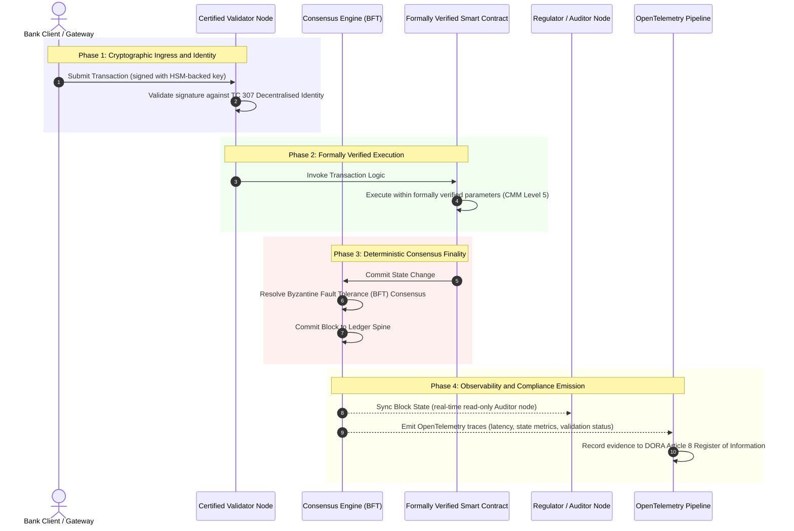

# De la evidencia a la verdad: por qué las cadenas de bloques certificadas definirán la próxima era de la confianza bancaria

**Inmutable no es lo mismo que fiable.** A medida que la banca mayorista avanza hacia la liquidación en tiempo real y la IA probabilística, el libro mayor que decide qué es verdad se ha convertido en la única capa que los bancos todavía no pueden certificar. Certifican la entidad conforme a Basel III, la nube conforme a ISO 27001 y su IA conforme a ISO 42001, pero el libro mayor distribuido, su gobernanza, consenso, criptografía y contratos inteligentes, queda a merced de suposiciones específicas de cada proveedor. Este informe sostiene que cerrar esa brecha fiduciaria exige pasar de la orientación de ISO/IEC TC 307 a un aseguramiento prescriptivo: puntuar el libro mayor frente a un Índice de Cadena de Bloques Certificada de 5 niveles que convierte las métricas de ingeniería en una verdad auditable por el consejo y defendible ante DORA.

<!-- lead-start -->
<aside class="post-lead" aria-label="Resumen del artículo">

<strong>En resumen.</strong> Los bancos certifican la entidad, la nube y su IA, pero no el libro mayor que cada vez más determina qué es verdad. ISO/IEC TC 307 aporta orientación, no aseguramiento. Un Índice de Cadena de Bloques Certificada de 5 niveles puntúa la gobernanza del libro mayor, la integridad del consenso, la identidad y la criptografía, el aseguramiento de contratos inteligentes y la observabilidad frente a un modelo de madurez de capacidades, cerrando la brecha fiduciaria y dotando a la IA probabilística de una columna vertebral de auditoría determinista.

<strong>Conclusiones clave</strong>

<ul class="post-lead-takeaways">
  <li><strong>La brecha fiduciaria de fricción.</strong> El banco (Basel III), la nube (ISO 27001) y el sistema de gobernanza de IA (ISO 42001) pueden certificarse; el libro mayor distribuido que decide qué es verdad todavía no. Esa asimetría es una vulnerabilidad operativa real.</li>
  <li><strong>DORA lo hace personal.</strong> Conforme al DORA Artículo 5, los consejos de administración de los bancos asumen una responsabilidad directa e indelegable por la resiliencia de los despliegues de terceros y de libros mayores, con sanciones personales bajo SM&amp;CR en caso de fallo.</li>
  <li><strong>La columna vertebral de auditoría de la IA.</strong> El aprendizaje automático no es reproducible; una cadena de bloques certificada registra de forma determinista, en cadena, las versiones de los modelos, las entradas y las decisiones de validación, satisfaciendo ISO 42001 y las normas de gestión del riesgo de modelos.</li>
  <li><strong>El Índice de Cadena de Bloques Certificada.</strong> La gobernanza, el consenso, la criptografía, los contratos inteligentes y la observabilidad se convierten en un cuadro de mando CMM de 0 a 5 que traduce las métricas de ingeniería en Declaraciones de Apetito de Riesgo aprobadas por el consejo.</li>
</ul>

<strong>Lecturas relacionadas:</strong> <a href="https://sebastienrousseau.com/2026-07-02-certified-blockchains-banking-trust-tc307-assurance-2026">Cadenas de bloques certificadas y confianza bancaria: el aseguramiento de TC 307</a>, <a href="https://sebastienrousseau.com/2026-07-24-global-payments-outlook-operating-model-risk-revenue">Perspectivas de los pagos globales para 2026</a>.

</aside>
<!-- lead-end -->

> **Resumen ejecutivo**
>
> - **La banca mayorista se encuentra en un punto de inflexión.** La compensación en tiempo real y la IA probabilística rompen el modelo de aseguramiento analógico y retrospectivo: las auditorías estáticas, basadas en la entidad, ya no satisfacen las exigencias modernas de gestión del riesgo ni las fiduciarias.
> - **TC 307 es una línea de base, no un certificado.** ISO/IEC TC 307 ha normalizado el vocabulario, la arquitectura de referencia y la orientación de seguridad para los libros mayores distribuidos, pero es descriptivo. Define cómo es lo correcto; no aporta la verificación prescriptiva que los responsables de riesgo y los supervisores necesitan para autorizar el despliegue en producción.
> - **El aseguramiento significa puntuar el libro mayor.** La gobernanza, la integridad del consenso, la seguridad de los contratos inteligentes y la agilidad criptográfica, puntuadas frente a un estricto modelo de madurez de capacidades de 5 niveles, llevan a los bancos de la suposición fragmentada y específica de cada proveedor a una verdad financiera certificable y auditable por el consejo.
> - **El libro mayor es la columna vertebral de auditoría de la IA.** Anclar las versiones de los modelos, las entradas y las decisiones de validación a un consenso determinista dota al aprendizaje automático no reproducible de un registro probatorio defendible y reconstruible conforme a ISO 42001, SR 11-7 y PRA SS1/23.

## La brecha fiduciaria de fricción en la banca digital

En la banca clásica, la confianza es relacional, institucional y retrospectiva. Depende de auditores independientes y externos que revisan el estado financiero en puntos temporales estáticos, conciliando discrepancias entre silos bilaterales de libros mayores. En los mercados en tiempo real e impulsados por API de 2026, este modelo introduce latencias prohibitivas y riesgos estructurales.

Cuando las transacciones se liquidan de forma instantánea, las reservas de liquidez intradía se gestionan dinámicamente mediante pasarelas de API y la propiedad de los activos se tokeniza en libros mayores compartidos, las auditorías retrospectivas se convierten en ejercicios forenses en lugar de controles preventivos. Los fiduciarios ya no pueden basarse únicamente en certificar la entidad corporativa. Deben certificar el propio sustrato digital.

En la actualidad, los bancos operan bajo una asimetría arquitectónica flagrante:

1. **Infraestructura de nube certificada**: Los nodos de hardware, los contenedores virtualizados y los centros de datos físicos se validan frente a los controles de ISO/IEC 27001 y SOC 2 Type II.  
2. **Procesos de gestión certificados**: Las políticas de riesgo operativo, los planes de continuidad de negocio y los despliegues algorítmicos se gobiernan bajo marcos de riesgo estrictos.  
3. **Motores de libro mayor no certificados**: Los mecanismos centrales de consenso distribuido, las cadenas de suministro de nodos validadores, los límites de los contratos inteligentes y los modelos de gobernanza de la red quedan a merced de suposiciones no certificadas, personalizadas o específicas de cada consorcio.

Esta asimetría es un punto de fallo importante. Un banco puede ejecutar una aplicación validada dentro de un contenedor de nube seguro y certificado conforme a ISO 27001, pero si ese contenedor escribe en un libro mayor distribuido con control validador centralizado, parámetros de consenso vulnerables o contratos inteligentes sin auditar, la integridad de la transacción queda comprometida. Para salvar esta brecha, el propio motor del libro mayor debe convertirse en un objeto de aseguramiento certificable.

## La línea de base de normalización de ISO/IEC TC 307

El trabajo fundacional necesario para normalizar los libros mayores distribuidos lo está estableciendo el Comité Técnico 307 de ISO/IEC (TC 307\) (Blockchain y tecnologías de libro mayor distribuido). En lugar de tratar la cadena de bloques como un protocolo técnico aislado, TC 307 la aborda como una infraestructura de confianza institucional, organizando su trabajo en torno a cinco pilares centrales:

1. **Taxonomía y vocabulario (ISO 22739\)**: Establece una nomenclatura común, garantizando definiciones legales y operativas coherentes entre distintas jurisdicciones, esquemas financieros e instituciones.  
2. **Arquitectura de referencia (ISO/TR 23245\)**: Define los límites, capas, flujos de datos y componentes funcionales de un sistema de libro mayor distribuido conforme.  
3. **Seguridad, privacidad y contratos inteligentes (ISO/TR 23244 / ISO 23613\)**: Establece directrices de seguridad de base para los sistemas de activos digitales y detalla las mejores prácticas para la mitigación de vulnerabilidades y la gobernanza del ciclo de vida de los contratos inteligentes.  
4. **Marcos de interoperabilidad**: Aborda los mecanismos de intercambio de datos y activos entre redes de libros mayores heterogéneas, evitando la formación de silos tokenizados aislados.  
5. **Identidad descentralizada y anclas de confianza**: Integra los identificadores criptográficos basados en el libro mayor con infraestructuras formales de clave pública (PKI) y registros autorizados por el Estado.

En conjunto, TC 307 señala la transición de la DLT de una opción de ingeniería personalizada a una disciplina arquitectónica normalizada. Sin embargo, TC 307 sigue siendo fundamentalmente descriptivo. Define cómo es lo correcto (orientación), pero no aporta el protocolo de verificación prescriptivo (aseguramiento) que los responsables de riesgo y los supervisores requieren para autorizar despliegues en producción de funciones críticas o importantes (CIFs).

## Orientación frente a aseguramiento: la distinción fiduciaria

Los participantes en los mercados financieros no despliegan una tecnología porque sea innovadora o elegante; la despliegan cuando puede gobernarse, auditarse, defenderse y conciliarse con los requisitos de reservas de capital. Por eso la normalización en la banca se resuelve de forma natural en dos capas:

* **Orientación (el marco)**: Esboza las mejores prácticas, los objetivos de referencia y las directrices arquitectónicas (por ejemplo, ISO/IEC TC 307, los marcos del NIST).  
* **Aseguramiento (la prueba)**: Aporta evidencia independiente, continua y verificable por terceros de que el marco está implementado y opera según su diseño (por ejemplo, la certificación ISO 27001, las auditorías SOC 2, los exámenes regulatorios).

Basarse en un consenso de libro mayor no certificado mientras se certifica la infraestructura de nube es una brecha regulatoria crítica. Una cadena de bloques que es "inmutable" no es necesariamente "institucionalmente fiable". La inmutabilidad solo garantiza que los datos introducidos permanecen inalterados; no verifica que los nodos validadores sean seguros, que el protocolo de consenso sea resistente a la colusión, que la lógica de los contratos inteligentes sea matemáticamente sólida o que la gestión de claves criptográficas cumpla los mandatos poscuánticos.

Para cerrar esta brecha, el Índice de Cadena de Bloques Certificada de 2026 formaliza estos requisitos en un modelo de madurez de capacidades (CMM) cuantificable, mapeado a las regulaciones bancarias globales.

## El Índice de Cadena de Bloques Certificada de 2026

Para que la alta dirección pueda evaluar y certificar sus plataformas de libro mayor, este índice estructura la infraestructura del libro mayor distribuido en cinco capas operativas auditables, puntuadas en una escala CMM de 0 a 5.

### Tabla 1: La arquitectura del Índice de Cadena de Bloques Certificada

| Capa del índice | Nivel de madurez de capacidades (CMM) | Métrica técnica y operativa | Referencia de control regulatorio / fiduciario |
| ---- | ---- | ---- | ---- |
| **Gobernanza del libro mayor** | **Nivel 0**: Consorcio ad hoc**Nivel 3**: Verificación y rotación automatizadas de validadores**Nivel 5**: Anclaje de identidad criptográfica descentralizado y multiparte | % de nodos validadores operados por entidades financieras verificadas; tiempo medio de resolución de disputas entre validadores; distribución geográfica de los nodos | **DORA Artículo 5** (Gobernanza y organización); **CPMI-IOSCO PFMI Principio 2** (Gobernanza) y **Principio 3** (Marco para la gestión integral de riesgos) |
| **Integridad del consenso** | **Nivel 0**: Nodo único o POW opaco**Nivel 3**: BFT auditado con firmeza determinista**Nivel 5**: Consenso multijurisdiccional, verificado formalmente, con supervisión continua de la latencia | Latencia de consenso máxima tolerable; umbral de resistencia a la colusión; SLA de disponibilidad ante partición simulada de nodos | **DORA Artículo 6** (Marco de gestión del riesgo de TIC); **CPMI-IOSCO PFMI Principio 8** (Firmeza de la liquidación) |
| **Identidad y criptografía** | **Nivel 0**: Claves RSA / ECDSA débiles**Nivel 3**: Multifirma con gestión de claves respaldada por HSM**Nivel 5**: Claves híbridas resistentes a la computación cuántica (FIPS 203 ML-KEM) y puertas de privacidad de conocimiento cero | % de transacciones del libro mayor firmadas con claves respaldadas por HSM; puntuación de preparación para la migración a PQC; latencia de las pruebas ZK | **NIST FIPS 203 / 204**; **ISO/IEC 27001** (Gestión de la seguridad de la información) |
| **Aseguramiento de contratos inteligentes** | **Nivel 0**: Scripts de solidity sin auditar**Nivel 3**: Validación automatizada del compilador y auditoría externa**Nivel 5**: Contratos inteligentes verificados formalmente e inmutables con actualizaciones de tipo interruptor de circuito | % de contratos inteligentes con verificación formal matemática; número de advertencias del compilador; cobertura del análisis de vulnerabilidades | **Directrices de la EBA sobre acuerdos de externalización** (Apartados 81, 113-117); **DORA Artículo 30** (Cláusulas contractuales mínimas) |
| **Auditoría y observabilidad** | **Nivel 0**: Extracción manual de registros**Nivel 3**: Trazas OTel estructuradas y nodos auditores de solo lectura**Nivel 5**: Conciliación automatizada y continua con el registro del Artículo 8 | % de transacciones cubiertas por trazas de OpenTelemetry; latencia desde la confirmación del bloque del libro mayor hasta la sincronización del nodo auditor | **BCBS 239** (Agregación de datos de riesgo); **DORA Artículo 8** (Registro de información / esquemas ITS) |

### Tabla 2: Señales de confianza clave mapeadas a las normas bancarias globales

| Señal / referencia | Métrica | Impacto en las plataformas bancarias | Fuente regulatoria |
| ---- | ---- | ---- | ---- |
| **Progreso de ISO/IEC TC 307** | Transición de los informes técnicos ISO/TR a esquemas formales de certificación | Establece el primer marco normalizado para certificar motores de libro mayor distribuido | **ISO/IEC JTC 1 / SC 44** (Tecnologías de libro mayor distribuido) |
| **Fase de prototipo del Proyecto Agorá** | Más de 40 bancos comerciales participantes; pruebas de libro mayor unificado con depósitos tokenizados | Traslado de la compensación transfronteriza de la mensajería (SWIFT) a la liquidación tokenizada atómica | **Centro de Innovación del Banco de Pagos Internacionales (BIS)** |
| **Auditoría de terceros del DORA Artículo 30** | El 100% de los proveedores de nodos y anfitriones de infraestructura auditados frente a criterios de seguridad | Elimina los "nodos validadores en la sombra"; obliga a una transparencia total de la cadena de suministro | **Autoridades Europeas de Supervisión (ESA)** |
| **ISO/IEC 42001 (Gobernanza de IA)** | Modelos de IA y registros de entrenamiento inmutabilizados criptográficamente en cadena | Emplea la cadena de bloques como el libro mayor probatorio inmutable ("columna vertebral de auditoría") para el aprendizaje automático | **ISO/IEC 42001:2023** (Tecnología de la información, inteligencia artificial) |
| **Suficiencia de capital de Basel III** | Reducción de los colchones de capital por riesgo operativo con base en la reducción documentada de la complejidad | Los marcos normalizados de riesgo operativo acreditan directamente la resiliencia verificada del libro mayor | **Comité de Supervisión Bancaria de Basilea (BCBS)** |

## La "columna vertebral de auditoría" de la IA: inteligencia probabilística sobre infraestructura determinista

Uno de los papeles estratégicos más potentes de una cadena de bloques certificada en 2026 es actuar como **"columna vertebral de auditoría"** para los despliegues de inteligencia artificial. Los sistemas financieros modernos son cada vez más probabilísticos. La calificación crediticia, la detección de fraude en tiempo real, la negociación algorítmica y las interacciones autónomas con clientes están impulsadas por modelos de aprendizaje automático que evolucionan, derivan y se adaptan con el tiempo. Estos modelos no son deterministas: ante la misma entrada en dos momentos distintos, pueden producir salidas diferentes debido a pesos dinámicos y a un entrenamiento continuo.

Este carácter no determinista introduce un profundo reto de gobernanza conforme a las normas de **ISO/IEC 42001 (Gobernanza de IA)** y de **gestión del riesgo de modelos (MRM)** (como **SR 11-7 de la Reserva Federal de EE. UU.** y **SS1/23 de la PRA del Reino Unido**): *¿cómo se auditan, explican y defienden decisiones que no son estrictamente reproducibles?*

Un libro mayor distribuido certificado aporta el contrapeso determinista. Mientras los modelos de IA operan de forma probabilística, la cadena de bloques certificada registra sus parámetros de forma determinista, estableciendo una columna vertebral probatoria inalterable:

* **Versionado de modelos y anclaje de pesos**: Cada versión de modelo desplegada, sus pesos asociados y las sumas de verificación de sus datos de entrenamiento se resumen (hash) y se escriben en el libro mayor en tiempo de compilación, satisfaciendo los requisitos de cadena de suministro de **SLSA Nivel 3**.  
* **Registro contextual de entradas**: Cuando un modelo de IA ejecuta una decisión crítica (por ejemplo, aprobar un préstamo o marcar una transacción), las entradas contextuales exactas y los hashes del modelo se escriben en el libro mayor, creando un historial a prueba de manipulaciones.  
* **Auditabilidad sin acceso al código**: Si un regulador pregunta: "¿Por qué rechazó su modelo esta solicitud de crédito el 3 de junio?", el banco no necesita exponer código propietario ni intentar recrear el estado exacto del modelo. Presenta el registro en cadena, firmado criptográficamente, de las entradas, los pesos y el estado de validación.

Al anclar las decisiones probabilísticas de los modelos de aprendizaje automático al consenso determinista de una cadena de bloques certificada, la institución crea una cronología de las acciones automatizadas defendible, reconstruible y verificable de forma independiente.

## Visualización de la canalización certificada de consenso a auditoría

El siguiente diagrama de secuencia ilustra el ciclo de vida de una transacción que atraviesa una plataforma de cadena de bloques certificada, mostrando cómo las puertas de validación, la integridad del consenso, la ejecución de contratos inteligentes y la emisión de telemetría se entrelazan para producir evidencia regulatoria lista para el consejo:

La ruta crítica de esta secuencia transaccional exige que cada paso de validación, ejecución y consenso esté firmado criptográficamente, garantizando la procedencia de extremo a extremo. El nodo auditor del regulador sincroniza el estado de los bloques en tiempo real, eliminando la necesidad de una conciliación financiera manual y retrospectiva.

## El manual de sala de juntas para altos directivos

Para gestionar con éxito el paso de la confianza organizativa a la confianza infraestructural, los ejecutivos y altos directivos de los bancos deben ejecutar de inmediato cuatro directivas clave:

1. **Exigir auditorías del libro mayor en la gestión de riesgos empresariales (ERM)**: Imponer una política según la cual ninguna plataforma de libro mayor distribuido, ya sea privada, pública o de consorcio, pueda desplegarse para funciones críticas o importantes (CIFs) a menos que haya sido auditada frente a la **arquitectura del Índice de Cadena de Bloques Certificada** de 5 capas (CMM Nivel 3 como mínimo).  
2. **Integrar las cadenas de bloques como la columna vertebral probatoria de IA de ISO 42001**: Encargar al director de riesgos y al arquitecto principal de IA que integren todos los modelos de aprendizaje automático de alto impacto con una cadena de bloques certificada, creando un libro mayor de auditoría a prueba de manipulaciones de las versiones de los modelos, los pesos, las entradas y las decisiones.  
3. **Auditar la cadena de suministro de nodos validadores (DORA Artículo 30\)**: Exigir a la división de compras que audite a todas las entidades externas que alojan nodos validadores o gestionan el alojamiento en la nube para redes de DLT, obligando al cumplimiento de las mismas normas de ciberseguridad y resiliencia operativa aplicadas a los nodos de nube internos del banco.  
4. **Alinear las arquitecturas del libro mayor con CPMI-IOSCO y BCBS 239**: Instruir al equipo de ingeniería de plataformas para que alinee la telemetría de salida del libro mayor directamente con los requisitos de notificación de datos de **BCBS 239**, y asegurar que los parámetros de consenso y firmeza de la liquidación cumplan estrictamente los **Principios 8 y 9 de CPMI-IOSCO**.

## Preguntas frecuentes

**¿Es ISO/IEC TC 307 una norma de certificación?**  
No. ISO/IEC TC 307 es un comité técnico que establece vocabulario, arquitecturas de referencia y directrices de seguridad. Aunque define "cómo es lo correcto" (orientación), la industria debe operativizar estos documentos en esquemas de certificación formales y auditables (aseguramiento) para satisfacer a los supervisores bancarios.

**¿Cómo respalda una cadena de bloques certificada el cumplimiento de DORA?**  
Conforme al DORA Artículo 5, los consejos de administración de los bancos asumen una responsabilidad directa y personal por la resiliencia tecnológica. Una cadena de bloques certificada aporta evidencia criptográfica y verificable de la integridad del consenso, el control de la cadena de suministro de validadores y la seguridad de los contratos inteligentes, dando a los miembros del consejo las "medidas razonables" documentables necesarias para defenderse frente a reclamaciones de responsabilidad personal bajo SM\&CR.

**¿Cuál es la diferencia entre una auditoría de libro mayor tradicional y una auditoría de cadena de bloques certificada?**  
Una auditoría tradicional es retrospectiva y verifica asientos manuales y archivos estáticos después de que las transacciones se han compensado. Una auditoría de cadena de bloques certificada es continua y en tiempo real; los nodos validadores, el motor de consenso BFT y los contratos inteligentes verificados formalmente están certificados para ejecutar transacciones de forma determinista, emitiendo telemetría estructurada (OpenTelemetry) que valida de forma continua la salud del sistema.

**¿Pueden certificarse las cadenas de bloques públicas para uso bancario?**  
En la mayoría de las jurisdicciones, las cadenas de bloques públicas sin permisos puras no satisfacen las regulaciones bancarias debido a la falta de verificación de identidad de los validadores, a unos costes de gas/transacción impredecibles y a una firmeza no determinista (por ejemplo, bifurcaciones probabilísticas de prueba de trabajo/participación). Las cadenas de bloques certificadas en la banca suelen emplear arquitecturas empresariales con permisos o híbridas públicas altamente reguladas, en las que los operadores de nodos validadores son entidades financieras identificadas y auditadas.

## Referencias

* Comité de Supervisión Bancaria de Basilea (BCBS), 2013\. *Principles for effective risk data aggregation and reporting (BCBS 239\)*. Basilea: Banco de Pagos Internacionales. Disponible en: [Comité de Supervisión Bancaria de Basilea (BCBS), 2013\.](https://www.bis.org/publ/bcbs239.pdf "Comité de Supervisión Bancaria de Basilea (BCBS), 2013\.").  
* Comité de Pagos e Infraestructuras de Mercado y Comité Técnico de la Organización Internacional de Comisiones de Valores (CPMI-IOSCO), 2012\. *Principles for financial market infrastructures*. Basilea: Banco de Pagos Internacionales. Disponible en: [Comité de Pagos e Infraestructuras de Mercado y Comité Técnico de la Organización Internacional de Comisiones de Valores (CPMI-IOSCO), 2012\.](https://www.bis.org/cpmi/publ/d101a.pdf "Comité de Pagos e Infraestructuras de Mercado y Comité Técnico de la Organización Internacional de Comisiones de Valores (CPMI-IOSCO), 2012\.").  
* Autoridad Bancaria Europea (EBA), 2019\. *EBA/GL/2019/02, Guidelines on outsourcing arrangements*. París: EBA. Disponible en: [Autoridad Bancaria Europea (EBA), 2019\.](https://www.eba.europa.eu/regulation-and-policy/internal-governance/guidelines-on-outsourcing-arrangements "Autoridad Bancaria Europea (EBA), 2019\.").  
* Parlamento Europeo y Consejo de la Unión Europea, 2022\. *Reglamento (UE) 2022/2554 sobre la resiliencia operativa digital del sector financiero (DORA)*. Bruselas: Diario Oficial de la Unión Europea. Disponible en: [Parlamento Europeo y Consejo de la Unión Europea, 2022\.](https://eur-lex.europa.eu/legal-content/EN/TXT/?uri=CELEX%3A32022R2554 "Parlamento Europeo y Consejo de la Unión Europea, 2022\.").  
* ISO/IEC JTC 1/SC 42, 2023\. *ISO/IEC 42001:2023, Information technology, Artificial intelligence, Management system*. Ginebra: Organización Internacional de Normalización. Disponible en: [ISO/IEC JTC 1/SC 42, 2023\.](https://www.iso.org/standard/81230.html "ISO/IEC JTC 1/SC 42, 2023\.").  
* Comité Técnico 307 de ISO/IEC, 2020\. *ISO/IEC 22739:2020, Blockchain and distributed ledger technologies, Vocabulary*. Ginebra: Organización Internacional de Normalización. Disponible en: [Comité Técnico 307 de ISO/IEC, 2020\.](https://www.iso.org/standard/73771.html "Comité Técnico 307 de ISO/IEC, 2020\.").  
* Instituto Nacional de Normas y Tecnología (NIST), 2026\. *First Three Finalised Post-Quantum Encryption Standards (FIPS 203, 204, and 205\)*. Gaithersburg: Departamento de Comercio de EE. UU. Disponible en: [Instituto Nacional de Normas y Tecnología (NIST), 2026\.](https://www.nist.gov/news-events/news/2024/08/nist-releases-first-3-finalised-post-quantum-encryption-standards "Instituto Nacional de Normas y Tecnología (NIST), 2026\.").

