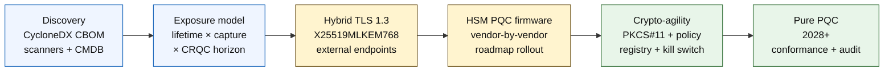

## شاخص بانکداری کوانتوم‌ایمن در سال ۲۰۲۶: رمزنگاری پساکوانتومی، QKD، چابکی رمزنگاری و ریسک «اکنون برداشت کن، بعداً رمزگشایی کن»

بانکداری کوانتوم‌ایمن در سال ۲۰۲۶ درباره مهاجرت عملیاتی است، نه گمانه‌زنی. NIST سه استاندارد نخست رمزنگاری پساکوانتومی را نهایی کرده است، و بانک‌ها اکنون باید بفهمند کدام سیستم‌ها به RSA، ECC، TLS، امضاها، HSMها، گواهی‌ها، کانال‌های پرداخت، آرشیوها و داده‌های محرمانه بلندعمر وابسته‌اند. پرسش شاخص ساده است: آیا مؤسسه می‌تواند رمزنگاری را پیش از عملیاتی شدن تهدید جایگزین کند؟

---

> **خلاصه اجرایی / نکات کلیدی**
>
> - **استانداردهای NIST اکنون ملموس هستند.** FIPS 203 استاندارد ML-KEM را برای کپسوله‌سازی کلید تعریف می‌کند، FIPS 204 استاندارد ML-DSA را برای امضاها تعریف می‌کند، و FIPS 205 استاندارد SLH-DSA را به‌عنوان یک استاندارد امضای مبتنی بر درهم‌سازی بدون‌حالت تعریف می‌کند.
> - **فهرست‌برداری نخستین دروازه بلوغ است.** یک بانک نمی‌تواند چیزی را که پیدا نمی‌کند مهاجرت دهد: گواهی‌ها، کلیدها، پروتکل‌ها، برنامه‌ها، فروشندگان، HSMها، APIها، آرشیوها و سیستم‌های تعبیه‌شده باید نگاشت شوند.
> - **چابکی رمزنگاری هدف ماندگار است.** هدف یک تعویض یک‌باره الگوریتم نیست؛ توانایی تغییر عناصر بنیادین رمزنگاری بدون بازطراحی کل برنامه‌ها است.
> - **داده‌های بلندعمر فوریت را تغییر می‌دهند.** ریسک «اکنون برداشت کن، بعداً رمزگشایی کن» به این معناست که داده‌های ضبط‌شده امروز ممکن است بعداً قابل خواندن شوند اگر به‌اندازه کافی طولانی ارزشمند بمانند.
> - **[QKD](/2023-12-11-quantum-key-distribution-revolutionising-security-in-banking/index.html) یک مکمل تخصصی است.** توزیع کلید کوانتومی ممکن است برای پرارزش‌ترین کانال‌ها مرتبط باشد، اما جایگزین مهاجرت PQC در سطح کل مؤسسه نمی‌شود.
>
---

## چرا ۲۰۲۶ سالی است که این شاخص اهمیت دارد

سه تغییر در سال‌های ۲۰۲۴–۲۰۲۵ کوانتوم‌ایمنی را از یک نقطه‌ی رصدِ پژوهشی به یک برنامه‌ی قابل‌سنجش بانکی بدل کرد. نخست، NIST استانداردهای اصلی پساکوانتومی را در ۱۳ اوت ۲۰۲۴ نهایی کرد: [FIPS 203 (ML-KEM) ⧉](https://nvlpubs.nist.gov/nistpubs/FIPS/NIST.FIPS.203.pdf "FIPS 203 — سازوکار کپسوله‌سازی کلید مبتنی بر شبکه‌ی مدولی")، [FIPS 204 (ML-DSA) ⧉](https://nvlpubs.nist.gov/nistpubs/FIPS/NIST.FIPS.204.pdf "FIPS 204 — استاندارد امضای دیجیتال مبتنی بر شبکه‌ی مدولی")، [FIPS 205 (SLH-DSA) ⧉](https://nvlpubs.nist.gov/nistpubs/FIPS/NIST.FIPS.205.pdf "FIPS 205 — استاندارد امضای دیجیتال بدون‌حالت مبتنی بر درهم‌سازی"). بحث انتخاب الگوریتم در آن تاریخ بسته شد؛ بانک‌هایی که هنوز در سال ۲۰۲۶ جریان‌های کاری داخلی «کدام طرح برنده می‌شود» را اجرا می‌کنند، ۱۸ ماه عقب افتاده‌اند.

دوم، [CNSA 2.0 آژانس امنیت ملی (NSA) ⧉](https://media.defense.gov/2022/Sep/07/2003071834/-1/-1/0/CSA_CNSA_2.0_ALGORITHMS_.PDF "مجموعه الگوریتم‌های امنیت ملی تجاری ۲.۰") وضعیت نهایی فدرال ایالات متحده را در سال ۲۰۳۳ با مهلت‌های میانی تعیین کرد که از سال ۲۰۲۷ برای امضای نرم‌افزار و میان‌افزار و ۲۰۳۰ برای مرورگرها و سیستم‌عامل‌ها آغاز می‌شود. هر بانکی با افشای طرف‌مقابل فدرال ایالات متحده — FedNow، عملیات خزانه‌داری، حساب‌های مشتریان فدرال — برای سیستم‌هایی که با داده‌های فدرال سروکار دارند درون آن محیط قرار می‌گیرد. ساعت دیگر انتزاعی نیست.

سوم، [«اکنون برداشت کن، بعداً رمزگشایی کن» (HNDL) ⧉](https://csrc.nist.gov/Projects/post-quantum-cryptography "برنامه رمزنگاری پساکوانتومی NIST") استدلال ریسکِ باربَرِ فوریت است. دشمنان پیچیده هم‌اکنون در حال ضبط پیام‌های پرداختِ محافظت‌شده با TLS، پاکت‌های SWIFT، مستندات KYC و متن‌رمزِ آرشیوهای بلندعمر در مراکز مالی بزرگ هستند. داده‌ای که در سال ۲۰۲۶ ضبط می‌شود فقط باید در لحظه‌ی رمزگشایی از نظر محرمانگی حساس بماند — برای وام‌های مسکن ۳۰ ساله، پذیره‌نویسی بیمه عمر، ضبط‌های تراکنشی MiFID II / GDPR و آرشیوهای نگهداری ادغام و تملیک، آن بازه به‌خوبی فراتر از هر برآورد معقول برای یک رایانه کوانتومی مرتبط از نظر رمزنگاری (CRQC) کشیده می‌شود. دشمن امروز به یک رایانه کوانتومی نیاز ندارد. او به یکی نیاز دارد پیش از آنکه داده از اهمیت بیفتد.

شاخص بانکداری کوانتوم‌ایمن می‌سنجد که آیا مؤسسه شما می‌تواند مهاجرت را پیش از فرارسیدن آن تقاطع تحویل دهد. کار دیگر درباره‌ی اینکه آیا مهاجرت کنیم یا نه نیست؛ درباره‌ی این است که آیا مهاجرت در یک بازه‌ی زمانیِ قابل‌دفاع کامل می‌شود.

## معماری شاخص ۲۰۲۶

| لایه شاخص | جهت‌گیری ۲۰۲۶ | معیار آمادگی | ریسک در صورت مدیریت نادرست |
|---|---|---|---|
| **فهرست‌برداری** | نگاشت دارایی‌های رمزنگاری، پروتکل‌ها، گواهی‌ها، فروشندگان و طبقات داده | درصد دارایی‌های فهرست‌شده | وابستگی‌های ناشناخته‌ی آسیب‌پذیر در برابر کوانتوم |
| **افشا** | طبقه‌بندی سیستم‌ها بر اساس طول عمر محرمانگی و اهمیت تراکنش | دارایی‌های پرریسک بر حسب ارزش و طول عمر | اولویت‌بندی نادرست مهاجرت |
| **مهاجرت** | اتخاذ الگوهای ترکیبی و آماده‌ی PQC هم‌راستا با استانداردهای NIST | آمادگی ML-KEM و ML-DSA | بازسازی اضطراری بستر زیر فشار مهلت |
| **چابکی رمزنگاری** | جداسازی منطق برنامه از عناصر بنیادین رمزنگاری | پوشش رمزنگاریِ کنترل‌شده با خط‌مشی | الگوریتم‌های سخت‌کدشده در سراسر دارایی‌ها |
| **اطمینان‌بخشی** | آزمون قابلیت هم‌کنش‌پذیری، کارایی، پشتیبانی HSM، گواهی‌ها و آمادگی فروشنده | نرخ قبولی آزمون و انباشت استثناها | کانال‌های شکسته یا کنترل‌های بازگشتی ضعیف |

### کارت امتیازی کوانتومی سطح هیئت‌مدیره

یک کارت امتیازی معتبر برای آمادگی کوانتومی نیازمند ردیابی درصدهای دقیق است، نه صرفاً وضعیت‌های پروژه:

1. **کامل بودن فهرست:** درصد برنامه‌های رده‌یک با یک فهرست اقلام رمزنگاری (CBOM) کاملاً نگاشت‌شده.
2. **افشای HNDL:** حجم داده‌های محرمانه‌ی بلندعمر (مانند PII، اسرار تجاری) که بدون کپسوله‌سازی کلید ترکیبی کوانتوم‌ایمن روی شبکه‌ها منتقل می‌شود.
3. **پیشرفت مهاجرت NIST:** درصد کلیدهای رمزنگاری نامتقارن و امضاهای دیجیتال که به استانداردهای FIPS 203 (ML-KEM) و FIPS 204 (ML-DSA) مهاجرت داده شده‌اند.
4. **آمادگی چابکی رمزنگاری:** درصد سیستم‌های حیاتی که در آن‌ها الگوریتم‌های رمزنگاری را می‌توان از طریق خط‌مشی متمرکز و بدون نیاز به کامپایل مجدد کد چرخاند.

## سیگنال‌های کنونی برای ردیابی

| سیگنال | معنای آن برای بانک‌ها | منبع |
|---|---|---|
| **FIPS 203 ML-KEM** | استاندارد اصلی NIST برای برقراری کلید رمزنگاری عمومی | [NIST ⧉](https://www.nist.gov/news-events/news/2024/08/nist-releases-first-3-finalized-post-quantum-encryption-standards "سه استاندارد نهایی نخست رمزنگاری پساکوانتومی") |
| **FIPS 204 ML-DSA** | استاندارد اصلی NIST برای امضاهای دیجیتال | [NIST ⧉](https://www.nist.gov/news-events/news/2024/08/nist-releases-first-3-finalized-post-quantum-encryption-standards "سه استاندارد نهایی نخست رمزنگاری پساکوانتومی") |
| **FIPS 205 SLH-DSA** | جایگزین امضای مبتنی بر درهم‌سازی و طرح پشتیبان | [NIST ⧉](https://www.nist.gov/news-events/news/2024/08/nist-releases-first-3-finalized-post-quantum-encryption-standards "سه استاندارد نهایی نخست رمزنگاری پساکوانتومی") |
| **تشویق به یکپارچه‌سازی فوری** | NIST صراحتاً به مدیران می‌گوید که یکپارچه‌سازی استانداردها را آغاز کنند زیرا یکپارچه‌سازی کامل زمان‌بر است | [NIST ⧉](https://www.nist.gov/news-events/news/2024/08/nist-releases-first-3-finalized-post-quantum-encryption-standards "سه استاندارد نهایی نخست رمزنگاری پساکوانتومی") |
| **برنامه‌های کوانتومی بانک‌ها در حال گسترش‌اند** | بانک‌های بزرگ در حال کاوش فناوری‌های کوانتومی و در عین حال آماده‌سازی گذارهای PQC هستند | [Quantum Insider ⧉](https://thequantuminsider.com/2026/03/27/15-plus-global-banks-probing-the-wonderful-world-of-quantum-technologies/ "مروری بر بانک‌های جهانی در حال کاوش فناوری‌های کوانتومی") |

## مهاجرت با دفتر کلِ رمزنگاری آغاز می‌شود

توالی مهاجرت در این مرحله کاملاً شناخته‌شده است. هر دروازه شواهدی تولید می‌کند که دروازه‌ی بعدی را پیش می‌راند؛ رد کردن یا فشرده کردن یک دروازه همان چیزی است که ریسک بازسازی اضطراری بستر را ایجاد می‌کند که در ستون شکست معماری شاخص ظاهر می‌شود.

نخستین تحویل‌دادنی یک الگوریتم جدید نیست؛ یک فهرست اقلام رمزنگاری (CBOM) است. بانک‌ها به یک فهرست زنده نیاز دارند که سرویس‌های کسب‌وکار را به الگوریتم‌ها، کتابخانه‌ها، گواهی‌ها، طول کلیدها، HSMها، طول عمر داده‌ها، فروشندگان و مالکان عملیاتی متصل کند. بدون آن دفتر کل، مهاجرت کوانتوم‌ایمن به حدس‌زدن تبدیل می‌شود.

مجموعه‌رکوردهای CBOM باید برای هر عنصر بنیادین رمزنگاری موارد زیر را ثبت کند: پروتکل یا رابط (TLS 1.3، IPsec، SSH، قالب سفارشی پیام پرداخت)، الگوریتم و مجموعه‌پارامتر (RSA-2048، ECDH P-256، ML-KEM-768، ML-DSA-65)، کتابخانه و نسخه (OpenSSL 3.4، هش کامیت BoringSSL، بیلد SDK فروشنده)، مرز سخت‌افزاری (پارتیشن HSM، TPM، محفظه‌ی امن، یا هیچ)، هویت گواهی در صورت وجود، مالک برنامه، و طول عمر طبقه‌بندی داده. ابزارهایی که در سال‌های ۲۰۲۵–۲۰۲۶ به تولید می‌رسند — IBM Quantum Safe Inventory، مشخصات متن‌باز [CycloneDX CBOM ⧉](https://cyclonedx.org/capabilities/cbom/ "فهرست اقلام رمزنگاری CycloneDX)")، اسکنرهای سازمانی از CryptoNext / Sandbox / PQShield — با خطوط‌لوله‌ی CMDB موجود یکپارچه می‌شوند. هیچ‌کدام به‌تنهایی کامل نیستند؛ حتی با ابزار فروشنده و نیروی اختصاصی، انتظار یک چرخه‌ی ساخت CBOM دوازده تا هجده‌ماهه را داشته باشید.

معیاری که باید ردیابی شود تازگی است، نه پوشش. یک CBOM که دو ماه قدیمی است بدتر از نداشتن هیچ CBOM است، زیرا به تیم امنیت اطمینان کاذب درباره‌ی آنچه مهاجرت داده شده می‌دهد.

## نخست ترکیبی، همیشه چابک

بیشتر بانک‌ها همه‌چیز را یک‌باره تعویض نخواهند کرد. الگوی واقع‌بینانه استقرار ترکیبی است، جایی که سازوکارهای کلاسیک و پساکوانتومی با هم اجرا می‌شوند در حالی که فروشندگان، پروتکل‌ها، گواهی‌ها و ابزار عملیاتی به بلوغ می‌رسند. هدف بلندمدت چابکی رمزنگاری است: انتخاب‌های رمزنگاریِ کنترل‌شده با خط‌مشی که می‌توان بدون بازسازی برنامه‌ی کسب‌وکار تغییرشان داد.

[درج مؤلفه تعاملی: ماشین‌حساب ریسک «اکنون برداشت کن، بعداً رمزگشایی کن» (HNDL) — ابزاری مبتنی بر لغزنده که مدیران در آن طول عمر مفید داده را در برابر جدول زمانی برآوردی کوانتوم وارد می‌کنند تا بازه‌ی افشای خود را ببینند.]

> **بینش کلیدی:** اگر داده‌ی شما باید ۱۰ سال محرمانه بماند، و یک رایانه کوانتومی مرتبط از نظر رمزنگاری (CRQC) ۷ سال فاصله دارد، مهلت مهاجرت شما در ۷ سال آینده نیست — سه سال پیش بود.

در عمل این یعنی TLS 1.3 با اشتراک کلید ترکیبی `X25519MLKEM768` برای نقاط‌پایانی رو‌به‌بیرون (Chrome / Firefox / Cloudflare / Akamai همگی امروز از این پشتیبانی می‌کنند)، زنجیره‌های امضای کلاسیک تا زمانی که زیرساخت HSM و CA به آن برسند، و یک لایه‌ی انتزاع PKCS#11 که به رجیستری خط‌مشی اجازه می‌دهد الگوریتم‌ها را بدون کامپایل مجدد برنامه‌های کسب‌وکار بچرخاند. چابکی رمزنگاری همان چیزی است که تعیین می‌کند گذار الگوریتمی بعدی (چه‌زمانی، نه اگر) یک چرخش شش‌هفته‌ای است یا یک برنامه‌ی هفت‌ساله‌ی دیگر.

## جایگاه QKD

توزیع کلید کوانتومی در شاخص به‌عنوان یک گزینه‌ی کانالِ بسیار حساس جای می‌گیرد، به‌ویژه برای زیرساخت بازار مالی، اتصال بانک مرکزی و جریان‌های نهادیِ بی‌نهایت حساس. باید با آن به‌عنوان مکملی برای PQC رفتار شود، نه به‌عنوان بهانه‌ای برای به‌تعویق انداختن مهاجرت سازمانی.

## این برای هر نوع بانک چه معنایی دارد

### بانک‌های جهانیِ دارای اهمیت سیستمی

مسئله‌ی دشوار مقیاس است: ده‌ها هزار نقطه‌پایانی TLS، صدها پارتیشن HSM، ده‌ها مرجع گواهی داخلی، صدها برنامه‌ی کسب‌وکار با عناصر بنیادین رمزنگاری تعبیه‌شده، و SDKهای فروشنده‌ای که بانک نمی‌تواند تغییرشان دهد. سرمایه‌گذاری یک آزمایش پایلوت دیگر نیست؛ ابزار CBOM، لایه‌ی انتزاع PKCS#11 که در هر بیلد جدید سیم‌کشی شده، طرح تجمیع HSM که یک فروشنده را برای پیشتازی در میان‌افزار PQC انتخاب می‌کند و دنباله‌ای چندساله برای بقیه را می‌پذیرد، و رجیستری خط‌مشی که به سطح ماندگار چابکی رمزنگاری تبدیل می‌شود مدت‌ها پس از تکمیل مهاجرت FIPS 203 / 204 / 205 است.

### بانک‌های تراکنشی و شرکتی

دامنه‌ی مهاجرت باریک‌تر از رده‌ی G-SIB است اما افشای HNDL حاد است: پیام‌رسانی فرامرزی SWIFT، داده‌های پرداخت ساختاریافته حاملِ PII طرف‌مقابل شرکتی، بسترهای تبادل اسناد نگهدارنده‌ی مستندات تأمین مالی تجاری، و آرشیوهای گزارش‌دهیِ با نگهداری طولانی. TLS ترکیبی را روی هر نقطه‌پایانی روبه‌مشتری و PQC در حالت ذخیره‌شده را برای آرشیوهای نگهداری در اولویت قرار دهید. پاسخگویی فروشنده‌ی HSM را پیش برانید — تیم بستر بانکداری شرکتی اهرم تدارکاتی مستقیمی دارد که تیم فناوری عمده‌فروشی اغلب فاقد آن است.

### بانک‌های منطقه‌ای

پشته‌ی فروشنده‌ای را بخرید که هم‌اکنون عناصر بنیادین چابکی رمزنگاری را دارد. یک بستر بانکداری هسته‌ای را انتخاب کنید که فروشنده‌اش یک CBOM منتشر می‌کند و به جدول‌های زمانی پشتیبانی ML-KEM / ML-DSA متعهد است. تأیید کنید که نقشه‌راه HSM فروشنده با مهلت مهاجرت بانک هم‌راستا است. ظرفیت مهندسی لازم برای ساخت چابکی رمزنگاری از صفر چندساله است؛ فروشنده آن هزینه را در میان مشتریان بسیار می‌پردازد و بانک از منفعتش بهره می‌برد. کار تأیید — بررسی اینکه ادعاهای فروشنده از فرآیند MRM مؤسسه جان سالم به در می‌برند — دامنه‌ی داخلیِ مشروع است.

### فین‌تک‌ها، PSPها و ارائه‌دهندگان زیرساخت

پرسش رقابتی برای فروشندگانی که در سال ۲۰۲۶ به بانک‌ها می‌فروشند «آیا از PQC پشتیبانی می‌کنید» نیست. این است: «آیا می‌توانید یک CBOM از نوع CycloneDX برای بستر خود، یک ماتریس پشتیبانی فروشنده‌ی HSM، و یک SLA مکتوب چرخش الگوریتم تولید کنید.» فروشندگانی که با بله پاسخ می‌دهند دروازه‌های تدارکاتی رده‌یک را در سال‌های ۲۰۲۶–۲۰۲۷ خواهند گذراند. فروشندگانی که نمی‌توانند، چرخه‌ی تمدید را به رقیبی که می‌تواند خواهند باخت.

## نتیجه‌گیری

بانکداری کوانتوم‌ایمن در سال ۲۰۲۶ یک نقطه‌ی رصدِ پژوهشی نیست؛ یک برنامه‌ی تحویل است با مهلتی که در تقاطع دو منحنی تعیین می‌شود — طول عمر محرمانگی داده‌هایی که مؤسسه امروز در اختیار دارد، و افق ظهور یک رایانه کوانتومی مرتبط از نظر رمزنگاری. مؤسساتی که در سال ۲۰۳۰ نزد ناظران و طرف‌های‌مقابل معتبر به نظر می‌رسند همان‌هایی هستند که ساخت CBOM را در سال ۲۰۲۴ آغاز کردند، TLS ترکیبی را تا پایان ۲۰۲۶ روی هر نقطه‌پایانی بیرونی مستقر کردند، و چابکی رمزنگاری را از روز نخست در هر بیلد جدید مهندسی کردند. مؤسساتی که چنین نکردند خواهند فهمید که آیا بازه‌ی مهاجرت‌شان برای داده‌ای که دشمن‌شان امروز در حال برداشت آن است پیشاپیش بسته شده است یا نه.

مهاجرت را همان‌گونه بسنجید که هر برنامه‌ی عملیاتی را می‌سنجید: دامنه‌ی مشخص، توالی اولویت‌بندی‌شده، مهلت‌های متعهدشده، دفاتر ثبت استثنای صادقانه. هرچه سخت‌گیرانه‌تر به دارایی خودتان بنگرید، بازه‌ی مهاجرت کوچک‌تر به نظر می‌رسد.

## پرسش‌های پرتکرار

**یک بانک نخست باید از چه چیزی فهرست‌برداری کند؟**

با TLSِ در معرض بیرون، کانال‌های پرداخت، احراز هویت مشتری، اتصال‌پذیری بین‌بانکی، سرویس‌های پشتیبانی‌شده با HSM، آرشیوهای بلندمدت، و سیستم‌هایی که داده‌های محرمانه با طول عمر مفید طولانی را مدیریت می‌کنند آغاز کنید.

**آیا PQC فقط یک مسئله‌ی امنیت سایبری است؟**

نه. بر پرداخت‌ها، هویت، شواهد حقوقی، امضای تراکنش، اعتماد مشتری، نگهداری داده، مدیریت فروشنده و تاب‌آوری عملیاتی اثر می‌گذارد.

**چابکی رمزنگاری چه معنایی دارد؟**

چابکی رمزنگاری یعنی توانایی تغییر عناصر بنیادین رمزنگاری از طریق کنترل‌های خط‌مشی و بستر، به‌جای تغییرات سخت‌کدشده‌ی برنامه.

**آیا بانک‌ها باید منتظر استانداردهای بیشتری بمانند؟**

نه. NIST مدیران را تشویق کرده است که یکپارچه‌سازی نخستین استانداردهای نهایی را آغاز کنند زیرا یکپارچه‌سازی کامل زمان‌بر است.

## منابع

- NIST, (2026). [سه استاندارد نهایی نخست رمزنگاری پساکوانتومی ⧉](https://www.nist.gov/news-events/news/2024/08/nist-releases-first-3-finalized-post-quantum-encryption-standards "سه استاندارد نهایی نخست رمزنگاری پساکوانتومی").
