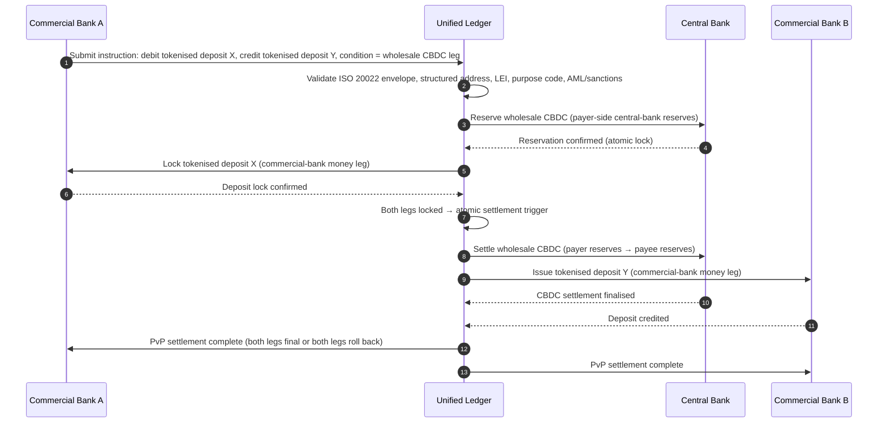

## شاخص پرداخت‌های عمده در سال 2026: ISO 20022، سپرده‌های توکنی، ریل‌های بلادرنگ و تسویه فرامرزی

پرداخت‌های عمده در سال 2026 در اثر دو تحول هم‌زمان بازآرایی می‌شوند: داده پرداخت ساختاریافته و تسویه برنامه‌پذیر. نقطه‌عطف نشانی ساختاریافته نوامبر 2026 شبکه SWIFT کیفیت داده را به درون مدل عملیاتی تحمیل می‌کند، در حالی که پروژه Agorá بانک تسویه بین‌المللی (BIS) و سپرده‌های توکنی در حال آزمودن این پرسش‌اند که آیا تسویه فرامرزی می‌تواند اتمی‌تر، شفاف‌تر و همیشه‌فعال‌تر شود.

---

> **خلاصه مدیریتی / نکات کلیدی**
>
> - **نوامبر 2026 یک نقطه‌عطف قطعی داده است.** SWIFT می‌گوید پرداخت‌هایی که حاوی نشانی‌های بدون ساختار باشند، پس از تغییر SR 2026 دیگر پشتیبانی نخواهند شد.
> - **داده ساختاریافته به زیرساخت محصول تبدیل می‌شود.** شهر و کشور دست‌کم باید در فیلدهای تعیین‌شده قرار گیرند و این کیفیت داده پرداخت را به موضوعی مربوط به مشتری، عملیات و انطباق بدل می‌کند.
> - **سپرده‌های توکنی یک گزینه طراحی برای حوزه عمده‌اند.** پروژه Agorá سپرده‌های تجاری توکنی بانک و ذخایر توکنی بانک مرکزی را در قالب یک مدل دفتر یکپارچه بررسی می‌کند.
> - **این شاخص باید کیفیت تسویه را بسنجد، نه فقط سرعت را.** قطعیت، شفافیت، نرخ اصلاح، مصرف نقدینگی، داده انطباق و شفافیت برای مشتری به‌اندازه اجرای آنی اهمیت دارند.
> - **پرداخت‌های فرامرزی همچنان یک دستورکار عمومی-خصوصی هستند.** هیئت ثبات مالی (FSB) همچنان نقشه‌راه G20 را از طریق پیاده‌سازی و با هماهنگی بخش عمومی و خصوصی پیش می‌برد.
>
---

## چرا سال 2026 سالی است که این شاخص اهمیت پیدا می‌کند

شاخص هوش مصنوعی استنفورد از این جهت مفید است که یک حوزه فناوریِ پرشتاب را همچون چیزی که می‌توان اندازه گرفت در نظر می‌گیرد: خروجی پژوهش، عملکرد فنی، استقرار مسئولانه، اقتصاد، پذیرش بخشی، سیاست‌گذاری و افکار عمومی همگی در یک چارچوب واحد گرد می‌آیند ([Stanford HAI ⧉](https://hai.stanford.edu/ai-index/2026-ai-index-report "گزارش شاخص هوش مصنوعی 2026")). اکنون بانک‌ها و مؤسسات مالی به همین انضباط برای زیرساخت نیاز دارند. هوش مصنوعی عاملی، امنیت مقاوم در برابر کوانتوم، تاب‌آوری ابری بومی و پرداخت‌های عمده دیگر مسیرهای نوآوری جداگانه نیستند؛ آن‌ها در حال هم‌گرا شدن در یک مدل عملیاتی واحد هستند.

پرسش عملی برای یک بانک این نیست که آیا هر حوزه مهم است. پرسش این است که آیا مؤسسه می‌تواند آمادگی را در همه آن‌ها به‌طور هم‌زمان اندازه بگیرد. یک بانک می‌تواند هوش مصنوعی عاملی را مستقر کند و با این حال شکننده بماند، اگر رمزنگاری‌اش آماده مهاجرت نباشد. می‌تواند پلتفرم‌های ابری را نوسازی کند و باز هم شکست بخورد، اگر داده پرداخت بدون ساختار بماند. می‌تواند آزمایش‌های توکنی‌سازی را اجرا کند و باز هم ریسک سیستمی بیافریند، اگر لایه‌های تسویه، نقدینگی، هویت و حسابرسی با یکدیگر طراحی نشده باشند.

## معماری شاخص 2026

| لایه شاخص | جهت‌گیری 2026 | سنجه آمادگی | ریسک در صورت بدمدیریت |
|---|---|---|---|
| **داده ISO 20022** | گذار از متن بدون ساختار به فیلدهای ساختاریافته حاکمیت‌شده | آمادگی نشانی ساختاریافته و نرخ رد | رد پرداخت و اصلاح دستی |
| **هماهنگ‌سازی ریل** | مسیریابی در میان RTGS، آنی، کارگزاری، استیبل‌کوین و ریل‌های توکنی | مسیریابی آگاه به هزینه، سرعت، قطعیت و حوزه قضایی | ریل‌های پراکنده با کنترل‌های تکراری |
| **تسویه توکنی** | استفاده از سپرده‌های توکنی و پول بانک مرکزی جایی که اصطکاک را کاهش می‌دهند | پوشش DvP، PvP و تسویه اتمی | دارایی‌های آزمایشی بدون ارزش در جریان کاری کسب‌وکار |
| **نقدینگی** | بهینه‌سازی نقدینگی درون‌روزی، وجه نقد حبس‌شده و پنجره‌های تسویه | نقدینگی صرفه‌جویی‌شده و کاهش شکست تسویه | تخلیه سریع‌تر نقدینگی |
| **انطباق** | تعبیه الزامات AML، تحریم‌ها، FATF و حسابرسی در داده پرداخت | انطباق سرتاسری و توضیح‌پذیری | داده غنی‌تر بدون کنترل‌های قوی‌تر |

## سیگنال‌های کلیدی پرداخت‌های عمده در نگاشت به اولویت‌های جهانی

مجموعه سیگنال‌های 2026 یک دستورکار پژوهشی نیست. یک فهرست تحویل‌شدنی است که مدیر ارشد پرداخت‌های یک بانک هم‌اکنون بر مبنای آن سنجیده می‌شود. کار اصلاحی در سه جا نمایان می‌شود: پاکت پیام، لایه هماهنگ‌سازی ریل، و دفتر تسویه.

| سیگنال | مرجع G20 / SWIFT / BIS | پیاده‌سازی در پلتفرم فنی |
|---|---|---|
| **۶۵٪ از پیام‌های پرداخت هنوز حاوی نشانی‌های بدون ساختار هستند** | [SWIFT SR 2026 — نقطه‌عطف نشانی ساختاریافته، نوامبر 2026 ⧉](https://www.swift.com/news-events/news/iso-20022-milestone-november-2026-unstructured-addresses-be-removed "نقطه‌عطف نشانی ساختاریافته ISO 20022 نوامبر 2026") | اعتبارسنجی طرح‌واره (schema) در میان‌افزار پرداخت پیش از رسیدن پیام به آداپتور SWIFTNet؛ تجزیه خودکار نشانی در نقطه ورودی کانال شرکتی و بانک کارگزار. |
| **هدف FSB برای G20: تکمیل ۷۵٪ از پرداخت‌های فرامرزی ظرف ۱ ساعت تا سال 2027** | [نقشه‌راه پرداخت‌های فرامرزی FSB، مرحله پیاده‌سازی 2026 ⧉](https://www.fsb.org/2026/03/fsb-kicks-off-new-implementation-phase-to-enhance-cross-border-payments-through-public-private-partnership/ "مرحله پیاده‌سازی پرداخت‌های فرامرزی FSB") | درگاه‌های تبدیل ارز بلادرنگ با پنجره‌های نقدینگی از پیش توافق‌شده؛ قلاب‌های تأیید T+0 در پورتال مشتری؛ موتور مسیریابی ریل که هر کریدوری را که نتواند در بازه ۱ ساعت جا شود کنار می‌گذارد. |
| **هدف FSB برای G20: میانگین هزینه تراکنش فرامرزی زیر ۱٪ و خرد زیر ۳٪** | [اهداف کمّی G20 در FSB ⧉](https://www.fsb.org/2026/03/fsb-kicks-off-new-implementation-phase-to-enhance-cross-border-payments-through-public-private-partnership/ "مرحله پیاده‌سازی پرداخت‌های فرامرزی FSB") | سنجش‌نگاری انتساب هزینه روی هر کریدور (اسپرد ارز، کارمزد کارگزار، هزینه lifting)؛ رجیستری سیاست حاشیه سود که قیمت‌گذاری نامنطبق را پیش از ارائه نرخ آشکار می‌کند. |
| **پروژه Agorá بانک تسویه بین‌المللی (BIS) با هفت بانک مرکزی و ۴۱ بانک تجاری وارد فاز نمونه اولیه می‌شود** | [پروژه Agorá بانک تسویه بین‌المللی (BIS) ⧉](https://www.bis.org/about/bisih/topics/fmis/agora.htm "پروژه Agorá") | مشخصه ادغام دفتر یکپارچه: گره دفتر سپرده توکنی + صفحه تسویه CBDC عمده + قلاب‌های KYC/AML؛ استخرهای نقدینگی آن‌چین با اندازه‌ای متناسب با سهم بانک از کریدور. |
| **چارچوب «پول دیجیتال» دویچه‌بانک در معماری مشتری تبلور می‌یابد** | [دویچه‌بانک — پول دیجیتال: استیبل‌کوین‌ها، سپرده‌های توکنی و CBDCها ⧉](https://flow.db.com/publications/flow-white-papers-and-guides/digital-money-a-perspective-on-stablecoins-tokenised-deposits-and-cbdcs "پول دیجیتال: استیبل‌کوین‌ها، سپرده‌های توکنی و CBDCها") | یک API تسویه مستقل از کیف‌پول که انتخاب استیبل‌کوین / سپرده توکنی / CBDC را برای هر پرداخت انتزاعی می‌کند؛ شرایط برنامه‌پذیری که در برابر رجیستری سیاست بانک ارزیابی می‌شوند، نه سیاست مشتری. |

## نقطه عطف داده پرداخت

ISO 20022 از یک پروژه قالب‌بندی پیام به یک مدل عملیاتی کیفیت داده تبدیل شده است. اگر داده ذی‌نفع، بدهکار، بستانکار، عامل، شهر، کشور، هدف و طرف ضعیف باشد، بانک با رد پرداخت، اصلاح، اصطکاک تحریم، نارضایتی مشتری و تحلیل ضعیف مواجه خواهد شد.

**SR 2026 این را به یک قرارداد قطعی بدل می‌کند، نه یک توصیه.** نسخه استانداردهای SWIFT 2026 (نوامبر 2026) قاعده نشانی ساختاریافته را در لایه شبکه اعمال می‌کند — پیام‌هایی که عنصر `<PstlAdr>` آن‌ها حامل `<TwnNm>` و `<Ctry>` نباشد، هنگام دریافت توسط پشته اعتبارسنجی SWIFTNet رد خواهند شد، نه اینکه برای اصلاح علامت بخورند. صف اصلاح دیگر یک سطر هزینه در پشتیبان نیست، بلکه به یک رویداد شکست تسویه با تأخیر قابل‌مشاهده برای مشتری بدل می‌شود. تیم‌های عملیاتی که SR 2026 را «راهنمایی سخت‌گیرانه‌تر» انگاشته‌اند، از دستورالعمل اشتباهی کار می‌کنند.

### انطباق داده پرداخت ساختاریافته تحت ISO 20022

سطح اصلاح باریک و به‌خوبی تعریف‌شده است. عناصر XML زیر همان‌جایی هستند که پشته اعتبارسنجی SWIFTNet نوامبر 2026 واقعاً پیام‌ها را رد می‌کند؛ باقی همه پیامدهای پایین‌دستی‌اند.

| عنصر داده | برچسب XML در ISO 20022 | الزام SWIFT در نوامبر 2026 | راهبرد اصلاح فنی |
|---|---|---|---|
| **نشانی ساختاریافته** | `<PstlAdr>` حاوی `<TwnNm>` + `<Ctry>` | اجباری. متن بدون ساختار `<AdrLine>` موجب رد شبکه‌ای در آداپتور SWIFTNet دریافت‌کننده می‌شود. | تجزیه خودکار نشانی در آغاز پرداخت؛ بازنویسی فرم‌های کانال شرکتی؛ پاک‌سازی پرونده‌های قدیمی روی هر طرف مقابل پیش از بدهکاری بعدی. |
| **شناسه نهاد حقوقی (LEI)** | `<Id>` زیر `<OrgId>` | برای راستی‌آزمایی طرف مقابل مالی غیرحقیقی به‌شدت توصیه‌شده؛ در چند کریدور CBPR+ اجباری. | جست‌وجوی LEI + بررسی متقابل GLEIF هنگام پذیرش مشتری شرکتی؛ غنی‌سازی خودکار طرف‌های قدیمی از طریق سرویس‌های داده مرجع. |
| **کدهای هدف پرداخت** | `<Purp>` حاوی `<Cd>` | در چند کریدور منطقه‌ای بلادرنگ (CBPR+، SEPA Inst، TIPS) برای غربالگری خودکار AML / تحریم‌ها اجباری. | نگاشت کدهای تراکنش داخلی قدیمی بانک به فهرست استاندارد ExternalPurposeCode در ISO 20022؛ نمایش انتخاب هدف در رابط کاربری کانال شرکتی؛ رد پیش‌فرض برای کدهای ناشناخته. |
| **طرف‌های نهایی** | `<UltmtDbtr>` / `<UltmtCdtr>` | آشکارسازی زمینه ذی‌نفع نهایی برای برآوردن قاعده سفر FATF در G20 و پارامترهای تحریم؛ برای چند کد نوع‌پرداخت اجباری. | استخراج نام طرف‌های سرتاسری از زیرحساب‌های دفتر؛ تطبیق با گراف KYC؛ نمایش طرف نهایی روی هر تأییدیه. |
| **اطلاعات حواله (ساختاریافته)** | `<RmtInf><Strd>` با `<RfrdDocInf>` | برای پرداخت‌های شرکتی قابل‌تطبیق و پیوندخورده به صورت‌حساب تحت فاز ۲ CBPR+ لازم است. | ثبت حواله ساختاریافته در زمان ارائه نرخ در پورتال شرکتی؛ رد جایگزین متن آزاد برای جریان‌های با ارزش بالا. |

## سپرده‌های توکنی و CBDC عمده

سپرده‌های توکنی مدل پول بانک تجاری را حفظ می‌کنند و در عین حال برنامه‌پذیری را می‌افزایند. پول عمده بانک مرکزی قطعیت تسویه را حفظ می‌کند. الگوی طراحی جالب همان ترکیب است: پول بانک تجاری برای روابط مشتری و واسطه‌گری اعتبار، و پول بانک مرکزی برای تسویه نهایی و اطمینان سیستمی.

پروژه Agorá این ترکیب را ملموس می‌کند. معماری زیر همان الگوی مرجع بانک تسویه بین‌المللی (BIS) برای یک تسویه فرامرزی اتمی و پرداخت‌در‌مقابل‌پرداخت (PvP) است که هم از یک دفتر سپرده بانک تجاری و هم از یک صفحه تسویه CBDC عمده بهره می‌برد و از طریق یک دفتر یکپارچه هماهنگ می‌شود.

این تسویه بنا به ساختار خود اتمی است: یا هر دو پایه تثبیت می‌شوند یا هر دو بازگردانده می‌شوند. قطعیت تسویه در پایه CBDC عمده باعث می‌شود انتقال سپرده توکنی بانک تجاری بدون ریسک کارگزاری اثرگذار شود. دفتر یکپارچه صفحه هماهنگ‌سازی است، نه یک سیستم پرداخت مستقل — بانک مرکزی همچنان دارایی تسویه را منتشر می‌کند و بانک تجاری همچنان بدهی سپرده را ثبت می‌کند.

## محصول جدید پرداخت عمده

این محصول دیگر صرفاً یک پرداخت نیست. بسته‌ای است از اجرا، داده، نقدینگی، انطباق، ردیابی‌پذیری و مدیریت استثنا. بانک‌هایی که بتوانند این قابلیت‌ها را از طریق APIها و داشبوردهای مشتری در دسترس قرار دهند، انطباق زیرساختی را به ارزش برای مشتری بدل خواهند کرد.

## این برای هر نوع بانک چه معنایی دارد

### بانک‌های جهانی دارای اهمیت سیستمی

بانک‌های جهانی باید این شاخص را همچون یک کارنامه معماری سازمانی در نظر بگیرند. اولویت، اثبات مفهوم دیگری نیست؛ بلکه شواهدی است که نشان دهد جریان‌های کاری خودمختار، مهاجرت رمزنگاری، وابستگی ابری و نوسازی پرداخت می‌توانند به‌عنوان یک نظام واحد ریسک و ارزش حاکمیت شوند.

### بانک‌های تراکنشی و بانک‌های شرکتی

بانک‌های تراکنشی باید بر پرداخت‌های عمده، داده ساختاریافته، نقدینگی، سپرده‌های توکنی و خدمات خزانه‌داری عاملی تمرکز کنند. ارزشمندترین پیشنهاد به مشتری صرفاً جابه‌جایی سریع‌تر پول نیست؛ بلکه جابه‌جایی پولِ توضیح‌پذیر، قابل‌حسابرسی و برنامه‌پذیر با بررسی‌های کمتر و شفافیت بهتر سرمایه در گردش است.

### بانک‌های منطقه‌ای

بانک‌های منطقه‌ای باید از این شاخص برای پرهیز از پراکندگی برنامه‌ها استفاده کنند. آن‌ها نیازی به پیشتازی در هر مرز نوآوری ندارند، اما به مواضع معتبر در حاکمیت هوش مصنوعی، فهرست موجودی پساکوانتومی، شواهد خروج از ابر و آمادگی داده پرداخت نیاز دارند.

### فین‌تک‌ها، ارائه‌دهندگان خدمات پرداخت (PSPها) و تأمین‌کنندگان زیرساخت

فین‌تک‌ها و تأمین‌کنندگان زیرساخت باید نقشه‌راه محصول خود را با آمادگی قابل‌اندازه‌گیری بانک هم‌راستا کنند. بهترین پیشنهادها ریسک یکپارچه‌سازی را کاهش می‌دهند، شواهد را تقویت می‌کنند و حاکمیت زیرساخت پیچیده را برای بانک‌ها آسان‌تر می‌سازند.

## نتیجه‌گیری

ارزش یک گزارش شاخص‌محور در این است که یک دستورکار فناوریِ پراکنده را به یک مدل عملیاتی قابل‌اندازه‌گیری بدل می‌کند. در سال 2026، برندگان در زیرساخت مالی مؤسساتی نخواهند بود که بیشترین آزمایش‌ها را دارند. آن‌ها مؤسساتی خواهند بود که می‌توانند آمادگی را به‌طور هم‌زمان در خودمختاری، امنیت، تاب‌آوری، تسویه، اقتصاد و حاکمیت اثبات کنند.

## پرسش‌های پرتکرار

**چرا ISO 20022 هنوز یک موضوع سال 2026 است؟**

زیرا مهاجرت تا زمانی که داده پرداخت ساختاریافته، حاکمیت‌شده، در مبدأ ثبت‌شده و در سراسر کانال‌ها، مشتریان و زیرساخت‌های بازار قابل‌استفاده نشود، کامل نیست.

**سپرده توکنی چیست؟**

سپرده توکنی نمایشی دیجیتال از پول بانک تجاری است که برای حفظ رابطه بانک-سپرده‌گذار و در عین حال امکان‌پذیر ساختن تسویه برنامه‌پذیر طراحی شده است.

**آیا سپرده‌های توکنی جایگزین استیبل‌کوین‌ها می‌شوند؟**

نه همه‌جا. استیبل‌کوین‌ها ممکن است در برخی بافت‌های دارایی دیجیتال و فرامرزی همچنان مفید بمانند، در حالی که سپرده‌های توکنی به‌لحاظ ساختاری برای بانکداری عمده تحت‌نظارت جذاب‌اند.

**بانک‌ها باید چه چیزی را اندازه بگیرند؟**

آمادگی داده ساختاریافته، رد پرداخت‌ها، هزینه اصلاح، زمان تسویه، مصرف نقدینگی، نتایج مسیریابی ریل و شفافیت برای مشتری را اندازه بگیرید.

## منابع

- SWIFT, (2026). [نقطه‌عطف نشانی ساختاریافته ISO 20022 نوامبر 2026 ⧉](https://www.swift.com/news-events/news/iso-20022-milestone-november-2026-unstructured-addresses-be-removed "نقطه‌عطف نشانی ساختاریافته ISO 20022 نوامبر 2026").
- BIS Innovation Hub, (2026). [پروژه Agorá ⧉](https://www.bis.org/about/bisih/topics/fmis/agora.htm "پروژه Agorá").
- FSB, (2026). [مرحله پیاده‌سازی پرداخت‌های فرامرزی ⧉](https://www.fsb.org/2026/03/fsb-kicks-off-new-implementation-phase-to-enhance-cross-border-payments-through-public-private-partnership/ "مرحله پیاده‌سازی پرداخت‌های فرامرزی").
- Deutsche Bank, (2026). [پول دیجیتال: استیبل‌کوین‌ها، سپرده‌های توکنی و CBDCها ⧉](https://flow.db.com/publications/flow-white-papers-and-guides/digital-money-a-perspective-on-stablecoins-tokenised-deposits-and-cbdcs "پول دیجیتال: استیبل‌کوین‌ها، سپرده‌های توکنی و CBDCها").
