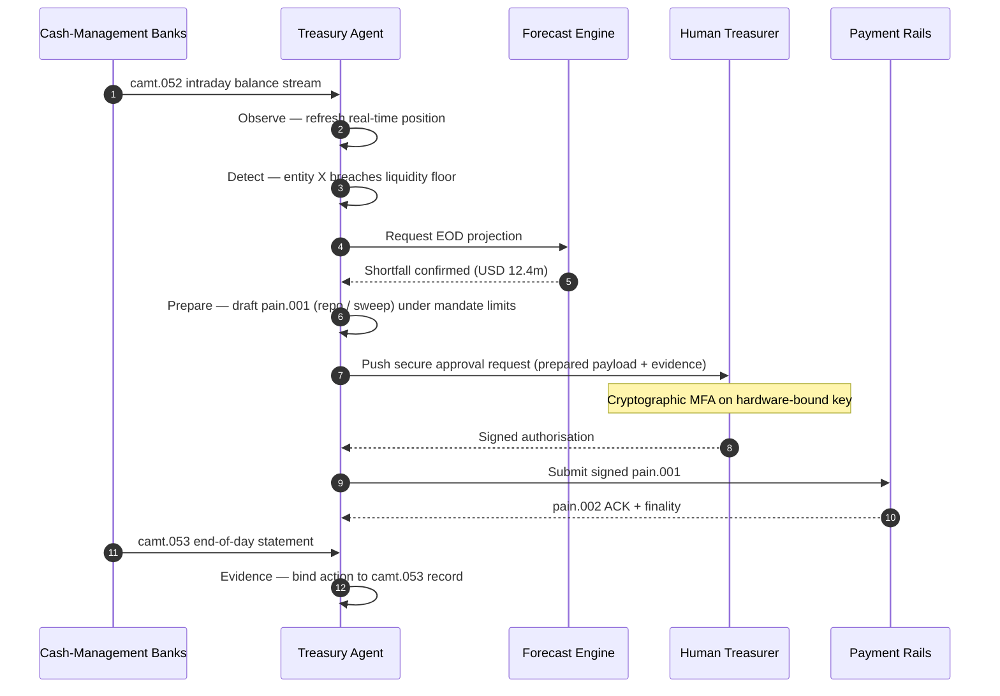

## شاخص خزانه‌داری خودمختار در سال ۲۰۲۶: خزانه‌داری عامل‌محور، نقدینگی برنامه‌پذیر، سپرده‌های توکنی و کنترل نقدی بلادرنگ

خزانه‌داری خودمختار نقطه تلاقی طبیعیِ هوش مصنوعی عامل‌محور، پرداخت‌های عمده، سپرده‌های توکنی و نقدینگی بلادرنگ است. در سال ۲۰۲۶، بهترین معماری‌های خزانه‌داری صرفاً وجه نقد را پیش‌بینی نمی‌کنند؛ بلکه اقدامات نقدینگیِ محدودشده را در میان حساب‌ها، ارزها، ریل‌ها و دارایی‌های تسویه توصیه می‌کنند، توضیح می‌دهند و سرانجام اجرا می‌کنند.

---

> **خلاصه اجرایی / نکات کلیدی**
>
> - **خزانه‌داری از گزارش‌دهی به‌سوی کنترل در حال گذار است.** مانده‌های بلادرنگ، پیش‌بینی‌ها، وضعیت پرداخت و جابه‌جایی نقدینگی در حال تبدیل‌شدن به بخشی از یک گردش‌کار واحد هستند.
> - **هوش مصنوعی عامل‌محور یک رابط کاربری تازه برای خزانه‌داری می‌آفریند.** عامل‌ها می‌توانند وضعیت‌ها را رصد کنند، ناهنجاری‌ها را آشکار سازند، اقدامات تأمین مالی را آماده کنند و تصمیم‌ها را در چارچوب ماموریت‌های تعریف‌شده ارجاع دهند.
> - **پول برنامه‌پذیر، شاخهٔ نقدی را دگرگون می‌کند.** سپرده‌های توکنی و آزمایش‌های CBDC عمده امکانات تازه‌ای برای تسویهٔ اتمی، پرداخت‌های مشروط و نقدینگی همیشه‌فعال پدید می‌آورند.
> - **شاخص باید اختیار را بسنجد.** پرسش این نیست که آیا عامل می‌تواند اقدامی را پیشنهاد دهد؛ پرسش این است که آیا اختیار، محدودیت‌ها، تأییدها و شواهد روشن هستند یا نه.
> - **ارزش خزانه‌داری قابل‌سنجش است.** نقدینگیِ صرفه‌جویی‌شده، کاهش بررسی‌های دستی، پیشگیری از شکست‌های تسویه و آزادسازی سرمایه در گردش باید موفقیت را تعریف کنند.
>
---

## چرا سال ۲۰۲۶ سالی است که این شاخص اهمیت می‌یابد

شاخص هوش مصنوعی استنفورد از آن رو سودمند است که یک حوزه فناوریِ پرشتاب را به‌مثابه چیزی قابل‌سنجش در نظر می‌گیرد: خروجی پژوهش، عملکرد فنی، استقرار مسئولانه، اقتصاد، پذیرش بخشی، سیاست‌گذاری و افکار عمومی همگی در یک قاب واحد گرد هم می‌آیند ([Stanford HAI ⧉](https://hai.stanford.edu/ai-index/2026-ai-index-report "گزارش شاخص هوش مصنوعی ۲۰۲۶")). بانک‌ها و مؤسسات مالی اکنون به همین انضباط برای زیرساخت نیاز دارند. هوش مصنوعی عامل‌محور، امنیت مقاوم در برابر کوانتوم، تاب‌آوری بومی ابری و پرداخت‌های عمده دیگر مسیرهای نوآوریِ جداگانه نیستند؛ آن‌ها در حال هم‌گرایی به یک مدل عملیاتی واحد هستند.

پرسش عملی برای یک بانک این نیست که آیا هر حوزه مهم است. پرسش این است که آیا مؤسسه می‌تواند آمادگی را در همه آن‌ها به‌طور همزمان بسنجد. یک بانک می‌تواند هوش مصنوعی عامل‌محور را مستقر کند و همچنان شکننده باشد اگر رمزنگاری‌اش آماده مهاجرت نباشد. می‌تواند بسترهای ابری را نوسازی کند و همچنان شکست بخورد اگر داده‌های پرداخت بدون ساختار بمانند. می‌تواند آزمایش‌های توکنی‌سازی را اجرا کند و همچنان ریسک سیستمی بیافریند اگر لایه‌های تسویه، نقدینگی، هویت و ممیزی با هم طراحی نشده باشند.

## معماری شاخص ۲۰۲۶

| لایه شاخص | جهت‌گیری ۲۰۲۶ | سنجه آمادگی | ریسک در صورت مدیریت نادرست |
|---|---|---|---|
| **مشاهده‌پذیری** | یکپارچه‌سازی داده‌های حساب، پرداخت، نقدینگی و مواجهه | پوشش وضعیت‌های نقدی بلادرنگ | مشاهده‌پذیری نقدی پراکنده |
| **پیش‌بینی** | استفاده از هوش مصنوعی برای پیش‌بینی مانده‌ها، جریان‌ها و نیازهای تأمین مالی | دقت پیش‌بینی و نرخ استثنا | اعتماد کاذب به داده‌های ضعیف |
| **خودمختاری** | اعطای اختیار محدود به عامل‌ها برای توصیه‌ها و اقدامات | پوشش ماموریت و کیفیت تأیید | اقدام غیرمجاز یا بدون توضیح |
| **برنامه‌پذیری** | استفاده از سپرده‌های توکنی و شرایط هوشمند در جایی که ارزش می‌افزایند | موارد کاربرد پرداخت مشروط و تسویه اتمی | آزمایش‌های خزانه‌داری فناوری‌محور |
| **کنترل‌ها** | تعبیه محدودیت‌ها، تحریم‌ها، ارز، نقدینگی و کنترل‌های ممیزی | شواهد کنترلی به‌ازای هر اقدام خزانه‌داری | حاکمیت دستی پس از اجرا |

## سیگنال‌های کنونی که باید رصد شوند

| سیگنال | معنای آن برای بانک‌ها | منبع |
|---|---|---|
| **۵۲٪ پذیرش هوش مصنوعی عامل‌محور در خدمات مالی** | خزانه‌داری اکنون می‌تواند گردش‌کارهای عامل‌محور را از طریق بسترهای دارای حاکمیت جذب کند | [Cambridge CCAF ⧉](https://www.jbs.cam.ac.uk/faculty-research/centres/alternative-finance/publications/2026-global-ai-in-financial-services-report/ "گزارش جهانی هوش مصنوعی در خدمات مالی ۲۰۲۶") |
| **پرداخت‌های مشروط پروژه Agorá** | توکنی‌سازی می‌تواند قابلیت‌های پرداخت مشروط و همیشه‌فعال را ممکن سازد | [BIS ⧉](https://www.bis.org/about/bisih/topics/fmis/agora.htm "پروژه Agorá") |
| **جعبه‌شن اوراق بهادار دیجیتال بانک انگلستان** | اوراق قرضه و سهامِ صادرشده بر بستر DLT بر پایه تحویل در برابر پرداخت (DvP) تسویه می‌شوند — شاخهٔ دارایی و شاخهٔ نقدی (CBDC عمده یا سپرده‌های توکنیِ بانک تجاری) در یک تراکنش اتمی واحد تسویه می‌شوند و ریسک اصلِ طرف مقابل را حذف می‌کنند | [Bank of England ⧉](https://www.bankofengland.co.uk/financial-stability/digital-securities-sandbox "جعبه‌شن اوراق بهادار دیجیتال") |
| **مهلت آدرس ساختاریافته SWIFT** | داده‌های خزانه‌داری باید به‌درستی در مبدأ ثبت شوند | [SWIFT ⧉](https://www.swift.com/news-events/news/iso-20022-milestone-november-2026-unstructured-addresses-be-removed "نقطه‌عطف آدرس ساختاریافته ISO 20022 در نوامبر ۲۰۲۶") |
| **دشواری مؤسسات مالی بزرگ در سنجش ارزش هوش مصنوعی** | خودکارسازی خزانه‌داری به سنجه‌های اقتصادی ملموس نیاز دارد | [Cambridge CCAF ⧉](https://www.jbs.cam.ac.uk/faculty-research/centres/alternative-finance/publications/2026-global-ai-in-financial-services-report/ "گزارش جهانی هوش مصنوعی در خدمات مالی ۲۰۲۶") |

## ماموریت عاملِ خزانه‌داری

یک عاملِ خزانه‌داری نباید همچون دستیاری همه‌منظوره طراحی شود. این عامل به یک ماموریت نیاز دارد: مشاهده حساب‌ها، تشخیص استثناها، پیش‌بینی شکاف‌های تأمین مالی، آماده‌سازی اقدامات، درخواست تأییدها، اجرا در چارچوب محدودیت‌ها و تولید شواهد. هر گام باید مدل اختیار متفاوتی داشته باشد.

حلقه کنترل، مشاهده ← تشخیص ← پیش‌بینی ← آماده‌سازی ← درخواست تأیید را طی می‌کند — و سپس متوقف می‌شود. عامل هرگز به‌تنهایی از مرز مجوز رمزنگاشتی عبور نمی‌کند. نمودار زیر یک چرخه کامل را ردیابی می‌کند: کسری نقدینگی درون‌روزی چندین‌میلیون‌دلاری در تله‌متری `camt.052` آشکار می‌شود، عامل وضعیت پایان روز را پیش‌بینی می‌کند، یک ریپو یا جاروب درون‌شرکتی را به‌صورت یک `pain.001` کاملاً شکل‌گرفته آماده می‌سازد و آن را برای امضای رمزنگاشتیِ چندعاملی روی یک کلید محدودشده به سخت‌افزار به خزانه‌دار انسانی تحویل می‌دهد. سپس عامل بار امضاشده را ارسال می‌کند؛ نهایی‌شدن به‌صورت یک ACK از نوع `pain.002` و `camt.053` رسمیِ بعدی فرود می‌آید.

مرز، نکته اصلی است — هر اقدامی که پول واقعی را جابه‌جا می‌کند پشت یک دروازه رمزنگاشتی قرار دارد که عامل نمی‌تواند آن را به‌تنهایی برآورده کند.

## نقدینگی برنامه‌پذیر

نقدینگی برنامه‌پذیر توانایی جابه‌جایی ارزش تحت شرایط است: اگر آستانه‌ای نقض شود، اگر وثیقه واجد شرایط باشد، اگر طرف مقابل از پالایش عبور کند، اگر نهایی‌شدن تسویه در دسترس باشد، یا اگر بافر نقدینگی درون‌روزی بسیار پایین باشد. سپرده‌های توکنی و بسترهای تسویه عمده این الگوها را عملی‌تر می‌سازند.

برنامه‌پذیر به‌معنای خارج‌از‌استاندارد نیست. مسیر اجرا `pain.001` است — آغاز انتقال اعتباری مشتریِ [ISO 20022](/2023-09-29-automating-iso-20022-compliant-payment-file-creation-with-pain001/index.html). اقدامِ آماده‌شده عامل یک بار `pain.001` کاملاً شکل‌گرفته است که از همان کانالی که یک ERP سازمانی به‌کار می‌برد به بانک مسیریابی می‌شود، در برابر همان طرح‌واره اعتبارسنجی می‌شود، توسط همان موتورهای تقلب و تحریم امتیازدهی می‌شود و در همان گزارش‌های وضعیت `pain.002` تأیید می‌گردد. لایه شرطیت (آستانه، واجد شرایط بودن وثیقه، دسترس‌پذیری نهایی‌شدن، کف بافر) بالای پیام قرار دارد — این لایه تعیین می‌کند *که آیا* یک `pain.001` ارسال شود یا نه، نه اینکه *چه شکلی* داشته باشد. بسترهای خزانه‌داری که برای بیان شرایط بارهای سفارشیِ اختصاصی می‌سازند از مسیر قابل‌مصرف‌توسط‌بانک بیرون می‌افتند و به یکپارچه‌سازی دوجانبه بازمی‌گردند.

## اتاق کنترل خزانه‌داری

مدل عملیاتی باید همچون یک اتاق کنترل به نظر برسد: وضعیت‌ها، پیش‌بینی‌ها، حالت‌های پرداخت، میزان استفاده از محدودیت‌ها، استثناها، تأییدها و شواهد در یک رابط کاربری واحد. شاخص باید پشته‌های خزانه‌داری را که تیم‌ها را وامی‌دارند ایمیل‌ها، صفحات گسترده، درگاه‌های بانکی و داشبوردهای منفصل را به هم بدوزند، جریمه کند.

صفحه داده در پس آن رابط، مدیریت نقدینگیِ ISO 20022 است. وضعیت درون‌روزی `camt.052` است — گزارش حساب بانک‌به‌مشتری — که از هر بانک مدیریت نقدینگی با همان بسامدی که بانک منتشر می‌کند (دقایق برای ارائه‌دهندگان GTB رده‌یک، پایان‌چرخه برای دنباله بلند) به لایه مشاهده عامل جاری می‌شود. تطبیق پایان روز `camt.053` است — صورت‌حساب بانک‌به‌مشتری — یعنی سند قابل‌ممیزی که پیش‌بینی عامل صبح روز بعد در برابر آن ارزیابی می‌شود. بسترهای خزانه‌داری که صورت‌حساب‌های PDF را می‌خوانند یا درگاه‌های بانکی را از روی صفحه‌نمایش استخراج می‌کنند نمی‌توانند به سطح ۴ شاخص برسند؛ تله‌متری درون‌روزی باید به‌صورت `camt.052` ساختاریافته برسد تا حلقه پیش‌بینی به‌موقع برای اقدام بسته شود.

## این برای هر نوع بانک چه معنایی دارد

### بانک‌های مهم سیستمیِ جهانی

بانک‌های جهانی باید این شاخص را به‌مثابه کارنامهٔ معماری سازمانی تلقی کنند. اولویت، اثبات مفهوم دیگری نیست؛ بلکه شواهدی است دال بر اینکه گردش‌کارهای خودمختار، مهاجرت رمزنگاشتی، وابستگی ابری و نوسازی پرداخت می‌توانند به‌مثابه یک نظام واحد ریسک و ارزش اداره شوند.

### بانک‌های تراکنشی و بانک‌های شرکتی

بانک‌های تراکنشی باید بر پرداخت‌های عمده، داده ساختاریافته، نقدینگی، سپرده‌های توکنی و خدمات خزانه‌داری عامل‌محور تمرکز کنند. ارزشمندترین پیشنهاد به مشتری صرفاً جابه‌جایی سریع‌تر پول نیست؛ بلکه جابه‌جایی پول به‌شکل قابل‌توضیح، قابل‌ممیزی و برنامه‌پذیر با بررسی‌های کمتر و مشاهده‌پذیری بهتر سرمایه در گردش است.

### بانک‌های منطقه‌ای

بانک‌های منطقه‌ای باید از این شاخص برای پرهیز از پراکندگی برنامه‌ها بهره ببرند. آن‌ها لازم نیست در هر مرز پیشرو باشند، اما نیاز دارند در حاکمیت هوش مصنوعی، فهرست پساکوانتومی، شواهد خروج از ابر و آمادگی داده پرداخت موضع‌های معتبری داشته باشند.

### فین‌تک‌ها، PSPها و ارائه‌دهندگان زیرساخت

فین‌تک‌ها و ارائه‌دهندگان زیرساخت باید نقشه‌راه محصول خود را با آمادگی قابل‌سنجش بانک‌ها هم‌راستا کنند. بهترین پیشنهادها ریسک یکپارچه‌سازی را کاهش می‌دهند، شواهد را تقویت می‌کنند و اداره زیرساخت پیچیده را برای بانک‌ها آسان‌تر می‌سازند.

## نتیجه‌گیری

ارزش یک گزارش شاخص‌گونه در آن است که یک دستورکار فناوریِ پراکنده را به یک مدل عملیاتیِ قابل‌سنجش تبدیل می‌کند. در سال ۲۰۲۶، برندگان زیرساخت مالی مؤسساتی نخواهند بود که بیشترین آزمایش‌ها را دارند. آن‌ها مؤسساتی خواهند بود که می‌توانند آمادگی را در حوزه‌های خودمختاری، امنیت، تاب‌آوری، تسویه، اقتصاد و حاکمیت به‌طور همزمان اثبات کنند.

## پرسش‌های پرتکرار

**خزانه‌داری خودمختار چیست؟**

خزانه‌داری خودمختار به‌کارگیری عامل‌های هوش مصنوعی، داده بلادرنگ و پرداخت‌های برنامه‌پذیر برای رصد، توصیه و اجرای بالقوهٔ اقدامات خزانه‌داری در چارچوب کنترل‌های تعریف‌شده است.

**آیا باید به عامل‌های خزانه‌داری اجازه اجرای پرداخت‌ها داده شود؟**

تنها در چارچوب ماموریت‌های محدود، محدودیت‌های نیرومند، تأییدهای صریح و قابلیت ممیزی کامل. اختیار اجرا باید از طریق بلوغ کسب شود.

**سپرده‌های توکنی چگونه به خزانه‌داری کمک می‌کنند؟**

آن‌ها می‌توانند از تسویه برنامه‌پذیر، اجرای اتمی و به‌طور بالقوه کنترل بهتر نقدینگی درون‌روزی پشتیبانی کنند و در همان حال روابط پول بانک تجاری را حفظ نمایند.

**نخستین گام پیاده‌سازی چیست؟**

پیش از اعطای خودمختاری، مشاهده‌پذیری بلادرنگ و کیفیت داده را بسازید. عامل‌ها نمی‌توانند وجه نقدی را که نمی‌توانند به‌دقت ببینند، به‌طور ایمن بهینه کنند.

## منابع

- Cambridge Centre for Alternative Finance, (2026). [گزارش جهانی هوش مصنوعی در خدمات مالی ۲۰۲۶ ⧉](https://www.jbs.cam.ac.uk/faculty-research/centres/alternative-finance/publications/2026-global-ai-in-financial-services-report/ "گزارش جهانی هوش مصنوعی در خدمات مالی ۲۰۲۶").
- SWIFT, (2026). [نقطه‌عطف آدرس ساختاریافته ISO 20022 در نوامبر ۲۰۲۶ ⧉](https://www.swift.com/news-events/news/iso-20022-milestone-november-2026-unstructured-addresses-be-removed "نقطه‌عطف آدرس ساختاریافته ISO 20022 در نوامبر ۲۰۲۶").
- BIS Innovation Hub, (2026). [پروژه Agorá ⧉](https://www.bis.org/about/bisih/topics/fmis/agora.htm "پروژه Agorá").
- Bank of England, (2026). [شکل‌دادن به آینده مالی دیجیتال بریتانیا ⧉](https://www.bankofengland.co.uk/speech/2025/january/sasha-mills-speech-at-the-tokenisation-summit "شکل‌دادن به آینده مالی دیجیتال بریتانیا").
