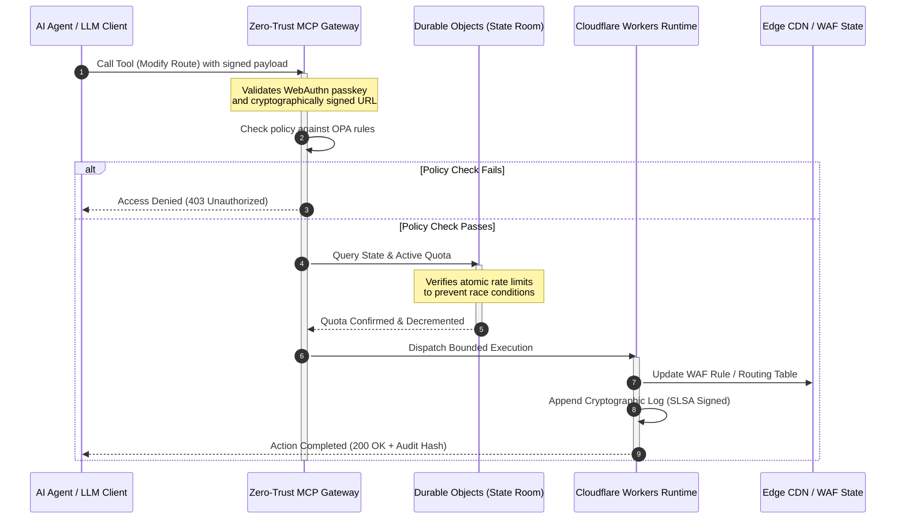

## CloudCDN: طرحی متن‌باز برای لبهٔ بومیِ هوش مصنوعی در سال 2026

بحث دربارهٔ CDN تمام شده است. لبه دیگر یک حافظهٔ نهان نیست؛ لبه صفحهٔ کنترل نرم‌افزارِ بومیِ هوش مصنوعی است. همچنان که عامل‌ها ابزارها را فرا می‌خوانند، داده جابه‌جا می‌کنند، حافظه‌های نهان را پاک می‌کنند، URLهای امضاشده درخواست می‌کنند و گردش‌کارها را هماهنگ می‌سازند، مدل قدیمیِ داشبوردهای مبهم و صفحه‌های کنترل اختصاصی دیگر یک ناخوشایندی نیست، بلکه به یک مسئولیت مقرراتی بدل می‌شود. CloudCDN از مدلی متفاوت دفاع می‌کند: یک سکوی لبهٔ باز، قابل‌بازرسی و قابل‌کنترل توسط عامل که امنیت، دسترس‌پذیری، کارایی و قابلیت حسابرسی را به‌جای وعده‌های فروشنده، به‌مثابهٔ پیش‌فرض‌های قابل‌اجرا در نظر می‌گیرد.

مرجع متن‌باز این مقاله [cloudcdn.pro ⧉](https://github.com/sebastienrousseau/cloudcdn.pro "cloudcdn.pro") است. این مخزن یک CDN چنداجاره‌ای و بومیِ هوش مصنوعی است که می‌توان آن را سرتاسر خواند و به‌طور مستقل مستقر کرد: TTFB کمتر از 100 میلی‌ثانیه در سراسر PoPهای Cloudflare، کنترل MCP، محدودسازی نرخ با Durable Objects، دسترس‌پذیری WCAG-AA، URLهای امضاشده، کلیدهای عبور، SLSA سطح 3 و 3,185 آزمون با پوشش 100٪.

---

> **خلاصهٔ اجرایی / نکات کلیدی**
>
> - **لبه به مرز عملیاتی بدل می‌شود.** CloudCDN گره‌های استاندارد CDN را به دروازه‌های سیاست فعال تبدیل می‌کند که امنیت، مسیریابی و کنترل دسترسی را در کسری از میلی‌ثانیه اجرا می‌کنند.
> - **Durable Objects محدودسازی نرخ را اتمی می‌سازد.** اعمال بی‌درنگ و جهانیِ سازگارِ سهمیه، پنجرهٔ شرایط رقابتی را که محدودکننده‌های نهایتاً‌سازگار برای مهاجمان و عامل‌های معیوب باز می‌گذارند، می‌بندد.
> - **عامل‌ها زیرساخت را از طریق 42 ابزار محدودِ MCP اداره می‌کنند.** هر فراخوانی پیش از اجرا در برابر کلیدهای عبور WebAuthn، بارهای امضاشده و سیاست OPA اعتبارسنجی می‌شود.
> - **زنجیرهٔ تأمین بخشی از محصول است.** منشأ SLSA سطح 3 از طریق Sigstore/Cosign هر انتشار را به‌صورت رمزنگاری به منبع حسابرسی‌شدهٔ آن پیوند می‌دهد.
> - **سنجه‌ها همان شواهد انطباق‌اند.** عملیات لبه مستقیماً به مادهٔ 5 DORA، BCBS 239 و سرمایهٔ ریسک عملیاتی Basel III نگاشت می‌شود، نه از طریق گزارش‌دهیِ پس از وقوع.
>
---

## چرا این پروژهٔ متن‌باز در سال 2026 اهمیت دارد

فناوری اطلاعات سازمانی در سال 2026 از تأمینِ زیرساختِ ایستا به سمت هماهنگ‌سازیِ دادهٔ بی‌درنگ و رویدادمحور حرکت کرده است. دو نیروی بازار این تغییر را پیش می‌رانند.

نیروی نخست، تکثیرِ هوش مصنوعی عامل‌محور است. مدل‌ها و عامل‌های نرم‌افزاریِ خودمختار اکنون وظایف عملیاتیِ پیچیده را انجام می‌دهند: کاهش خودکار تهدید، تصمیم‌های مسیریابی، توازن‌بخشی بی‌درنگِ دفتر کل. آن‌ها از داشبورد استفاده نمی‌کنند. آن‌ها ابزار فرا می‌خوانند.

نیروی دوم، اجرای فعالِ [قانون تاب‌آوری عملیاتی دیجیتال (DORA) ⧉](https://eur-lex.europa.eu/legal-content/EN/TXT/?uri=CELEX%3A32022R2554 "مقررات (EU) 2022/2554 دربارهٔ تاب‌آوری عملیاتی دیجیتال برای بخش مالی") است. نهادهای بانکی دیگر نمی‌توانند به CDNهای مبهم، اختصاصی و شخص‌ثالث تکیه کنند. تنظیم‌گران خواهان دیدِ کامل به زنجیرهٔ تأمین نرم‌افزار، توانایی خروج قابل‌اثبات و رد‌پاهای حسابرسی رمزنگاریِ تغییرناپذیرند.

معماری‌های سرور متمرکز، جریمه‌های تأخیری را تحمیل می‌کنند که هماهنگ‌سازی بی‌درنگ توان جذب آن را ندارد. CDNهای اختصاصی همچون جعبه‌های سیاه عمل می‌کنند که نهادها را در معرض مصالحهٔ زنجیرهٔ تأمینی قرار می‌دهند که نه می‌بینند و نه می‌توانند مستند کنند. CloudCDN این شکاف را با یک طرح شفاف، مبتنی بر اعتماد صفر و متن‌باز می‌بندد که لبه را به یک صفحهٔ کنترل فعال بدل می‌کند. برای مدیران ارشد فناوری، این کار گفت‌وگو را از هزینهٔ انطباق به بازده تاب‌آوری منتقل می‌کند: سرمایه‌ای که به‌واسطهٔ خطوط تولید عملیاتیِ خودکار و آمادهٔ حسابرسی حفظ می‌شود.

## منظرِ معماری

معماری CloudCDN در پنج لایه ساختار یافته است و میان‌افزارِ متمرکز را با اولیه‌های لبهٔ محلی و حالت‌مند جایگزین می‌کند:

| لایه | تصمیم طراحی | چرا اهمیت دارد | ریسک در صورت مدیریت نادرست |
|---|---|---|---|
| **زمان اجرای لبه** | Cloudflare Workers و Pages | تأخیر ماشین مجازی متمرکز را حذف می‌کند؛ سیاست‌ها را در کسری از میلی‌ثانیه به‌صورت جهانی اجرا می‌کند | دستاوردهای کارایی بدون انضباط سیاستی، به رانش آشفتهٔ لبه می‌انجامد |
| **هماهنگی حالت** | Durable Objects | سازگاری اتمی و بی‌درنگ را برای محدودیت‌های نرخ و حالت مشترک در همهٔ مناطق تضمین می‌کند | شرایط رقابتی توزیع‌شده، سوءاستفاده از منابع API، دور زدن سهمیه‌های محیطی |
| **رابط عامل** | دروازهٔ MCP مبتنی بر اعتماد صفر | 42 ابزار تخصصیِ MCP را در دسترس می‌گذارد تا عامل‌های هوش مصنوعی زیرساخت را زیر حدود حاکمیتی اداره کنند | فراخوانی نامحدودِ ابزار و تغییرات پیکربندیِ غیرمجاز |
| **کنترل دسترسی** | کلیدهای عبور WebAuthn و URLهای امضاشده | رمزهای عبور ایستا را با امضاهای رمزنگاری برای عملیات قابل‌حسابرسی جایگزین می‌کند | تغییرات با انتساب ضعیف؛ سرقت اعتبارنامه و نفوذ به محیط |
| **دروازه‌های کیفیت** | SLSA سطح 3 و پوشش آزمون 100٪ | منبع ساخت را به‌صورت ریاضی راستی‌آزمایی می‌کند؛ تزریق وابستگی مخرب را مسدود می‌کند | درج کد مخرب از طریق زنجیرهٔ تأمین نرم‌افزار |

## سیگنال‌های عملیاتی برای پایش

آمادگی لبه قابل‌سنجش است. این‌ها شاخص‌های کمّی‌ای هستند که به‌جای نیت، توانایی اجرا را نشان می‌دهند:

| سیگنال | سنجه / معیار | مرجع مقرراتی | پیاده‌سازی سکو |
|---|---|---|---|
| **42 ابزار MCP** | شمارِ محدودِ ثبت ابزار برای مدیریت خودکار | COBIT 2019 (BAI06) | دروازهٔ MCP که امضای عامل را در برابر سیاست‌های OPA اعتبارسنجی می‌کند |
| **Durable Objects** | اعمال سهمیهٔ اتمی، بدون‌نشت و کمتر از میلی‌ثانیه | مادهٔ 6 DORA | Durable Objects که حالت سهمیهٔ جهانی API را ردیابی می‌کند |
| **کلیدهای عبور و URLهای امضاشده** | 100٪ نشست‌های مدیریتی که با FIDO2 WebAuthn راستی‌آزمایی می‌شوند | مادهٔ 30 DORA | بررسی‌های امضای رمزنگاری تعبیه‌شده در مسیریاب لبه |
| **SLSA سطح 3** | مانیفست‌های ساختِ رمزنگاری‌شده (Sigstore) | مادهٔ 30 DORA | خطوط لولهٔ GitHub Actions که فراداده ساختِ امضاشده تولید می‌کنند |
| **3,185 آزمون واحد** | پوشش 100٪؛ دروازه‌های واپس‌گرد در هر انتشار | NIST CSF 2.0 (PR.DS-01) | خطوط لولهٔ CI که استقرار را در صورت هر شکست آزمون متوقف می‌کنند |

## CDN به یک صفحهٔ کنترل فعال بدل می‌شود

CDNهای سنتی حول شتاب‌دهیِ منفعل و ایستای محتوا طراحی شده بودند. CloudCDN این مدل را بازتعریف می‌کند. با یکپارچه‌سازی Cloudflare Workers و Durable Objects، لبه همچون یک دروازهٔ سیاستِ فعال و حالت‌مند عمل می‌کند.

هنگامی که یک عامل هوش مصنوعی یا یک فرایند خودکار درخواست تغییر پیکربندی زیرساخت یا تنظیم مسیریابی می‌دهد، با یک پایگاه‌دادهٔ آسیب‌پذیر و متمرکز صحبت نمی‌کند. درخواست در نزدیک‌ترین گره لبه رهگیری می‌شود و پیش از هرگونه اجرا، از بررسی‌های هویت، سیاست و سهمیه عبور داده می‌شود:

هر گام در این توالی یک رکورد قابل‌انتساب و امضاشده تولید می‌کند. این همان تفاوت میان CDNی است که محتوا را شتاب می‌دهد و صفحهٔ کنترلی که می‌توان بر آن حکمرانی کرد.

## چرا متن‌باز مدل اعتماد را تغییر می‌دهد

برای مدیران ارشد امنیت اطلاعات، CDNهای اختصاصی و مبهم ریسکی انباشتی به همراه دارند. شبکه‌های لبهٔ بسته‌منبع، جعبه‌های سیاه‌اند: اگر فروشنده دچار مصالحهٔ داخلی شود، بانک تا زمان افشای عمومی نقض، هیچ دیدی ندارد.

CloudCDN آن عدم‌تقارن را با یک مدل اعتمادِ متن‌باز و کاملاً قابل‌حسابرسی جایگزین می‌کند که بر سه سازوکار بنا شده است:

1. **منشأ ساختِ ریاضی.** زیر SLSA سطح 3، هر انتشار به‌صورت رمزنگاری به مخزن متن‌باز GitHub خود پیوند می‌خورد. یک مدیر امنیت اطلاعات می‌تواند به‌صورت ریاضی، و نه قراردادی، راستی‌آزمایی کند که فایل باینریِ در حال اجرا روی گره‌های لبهٔ جهانیِ Cloudflare دقیقاً همان کد منبعِ حسابرسی‌شده را در بر دارد.
2. **حسابرسی‌های امنیتیِ مستمر و عمومی.** پایگاه کد در معرض پویش‌های خودکار، افشای عمومیِ آسیب‌پذیری و حسابرسی‌های کدِ داوری‌شده قرار می‌گیرد. ابهام یک کنترل نیست؛ بازبینی هست.
3. **بدون قفل‌شدن به فروشنده (مادهٔ 28 DORA).** DORA از بانک‌ها می‌خواهد یک راهبرد خروجِ روشن و آزموده‌شده از تأمین‌کنندگان شخص‌ثالثِ حیاتی را اثبات کنند. چون CloudCDN متن‌باز است و بر اولیه‌های استاندارد بدون‌سرور بنا شده، نهادها می‌توانند پیکربندی‌های لبه را از Cloudflare به دیگر زمان‌های اجرای بدون‌سرور یا خوشه‌های خصوصی Kubernetes مهاجرت دهند، و این توانایی را به تنظیم‌گر مستند کنند.

## الگوی لبهٔ درجهٔ بانکی

CloudCDN چنان مهندسی شده است که استانداردهای انطباق بخش مالی جهانی را برآورده کند و عملیات فنی لبه را مستقیماً به چارچوب‌هایی نگاشت می‌کند که ناظران واقعاً بررسی می‌کنند:

- **مدیریت ریسک مدل ([US Fed SR 11-7 ⧉](https://web.archive.org/web/20260414150921/https://www.federalreserve.gov/supervisionreg/srletters/sr1107.htm "راهنمای نظارتی دربارهٔ مدیریت ریسک مدل") / UK PRA SS1/23).** مدل‌های خودمختاری که وظایف عملیاتی را اجرا می‌کنند زیر حاکمیت ریسک مدل قرار می‌گیرند. دروازهٔ MCP در CloudCDN با ابزارهای عامل‌محور همچون مدل‌های کمّی رفتار می‌کند: حدود سیاستیِ سختگیرانه، ثبت بی‌درنگ و بازنویسی‌های اجباریِ انسان‌در‌حلقه برای اقدامات پرتأثیر.
- **BCBS 239 (تجمیع دادهٔ ریسک).** با ثبت، برچسب‌گذاری و ساختاردهیِ دادهٔ تراکنش در لبه، سنجه‌های عملیاتی به‌صورت بی‌درنگ تولید می‌شوند، همسو با الزامات BCBS 239 برای یکپارچگی داده، به‌هنگام‌بودن و ردیابی‌پذیری مقرراتی.
- **مادهٔ 5 DORA (پاسخگویی هیئت‌مدیره).** هیئت‌مدیره مسئولیت شخصیِ نهایی را در قبال تاب‌آوری عملیاتی بر عهده دارد. CloudCDN سنجه‌های لبه را به شواهد کمّی و قابل‌راستی‌آزمایی ترجمه می‌کند که مدیرانِ غیرفنی می‌توانند آن را به یک حسابرسیِ مسئولیت شخصی ببرند.
- **سرمایهٔ ریسک عملیاتی Basel III.** بانک‌ها در برابر ریسک عملیاتی سرمایهٔ مقرراتی نگه می‌دارند. جابه‌جایی خودکارِ بازیابی از فاجعه و منشأ SLSA سطح 3 نمای ریسک عملیاتیِ نهاد را کاهش می‌دهد، و به‌جای صرفِ برآورده‌کردن یک حسابرسی، سرمایه را در ترازنامه حفظ می‌کند.

## این برای هر نوع بانک چه معنایی دارد

### بانک‌های دارای اهمیت سیستمی در سطح جهانی (G-SIBs)

بانک‌های G-SIB حجم عظیمی از تراکنش‌ها را در چندین حوزهٔ قضایی اجرا می‌کنند. اولویت، جایگزینیِ کنترل‌های محیطیِ قدیمی و تکه‌تکه با یک صفحهٔ لبهٔ یکپارچه و واحد است. استقرار الگوی CloudCDN به یک G-SIB اجازه می‌دهد سیاست‌های امنیتی، دروازه‌های API و حاکمیت عامل‌محور را در سطح جهانی استانداردسازی کند، و خطوط لولهٔ شواهدِ منطبق با DORA را همچون فراوردهٔ جانبیِ عملیات و نه یک تقلای فصلی تولید کند.

### بانک‌های تراکنشی و شرکتی

برای بانک‌های تراکنشی، محصولِ رو به مشتری بسته‌ای از سرعت اجرا، امنیت و شفافیت داده است. الگوی CloudCDN به این بانک‌ها اجازه می‌دهد داشبوردهای API امن و خدمات ردیابی بی‌درنگِ وجه نقد را در اختیار خزانه‌داران شرکتی بگذارند؛ یک وضعیت لبهٔ تاب‌آور که از سپرده‌های سازمانی دفاع می‌کند.

### بانک‌های منطقه‌ای و کوچک‌تر

بانک‌های منطقه‌ای با همان بازیگران تهدیدی روبه‌رو هستند که G-SIBها، اما بدون بودجه‌های مهندسی آن‌ها. یک طرح لبهٔ متن‌باز و درجهٔ بانکی، کنترل‌ها را از همان ابتدا فراهم می‌کند: همسویی مقرراتیِ فوری بدون هزینه‌های مجوزِ اختصاصی، و کد منبعی که آن را اثبات می‌کند.

## کتابچهٔ راهنمای هیئت‌مدیره

تاب‌آوری عملیاتی دیگر یک سنجهٔ نامرئیِ فناوریِ پشتیبانی نیست؛ اکنون اولویتی در سطح هیئت‌مدیره است که مسئولیت شخصی نیز به آن پیوست شده است. نهادهایی که در سال 2026 اعتماد تنظیم‌گران، مشتریان و سهام‌داران را حفظ می‌کنند، فناوری را همچون یک دارایی قابل‌راستی‌آزمایی و قابل‌مشاهده می‌نگرند.

نقشهٔ راه برای رهبران ارشد فناوری کوتاه است:

1. **شواهد را همچون یک محصول الزامی کنید.** برای خطوط لولهٔ خودکار و خوداسنادکننده در لبه بودجه در نظر بگیرید؛ شواهدی که با عملیات تولید می‌شوند، نه شواهدی که برای حسابرس سرِ هم می‌شوند.
2. **به کنترل لبهٔ حالت‌مند حرکت کنید.** محدودسازی نرخ، WAF و راستی‌آزمایی هویت را از سرورهای متمرکز جدا کرده و روی اولیه‌های اتمی لبه بیاورید.
3. **حدود عامل‌محورِ رمزنگاری برقرار کنید.** دروازه‌های MCP مبتنی بر اعتماد صفر را با راستی‌آزمایی کلید عبور و OPA برای هر فراخوانی ابزارِ خودکار اعمال کنید.
4. **حسابرسی ساختِ متن‌باز را الزامی کنید.** منشأ ساخت SLSA سطح 3 را شرط استقرار بسازید، نه یک آرمان.

## پرسش‌های پرتکرار

**آیا CloudCDN برای حسابرسی‌های DORA آماده است؟**

بله. CloudCDN چنان مهندسی شده است که شواهد انطباق خودکار تولید کند که مستقیماً به قالب‌های ITSِ فهرست اطلاعات (RT.01 تا RT.15) و بندهای قراردادی مادهٔ 30 DORA نگاشت می‌شود.

**مزیت استفاده از Durable Objects برای محدودسازی نرخ چیست؟**

محدودکننده‌های نرخ توزیع‌شدهٔ سنتی بر سازگاری نهایی تکیه دارند که پنجره‌ای تأخیری باقی می‌گذارد که مهاجمان یا عامل‌های معیوب می‌توانند از آن بهره‌برداری کنند. Durable Objects سازگاری فوری و اتمی را در سطح جهانی تضمین می‌کنند و پنجرهٔ شرایط رقابتی را به‌طور کامل می‌بندند.

**چه چیزی CloudCDN را بومیِ هوش مصنوعی می‌کند؟**

عملیاتِ کنترل‌شده با MCP و مدل کنترلِ آگاه‌به‌عامل آن. زیرساخت از طریق 42 ابزار حاکمیتی با هویت رمزنگاری و حدود سیاستی اداره می‌شود؛ طراحی‌شده برای گردش‌کارهای خودمختار، نه فقط داشبوردهای انسانی.

**آیا کد متن‌باز خطر بهره‌برداری‌های روز-صفر را افزایش می‌دهد؟**

خیر. CDNهای اختصاصی و بسته‌منبع بر امنیت از راه ابهام تکیه دارند. پایگاه کد CloudCDN به‌طور مستمر در معرض آزمون خودکار، بازبینی عمومیِ همتا و اعتبارسنجی SLSA سطح 3 قرار می‌گیرد؛ آستانه‌ای از اعتماد که به‌گونه‌ای قابل‌راستی‌آزمایی بالاتر است.

## منابع

- پارلمان اروپا و شورای اتحادیهٔ اروپا، (2022). [مقررات (EU) 2022/2554 دربارهٔ تاب‌آوری عملیاتی دیجیتال برای بخش مالی (DORA) ⧉](https://eur-lex.europa.eu/legal-content/EN/TXT/?uri=CELEX%3A32022R2554 "مقررات (EU) 2022/2554 دربارهٔ تاب‌آوری عملیاتی دیجیتال برای بخش مالی (DORA)"). بروکسل: روزنامهٔ رسمی اتحادیهٔ اروپا.
- کمیتهٔ بازل در نظارت بانکی (BCBS)، (2013). [اصولی برای تجمیع مؤثر دادهٔ ریسک و گزارش‌دهی ریسک (BCBS 239) ⧉](https://www.bis.org/publ/bcbs239.htm "اصولی برای تجمیع مؤثر دادهٔ ریسک و گزارش‌دهی ریسک (BCBS 239)"). بازل: بانک تسویه‌های بین‌المللی.
- هیئت مدیرانِ سامانهٔ فدرال رزرو، (2011). [راهنمای نظارتی دربارهٔ مدیریت ریسک مدل (نامهٔ SR 11-7) ⧉](https://web.archive.org/web/20260414150921/https://www.federalreserve.gov/supervisionreg/srletters/sr1107.htm "راهنمای نظارتی دربارهٔ مدیریت ریسک مدل (نامهٔ SR 11-7)"). واشنگتن دی‌سی: فدرال رزرو.
- Cloudflare، (2026). [مستندات Durable Objects: هماهنگی حالت‌مند در لبه ⧉](https://developers.cloudflare.com/durable-objects/ "مستندات Durable Objects"). سان‌فرانسیسکو: Cloudflare.
- Cloudflare، (2026). [ساخت عامل‌های هوش مصنوعی با MCP، احراز هویت و Durable Objects ⧉](https://blog.cloudflare.com/building-ai-agents-with-mcp-authn-authz-and-durable-objects/ "ساخت عامل‌های هوش مصنوعی با MCP، احراز هویت و Durable Objects").
- GitHub، (2026). [مخزن cloudcdn.pro ⧉](https://github.com/sebastienrousseau/cloudcdn.pro "مخزن cloudcdn.pro").
