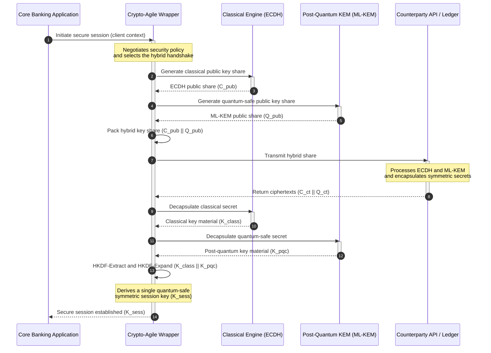

## KyberLib و مهاجرت پساکوانتومی بانکی در سال ۲۰۲۶: از استانداردها تا کد

مهاجرت پساکوانتومی دیگر یک تمرین برنامه‌ریزی نیست. در سال ۲۰۲۶ این یک الزام عملیاتیِ فعال است، و فاصله میان نیت نظارتی و اجرای مهندسی همان جایی است که اکنون ریسک در آن جای گرفته است. [KyberLib ⧉](https://github.com/sebastienrousseau/kyberlib "kyberlib") بخشی از این فاصله را می‌بندد: یک کتابخانه Rust با جهت‌گیری تولیدی و ایمن از نظر حافظه که ML-KEM را مطابق پارامترهای نهایی‌شده FIPS 203 پیاده می‌کند و آن را در مرزهای چابکِ رمزنگاری که استیتِ تراکنشیِ یک بانک واقعاً به آن نیاز دارد می‌پیچد.

---

> **خلاصه اجرایی / نکات کلیدی**
>
> - **تهدید هم‌اکنون عملیاتی است.** دشمنان امروز برداشتِ «اکنون ذخیره کن، بعداً رمزگشایی کن» را اجرا می‌کنند؛ محرمانگی داده‌ها در روزی که یک رایانه کوانتومیِ مرتبط با رمزنگاری از راه برسد، به‌صورت گذشته‌نگر از میان می‌رود.
> - **استانداردها نهایی شده‌اند.** NIST FIPS 203 (ML-KEM) و FIPS 204 (ML-DSA) به کمیته‌های ممیزی معیاری روشن و آزمون‌پذیر می‌دهند؛ دیگر دفاعِ «در انتظار استانداردها هستیم» وجود ندارد.
> - **KyberLib همان نقشه مهندسی است.** Rust ایمن از نظر حافظه، کامپایل `no_std` برای HSMها و کارت‌های هوشمند، و الگوهای دست‌دهیِ ترکیبی که تعامل‌پذیری کلاسیک را حفظ می‌کنند.
> - **چابکی رمزنگاری هدف پایدار است.** مرزهای انتزاعیِ پایدار اجازه می‌دهند بدوی‌ها بدون بازنویسی برنامه تغییر کنند؛ درسی که فراتر از هر الگوریتم واحدی دوام می‌آورد.
> - **بار مسئولیت بر دوش هیئت‌مدیره است.** ماده ۵ DORA مسئولیت شخصی را بر مدیران می‌گذارد؛ کدِ مهاجرتیِ قابل بازرسی و قابل‌مشاهده همان شاهدی است که این ماده را برآورده می‌کند.
>
---

## چرا این پروژه متن‌باز در سال ۲۰۲۶ اهمیت دارد

همان‌طور که رمزنگاری نامتقارن به منسوخ‌شدن نزدیک می‌شود، تهدید منتظر ساخته‌شدن یک رایانه کوانتومیِ مرتبط با رمزنگاری نمی‌ماند. دشمنان هم‌اکنون حملات **«اکنون ذخیره کن، بعداً رمزگشایی کن» (SNDL)** را اجرا می‌کنند؛ یعنی برداشتِ جریان‌های رمزشده درحال‌انتقالِ تراکنش‌های بانکیِ شرکتی، اسرار تجاری و ارتباطات نهادی، با این قصد که پس از بلوغ توانمندی‌های کوانتومی آن‌ها را رمزگشایی کنند. برای یک بانک، هر دست‌دهیِ کلاسیک روی سیمِ امروز یک نقض محرمانگی با تاریخ انفجارِ به‌تعویق‌افتاده است.

قانون‌گذاران با تعهداتی عینی پاسخ داده‌اند:

1. **ماده ۶ DORA (مدیریت ریسک ICT)** نهادها را ملزم می‌کند که آسیب‌پذیری‌ها را در سراسر استیتِ رمزنگاریِ خود نگاشت، شناسایی و کاهش دهند؛ از جمله تبادل کلید نامتقارنی که در میان‌افزارهایی نهفته است که هیچ‌کس فهرست‌برداری‌شان نکرده است.
2. **NIST FIPS 203 و 204** استانداردهای رسمی پساکوانتومی را برای کپسوله‌سازی کلید (ML-KEM) و امضاهای دیجیتال (ML-DSA) تثبیت می‌کنند و به کمیته‌های ممیزی معیاری استانداردشده می‌دهند که پیشرفت مهاجرت در برابر آن سنجیده می‌شود.

اجرای این مهاجرت بدون اختلال در عملیات زنده مستلزم فراتر رفتن از اسناد سیاست‌گذاری به سوی **زیرساخت رمزنگاریِ متن‌باز و قابل بازرسی** است. [KyberLib ⧉](https://github.com/sebastienrousseau/kyberlib "kyberlib") دقیقاً همین را ارائه می‌کند: یک کتابخانه Rust ایمن از نظر حافظه و منطبق با FIPS 203 که گذار پساکوانتومی را به یک خط‌لوله مهندسیِ قابل‌سنجش و قابل‌راستی‌آزمایی بدل می‌کند و گفت‌وگوی سرمایه‌گذاری فناوری را به سوی یک «بازده تاب‌آوری» ملموس سوق می‌دهد.

## عدسیِ معماری

KyberLib در پس مرزهای پایدارِ API می‌نشیند و برنامه‌های تراکنشیِ هسته‌ای یک بانک را از تغییرات در بدوی‌های سطح‌پایینِ رمزنگاری عایق می‌کند.

| لایه | تصمیم طراحی | چرا اهمیت دارد | ریسک در صورت مدیریت نادرست |
|---|---|---|---|
| **بدوی** | کپسوله‌سازی کلید ML-KEM بر پایه FIPS 203 | جایگزین تبادل کلید کلاسیک Diffie-Hellman و RSA با ساختارهای مبتنی بر شبکه می‌شود | عدم انطباق با پارامترهای نهایی‌شده FIPS 203 که به شکست ممیزی‌های انطباق می‌انجامد |
| **زبان** | پیاده‌سازی Rust ایمن از نظر حافظه | آسیب‌پذیری‌های فسادِ حافظه (سرریز بافر، استفاده‌پس‌از‌آزادسازی) که در C/C++ فراگیرند را از میان می‌برد | گسترش بی‌رویه وابستگی‌ها و به‌خطر افتادن یکپارچگی زنجیره ساخت |
| **انتزاع** | مرزهای پایدارِ چابک در رمزنگاری | برنامه‌ها با تکامل استانداردها الگوریتم‌ها را در پس یک واسط یکپارچه جابه‌جا می‌کنند | بدوی‌های سخت‌کدشده که در هر مهاجرت آینده بازنویسی دستی را تحمیل می‌کنند |
| **استقرار** | دست‌دهی‌های رمزگذاری ترکیبی | KEMهای پساکوانتومی را با الگوریتم‌های کلاسیک در یک پاکت دولایه ترکیب می‌کند | از دست رفتن تعامل‌پذیری قدیمی یا انحراف خاموشِ پیکربندی |
| **تضمین** | منشأ سطح SLSA Level 3 و آزمون‌های قابل بازرسی | منبع و منشأ کد را تضمین می‌کند؛ نمونه‌ها را می‌توان خط‌به‌خط ممیزی کرد | نمایش امنیتی؛ کتابخانه‌های جعبه‌سیاهی که خطاهای پیاده‌سازی‌شان در تولید بروز می‌کند |

## سیگنال‌های عملیاتی که باید پایش شوند

نمایش انطباق پساکوانتومی به هیئت‌های نظارتی و قانون‌گذاران به معنای پایش سنجه‌های مشخص و کمّی‌پذیر است:

| سیگنال | سنجه | مرجع نظارتی | پیاده‌سازی در سکو |
|---|---|---|---|
| **انطباق ML-KEM با FIPS 203** | انطباق ۱۰۰٪ با پارامترهای نهایی‌شده (ML-KEM-512/768/1024) | NIST FIPS 203 | رمزنگاری مبتنی بر شبکه با پارامترهای راستی‌آزمایی‌شده، کامپایل‌شده درون ماژول‌های KyberLib |
| **فهرست رمزنگاری** | فهرست کامل استفاده از تبادل کلید نامتقارن در سراسر همه سامانه‌ها | NIST SP 1800-38 | عامل‌های پویشِ خودکار که مجموعه‌رمزهای فعال را در یک ثبتِ مرکزی لاگ می‌کنند |
| **تبادل کلید ترکیبی** | درصد دست‌دهی‌های لایه انتقال که در یک پاکت ترکیبی اجرا می‌شوند | ماده ۶ DORA | پروکسی‌های شبکه که دست‌دهی‌های کلاسیک TLS 1.3 را در کپسوله‌سازی PQC می‌پیچند |
| **کامپایل `no_std`** | توانایی کامپایل بدون کتابخانه استاندارد Rust برای اهداف محدودشده | ماده ۳۰ DORA | کامپایل شرطیِ `no_std` در KyberLib برای ماژول‌های امنیتی سخت‌افزاری |
| **شاخص چابکی رمزنگاری** | زمان به دقیقه برای جابه‌جایی یک بدویِ رمزنگاری در سراسر دروازه API | UK PRA SS1/23 | ثبت‌های مسیریابیِ انتزاعی که تخصیص الگوریتم را از طریق متغیرهای زمان‌اجرا مدیریت می‌کنند |

## چرا Rust برای رمزنگاری پساکوانتومی اهمیت دارد

پیاده‌سازی الگوریتم‌های پساکوانتومی مانند ML-KEM مستلزم عملیات ریاضیِ پیچیده و سطح‌پایین روی حلقه‌های چندجمله‌ای است. از نظر تاریخی، اجرای این عملیات با سرعت تولیدی به معنای C/C++ یا اسمبلیِ دست‌نویس بود؛ یعنی سطح حمله بزرگ برای فساد حافظه، دقیقاً در کدی که یک بانک کمترین توان اشتباه در آن را دارد.

Rust وضعیت امنیتی مهندسی رمزنگاری را به سه شیوه عینی تغییر می‌دهد:

1. **ایمنی حافظه در زمان کامپایل.** مدل مالکیت Rust تضمین می‌کند که سرریزهای بافر، آزادسازی دوگانه و خطاهای استفاده‌پس‌از‌آزادسازی در زمان کامپایل جلوگیری شوند. این موضوع برای کتابخانه‌های پساکوانتومی که در آن‌ها اندازه کلیدها و متن‌های رمز به‌طور چشمگیری بزرگ‌تر از همتایان کلاسیک است، اهمیتی حاد دارد.
2. **انتزاع‌های قطعی و بدون‌هزینه.** Rust بدون زباله‌جمع‌کن به کد ماشین بومی کامپایل می‌شود، بنابراین سرعت اجرا و ردپای حافظه با کتابخانه‌های مبتنی بر C برابری می‌کند یا از آن‌ها پیشی می‌گیرد، در حالی که ایمنی را حفظ می‌کند.
3. **سازگاری `no_std`.** KyberLib بدون کتابخانه استاندارد Rust کامپایل می‌شود، بنابراین در محیط‌های محدود و بدون‌سیستم‌عامل، از جمله ماژول‌های امنیتی سخت‌افزاری و کارت‌های هوشمند، اجرا می‌شود و رمزنگاری در سطح بانکی را درون مرزهای امنیت فیزیکی نگه می‌دارد.

## طراحی یک معماری چابک در رمزنگاری

حالتِ شکستِ کلاسیک در مهاجرت‌های رمزنگاری، سخت‌کدکردن است: مفروضات مختص یک الگوریتم که مستقیماً در منطق برنامه جاسازی شده‌اند و در هر گذار به‌طور دردناکی از نو کشف می‌شوند. هدف پایدار برای سال ۲۰۲۶ **چابکی رمزنگاری** است؛ یک لایه انتزاعی که الگوریتم‌ها را همچون ماژول‌های قابل تعویض در پس یک واسط پایدار در نظر می‌گیرد، تا مهاجرت بعدی به‌جای یک بازنویسیِ سراسری در استیت، یک تغییر پیکربندی باشد.

توالی زیر نشان می‌دهد که چگونه پوشش چابکِ رمزنگاری KyberLib یک دست‌دهیِ تبادل کلید ترکیبی (کلاسیک به‌علاوه پساکوانتومی) را هماهنگ می‌کند:

پاکت ترکیبی همان جزئیاتِ عملیاتیِ مهم است. تا زمانی که بدوی‌های پساکوانتومی سال‌ها موشکافیِ تولیدی را انباشته کنند، کلید نشست از هر دو رازِ کلاسیک و پساکوانتومی مشتق می‌شود: مهاجم باید هم ECDH **و** هم ML-KEM را بشکند تا کانال را بازیابی کند. طرف‌های مقابلی که مهاجرت نکرده‌اند به کار خود ادامه می‌دهند؛ طرف‌های مقابلی که مهاجرت کرده‌اند بی‌درنگ محافظت مبتنی بر شبکه به دست می‌آورند.

## کتابچه راهنمای هیئت‌مدیره

امنیت پساکوانتومی دغدغه‌ای رمزنگاریِ مربوط به دفاتر پشتیبانی نیست؛ یک موضوع حاکمیتیِ سطح هیئت‌مدیره با پیامدهای شخصی است. مدیران ارشد باید این مهاجرت را از دریچه مسئولیت امانی قاب‌بندی کنند:

- **ماده ۵ DORA (حاکمیت و سازمان)** مسئولیت شخصیِ امنیت ICT را بر عهده هیئت‌مدیره می‌گذارد. آزمون‌های متن‌باز و قابل‌مشاهده همان شاهد مستقیمی هستند که یک ممیزیِ مسئولیت شخصی می‌طلبد؛ «ما یک پیاده‌سازی FIPS 203 قابل بازرسی را انتخاب کردیم و اینها اجراهای انطباق آن است» پاسخی قابل دفاع است؛ «فروشنده ما به ما اطمینان داد» چنین نیست.
- **مدیریت ریسک مدل (US Fed SR 11-7 / UK PRA SS1/23)** به همان اندازه که به مدل‌های قیمت‌گذاری اعمال می‌شود، به معماری‌های پوششِ رمزنگاری نیز اعمال می‌شود. لایه‌های انتزاعی باید از اعتبارسنجی MRM عبور کنند، از جمله کارایی تحت سناریوهای اختلال شدید.
- **سرمایه ریسک عملیاتی Basel III** بلوغِ کنترلِ اثبات‌شده را پاداش می‌دهد. دست‌دهی‌های ترکیبیِ آزموده‌شده نمای ریسک عملیاتیِ بلندمدت نهاد را کاهش می‌دهند، سرشکنِ سرمایه را می‌کاهند و ظرفیت ترازنامه را برای استقرار فعالِ خزانه‌داری آزاد می‌کنند.

## این موضوع برای هر نوع بانک چه معنایی دارد

### بانک‌های مهمِ سیستمی در سطح جهانی (G-SIBs)

G-SIBها استیت‌های تراکنشیِ سنگین از میراث قدیمی را اداره می‌کنند، بنابراین قیدِ الزام‌آورشان کشف است: دانستن اینکه تبادل کلید نامتقارن واقعاً کجا رخ می‌دهد. فهرست‌های رمزنگاریِ پیوسته ذیل راهنمایی NIST SP 1800-38 در وهله نخست قرار می‌گیرند؛ سپس KyberLib کتابخانه استانداردشده و ایمن از نظر حافظه را برای اجرای کپسوله‌سازی کلید پساکوانتومی در سراسر هر گره مدرنی که فهرست آشکار می‌کند فراهم می‌کند.

### بانک‌های تراکنشی و شرکتی

محرمانگی در سراسر ریل‌های پرداخت همان امتیاز است. از آنجا که KyberLib به اهداف بدون‌سیستم‌عاملِ `no_std` کامپایل می‌شود، بانک‌های تراکنشی می‌توانند دست‌دهی‌های پساکوانتومی را مستقیماً درون سخت‌افزارِ لبه‌ایِ مسیریابی پرداخت و مدیریت نقدینگی مستقر کنند، نه فقط در لایه برنامه.

### بانک‌های منطقه‌ای و کوچک‌تر

نهادهای منطقه‌ای با همان برداشتِ تحت‌حمایتِ دولتی روبه‌رو هستند بی‌آنکه بودجه‌های پژوهشیِ G-SIB را داشته باشند. یک پیاده‌سازی Rust متن‌باز و قابل بازرسی به آن‌ها مسیری آماده به‌کار برای انطباق فوری با NIST FIPS 203 می‌دهد، بدون مذاکره بر سر نقشه‌راه‌های جعبه‌سیاهیِ فروشندگان.

## از نقشه‌راه‌ها تا کدِ در حال کامپایل

گذار پساکوانتومی یک وظیفه مهندسیِ فعال است، و نهادهایی که اعتماد ناظران، طرف‌های مقابل و خزانه‌داران شرکتی را در سراسر سال ۲۰۲۶ حفظ می‌کنند همان‌هایی هستند که از نقشه‌راه‌های انتزاعی به سوی کدِ قابل‌مشاهده و درحال‌کامپایل حرکت می‌کنند. مأموریت اجرایی مستقیماً از همین برمی‌آید: نقاط تبادل کلیدِ قدیمی را ممیزی کنید، دست‌دهی‌های ترکیبی را روی پرارزش‌ترین کانال‌ها مستقر کنید، و مرزهای انتزاعیِ پایداری بسازید که هر تعویضِ بدویِ آینده را به امری روزمره بدل می‌کند. KyberLib هر یک از این گام‌ها را به‌جای یک تعهدِ نمایشی، به یک قابلیت عملیاتیِ قابل‌سنجش بدل می‌کند.

## پرسش‌های پرتکرار

**آیا KyberLib با استانداردهای نهایی‌شده NIST منطبق است؟**

بله. KyberLib حول پارامترهای ML-KEM آن‌گونه که در FIPS 203 نهایی شده‌اند طراحی شده است و کتابخانه کامپایل‌شده را با انتظارات نظارتیِ فدرال و جهانی هم‌راستا نگه می‌دارد.

**آیا یک کتابخانه پساکوانتومی به سخت‌افزار تخصصی نیاز دارد؟**

خیر. پیاده‌سازی Rust در KyberLib به معماری‌های سامانه‌ایِ استاندارد کامپایل می‌شود. قابلیت `no_std` آن به‌علاوه اجازه می‌دهد روی ماژول‌های امنیتی سخت‌افزاریِ تخصصی و کارت‌های هوشمند، جایی که نگهبانیِ فیزیکیِ کلید لازم است، اجرا شود.

**«اکنون ذخیره کن، بعداً رمزگشایی کن» چگونه بر انطباق کنونی اثر می‌گذارد؟**

اگر لایه انتقال بر RSA یا ECC کلاسیک تکیه کند، دشمنان می‌توانند امروز ترافیک را برداشت کنند و پس از بلوغ توانمندی کوانتومی آن را رمزگشایی کنند. تبادل کلید ترکیبی که اکنون مستقر شود، داده‌های ضبط‌شده را پشت محافظتِ مبتنی بر شبکه نگه می‌دارد.

**چرا دست‌دهی‌های ترکیبی به‌جای حرکت مستقیم به سوی بدوی‌های پساکوانتومی؟**

پاکت‌های ترکیبی کلید نشست را از هر دو رازِ کلاسیک و پساکوانتومی مشتق می‌کنند، بنابراین امنیت پابرجا می‌ماند مگر آنکه هر دو شکسته شوند. این کار تعامل‌پذیری با طرف‌های مقابلِ مهاجرت‌نکرده را حفظ می‌کند، در حالی که بدوی‌های جدید موشکافیِ تولیدی را انباشته می‌کنند.

## منابع

- مؤسسه ملی استانداردها و فناوری، (۲۰۲۴). [FIPS 203: استاندارد سازوکار کپسوله‌سازی کلید مبتنی بر شبکه ماژولی ⧉](https://www.nist.gov/news-events/news/2024/08/nist-releases-first-3-finalized-post-quantum-encryption-standards "NIST FIPS 203 announcement").
- هیئت مدیران سامانه فدرال رزرو، (۲۰۱۱). [راهنمای نظارتی درباره مدیریت ریسک مدل (نامه نظارتی SR 11-7) ⧉](https://web.archive.org/web/20260414150921/https://www.federalreserve.gov/supervisionreg/srletters/sr1107.htm "Federal Reserve SR 11-7").
- پارلمان اروپا و شورای اتحادیه اروپا، (۲۰۲۲). [مقررات (EU) 2022/2554 درباره تاب‌آوری عملیاتیِ دیجیتال برای بخش مالی (DORA) ⧉](https://eur-lex.europa.eu/legal-content/EN/TXT/?uri=CELEX%3A32022R2554 "DORA Regulation").
- مرکز ملی برتری امنیت سایبری NIST، (۲۰۲۵). [مهاجرت به رمزنگاری پساکوانتومی (NIST SP 1800-38) ⧉](https://www.nccoe.nist.gov/projects/migration-post-quantum-cryptography "NIST SP 1800-38").
- گیت‌هاب، (۲۰۲۶). [مخزن متن‌باز kyberlib ⧉](https://github.com/sebastienrousseau/kyberlib "kyberlib repository").
