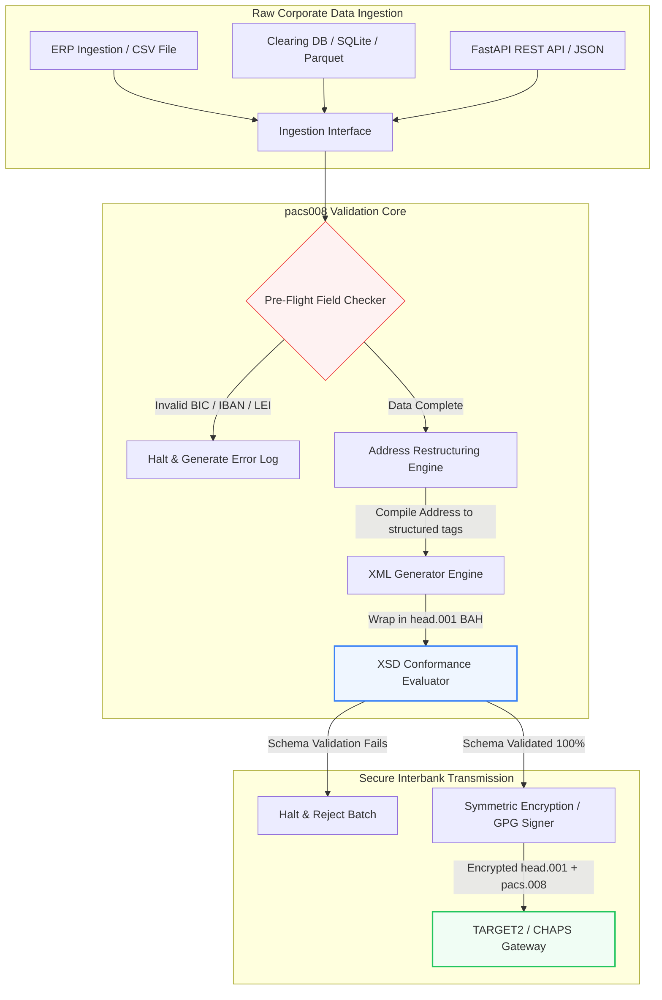

## خودکارسازی پرداخت‌های بین‌بانکی ISO 20022 pacs.008 با پایتون متن‌باز در سال ۲۰۲۶

پل‌زدن میان داده‌های مالی قدیمی و پیام‌رسانی ساختاریافته‌ی بین‌بانکی از طریق یک خط‌لوله‌ی پایتون قابل‌ممیزی و اعتبارسنجی‌شده با اسکیما.

نقطه‌ی مرجع متن‌باز این مقاله [pacs008 ⧉](https://github.com/sebastienrousseau/pacs008 "pacs008 — open-source Python library") است. این مخزن به‌عنوان یک کتابخانه‌ی پایتون برای خودکارسازی پیام‌های XML انتقال اعتباری مشتری میان مؤسسات مالی (FI-to-FI) بر پایه‌ی [ISO 20022](/2023-09-29-automating-iso-20022-compliant-payment-file-creation-with-pain001/index.html) pacs.008 معرفی شده است.

## چرا این پروژه‌ی متن‌باز در سال ۲۰۲۶ اهمیت دارد

زیرساخت جهانی تسویه‌ی پرداخت‌های بین‌بانکی ژرف‌ترین نوسازی خود در نزدیک به نیم قرن اخیر را پشت سر می‌گذارد.

در ژوئن ۲۰۲۶، بخش خدمات مالی به‌سرعت به **پرتگاه آدرس ساختاریافته‌ی SWIFT در ۱۴ نوامبر ۲۰۲۶** نزدیک می‌شود. از این تاریخ به بعد، دستورالعمل‌های SWIFT CBPR+ به‌همراه TARGET2، CHAPS، Fedwire و Lynx کانادا به‌طور رسمی خطوط آدرس پستی بدون‌ساختار (استفاده‌ی صرف از `<AdrLine>` درون بلوک‌های `<PstlAdr>`) را از رده خارج می‌کنند. همه‌ی مؤسسات مالی شرکت‌کننده باید آدرس‌ها را یا در قالب ترکیبی (عناصر ساختاریافته‌ی `<TwnNm>` و `<Ctry>` به‌همراه حداکثر دو عنصر `<AdrLine>` برای جزئیات باقی‌مانده) یا در قالب کاملاً ساختاریافته (عناصر مجزا برای نام خیابان، شماره‌ی ساختمان و کد پستی) ارسال کنند. هر پیامی که این معیار را برآورده نکند در مرز شبکه رد خواهد شد.

برای مؤسسات مالی، این گذار محدودیت‌های عملیاتی عمده‌ای پدید می‌آورد:

1. **جریمه‌ی رد شدن در مرز.** پرداخت‌هایی که معیارهای آدرس ساختاریافته را برآورده نکنند بلافاصله در شبکه رد می‌شوند و این امر تأخیر تراکنش‌ها، انسداد نقدینگی و انباشت‌های عملیاتی را در پی دارد.
2. **تأیید ذی‌نفع در SEPA (VoP).** این مقرره تمام ارائه‌دهندگان خدمات پرداخت (PSPها) درون منطقه‌ی SEPA را ملزم می‌کند که پیش از اجرای انتقال‌های اعتباری، تطابق میان نام ذی‌نفع و IBAN را تأیید کنند و این یک دروازه‌ی اعتبارسنجی دیگر به آغاز پیام می‌افزاید.

[Pacs008](https://github.com/sebastienrousseau/pacs008) این مشکل را حل می‌کند. این یک کتابخانه‌ی پایتون سبک و متن‌باز است که تبدیل داده‌های مالی خام را به پیام‌های انتقال اعتباری مشتری بین‌بانکی ISO 20022 pacs.008، که به‌طور کامل اعتبارسنجی‌شده و منطبق با اسکیما هستند، خودکار می‌کند. با پل‌زدن شکاف میان داده‌های قدیمی و ساختاریافته، pacs008 بازده تاب‌آوری (RoR) بالایی ارائه می‌دهد، سرمایه در گردش را حفظ می‌کند و اجرای بلادرنگ را در سراسر ریل‌های جهانی تضمین می‌کند.

## چرا pacs008 را این‌گونه ساختم

`pacs008` و خواهر بالادستی‌اش `pain001` را خودم نوشته‌ام، و زندگی کاری‌ام در
پرداخت‌های عمده و مدیریت محصول رابط‌های برنامه‌نویسی می‌گذرد. همین ترکیب است که
شکل امروزی این کتابخانه را رقم زده؛ پس بهتر است این انتخاب‌ها به‌صراحت گفته شوند
تا آنکه در دل کد پنهان بمانند.

**اعتبارسنجی پیش از تولید اجرا می‌شود، نه پس از آن.** غریزهٔ رایج در بیشتر
سامانه‌های پرداخت این است که نخست پیام ساخته شود و سپس بررسی گردد، چون چرخهٔ
بازبینی این‌گونه شکل گرفته است: پرونده‌ای تولید می‌شود، کسی نگاهی می‌اندازد، و
استثناها به صف می‌روند. این ترتیب تضمین می‌کند که عیب‌ها در کم‌اثرترین نقطه پیدا
شوند: پس از آنکه کار سرهم‌کردن پیام تمام شده و، بیشتر اوقات، پس از آنکه پیام
سازمان را ترک کرده است. اعتبارسنجی نخست یعنی نشانی ناسازگار یا IBAN بدشکل به‌جای
رد شدن از سوی شبکه، به شکست ساخت بدل می‌شود.

**پروانه MIT است چون بانک‌ها باید منطق اعتبارسنجی را بخوانند، نه به آن اعتماد
کنند.** اعتبارسنج بسته از سازمان می‌خواهد قرائت شخص دیگری از دستورالعمل‌های
کاربرد را از سر اعتماد بپذیرد. این خواسته از تیمی که تعهد نظارتی بر دوش دارد
معقول نیست. هر قاعده در این کتابخانه را می‌توان بازرسی کرد، به چالش کشید و
انشعاب داد.

**اعتبارسنجی در برابر شِماهای رسمی XSD انجام می‌شود، نه با پیاده‌سازی دوباره.**
هر تقریب دست‌نویس از قواعد ISO 20022 همان لحظه که یکی از دو سو تغییر کند از
پیمان واقعی شبکه فاصله می‌گیرد. شِما خودِ پیمان است؛ هر چیز دیگری منبع دوم حقیقت
است که منتظر تناقض نشسته.

**هدفش CI است، نه یک گام بازبینی.** اعتبارسنجی که آدمی باید اجرایش را به یاد
بیاورد، همان اعتبارسنجی است که زیر فشار مهلت‌ها اجرا نمی‌شود؛ دقیقاً همان‌جا که
بیش از همه اهمیت دارد.

آنچه کتابخانه عمداً انجام نمی‌دهد نیز به همان اندازه عمدی است. این یک جعبه‌ابزار
در لایهٔ پیام است. جای موتور پرداخت، سامانهٔ پالایش تحریم‌ها، یا اصلاح داده‌های
مرجع مشتری را که سازمان باید در سرچشمه انجام دهد نمی‌گیرد. آن اصلاح را
قابل‌الزام می‌کند، اما به‌جای شما انجامش نمی‌دهد.

## منظر معماری pacs008 در سال ۲۰۲۶

کتابخانه‌ی pacs008 به‌عنوان یک موتور اعتبارسنجی و تولید عایق‌بندی‌شده ساختاردهی شده است تا اطمینان دهد ورودی‌های خام به‌صورت نظام‌مند تجزیه، غنی‌سازی و در پاکت‌های استاندارد بسته‌بندی می‌شوند:

| لایه | تصمیم طراحی | چرا اهمیت دارد | ریسک در صورت مدیریت نادرست |
|---|---|---|---|
| **لایه‌ی ورودی** | دریافت CSV، JSON، SQLite و Parquet | تیم‌های یکپارچه‌سازی بانکی را همان‌جا که داده‌شان از پیش قرار دارد ملاقات می‌کند و از مهاجرت‌های پلتفرمی جلوگیری می‌کند. | دریافت بار داده‌ی خام، اعتبارسنجی‌نشده یا مخدوش. |
| **لایه‌ی اعتبارسنجی** | اعتبارسنجی پیش‌پروازی در برابر اسکیماهای رسمی XSD و قواعد کسب‌وکار سفارشی | پیش از ارسال فایل پرداخت به شبکه‌ی تسویه، اجرا را متوقف و خطاها را نشانه‌گذاری می‌کند. | فایل‌های XML نامعتبر که ردهای فوری شبکه و تأخیر تسویه را برمی‌انگیزند. |
| **لایه‌ی پاکت BAH** | بسته‌بندی خودکار سرآیند کاربردی کسب‌وکار (head.001) | ارسال و مسیریابی پیام را بر پایه‌ی برچسب `<MsgDefIdr>` استانداردسازی می‌کند. | ارسال بارهای خام pacs.008 بدون پاکت بیرونی موردنیاز که موجب رد شدن سیستم می‌شود. |
| **لایه‌ی سریال‌سازی** | پشتیبانی از XML استاندارد و JSON منطبق با ISO (TS 23029) | امکان ترجمه‌ی مستقیم میان بارهای XML و JSON را فراهم می‌کند و از REST API مدرن و جریان‌سازی Kafka پشتیبانی می‌کند. | بازنمایی‌های داده‌ی پراکنده که ناقض دستورالعمل‌های رسمی ISO هستند. |
| **لایه‌ی مشاهده‌پذیری** | ردیابی OpenTelemetry مبتنی بر کلید UETR | مسیرهای اجرا و گزارش‌های دقیق را ثبت می‌کند و قابلیت ممیزی بلادرنگ فراهم می‌آورد. | شکاف‌های ردیابی که دیده‌بانی عملیاتی و ممیزی را مسدود می‌کنند. |

## سیگنال‌های کلیدی بین‌بانکی و نقاط عطف نظارتی

برای نشان‌دادن تاب‌آوری عملیاتی تراکنش‌ها، مدیران ارشد فناوری و ریسک باید شاخص‌های انطباق مشخص و قابل‌سنجش را رصد کنند:

| سیگنال | معیار / محک عملیاتی | مرجع G20 / SWIFT / DORA | پیاده‌سازی در پلتفرم فنی |
|---|---|---|---|
| **انطباق آدرس ساختاریافته** | درصد پیام‌های pacs.008 که از فیلدهای کاملاً ساختاریافته‌ی `<PstlAdr>` با `<TwnNm>` و `<Ctry>` تعیین‌شده استفاده می‌کنند. | مهلت SWIFT SR 2026 | بررسی‌های پیش‌پروازی اسکیما در pacs008 که خطوط آدرس بدون‌ساختار را رد می‌کند. |
| **تأیید ذی‌نفع در SEPA** | اعتبارسنجی تطابق میان نام ذی‌نفع و IBAN پیش از اجرای پیام. | مقرره‌ی SEPA VoP | کلاس‌های کمکی درون‌ساخت VoP که پرس‌وجوهای پیش‌اعتبارسنجی را روی IBAN/BIC اجرا می‌کنند. |
| **یکپارچه‌سازی BAH head.001** | درصد بارهای پرداخت خروجی که با موفقیت در سرآیندهای کاربردی کسب‌وکار بسته‌بندی می‌شوند. | دستورالعمل‌های TARGET2 / CBPR+ | زیرسیستم بسته‌بندی BAH که پاکت XML بیرونی را به‌طور خودکار می‌سازد. |
| **رقم کنترلی مدولوی LEI** | اعتبارسنجی رقم کنترلی ISO 7064 Modulo 97-10 روی بلوک‌های `<LEI>` بدهکار و بستانکار. | الزام بانک انگلستان | بررسی‌کننده‌ی الگوریتمی که یکپارچگی شناسه‌ی ۲۰ کاراکتری را تأیید می‌کند. |
| **دقت ردیابی UETR** | تزریق مرجع تراکنش سرتاسری یکتای معتبر به ۱۰۰٪ پرداخت‌های تولیدشده. | مشخصات UETR در SWIFT | تولید و ردیابی خودکار کد مرجع ۳۶ کاراکتری UUIDv4. |

## چرا پایتون مسیر ورود ایده‌آل برای خودکارسازی بین‌بانکی است

مراکز پرداخت مدرن و تیم‌های عملیات خزانه‌داری در سال ۲۰۲۶ به‌شدت برای تبدیل داده، مدل‌سازی مالی و یکپارچه‌سازی پایگاه‌داده‌ی ERP به پایتون تکیه می‌کنند.

با بهره‌گیری از یک کتابخانه‌ی پایتون متن‌باز، مؤسسات به مزایای چشمگیری دست می‌یابند:

1. **بار شناختی کم و قابلیت هم‌کنش‌پذیری بالا.** پایتون همچون پلی منسجم عمل می‌کند. به توسعه‌دهندگان امکان می‌دهد اسکریپت‌های ساده‌ای بنویسند که دستورهای پرداخت خام را از پایگاه‌داده‌های قدیمی بیرون می‌کشند، آن‌ها را در برابر قواعد پیچیده‌ی بانکداری بین‌المللی اعتبارسنجی می‌کنند و XML منطبق را درون یک جریان کاری یکپارچه و واحد تولید می‌کنند.
2. **حذف مترجم‌های مبهم «جعبه‌سیاه».** درگاه‌های بانکی اختصاصی اغلب برای مترجم‌های سفارشی فایل پرداخت هزینه‌های مجوز بالایی مطالبه می‌کنند. این مترجم‌ها جعبه‌سیاه‌های اختصاصی هستند و ممیزی این‌که داده چگونه پردازش می‌شود یا کلیدها کجا ذخیره می‌شوند را برای تیم‌های امنیتی ناممکن می‌سازند. یک کتابخانه‌ی متن‌باز و قابل‌بازرسی مانند pacs008 شفافیت کامل کد را تضمین می‌کند.
3. **یکپارچه‌سازی روان با CI/CD.** Pacs008 به‌طور مستقیم در خط‌لوله‌های یکپارچه‌سازی و استقرار پیوسته ادغام می‌شود و به توسعه‌دهندگان امکان می‌دهد آزمون فایل پرداخت را به‌عنوان بخشی از چرخه‌ی استاندارد تحویل نرم‌افزار خودکار کنند.

## طراحی یک خط‌لوله‌ی بین‌بانکی محدودشده

یک آسیب‌پذیری عمده در تسویه‌ی بین‌بانکی «تولید دسته‌ای مهارنشده» است، یعنی تولید فایل‌ها بدون یک حلقه‌ی راستی‌آزمایی روشن و محدودشده. Pacs008 طراحی شده است تا به‌عنوان موتور اعتبارسنجی هسته‌ای درون یک خط‌لوله‌ی تراکنش چندمرحله‌ای و به‌شدت کنترل‌شده عمل کند.

جریان عملیاتی زیر نشان می‌دهد که چگونه داده‌ی تراکنشی خام از خط‌لوله‌ی pacs008 عبور می‌کند تا یک فایل pacs.008 امن از نظر رمزنگاری و منطبق با اسکیما را که در یک پاکت BAH بسته‌بندی شده تولید کند:

## راهنمای هیئت‌مدیره و مسئولیت امانی

خودکارسازی پرداخت بین‌بانکی یک موضوع مدیریت ریسک و حاکمیت شرکتی در سطح هیئت‌مدیره است. مدیران ارشد باید کیفیت داده‌ی تراکنش را از منظر مسئولیت امانی و کاهش ریسک عملیاتی بررسی کنند:

- **ماده‌ی ۵ DORA (پاسخگویی هیئت‌مدیره).** مسئولیت مستقیم و شخصی را در قبال تاب‌آوری و امنیت عملیات فناوری اطلاعات و ارتباطات (ICT) مؤسسه بر عهده‌ی اعضای هیئت‌مدیره می‌گذارد. از آنجا که تسویه‌ی بین‌بانکی یک کارکرد حیاتی شرکتی است، هیئت‌مدیره‌ها باید نشان دهند که کنترل‌های تراکنشی استوار، اعتبارسنجی‌شده و خودکار را برای پیشگیری از اختلال‌های عملیاتی یا پرداخت‌های به‌تأخیرافتاده پیاده کرده‌اند.
- **BCBS 239 (تجمیع و گزارش‌دهی داده‌ی ریسک).** ایجاب می‌کند که گزارش‌دهی تراکنش‌های مالی دقیق، کامل و به‌صورت بلادرنگ تولید شود. Pacs008 با تضمین این‌که داده‌ی پرداخت در منبع به‌طور تمیز ساختاریافته و اعتبارسنجی می‌شود، به مؤسسات کمک می‌کند به انطباق با BCBS 239 دست یابند و شکاف‌های داده و خطاهای مغایرت‌گیری دستی را که صفحه‌گسترده‌های قدیمی گرفتار آن‌اند از میان بردارند.
- **کاهش هزینه‌های سرمایه‌ی ریسک عملیاتی (Basel III).** بر اساس دستورالعمل‌های Basel III، نرخ بالای خطای پرداخت و سربار مداخله‌ی دستی، الزامات سرمایه‌ی ریسک عملیاتی بانک را افزایش می‌دهد و سرمایه‌ای را که در غیر این صورت می‌توانست به وام‌دهی یا سرمایه‌گذاری اختصاص یابد قفل می‌کند. خودکارسازی خط‌لوله‌ی پرداخت مستقیماً این حق‌بیمه‌های سرمایه‌ای را به کمینه می‌رساند و ارزش ترازنامه را حفظ می‌کند.

## این برای هر نوع بانک چه معنایی دارد

### بانک‌های دارای اهمیت سیستمی جهانی (G-SIBها)

G-SIBها حجم عظیمی از تراکنش‌های شرکتی فرامرزی را مدیریت می‌کنند. چالش اصلی آن‌ها اصلاح داده‌ی قدیمی بدون‌ساختار پیش از رسیدن به شبکه‌ی تسویه است. G-SIBها با ادغام pacs008 در درگاه‌های بانکداری شرکتی خود می‌توانند ابزارهای اعتبارسنجی خودکار را در اختیار مشتریان شرکتی خود بگذارند، سربار تعمیرهای دستی پرداخت را کاهش دهند و اجرای بلادرنگ را در سراسر شبکه‌ی SWIFT تضمین کنند.

### بانک‌های تراکنشی و شرکتی

برای بانک‌های تراکنشی، کیفیت داده‌ی پرداخت یک عامل تمایز رقابتی است. این بانک‌ها با ارائه‌ی یک ابزار اعتبارسنجی متن‌باز و قابل‌بازرسی مانند pacs008 به مشتریان خزانه‌داری شرکتی می‌توانند فرایند پذیرش را شتاب دهند، ردهای فایل پرداخت را به کمینه برسانند و از طریق نرخ‌های برتر پردازش سرتاسری (STP) اعتماد مشتری را بسازند.

### بانک‌های منطقه‌ای و کوچک‌تر

بانک‌های منطقه‌ای باید بدون بودجه‌های عظیم فناوری G-SIBها با استانداردهای بین‌المللی پرداخت منطبق بمانند. Pacs008 یک راه‌حل مبتنی بر پایتون سبک، مقرون‌به‌صرفه و کاملاً منطبق فراهم می‌کند و به مؤسسات کوچک‌تر امکان می‌دهد بدون مجوزهای گران میان‌افزارهای اختصاصی، قابلیت‌های مدرن و ساختاریافته‌ی آغاز پرداخت را ارائه دهند.

## نتیجه‌گیری: نقشه‌راه تسویه‌ی بین‌بانکی

مهلت پیشِ‌روی آدرس ساختاریافته‌ی SWIFT در نوامبر ۲۰۲۶ یک مرز قطعی برای عملیات خزانه‌داری شرکتی است. تکیه بر صفحه‌گسترده‌های قدیمی، ورود دستی داده و فایل‌های پرداخت بدون‌ساختار یک ریسک فعال کسب‌وکاری است.

برای تضمین تداوم تراکنش و به کمینه رساندن سربار عملیاتی، مدیران ارشد فناوری و مالی باید همین امروز یک نقشه‌راه تسویه‌ی روشن را اجرا کنند:

1. **اعمال اعتبارسنجی در منبع.** الزام کنید که همه‌ی دستورهای پرداخت پیش از خروج از مرزهای ERP شرکتی، مطابق با اسکیماهای رسمی ISO 20022 XSD اعتبارسنجی و قالب‌بندی شوند.
2. **ممیزی خط‌لوله‌ی داده.** از پردازش دستی صفحه‌گسترده فاصله بگیرید و جریان‌های کاری خودکار و قابل‌بازرسی مبتنی بر پایتون را با استفاده از pacs008 پیاده کنید.
3. **پیاده‌سازی امنیت ترکیبی.** اطمینان یابید که فایل‌های پرداخت تولیدشده پیش از انتقال به‌صورت رمزنگاری امضا و رمزگذاری می‌شوند تا انتظارات شبکه‌ی بی‌اعتماد (zero-trust) برآورده شود.
4. **همسویی با اولویت‌های امانی.** سنجه‌های خودکارسازی پرداخت و کیفیت داده را به‌طور رسمی به هیئت‌مدیره گزارش کنید و این سرمایه‌گذاری را به‌عنوان یک برنامه‌ی حیاتی کاهش ریسک عملیاتی ذیل DORA چارچوب‌بندی نمایید.

## پرسش‌های پرتکرار

**آیا pacs008 با قواعد آدرس پیشِ‌روی SWIFT SR 2026 منطبق است؟**

بله. Pacs008 طراحی شده است تا از نقطه‌عطف سختگیرانه‌ی آدرس ساختاریافته‌ی SWIFT در نوامبر ۲۰۲۶ پشتیبانی کند و جداسازی اجباری عناصر آدرس پستی (شهر، کشور، کد پستی) را به فیلدهای تعیین‌شده‌ی XML در ISO 20022 اعمال می‌کند.

**آیا pacs008 می‌تواند بارهای پرداخت را در سرآیندهای کاربردی کسب‌وکار بسته‌بندی کند؟**

بله. از آنجا که pacs008 به‌طور بومی از بسته‌بندی سرآیند کاربردی کسب‌وکار (BAH head.001) پشتیبانی می‌کند، پاکت بیرونی موردنیاز شبکه‌های TARGET2، CHAPS و CBPR+ را به‌طور خودکار می‌سازد.

**چرا یک کتابخانه‌ی متن‌باز بر مترجم‌های فایل اختصاصی ترجیح دارد؟**

مترجم‌های اختصاصی جعبه‌سیاه‌های مبهم‌اند و ممیزی‌های امنیتی را ناممکن می‌سازند. یک کتابخانه‌ی متن‌باز و مرورشده توسط همتایان مانند pacs008 شفافیت کامل کد را ارائه می‌دهد و به تیم‌های امنیتی امکان می‌دهد تأیید کنند که هیچ داده‌ی حساس پرداختی در حین پردازش افشا نمی‌شود.

**pacs008 چه شناسه‌هایی را اعتبارسنجی می‌کند؟**

Pacs008 با اعتبارسنج‌های درون‌ساخت برای کدهای شناسایی بانک (BICها) و شناسه‌های نهاد حقوقی (LEIها) با استفاده از محاسبات رقم کنترلی ISO 7064 Modulo 97-10، به‌همراه اعتبارسنجی رقم کنترلی IBAN و بررسی یکتایی UETR عرضه می‌شود.

## منابع

- SWIFT, (2024). *ISO 20022 November 2026 Structured Address Milestone*. La Hulpe: SWIFT. در دسترس در: [SWIFT ISO 20022 Milestone ⧉](https://www.swift.com/standards/iso-20022/iso-20022-bytes/call-action-november-2026 "SWIFT ISO 20022 milestone").
- Basel Committee on Banking Supervision (BCBS), (2013). *Principles for effective risk data aggregation and risk reporting (BCBS 239)*. Basel: Bank for International Settlements. در دسترس در: [BCBS 239 Principles ⧉](https://www.bis.org/publ/bcbs239.htm "BCBS 239 principles").
- European Parliament and Council of the European Union, (2022). *Regulation (EU) 2022/2554 on digital operational resilience for the financial sector (DORA)*. Brussels: Official Journal of the European Union. در دسترس در: [DORA Regulation ⧉](https://eur-lex.europa.eu/legal-content/EN/TXT/?uri=CELEX%3A32022R2554 "DORA regulation").
- GitHub, (2026). *pacs008 open-source repository*. در دسترس در: [pacs008 Repository ⧉](https://github.com/sebastienrousseau/pacs008 "pacs008 repository").
