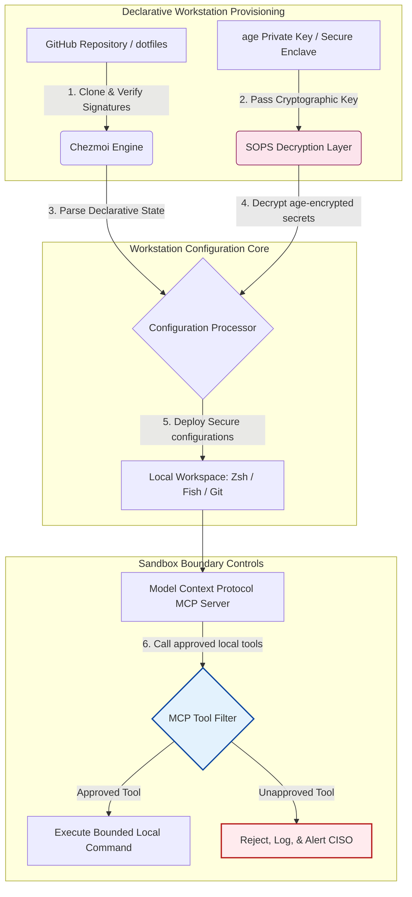

## dotfilesهای آگاه به هوش مصنوعی در �2026: ساخت یک ایستگاه کاری توسعه‌دهنده امن و بازتولیدپذیر برای MCP، SLSA و برابری چند-پوسته‌ای

پُر کردن شکاف میان پیکربندی اعلانی ایستگاه کاری و زنجیره‌های تأمین نرم‌افزار امن در عصر مدل‌های هوش مصنوعی محلی و ابزارهای توسعه‌دهنده‌ی عامل‌محور.

مرجع متن‌باز این مقاله [dotfiles ⧉](https://github.com/sebastienrousseau/dotfiles "dotfiles — declarative workstation configuration") است. این مخزن این‌گونه معرفی می‌شود: dotfilesهای اعلانی برای macOS، Linux و WSL، که برابری چند-پوسته‌ای، راه‌اندازی زیر یک ثانیه، انتشارهای امضاشده با SLSA و پیکربندی آگاه به AI/MCP را ارائه می‌دهد.

## چرا این پروژه متن‌باز در ۲۰۲۶ اهمیت دارد

در ژوئن ۲۰۲۶، ایستگاه کاری توسعه‌دهنده ضعیف‌ترین حلقه در زنجیره تأمین نرم‌افزار و یک هدف پرارزش برای سندیکاهای سایبری پیچیده‌ی تحت حمایت دولت‌ها و مجرمانه است.

چشم‌انداز امنیتی محیط توسعه با ظهور دستیارهای کدنویسی هوش مصنوعی مبتنی بر ترمینال (مانند Claude Code) و پذیرش پروتکل زمینه مدل (MCP) به‌طور بنیادین دگرگون شده است. ترمینال‌های محلی توسعه‌دهنده اکنون میزبان عامل‌های هوش مصنوعی فعال و خودمختاری هستند که قادرند:

- فایل‌های منبع محلی را بخوانند و ویرایش کنند.
- ابزارهای CLI محلی (`git`، `npm`، `aws`، `kubectl`) را فراخوانی کنند.
- متغیرهای محیطی پوسته، پایگاه‌های داده‌ی محلی و تنظیمات پیکربندی را بازرسی کنند.

اگر محیط محلی توسعه‌دهنده فاقد مرزهای سخت‌گیرانه باشد، این ابزارهای هوش مصنوعی خودمختار می‌توانند به‌طور ناخواسته داده‌های شخصی حساس را بخوانند، اعتبارنامه‌های ابری را به APIهای عمومی LLM نشت دهند، یا در حین ساخت‌های خودکار بسته‌های مخرب را اجرا کنند.

بر اساس قانون تاب‌آوری عملیاتی دیجیتال (DORA) و چارچوب امنیت سایبری NIST (CSF) 2.0، مؤسسات مالی به‌لحاظ قانونی موظف‌اند منشأ و یکپارچگی امنیتی هر دستگاهی را که به زنجیره تأمین نرم‌افزار دسترسی دارد، تأیید کنند. «لپ‌تاپ‌های دانه‌برفی» — پیکربندی‌های دستی، حسابرسی‌نشده و در حال انحراف — دیگر با استانداردهای بانکداری جهانی سازگار نیستند.

[dotfiles سباستین روسو](https://github.com/sebastienrousseau/dotfiles) این مشکل را حل می‌کند. این یک چارچوب مدیریت ایستگاه کاری متن‌باز و اعلانی است که ایستگاه‌های کاری توسعه‌دهنده‌ی امن و بازتولیدپذیر را برقرار می‌سازد. با تحمیل یک خط‌مبنای پیکربندی استاندارد و قابل‌حسابرسی، این پروژه بازده تاب‌آوری (RoR) بالایی را ارائه می‌دهد، زمان استقرار توسعه‌دهنده‌ی جدید را از هفته‌ها به ساعت‌ها کاهش می‌دهد و زنجیره‌های تأمین مالی حساس را از آسیب‌پذیری‌های نقطه‌ی پایانی محافظت می‌کند.

## عدسی معماری ایستگاه کاری آگاه به هوش مصنوعی ۲۰۲۶

چارچوب dotfiles به‌عنوان یک مدیر محیط اعلانی و امن عمل می‌کند — تمام پوسته‌ها، ابزارها و رازهای محلی به‌صورت سیستماتیک مدیریت، حسابرسی و ایزوله می‌شوند:

| لایه | تصمیم طراحی | چرا اهمیت دارد | ریسک در صورت مدیریت نادرست |
|---|---|---|---|
| **لایه‌ی تأمین** | مدیریت پیکربندی اعلانی از طریق Chezmoi | ایستگاه‌های کاری کاملاً بازتولیدپذیر را در macOS، Linux و WSL می‌سازد و انحراف را حذف می‌کند. | پیکربندی‌های دانه‌برفی با حالت‌های محلی حسابرسی‌نشده و آسیب‌پذیر. |
| **لایه‌ی پوسته** | برابری چند-پوسته‌ای (Zsh، Fish، Nushell) | راه‌اندازی یکسان و زیر یک ثانیه و رفتار سازگار نام‌مستعارها را در محیط‌های مختلف تضمین می‌کند. | ناهماهنگی‌های فرمان پوسته که به نتایج غیرمنتظره‌ی اسکریپت می‌انجامد. |
| **لایه‌ی رازها** | رمزنگاری فایل با استفاده از SOPS و age | از سپردن اعتبارنامه‌های ثابت‌کدشده و کلیدهای خام به Git یا در معرض قرارگیری آن‌ها برای LLMهای محلی جلوگیری می‌کند. | نشت اعتبارنامه‌ها به تاریخچه‌های مخزن عمومی یا به‌خطر افتادن آن‌ها توسط عامل‌های محلی. |
| **لایه‌ی AI/MCP** | کنترل‌های مرزی پروتکل زمینه مدل | عامل‌های هوش مصنوعی محلی را به فهرست مشخصی از ابزارهای تأییدشده محدود می‌کند و تمام اجراهای محلی را ثبت می‌کند. | عامل‌های هوش مصنوعی بی‌مرز که فرمان‌های افسارگسیخته یا مخرب را به‌صورت محلی اجرا می‌کنند. |
| **لایه‌ی زنجیره تأمین** | انتشارهای امضاشده با SLSA و راستی‌آزمایی Sigstore | اصالت اسکریپت‌های راه‌اندازی و فایل‌های پیکربندی را به‌صورت رمزنگاری‌شده اثبات می‌کند. | اسکریپت‌های راه‌اندازی به‌خطر افتاده که درهای پشتی مخرب را به محیط‌های توسعه‌دهنده تزریق می‌کنند. |

## سیگنال‌های کلیدی امنیت و خودکارسازی ایستگاه کاری

برای حفظ امنیت مطلق در سراسر مجموعه‌ی توسعه، مدیران ارشد امنیت اطلاعات (CISOها) و مدیران فناوری باید شاخص‌های عملیاتی مشخص و کمّی‌پذیری را رصد کنند:

| سیگنال | معیار / محک عملیاتی | مرجع NIST CSF / DORA | پیاده‌سازی فنی سکو |
|---|---|---|---|
| **بازتولیدپذیری ایستگاه کاری** | درصد لپ‌تاپ‌های توسعه‌دهنده که به‌طور کامل از طریق مخازن اعلانی dotfile بدون انحراف پیکربندی مدیریت می‌شوند. | NIST CSF 2.0 (PR.DS-01) | حسابرسی‌های تشخیص انحراف Chezmoi که به‌صورت خودکار در راه‌اندازی ترمینال اجرا می‌شوند. |
| **بهداشت اعتبارنامه** | صفر راز یا کلید رمزنگاری‌نشده‌ی ذخیره‌شده به‌صورت متن ساده در سراسر فایل‌های پیکربندی محلی. | DORA ماده ۶ (امنیت ICT) | قلاب‌های پیش-از-سپردن Git و پویش‌های محلی که فایل‌های رمزنگاری‌نشده را رد می‌کنند. |
| **منشأ ساخت** | راستی‌آزمایی ۱۰۰٪ ابزارهای راه‌اندازی ایستگاه کاری با استفاده از مانیفست‌های امضاشده‌ی رمزنگاری‌شده. | DORA ماده ۳۰ (زنجیره تأمین) | راستی‌آزمایی Sigstore و SLSA سطح ۳ تعبیه‌شده در خطوط لوله‌ی راه‌اندازی. |
| **زمان استقرار توسعه‌دهنده** | زمان سپری‌شده از تأمین سخت‌افزار خام تا یک فضای کاری توسعه‌ی کاملاً پیکربندی‌شده و منطبق. | بازده تاب‌آوری (RoR) | اسکریپت‌های راه‌اندازی خودکار و اعلانی که محیط را در کمتر از ۱۵ دقیقه کامپایل می‌کنند. |
| **دسترسی محدودشده‌ی عامل هوش مصنوعی** | راستی‌آزمایی این‌که ابزارهای هوش مصنوعی محلی در محدوده‌های پوشه‌ای تعریف‌شده با پیش‌فرض‌های فقط-خواندنی عمل می‌کنند. | مدیریت ریسک مدل | پروفایل‌های پیکربندی MCP که کاتالوگ ابزار عامل را به عملیات تأییدشده محدود می‌کنند. |

## چرا پیکربندی اعلانی هسته‌ی امنیت ایستگاه کاری است

رویکردهای سنتی به راه‌اندازی ایستگاه کاری توسعه‌دهنده به‌شدت دستی هستند و به «لپ‌تاپ‌های دانه‌برفی» می‌انجامند — محیط‌هایی که پیکربندی‌هایشان با گذر زمان دچار انحراف می‌شود، زیرا توسعه‌دهندگان ابزارهای سفارشی نصب می‌کنند، متغیرها را تنظیم می‌کنند و اسکریپت‌های محلی را تغییر می‌دهند. این انحراف چند آسیب‌پذیری حیاتی ایجاد می‌کند:

1. **پیکربندی‌های سایه‌ی ردیابی‌نشده.** لپ‌تاپ‌های در حال انحراف اغلب بسته‌های نرم‌افزاری منسوخ و آسیب‌پذیر یا اسکریپت‌های محلی‌ای را اجرا می‌کنند که ابزارهای امنیتی سازمانی را دور می‌زنند.
2. **نشت رازها.** توسعه‌دهندگان مکرراً کلیدهای API، توکن‌های GitHub یا اعتبارنامه‌های AWS را مستقیماً در اسکریپت‌های متن ساده یا پروفایل‌های پوسته ثابت‌کد می‌کنند و آن‌ها را به‌شدت در برابر سرقت آسیب‌پذیر می‌سازند.
3. **استقرار ناکارآمد.** راه‌اندازی دستی یک ایستگاه کاری توسعه‌دهنده‌ی جدید می‌تواند تا دو هفته زمان مهندسی ببرد و بر سرعت تیم تأثیر بگذارد.

با گذار به یک پیکربندی اعلانی و مدل‌محور با استفاده از Chezmoi، کل فضای کاری توسعه‌دهنده به یک سیستم ثبت نسخه‌بندی‌شده و بازتولیدپذیر تبدیل می‌شود. هر تغییر، نام‌مستعار، وابستگی بسته و پیش‌فرض امنیتی در Git مستند می‌شود، در برابر سیاست‌های انطباق سازمانی اعتبارسنجی می‌شود و پیش از اعمال بر لپ‌تاپ فیزیکی به‌صورت رمزنگاری‌شده راستی‌آزمایی می‌شود.

## طراحی یک محیط توسعه‌دهنده‌ی هوش مصنوعی محدودشده

برای جلوگیری از دستیابی عامل‌های هوش مصنوعی محلی و ابزارهای MCP به دسترسی بی‌مرز به دارایی‌های محلی، ایستگاه کاری باید به‌عنوان یک صفحه‌ی اجرای محدودشده عمل کند.

جریان عملیاتی زیر نشان می‌دهد که چگونه چارچوب dotfiles، Chezmoi، SOPS و age را هماهنگ می‌کند تا dotfilesهای امن را رمزگشایی و مستقر کند و در عین حال یک مرز اجرای ایزوله و جعبه‌شن‌شده را برای عامل‌های هوش مصنوعی محلی که ابزارهای MCP را فراخوانی می‌کنند حفظ نماید:

## راهنمای هیئت‌مدیره و مسئولیت امانی

امنیت ایستگاه کاری توسعه‌دهنده و یکپارچگی زنجیره تأمین از اولویت‌های حیاتی هیئت‌مدیره هستند. مدیران ارشد باید ریسک محیط توسعه‌دهنده را از دریچه‌ی مسئولیت امانی، انطباق مقرراتی و حفظ ارزش کسب‌وکار بررسی کنند:

- **DORA ماده ۵ (پاسخگویی هیئت‌مدیره).** مقرر می‌دارد که رکن مدیریتی (هیئت‌مدیره) مسئولیت نهایی مدیریت ریسک ICT مؤسسه را بر عهده دارد. از آن‌جا که ایستگاه‌های کاری توسعه‌دهنده دروازه‌ی ورود به زنجیره تأمین نرم‌افزار هستند، اعضای هیئت‌مدیره باید تأیید کنند که نقاط پایانی امن، کاملاً قابل‌حسابرسی و تحت چارچوب‌های پیکربندی سخت‌گیرانه و بازتولیدپذیر مدیریت می‌شوند تا الزامات حسابرسی‌های مقرراتی برآورده شود.
- **انطباق با NIST CSF 2.0 (امنیت نقطه‌ی پایانی).** ایجاب می‌کند که تنها دستگاه‌های مجاز و اعتبارسنجی‌شده، با اجرای پیکربندی‌های استاندارد و امن، بتوانند به شبکه‌ها و مخازن سازمانی دسترسی داشته باشند. dotfilesهای اعلانی به تیم‌های امنیتی اجازه می‌دهند به‌صورت ریاضی اثبات کنند که تمام محیط‌های توسعه‌دهنده با خط‌مبنای امنیتی سازمان منطبق‌اند و ریسک راه‌اندازی‌های «دانه‌برفی» حسابرسی‌نشده را حذف می‌کنند.
- **حفظ ارزش ترازنامه‌ای.** یک اعتبارنامه‌ی توسعه‌دهنده‌ی به‌خطر افتاده یا یک نقض زنجیره تأمین می‌تواند برای یک مؤسسه میلیون‌ها دلار هزینه‌ی جبران، جریمه‌ی مقرراتی و آسیب اعتباری به بار آورد. گذار به یک محیط توسعه‌دهنده‌ی امن و اعلانی این ریسک را مستقیماً به حداقل می‌رساند، ارزش ترازنامه‌ای را حفظ می‌کند و از اعتماد مشتری محافظت می‌کند.

## این برای هر نوع بانک چه معنایی دارد

### بانک‌های مهم سیستمی جهانی (G-SIBها)

G-SIBها هزاران ایستگاه کاری توسعه‌دهنده را در چندین قاره و حوزه‌ی قضایی مقرراتی مدیریت می‌کنند. چالش اصلی آن‌ها حفظ سازگاری پیکربندی و جلوگیری از نشت اعتبارنامه در سراسر تیم‌های مهندسی عظیم است. با پذیرش یک مدل dotfiles اعلانی و متن‌باز با استفاده از Chezmoi، G-SIBها می‌توانند امنیت نقطه‌ی پایانی را استاندارد کنند، حسابرسی انطباق را خودکار سازند و زمان استقرار توسعه‌دهنده را در سراسر سازمان جهانی از هفته‌ها به دقیقه‌ها کاهش دهند.

### بانک‌های تراکنشی و شرکتی

بانک‌های تراکنشی درگاه‌های پرداخت حساس و زیرساخت‌های تسویه‌ی عمده‌فروشی را اداره می‌کنند. اثبات یکپارچگی مطلق کدِ مستقرشده در این محیط‌های تولید یک الزام مقرراتی غیرقابل‌مذاکره است. استانداردسازی ایستگاه‌های کاری توسعه‌دهنده تحت یک چارچوب dotfiles امن و منطبق با SLSA تضمین می‌کند که زنجیره تأمین نرم‌افزار کاملاً حسابرسی‌شده و از آسیب‌پذیری‌های نقطه‌ی پایانی محلی توسعه‌دهنده محافظت‌شده است.

### بانک‌های منطقه‌ای و کوچک‌تر

بانک‌های منطقه‌ای باید استانداردهای امنیت سایبری بالایی را بدون بودجه‌های امنیتی عظیم G-SIBها حفظ کنند. این چارچوب dotfiles متن‌باز یک راه‌حل سبک، مقرون‌به‌صرفه و بسیار امن و سازگار با Python و Rust را ارائه می‌دهد و مؤسسات کوچک‌تر را قادر می‌سازد امنیت نقطه‌ی پایانی و حفاظت از زنجیره تأمین در سطح سازمانی را بدون مجوزهای نرم‌افزاری اختصاصی گران‌قیمت پیاده‌سازی کنند.

## نتیجه‌گیری: نقشه‌راه ایستگاه کاری توسعه‌دهنده

ایستگاه کاری توسعه‌دهنده دیگر یک دستگاه جانبی نیست؛ این یک صفحه‌ی کنترل حیاتی در زنجیره تأمین نرم‌افزار است. اجازه دادن به «لپ‌تاپ‌های دانه‌برفیِ» دستی‌پیکربندی‌شده و حسابرسی‌نشده برای دسترسی به دارایی‌های سازمانی یک ریسک عملیاتی و مقرراتی جدی است.

برای امن‌سازی زنجیره تأمین نرم‌افزار و محافظت از نقاط پایانی در برابر آسیب‌پذیری‌های عامل‌های هوش مصنوعی محلی، مدیران ارشد فناوری و امنیت باید همین امروز یک نقشه‌راه توسعه‌ی روشن را اجرا کنند:

1. **تأمین اعلانی را الزامی کنید.** فرآیندهای راه‌اندازی دستی و سندمحور را کنار بگذارید و الزام کنید که تمام محیط‌های توسعه‌دهنده به‌صورت اعلانی با استفاده از Chezmoi تأمین شوند.
2. **بهداشت رازها را اعمال کنید.** قلاب‌های پیش-از-سپردن سخت‌گیرانه و ابزارهای پویش را اعمال کنید تا صفر اعتبارنامه، کلید یا توکن API خام به‌صورت متن ساده در سراسر پیکربندی‌های ایستگاه کاری محلی ذخیره شود.
3. **مرزهای جعبه‌شن هوش مصنوعی را برقرار کنید.** پروفایل‌های پیکربندی امن و محدودشده‌ی MCP را پیاده‌سازی کنید تا دستیارها و عامل‌های کدنویسی هوش مصنوعی محلی را به ابزارها و پوشه‌های تأییدشده و فقط-خواندنی محدود کنید.
4. **زنجیره تأمین را امن کنید.** اطمینان حاصل کنید که تمام اسکریپت‌های راه‌اندازی و پیکربندی‌های محیط پیش از استقرار با استفاده از منشأ SLSA سطح ۳ به‌صورت رمزنگاری‌شده راستی‌آزمایی می‌شوند.

## پرسش‌های متداول

**Chezmoi چیست و چرا برای dotfiles استفاده می‌شود؟**

Chezmoi یک مدیر dotfile متن‌باز، امن و اعلانی است. این ابزار به توسعه‌دهندگان اجازه می‌دهد پیکربندی‌های محلی خود را به‌عنوان یک مخزن نسخه‌بندی‌شده مدیریت کنند و سازگاری و بازتولیدپذیری مطلق را در سیستم‌عامل‌های مختلف (macOS، Linux، WSL) تضمین می‌کند.

**این چارچوب چگونه از رازها محافظت می‌کند؟**

این چارچوب از رمزنگاری فایل SOPS (عملیات رازها) و age برای رمزنگاری اعتبارنامه‌های حساس (مانند توکن‌های GitHub یا کلیدهای دسترسی ابری) به‌طور مستقیم درون مخزن dotfile استفاده می‌کند. این کار از سپرده‌شدن کلیدها به‌صورت متن ساده یا خوانده‌شدن آن‌ها توسط عامل‌های هوش مصنوعی محلی غیرمجاز جلوگیری می‌کند.

**پروتکل زمینه مدل (MCP) چیست و چگونه بر امنیت تأثیر می‌گذارد؟**

MCP یک استاندارد باز است که به مدل‌های هوش مصنوعی اجازه می‌دهد ابزارهای محلی را به‌صورت ایمن اجرا کنند و به فایل‌ها دسترسی داشته باشند. چارچوب dotfiles فایل‌های پیکربندی سخت‌گیرانه‌ی MCP را پیاده‌سازی می‌کند تا ابزارها و عامل‌های هوش مصنوعی محلی را به پوشه‌ها و فرمان‌های تأییدشده محدود کند.

**این چارچوب از کدام پوسته‌ها پشتیبانی می‌کند؟**

Bash، Zsh، Fish، Nushell و PowerShell — با برابری در سراسر macOS، Linux و WSL تا رفتار فرمان صرف‌نظر از این‌که توسعه‌دهنده کدام ترمینال را باز می‌کند یکسان بماند.

## منابع

- بنیاد امنیت متن‌باز (OpenSSF)، (۲۰۲۴). *سطوح زنجیره تأمین برای مصنوعات نرم‌افزاری (SLSA)*. در دسترس در: [SLSA Framework ⧉](https://slsa.dev/ "SLSA framework").
- NIST، (۲۰۲۴). *چارچوب امنیت سایبری NIST 2.0*. گیترزبرگ: مؤسسه ملی استانداردها و فناوری. در دسترس در: [NIST CSF 2.0 ⧉](https://www.nist.gov/cyberframework "NIST Cybersecurity Framework 2.0").
- پارلمان اروپا و شورای اتحادیه اروپا، (۲۰۲۲). *مقرره (EU) 2022/2554 در باب تاب‌آوری عملیاتی دیجیتال برای بخش مالی (DORA)*. بروکسل: روزنامه رسمی اتحادیه اروپا. در دسترس در: [DORA Regulation ⧉](https://eur-lex.europa.eu/legal-content/EN/TXT/?uri=CELEX%3A32022R2554 "DORA regulation").
- GitHub، (۲۰۲۶). *مخزن متن‌باز dotfiles*. در دسترس در: [dotfiles Repository ⧉](https://github.com/sebastienrousseau/dotfiles "dotfiles repository").
