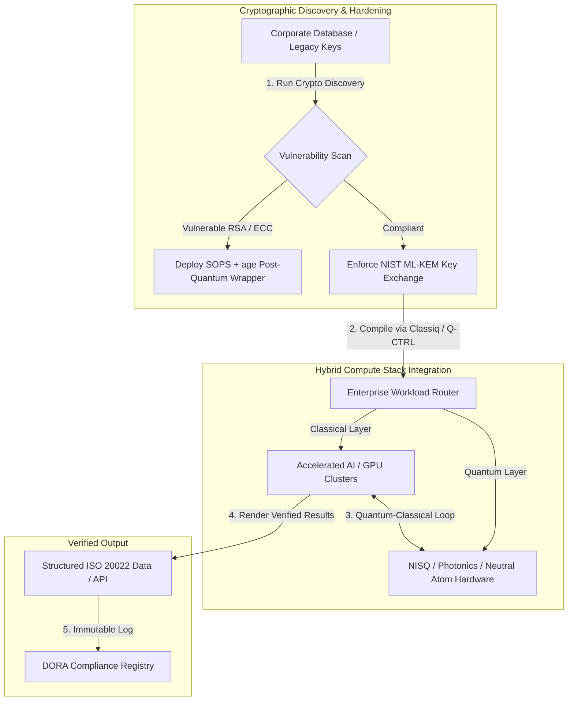

## از کیوبیت تا سود: جمع‌بندی‌های راهبردی از پنجمین اجلاس سالانهٔ اکونومیست با عنوان Commercialising Quantum Global 2026

آمادگی سازمانی، مهاجرت‌های رمزنگاری پساکوانتومی، پشته‌های رایانش ترکیبی، و چشم‌انداز تجاری نوظهور حسگری و شبکه‌سازی کوانتومی.

**خلاصه.** پنجمین کنفرانس سالانهٔ Commercialising Quantum Global 2026 که توسط Economist Impact در روزهای ۱۶ تا ۱۷ ژوئن ۲۰۲۶ در Business Design Centre در لندن برگزار شد، بیش از ۱٬۱۰۰ رهبر جهانی را از حوزه‌های سازمان، مالی، سیاست‌گذاری و پژوهش گرد هم آورد. مضمون محوری، چرخشی ساختاری و روشن را رقم زد: فناوری کوانتومی از دانش آزمایشگاهی گمانه‌زنانه به گردش‌کارهای سازمانی عملی و ترکیبی گذر کرده است. با پشتوانهٔ ۱٫۳ میلیارد دلار سرمایهٔ خطرپذیر جذب‌شده تنها در پنج ماه نخست ۲۰۲۶، گفتمان هیئت‌مدیره دیگر بر شمارش کیوبیت‌های فیزیکی متمرکز نیست، بلکه بر استقرار پشته‌های رایانش ترکیبی «بدون پشیمانی»، ایمن‌سازی دارایی‌های دیجیتال در برابر تهدید رمزنگارانهٔ «برداشت اکنون، رمزگشایی بعداً» (SNDL)، و به‌کارگیری سامانه‌های حسگری کوانتومی کوتاه‌مدت برای ناوبری مستقل از GPS متمرکز است.

## نکات کلیدی

- **چرخش سازمانی به سمت گردش‌کارهای عملی.** رهبران صنعت ([Steve Suarez](https://www.linkedin.com/in/stevesuarez) از HorizonX، [Phil Intallura](https://www.linkedin.com/in/intallura) از HSBC) تأکید کردند که یکپارچه‌سازی کوانتومی دیگر یک مسئلهٔ فیزیک نیست، بلکه یک مسئلهٔ عملیاتی است. بانک‌ها و سازمان‌ها در حال به‌کارگیری پایلوت‌های ترکیبی کوانتومی-کلاسیک برای آماده‌سازی استعداد و بهینه‌سازی بارهای کاری فعال هستند.
- **رمزنگاری پساکوانتومی (PQC) یک اولویت هیئت‌مدیره است.** کارشناسان امنیت و حقوق (CMS UK، [Joanne Miller](https://www.linkedin.com/in/joanne-miller-nso) از Microsoft، [Craig Farrell](https://www.linkedin.com/in/craig-farrell) از EY) هشدار دادند که سازمان‌ها نمی‌توانند برای استقرار PQC منتظر سخت‌افزار تحمل‌پذیر خطا بمانند. برداشت «برداشت اکنون، رمزگشایی بعداً» همین امروز در حال وقوع است و مهاجرت به استانداردهای NIST ML-KEM را به یک دغدغهٔ امانتداری فوری بدل می‌کند.
- **حسگری کوانتومی پیشتاز سودآوری کوتاه‌مدت است.** در حالی که رایانش تحمل‌پذیر خطا هنوز سال‌ها فاصله دارد، حسگری کوانتومی ([Matthew Kinsella](https://www.linkedin.com/in/matthewkinsella) از Infleqtion) به‌سرعت در حال گسترش است. ساعت‌های کوانتومی و حسگرهای اینرسی در ناوبری مستقل از GPS، امنیت ملی و شبکه‌های انرژی فوق‌پایدار به‌کار گرفته می‌شوند.
- **حاکمیت، خوشه‌ها و فوریت سیاست‌گذاری.** وزیر علوم بریتانیا [Lord Vallance](https://www.linkedin.com/in/patrick-vallance) و [Lord William Hague](https://www.linkedin.com/in/williamhague) مأموریت‌های ملی برای تبدیل پژوهش به «اَبَرخوشه‌های» صنعتی در هماهنگی با National Quantum Computing Centre (NQCC) را تشریح کردند. EU Quantum Act پیش‌رو، شتاب ژئوپلیتیکی برای ظرفیت رایانشی حاکمیتی را بیش از پیش برجسته می‌سازد.
- **Quantcore جایزهٔ qBIG را می‌برد.** Quantcore، شرکت انشعابی از دانشگاه گلاسکو، جایزهٔ IOP qBIG را برای اجزای ابررسانای مبتنی بر نیوبیوم خود به دست آورد؛ اجزایی که در دماهای بالاتر از مواد سنتی کار می‌کنند و سربار زیرساخت برودتی را به‌طور چشمگیری کاهش می‌دهند.

**خواندنی‌های مرتبط:** [KyberLib و مهاجرت بانکی پساکوانتومی در ۲۰۲۶: از استانداردها تا کد](https://sebastienrousseau.com/2026-06-12-kyberlib-post-quantum-banking-migration-standards-code-2026/)، [شاخص تاب‌آوری بانکی در ۲۰۲۶: هوش مصنوعی، ابر، کوانتوم، پرداخت‌ها و ریسک تمرکز طرف‌ثالث](https://sebastienrousseau.com/2026-06-08-banking-resilience-index-ai-cloud-quantum-payments-third-party-risk-2026/)، [شاخص بانکداری بومی-ابری در ۲۰۲۶: DORA، مهندسی پلتفرم، ابر حاکمیتی و تاب‌آوری عملیاتی](https://sebastienrousseau.com/2026-06-05-cloud-native-banking-index-dora-resilience-platform-engineering-2026/).

## ۰۱. چرا اجلاس ۲۰۲۶ برای هیئت‌مدیره اهمیت دارد

نسخهٔ ۲۰۲۶ اجلاس Commercialising Quantum Global اکونومیست، یک تغییر دائمی در نحوهٔ ارزیابی فناوری‌های ژرف توسط جهان شرکتی را رقم زد.

از نظر تاریخی، رایانش کوانتومی به‌عنوان یک تلاش علمی چنددهه‌ای به بخش‌های تحقیق و توسعه سپرده شده بود. در ژوئن ۲۰۲۶، این دیدگاه منسوخ شده است. سازمان‌ها باید از کنجکاوی «فیزیک‌محور» به پیاده‌سازی «کسب‌وکارمحور» گذر کنند. دلیل آن دوگانه است:

1. **هم‌گرایی کوانتوم و هوش مصنوعی.** پشته‌های رایانش پرکارایی (HPC) در حال ادغام گره‌های کلاسیک، هوش مصنوعی شتاب‌یافته و NISQ (کوانتومی نویزی با مقیاس میانی) در یک لایهٔ رایانشی یکپارچهٔ واحد هستند. سازمان‌هایی که ساخت اپلیکیشن‌های آمادهٔ کوانتوم را به تأخیر بیندازند، درخواهند یافت که پنجرهٔ کسب مزیت راهبردی سریع‌تر از انتظار در حال بسته شدن است.
2. **فوریت ژئوپلیتیکی و امانتداری.** با برنامهٔ کوانتومی مأموریت‌محور بریتانیا و EU Quantum Act پیش‌رو، ظرفیت کوانتومی به مسئله‌ای از جنس حاکمیت ملی و تداوم شرکتی بدل شده است.

افزون بر این، امنیت سایبری پساکوانتومی دیگر یک الزام انطباق آینده نیست. تهدید حملات خصمانهٔ «ذخیره اکنون، رمزگشایی بعداً» (SNDL) به این معناست که داده‌های شرکتی که امروز رهگیری می‌شوند، هنگام مقیاس‌پذیر شدن سامانه‌های کوانتومی تجاری رمزگشایی خواهند شد و مسئولیت‌های فوری تحت الزامات جهانی تاب‌آوری عملیاتی مانند قانون تاب‌آوری عملیاتی دیجیتال (DORA) پدید می‌آورند.

## ۰۲. عدسی راهبردی Commercialising Quantum 2026

رهبران فناوری سازمانی باید بلوغ کوانتومی را در پنج لایهٔ عملیاتی متمایز ترسیم کنند و افق‌های زمانی و ریسک‌های ترازنامه‌ای را ارزیابی نمایند.

### جدول ۱: عدسی راهبردی Commercialising Quantum 2026

| لایه | تمرکز شرکتی | جدول زمانی / افق | ریسک کلیدی شرکتی |
| ---- | ---- | ---- | ---- |
| **سخت‌افزار و کامپایلر** | انتخاب میان رویکردهای رقیب (ابررسانا، یون‌های به‌دام‌افتاده، اتم‌های خنثی، فوتونیک) | ۳ تا ۵ سال (تحمل‌پذیری خطا) | قفل‌شدن در معماری بن‌بست یا پشتیبانی زودهنگام از یک پلتفرم واحد. |
| **سخت‌سازی رمزنگاری** | کشف و فهرست‌برداری وابستگی‌های رمزنگاری؛ مهاجرت به NIST ML-KEM | فوری (مهاجرت فعال) | نشت داده‌های سیستمی و شکست‌های انطباق تحت DORA و NIST CSF 2.0. |
| **حسگری کوانتومی** | به‌کارگیری ناوبری مستقل از GPS، ساعت‌های فوق‌پایدار و گرانی‌سنج‌ها | ۱ تا ۲ سال (تجاری فوری) | اختلال عملیاتی در لجستیک، کشتیرانی و شبکه‌های انرژی به‌دلیل اخلال در GPS. |
| **یکپارچه‌سازی سامانه** | اتصال سخت‌افزار کوانتومی به مراکز دادهٔ HPC و ابررایانش کلاسیک موجود | ۱ تا ۳ سال (فاز ترکیبی) | تأخیر بالا، گلوگاه‌های انتقال داده و سیلوهای رایانشی پراکنده. |
| **نرم‌افزار سازمانی** | نمایان‌سازی الگوریتم‌های کوانتومی از طریق لایه‌های انتزاع سطح‌بالا و APIها (Classiq، Q-CTRL) | فوری (توسعهٔ مهارت) | انزوای استعداد و گردش‌کار از اجرای مهندسی واقعی. |

## ۰۳. سیگنال‌های کلیدی کوانتومی و محرک‌های هیئت‌مدیره

رهبران فناوری باید سنجه‌های مشخص و قابل کمّی‌سازی بازار و مقررات را برای هدایت سرمایه‌گذاری‌های کوانتومی خود پایش کنند.

### جدول ۲: سیگنال‌های کلیدی کوانتومی و محرک‌های هیئت‌مدیره

| سیگنال | سنجهٔ کمّی | ارجاع مقرراتی / سیاستی | اولویت پلتفرمی قابل‌اقدام |
| ---- | ---- | ---- | ---- |
| **جهش تأمین مالی کوانتومی** | ۱٫۳ میلیارد دلار جذب‌شده در سطح جهانی در پنج ماه نخست ۲۰۲۶ | بازده تاب‌آوری (RoR) | جابه‌جایی بودجه‌ها از پایلوت‌های گمانه‌زنانه به بارهای کاری ترکیبی کوانتومی-کلاسیک «بدون پشیمانی». |
| **مواجهه با رمزگشایی داده** | ۱۰۰٪ دادهٔ رمزنگاری‌شدهٔ منتقل‌شده روی کانال‌های عمومی در معرض برداشت SNDL | DORA Article 6 (امنیت ICT) | به‌کارگیری ابزارهای کشف رمزنگاری برای شناسایی کلیدهای آسیب‌پذیر RSA/ECC در سراسر مجموعه. |
| **زیرساخت حاکمیتی** | تخصیص ۲٫۵ میلیارد پوندی راهبرد ملی کوانتومی بریتانیا | UK Quantum Missions / Lord Vallance | برقراری مشارکت‌های محلی با اَبَرخوشه‌های ملی مانند NQCC. |
| **مهلت‌های انطباق** | گذار به آدرس ساختاریافتهٔ SWIFT در ۱۴ نوامبر ۲۰۲۶ | دستورالعمل SWIFT SR 2026 | پاک‌سازی و قالب‌بندی پایگاه‌های دادهٔ بین‌بانکی برای برآورده کردن مشخصات ساختاریافتهٔ XML. |

## ۰۴. بررسی عمیق مضامین اصلی اجلاس

### کوانتوم به نقطهٔ عطف سرمایه‌گذاری می‌رسد

تأمین مالی سرمایه‌گذاری خطرپذیر شتاب چشمگیری تجربه کرده و تنها در پنج ماه نخست ۲۰۲۶، **۱٫۳ میلیارد دلار** جذب کرده است. برخلاف چرخه‌های هیجانی گمانه‌زنانهٔ سال‌های گذشته، موج کنونی سرمایه با بارهای کاری واقعی و کوتاه‌مدت پشتیبانی می‌شود. سخنرانان Classiq و IBM Quantum Platform نشان دادند که چگونه لایه‌های انتزاع نرم‌افزاری و کامپایلرهای خودکار به تیم‌های توسعه‌دهندهٔ غیرمتخصص اجازه می‌دهند الگوریتم‌های ترکیبی کوانتومی-کلاسیک را روی زیرساخت کلاسیک امروزی اجرا کنند. این راهبرد «بدون پشیمانی»، سازمان‌ها را قادر می‌سازد استعداد و گردش‌کارهای آمادهٔ کوانتوم را همین حالا بسازند.

### هشدارهای حقوقی و مقرراتی دربارهٔ «برداشت اکنون، رمزگشایی بعداً»

شرکای حقوقی و مدیران امنیت سایبری بحث گسترده‌ای را پیرامون فوریت ریسک داده برانگیختند. نمایندگان شرکت حقوقی حامی CMS UK و مدیر ارشد امنیت Microsoft، [Joanne Miller](https://www.linkedin.com/in/joanne-miller-nso)، هشداری صریح به مدیریت ارشد دادند: *انتظار برای رسیدن سخت‌افزار تحمل‌پذیر خطا پیش از استقرار رمزنگاری پساکوانتومی، یک شکست بحرانی در امانتداری است.*

تحت پارادایم «ذخیره اکنون، رمزگشایی بعداً» (SNDL)، بازیگران متخاصم همین امروز فعالانه در حال برداشت داده‌های رمزنگاری‌شدهٔ شرکتی هستند با این قصد که به‌محض ظهور رایانه‌های کوانتومی مرتبط از منظر رمزنگاری، آن‌ها را رمزگشایی کنند. سازمان‌ها باید حفاظت‌های پساکوانتومی (مانند NIST ML-KEM) را فوراً به‌کار گیرند تا از مجموعه‌داده‌های حساس بلندعمر، مالکیت فکری و سوابق تاریخی مشتریان محافظت کنند.

### بازتراز کردن هیجان «حسگری کوانتومی»

در حالی که رایانش کوانتومی تحمل‌پذیر خطا هنوز سال‌ها فاصله دارد، اجلاس حسگری کوانتومی را به‌عنوان نخستین موج واقعاً سودآور به‌کارگیری در دنیای واقعی برجسته کرد. مدیرعامل [Matthew Kinsella](https://www.linkedin.com/in/matthewkinsella) از Infleqtion به‌تفصیل توضیح داد که چگونه ساعت‌های کوانتومی، حسگرهای اینرسی و سامانه‌های فرکانس‌رادیویی به‌سرعت در چندین صنعت در حال گسترش هستند.

از آنجا که این فناوری‌ها ثابت‌های فیزیکی را با دقت زیراتمی اندازه می‌گیرند، **ناوبری مستقل از GPS**، شبکه‌های انرژی فوق‌پایدار و مخابرات اعماق فضا را ممکن می‌سازند. این کاربردها برای هوانوردی، حمل‌ونقل دریایی و سامانه‌های دفاع ملی که با تهدیدهای فزایندهٔ اخلال در GPS روبه‌رو هستند، بسیار مرتبط‌اند.

### همکاری زیست‌بوم و خوشه

زیست‌بوم کوانتومی بریتانیا از اجلاس لندن برای نمایش اَبَرخوشه‌های نوآوری داخلی بهره برد. به‌روزرسانی‌های زندهٔ National Quantum Computing Centre (NQCC) و Digital Catapult به‌تفصیل توضیح دادند که چگونه شرکت‌های انشعابی فناوری ژرف مراحل اولیه می‌توانند با یکپارچه‌سازی مستقیم سخت‌افزار کوانتومی در مراکز دادهٔ ابررایانش کلاسیک، «شکاف فناوری» را پل بزنند.

[Wridhdhisom Karar](https://www.linkedin.com/in/wridhdhisomkarar)، هم‌بنیان‌گذار استارتاپ کوانتومی اسکاتلندی Quantcore، جایزهٔ معتبر Institute of Physics (IOP) با عنوان Quantum Business Innovation and Growth (qBIG) را برای اجزای ابررسانای مبتنی بر نیوبیوم این شرکت دریافت کرد. این اجزا در دماهای بالاتر از مواد سنتی کار می‌کنند و سربار زیرساخت برودتی لازم برای مقیاس‌پذیر کردن پردازنده‌های کوانتومی را به‌طور چشمگیری کاهش می‌دهند.

### مطالعهٔ موردی HSBC: چرا انتظار برای کوانتوم یک «خطای ناخواسته» است

بینش‌های [**Philip Intallura, Ph.D.**](https://www.linkedin.com/in/intallura) (رئیس جهانی فناوری‌های کوانتومی در HSBC، مشاور دولت بریتانیا و مشاور هیئت‌مدیره) در پنجمین رویداد سالانهٔ Commercialising Quantum اکونومیست (۲۰۲۶) یک دستور نیرومند هیئت‌مدیره‌ای را عرضه کرد: *«انتظار برای کوانتوم تحمل‌پذیر خطا پیش از آغاز کار، یک خطای ناخواسته است.»*

دکتر Intallura استدلال کرد که رویکرد رایج «صبر کن و ببین» در میان مؤسسات مالی، یک خودزنی است که بر سه فرض نادرست بنا شده:

- **بازده کوتاه‌مدت واقعی است.** در آزمون‌های تجربی، HSBC از مدل‌هایی که هم‌اکنون در تولید اجرا می‌شوند بهتر عمل کرده، کار کوانتومی را به دیگر بخش‌های کسب‌وکار متصل کرده، از کوانتوم برای تعمیق روابط با برخی از بزرگ‌ترین مشتریان خود بهره برده، و کسب‌وکار جدید قابل‌توجهی را به **HSBC Innovation Banking** جذب کرده است.
- **کوانتوم یک منحنی پذیرش پرشیب است.** ساخت قابلیت، تدوین راهبرد، تأمین بودجه و اجرای چرخه‌های آزمایش درون یک سازمان به‌شدت تحت مقررات، کار کوتاهی نیست. فرایندها باید به‌طور نظام‌مند برای این فناوری آزموده و انطباق داده شوند.
- **کوانتوم یک زیست‌بوم است.** هیچ بازیگر منفردی به‌تنهایی به آنجا نمی‌رسد. هر مقالهٔ پژوهشی، POC و پایلوتی که HSBC اجرا کرده در همکاری نزدیک با یک ارائه‌دهندهٔ کوانتومی بوده — و در برخی موارد، این همکاری به دانشگاه، نهادهای ناظر و دولت نیز گسترش می‌یابد.

**دستور پایانی هیئت‌مدیره:** *«قابلیتی که در روز نخست تحمل‌پذیری خطا به آن نیاز خواهید داشت، همان قابلیتی است که اکنون می‌سازید.»*

## ۰۵. خط‌لولهٔ یکپارچه‌سازی کوانتومی و رمزنگاری شرکتی

برای ایمن‌سازی دارایی‌های دیجیتال هم‌زمان با ساخت آمادگی کوانتومی، سازمان باید یک خط‌لولهٔ یکپارچه‌سازی روشن برقرار کند.

## ۰۶. راهنمای عملیاتی هیئت‌مدیره: الزامات قابل‌اقدام

برای ترجمهٔ بینش‌های اجلاس Commercialising Quantum Global 2026 به ارزش تجاری فوری، مدیریت ارشد باید راهنمای عملیاتی چهارمرحله‌ای زیر را اجرا کند:

1. **کشف رمزنگاری را الزامی کنید.** به مدیر ارشد امنیت اطلاعات (CISO) دستور دهید تمام دارایی‌های رمزنگاری را فهرست‌برداری کند و هر کلید قدیمی RSA و ECC را در سراسر سازمان برای آماده‌سازی مهاجرت پساکوانتومی ترسیم نماید.
2. **یک راهبرد ترکیبی «بدون پشیمانی» به‌کار گیرید.** از انتظار برای سخت‌افزار بی‌نقص بپرهیزید. در نرم‌افزار الهام‌گرفته از کوانتوم و پایلوت‌های ترکیبی کلاسیک-کوانتومی سرمایه‌گذاری کنید تا استعداد درون‌سازمانی را پرورش دهید و لجستیک پیچیده یا پرتفوی‌های ریسک را همین امروز بهینه کنید.
3. **حسگری کوانتومی را برای لجستیک ارزیابی کنید.** اگر سازمان شما به زنجیره‌های تأمین جهانی، کشتیرانی یا زیرساخت حیاتی وابسته است، سامانه‌های حسگری کوانتومی (مانند ناوبری مستقل از GPS) را فعالانه ارزیابی کنید تا ریسک‌های اختلال ژئوپلیتیکی را کاهش دهید.
4. **برای Insight Hour سی‌ام ژوئن ثبت‌نام کنید.** اطمینان حاصل کنید که رهبران فناوری شما در **Commercialising Quantum Global Insight Hour** مجازی در ۳۰ ژوئن ۲۰۲۶، ساعت ۳:۰۰ بعدازظهر به وقت BST (با پشتیبانی IonQ) ثبت‌نام کنند تا پیگیری راهبردهای مدیریت ریسک سازمانی و تخصیص استعداد را ادامه دهند.

## ۰۷. پرسش‌های پرتکرار

**«برداشت اکنون، رمزگشایی بعداً» (SNDL) چیست و چرا امروز اهمیت دارد؟**
SNDL عبارت است از رهگیری و ذخیرهٔ داده‌های رمزنگاری‌شده در امروز، با این قصد که بعداً و به‌محض در دسترس قرار گرفتن رایانه‌های کوانتومی مرتبط از منظر رمزنگاری، آن‌ها رمزگشایی شوند. مجموعه‌داده‌های حساس بلندعمر — مالکیت فکری، سوابق مشتریان، ارتباطات دولتی — هم‌اکنون هدف قرار گرفته‌اند. مهاجرت به NIST ML-KEM تصمیمی امانتدارانه است که هیئت‌مدیره نمی‌تواند آن را به تعویق بیندازد.

**چرا حسگری کوانتومی به‌جای رایانش، نخستین موج تجاری است؟**
حسگرهای کوانتومی ثابت‌های فیزیکی را با دقت زیراتمی اندازه می‌گیرند و به سخت‌افزار تحمل‌پذیر خطایی که رایانش کوانتومی نیازمند آن است، احتیاج ندارند. ساعت‌های کوانتومی، گرانی‌سنج‌ها و حسگرهای اینرسی هم‌اکنون در به‌کارگیری پایلوت برای ناوبری مستقل از GPS، شبکه‌های انرژی فوق‌پایدار و ارتباطات اعماق فضا قرار دارند.

**آیا کار کوانتومی HSBC صرفاً تحقیق و توسعه است یا بازده قابل‌سنجش ارائه کرده؟**
به گفتهٔ Philip Intallura در اجلاس، HSBC از مدل‌هایی که هم‌اکنون در تولید اجرا می‌شوند بهتر عمل کرده، از کوانتوم برای تعمیق روابط با بزرگ‌ترین مشتریانش بهره برده، و کسب‌وکار جدید قابل‌توجهی را به HSBC Innovation Banking جذب کرده است. این کار از پژوهش به یکپارچه‌سازی عملیاتی حرکت کرده است.

## ۰۸. منابع

- **Economist Impact, (2026).** *5th Annual Commercialising Quantum Global 2026.* مشروح زندهٔ کنفرانس، ۱۶ تا ۱۷ ژوئن ۲۰۲۶. لندن: Business Design Centre. در دسترس در: [Economist Impact](https://events.economist.com/commercialising-quantum/).
- **National Institute of Standards and Technology (NIST), (2024).** *First Three Finalized Post-Quantum Encryption Standards (FIPS 203, 204, and 205).* گیترزبرگ: وزارت بازرگانی ایالات متحده. در دسترس در: [NIST Standards](https://www.nist.gov/news-events/news/2024/08/nist-releases-first-3-finalized-post-quantum-encryption-standards).
- **European Parliament and Council of the European Union, (2022).** *Regulation (EU) 2022/2554 on digital operational resilience for the financial sector (DORA).* بروکسل: روزنامهٔ رسمی اتحادیهٔ اروپا. در دسترس در: [DORA Regulation](https://eur-lex.europa.eu/legal-content/EN/TXT/?uri=CELEX%3A32022R2554).
- **SWIFT, (2024).** *[ISO 20022](/2023-09-29-automating-iso-20022-compliant-payment-file-creation-with-pain001/index.html) November 2026 Structured Address Milestone.* لا اولپ: SWIFT. در دسترس در: [SWIFT ISO 20022 milestone](https://www.swift.com/standards/iso-20022/iso-20022-bytes/call-action-november-2026).
