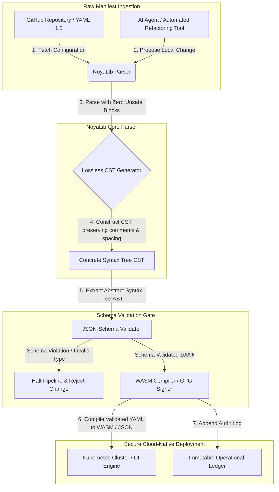

## چرا YAML در سال �2026 به یک پشتهٔ ایمن‌تر Rust برای هوش مصنوعی، MCP و زیرساخت مالی نیاز دارد

یک پشتهٔ ایمن‌تر YAML در Rust از آن رو اهمیت دارد که YAML اکنون خطوط لولهٔ CI/CD، مانیفست‌های Kubernetes، قواعد [Open Policy Agent](https://www.openpolicyagent.org/) و رجیستری‌های ابزار Model Context Protocol (MCP) را بر دوش می‌کشد — و یک تجزیهٔ مبهم به‌تنهایی می‌تواند یک سامانهٔ تسویه را از کار بیندازد، یک گروه امنیتی را نادرست پیکربندی کند یا مجوزهای اشتباه را به یک عامل محلی هوش مصنوعی بسپارد. [NoyaLib](https://github.com/sebastienrousseau/noyalib) یک اکوسیستم تجزیه و اعتبارسنجی [YAML 1.2](https://yaml.org/spec/1.2.2/) کاملاً مبتنی بر Rust و بدون هیچ بلوک unsafe است که مهندسی شده تا آن زیرساخت را به‌صورت پیش‌فرض امن کند.

## پاسخ کوتاه

**NoyaLib در یک جمله چیست؟** NoyaLib یک اکوسیستم تجزیه و اعتبارسنجی YAML 1.2 متن‌باز و کاملاً مبتنی بر Rust است، با صفر کد `unsafe`، انطباق ۱۰۰٪ با مشخصات در سراسر مجموعهٔ رسمی ۴۰۶ آزمونی YAML، یک درخت نحو انضمامی بدون اتلاف و اعتبارسنجی بلادرنگ [JSON Schema](https://json-schema.org/) — که مهندسی شده تا پیکربندی عامل‌های هوش مصنوعی، MCP، Kubernetes و زیرساخت مالی را به‌صورت پیش‌فرض امن سازد.

## خلاصهٔ مدیریتی

YAML تا زمانی که یک تجزیهٔ مبهم یا نقض یک اسکیما یک سامانهٔ تسویهٔ چندمیلیارد دلاری در محیط تولید را از کار بیندازد، متواضع به‌نظر می‌رسد. در سال ۲۰۲۶، YAML استاندارد بالفعل برای خطوط لولهٔ [CI/CD](https://docs.github.com/en/actions/learn-github-actions/workflow-syntax-for-github-actions)، مانیفست‌های [Kubernetes](https://kubernetes.io/docs/concepts/configuration/overview/)، قواعد [Open Policy Agent](https://www.openpolicyagent.org/) و رجیستری‌های ابزار Model Context Protocol (MCP) است. پارسرهای مبهم و قدیمی — با آسیب‌پذیری‌های حافظه و تجزیهٔ مخرب — یک ریسک امنیتی غیرقابل‌قبول‌اند. NoyaLib یک اکوسیستم YAML 1.2 کاملاً مبتنی بر Rust و بدون هیچ بلوک unsafe است: انطباق ۱۰۰٪ در سراسر تمام ۴۰۶ آزمون مجموعهٔ رسمی، یک درخت نحو انضمامی (CST) بدون اتلاف که توضیحات و فاصله‌گذاری را حفظ می‌کند و اعتبارسنجی توکار JSON-Schema. نتیجه، بازآفرینی YAML به‌عنوان یک صفحهٔ کنترل پیکربندیِ قابل‌ممیزی، امن و در دسترس عامل‌ها است.

## نکات کلیدی

- **پیکربندی، کدِ محیط تولید است.** یک فایل YAML بدشکل به‌تنهایی می‌تواند گروه‌های امنیتی بومیِ ابر یا مجوزهای عامل هوش مصنوعی را نادرست پیکربندی کند. NoyaLib با YAML همچون زیرساخت حیاتی رفتار می‌کند.
- **طراحی بدون unsafe.** NoyaLib که به‌طور کامل با Rust ایمن و بدون هیچ بلوک `unsafe` ساخته شده است، آسیب‌پذیری‌های ایمنیِ حافظه — سرریز بافر، اجرای کد از راه دور — را در لایه‌های اصلی تجزیه از میان می‌برد.
- **انطباق مطلق ۴۰۶ از ۴۰۶ با مشخصات.** ساختارهای پیکربندی را به‌صورت ریاضی اعتبارسنجی می‌کند و ناهماهنگی‌های تجزیه و انحرافات ساختاری میان محیط‌های استقرار آزمایشی (staging) و تولید (production) را از میان می‌برد.
- **درخت نحو انضمامی بدون اتلاف.** برخلاف پارسرهای قدیمی که توضیحات و قالب‌بندی را دور می‌ریزند، NoyaLib فاصله‌گذاری و حاشیه‌نویسی‌ها را حفظ می‌کند و بازآرایی خودکار، امن و رفت‌وبرگشتی (round-trip) به‌دست عامل‌های هوش مصنوعی را ممکن می‌سازد.
- **ارزش امانی در سطح هیئت‌مدیره.** یکپارچگی پیکربندی را به [ماده ۵ DORA](https://eur-lex.europa.eu/legal-content/EN/TXT/?uri=CELEX%3A32022R2554) و معیارهای سرمایهٔ ریسک عملیاتی [Basel III](https://www.bis.org/bcbs/publ/d424.htm) پیوند می‌دهد و مستقیماً مدیریت ارشد را از مسئولیت شخصی محافظت می‌کند.

**مطالب مرتبط:** [KyberLib و مهاجرت بانکداری پساکوانتومی در سال ۲۰۲۶: از استانداردها تا کد](https://sebastienrousseau.com/2026-06-12-kyberlib-post-quantum-banking-migration-standards-code-2026/)، [شاخص بانکداری بومیِ ابر در سال ۲۰۲۶: DORA، مهندسی پلتفرم، ابر حاکمیتی و تاب‌آوری عملیاتی](https://sebastienrousseau.com/2026-06-05-cloud-native-banking-index-dora-resilience-platform-engineering-2026/)، [دات‌فایل‌های آگاه به هوش مصنوعی در سال ۲۰۲۶: ساخت یک ایستگاه کاری توسعه‌دهندهٔ امن و بازتولیدپذیر برای MCP، SLSA و همتراز چند-شل](https://sebastienrousseau.com/2026-06-16-ai-aware-dotfiles-secure-reproducible-workstation-2026/).

## ۰۱. چرا یک پشتهٔ ایمن‌تر YAML در Rust در سال ۲۰۲۶ اهمیت دارد

در ژوئن ۲۰۲۶، زیرساخت‌های فناوری اطلاعات سازمانی به‌شدت توزیع‌شده و به‌طور فزاینده‌ای خودکار شده‌اند.

YAML بی‌سروصدا به زبان پیکربندیِ باربَرِ کل پشتهٔ مهندسی نرم‌افزار تبدیل شده است. این زبان گردش‌کارهای یکپارچه‌سازی پیوسته (CI) را که مصنوعات محیط تولید را کامپایل می‌کنند، مانیفست‌های [Kubernetes](https://kubernetes.io/docs/concepts/overview/) را که خوشه‌های جهانیِ بومیِ ابر را هماهنگ می‌کنند، و اسکیماهای سرور [Model Context Protocol](https://modelcontextprotocol.io/) (MCP) را که به عامل‌های محلی هوش مصنوعی مجوز اجرای عملیات محلی می‌دهند، بر دوش می‌کشد.

پارسرهای قدیمی YAML — [PyYAML](https://pyyaml.org/)، [yaml-cpp](https://github.com/jbeder/yaml-cpp)، [libyaml](https://github.com/yaml/libyaml) — دو ریسک ساختاری را با خود دارند:

1. **آسیب‌پذیری‌های تبدیل نوع (مسئلهٔ «نروژ»).** پارسرهای قدیمی مکرراً رشته‌های بدون نقل‌قول را تبدیل نوع می‌کنند (کد کشوری `NO` به بولینِ `false`، و همین‌طور `yes`/`no`) — به [برچسب بولین YAML 1.1 در برابر 1.2](https://yaml.org/type/bool.html) نگاه کنید — که سبب خرابی‌های حیاتی سامانه یا پیکربندی‌های نادرست و خاموش امنیتی می‌شود.
2. **بهره‌برداری‌های ایمنیِ حافظه.** پارسرهای مبهمِ نوشته‌شده به C/C++ از بهره‌برداری‌های نشت حافظه و سرریز بافر رنج می‌برند که می‌توانند به اجرای کد از راه دور (RCE) روی سرورهای اصلی ساخت (build) منجر شوند.

[NoyaLib](https://github.com/sebastienrousseau/noyalib) این چالش‌ها را حل می‌کند. این یک اکوسیستم تجزیه و اعتبارسنجی YAML 1.2 کاملاً مبتنی بر Rust و بدون هیچ بلوک unsafe است. با دستیابی به انطباق مطلق ۴۰۶ از ۴۰۶ با مشخصات و اعمال اعتبارسنجی سخت‌گیرانهٔ JSON-Schema به‌طور مستقیم در حین تجزیه، NoyaLib یک **بازده بر تاب‌آوری (Return on Resilience یا RoR)** بالا ارائه می‌دهد — با جلوگیری از قطعی ناشی از پیکربندی و ایمن‌سازی زنجیره‌های تأمین نرم‌افزارِ درجهٔ مالی.

## ۰۲. عدسیِ معماری NoyaLib در سال ۲۰۲۶

اکوسیستم NoyaLib به‌عنوان یک پارسر پیکربندیِ امن و بدون اتلاف عمل می‌کند. هر مانیفست محلی و ابری به‌صورت ساختاری اعتبارسنجی و در پایین‌ترین لایهٔ اجرا محافظت می‌شود.

### جدول ۱: لایه‌های معماری NoyaLib و کاهش ریسک

| لایه | تصمیم طراحی | چرا اهمیت دارد | ریسک در صورت مدیریت نادرست |
| ---- | ---- | ---- | ---- |
| **لایهٔ پارسر** | پارسر منطبق با YAML 1.2، کاملاً مبتنی بر Rust و بدون هیچ بلوک `unsafe` | آسیب‌پذیری‌های ایمنیِ حافظه و سرریزهای بافر را در پایین‌ترین لایهٔ اجرا از میان می‌برد. | اجرای کد از راه دور (RCE) روی سرورهای اصلی ساخت. |
| **لایهٔ انطباق** | انطباق ۱۰۰٪ در سراسر ۴۰۶ از ۴۰۶ آزمون مجموعهٔ رسمی YAML 1.2 | ناهماهنگی‌های تجزیه و انحراف تبدیل نوع میان محیط استقرار آزمایشی و تولید را از میان می‌برد. | خطاهای تبدیل نوعِ «مسئلهٔ نروژ» که گروه‌های امنیتی را از کار می‌اندازند. |
| **لایهٔ درخت نحو** | درخت نحو انضمامی (CST) بدون اتلاف | توضیحات، فاصله‌گذاری و ترتیب را در حین تجزیهٔ رفت‌وبرگشتی و بازآرایی برنامه‌نویسی‌شده حفظ می‌کند. | بازآرایی خودکار هوش مصنوعی که حاشیه‌نویسی‌های توسعه‌دهنده را نابود می‌کند. |
| **لایهٔ اعتبارسنجی** | اعتبارسنجی [JSON Schema (Draft 2020-12)](https://json-schema.org/draft/2020-12/release-notes) در حین تجزیه | مدل‌های دادهٔ سخت‌گیرانه را بر فایل‌های پیکربندی پیش از رسیدن‌شان به خوشه‌های تولید اعمال می‌کند. | فایل‌های پیکربندی بدشکل که موجب فروپاشی خوشه‌های بومیِ ابر می‌شوند. |
| **لایهٔ رابط** | پیوندهای WebAssembly (WASM) و MCP | اجازه می‌دهد اعتبارسنجی پیکربندی مستقیماً درون مرورگرها، گره‌های لبه و جعبه‌ابزارهای عامل محلی اجرا شود. | جزیره‌های ابزاری که در آن‌ها اعتبارسنجی نمی‌تواند روی دستگاه‌های لبه اجرا شود. |

## ۰۳. سیگنال‌های کلیدی امنیت ایستگاه کاری و پیکربندی

برای حفظ امنیت مطلق در سراسر دارایی‌های توسعه و عملیات، مدیران ارشد امنیت اطلاعات (CISO) باید معیارهای مشخص و قابل‌سنجش را پایش کنند.

### جدول ۲: سیگنال‌های امنیت ایستگاه کاری و پیکربندی

| سیگنال | معیار / سنجهٔ عملیاتی | مرجع NIST CSF / DORA | پیاده‌سازی در پلتفرم فنی |
| ---- | ---- | ---- | ---- |
| **انطباق پارسر** | نرخ قبولی ۱۰۰٪ در سراسر مجموعهٔ آزمون رسمی YAML 1.2 (۴۰۶ از ۴۰۶ آزمون). | [ماده ۶ DORA](https://eur-lex.europa.eu/legal-content/EN/TXT/?uri=CELEX%3A32022R2554) (امنیت ICT) | هستهٔ پارسر NoyaLib که همهٔ مانیفست‌ها را پیش از اجرای CI اعتبارسنجی می‌کند. |
| **مشخصات ایمنیِ حافظه** | صفر بلوک `unsafe` در Rust درون وابستگی‌های پارسر و سریال‌ساز. | ماده ۳۰ DORA (زنجیرهٔ تأمین) | بررسی‌های خودکار کامپایلر ([`forbid(unsafe_code)`](https://doc.rust-lang.org/reference/attributes/diagnostics.html#the-forbid-attribute)) در ساخت‌های cargo. |
| **اعتبارسنجی اسکیما** | ۱۰۰٪ فایل‌های پیکربندی تجزیه‌شده در برابر مدل‌های معتبر [JSON Schema](https://json-schema.org/) راستی‌آزمایی می‌شوند. | [NIST CSF 2.0](https://www.nist.gov/cyberframework) (PR.DS-01) | دروازهٔ اعتبارسنجی بلادرنگ که خطوط لولهٔ ساخت را در صورت نقض اسکیما متوقف می‌کند. |
| **انحراف پیکربندی** | تشخیص و بازیابی بلادرنگ فایل‌های پیکربندی محلی به وضعیت نسخه‌بندی‌شده در git. | بازده بر تاب‌آوری (RoR) | تله‌متری پیوسته که همهٔ تغییرات فایل‌های محلی را ثبت می‌کند. |
| **کنترل دسترسی عامل** | مجوزهای محدود و فقط‌خواندنی برای ابزارهای محلی هوش مصنوعی که از طریق پیکربندی‌های MCP کار می‌کنند. | مدیریت ریسک مدل ([SR 11-7](https://www.federalreserve.gov/supervisionreg/srletters/sr1107.htm)) | مرزهای سرور MCP که عملیات عامل را به دایرکتوری‌های تأییدشده محدود می‌کنند. |

## ۰۴. مغالطهٔ تجزیهٔ مبهم پیکربندی

یک آسیب‌پذیری عمده در عملیات بومیِ ابر، *تجزیهٔ مبهم* است — استفاده از پارسرهایی که فراداده‌های ساختاری (توضیحات، فاصله‌های سفید، ترتیب سند) را دور می‌ریزند یا در حین کامپایل به‌طور خاموش نوع‌ها را تبدیل می‌کنند. این رفتار دو ریسک امنیتی شدید را وارد می‌کند:

1. **بازآرایی مخرب.** هنگامی که یک دستیار کدنویسی هوش مصنوعی یا ابزار بازآرایی خودکار یک مانیفست استقرار را به‌روزرسانی می‌کند، پارسرهای سنتی توضیحات و قالب‌بندی توسعه‌دهنده را دور می‌ریزند و بستری را که برای بازبینی‌های انسانی و پزشکی‌قانونیِ پس از رخداد لازم است نابود می‌کنند.
2. **ناهماهنگی‌های تجزیه.** اگر یک محیط استقرار آزمایشی از یک پارسر مبتنی بر Python و محیط تولید از یک پارسر مبتنی بر C استفاده کند، تفاوت‌های جزئی در انطباق با مشخصات YAML 1.2 می‌توانند سبب شوند که یک مانیفستِ معتبر در استقرار آزمایشی در محیط تولید شکست بخورد یا رفتار متفاوتی داشته باشد و آسیب‌پذیری‌های امنیتی پنهانی ایجاد کند.

**درخت نحو انضمامی (CST) بدون اتلافِ** NoyaLib این مشکل را حل می‌کند. این درخت هر فاصله، توضیح و خط سند را در حلقهٔ تجزیه‌و‌سریال‌سازی حفظ می‌کند. دستیارهای خودکار هوش مصنوعی می‌توانند فایل‌های پیکربندی را ویرایش، بازآرایی و کامیت کنند و در همان حال ۱۰۰٪ حاشیه‌نویسی‌های نوشته‌شده به‌دست انسان را حفظ نمایند — یک ردّ ممیزی مطلق.

## ۰۵. طراحی یک خط لولهٔ پیکربندی هوش مصنوعیِ محدود

برای جلوگیری از رسیدن تغییرات مخرب پیکربندی به محیط‌های تولید، سازمان باید یک خط لولهٔ پیکربندیِ به‌شدت محدود و اعتبارسنجی‌شده با اسکیما را پیاده‌سازی کند.

جریان عملیاتی زیر نشان می‌دهد که چگونه NoyaLib یک YAML خام را تجزیه می‌کند، یک CST بدون اتلاف می‌سازد، AST را در برابر یک مدل JSON-Schema اعتبارسنجی می‌کند و پیوندهای WebAssembly را برای محیط‌های مرورگر یا لبه کامپایل می‌کند.

## ۰۶. کتابچهٔ راهنمای هیئت‌مدیره و مسئولیت امانی

امنیت پیکربندی و یکپارچگی زنجیرهٔ تأمین نرم‌افزار، اولویت‌های حیاتی سطح هیئت‌مدیره هستند. مدیران ارشد باید مدیریت پیکربندی را از دریچهٔ وظیفهٔ امانی و تاب‌آوری عملیاتی بنگرند.

- **ماده ۵ DORA (پاسخگویی هیئت‌مدیره).** مقرر می‌دارد که هیئت‌مدیره مسئولیت نهایی و غیرقابل‌واگذاری مدیریت ریسک ICT مؤسسه را بر عهده دارد. از آنجا که فایل‌های پیکربندی، گروه‌های امنیتی حیاتی بومیِ ابر و مسیرهای مسیریابی پرداخت را کنترل می‌کنند، هیئت‌مدیره‌ها باید تأیید کنند که سامانه‌هایی که این مانیفست‌ها را تجزیه می‌کنند از نظر حافظه ایمن و به‌طور کامل منطبق با مشخصات هستند تا الزامات ممیزی‌های نظارتی را برآورده سازند. ([آیین‌نامهٔ (EU) 2022/2554](https://eur-lex.europa.eu/legal-content/EN/TXT/?uri=CELEX%3A32022R2554))
- **BCBS 239 (تجمیع و گزارش‌دهی دادهٔ ریسک).** ایجاب می‌کند که گزارش‌دهی ریسک و معیارهای زیرساخت دقیق، کامل و تحت کنترل‌های سخت‌گیرانهٔ کیفیت داده تولید شوند. NoyaLib با تجزیه و اعتبارسنجی فایل‌های پیکربندی در برابر اسکیماهای سخت‌گیرانه در مبدأ، از BCBS 239 پشتیبانی می‌کند و از نشت خاموش داده یا قطعی‌های ناشی از پیکربندی نادرست جلوگیری می‌نماید. ([استاندارد BCBS 239](https://www.bis.org/publ/bcbs239.htm))
- **کاهش شارژهای سرمایهٔ ریسک عملیاتی (Basel III).** قطعی‌های ناشی از پیکربندی به‌طور مستقیم شارژهای سرمایهٔ ریسک عملیاتی را تحت Basel III متورم می‌کنند و سرمایهٔ ترازنامه را درگیر می‌سازند. استانداردسازی پشتهٔ پیکربندی سازمانی بر پایهٔ یک پارسر امن و کاملاً مبتنی بر Rust مانند NoyaLib این ریسک را به کمینه می‌رساند، سرمایه را حفظ می‌کند و از اعتماد مشتری محافظت می‌نماید. ([استانداردهای Basel III](https://www.bis.org/bcbs/publ/d424.htm))

## ۰۷. این موضوع بر حسب نوع بانک چه معنایی دارد

### بانک‌های دارای اهمیت سیستمیِ جهانی (G-SIBs)

بانک‌های G-SIB هزاران میکروسرویس و خط لولهٔ استقرار را در چندین حوزهٔ قضایی مدیریت می‌کنند. چالش اصلی آن‌ها حفظ سازگاری پیکربندی و جلوگیری از انحراف امنیتی در سراسر دارایی‌های عظیم بومیِ ابر است. استانداردسازی بر یک پشتهٔ ایمن‌تر YAML در Rust مانند NoyaLib تضمین می‌کند که همهٔ مانیفست‌های Kubernetes، خطوط لولهٔ CI/CD و سیاست‌های امنیتی تحت یک چارچوب یکنواخت و ایمن از نظر حافظه تجزیه و اعتبارسنجی شوند — و ریسک پیکربندی‌های ممیزی‌نشدهٔ «دانه‌برفی» (snowflake) را از میان می‌برد.

### بانک‌های تراکنشی و شرکتی

بانک‌های تراکنشی درگاه‌های پرداخت حساس و زیرساخت‌های تسویهٔ عمده‌فروشی را اداره می‌کنند. اثبات امنیت مطلق کد و پیکربندیِ مستقرشده در این محیط‌های تولید یک الزام نظارتی غیرقابل‌مذاکره است. یکپارچه‌سازی NoyaLib تضمین می‌کند که زنجیرهٔ تأمین نرم‌افزار به‌طور کامل ممیزی‌شده، بدون اتلاف و در برابر آسیب‌پذیری‌های تجزیه محافظت‌شده باشد — کنترلی که به‌روشنی به ماده ۶ DORA و بخش ۶ [PCI DSS v4.0](https://www.pcisecuritystandards.org/document_library/) نگاشت می‌شود.

### بانک‌های منطقه‌ای و کوچک‌تر

بانک‌های منطقه‌ای باید بدون بودجه‌های فناوری در مقیاس G-SIB، استانداردهای بالای امنیت سایبری را حفظ کنند. چارچوب متن‌باز NoyaLib یک راهکار سبک، مقرون‌به‌صرفه و بسیار امنِ سازگار با Rust فراهم می‌آورد و به مؤسسات کوچک‌تر امکان می‌دهد امنیت پیکربندی و محافظت از زنجیرهٔ تأمین در سطح سازمانی را بدون هزینه‌های مجوز اختصاصی پیاده‌سازی کنند.

## ۰۸. نتیجه‌گیری: نقشهٔ راه امنیت پیکربندی

ایستگاه کاری توسعه‌دهنده و پیکربندی‌های زیرساخت بومیِ ابر، صفحات کنترل حیاتی در زنجیرهٔ تأمین نرم‌افزار هستند. اجازه دادن به فایل‌های پیکربندیِ ممیزی‌نشده، مبهم یا ناامن برای رسیدن به دارایی‌های شرکتی، یک ریسک عملیاتی و نظارتی غیرقابل‌قبول است.

برای ایمن‌سازی زنجیرهٔ تأمین نرم‌افزار و محافظت از نقاط پایانی در برابر آسیب‌پذیری‌های پیکربندی، مدیران ارشد فناوری و امنیت باید همین امروز یک نقشهٔ راه توسعهٔ روشن را اجرا کنند:

1. **پیکربندی تعریفی را الزامی کنید.** تنظیمات پیکربندیِ دستی و ممیزی‌نشده را کنار بگذارید و الزام کنید که همهٔ مانیفست‌ها به‌عنوان یک سامانهٔ ثبتِ نسخه‌بندی‌شده و تعریفی (declarative) مدیریت شوند.
2. **اعتبارسنجی اسکیما را اعمال کنید.** قلاب‌های پیش از کامیت (pre-commit) و ابزارهای پویش سخت‌گیرانه را اعمال کنید تا اطمینان یابید همهٔ فایل‌های پیکربندی پیش از استقرار در برابر مدل‌های معتبر JSON-Schema اعتبارسنجی می‌شوند.
3. **رفت‌وبرگشت بدون اتلاف را پیاده کنید.** اطمینان یابید که همهٔ دستیارهای خودکار کدنویسی هوش مصنوعی و ابزارهای بازآرایی از تجزیهٔ بدون اتلاف برای حفظ توضیحات، فاصله‌گذاری و بستر توسعه‌دهنده استفاده می‌کنند.
4. **زنجیرهٔ تأمین را ایمن کنید.** اطمینان یابید که همهٔ پیکربندی‌ها و ابزارهای تجزیه پیش از اجرا با استفاده از کتابخانه‌های کاملاً مبتنی بر Rust و بدون unsafe مانند NoyaLib به‌صورت رمزنگارانه راستی‌آزمایی می‌شوند. ([چارچوب SLSA](https://slsa.dev/))

## ۰۹. پرسش‌های پرتکرار

**NoyaLib چیست و چرا برای تجزیهٔ YAML استفاده می‌شود؟**
NoyaLib یک پارسر YAML 1.2 متن‌باز، کاملاً مبتنی بر Rust و بدون unsafe است. این پارسر به انطباق ۱۰۰٪ با مشخصات در سراسر مجموعهٔ رسمی ۴۰۶ آزمونی دست می‌یابد، اعتبارسنجی سخت‌گیرانهٔ [JSON Schema](https://json-schema.org/) را در حین تجزیه اعمال می‌کند و پیوندهای WASM و [MCP](https://modelcontextprotocol.io/) را در معرض دید قرار می‌دهد — و آن را به یک پشتهٔ ایمن‌تر YAML در Rust برای عامل‌های هوش مصنوعی، Kubernetes و زیرساخت مالی تبدیل می‌کند.

**چرا طراحی بدون unsafe برای تجزیهٔ پیکربندی مهم است؟**
آسیب‌پذیری‌های ایمنیِ حافظه — سرریز بافر، استفاده‌پس‌از‌آزادسازی (use-after-free) — درون پارسرهای قدیمیِ نوشته‌شده به C/C++ می‌توانند به اجرای کد از راه دور روی سرورهای اصلی ساخت منجر شوند. طراحی کاملاً مبتنی بر Rust در NoyaLib با [`#![forbid(unsafe_code)]`](https://doc.rust-lang.org/reference/attributes/diagnostics.html#the-forbid-attribute) این آسیب‌پذیری‌ها را به‌صورت ریاضی در زمان کامپایل از میان می‌برد.

**درخت نحو انضمامی (CST) بدون اتلاف چیست و چرا اهمیت دارد؟**
پارسرهای سنتی توضیحات و قالب‌بندی را دور می‌ریزند و ویرایش‌های خودکار به‌دست عامل‌های هوش مصنوعی را مخرب می‌کنند. درخت نحو انضمامی بدون اتلافِ NoyaLib هر توضیح، فاصله و خط سند را حفظ می‌کند — بنابراین دستیارهای هوش مصنوعی می‌توانند فایل‌های پیکربندی را به‌صورت امن ویرایش و بازآرایی کنند و در همان حال بستر توسعه‌دهنده، پزشکی‌قانونیِ پس از رخداد و ردّ ممیزی را دست‌نخورده نگاه دارند.

**NoyaLib چگونه به DORA، BCBS 239 و Basel III نگاشت می‌شود؟**
ماده ۵ DORA پاسخگویی ریسک ICT را بر عهدهٔ هیئت‌مدیره می‌گذارد؛ BCBS 239 کنترل‌های کیفیت داده را بر گزارش‌دهی ریسک می‌طلبد؛ Basel III سرمایهٔ ریسک عملیاتی را مشمول شارژ می‌کند. NoyaLib همان لایهٔ تجزیهٔ اعتبارسنجی‌شده با اسکیما و ایمن از نظر حافظه را که این آیین‌نامه‌ها برای پیکربندی به‌عنوان کد نیاز دارند فراهم می‌آورد — و نگاشت نظارتی را ساده و شارژ سرمایهٔ ریسک عملیاتی را کوچک‌تر می‌سازد.

## ۱۰. منابع

- **YAML, (2026).** *YAML 1.2 specification*. در دسترس در: [YAML 1.2 spec](https://yaml.org/spec/1.2.2/).
- **JSON Schema, (2026).** *JSON Schema Draft 2020-12 release notes*. در دسترس در: [JSON Schema Draft 2020-12](https://json-schema.org/draft/2020-12/release-notes).
- **European Parliament and Council of the European Union, (2022).** *Regulation (EU) 2022/2554 on digital operational resilience for the financial sector (DORA)*. Brussels: Official Journal of the European Union. در دسترس در: [DORA regulation](https://eur-lex.europa.eu/legal-content/EN/TXT/?uri=CELEX%3A32022R2554).
- **Basel Committee on Banking Supervision, (2013).** *Principles for effective risk data aggregation and risk reporting (BCBS 239)*. Basel: Bank for International Settlements. در دسترس در: [BCBS 239 standard](https://www.bis.org/publ/bcbs239.htm).
- **Basel Committee on Banking Supervision, (2017).** *Basel III: finalising post-crisis reforms*. Basel: Bank for International Settlements. در دسترس در: [Basel III standards](https://www.bis.org/bcbs/publ/d424.htm).
- **Anthropic, (2025).** *Model Context Protocol (MCP) specification*. در دسترس در: [Model Context Protocol](https://modelcontextprotocol.io/).
- **GitHub, (2026).** *noyalib open-source repository*. در دسترس در: [NoyaLib repository](https://github.com/sebastienrousseau/noyalib).
