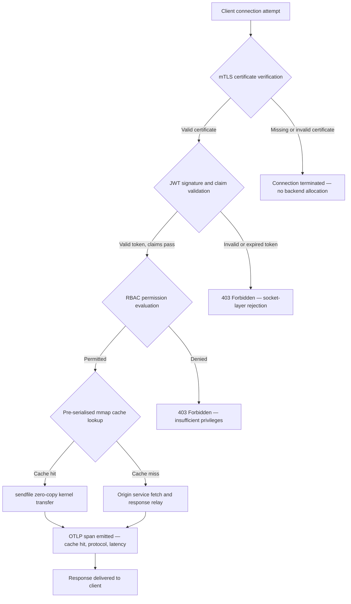

## http-handle: ورود لبه‌ای پرکارایی و بدون‌وابستگی برای بانکداری در سال ۲۰۲۶

لبه بانکداری یک مشکل وابستگی دارد. هر نمونه Nginx یا Envoy که ترافیک را میان یک کلاینت و یک سرویس بانکداری هسته‌ای هدایت می‌کند، یک درخت وابستگی حمل می‌کند: بیلدهای OpenSSL، ماژول‌های Lua، کتابخانه‌های gRPC و لایه‌های کانتینر — که هرکدام یک CVE بالقوه است، هرکدام نیازمند یک چرخه اصلاح اختصاصی است و هرکدام واریانس تأخیری می‌افزاید که سنجش SLA را پیچیده می‌کند. تحت [قانون تاب‌آوری عملیاتی دیجیتال (DORA)](https://eur-lex.europa.eu/eli/reg/2022/2554/oj)، این پیچیدگی اکنون به همان اندازه که یک بار عملیاتی است، یک بدهی نظارتی نیز هست.

[http-handle](https://github.com/sebastienrousseau/http-handle) رویکردی متفاوت در پیش می‌گیرد. این ابزار یک باینری Rust تک و ایستالینک‌شده است که فراتر از `libc` هیچ وابستگی زمان‌اجرایی ندارد. این ابزار ۱۸۰٬۰۰۰ درخواست در ثانیه را روی گره‌های ARM64 ارائه می‌دهد، TLS دوطرفه و احراز هویت JWT را در لایه سوکت شبکه اعمال می‌کند و HTTP/2 و HTTP/3 را به‌صورت خودکار مذاکره می‌کند — همه در یک ردپای استقرار زیر ۲۰ مگابایت رم.

## پاسخ سریع

**http-handle در یک جمله چیست؟** http-handle یک باینری Rust متن‌باز و ایستالینک‌شده است که کانتینرهای پراکسی سنگین را در لبه بانکداری جایگزین می‌کند؛ ۱۸۰٬۰۰۰ درخواست در ثانیه را روی ARM64 از طریق انتقال‌های هسته‌ای بدون‌کپی `sendfile(2)` لینوکس ارائه می‌دهد؛ mTLS، JWT و RBAC را در لایه سوکت پیش از آنکه هیچ منبع بک‌اِندی لمس شود اعمال می‌کند؛ و متریک‌های بومی [OpenTelemetry](https://opentelemetry.io/) را منتشر می‌کند — با صفر وابستگی کتابخانه‌ای زمان‌اجرا فراتر از `libc`.

## خلاصه اجرایی

بانک‌ها یک دهه است که Nginx و Envoy را در لبه خود اجرا می‌کنند. هر دو توانمندند؛ اما هیچ‌کدام برای محیط نظارتی سال ۲۰۲۶ طراحی نشده‌اند. ایمیج‌های کانتینر انباشته از وابستگی، صف‌های CVE‌ای تولید می‌کنند که تیم‌های انطباق به‌اندازه کافی سریع نمی‌توانند آن‌ها را پاک کنند، و هر ارتقای نسخه کتابخانه، ریسک واپس‌روی حمل می‌کند. مواد ۵ و ۶ DORA می‌طلبند که ریسک ICT به‌صورت طراحی‌محور مدیریت شود، نه اینکه پس از کشف وصله شود. چارچوب‌های ریسک عملیاتی بازل سه، معماری‌هایی را که در آن‌ها نقاط شکست با پیچیدگی سیستم افزایش می‌یابند، جریمه می‌کنند.

http-handle مشکل وابستگی را از ریشه حذف می‌کند. باینری یک‌بار، به‌صورت ایستا و بدون هیچ نیاز به کتابخانه بیرونی در زمان اجرا کامپایل می‌شود. سطح حمله به کتابخانه استاندارد Rust به‌علاوه `libc` کوچک می‌شود. اعمال امنیت — تأیید گواهی mTLS، اعتبارسنجی ادعاهای JWT و کنترل دسترسی مبتنی بر نقش — پیش از هر تخصیص بک‌اِندی در سوکت شبکه اجرا می‌شود و محیط اعتماد صفر را به کوچک‌ترین بیان ممکن خود فرو می‌کاهد. کارایی از معماری برمی‌آید: بلوک‌های کش نگاشت‌شده به حافظه که از پیش سریال شده‌اند، در ترکیب با انتقال‌های هسته‌ای `sendfile(2)`، داده را به‌کلی از مسیر کپی CPU-به-حافظه بیرون می‌آورند و ۱۸۰٬۰۰۰ درخواست در ثانیه را روی سخت‌افزار ARM64 پایدار نگه می‌دارند. نتیجه، یک لایه ورود است که الزامات تاب‌آوری DORA را برآورده می‌کند، از استدلال‌های کاهش ریسک عملیاتی بازل سه پشتیبانی می‌کند و به رهبران ارشد فناوری اطلاعات تحت SM&CR یک زنجیره پاسخگویی تک‌مؤلفه‌ای و قابل‌اثبات برای زیرساخت لبه می‌دهد.

## نکات کلیدی

- **باینری‌های کوچک‌تر، صف‌های CVE کوچک‌تر.** یک باینری تک و ایستالینک‌شده تنها یک بسته برای وصله، یک انتشار برای اعتبارسنجی و یک مصنوع برای ممیزی دارد. Nginx با مجموعه ماژول استاندارد با بیش از ۳۰ وابستگی کتابخانه اشتراکی عرضه می‌شود؛ هرکدام چرخه آسیب‌پذیری خود را حمل می‌کند.
- **بدون‌کپی یک بهینه‌سازی نیست — یک قید طراحی است.** در ۱۸۰٬۰۰۰ درخواست در ثانیه، هر کپی داده در فضای کاربر واریانس تأخیری قابل‌سنجش وارد می‌کند. `sendfile(2)` محتوای توصیف‌گر فایل را به‌طور کامل در فضای هسته به سوکت شبکه منتقل می‌کند. در ترکیب با بلوک‌های کش پاسخ پین‌شده با mmap، CPU هرگز به مسیر داده برای پاسخ‌های کش‌شده دست نمی‌زند.
- **محیط امنیتی به سوکت تعلق دارد.** اعتبارسنجی JWT‌ها و گواهی‌های mTLS در میان‌افزار برنامه به این معناست که بک‌اِند پیش از رد شدن درخواست، از پیش نخ‌ها و حافظه را تخصیص داده است. اعتبارسنجی در لایه سوکت تضمین می‌کند که درخواست‌های احرازنشده اصلاً هیچ منبع بک‌اِندی مصرف نکنند.
- **OTLP شکاف مشاهده‌پذیری را حذف می‌کند.** یکپارچگی بومی OpenTelemetry به این معناست که هر درخواست، هر تصمیم احراز هویت و هر مذاکره پروتکل، تله‌متری ساختاریافته‌ای تولید می‌کند، بدون نیاز به عامل ساید‌کار. داشبوردهای موجود بانک، ردهای OTLP را مستقیماً دریافت می‌کنند.

**خواندنی‌های مرتبط:** [چرا YAML به یک پشته امن‌تر Rust برای هوش مصنوعی، MCP و زیرساخت مالی در سال ۲۰۲۶ نیاز دارد](https://sebastienrousseau.com/2026-06-18-noyalib-safe-yaml-rust-ai-mcp-financial-infrastructure-2026/)، [CloudCDN: یک طرح متن‌باز برای لبه بومیِ هوش مصنوعی در سال ۲۰۲۶](https://sebastienrousseau.com/2026-06-11-cloudcdn-open-source-blueprint-ai-native-edge-2026/)، [بهترین معماری زیرساخت ابری برای بانک‌ها و مؤسسات مالی در سال ۲۰۲۶](https://sebastienrousseau.com/2026-05-16-best-cloud-infrastructure-architecture-2026/).

## ۰۱. مشکل پراکسی سنگین در بانکداری

Nginx و Envoy لبه اینترنت مدرن را ساختند. آن‌ها پیکربندی‌پذیر، آزموده در نبرد و پشتیبانی‌شده توسط جوامع بزرگ هستند. آن‌ها همچنین انتخاب‌های معماری‌ای‌اند که پیش از وجود DORA، پیش از آنکه چارچوب‌های ریسک عملیاتی بازل سه کاهش پیچیدگی قابل‌کمی‌شدن را طلب کنند، و پیش از آنکه گره‌های ابری ARM64 اقتصاد محاسبات پرگذردهی را دگرگون سازند، انجام شده‌اند.

پیامد عملی، شکافی است میان آنچه بانک‌ها نیاز دارند و آنچه کانتینرهای پراکسی سنگین ارائه می‌دهند.

**سطح وابستگی.** یک استقرار استاندارد Envoy، OpenSSL، Abseil، Protobuf، gRPC، Lua و ده‌ها کتابخانه ثانویه را به همراه می‌آورد. هرکدام یک چرخه CVE مستقل حمل می‌کند. وقتی پایگاه ملی آسیب‌پذیری‌ها یک هشدار بحرانی OpenSSL منتشر می‌کند، هر نمونه Envoy در مجموعه تبدیل به یک ساعت انطباق می‌شود: ارزیابی، وصله، آزمون، استقرار مجدد و صدور گواهی مجدد — در هر محیطی که باینری در آن اجرا می‌شود. تحت ماده ۶ DORA، بانک‌ها باید نشان دهند که فرایندهای مدیریت ریسک ICT متناسب، مستند و قابل‌اثبات هستند. یک درخت وابستگی چندکتابخانه‌ای، نگهداری این اثبات را پرهزینه می‌سازد.

**سربار حافظه.** یک فرایند کارگر Nginx با کمترین پیکربندی، تحت بار متوسط ۴۰ تا ۸۰ مگابایت حافظه مقیم مصرف می‌کند. در مقیاس بالا — صدها گره ورود در سراسر سامانه‌های معاملاتی، APIهای پرداخت و پورتال‌های رو به مشتری — این سربار به یک هزینه زیرساختی قابل‌سنجش انباشته می‌شود، بدون هیچ سود کارایی متناظری در برابر یک جایگزین تک‌باینری خوش‌مهندسی‌شده.

**سرعت وصله‌گذاری.** زنجیره‌های تأمین ایمیج کانتینر، تأخیر چندروزه‌ای میان انتشار یک CVE و رسیدن یک وصله معتبر به تولید وارد می‌کنند. ایمیج پایه باید بازسازی شود، لایه برنامه دوباره لایه‌گذاری شود، ماتریس آزمون کامل دوباره اجرا شود و خط‌لوله استقرار دوباره اجرا گردد. برای سامانه‌های بانکی بحرانی که تحت پنجره‌های گزارش‌دهی حادثه DORA کار می‌کنند، این چرخه یک ریسک ساختاری است.

http-handle به هر سه مورد می‌پردازد. یک باینری. یک سطح CVE. یک مصنوع برای وصله. زیر ۲۰ مگابایت رم برای یک گره ورود تولیدی.

## ۰۲. عدسی معماری http-handle در سال ۲۰۲۶

باینری در قالب پنج لایه به‌هم‌وابسته ساختار یافته است که هرکدام برای حذف یک دسته مشخص از ریسک طراحی شده‌اند که معماری‌های پراکسی سنتی انباشته می‌کنند.

### جدول ۱: لایه‌های معماری http-handle و کاهش ریسک

| لایه | تصمیم طراحی | چرا اهمیت دارد | ریسک در صورت مدیریت نادرست |
| ---- | ---- | ---- | ---- |
| **هسته سرور** | باینری تک Rust، ایستالینک‌شده، صفر وابستگی فراتر از `libc` | یک مصنوع برای وصله؛ حذف انتشار CVE کتابخانه‌ای در سراسر مجموعه | حملات سردرگمی وابستگی؛ انباشت آسیب‌پذیری کتابخانه |
| **موتور شتاب‌دهی** | بلوک‌های کش mmap از پیش سریال‌شده و انتقال‌های هسته‌ای بدون‌کپی `sendfile(2)` | ۱۸۰٬۰۰۰ درخواست در ثانیه روی ARM64 با سربار پراکسی زیر یک‌میلی‌ثانیه؛ هیچ داده‌ای برای پاسخ‌های کش‌شده وارد فضای کاربر نمی‌شود | نشت نگاشت حافظه؛ گلوگاه‌های فضای هسته هنگام باطل‌سازی کش |
| **امنیت رمزنگاری** | mTLS بومی با پشتیبانی بارگذاری داغ گواهی و مذاکره ALPN | تضمین یکپارچگی داده و سازگاری پروتکل؛ چرخش گواهی بدون افت اتصال | انقضای گواهی که موجب قطعی سرویس شود؛ پیش‌فرض‌های ضعیف مجموعه رمزها |
| **صفحه سیاست دسترسی** | اعتبارسنجی JWT در لایه سوکت و ارزیابی ادعای RBAC | درخواست‌های احرازنشده هیچ منبع بک‌اِندی مصرف نمی‌کنند؛ اعتماد صفر در مرز هسته اعمال می‌شود | حملات سردرگمی الگوریتم JWT؛ پیکربندی نادرست RBAC که دسترسی بیش‌ازحد اعطا کند |
| **مشاهده‌پذیری** | یکپارچگی بومی [OpenTelemetry (OTLP)](https://opentelemetry.io/docs/specs/otlp/) | تله‌متری ساختاریافته بدون عامل ساید‌کار؛ دریافت مستقیم در مجموعه‌های پایش موجود بانک | نقاط کور هنگام قطعی؛ ردهای ممیزی ناقص برای گزارش‌دهی حادثه DORA |

## ۰۳. سیگنال‌های کلیدی کارایی و امنیت

بانک‌هایی که http-handle را در لبه اجرا می‌کنند، باید پنج سیگنال قابل‌کمی‌شدن را رصد کنند تا الزامات گزارش‌دهی عملیاتی DORA و حاکمیت SLA داخلی را برآورده سازند.

### جدول ۲: معیارهای عملیاتی و ارجاعات نظارتی

| سیگنال | معیار | ارجاع نظارتی | پیاده‌سازی فنی |
| ---- | ---- | ---- | ---- |
| **گذردهی** | ≥ ۱۸۰٬۰۰۰ درخواست در ثانیه روی گره‌های ARM64 با سربار پراکسی P99 ≤ ۱ میلی‌ثانیه | ریسک عملیاتی بازل سه — کاهش پیچیدگی سیستم | `sendfile(2)` + بلوک‌های کش mmap از پیش سریال‌شده؛ بدون کپی داده در فضای کاربر برای برخوردهای کش |
| **سطح حمله** | صفر وابستگی کتابخانه‌ای زمان‌اجرا؛ یک مصنوع باینری در هر انتشار | [ماده ۶ DORA](https://eur-lex.europa.eu/eli/reg/2022/2554/oj) — مدیریت ریسک ICT به‌صورت طراحی‌محور | کامپایل ایستا با `cargo build --release --target aarch64-unknown-linux-musl` |
| **تأخیر احراز هویت** | تکمیل دست‌دهی mTLS + اعتبارسنجی JWT پیش از نخستین بایت پاسخ بک‌اِند | [ماده ۵ DORA](https://eur-lex.europa.eu/eli/reg/2022/2554/oj) — حفاظت امنیتی ICT | رهگیری در لایه سوکت؛ ارزیابی ادعای JWT در Rust مجاور هسته پیش از مسیریابی به بک‌اِند |
| **در دسترس بودن گواهی** | بارگذاری داغ گواهی‌های mTLS با صفر اتصال افتاده در حین چرخش | پاسخگویی مدیریت ارشد SM&CR برای در دسترس بودن لبه | پایشگر گواهی مبتنی بر inotify؛ تعویض اتمی توصیف‌گر فایل در حین بارگذاری مجدد |
| **پوشش مشاهده‌پذیری** | ۱۰۰٪ درخواست‌ها تولیدکننده اسپن‌های OTLP با نتیجه احراز هویت، نسخه پروتکل و وضعیت کش | ماده ۱۷ DORA — تشخیص و گزارش‌دهی حادثه | صادرکننده بومی OTLP؛ بدون نیاز به ساید‌کار؛ انتقال gRPC یا HTTP/Protobuf قابل‌پیکربندی |

## ۰۴. موتور بدون‌کپی: mmap و sendfile(2)

کارایی شبکه در بانکداری پرتناوب — پرداخت‌های آنی، APIهای داده بازار، سرویس‌های توکن احراز هویت — بیش از هر چیز دیگری به یک قید محدود می‌شود: هزینه جابه‌جایی بایت‌ها از ذخیره‌سازی به سوکت شبکه.

سرورهای HTTP مرسوم، محتوای فایل را در یک بافر فضای کاربر می‌خوانند و سپس آن بافر را در سوکت می‌نویسند. این توالی برای هر پاسخ به دو کپی حافظه و دو تعویض زمینه میان فضای کاربر و فضای هسته نیاز دارد. در ۱۸۰٬۰۰۰ درخواست در ثانیه، سربار انباشته چشمگیر است.

http-handle هر دو کپی را حذف می‌کند.

**بلوک‌های کش نگاشت‌شده به حافظه.** هنگامی که سرویس آغاز می‌شود، محتوای پاسخ ایستا را با استفاده از `mmap(2)` در نواحی نگاشت‌شده به حافظه سریال می‌کند. این نواحی در کش صفحه هسته پین می‌شوند. وقتی درخواستی برای یک منبع کش‌شده می‌رسد، پاسخ از پیش در حافظه هسته نگاشت شده است — بدون خواندن دیسک، بدون تخصیص بافر.

**انتقال هسته‌ای `sendfile(2)`.** فراخوان سیستمی `sendfile(2)` لینوکس داده را مستقیماً از یک توصیف‌گر فایل — یا یک ناحیه نگاشت‌شده به حافظه — به یک توصیف‌گر فایل سوکت شبکه، به‌طور کامل درون هسته منتقل می‌کند. هیچ بایتی وارد فضای کاربر نمی‌شود. نقش CPU به صدور فراخوان سیستمی و مدیریت رویداد تکمیل فرو کاسته می‌شود. روی گره‌های ARM64 با این معماری، http-handle ۱۸۰٬۰۰۰ درخواست در ثانیه را با سربار پراکسی زیر یک‌میلی‌ثانیه تحت بار پایدار حفظ می‌کند.

برای بانک‌هایی که تطبیق دسته‌ای پایان ماه، گزارش‌دهی نقدینگی درون‌روزی یا ترافیک API امتیازدهی آنی تقلب را اجرا می‌کنند، پیامد مهندسی مستقیم است: گره‌های ARM64 کمتر در هر رده ترافیک، هزینه زیرساختی پایین‌تر و ریسک تاب‌آوری DORA کوچک‌تر ناشی از کمبود ظرفیت.

## ۰۵. صفحه سیاست دسترسی mTLS و JWT

در بانکداری، احراز هویت در لبه یک ویژگی نیست — یک الزام نظارتی است. DORA مقرر می‌دارد که کنترل‌های امنیتی ICT متناسب، مستند و قابل‌اثبات باشند. SM&CR پاسخگویی شخصی برای تصمیم‌های امنیت زیرساخت را بر عهده مدیران ارشد نام‌برده می‌گذارد. پرسش این نیست که آیا در لبه احراز هویت انجام شود، بلکه این است که در کدام لایه.

http-handle یک سیاست اعتماد صفر سه‌مرحله‌ای را پیش از آنکه هر منبع بک‌اِندی تخصیص یابد اعمال می‌کند.

**مرحله ۱: تأیید گواهی کلاینت mTLS.** در حین دست‌دهی TLS، http-handle گواهی کلاینت را درخواست و در برابر یک انبار اعتماد قابل‌پیکربندی اعتبارسنجی می‌کند. اتصال‌های بدون گواهی معتبر در همان دست‌دهی خاتمه می‌یابند. هیچ نخ برنامه‌ای ایجاد نمی‌شود، هیچ استخر حافظه‌ای تخصیص نمی‌یابد. بک‌اِند هرگز درخواست را نمی‌بیند.

**مرحله ۲: اعتبارسنجی ادعای JWT.** برای اتصال‌هایی که از mTLS عبور می‌کنند، http-handle توکن وب JSON را از سرآیند `Authorization` در لایه سوکت استخراج و اعتبارسنجی می‌کند. تأیید امضا، بررسی انقضا و اعتبارسنجی صادرکننده پیش از رسیدن درخواست به لایه مسیریابی انجام می‌شوند. حملات سردرگمی الگوریتم — جایی که یک سرور هنگام انتظار یک کلید نامتقارن، یک الگوریتم متقارن را می‌پذیرد — با فهرست مجاز صریح الگوریتم در پیکربندی مسدود می‌شوند.

**مرحله ۳: ارزیابی ادعای RBAC.** ادعاهای معتبرشده JWT به یک جدول نقش در حافظه نگاشت می‌شوند. درخواست‌هایی که مجوز ناکافی دارند، یک پاسخ 403 در صفحه سیاست دسترسی دریافت می‌کنند. سرویس بک‌اِند هرگز برای ترافیک غیرمجاز فراخوانده نمی‌شود.

این توالی از نظر عملیاتی اهمیت دارد. در مدل سنتی — جایی که احراز هویت در میان‌افزار برنامه اجرا می‌شود — یک مهاجم می‌تواند پیش از آنکه حتی یک رد صادر شود، استخرهای نخ بک‌اِند را با درخواست‌های احرازنشده به‌تحلیل ببرد. احراز هویت در لایه سوکت آن بردار حمله را به‌کلی از میان برمی‌دارد.

## ۰۶. مسیریابی ALPN و زنجیره بازگشت HTTP/3

ترافیک بانکی از شرایط شبکه‌ای متنوع می‌رسد: فیبر شرکتی برای میزهای معاملاتی، 5G برای کلاینت‌های بانکداری موبایل، اتصال ماهواره‌ای برای عملیات دورافتاده و پراکسی‌های بازرسی TLS در محیط‌های نظارتی. یک ورود تک‌پروتکلی یک قید کمترین مخرج مشترک ایجاد می‌کند.

http-handle از [مذاکره پروتکل لایه کاربردی (ALPN)](https://www.rfc-editor.org/rfc/rfc7301) برای انتخاب خودکار پروتکل بهینه برای هر اتصال استفاده می‌کند.

**HTTP/2** پیش‌فرض برای ترافیک مرورگر و API روی TCP است. جریان‌های چندگانه روی یک اتصال واحد، مسدودسازی سرِ صف را که HTTP/1.1 تحت الگوهای درخواست هم‌زمان وارد می‌کند، از میان برمی‌دارند.

**HTTP/3 (QUIC)** زمانی فعال می‌شود که شبکه از UDP پشتیبانی کند و کلاینت `h3` را در افزونه ALPN خود اعلام کند. چندگانه‌سازی جریان مستقل و مهاجرت اتصال در QUIC، آن را برای کلاینت‌های بانکداری موبایل روی شبکه‌های سلولی شلوغ که اتصال‌های TCP مکرراً افت و بازوصل می‌کنند، به‌طور محسوسی بهتر می‌سازد.

**بازگشت آرام.** اگر مذاکره ALPN شکست بخورد — چون یک پراکسی میانی افزونه را حذف می‌کند یا یک کلاینت قدیمی آن را نمی‌گنجاند — http-handle در حالی که همه سرآیندهای امنیتی، اعمال mTLS و اعتبارسنجی JWT را حفظ می‌کند، به HTTP/1.1 بازمی‌گردد. هیچ ویژگی امنیتی‌ای در حین بازگشت پروتکل تنزل نمی‌یابد.

## ۰۷. چرخه عمر درخواست بدون‌کپی

نمودار زیر مسیر کامل درخواست را از اتصال کلاینت تا تحویل پاسخ نشان می‌دهد، شامل دروازه‌های احراز هویت و نقاط انتشار مشاهده‌پذیری.

مسیر بحرانی برای پاسخ‌های برخورد کش، از سه دروازه امنیتی و یک فراخوان سیستمی می‌گذرد. هیچ بافر فضای کاربری برای بدنه پاسخ تخصیص نمی‌یابد. اسپن OTLP نتیجه احراز هویت، نسخه پروتکل مذاکره‌شده با ALPN، وضعیت کش و تأخیر سرتاسری را در یک رکورد ساختاریافته واحد ثبت می‌کند.

## ۰۸. همسویی نظارتی: DORA، بازل سه و SM&CR

### مواد ۵ و ۶ DORA — مدیریت و حفاظت ریسک ICT

[ماده ۵ DORA](https://eur-lex.europa.eu/eli/reg/2022/2554/oj) از نهادهای مالی می‌خواهد که چارچوب‌های مدیریت ریسک ICT را نگه دارند. ماده ۶ از آن‌ها می‌خواهد که اقدامات حفاظتی و پیشگیرانه متناسب با پروفایل ریسک سامانه‌های ICT خود را پیاده کنند.

یک باینری تک و ایستالینک‌شده هر دو الزام را کارآمدتر از یک پشته کانتینر چندکتابخانه‌ای برآورده می‌کند. سطح حمله قابل‌کمی‌شدن است — یک مصنوع، یک وابستگی (`libc`)، یک سطح CVE — و اقدامات حفاظتی به‌جای رَویه‌ای، ساختاری‌اند: اعمال mTLS و JWT با پیکربندی نادرست قابل دور زدن نیست، زیرا آن‌ها در لایه سوکت پیش از اجرای هر منطق برنامه قابل‌پیکربندی اجرا می‌شوند.

### بازل سه — الزامات سرمایه ریسک عملیاتی

[چارچوب ریسک عملیاتی بازل سه](https://www.bis.org/bcbs/basel3.htm) الزامات سرمایه نظارتی را به کاهش ریسک قابل‌اثبات پیوند می‌زند. بانک‌هایی که می‌توانند کاهش قابل‌سنجش در پیچیدگی سیستم و شمار نقاط شکست ICT را مستند کنند، یک استدلال قابل‌کمی‌شدن برای تخصیص سرمایه ریسک عملیاتی کاهش‌یافته دارند. جایگزینی یک مجموعه پراکسی چندکانتینری با گره‌های ورود تک‌باینری، دقیقاً همان نوع کاهش پیچیدگی است که از این استدلال پشتیبانی می‌کند — به‌شرط آنکه تیم مهندسی بتواند مستندات تصدیق را تولید کند.

مصنوعات انتشار قابل‌ممیزی http-handle — بیلدهای بازتولیدپذیر، مانیفست‌های وابستگی سازگار با SBOM و گزارش‌های عملیاتی مبتنی بر OTLP — از زنجیره مستندسازی‌ای پشتیبانی می‌کنند که بحث‌های سرمایه بازل سه می‌طلبند.

### SM&CR — پاسخگویی مدیر ارشد

[رژیم مدیران ارشد و صدور گواهی (SM&CR)](https://www.fca.org.uk/firms/senior-managers-certification-regime) مسئولیت شخصی را بر عهده مدیران ارشد نام‌برده برای وضعیت امنیت ICT سامانه‌های تحت پاسخگویی آنان می‌گذارد. یک ورود تک‌باینری که گواهی‌ها را بدون وقفه سرویس بارگذاری داغ می‌کند، گزارش‌های ممیزی ساختاریافته را از طریق OTLP تولید می‌کند و در هر استقرار یک مصنوع پین‌شده به نسخه دارد، به مدیر ارشد نام‌برده یک زنجیره امنیتی قابل‌اثبات و قابل‌مستندسازی می‌دهد. یک پشته کانتینر چندکتابخانه‌ای چنین نمی‌کند.

## ۰۹. این برای هر نقش چه معنایی دارد

### هیئت‌مدیره و مدیران عامل

بهینه‌سازی سرمایه نظارتی تحت چارچوب‌های ریسک عملیاتی بازل سه به کاهش پیچیدگی قابل‌اثبات وابسته است. جایگزینی Nginx یا Envoy با یک باینری تک و ایستالینک‌شده، شمار نقاط شکست ICT را به‌گونه‌ای کاهش می‌دهد که قابل‌ممیزی و قابل‌ارائه به تنظیم‌گران احتیاطی است. کاهش سطح CVE همچنین از بازمذاکره حق‌بیمه سایبری پشتیبانی می‌کند — بیمه‌گران بر پایه معیارهای قابل‌اثبات سطح حمله قیمت‌گذاری می‌کنند و یک باینری ورود تک‌وابستگی یک نقطه‌داده مشخص است.

### مدیران ارشد امنیت اطلاعات و مدیران ارشد ریسک

انطباق با DORA مستلزم آن است که اقدامات حفاظتی ICT متناسب و قابل‌اثبات باشند. اعمال mTLS و JWT در لایه سوکت یک دروازه احراز هویت قابل‌اثبات و غیرقابل‌دورزدن را در لبه فراهم می‌کند. چرخش گواهی با بارگذاری داغ، ریسک پنجره سرویس را که به‌روزرسانی‌های سنتی گواهی حمل می‌کنند، از میان برمی‌دارد. مدل کامپایل بدون‌وابستگی به این معناست که وقتی یک هشدار بحرانی `libc` منتشر می‌شود، کل مجموعه می‌تواند از یک مصنوع منبع Rust واحد در ساعت‌ها به‌جای روزها بازسازی، آزمون و استقرار مجدد شود.

### مدیریت مهندسی و فناوری اطلاعات

۱۸۰٬۰۰۰ درخواست در ثانیه روی یک گره استاندارد ARM64، گفت‌وگوی اندازه‌گذاری زیرساخت را برای APIهای پرداخت و سرویس‌های احراز هویت دگرگون می‌کند. یکپارچگی بومی OTLP نیاز به صادرکننده‌های Prometheus، عامل‌های ساید‌کار یا حمل‌کننده‌های سفارشی گزارش را از میان برمی‌دارد. مدل استقرار Kubernetes یک پاد استاندارد است — زیر ۲۰ مگابایت رم، بدون مجوزهای کانتینر ممتاز، بدون دسترسی به شبکه میزبان. بارگذاری داغ گواهی بدون سربار راه‌اندازی مجدد چرخشی Kubernetes کار می‌کند.

## پرسش‌های متداول

**http-handle چگونه چرخش گواهی را تحت بار مدیریت می‌کند؟**
باینری مسیرهای فایل گواهی را با استفاده از یک پایشگر inotify رصد می‌کند. وقتی فایل‌های گواهی و کلید جدید تشخیص داده می‌شوند، یک تعویض اتمی زمینه فعال TLS انجام می‌دهد — اتصال‌های موجود با استفاده از گواهی پیشین کامل می‌شوند در حالی که اتصال‌های جدید بلافاصله از گواهی چرخش‌یافته استفاده می‌کنند. هیچ اتصالی افت نمی‌کند. هیچ پنجره سرویسی لازم نیست.

**آیا http-handle می‌تواند درون یک خوشه Kubernetes به‌عنوان کنترلر ورود اجرا شود؟**
بله. باینری به‌عنوان یک پاد مستقل با یک حاشیه‌نویسی استاندارد سرویس ورود اجرا می‌شود. الزامات منابع زیر ۲۰ مگابایت رم در گذردهی کامل است، بدون مجوزهای کانتینر ممتاز و بدون نیاز به دسترسی به شبکه میزبان. همچنین می‌تواند به‌عنوان یک ساید‌کار در شبکه‌های سرویس اجرا شود، جایی که اعمال mTLS در لایه ساید‌کار بر احراز هویت متمرکز دروازه ترجیح داده می‌شود.

**سهم تأخیری قابل‌سنجش خودِ پراکسی چیست؟**
برای پاسخ‌های برخورد کش، سربار پراکسی — از پذیرش سوکت تا تکمیل `sendfile(2)` — روی سخت‌افزار ARM64 زیر یک‌میلی‌ثانیه است. برای پاسخ‌های خطای کش که نیازمند واکشی از بالادست هستند، سربار همان رقم زیر یک‌میلی‌ثانیه به‌علاوه زمان پاسخ مبدأ است. خودِ پراکسی تأخیر صف‌بندی اضافه نمی‌کند، زیرا احراز هویت به‌صورت هم‌زمان در لایه سوکت بدون هیچ تخصیص استخر نخ پیش از تکمیل اعتبارسنجی اعتبارنامه انجام می‌شود.

**http-handle چگونه در کنار یک دروازه API موجود در معماری اعتماد صفر جای می‌گیرد؟**
http-handle در مرز لایه ۴/۷ مدل OSI کار می‌کند: mTLS لایه انتقال را اعمال و JWTهای لایه کاربردی را پیش از مسیریابی به سرویس‌های بالادست اعتبارسنجی می‌کند. می‌تواند پیش‌روی یک دروازه API کامل بنشیند — و ترافیک احرازنشده را پیش از رسیدن به لایه پردازش پرهزینه‌تر دروازه جذب کند — یا برای سرویس‌هایی که سیاست دسترسی‌شان به‌طور کامل در ادعاهای JWT قابل‌بیان است، به‌کلی جایگزین دروازه شود.

**آیا خروجی باینری برای اهداف ممیزی زنجیره تأمین بازتولیدپذیر است؟**
بله. بیلد با یک نسخه پین‌شده زنجیره‌ابزار Rust و `Cargo.lock` قفل‌شده بازتولیدپذیر است. تولید SBOM از طریق `cargo cyclonedx` یک صورت‌حساب مواد سازگار با CycloneDX برای هر انتشار تولید می‌کند. هر دو مصنوع قابل‌انتشار به زنجیره‌ابزار تحلیل ترکیب نرم‌افزار داخلی بانک هستند و الزامات مستندسازی ریسک زنجیره تأمین DORA را برآورده می‌کنند.

## نتیجه‌گیری

لبه بانکداری به ویژگی‌های بیشتر نیاز ندارد — به مؤلفه‌های کمتر نیاز دارد که هرکدام کمتر کار کنند و آن را قابل‌اثبات انجام دهند. http-handle لایه ورود را به کمینه تقلیل‌ناپذیر خود فرو می‌کاهد: یک باینری تک Rust که احراز هویت را در سوکت اعمال می‌کند، داده را بدون کپی کردن منتقل می‌کند و هر آنچه انجام می‌دهد را در تله‌متری ساختاریافته گزارش می‌کند. برای بانک‌هایی که در حال گذر از جدول‌های زمانی انطباق DORA، بازبینی‌های بهینه‌سازی سرمایه بازل سه و الزامات پاسخگویی SM&CR هستند، آن سادگی یک ترجیح مهندسی نیست — یک استدلال نظارتی است.

[کد منبع http-handle](https://github.com/sebastienrousseau/http-handle) تحت مجوز دوگانه MIT و Apache 2.0 در دسترس است.

---

*منابع*

Basel Committee on Banking Supervision (2011). *Basel III: A global regulatory framework for more resilient banks and banking systems*. Bank for International Settlements. Available at: [https://www.bis.org/publ/bcbs189.pdf](https://www.bis.org/publ/bcbs189.pdf)

European Parliament and Council (2022). Regulation (EU) 2022/2554 on digital operational resilience for the financial sector (DORA). Available at: [https://eur-lex.europa.eu/legal-content/EN/TXT/?uri=CELEX:32022R2554](https://eur-lex.europa.eu/legal-content/EN/TXT/?uri=CELEX:32022R2554)

Financial Conduct Authority (2015). *Senior Managers and Certification Regime (SM&CR)*. Available at: [https://www.fca.org.uk/firms/senior-managers-certification-regime](https://www.fca.org.uk/firms/senior-managers-certification-regime)

Internet Engineering Task Force (2014). *RFC 7301: Transport Layer Security (TLS) Application-Layer Protocol Negotiation Extension*. Available at: [https://www.rfc-editor.org/rfc/rfc7301](https://www.rfc-editor.org/rfc/rfc7301)

OpenTelemetry Authors (2024). *OpenTelemetry Protocol Specification (OTLP)*. Available at: [https://opentelemetry.io/docs/specs/otlp/](https://opentelemetry.io/docs/specs/otlp/)
