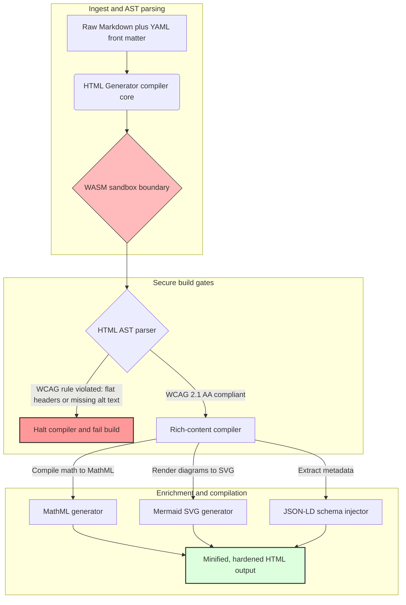

## تبدیل Markdown به HTML دسترس‌پذیر، آماده‌ی SEO و ساختاریافته با Rust در ۲۰۲۶

در سال ۲۰۲۶، محتوای وب به همان اندازه که توسط خوانندگان انسانی مصرف می‌شود، توسط خزنده‌های جست‌وجوی هوش مصنوعی، موتورهای جست‌وجوی مبتنی بر LLM و خط‌لوله‌های تولید تقویت‌شده با بازیابی (RAG) نیز مصرف می‌شود. HTML مسطح یا نادرست، کشف‌پذیری ماشینی را به خطر می‌اندازد، در حالی که ناتوانی در رعایت مقررات سخت‌گیرانه‌ی جهانی مانند [قانون دسترس‌پذیری اروپا (EAA)](https://www.accessibility-act.eu/) و [ADA Title III ایالات متحده](https://www.ada.gov/topics/title-iii/) اکنون یک مسئولیت مدنی بی‌ابهام است. [HTML Generator](https://github.com/sebastienrousseau/html-generator) یک کتابخانه‌ی Rust با کارایی بالا است که برای بستن این شکاف‌ها مهندسی شده است — در سطح کامپایلر، نه در وصله‌های پس از استقرار.

## پاسخ سریع

**HTML Generator در یک جمله چیست؟** HTML Generator یک کامپایلر متن‌باز و کاملاً Rust برای تبدیل Markdown به HTML است که [WCAG 2.1 AA](https://www.w3.org/TR/WCAG21/) را در زمان ساخت اعمال می‌کند، به‌طور خودکار نشانه‌های معنایی (landmark) و ویژگی‌های ARIA تولید می‌کند، فراداده‌ی [JSON-LD](https://json-ld.org/) سازگار با اسکیما را از فرانت‌مَتِر YAML تزریق می‌کند، نمودارهای Mermaid و ریاضیات را به SVG و MathML دسترس‌پذیر رندر می‌کند و درون یک سندباکس [WebAssembly](https://webassembly.org/) اجرا می‌شود — و بدین‌سان انتشار سازمانی را به یک لایه‌ی کنترل با گیت کامپایل و درجه‌ی امانی تبدیل می‌کند.

## خلاصه‌ی مدیریتی

رندر کردن Markdown بی‌اهمیت به نظر می‌رسد. اما HTML در سطح انتشار یک مسئله‌ی انطباق با مقررات است. در ژوئن ۲۰۲۶، هر نقطه‌ی تماس سازمانی — پرتال‌های روابط سرمایه‌گذاران، اظهارنامه‌های نظارتی، مستندات مشتریان، مراجع API و املاک بازاریابی — هم توسط انسان و هم توسط ماشین تجزیه می‌شود. دو فشار روی هر صفحه با هم برخورد می‌کنند: [EAA](https://www.accessibility-act.eu/) و [ADA Title III](https://www.ada.gov/topics/title-iii/) دسترس‌پذیری را به یک ریسک حقوقی در سطح هیئت‌مدیره تبدیل کرده‌اند، در حالی که بلعیدن محتوا توسط هوش مصنوعی و خط‌لوله‌های RAG به خروجی ساختاریافته و خوانا برای ماشین پاداش می‌دهند. کتابخانه‌های استاندارد Markdown، HTML مسطحی تولید می‌کنند که در هر دو دروازه ناکام می‌ماند. HTML Generator تولید سند را همچون یک خط‌لوله‌ی با گیت کامپایل تلقی می‌کند: راستی‌آزمایی WCAG یک خطای ساخت است، JSON-LD بدون مُهرزنی دستی از فرانت‌مَتِر YAML می‌آید، MathML و Mermaid به‌صورت دسترس‌پذیر رندر می‌شوند و کل موتور به‌عنوان یک هدف WebAssembly عرضه می‌شود تا تجزیه‌ی اسناد نامعتبر از میزبان سندباکس بماند.

## نکات کلیدی

- **دسترس‌پذیری به‌مثابه‌ی کد، خط پایه‌ی جدید است.** EAA دسترس‌پذیری را برای خدمات دیجیتال مصرف‌کننده الزامی می‌کند. HTML Generator درخت سند را در زمان کامپایل ارزیابی می‌کند و به‌طور خودکار نشانه‌های معنایی و ویژگی‌های ARIA تولید می‌کند — اصلاحات کمتر پس از استقرار، بودجه‌های ترمیم کمتر، و هیچ متن جایگزین (alt) گم‌شده‌ای که به تولید برسد.
- **داده‌ی ساختاریافته برای کشف‌پذیری هوش مصنوعی.** جست‌وجو و RAG مدرن به فراداده‌ی خوانا برای ماشین وابسته‌اند. کامپایلر فرانت‌مَتِر YAML را تجزیه می‌کند و [JSON-LD سازگار با Schema.org](https://schema.org/) را مستقیماً در سرِ سند تزریق می‌کند و محتوا را کاملاً برای [Google Rich Results](https://developers.google.com/search/docs/appearance/structured-data/intro-structured-data)، [Bing Webmaster](https://www.bing.com/webmasters) و خزنده‌های مبتنی بر LLM قابل‌تفسیر می‌سازد.
- **برتری در محتوای فنی.** انتشار فنی متن مسطح نیست. HTML Generator افزونه‌های ریاضی خام Markdown را به [MathML](https://www.w3.org/Math/) دسترس‌پذیر کامپایل می‌کند و نمودارهای [Mermaid.js](https://mermaid.js.org/) را به SVG واکنش‌گرا رندر می‌کند — هر دو ساختار سازگار با WCAG را حفظ می‌کنند به‌جای آنکه به تصاویر مبهم فروبکاهند.
- **سندباکس‌سازی WebAssembly.** تجزیه‌ی Markdown نامعتبر یک ریسک امنیتی است. با هدف قرار دادن [WASM](https://webassembly.org/)، HTML Generator درون یک سندباکس ایزوله اجرا می‌شود که از اجرای کد دلخواه جلوگیری می‌کند و سیستم میزبان را محافظت می‌کند — و مستقیماً الزامات امنیت ICT در [ماده‌ی ۶ DORA](https://eur-lex.europa.eu/legal-content/EN/TXT/?uri=CELEX%3A32022R2554) را برآورده می‌سازد.
- **حفاظت امانی برای هیئت‌مدیره‌ها.** عدم انطباق فنی اکنون به اتاق هیئت‌مدیره راه یافته است. استانداردسازی روی یک موتور HTML با گیت کامپایل، مدیران و مدیریت ارشد را از ریسک شخصی مدنی و نظارتی تحت DORA، EAA و ADA Title III محافظت می‌کند.

**مطالعه‌ی مرتبط:** [چرا YAML در ۲۰۲۶ به یک پشته‌ی Rust امن‌تر برای هوش مصنوعی، MCP و زیرساخت مالی نیاز دارد](https://sebastienrousseau.com/2026-06-18-noyalib-safe-yaml-rust-ai-mcp-financial-infrastructure-2026/)، یک تولیدکننده‌ی سایت ایستای امن به‌صورت پیش‌فرض برای انتشار در عصر هوش مصنوعی در ۲۰۲۶، [CloudCDN: یک نقشه‌ی راه متن‌باز برای لبه‌ی بومی هوش مصنوعی در ۲۰۲۶](https://sebastienrousseau.com/2026-06-11-cloudcdn-open-source-blueprint-ai-native-edge-2026/).

## ۰۱. چرا یک کامپایلر HTML با اولویت دسترس‌پذیری در ۲۰۲۶ اهمیت دارد

املاک وب سازمانی، کتابخانه‌های مستندات و مراکز راهنمای محصول، نقاط تماس دیجیتال حیاتی هستند. آن‌ها اکنون در معرض دو فشار شدید و متقاطع قرار دارند.

فشار نخست **بلعیدن و کشف‌پذیری توسط هوش مصنوعی** است. محتوا به‌طور فزاینده‌ای توسط مدل‌های زبانی بزرگ و خط‌لوله‌های تولید تقویت‌شده با بازیابی پردازش می‌شود. HTML مسطح یا نادرست، تجزیه‌ی خزنده را دچار سردرگمی می‌کند و پژوهش و مستندات سازمانی را در برابر پارادایم‌های جست‌وجوی مدرن نامرئی می‌گذارد — از جمله [تجربه‌ی مولد جست‌وجوی گوگل](https://blog.google/products/search/generative-ai-search/)، مرورگری [ChatGPT](https://chat.openai.com/) و عامل‌های RAG سازمانی.

فشار دوم **قوانین سخت‌گیرانه‌ی جهانی دسترس‌پذیری** است. تحت [قانون دسترس‌پذیری اروپا](https://www.accessibility-act.eu/) (که از ژوئن ۲۰۲۵ کاملاً قابل‌اعمال است) و [ADA Title III ایالات متحده](https://www.ada.gov/topics/title-iii/)، پلتفرم‌های انتشار سازمانی باید دسترس‌پذیری دیجیتال کامل را تضمین کنند. ناتوانی در برآورده کردن [WCAG 2.1 AA](https://www.w3.org/TR/WCAG21/) دیگر یک سهل‌انگاری مهندسی نیست؛ بلکه یک مسئولیت مدنی و نظارتی است که به توافق‌های تسویه‌ی چندمیلیون‌دلاری انجامیده است.

[HTML Generator](https://github.com/sebastienrousseau/html-generator) هر دو فشار را مستقیماً برطرف می‌کند. این یک کتابخانه‌ی Rust با ایمنی نخ (thread-safe) است که برای تبدیل Markdown به HTML دسترس‌پذیر، آماده‌ی SEO و ساختاریافته طراحی شده است. با تلقی تولید سند به‌عنوان یک خط‌لوله‌ی با گیت کامپایل، این موتور یک **بازده بر تاب‌آوری (RoR)** بالا ارائه می‌کند — و ترازنامه‌ها را از دعاوی دسترس‌پذیری محافظت می‌کند در حالی که خوانایی ماشینی را برای کشف توسط هوش مصنوعی به بیشینه می‌رساند.

## ۰۲. دریچه‌ی معماری HTML Generator در ۲۰۲۶

این چارچوب به‌صورت یک خط‌لوله‌ی کامپایل امن و چندمرحله‌ای طراحی شده که متن خام Markdown را به دارایی‌های ایستای دسترس‌پذیر و رمزنگارانه راستی‌آزمایی‌شده تبدیل می‌کند.

### جدول ۱: لایه‌های معماری HTML Generator و کاهش ریسک

| لایه | تصمیم طراحی | چرا اهمیت دارد | ریسک در صورت مدیریت نادرست |
| ---- | ---- | ---- | ---- |
| **لایه‌ی ورودی** | تجزیه‌گر Markdown به‌همراه فرانت‌مَتِر YAML | نویسندگان را همان‌جا که هستند ملاقات می‌کند؛ نثر را از فرادادهٔ ساختاری جدا می‌کند. | فرادادهٔ ناسازگار، نقشه‌های سایت شکسته، شکاف در نمایه‌سازی. |
| **لایه‌ی ساختار** | فهرست مطالب خودکار و نشانه‌های معنایی با برچسب‌های ARIA | درخت‌های سند دسترس‌پذیر و قابل‌پیمایش را به‌صورت ساختاری تولید می‌کند. | HTML مسطح که صفحه‌خوان‌ها را می‌شکند و WCAG را نقض می‌کند. |
| **لایه‌ی محتوای غنی** | رندر بومی MathML و SVG با Mermaid.js | فرمول‌ها و نمودارها را به SVG و MathML دسترس‌پذیر کامپایل می‌کند. | تأخیر رندر JS در سمت کلاینت و خروجی شکسته برای فناوری کمکی. |
| **لایه‌ی SEO و داده** | تولید یکپارچه‌ی JSON-LD و فرادادهٔ ساختاریافته | JSON-LD سازگار با [Schema.org](https://schema.org/) را مستقیماً در سرِ سند تزریق می‌کند. | خواندن نادرست نویسنده، بافتار و مجوزدهی توسط موتورهای جست‌وجو و خزنده‌های هوش مصنوعی. |
| **لایه‌ی زمان‌اجرا** | کامپایلر بومی Rust با یک هدف WebAssembly | اجرای امن و سندباکس‌شده روی سرورها، گره‌های لبه و مرورگرها را ممکن می‌سازد. | اجرای کد دلخواه هنگام تجزیه‌ی Markdown نامعتبر. |

## ۰۳. سیگنال‌های کلیدی امنیت و دسترس‌پذیری وب

برای راستی‌آزمایی اینکه دارایی‌های انتشار عمومی، ممیزی‌های نظارتی و امنیتی مدرن را برآورده می‌کنند، مدیران ارشد فناوری باید معیارهای مشخص و قابل‌سنجش را پایش کنند.

### جدول ۲: سیگنال‌های امنیت و دسترس‌پذیری وب

| سیگنال | معیار / محک عملیاتی | مرجع EAA / DORA / W3C | پیاده‌سازی فنی |
| ---- | ---- | ---- | ---- |
| **انطباق دسترس‌پذیری** | ۱۰۰٪ صفحات کامپایل‌شده در برابر قواعد WCAG 2.1 AA راستی‌آزمایی شوند. | [EAA](https://www.accessibility-act.eu/) و [ADA Title III](https://www.ada.gov/topics/title-iii/) | تجزیه‌گر HTML در زمان ساخت که برچسب‌های alt تصویر و نشانه‌های معنایی را ارزیابی می‌کند. |
| **سندباکس اجرای WASM** | ۱۰۰٪ ورودی‌های Markdown نامعتبر در یک زمان‌اجرای ایزوله‌ی WebAssembly کامپایل شوند. | [ماده‌ی ۶ DORA](https://eur-lex.europa.eu/legal-content/EN/TXT/?uri=CELEX%3A32022R2554) (امنیت ICT) | ایزوله‌سازی محیط تجزیه از سرور میزبان. |
| **پوشش فرادادهٔ ساختاریافته** | ۱۰۰٪ مقالات منتشرشده با سرآیندهای JSON-LD معتبر و سازگار با اسکیما تزریق شوند. | مشخصات [Schema.org](https://schema.org/) | تجزیه‌ی خودکار فرانت‌مَتِر و تبدیل آن به اشیای JSON-LD. |
| **توان عملیاتی کامپایل** | هدف صفحه‌بر‌ثانیه بالای ۱۰٬۰۰۰ روی سخت‌افزار متعارف. | بازده بر تاب‌آوری (RoR) | کامپایلر AST بسیار موازی‌سازی‌شده‌ی Rust. |
| **راستی‌آزمایی اسنیپت غنی** | صفر خطای تجزیه در اجراهای [Google Rich Results](https://search.google.com/test/rich-results) و [اعتبارسنج اسکیما](https://validator.schema.org/). | راهنمای جست‌وجوی گوگل | اعتبارسنجی ساختاری JSON-LD تولیدشده در طول خط‌لوله‌ی ساخت. |

## ۰۴. افسانه‌ی رندر ساده‌ی Markdown

یک برداشت اشتباه رایج در میان مدیران فناوری این است که تبدیل Markdown به HTML یک تمرین ساده‌ی جایگزینی متن است. بسیاری از کتابخانه‌های استاندارد، قالب‌بندی Markdown را به HTML مسطح و بدون ساختار ترجمه می‌کنند. خروجی برای یک خواننده‌ی بینا در مرورگر رندر می‌شود، اما یک تله‌ی انطباق را نمایندگی می‌کند.

HTML مسطح معمولاً فاقد سه چیز است.

1. **سلسله‌مراتب صحیح سرتیترها.** Markdown استاندارد ترتیب سرتیترها را اعمال نمی‌کند. پرش از یک `<h1>` به یک `<h4>` قواعد WCAG 2.1 AA را نقض می‌کند و پیمایش سند را برای صفحه‌خوان‌ها می‌شکند.
2. **معناشناسی صریح جدول.** جداول استاندارد Markdown به‌ندرت با دامنه‌ی (scope) صحیح `<th>` و ویژگی‌های `<tbody>` که برای تجزیه‌ی دسترس‌پذیر لازم است رندر می‌شوند.
3. **فرادادهٔ خوانا برای ماشین.** HTML استاندارد فاقد قلاب‌های JSON-LD است که پلتفرم‌های مدرن جست‌وجوی هوش مصنوعی و سامانه‌های بلعیدن RAG به آن‌ها وابسته‌اند.

HTML Generator این را با تجزیه‌ی Markdown به یک **درخت نحو انتزاعی (AST)** حل می‌کند. موتور، ساختار سند را پیش از انتشار HTML ارزیابی می‌کند، تودرتویی سرتیترها را راستی‌آزمایی می‌کند، ویژگی‌های ARIA مناسب را تزریق می‌کند و تأیید می‌کند که هر دارایی رسانه‌ای متن جایگزین دارد — و بدین‌سان دسترس‌پذیری را از یک ممیزی دستی به یک ناوردای تضمین‌شده‌ی زمان کامپایل تبدیل می‌کند.

## ۰۵. طراحی یک خط‌لوله‌ی ساخت با «دسترس‌پذیری به‌مثابه‌ی کد»

برای جلوگیری از اینکه دارایی‌های دسترس‌ناپذیر یا نمایه‌نشده اصلاً به استقرار عمومی برسند، دسترس‌پذیری باید یک گیت سخت‌گیرانه‌ی کامپایلر باشد. خط‌لوله‌ی زیر نشان می‌دهد چگونه HTML Generator، Markdown را ارزیابی می‌کند، راستی‌آزمایی ایزوله‌شده با WebAssembly را اجرا می‌کند و HTML سخت‌سازی‌شده و ساختاریافته منتشر می‌کند.

## ۰۶. کتابچه‌ی راهنمای هیئت‌مدیره و مسئولیت امانی

انطباق مدرن با دسترس‌پذیری و امنیت وب، مسائلی غیرقابل‌مذاکره در سطح هیئت‌مدیره هستند. مدیریت ارشد باید به زیرساخت انتشار از دریچه‌ی ریسک حقوقی، حفظ سرمایه و ریسک نظارتی نگاه کند.

- **قانون دسترس‌پذیری اروپا (EAA).** الزامات انطباق مستقیم و از نظر حقوقی الزام‌آور را بر پرتال‌های دیجیتال عمومی و خصوصی تحمیل می‌کند. عدم انطباق می‌تواند جریمه‌های مالی سنگین، دعاوی مدنی و کنارگذاری فوری دارایی از بازار اتحادیه‌ی اروپا را به‌بار آورد. با یکپارچه‌سازی «دسترس‌پذیری به‌مثابه‌ی کد»، هیئت‌مدیره‌ها می‌توانند تأیید کنند که کد ناسازگار نمی‌تواند عرضه شود — و ترمیم واکنشی را به یک سپر حقوقی ساختاری تبدیل کنند.
- **ماده‌ی ۶ DORA (محیط‌های امن ICT).** قواعد سخت‌گیرانه‌ای برای امنیت محیط ICT وضع می‌کند. با ایزوله کردن کامپایل Markdown درون یک سندباکس WebAssembly، سازمان‌ها تضمین می‌کنند که تجزیه‌ی مستندات بارگذاری‌شده توسط مشتری یا فیدهای شرکای تجاری نمی‌تواند سرورهای میزبان را در معرض اجرای کد دلخواه قرار دهد و بدین‌سان پرتال‌های بانکی حیاتی محافظت می‌شوند.
- **کاهش هزینه در ممیزی‌های انطباق.** انطباق سنتی دسترس‌پذیری به ممیزی‌های گران‌قیمت و گذشته‌نگرِ پس از استقرار متکی است — ده‌ها هزار دلار در سال برای هر سایت. پیاده‌سازی راستی‌آزمایی WCAG به‌عنوان یک مانع زمان کامپایل، آن هزینه‌های گذشته‌نگر را حذف می‌کند و بودجه‌ی انطباق را از دفاع به سوی نوآوری منتقل می‌سازد.

## ۰۷. این برای هر نوع بانک / سازمان چه معنایی دارد

### بانک‌های مهم سیستمی جهانی (G-SIBها)

G-SIBها املاک عمومی عظیم و چندزبانه‌ای را اداره می‌کنند که هزاران مقاله‌ی پژوهشی، افشاگری نظارتی و اسناد روابط سرمایه‌گذاران را در چندین حوزه‌ی قضایی منتشر می‌کنند. چالش آن‌ها مقیاس و برابری چندزبانه است. هدف WebAssembly و موتور Rust با توان‌عملیاتی بالای HTML Generator این امکان را می‌دهد که کتابخانه‌های پژوهشی بومی‌سازی‌شده و در مقیاس بزرگ، در عرض چند ثانیه به‌طور جهانی به‌روزرسانی، کامپایل و مستقر شوند — بدون تأخیر رندر یا پس‌رفت دسترس‌پذیری.

### بانک‌های تراکنشی و شرکتی

برای بانک‌های تراکنشی، پرتال‌های مشتریان، مراکز مستندات و راهنماهای API توسعه‌دهندگان، نقاط تماس دیجیتال حیاتی هستند. کامپایل این دارایی‌ها از طریق HTML Generator به این معناست که کانال‌های رو به مشتری هیچ ریسک XSS، هیچ بُردار ربایش وابستگی و هیچ کمبود دسترس‌پذیری را حمل نمی‌کنند — و بدین‌سان اعتماد نهادی حفظ و سطح دعاوی کاهش می‌یابد.

### بانک‌های منطقه‌ای و فین‌تک‌ها

بانک‌های منطقه‌ای و فین‌تک‌های چابک بدون بودجه‌های مهندسی G-SIB بر سر تجربه‌ی دیجیتال رقابت می‌کنند. HTML Generator یک خط‌لوله‌ی انتشار در سطح سازمانی را به‌صورت آماده در اختیار این تیم‌ها می‌گذارد و به املاک کوچک‌تر اجازه می‌دهد دارایی‌های دسترس‌پذیر، آماده‌ی SEO و سندباکس‌شده‌ای عرضه کنند که در برابر موشکافی هم رگولاتورها و هم مشتریان سازمانی بالقوه تاب می‌آورند.

## ۰۸. نقشه‌ی راه زیرساخت انتشار

املاک وب عمومی سازمانی یک مؤلفه‌ی اصلی تاب‌آوری عملیاتی هستند. اتکا به موتورهای وب کند، آسیب‌پذیر به‌صورت پویا و متکی به پایگاه‌داده — یا دارایی‌های ایستای امضانشده — یک ریسک تجاری غیرقابل‌قبول است.

برای ایمن‌سازی نقاط تماس دیجیتال عمومی و محافظت از ترازنامه‌ها در برابر دعاوی دسترس‌پذیری، مدیران ارشد فناوری و امنیت باید یک نقشه‌ی راه روشن را اجرا کنند.

1. **گذار به معماری‌های ایستا.** پلتفرم‌های قدیمی و پویای CMS را برای املاک پژوهشی، بازاریابی و مستندات کنار بگذارید. محتوا را به خط‌لوله‌های با گیت کامپایل مانند HTML Generator منتقل کنید.
2. **اعمال دسترس‌پذیری در زمان ساخت.** «دسترس‌پذیری به‌مثابه‌ی کد» را پیاده‌سازی کنید. خط‌لوله‌های کامپایل را به‌طور خودکار در برابر هر نقض WCAG 2.1 AA ناکام سازید.
3. **ایزوله‌سازی تجزیه در WebAssembly.** همه‌ی تجزیه‌ی اسناد و محتوا را درون یک زمان‌اجرای WASM سندباکس کنید تا ورودی نامعتبر هرگز به سیستم‌های میزبان دست نزند.
4. **تزریق فرادادهٔ غنی JSON-LD.** تضمین کنید که هر دارایی منتشرشده سرآیندهای JSON-LD سازگار با اسکیما را حمل می‌کند تا کشف‌پذیری توسط هوش مصنوعی به بیشینه برسد.

## ۰۹. پرسش‌های پرتکرار

**HTML Generator چگونه دسترس‌پذیری را اعمال می‌کند؟**

این ابزار درخت نحو انتزاعی HTML تولیدشده را در زمان ساخت تجزیه می‌کند و سند را در برابر قواعد [WCAG 2.1 AA](https://www.w3.org/TR/WCAG21/) ارزیابی می‌کند. اگر قاعده‌ای نقض شود — یک ویژگی alt گم‌شده، پرش در سرتیتر، یک کنترل فرم بدون برچسب — کامپایلر ساخت را متوقف می‌کند و دسترس‌پذیری را به‌جای یک وظیفه‌ی ممیزی پس از استقرار، به‌عنوان یک ناوردای زمان کامپایل تلقی می‌کند.

**چرا ایزوله‌سازی WebAssembly مهم است؟**

[WebAssembly](https://webassembly.org/) به موتور تجزیه‌ی Markdown اجازه می‌دهد درون یک سندباکس ایزوله و جدا از سرور میزبان اجرا شود. حتی زمانی که یک عامل خصمانه یک سند Markdown دستکاری‌شده را که برای بهره‌برداری از آسیب‌پذیری‌های تجزیه‌گر مهندسی شده بارگذاری کند، اجرا به دام می‌افتد — و بدین‌سان سیستم‌های میزبان محافظت شده و الزامات امنیت ICT در ماده‌ی ۶ DORA برآورده می‌شود.

**JSON-LD چگونه به کشف‌پذیری جست‌وجو در ۲۰۲۶ کمک می‌کند؟**

[JSON-LD](https://json-ld.org/) فرادادهٔ ساختاریافته و خوانا برای ماشین را در سرِ سند فراهم می‌کند. [Google Rich Results](https://developers.google.com/search/docs/appearance/structured-data/intro-structured-data)، خزنده‌های Bing و عامل‌های جست‌وجوی مبتنی بر LLM بی‌درنگ نویسنده، مجوز، تاریخ انتشار و بافتار معنایی را شناسایی می‌کنند — و بدین‌سان ابهام HTML استاندارد دور زده می‌شود و سطح حضور در کشف‌پذیریِ رانده‌شده با هوش مصنوعی افزایش می‌یابد.

**مخاطب HTML Generator چه کسانی هستند؟**

سازندگان سایت ایستا، تیم‌های مستندات، نویسندگان فنی، توسعه‌دهندگان Rust و مهندسان پلتفرم که املاک دسترس‌پذیری‌محور یا رو به رگولاتور عرضه می‌کنند. همچنین یک لایه‌ی پردازش محتوای عملی درون خط‌لوله‌های انتشار امن بزرگ‌تر مانند [Static Site Generator (SSG)](https://github.com/sebastienrousseau/static-site-generator) است.

## ۱۰. منابع

- کنسرسیوم وب جهان‌گستر (W3C)، ۲۰۲۴. [رهنمودهای دسترس‌پذیری محتوای وب (WCAG) 2.1 ⧉](https://www.w3.org/TR/WCAG21/ "Web Content Accessibility Guidelines 2.1").
- Schema.org، ۲۰۲۶. [مشخصات داده‌ی ساختاریافته‌ی Schema.org ⧉](https://schema.org/ "Schema.org structured-data specifications").
- پارلمان اروپا و شورای اتحادیه‌ی اروپا، ۲۰۲۲. [مقرره‌ی (EU) 2022/2554 درباره‌ی تاب‌آوری عملیاتی دیجیتال برای بخش مالی (DORA) ⧉](https://eur-lex.europa.eu/legal-content/EN/TXT/?uri=CELEX%3A32022R2554 "DORA Regulation").
- کمیسیون اروپا، ۲۰۲۵. [قانون دسترس‌پذیری اروپا ⧉](https://www.accessibility-act.eu/ "European Accessibility Act").
- وزارت دادگستری ایالات متحده، ۲۰۲۴. [ADA Title III ⧉](https://www.ada.gov/topics/title-iii/ "ADA Title III").
- گروه اجتماعی WebAssembly، ۲۰۲۶. [مشخصات WebAssembly ⧉](https://webassembly.org/ "WebAssembly").
- GitHub، ۲۰۲۶. [مخزن HTML Generator ⧉](https://github.com/sebastienrousseau/html-generator "HTML Generator open-source repository").
