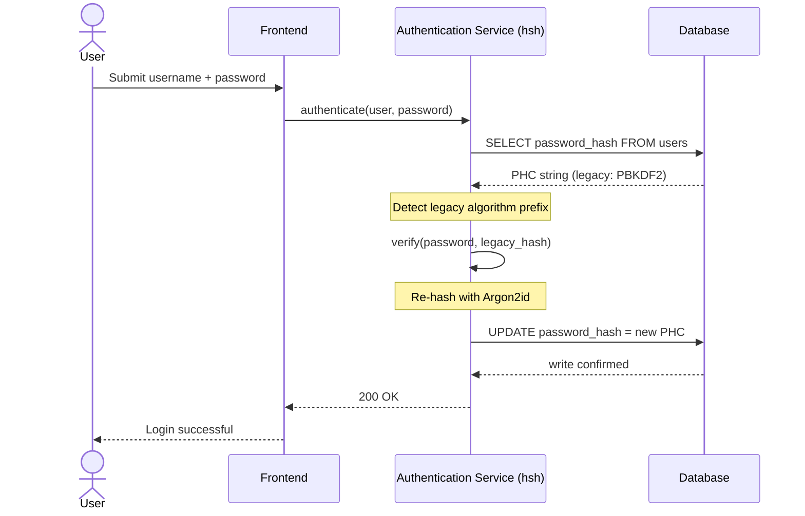
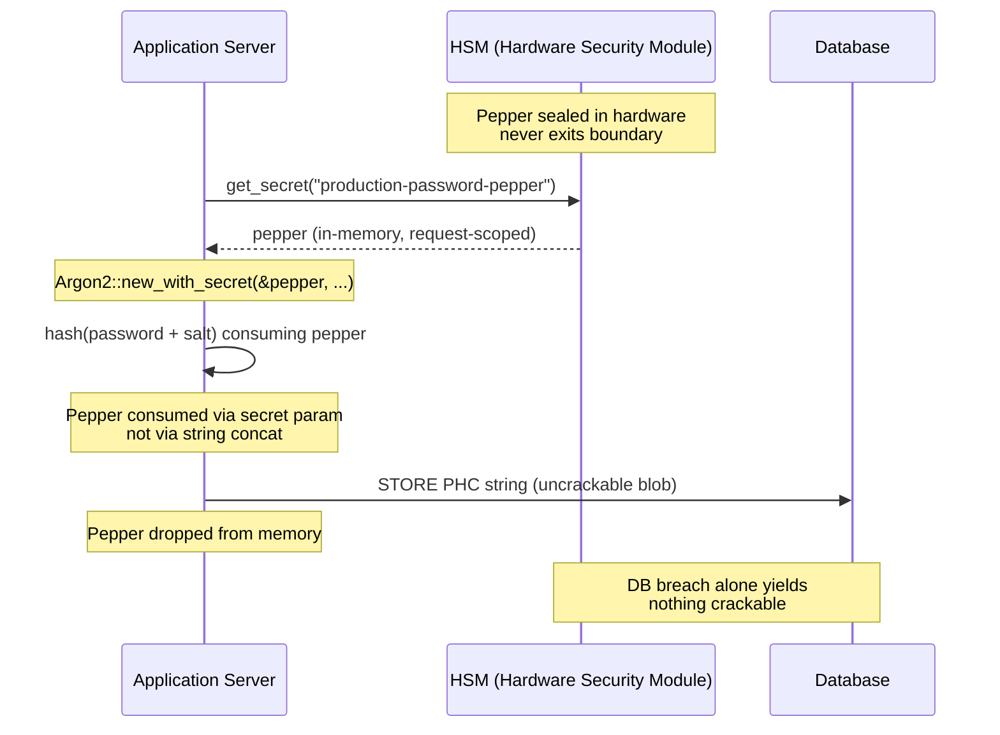

## ایمن‌سازی مدیریت گذرواژه در بانکداری سازمانی: درهم‌سازی چندالگوریتمی و ارتقا با hsh

> **خلاصهٔ مدیریتی.** احراز هویت بانکداری که در برابر یک مدل تهدید سال ۲۰۱۸ ساخته شده باشد، دیگر تحت رژیم مقرراتی ۲۰۲۶ مناسب هدف نیست. شکستن شتاب‌گرفته با GPU، تراکم ASIC و افق پساکوانتومیِ در حال نزدیک‌شدن، حاشیهٔ ایمنی PBKDF2 و scrypt با پارامترهای اولیه را فروریخته‌اند؛ مادهٔ ۵ DORA این فرسایش را به یک مسئولیت پاسخگو در سطح هیئت‌مدیره بدل کرده است. hsh، یک چارچوب متن‌باز کاملاً مبتنی بر Rust، به این مسئله در سه لایه به‌موازات می‌پردازد: یک ارسال‌کنندهٔ `verify_and_upgrade` که در هر ورود موفق، یک اعتبارنامهٔ ذخیره‌شده را بدون پنجرهٔ نگهداری به پارامترهای جاری Argon2id مجدداً درهم‌سازی می‌کند؛ یک لایهٔ فلفل‌پاشیِ قفل‌شده با HSM یا KMS که نفوذ به پایگاه‌داده را به‌تنهایی بی‌ثمر می‌سازد؛ و یک زنجیرهٔ تأمین ایمن از نظر حافظه که سطح حملهٔ رابط تابع بیگانه (foreign-function-interface) ذاتیِ کتابخانه‌های رمزنگاری پشتیبانی‌شده با C را حذف می‌کند. نتیجه، بستری است که DORA، نظم ریسک عملیاتیِ Basel III، پاسخگویی مدیران ارشد SM&CR و افق مهاجرت پساکوانتومی NIST IR 8547 را برآورده می‌سازد — بدون برنامهٔ بازنشانی انبوهی که تاریخاً برای ارتقای یک زیرساخت احراز هویت لازم بوده است.

بخش عمدهٔ احراز هویت بانکداری سازمانی هنوز بر لایهٔ گذرواژه‌ای تکیه دارد که تنها در برابر یک مدل تهدید سال ۲۰۱۸ سخت‌سازی شده است. سخت‌افزاری که آن را می‌شکند، جلوتر رفته است. با مقیاس‌گیری مزارع GPU و نزدیک‌شدن رایانه‌های کوانتومیِ مرتبط با رمزنگاری (CRQC)، درهم‌سازی قدیمی — PBKDF2، scrypt اولیه — با هر ساعت محاسباتی که مهاجمان صرف صف شکستن برون‌خط می‌کنند، فرسوده می‌شود. این فرسایش خاموش است: هیچ‌چیز در پایگاه‌دادهٔ تولید به شما نمی‌گوید که درهم‌سازی‌ای که دیروز قوی بود دیگر قوی نیست.

تحت [قانون تاب‌آوری عملیاتی دیجیتال (DORA)](https://eur-lex.europa.eu/eli/reg/2022/2554/oj "مقررات (EU) 2022/2554 — قانون تاب‌آوری عملیاتی دیجیتال")، رهاکردن دارایی‌های رمزنگاریِ قدیمی و چرخش‌نیافته در تولید دیگر بدهی فنی نیست. این یک مسئولیت مقرراتیِ نام‌برده‌شده است.

[hsh](https://github.com/sebastienrousseau/hsh "hsh — چارچوب درهم‌سازی گذرواژهٔ کاملاً مبتنی بر Rust") این شکاف را می‌بندد. این چارچوبِ کاملاً مبتنی بر Rust، چندین قالب درهم‌سازی را در کنار یکدیگر مدیریت می‌کند و اعتبارنامه‌های ضعیف را در همان لحظه، در جریان نشست‌های ورود فعال، ارتقا می‌دهد. زیرساخت احراز هویت بدون پنجرهٔ نگهداری، بدون بازنشانی اجباری و بدون حتی یک ثانیه توقف، با الزامات تاب‌آوری ۲۰۲۶ هم‌راستا می‌شود.

## ۰۱. مسئلهٔ پوسیدگی رمزنگاری در بانکداری

برای درک ضرورت چارچوبی مانند hsh، باید چرخهٔ حیات یک درهم‌سازی گذرواژه را درک کرد. الگوریتم‌ها با ظرافت پیر نمی‌شوند؛ آن‌ها نسبت به سخت‌افزار در دسترس برای شکستن‌شان فرسوده می‌شوند.

**شکاف شتاب‌دهی ASIC/GPU.** الگوریتم‌هایی مانند PBKDF2 طراحی شدند تا از نظر محاسباتی برای CPUها پرهزینه باشند. امروزه مهاجمان از GPUهای به‌شدت موازی برای اجرای حملات دیکشنری برون‌خط استفاده می‌کنند. یک درهم‌سازی قدیمی که در سال ۲۰۱۸ تولید شده، در برابر یک دشمنِ سال ۲۰۲۶ به‌طرز چشمگیری ضعیف‌تر است.

**ریسک مهاجرت انفجار بزرگ.** هنگامی که یک CISO تصمیم می‌گیرد از PBKDF2 به یک الگوریتم حافظه‌سخت مانند Argon2id ارتقا دهد، نمی‌تواند درهم‌سازی‌ها را معکوس کند تا آن‌ها را دوباره رمزنگاری کند. راهکارهای سنتی — تحمیل بازنشانی گذرواژه به میلیون‌ها کاربر — اصطکاک عظیم مشتری و ریسک عملیاتی به همراه دارند.

**زنجیرهٔ تأمین کتابخانهٔ C.** تاریخاً، میان‌افزار بانکداری برای درهم‌سازی به کتابخانه‌هایی مانند `argonautica` یا اتصالات خام C تکیه کرده است. این کتابخانه‌ها یک ریسک پنهانِ زنجیرهٔ تأمین به همراه دارند: یک سرریز بافرِ حافظهٔ واحد در ماژول احراز هویت می‌تواند به اجرای کد از راه دور (RCE) در ممتازترین لایهٔ پشتهٔ بانکداری بینجامد.

### مقایسهٔ الگوریتم‌ها — مقاومت سخت‌افزاری و سطح تنظیم

سه الگوریتمی که یک بانک به‌طور واقع‌بینانه در یک مجموعهٔ مهاجرت با آن‌ها روبه‌رو می‌شود، کمتر در انتخاب اولیهٔ رمزنگاری و بیشتر در نحوهٔ پیرشدن‌شان تحت فشار سخت‌افزار تفاوت دارند. جدول زیر وضعیت عملی را خلاصه می‌کند.

| الگوریتم | حافظه‌سخت | مقاومت GPU / ASIC | سطح تنظیم | وضعیت ۲۰۲۶ |
| ---- | ---- | ---- | ---- | ---- |
| **PBKDF2** | خیر | پایین — روی GPU برداری می‌شود؛ زیر یک میلی‌ثانیه به‌ازای هر حدس روی سخت‌افزار معمولی. | فقط شمار تکرار. | قدیمی. تنها به‌عنوان یک جایگزین سمت‌تأیید در طول مهاجرت قابل قبول است. |
| **scrypt** | بله (متوسط) | متوسط — هزینهٔ حافظه مزارع سادهٔ GPU را شکست می‌دهد؛ در مقیاس بزرگ با ASIC قابل مستهلک‌شدن است. | `N` (CPU/حافظه)، `r` (اندازهٔ بلوک)، `p` (موازی‌سازی). | برای پروژه‌های جدید منسوخ. در مجموعه‌های مهاجرت فعال. |
| **Argon2id** | بله (بالا) | بالا — حافظه‌سخت و زمان‌سخت؛ در برابر حملات کانال‌جانبی و TMTO مقاوم. | هزینهٔ حافظه (`m`)، هزینهٔ زمان (`t`)، موازی‌سازی (`p`)، راز (pepper). | پیش‌فرض توصیه‌شده. OWASP، پیش‌نویس NIST SP 800-63B-4، FedRAMP. |

نتیجه‌گیری برای برنامهٔ مهاجرت باریک است: PBKDF2 یک وضعیت *سمت‌تأیید* است، نه یک مقصد *سمت‌نوشتن*. هر ورود موفق روی یک رکورد PBKDF2 باید در مسیر خروج یک رکورد Argon2id تولید کند.

## ۰۲. عدسی معماری ۲۰۲۶ در hsh

این چارچوب در پنج لایهٔ اصلی ساختاربندی شده است که هر یک برای کاهش دسته‌ای خاص از ریسک عملیاتی مهندسی شده‌اند.

### جدول ۱: لایه‌های معماری hsh و کاهش ریسک

| لایه | تصمیم طراحی | چرا مهم است | ریسک در صورت مدیریت نادرست |
| ---- | ---- | ---- | ---- |
| **اولیه‌های رمزنگاری** | قالب رشتهٔ یکپارچهٔ PHC با پشتیبانی از Argon2id، scrypt و PBKDF2 | بهترین مقاومت رده در برابر حملات GPU را فراهم می‌کند در حالی که سازگاری با نسخه‌های پیشین را حفظ می‌کند. | جزیره‌های داده؛ الگوریتم‌های ضعیف که بیش از ۱۰۰ میلیارد حدس در ثانیه به‌صورت برون‌خط را ممکن می‌سازند. |
| **موتور سیاست** | ارسال `verify_and_upgrade` | گذار از سیاست‌های قدیمی به مدرن را به‌صورت پویا هنگام ورود خودکار می‌کند. | پوسیدگی امنیتی؛ باقی‌ماندن کاربران فعال روی انواع درهم‌سازی قدیمیِ به‌راحتی شکستنی. |
| **قفل متقابل سخت‌افزاری** | قابلیت‌های «فلفل‌پاشی» HSM و KMS ابری | تضمین می‌کند که نفوذ به پایگاه‌داده به‌تنهایی گذرواژه‌های نامزد را افشا نمی‌کند. | موفقیت حملات جستجوی فراگیر برون‌خط پس از یک نفوذ تزریق SQL. |
| **بهداشت امنیتی** | اعمال `deny.toml` و Rust خالص | FFI ناامن و وابستگی‌های خارجیِ نامعتبرِ C را به‌طور کامل مسدود می‌کند. | حملات فاجعه‌بار زنجیرهٔ تأمین و CVEهای فساد حافظه. |

## ۰۳. مسیر درهم‌سازی مجدد بدون توقف

الگوی `verify_and_upgrade` مهاجرت داده را از طریق یک سامانهٔ ارسال هوشمند و آگاه‌از‌وضعیت حل می‌کند که به صفر توقف پایگاه‌داده نیاز دارد.

هنگامی که یک کاربر اعتبارنامه‌های خود را ارسال می‌کند، hsh رشتهٔ درهم‌سازی گذرواژه (PHC) ذخیره‌شده را می‌خواند. اگر این رشته حاوی یک درهم‌سازی قدیمی باشد (مثلاً یک پیکربندی منسوخ PBKDF2)، سامانه جریان زیر را اجرا می‌کند:

1. **شناسایی:** الگوریتم قدیمی و پارامترهای خاص آن را تجزیه می‌کند.
2. **تأیید:** گذرواژهٔ نامزد را در برابر درهم‌سازی قدیمی اعتبارسنجی می‌کند.
3. **ارتقای بی‌درنگ:** در صورت تطبیق موفق، گذرواژهٔ نامزد به‌صورت متن ساده را در حافظه می‌گیرد و بی‌درنگ یک درهم‌سازی جدید را با استفاده از سیاست بسیار ایمن Argon2id محاسبه می‌کند.
4. **پایداری:** رشتهٔ PHC جدید را به برنامهٔ بانکداری بازمی‌گرداند که رکورد قدیمی را در پایگاه‌داده بازنویسی می‌کند.

این فرآیند برای کاربر نهایی کاملاً شفاف است. این کار به‌طور مؤثر فعال‌ترین حساب‌ها را همان روز نخست به بالاترین رده امنیتی مهاجرت می‌دهد و سطح حملهٔ بانک را به‌مرور زمان به‌شکلی ارگانیک به‌طرز چشمگیری کاهش می‌دهد.

توالی زیر نشان می‌دهد که در جریان یک رویداد ورود واحد، هنگامی که رکورد ذخیره‌شده روی یک الگوریتم قدیمی است، چه اتفاقی می‌افتد. کاربر هیچ تغییری نمی‌بیند؛ زیرساخت احراز هویت بانک به‌اندازهٔ یک رکورد تقویت می‌شود.



### الگوی پیاده‌سازی — ارسال `verify_and_upgrade`

سطح یکپارچه‌سازی درون یک سرویس احراز هویت کوچک است. مسیر کد قدیمی به‌عنوان جایگزین باقی می‌ماند؛ مسیر کد جدید همان ارسال‌کننده است.

```rust
use hsh::{Hasher, UpgradeResult};

struct UserRecord {
    username: String,
    password_hash: String, // PHC string
}

async fn authenticate(user: UserRecord, password_attempt: &str) -> Result<bool, AuthError> {
    let hasher = Hasher::new();
    match hasher.verify_and_upgrade(password_attempt, &user.password_hash) {
        Ok(UpgradeResult::Verified(is_valid)) => Ok(is_valid),
        Ok(UpgradeResult::Upgraded(new_hash)) => {
            db::update_user_hash(&user.username, new_hash).await?;
            Ok(true)
        }
        Err(_) => Err(AuthError::InvalidCredentials),
    }
}
```

سه ویژگی اهمیت دارند:

- **آگاهی از وضعیت.** `verify_and_upgrade` پیشوند رشتهٔ PHC را بازرسی می‌کند. اگر نشانگر الگوریتم قدیمی باشد، چارچوب به‌طور خودکار درهم‌سازی مجدد را در برابر سیاست پیکربندی‌شدهٔ Argon2id راه‌اندازی می‌کند. هیچ انشعابی در کد فراخوان لازم نیست.
- **اتمی‌بودن.** درهم‌سازی مجدد تنها پس از موفقیت تأیید قدیمی، درون همان رویداد احراز هویت رخ می‌دهد. هیچ کار دسته‌ای جداگانه، هیچ پنجرهٔ مهاجرت زمان‌بندی‌شده و هیچ مهاجرت انبوهِ مخربی برای بازگشت به عقب وجود ندارد.
- **پایداری.** گونهٔ `UpgradeResult::Upgraded` رشتهٔ PHC جدید را حمل می‌کند. برنامه آن را از طریق همان مسیر داده‌ای که هم‌اکنون برای رکورد قدیمی وجود دارد پایدار می‌کند — بدون سطح نوشتن موازی، بدون پروتکل نوشتن دومرحله‌ای.

**حالت‌های خرابی.** اگر نوشتن پایگاه‌داده شکست بخورد یا KMS در طول نوشتنِ ارتقا به‌طور مختصر در دسترس نباشد، نشست همچنان در برابر درهم‌سازی قدیمی موفق می‌شود و رکورد روی الگوریتم قدیمی باقی می‌ماند. ورود موفق بعدی، ارتقا را دوباره تلاش می‌کند. هیچ وضعیت نیمه‌مهاجرت‌یافته و هیچ خرابیِ قابل‌مشاهده برای کاربر وجود ندارد — مهاجرت در سراسر رویدادهای ورود یکنواخت (monotonic) است، و هزینهٔ به‌ازای رکوردِ یک ارتقای ناموفق دقیقاً یک تلاش مجددِ اضافی در ورود بعدی است.

## ۰۴. درهم‌سازی‌های فلفل‌پاشی‌شده از طریق قفل متقابل HSM / KMS

درهم‌سازی استاندارد گذرواژه در برابر نشت‌های مستقیم پایگاه‌داده محافظت می‌کند، اما اگر مهاجمی هم به پایگاه‌داده (درهم‌سازی‌ها و نمک‌ها) دست یابد، می‌تواند شکستن برون‌خط را اجرا کند.

hsh یک لایهٔ امنیتی مستحکم «فلفل‌پاشی‌شده» معرفی می‌کند. با یکپارچه‌سازی با ماژول‌های امنیت سخت‌افزاری (HSM) یا سرویس‌های مدیریت کلید بومی-ابری (KMS)، خروجی نهایی Argon2id به‌صورت رمزنگارانه با یک کلید پرآنتروپی که هرگز از مرز سخت‌افزار امن خارج نمی‌شود لفاف‌بندی می‌شود. اگر پایگاه‌دادهٔ کاربر خارج‌سازی شود، مهاجم تنها بلوک‌های رمزنگاری‌شده در اختیار دارد. او نمی‌تواند بدون نفوذ همزمان به زیرساخت HSM جدا‌شدهٔ فیزیکیِ بانک، شکستن گذرواژه‌ها را آغاز کند.

نمودار معماری زیر مسیر راز را ردیابی می‌کند. pepper هرگز در پایگاه‌داده فرود نمی‌آید؛ پایگاه‌داده هرگز چیزی نگه نمی‌دارد که به‌تنهایی آدرس‌پذیر باشد. دو انبار می‌توانند به‌طور مستقل از کار بیفتند — سامانه تنها در صورتی محرمانگی را از دست می‌دهد که هر دو با هم از کار بیفتند.



### الگوی پیاده‌سازی — Argon2id فلفل‌پاشی‌شده و پشتیبانی‌شده با HSM

pepper در زمان درخواست از HSM تأمین می‌شود، نه از یک فایل پیکربندی. `Argon2::new_with_secret` آن را از طریق پارامتر رازِ الگوریتم مصرف می‌کند، نه از طریق الحاق رشته.

```rust
use argon2::{
    Argon2, Algorithm, Version, Params,
    PasswordHasher, PasswordVerifier,
    password_hash::{PasswordHash, SaltString, rand_core::OsRng},
};

async fn authenticate_with_hsm(
    user: UserRecord,
    password_attempt: &str,
) -> Result<bool, AuthError> {
    let pepper = hsm::client::get_secret("production-password-pepper").await?;
    let hasher = Argon2::new_with_secret(
        &pepper,
        Algorithm::Argon2id,
        Version::V0x13,
        Params::default(),
    )
    .map_err(|_| AuthError::Internal)?;

    let parsed = PasswordHash::new(&user.password_hash)
        .map_err(|_| AuthError::InvalidCredentials)?;
    if hasher.verify_password(password_attempt.as_bytes(), &parsed).is_ok() {
        if is_legacy_hash(&user.password_hash) {
            let new_hash = hasher
                .hash_password(
                    password_attempt.as_bytes(),
                    &SaltString::generate(&mut OsRng),
                )
                .map_err(|_| AuthError::Internal)?
                .to_string();
            db::update_user_hash(&user.username, new_hash).await?;
        }
        return Ok(true);
    }
    Err(AuthError::InvalidCredentials)
}
```

سه پیامد هم‌راستا با DORA از این شکل بیرون می‌آید:

- **چرخش کلید به‌عنوان یک مسئلهٔ مدیریت کلید.** pepper پشت مرز HSM/KMS زندگی می‌کند، نه در پایگاه‌داده. چرخش به یک تغییر مدیریت کلید بدل می‌شود، نه یک کمپین درهم‌سازی مجدد در سراسر زیرساخت کاربران. درهم‌سازی‌های جدید به نسخهٔ جاری pepper مقید می‌شوند؛ درهم‌سازی‌های قدیمی تا زمانی که به‌طور طبیعی ارتقا یابند، تحت نسخهٔ مقیدشان تأیید می‌شوند.
- **تفکیک وظایف.** هویت سرویسی که pepper را می‌خواند باید قابل ممیزی و با کمترین امتیاز باشد. یک خارج‌سازی کامل پایگاه‌داده بدون مجوز متناظر HSM هیچ چیز قابل شکستنی به دست نمی‌دهد. یک به‌خطرافتادن مجوز HSM بدون پایگاه‌داده هیچ چیز آدرس‌پذیری به دست نمی‌دهد. شعاع انفجار هر یک از این دو خرابی منفرد، محدود است.
- **پرهیز از باگ‌های گسترش طول و الحاق.** استفاده از پارامتر رازِ Argon2 به‌جای الحاق رشته، یک دستهٔ کامل از دام‌های رمزنگاری — گسترش طول، الحاق UTF-8 با نوع نادرست، باگ‌های ترتیب نمک/pepper — را از سطح پیاده‌سازی حذف می‌کند.

## ۰۵. هم‌راستایی مقرراتی: DORA، Basel III و SM&CR

- **مواد ۵ و ۶ DORA:** نهادهای مالی را ملزم می‌کند که چارچوب‌های مدیریت ریسک ICT را حفظ کنند. راهبردی که بر درهم‌سازی‌های گذرواژهٔ چرخش‌نیافته و ده‌ساله تکیه دارد، این اصول را نقض می‌کند. hsh یک سازوکار مستند و خودکار برای ارتقای پیوستهٔ محافظت‌های رمزنگاری فراهم می‌کند.
- **Basel III:** سرمایهٔ مقرراتی را به احتمال و شدت رویدادهای زیان پیوند می‌دهد. با پیاده‌سازی Argon2id همراه با قفل متقابل HSM، شدت یک نفوذ به پایگاه‌داده به‌طرز چشمگیری کاهش می‌یابد و از استدلال‌های قابل‌کمّی‌سازی برای تخصیص سرمایهٔ ریسک عملیاتی کمتر پشتیبانی می‌کند.
- **پاسخگویی SM&CR:** تأیید معماری‌ای که فعالانه پوسیدگی رمزنگاری را ترمیم می‌کند، برای مدیران ارشدِ نام‌برده‌شده یک زنجیرهٔ قابل تأیید و قابل مستندسازی از کاهش ریسک فراهم می‌کند.

## پرسش‌های متداول

**آیا hsh برای یک مسیر احراز هویت بانکداری رده‌یک آمادهٔ تولید است؟**
این کتابخانه متن‌باز و مستند است و Argon2id را از طریق همان crate `argon2` که زیربنای اکوسیستم درهم‌سازی گذرواژهٔ RustCrypto است، به‌کار می‌گیرد. پذیرش در رده‌یک از فرآیند دقت لازمِ خودِ بانک پیروی می‌کند: بازبینی مستقل کد، گواهی ساخت بازتولیدپذیر، مقیدسازی درخت وابستگی، آزمون یکپارچه‌سازی با فروشندهٔ HSM و تأیید ریسک عملیاتی. hsh بستر را فراهم می‌کند؛ بانک استقرار را گواهی می‌کند.

**چگونه `verify_and_upgrade` از ریسک مهاجرت انبوه پرهیز می‌کند؟**
تأییدکننده رشتهٔ PHC را در زمان تجزیه بازرسی می‌کند، الگوریتم قدیمی را برای اعتبارسنجی گذرواژه اجرا می‌کند و — اگر الگوریتم یا مجموعه‌پارامتر ذخیره‌شده زیر کف جاری باشد — متن ساده را تحت Argon2id با pepper مقیدشدهٔ HSM مجدداً درهم‌سازی می‌کند و رشتهٔ PHC جدید را به‌صورت اتمی بازمی‌نویسد. کاربر یک ورود عادی را تجربه می‌کند. زیرساخت به‌ازای هر احراز هویت موفق، به‌اندازهٔ یک رکورد تقویت می‌شود. بدون کمپین بازنشانی، بدون پنجرهٔ نگهداری، بدون رویداد ریسک عملیاتی.

**بر سر حساب‌های خفته که هرگز وارد نمی‌شوند چه می‌آید؟**
رکوردهایی که هرگز احراز هویت نمی‌شوند، هرگز مجدداً درهم‌سازی نمی‌شوند. بانک‌ها این مسئله را با دو سیاست مکمل حل می‌کنند: یک آستانهٔ خفتگیِ مستند (اغلب ۱۸ تا ۲۴ ماه) که پس از آن حساب تحت یک کمپین بازنشانی کنترل‌شده به‌صورت اداری چرخانده می‌شود، و یک اجرای درهم‌سازی مجدد ترکیبی (synthetic) در طول نگهداری زمان‌بندی‌شده برای حساب‌ها در گروه‌های تعریف‌شده (پرارزش، پرامتیاز، تحت مقررات). هر دو سیاست هستند، نه رفتار کتابخانه؛ hsh تصمیم ارسال را در تله‌متری ممیزی ثبت می‌کند تا مالک عملیاتی بتواند پوشش را اثبات کند.

**آیا pepperِ HSM یک نقطهٔ شکست منفرد روی مسیر احراز هویت وارد می‌کند؟**
همان HSMی که پیام‌های پرداخت را امضا می‌کند و کلیدهای پشتیبانی‌شده با KMS را می‌چرخاند، روی مسیر است. ریسک با وضعیت موجود بانک یکسان است؛ hsh آن را به ارث می‌برد نه اینکه معرفی کند. اقدامات کاهشی استاندارد هستند: جفت‌های HSM با دسترس‌پذیری بالا (HA)، مناطق KMS در حالت آماده‌به‌کار داغ، بازیابی pepper محدود به دامنهٔ درخواست با بازگشت مدارشکن (circuit-breaker) به حالت فقط‌خواندنی، و یک راهنمای عملیاتی صریح برای در دسترس نبودن HSM. pepper همان پارامتر رازِ `argon2` است که درون‌فرآیندی مصرف و پس از استفاده از حافظه رها می‌شود.

**hsh نسبت به مهاجرت پساکوانتومی کجا قرار می‌گیرد؟**
hsh یک چارچوب درهم‌سازی گذرواژه و راز است، نه یک اولیهٔ کپسوله‌سازی کلید یا امضا. گذار PQC که در [NIST IR 8547](https://csrc.nist.gov/pubs/ir/8547/ipd "گذار به استانداردهای رمزنگاری پساکوانتومی") مستند شده، برقراری کلید (ML-KEM، FIPS 203) و امضاها (ML-DSA، FIPS 204؛ SLH-DSA، FIPS 205) را هدف می‌گیرد. لایهٔ درهم‌سازی‌ای که hsh پوشش می‌دهد تا حد زیادی نسبت به آن مهاجرت متعامد است. این دو در سطح بستر همگرا می‌شوند — هر دو یک زنجیرهٔ تأمین رمزنگاریِ ایمن از نظر حافظه، قابل ممیزی و با ساخت بازتولیدپذیر می‌خواهند — که دقیقاً همان وضعیتی است که hsh امروز فراهم می‌کند.

## نتیجه‌گیری

درهم‌سازی گذرواژه به‌شیوهٔ «مستقر کن و فراموش کن» به پایان رسیده است. DORA انفعال رمزنگاری را از بدهی فنی به یک مسئولیت مقرراتیِ نام‌برده‌شده منتقل کرده، و منحنی سخت‌افزار هر سال شیب تندتری می‌گیرد. سهم hsh یک الگوریتم قوی‌تر نیست — Argon2id سال‌هاست در دسترس بوده است. سهم آن، ماشین‌آلات عملیاتیِ مهاجرت به آن است، بدون زمان‌بندی توقف، بدون تحمیل بازنشانی به کاربران و بدون سپردن مسیر احراز هویت بانک به لفاف‌های FFI مبتنی بر C.

[کد منبع hsh](https://github.com/sebastienrousseau/hsh "hsh — چارچوب درهم‌سازی گذرواژهٔ کاملاً مبتنی بر Rust، با پروانهٔ دوگانهٔ MIT و Apache 2.0") تحت پروانهٔ دوگانهٔ MIT و Apache 2.0 در دسترس است.

## منابع

Basel Committee on Banking Supervision (2011). *Basel III: A global regulatory framework for more resilient banks and banking systems*. Bank for International Settlements. Available at: [https://www.bis.org/publ/bcbs189.pdf](https://www.bis.org/publ/bcbs189.pdf "Basel III: A global regulatory framework for more resilient banks and banking systems")

Biryukov, A., Dinu, D., Khovratovich, D., and Josefsson, S. (2021). *RFC 9106: Argon2 Memory-Hard Function for Password Hashing and Proof-of-Work Applications*. Internet Engineering Task Force. Available at: [https://datatracker.ietf.org/doc/html/rfc9106](https://datatracker.ietf.org/doc/html/rfc9106 "RFC 9106 — Argon2 Memory-Hard Function for Password Hashing")

European Parliament and Council (2022). *Regulation (EU) 2022/2554 on digital operational resilience for the financial sector (DORA)*. Available at: [https://eur-lex.europa.eu/eli/reg/2022/2554/oj](https://eur-lex.europa.eu/eli/reg/2022/2554/oj "Regulation (EU) 2022/2554 — DORA")

Financial Conduct Authority (2015). *Senior Managers and Certification Regime (SM&CR)*. Available at: [https://www.fca.org.uk/firms/senior-managers-certification-regime](https://www.fca.org.uk/firms/senior-managers-certification-regime "Senior Managers and Certification Regime")

National Institute of Standards and Technology (2024). *Initial Public Draft — Transition to Post-Quantum Cryptography Standards (NIST IR 8547)*. Available at: [https://csrc.nist.gov/pubs/ir/8547/ipd](https://csrc.nist.gov/pubs/ir/8547/ipd "NIST IR 8547 — Transition to Post-Quantum Cryptography Standards")

OWASP Foundation (2024). *Password Storage Cheat Sheet*. Available at: [https://cheatsheetseries.owasp.org/cheatsheets/Password_Storage_Cheat_Sheet.html](https://cheatsheetseries.owasp.org/cheatsheets/Password_Storage_Cheat_Sheet.html "OWASP Password Storage Cheat Sheet")
