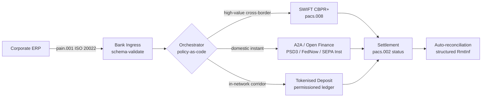

## فرامرزی ۲۰۲۶: ISO 20022، دارایی باز و سپرده‌های توکنی در خزانه‌داری شرکتی

> **خلاصه اجرایی.** خزانه‌داری شرکتی فرامرزی در سال ۲۰۲۶ پیش از آنکه یک مسئله مدیریت رابطه باشد، یک مسئله مهندسی چندریلی است. مقررات PSD3 و مقررات دسترسی به داده‌های مالی (FiDA) محیط بانکداری باز را به داده‌های خزانه‌داری شرکتی گسترش می‌دهند؛ گذار MT/MX در SWIFT در نوامبر ۲۰۲۶، pacs.008 سازگار با CBPR+ را به تنها قالب قابل‌اجرای بین‌بانکی فرامرزی تبدیل می‌کند؛ سپرده‌های توکنی و ریل‌های استیبل‌کوین تنظیم‌شده بخش تسویه عمده‌فروشی را در نزدیکی T+0 درون شبکه‌های مجازدار انجام می‌دهند. CIB که در این چرخه پیروز می‌شود آن نیست که یک ریل واحد را برمی‌گزیند؛ آن است که لایه هماهنگ‌سازی را که این ریل‌ها را به هم می‌بندد مهندسی می‌کند. این مقاله معماری چهارریلی (A2A تحت PSD3، SWIFT CBPR+، سپرده‌های توکنی صادرشده توسط بانک، استیبل‌کوین‌های تنظیم‌شده) را بررسی می‌کند — اینکه هر ریل چه کاری را خوب انجام می‌دهد، مرزهای مواجهه اعتباری کجا قرار می‌گیرند، و لایه هماهنگ‌سازی سیاست‌به‌مثابه‌کد بالای آن‌ها چه چیزی را باید اعمال کند تا شرکت یک پرداخت ببیند و ناظر یک ردِ قابل‌حسابرسی.

یک شرکت صنعتی اروپایی صبح یک روز چهارشنبه به یک تأمین‌کننده برزیلی ۴٫۲ میلیون یورو پرداخت می‌کند. ایستگاه کاری خزانه‌داری یک بانک را انتخاب نمی‌کند. یک ریل را انتخاب می‌کند — یک توالی از ریل‌ها. دستور رو به مشتری به‌صورت یک پیام A2A از نوع pain.001 که از طریق یک ارائه‌دهنده دارایی باز تحت PSD3 مسیریابی شده است فرود می‌آید. بانک آن را روی سپرده‌های توکنی درون یک شبکه خصوصی CIB از دو حوزه کارگزار عبور می‌دهد. دنباله بلند — پاکسازی یک فاکتور ۸۰٬۰۰۰ دلاری به یک زیرتأمین‌کننده بدون رابطه سپرده توکنی — همچنان روی SWIFT CBPR+ به‌صورت یک pacs.008 حرکت می‌کند. مشتری یک پرداخت می‌بیند. معماری چهار ریل می‌بیند. [ISO 20022](/2023-09-29-automating-iso-20022-compliant-payment-file-creation-with-pain001/index.html) تنها دلیلی است که همه چیز کنار هم می‌ماند.

این همان مدل عملیاتی است که Mastercard هنگام سخن‌گفتن درباره [تکامل از بانکداری باز به دارایی باز](https://www.mastercard.com/us/en/news-and-trends/Insights/2026/open-banking-to-open-finance-the-evolution-of-financial-data.html "Mastercard: open banking to open finance, the evolution of financial data") توصیف می‌کند — داده و پرداخت‌ها در یک لایه هماهنگ‌سازی درهم‌آمیخته، با ریلی که توسط سیستم انتخاب می‌شود، نه توسط مشتری. پرسش جالب برای فناوران ارشد بانکی این نیست که کدام ریل پیروز می‌شود. این است که لایه هماهنگ‌سازی چگونه مهندسی، اداره و مغایرت‌گیری می‌شود.

## ۰۱. از کارت‌ها به A2A — تغییر به سمت دارایی باز

ریل‌های کارتی از میان نمی‌روند. آن‌ها بازتعریف می‌شوند.

در طول سال ۲۰۲۵ و ورود به ۲۰۲۶، [مقررات PSD3 و مقررات دسترسی به داده‌های مالی (FiDA)](https://www.consultancy.uk/news/42202/orchestrating-open-banking-for-platform-growth-2026-outlook "Consultancy.uk: orchestrating open banking for platform growth, 2026 outlook") الزام بانکداری باز را فراتر از حساب‌های پرداخت به داده‌های بازنشستگی، وام مسکن، پس‌انداز، بیمه و خزانه‌داری شرکتی گسترش دادند. پیامد آن برای خزانه‌داری شرکتی مستقیم است: یک مدیر رابطه CIB اکنون می‌تواند تصویر کامل نقدینگی یک شرکت را در چند بانک از طریق یک قرارداد API واحد و به دستور خود شرکت مصرف کند.

دو بازیگر به‌طور آشکار در حال ساخت لایه هماهنگ‌سازی‌ای هستند که شرکت‌ها مصرف خواهند کرد. Nexi ردپای پذیرندگی خود را به آغاز پرداخت‌های A2A در سراسر SEPA Instant و کریدورهای RTGS پان‌اروپایی گسترش داده است، به‌صورت بومی ISO 20022 و سرتاسری. پلتفرم دارایی باز Mastercard — که بر خرید Aiia و Finicity استوار است — لایه گردآوری داده و رضایت را در زیرِ آن فراهم می‌کند، با آغاز پرداخت که از طریق همان مجموعه API‌هایی که پیش‌تر به مجوزدهی کارت خدمت می‌کردند نمایان می‌شود.

این تغییر به سه دلیل اهمیت دارد:

1. **اقتصاد واحد.** A2A آغازشده تحت PSD3 کارمزد تبادل را از پرداخت حذف می‌کند. برای جریان‌های B2B با ارزش بالا، صرفه‌جویی چشمگیر است؛ برای جریان‌های مصرفی با ارزش پایین، پشته هزینه پذیرنده فرو می‌ریزد.
2. **کیفیت داده.** A2A تحت ISO 20022 داده حواله ساختاریافته‌ای را حمل می‌کند که کارت‌ها هرگز نمی‌توانستند. نرخ مغایرت‌گیری خودکار بالای ۹۵٪ اکنون شرط پایه است.
3. **مدل ریسک.** A2A یک انتقال اعتباری است، نه مجوزدهی کارت. سطح تقلب، مدل بازپرداخت (chargeback) و مدل اختلاف همگی متفاوت‌اند. تیم‌های خزانه‌داری شرکتی باید بدانند که لایه حفاظت از مشتری در حال بازسازی است، نه به‌ارث‌رسیده.

CIB که در سال ۲۰۲۶ یک پیشنهاد چندریلی می‌فروشد، هماهنگ‌سازی می‌فروشد — نه دسترسی. دسترسی اکنون تنظیم‌شده است.

## ۰۲. ISO 20022 به‌عنوان زبان مشترک میان ریل‌ها

دلیل عملی‌بودن اساساً چندریلی این است که قالب پیام اکنون میان ریل‌ها یکسان است.

کمیته پرداخت‌ها و زیرساخت‌های بازار (CPMI) در بانک تسویه بین‌المللی (BIS)، در [الزامات هماهنگ‌سازی ISO 20022 برای ارتقای پرداخت‌های فرامرزی](https://www.bis.org/cpmi/publ/d230.pdf "BIS CPMI: ISO 20022 harmonisation requirements for enhancing cross-border payments") خود، استدلال معماری را روشن ساخت. گذار نوامبر ۲۰۲۵ به CBPR+ عصر MT103 / MT202 را برای پیام‌رسانی بین‌بانکی فرامرزی بست. از آن نقطه به بعد، هر ریل عمده — SWIFT، FedNow، SEPA Instant، RTP و سامانه‌های پرداخت آنی عمده در آسیا و آمریکای لاتین — به همان دستور زبان pacs.008 / pacs.009 / pain.001 سخن می‌گویند.

پیامد عملی برای خزانه‌داری شرکتی:

- **مسیریابی داده‌محور است.** ایستگاه کاری خزانه‌داری می‌تواند یک pain.001 را یک بار بخواند و ریل را برای هر پرداخت بر پایه کریدور، اندازه تراکنش، زمان قطع و رابطه طرف مقابل تصمیم بگیرد — بدون بازنگاشت پیام.
- **داده حواله از پرش زنده می‌ماند.** فیلدهای حواله ساختاریافته (`<RmtInf><Strd>`) بدون کوتاه‌شدگی از میان بخش‌های کارگزار عبور می‌کنند. نرخ مغایرت‌گیری خودکار بالا می‌رود، زیرا داده دیگر در مرز ریل از دست نمی‌رود.
- **غربالگری تحریم‌ها قابل‌حسابرسی می‌شود.** فیلدهای ساختاریافته `<Dbtr>` / `<Cdtr>` / `<DbtrAgt>` / `<CdtrAgt>` با ارجاعات LEI جایگزین غربالگری نام آزادمتن می‌شوند. نرخ برخورد (hit) کاهش می‌یابد. صف‌های بررسی کوچک می‌شوند.

نمودار زیر یک pain.001 واحد را ردیابی می‌کند که از ورودی بانک، به درون هماهنگ‌کننده سیاست‌به‌مثابه‌کد، و بیرون به هر ریلی که کریدور و اندازه تراکنش اقتضا می‌کند می‌رود — یک پیام، چندین ریل، بدون بازنگاشت.

بهای این یکپارچگی، انضباط مهندسی است. ISO 20022 اجازه‌دهنده است. دو بانک می‌توانند کاملاً با CBPR+ سازگار باشند و همچنان پیام‌های pacs.008ای تولید کنند که در کاربرد فیلد، مجموعه نویسه و ساختار داده حواله متفاوت‌اند. CIB که در سال ۲۰۲۶ در فرامرزی پیروز می‌شود، پروفایل پیام سخت‌گیرانه‌تری از آنچه استاندارد اقتضا می‌کند اعمال می‌کند — و در تجزیه (parse) رد می‌کند، نه در تسویه.

## ۰۳. سپرده‌های توکنی و ریل‌های پایدار

بخش تسویه عمده‌فروشی جایی است که داستان ریل جالب می‌شود.

تصویر سال ۲۰۲۶، که در [تحلیل Trade Treasury Payments از خودکارسازی، ریل‌های احتیاطی، ISO 20022 و استیبل‌کوین‌ها](https://tradetreasurypayments.com/articles/automation-contingency-rails-iso-20022-and-stablecoins-the-2026-trends-reshaping-corporate-finance-and-b2b-payments "Trade Treasury Payments: automation, contingency rails, ISO 20022 and stablecoins, the 2026 trends reshaping corporate finance and B2B payments") به‌خوبی ترسیم شده، لایه تسویه عمده‌فروشی را به دو مدل ساختاری متفاوت تقسیم می‌کند.

**سپرده‌های توکنی صادرشده توسط بانک.** یک بانک تجاری یک بدهی توکنی را روی یک دفتر کل مجازدار صادر می‌کند — JPM Coin، توکن سپرده مرتبط با Orion در HSBC، و معادل‌های عمده CIB اروپایی. توکن یک ادعای مستقیم بر بانک صادرکننده است. تسویه نزدیک به T+0 درون شبکه است. انطباق بر عهده بانک صادرکننده است. ریل کاملاً تنظیم‌شده، کاملاً قابل‌ردیابی و محدود به مشارکت‌کنندگانی است که صادرکننده آن‌ها را پذیرش کرده است.

**ریل‌های استیبل‌کوین یکپارچه.** یک استیبل‌کوین تنظیم‌شده — کاملاً پشتوانه‌دار، حسابرسی‌شده و فعال تحت MiCA یا رژیم منطقه‌ای معادل — کریدوری را تسویه می‌کند که سپرده‌های توکنی صادرشده توسط بانک هنوز به آن نمی‌رسند. توکن یک ادعا بر ذخیره است، نه بر ترازنامه یک بانک. انطباق میان صادرکننده، درگاه ورود (on-ramp) و درگاه خروج (off-ramp) مشترک است.

این دو مدل با هم رقابت نمی‌کنند. آن‌ها روی هم انباشته می‌شوند. یک محصول فرامرزی CIB در سال ۲۰۲۶ معمولاً از سپرده‌های توکنی صادرشده توسط بانک برای بخش درون‌شبکه‌ای و از یک استیبل‌کوین تنظیم‌شده برای کریدوری که ریل درون‌شبکه‌ای در آن پایان می‌یابد استفاده می‌کند. شرکت یک پرداخت ISO 20022 می‌بیند. داستان تسویه در زیرِ آن چندتوکنی است.

پرسش سطح هیئت‌مدیره همان پرسشی است که کمیته‌های ریسک عملیاتی از نخستین آزمایش‌های نقدینگی برنامه‌پذیر می‌پرسند: چه کسی مواجهه اعتباری روی توکن را متحمل می‌شود، و برای چه مدت؟ سپرده‌های توکنی پاسخی روشن می‌دهند — بانک صادرکننده، تا زمان سوزاندن (burn). ریل‌های استیبل‌کوین یکپارچه پاسخی ظریف‌تر می‌دهند — ذخیره، مشروط به چرخه حسابرسی و ضمانت بازخرید. تیم خزانه‌داری‌ای که پاسخ را برای هر ریل و هر کریدور مستند نکند، ریسک اعتباری اندازه‌گیری‌نشده‌ای را روی ترازنامه خود حمل می‌کند.

## ۰۴. پشته خزانه‌داری خودمختار

بالاتر از لایه ریل، لایه هماهنگ‌سازی قرار دارد. بالاتر از لایه هماهنگ‌سازی، لایه عامل (agent) قرار دارد.

من معماری را به تفصیل در [شاخص خزانه‌داری خودمختار ۲۰۲۶: نقدینگی برنامه‌پذیر و سپرده‌های توکنی](https://sebastienrousseau.com/2026-06-07-autonomous-treasury-index-programmable-liquidity-tokenised-deposits-2026 "Sebastien Rousseau: The Autonomous Treasury Index 2026") شرح داده‌ام. نسخه کوتاه: خزانه‌داری عامل‌محور در سال ۲۰۲۶ همان لایه هماهنگ‌سازی است که به‌صورت سیاست‌به‌مثابه‌کد بیان می‌شود، با عامل‌های محدودشده‌ای که درون آن اجرا می‌شوند.

پشته چنین است:

1. **لایه ریل.** SWIFT CBPR+، A2A آنی، سپرده‌های توکنی، استیبل‌کوین‌های تنظیم‌شده. هر ریل یک پروفایل منتشرشده، جدول زمان قطع، منحنی هزینه و مدل قطعیت تسویه دارد.
2. **لایه هماهنگ‌سازی.** ISO 20022 در ورودی، ISO 20022 در خروجی. تصمیم ریل برای هر پرداخت بر پایه کریدور، تراکنش، زمان قطع، رابطه طرف مقابل و سیاست. سیاست نسخه‌بندی‌شده، امضاشده و قابل‌حسابرسی است.
3. **لایه عامل.** عامل‌های محدودشده خزانه‌داری سیاست هماهنگ‌سازی را با مرزهای فراخوانی ابزار، گزارش‌های حسابرسی و کلیدهای قطع اضطراری اجرا می‌کنند. عامل ریل را انتخاب نمی‌کند. سیاست ریل را انتخاب می‌کند. عامل سیاست را اجرا می‌کند.
4. **لایه مغایرت‌گیری.** پیام‌های ISO 20022 از نوع pacs.008 / pacs.002 / camt.054 در برابر دستور اصلی pain.001 مغایرت‌گیری می‌شوند، با داده حواله ساختاریافته که حلقه را بدون مداخله دستی می‌بندد.

CIB که این پشته را در سال ۲۰۲۶ می‌فروشد، چهار چیز را همزمان می‌فروشد — و آن‌ها را جداگانه قیمت‌گذاری می‌کند. شرکتی که آن را می‌خرد، اختیارگزینی (optionality) میان ریل‌ها را می‌خرد، با یک استاندارد پیام، یک لایه سیاست، یک جریان مغایرت‌گیری. این همان تغییر معماری است. هر چیز دیگر جزئیات پیاده‌سازی است.

## پرسش‌های متداول

**آیا «دارایی باز» صرفاً بانکداری باز با نام تازه است؟**
خیر. بانکداری باز تحت PSD2 حساب‌های پرداخت را پوشش می‌داد. PSD3 و مقررات دسترسی به داده‌های مالی (FiDA) الزام اشتراک‌گذاری داده را به داده‌های بازنشستگی، وام مسکن، پس‌انداز، بیمه و خزانه‌داری شرکتی گسترش می‌دهند. پیامد آن برای خزانه‌داری شرکتی مستقیم است: یک مدیر رابطه CIB اکنون می‌تواند تصویر کامل نقدینگی یک شرکت را در چند بانک از طریق یک قرارداد API واحد و به دستور خود شرکت مصرف کند، نه صرفاً تاریخچه حساب پرداخت آن را.

**چرا کانون توجه معماری لایه هماهنگ‌سازی است، نه ریل؟**
زیرا ریل‌ها اکنون در حال کالایی‌شدن هستند. SWIFT CBPR+ pacs.008، A2A تحت PSD3، سپرده‌های توکنی و استیبل‌کوین‌های تنظیم‌شده همگی در سطح پیام همان دستور زبان ISO 20022 را حمل می‌کنند. آنچه یک CIB سال ۲۰۲۶ را متمایز می‌کند، موتور سیاست‌به‌مثابه‌کد است که ریل را برای هر پرداخت بر پایه کریدور، اندازه تراکنش، الزام قطعیت تسویه و رابطه طرف مقابل انتخاب می‌کند — و انتخاب را در سنجه‌های حسابرسی‌ای که ناظر خواهد خواست ثبت می‌کند. بدون آن موتور، چندریلی صرفاً اختیارگزینی بدون حاکمیت است.

**مرز مواجهه اعتباری در یک بخش سپرده توکنی کجا قرار می‌گیرد؟**
سپرده‌های توکنی صادرشده توسط بانک روی یک دفتر کل مجازدار یک ادعای مستقیم بر بانک صادرکننده‌اند — مواجهه اعتباری در زمان سوزاندن پایان می‌یابد. ریل‌های استیبل‌کوین تنظیم‌شده (تحت نظارت MiCA در اتحادیه اروپا، رژیم مبتنی بر مقاله بحث بانک انگلستان در بریتانیا، و معادل‌ها در جاهای دیگر) یک ادعا بر ذخیره‌اند، با پنجره مواجهه مشروط به چرخه حسابرسی و شرایط ضمانت بازخرید. تیم خزانه‌داری‌ای که پاسخ را برای هر ریل و هر کریدور مستند نکند، ریسک اعتباری اندازه‌گیری‌نشده‌ای را روی ترازنامه خود حمل می‌کند.

**در این معماری بر سر SWIFT چه می‌آید؟**
SWIFT ناپدید نمی‌شود — دنباله بلند را لنگر می‌اندازد. کریدورهایی که سپرده‌های توکنی صادرشده توسط بانک هنوز به آن‌ها نمی‌رسند (بیشتر روابط زیرتأمین‌کنندگان بازارهای نوظهور، بیشتر جریان‌های فرامرزی کم‌بسامد / کم‌ارزش)، و کریدورهایی که شرکت یا بانک به ردِ حسابرسی بانکداری کارگزار CBPR+ نیاز دارد، همچنان روی SWIFT pacs.008 ادامه می‌یابند. معماری سال ۲۰۲۶ «SWIFT + ریل‌های جدید» است، نه «ریل‌های جدید به‌جای SWIFT».

**شرکت هنگام خرید این پشته چه می‌خرد؟**
اختیارگزینی میان ریل‌ها، با یک استاندارد پیام (ISO 20022)، یک لایه سیاست (موتور هماهنگ‌سازی) و یک جریان مغایرت‌گیری (وضعیت pacs.002 + تأیید camt.054 + صورت‌حساب‌های ساختاریافته camt.053). شرکت بهای چهار اتصال ریل جداگانه را نمی‌پردازد. بهای لایه هماهنگ‌سازی‌ای را می‌پردازد که باعث می‌شود چهار ریل به‌لحاظ عملیاتی مانند یکی رفتار کنند — و ردِ حسابرسی‌ای که به آن اجازه می‌دهد صبح پس از درخواست نظارتی بعدی به این پرسش پاسخ دهد: «آن پرداخت ۴٫۲ میلیون یورویی روی کدام ریل حرکت کرد و چرا؟»

## نتیجه‌گیری

خزانه‌داری شرکتی فرامرزی در سال ۲۰۲۶ یک مسئله مهندسی چندریلی است. ISO 20022 دستور زبانی است که چندریلی را قابل‌مدیریت می‌کند. PSD3 و FiDA محیط داده را گسترش می‌دهند و دارایی باز را به جریان کاری خزانه‌داری شرکتی وارد می‌کنند. سپرده‌های توکنی و استیبل‌کوین‌های تنظیم‌شده بخش تسویه عمده‌فروشی را بر عهده دارند. SWIFT همچنان دنباله بلند را لنگر می‌اندازد.

CIB که پیروز می‌شود آن است که لایه هماهنگ‌سازی را می‌سازد — نه آن که یک ریل واحد را برمی‌گزیند و کل کسب‌وکار را روی آن شرط‌بندی می‌کند. تیم خزانه‌داری شرکتی که پیروز می‌شود آن است که مواجهه اعتباری را برای هر ریل و هر کریدور مستند می‌کند، پروفایل ISO 20022 سخت‌گیرانه‌تری از آنچه تنظیم‌گر اقتضا می‌کند اعمال می‌کند، و تصمیم ریل را به‌عنوان سیاست تلقی می‌کند، نه به‌عنوان قضاوت موردی برای هر پرداخت.

کار جالب در لایه هماهنگ‌سازی است. آن را با دقت بسازید.

## منابع

Bank for International Settlements, Committee on Payments and Market Infrastructures (2023). *Harmonised ISO 20022 data requirements for enhancing cross-border payments* (CPMI Papers No. 230). Available at: [https://www.bis.org/cpmi/publ/d230.htm](https://www.bis.org/cpmi/publ/d230.htm "BIS CPMI 230 — Harmonised ISO 20022 data requirements")

Bank for International Settlements (2024). *Project Agorá: cross-border payments with tokenised commercial bank deposits and central bank money*. BIS Innovation Hub. Available at: [https://www.bis.org/about/bisih/topics/fmis/agora.htm](https://www.bis.org/about/bisih/topics/fmis/agora.htm "BIS Project Agorá")

Bank of England (2023). *Regulatory regime for systemic payment systems using stablecoins and related service providers — Discussion Paper*. Available at: [https://www.bankofengland.co.uk/paper/2023/dp/regulatory-regime-for-systemic-payment-systems-using-stablecoins-and-related-service-providers](https://www.bankofengland.co.uk/paper/2023/dp/regulatory-regime-for-systemic-payment-systems-using-stablecoins-and-related-service-providers "Bank of England — Regulatory regime for stablecoins discussion paper")

European Commission (2023). *Proposal for a Directive on payment services and electronic money services (PSD3)*. Available at: [https://finance.ec.europa.eu/regulation-and-supervision/financial-services-legislation/implementing-and-delegated-acts/payment-services-directive_en](https://finance.ec.europa.eu/regulation-and-supervision/financial-services-legislation/implementing-and-delegated-acts/payment-services-directive_en "European Commission — Payment Services Directive proposal")

European Parliament and Council (2023). *Regulation (EU) 2023/1114 on markets in crypto-assets (MiCA)*. Available at: [https://eur-lex.europa.eu/eli/reg/2023/1114/oj](https://eur-lex.europa.eu/eli/reg/2023/1114/oj "Regulation (EU) 2023/1114 — Markets in Crypto-Assets (MiCA)")

Financial Action Task Force (2023). *International standards on combating money laundering and the financing of terrorism — Recommendation 16 on wire transfers*. Available at: [https://www.fatf-gafi.org/en/publications/Fatfrecommendations/Fatf-recommendations.html](https://www.fatf-gafi.org/en/publications/Fatfrecommendations/Fatf-recommendations.html "FATF Recommendations")

International Organization for Standardization (2020). *ISO 17442 Financial services — Legal entity identifier (LEI)*. Available at: [https://www.gleif.org/en/about-lei/iso-17442-the-lei-code-structure](https://www.gleif.org/en/about-lei/iso-17442-the-lei-code-structure "ISO 17442 — Legal Entity Identifier")

SWIFT (2024). *Cross-Border Payments and Reporting Plus (CBPR+) usage guidelines*. Available at: [https://www.swift.com/standards/iso-20022/iso-20022-programme](https://www.swift.com/standards/iso-20022/iso-20022-programme "SWIFT CBPR+ usage guidelines")
