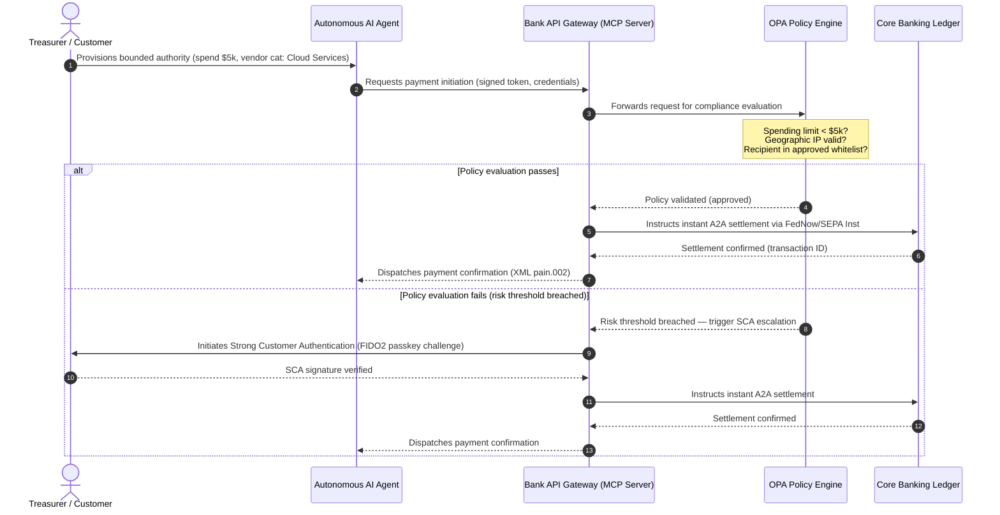

## چشم‌انداز پرداخت‌های جهانی ۲۰۲۶: مدل عملیاتی، ریسک و درآمد در جهانی عامل‌محور، نامرئی و آنی

برای بانک‌های معاملاتی جهانی، چرخهٔ ۲۰۲۶ تا ۲۰۲۸ یک پنجرهٔ ساختاری است. زیرساخت پرداخت مدرن دیگر یک ابزار اداری نیست — بلکه هستهٔ راهبرد فناوری در سطح بانکی است. در درون بانک‌های سیستمی جهانی (G-SIB) و مؤسسات بزرگ منطقه‌ای، فناوری، مقررات و انتظار مشتری در یک صفحهٔ عملیاتی واحد هم‌گرا شده‌اند.

سه نیرو این چرخه را تعریف می‌کنند و هر یک مستقیماً به یک دغدغهٔ سطح مدیریت ارشد نگاشت می‌شود.

- **تجارت عامل‌محور** — توزیع کانال، طراحی محصول، تخصیص مسئولیت و مدیریت ریسک مدل تحت نظارت ناظران.
- **پرداخت‌های نامرئی** — تجربهٔ مشتری، با ریسک حذف واسطه‌گری در جایی که بانک‌ها نتوانند دفتر کل خود را در واسط‌های کاربری شرکتی و پذیرنده تعبیه کنند.
- **اجرای آنی** — سرعت گردش سرمایه، با تغییرات متعاقب در مدیریت نقدینگی، ریسک اعتباری، تاب‌آوری عملیاتی و دفاع در برابر کلاهبرداری.

منافع مالی در میان است. کلاهبرداری از نظر سرعت و پیچیدگی مقیاس‌پذیر می‌شود؛ مهلت‌های مقرراتی قطعی‌اند؛ و بانک‌هایی که به‌طور فعالانه سامانه‌های هستهٔ خود را نوسازی می‌کنند، فرصت‌های قابل‌توجه درآمد کارمزدی را می‌گشایند. هزینهٔ بی‌عملی برعکس است: رد فوری تراکنش‌ها، گلوگاه‌های عملیاتی، جریمه‌های مقرراتی و فرسایش سریع سهم بازار.

## نردبان قطعیت — چه چیزی تاریخ‌دار است، چه چیزی تحت مقررات است، و چه چیزی پیش‌بینی است

هر بند در این گزارش قطعیت یکسانی ندارد. پرسش سطح هیئت‌مدیره این است که کدام تفاوت‌ها مهلت هستند، کدام‌ها انتظارات نظارتی‌اند و کدام‌ها هنوز پیش‌بینی‌های بازار هستند — چون پاسخ، گفت‌وگوی بودجه را تغییر می‌دهد.

| دسته | نمونه‌ها |
| --- | --- |
| **مهلت‌های قطعی** | گذار به نشانی ساختاریافتهٔ Swift CBPR+ (۱۴ نوامبر ۲۰۲۶)؛ کتاب‌های قواعد طرح SEPA متعلق به EPC (۱۵ نوامبر ۲۰۲۶) |
| **الزامات مقرراتی** | مدیریت ریسک ICT + آزمون تاب‌آوری + نظارت بر شخص ثالث در DORA (اتحادیهٔ اروپا)؛ تفویض SCA در چارچوب PSD3/PSR؛ مدیریت ریسک مدل (MRM) در چارچوب SR 11-7 + PRA SS1/23 |
| **جابه‌جایی‌های بازار با احتمال بالا** | APIهای خزانه‌داری آنی، دفاع در برابر کلاهبرداری با هدایت هوش مصنوعی، نقدینگی مبتنی بر API، کلاهبرداری بیومتریک مبتنی بر دیپ‌فیک |
| **گزینه‌های راهبردی** | سپرده‌های توکن‌شده، دفاتر کل یکپارچه در چارچوب پروژهٔ Agorá، کریدورهای تجارت عامل‌محور، ارز پیوسته (Wire 365) |
| **پیش‌بینی‌ها** | ۳ تا ۵ تریلیون دلار جریان سالانهٔ تجارت عامل‌محور تا سال ۲۰۳۰ (خط پایهٔ مک‌کنزی) |

دو ردیف نخست را به‌عنوان واقعیت‌های انطباقی در نظر بگیرید که یک ردیف بودجه را می‌رانند، خواه بانک هر مزیت بالادستی را کسب کند یا نه. دو ردیف پایین را به‌عنوان گزینه‌های راهبردی در نظر بگیرید — با اطمینان بالا در جهت، اما جایی که زمان‌بندی اجرا انتخاب هیئت‌مدیره است، نه یک قلم تقویمی ناظر.

## هم‌گرایی مراجع پرداخت جهانی

این گزارش چشم‌اندازهای ۲۰۲۶ پرداخت و تجارت را از چهار صدای معتبر صنعتی — [J.P. Morgan Payments](https://www.jpmorgan.com/payments/newsroom/payments-outlook-2026-trends-report-released "J.P. Morgan Payments — چشم‌انداز ۲۰۲۶")، [Global Payments](https://investors.globalpayments.com/news-events/press-releases/detail/497/global-payments-releases-its-2026-commerce-and-payment "Global Payments — گزارش روندهای تجارت و پرداخت ۲۰۲۶")، HSBC و The Payments Association — تلفیق می‌کند و آن‌ها را در برابر [نقشهٔ راه G20 برای تقویت پرداخت‌های فرامرزی](https://www.fsb.org/2026/03/fsb-kicks-off-new-implementation-phase-to-enhance-cross-border-payments-through-public-private-partnership/ "FSB — مرحلهٔ اجرای پرداخت‌های فرامرزی، مارس ۲۰۲۶") سه‌سنجی می‌کند.

هر سازمان از زاویهٔ بازاری متفاوتی به اکوسیستم می‌نگرد، اما یافته‌های آن‌ها بر سه اصل ثابت هم‌گرا می‌شوند.

1. **ریل‌های آنی و مبتنی بر API خط پایه‌اند.** مدل‌های پردازش دسته‌ای موروثی برای جریان‌های فرامرزی و باارزش به حاشیه رانده می‌شوند؛ سرعت تراکنش در آن بخش‌ها را پیام‌رسانی همیشه‌فعال و آنی تعیین می‌کند.
2. **هوش مصنوعی هم تهدید است و هم دفاع.** ابزارهای مولد و دیپ‌فیک‌ها کلاهبرداری تراکنش را مقیاس‌پذیر می‌کنند و به دفاع‌های متقابل چندلایه، آنی و مبتنی بر یادگیری ماشین نیاز دارند.
3. **توکن‌سازی زیرساخت آمادهٔ تولید است.** دفاتر کل در حال یکپارچه‌شدن‌اند تا میزبان بدهی‌های تجاری توکن‌شده و ارزهای دیجیتال عمده‌فروشی بانک مرکزی باشند.

| گزارش | مخاطب اصلی | تمرکز | ستون کلیدی | پیامد برای بانک |
| --- | --- | --- | --- | --- |
| **J.P. Morgan Payments** | خزانه‌داران شرکتی، G-SIBها | نقدینگی آنی، کلاهبرداری | APIها، بیومتریک هوش مصنوعی | بازسازی سامانه‌های نقدینگی، ارز و ریسک برای تسویهٔ پیوستهٔ ۳۶۵ روزه. |
| **Global Payments** | پذیرندگان، تجارت الکترونیک | تکامل POS، همه‌کاناله | تجارت عامل‌محور، پرداخت بدون اصطکاک | ساخت کریدورهای پرداخت پذیرندهٔ امن و دارای دروازهٔ API برای عامل‌های هوش مصنوعی خودمختار. |
| **HSBC Insights** | شرکت‌های چندملیتی | یکپارچگی‌های ERP (SAP/Oracle)، وجه نقد آنی | خزانه‌داری به‌عنوان سرویس، شفافیت وجه نقد | کسب درآمد از مجموعه‌های API تراکنشی و تعبیهٔ گزارش‌دهی دفتر کل نقد آنی در مبدأ. |
| **The Payments Association** | فین‌تک‌ها، مؤسسات پرداخت | استیبل‌کوین‌ها، توکن‌سازی، مقررات جهانی | دارایی‌های دیجیتال تحت‌نظارت، انطباق با سیاست | آماده‌سازی ترازنامه برای سپرده‌های توکن‌شده و مدیریت ساختارهای مسئولیت PSD3/PSR. |

این چهار چشم‌انداز عملاً پشتهٔ عملیاتی بخش خصوصی را تعریف می‌کنند که بر بستر زیرساخت سیاست‌گذاری بخش عمومی G20 اجرا می‌شود و قصد سیاستی را به تصمیم‌های ملموس در حوزهٔ نقدینگی، توکن‌سازی، داده و کنترل کلاهبرداری در درون بانک‌ها ترجمه می‌کند.

## ستون ۱ — تجارت عامل‌محور و پرداخت‌های نامرئی

تجارت عامل‌محور گذار از خرید کلیکی و انسان‌محور به آغاز تراکنش خودمختار و مدل‌محور است. پیش‌بینی‌های صنعتی بر ۳ تا ۵ تریلیون دلار تجارت سالانه با واسطهٔ عامل‌های خودمختار تا سال ۲۰۳۰ هم‌گرا می‌شوند — سهمی تک‌رقمی پایین از حجم پرداخت جهانی که بدون کلیک انسان بر «خرید» اجرا می‌شود.

اکوسیستم خرده‌فروشی و تجاری شکاف متناظری دارد. اکثریت روشن مصرف‌کنندگان اکنون انتظار پرداخت‌های تقریباً بدون‌اصطکاک را دارند، اما کمتر از نیمی از پذیرندگان به پرداخت تک‌کلیکی یا کاتالوگ‌های محصول قابل‌دسترسی از طریق API اولویت داده‌اند. عامل‌های هوش مصنوعی نمی‌توانند در صفحه‌های پرداخت چندصفحه‌ای موروثی که برای چشم انسان طراحی شده‌اند حرکت کنند؛ آن‌ها به دست‌دادن‌های API ساختاریافته و ماشین‌به‌ماشین نیاز دارند.

### اولویت‌های بانک و اثر عملیاتی

- **مالکیت KYC و AML.** بانک‌ها باید تعریف کنند که چه کسی تعهد انطباق را در درون یک زنجیرهٔ تراکنش عامل‌محور به عهده دارد. اگر عامل هوش مصنوعی شخصی یک مصرف‌کننده تراکنشی را از طریق پرداخت عامل‌محور یک پذیرنده آغاز کند، بانک باید تأیید کند که اختیار تفویض‌شدهٔ مبدأ به‌طور رمزنگاشتی به دارندهٔ حساب اصلی مقید است.
- **بازطراحی مسئولیت و بازپرداخت (chargeback).** طرح‌های کارت و ریل‌های A2A حول مجوز انسانی طراحی شده‌اند. هنگامی که یک عامل هوش مصنوعی خریدی اشتباه انجام می‌دهد — مثلاً تأمین موجودی صنعتی نادرست به دلیل خطای تجزیهٔ داده — بانک‌ها باید مسئولیت را به‌روشنی میان مصرف‌کننده، ارائه‌دهندهٔ عامل و پذیرنده تخصیص دهند.
- **رتبه‌بندی ریسک جریان‌های عامل‌محور.** موتورهای مسیریابی پرداخت باید پرداخت‌های عامل‌محور را به‌صورت پویا رتبه‌بندی ریسک کنند و تا زمانی که سابقهٔ تسویهٔ پایداری وجود نداشته باشد، الزامات ذخیرهٔ بالاتر یا نرخ‌های کارمزد بین‌بانکی بالاتری را بر تراکنش‌های غیرانسانی اعمال کنند.

### کنش کران‌دار و اختیار کران‌دار

برای کاهش «کنش بی‌کران» — عاملی که در تدارکات سازمانی به دلیل یک نقص نرم‌افزاری یک حلقهٔ خرید بازگشتی بی‌نهایت را اجرا می‌کند — بانک‌ها باید **دروازه‌های API با اختیار کران‌دار** را به‌کار گیرند. این دروازه‌ها محدودیت‌های سطح سیاست را در سه بُعد اعمال می‌کنند.

1. **محدودیت‌های مالی لایه‌بندی‌شده** — هزینه‌کرد عامل محدود به اندازهٔ تراکنش، ارزش تجمعی روزانه و دستهٔ پذیرنده.
2. **تدابیر آگاه به زمینه** — سیگنال‌های ثانویه (زمان روز، موقعیت جغرافیایی IP، بسامد تراکنش) که پیش از آزادسازی وجه توسط دفتر کل ارزیابی می‌شوند.
3. **تشدید با انسان در حلقه** — مجوز انسانی اجباری که از طریق احراز هویت قوی مشتری (SCA) در چارچوب PSD3/PSR هرگاه تراکنش از آستانه‌های ریسک فراتر رود، فعال می‌شود.

توالی Mermaid زیر معماری هدف را نشان می‌دهد که بسیاری از بانک‌ها آن را به‌عنوان جریان پرداخت عامل‌محور با اختیار کران‌دار خواهند شناخت.

### پروتکل زمینهٔ مدل (MCP)

برای اتصال مدل‌های هوش مصنوعی محلی‌شده به لایه‌های اجرایی تحت حاکمیت بانک، صنعت در حال استانداردسازی حول [Model Context Protocol (MCP)](https://modelcontextprotocol.io "Model Context Protocol — استاندارد باز برای یکپارچگی ابزار LLM") است — پروتکلی باز که به LLMها اجازه می‌دهد ابزارها و APIهای دارای دامنهٔ روشن و قابل‌ممیزی را بدون دسترسی خام به سامانه‌های هسته فراخوانی کنند.

پیچیدن APIهای بانکی (آغاز پرداخت، استعلام مانده، تأیید طرف) در درون یک سرور MCP، LLMها را از جدول‌های پایگاه‌داده و کنترل‌های ریشهٔ سامانه دور نگه می‌دارد. مدل تنها از طریق نقاط پایانی ساختاریافته، ممیزی‌شده و دارای محدودیت نرخ با دفتر کل تعامل می‌کند — امنیتی که در مرز اجرای ابزار عامل‌محور اعمال می‌شود، نه در درون مدل مدفون می‌شود.

## ستون ۲ — دگرگونی خزانه‌داری و بازتعریف نقدینگی

سرعت بانکداری معاملاتی در سال ۲۰۲۶ را گذار از پردازش دسته‌ای پایان‌روز به عملیات خزانه‌داری همیشه‌فعال و آنی تعیین می‌کند. شرکت‌های چندملیتی دیگر وجه نقد گرفتار را تحمل نمی‌کنند — نقدینگی‌ای که به دلیل بسته‌بودن سامانه‌های تسویه در آخر هفته‌ها یا تعطیلات در حساب‌های محلی بی‌کار می‌ماند.

### توجیه اقتصادی نقدینگی آنی

جی‌پی مورگان و HSBC هر دو گزارش می‌دهند که شرکت‌هایی با قابلیت‌های پیشرفتهٔ وجه نقد و دادهٔ آنی به‌طور معناداری بیشتر احتمال دارد در رشد درآمد و کارایی سرمایه از هم‌ترازان خود پیشی بگیرند، عمدتاً از طریق کاهش نقدینگی گرفتار و بهینه‌سازی چرخه‌های سرمایه در گردش.

برای تصاحب این ارزش، بانک‌ها **محصولات API خزانه‌داری به‌عنوان سرویس (TaaS)** را عرضه می‌کنند که به ERPهای شرکتی (SAP، Oracle) اجازه می‌دهد مستقیماً به دفتر کل بانک متصل شوند.

- **APIهای ماندهٔ آنی** با استفاده از طرح‌وارهٔ `camt.052` — جایگزینی پروتکل‌های انتقال فایل با گزارش‌دهی وضعیت وجه نقد آنی و رویدادمحور.
- **APIهای آغاز پرداخت انبوه** با استفاده از `pain.001` — اجرای مستقیم و سرتاسری دسته‌های پرداخت به فروشندگان از دفتر کل ERP.
- **APIهای ارز پیوسته** — موتورهای خزانه‌داری نرخ‌های ارز آنی و الگوریتمی را برای تسویهٔ فرامرزی قفل می‌کنند و ریسک شکاف بازار شبانه را حذف می‌کنند.
- **APIهای حساب مجازی** — شرکت‌ها هزاران زیرحساب را به‌صورت پویا برای تطبیق خودکار مطالبات و تفکیک دفتر کل ایجاد و بازنشسته می‌کنند.

### تاب‌آوری عملیاتی و DORA

ارائهٔ نقدینگی همیشه‌فعال، نمای ریسک بانک را دگرگون می‌کند. برای APIهای خزانه‌داری آنیِ دارای اهمیت سیستمی، **دسترس‌پذیری پنج‌نُهی (۹۹٫۹۹۹٪)** به‌تدریج هدف مهندسی داخلی است که بانک‌ها برای اثبات تاب‌آوری در سطح DORA به ناظران برای خود تعیین می‌کنند. خودِ DORA یک عدد جهانی پنج‌نُهی را تجویز نمی‌کند؛ بلکه مدیریت ریسک ICT، گزارش‌دهی حادثه، آزمون تاب‌آوری، ریسک شخص ثالث و نظارت بر ارائه‌دهندگان بحرانی ICT را پوشش می‌دهد — اما یک بستر API خزانه‌داری که تحت بار پیوسته به‌صورت متناوب از کار می‌افتد، نمی‌تواند به‌طور معتبر از فهرست سناریوهای شدید-اما-محتمل خود دفاع کند.

بر اساس [قانون تاب‌آوری عملیاتی دیجیتال (DORA)](https://eur-lex.europa.eu/legal-content/EN/TXT/?uri=CELEX%3A32022R2554 "مقررات (EU) 2022/2554 — قانون تاب‌آوری عملیاتی دیجیتال)، این یک شاخص کلیدی عملکرد IT نیست — بلکه یک الزام مقرراتی سخت‌گیرانه است. ناظران انتظار دارند بانک‌ها اثبات کنند که سطح API خزانه‌داری آنی و پایگاه‌دادهٔ دفتر کل می‌توانند حملات سایبری شدید-اما-محتمل، قطعی‌های شبکه و اختلال‌های ارائه‌دهندگان بزرگ ابری را بدون وقفه در پرداخت‌های بحرانی یا به‌خطرافتادن نقدینگی سیستمی جذب کنند. این امر به معماری‌های پایگاه‌دادهٔ چندابری فعال-فعالِ جغرافیایی-افزونه، لایه‌های تشخیص تهدید آنی و جابه‌جایی خودکار در صورت خرابی نیاز دارد — که در خط هزینهٔ تغییر دیده می‌شود، نه صرفاً در پروندهٔ ممیزی.

### ارز پیوسته و نوآوری فرامرزی

خزانه‌داری آنی نمی‌تواند در مرز تک‌ارزی زندگی کند. G-SIBها در حال استقرار زیرساخت ارز پیوسته هستند — بستر [Wire 365](https://www.jpmorgan.com/insights/payments/fx-cross-border/wire-365-global-clearing "J.P. Morgan — بازآفرینی تسویهٔ جهانی Wire 365") جی‌پی مورگان پرداخت‌های فرامرزی و تبدیل‌های ارز را در هر روز از سال، فراتر از ساعات RTGS سنتی بانک مرکزی پردازش می‌کند. این لایه مستقیماً با سامانه‌های سپردهٔ توکن‌شده و دفتر کل یکپارچهٔ مورد بحث در ستون ۳ درهم‌قفل می‌شود.

## ستون ۳ — سپرده‌های توکن‌شده و دفتر کل یکپارچه

توکن‌سازی از آزمایش‌های اثبات مفهوم منزوی به زیرساخت پولی مقیاس‌یافته و در سطح بانکی ارتقا یافته است. تمرکز از استیبل‌کوین‌های خصوصی و دارایی‌های رمزی سفته‌بازانه به سمت **سپرده‌های توکن‌شدهٔ بانک‌های تجاری** و **ارزهای دیجیتال عمده‌فروشی بانک مرکزی (wCBDCها)** که بر دفاتر کل یکپارچهٔ برنامه‌پذیر اجرا می‌شوند، جابه‌جا شده است.

چارچوب مرجع [پروژهٔ Agorá](https://www.bis.org/about/bisih/topics/fmis/agora.htm "BIS Project Agorá — توکن‌سازی پرداخت‌های فرامرزی عمده‌فروشی") است — یک همکاری بزرگ عمومی-خصوصی که توسط BIS و IIF گرد آمده و شامل **هشت بانک مرکزی** و بیش از ۴۰ مؤسسهٔ مالی خصوصی است (بر اساس صفحهٔ Agorá بانک تسویه‌های بین‌المللی، به‌روزرسانی‌شده در ۲۷ مه ۲۰۲۶). این پروژه بررسی می‌کند که چگونه سپرده‌های توکن‌شدهٔ بانک‌های تجاری با ارزهای دیجیتال عمده‌فروشی توکن‌شدهٔ بانک مرکزی روی یک دفتر کل برنامه‌پذیر مشترک یکپارچه می‌شوند تا اصطکاک تسویهٔ فرامرزی حذف شود، بررسی‌های انطباق هماهنگ شود و نهایی‌شدن اتمی ۲۴/۷ ممکن گردد.

### مسیر پنج‌مرحله‌ای توکن‌سازی

برای G-SIBها و بانک‌های بزرگ منطقه‌ای، توکن‌سازی یک مسیر گام‌به‌گام از بهینه‌سازی داخلی تا هم‌کنش‌پذیری بازار باز است.

1. **نقدینگی خزانه‌داری داخلی** — توکن‌سازی مانده‌های نقدی داخلی شرکتی (مثلاً JPM Coin یا دفاتر کل بانکی خصوصی معادل) برای امکان انتقال و تهاتر فرامرزی آنی و ۲۴/۷ در سراسر شعب خود بانک.
2. **کریدورهای چندبانکی کران‌دار** — کنسرسیوم‌های بسته و تحت‌نظارت (جعبهٔ شن پروژهٔ Agorá) برای آزمون تسویهٔ بین‌بانکی و وضعیت دفتر کل مشترک در میان مؤسسات متمایز.
3. **ارز برنامه‌پذیر پیوسته** — قراردادهای هوشمند روی دفتر کل یکپارچه ارز پرداخت-در-برابر-پرداخت (PvP) آنی را اجرا می‌کنند و ریسک تسویه را در سراسر مناطق زمانی حذف می‌کنند.
4. **دارایی‌های دنیای واقعیِ توکن‌شده (RWAها)** — بخش نقدی توکن‌شده با دفاتر کل اوراق بهادار، بدهی یا تجارت توکن‌شده یکپارچه می‌شود تا نهایی‌شدن تحویل-در-برابر-پرداخت (DvP) آنی حاصل شود و قفل‌شدن سرمایه از روزها به میلی‌ثانیه کاهش یابد.
5. **هم‌کنش‌پذیری عمومی/ترکیبی تحت‌نظارت** — پوشش‌های دروازهٔ امن به نقدینگی نهادی اجازه می‌دهند به‌طور ایمن با شبکه‌های عمومی باز تعامل کند.

### پیامدهای احتیاطی و ترازنامه‌ای

وجه نقد توکن‌شده باید با دقت در چارچوب‌های احتیاطی هدایت شود. ناظران تأکید می‌کنند که یک سپردهٔ توکن‌شده باید از نظر اقتصادی معادل یک سپردهٔ سنتی بانک تجاری باشد — یعنی یک بدهی بدون‌تضمین روی ترازنامهٔ بانک با همان پوشش بیمهٔ سپرده.

از نظر عملیاتی، سپرده‌های توکن‌شده ریسک‌هایی را وارد می‌کنند که مدل‌های کلاسیک تنش نقدینگی برای شبیه‌سازی آن‌ها ساخته نشده بودند. قراردادهای هوشمند برداشت‌های برنامه‌پذیر را با سرعت‌ها و حجم‌هایی اجرا می‌کنند که مفروضات موروثی آن‌ها را در بر نمی‌گیرند. بر اساس Basel III، بانک‌ها باید اطمینان یابند که موتور ریسک می‌تواند خروجی‌های نقدی برنامه‌پذیر را مدل‌سازی کند و دفتر کل توکن‌شده به‌طور پاکیزه با سامانه‌های RTGS موروثی در سراسر چرخهٔ روزانهٔ نقدینگی هم‌کنش‌پذیر باشد.

### استیبل‌کوین‌ها در برابر سپرده‌های توکن‌شده — یک موضع ظریف

استیبل‌کوین‌های خصوصیِ کاملاً پشتوانه‌دار (USDC و غیره) همچنان در حوالهٔ فرامرزی خرده‌فروشی و تجارت غیرمتمرکز سهم بازار می‌گیرند، اما فاقد ظرفیت خلق اعتبار و نهایی‌شدن تسویهٔ سامانهٔ بانکداری تجاری هستند.

بانک‌های معاملاتی به‌جای رقابت بر ریل‌های خرده‌فروشی، در حال ایجاد حضانت، انتشار ابزارهای بدهی توکن‌شدهٔ تحت‌نظارت خود و ساخت دروازه‌های امن ورود/خروج هستند. مشتریان شرکتی انعطاف برنامه‌نویسی به‌دست می‌آورند و در عین حال سرمایه را در محیط تحت‌نظارت نگه می‌دارند.

### پرسش‌هایی که هیئت‌مدیره باید دربارهٔ پول توکن‌شده بپرسد

- **مشارکت در دفتر کل یکپارچه.** نقشهٔ راه راهبردی فعال ما برای مشارکت در ابتکارهای دفتر کل یکپارچهٔ عمومی-خصوصیِ عمده‌فروشی مانند پروژهٔ Agorá چیست؟
- **ترازنامه و مدل‌سازی ریسک.** آیا موتورهای ریسک و چارچوب‌های کفایت سرمایهٔ ما آزمون تنش را برای در نظر گرفتن سرعت خروجی توکن ناشی از قرارداد هوشمند به‌روزرسانی کرده‌اند؟
- **بخش‌های مشتری پیشگام.** کدام‌یک از بخش‌های مشتری خزانه‌داری شرکتی و بانکداری تجاری ما بلافاصله از تسویهٔ DvP/PvP برنامه‌پذیر و توکن‌شده بهره خواهند برد؟

## ستون ۴ — دادهٔ ساختاریافته و دفاع در برابر کلاهبرداری

انطباق زیرساخت در سال ۲۰۲۶ تحت سیطرهٔ **گذار به نشانی ساختاریافته در ۱۴/۱۵ نوامبر ۲۰۲۶** است — دو مهلت مجاور که با هم مسیر نشانی بدون‌ساختار را در سراسر ریل‌های فرامرزی و درون‌اتحادیهٔ اروپا می‌بندند. بر اساس [نسخهٔ استاندارد SWIFT (SR) 2026](https://www.swift.com/standards/iso-20022/removal-unstructured-address "SWIFT — حذف نشانی بدون‌ساختار، نوامبر ۲۰۲۶")، CBPR+ از **۱۴ نوامبر ۲۰۲۶** پذیرش بلوک‌های کاملاً بدون‌ساختار `<AdrLine>` را متوقف می‌کند. بر اساس کتاب‌های قواعد طرح SEPA متعلق به EPC سال ۲۰۲۵، قالب نشانی بدون‌ساختار تنها تا **۱۵ نوامبر ۲۰۲۶** مجاز است. پس از گذار، هر پیام فرامرزی یا داخلی که نشانی بدون‌ساختاری را حمل کند در جایی که عناصر ساختاریافته انتظار می‌رود، توسط شبکه به تأخیر افتاده یا رد خواهد شد.

بیشتر مؤسسات تاریخ را می‌دانند. بسیاری آن را یک تمرین نگاشت سطحی در لایهٔ واسط تلقی می‌کنند. واقعیت یک چالش عمیق‌تر کیفیت داده و حاکمیت داده است. برای اجتناب از نرخ‌های فاجعه‌بار رد، عملیات پرداخت به یک چارچوب حاکمیت میان‌کارکردی روشن نیاز دارد.

- **محصول و عملیات.** ثبت داده در مبدأ. پورتال‌های دیجیتال روبه‌مشتری، واسط‌های احراز و فیلدهای ورودی ERP شرکتی باید فیلدهای نشانی ساختاریافته (`<StrtNm>`، `<PstCd>`، `<TwnNm>`، `<Ctry>`) را در نقطهٔ آغاز پرداخت الزامی کنند.
- **فناوری.** تجزیه، نگاشت، اعتبارسنجی طرح‌واره. موتورهای اعتبارسنجی فایل‌های موروثی را پیش از رسیدن به واسط SWIFT مسدود می‌کنند. مدل‌های یادگیری ماشین مستقر به‌صورت محلی، بلوک‌های نشانی بدون‌ساختار موروثی را به برچسب‌های سازگار با XML تحت `<PstlAdr>` تجزیه می‌کنند.
- **انطباق و ریسک.** غربالگری تحریم‌ها، پایش تراکنش و منطق AML به‌گونه‌ای به‌روزرسانی می‌شود که فیلدهای XML ساختاریافته را دریافت کند — و نرخ مثبت کاذب و بررسی‌های دستی را کاهش دهد.

### توجیه کسب‌وکاری دادهٔ ساختاریافته

اگر به‌عنوان یک هزینهٔ انطباق تلقی شود، برنامهٔ دادهٔ ساختاریافته گران است. اگر به‌عنوان یک توانمندساز درآمد تلقی شود، هزینهٔ خود را بازمی‌گرداند.

1. **تصمیم‌گیری اعتباری پیشرفته.** دادهٔ ساختاریافتهٔ فاکتور، حواله و بدهکار نهایی به بانک‌ها اجازه می‌دهد برنامه‌های خودکار و دقیق تأمین مالی سرمایه در گردش و فاکتورینگ فاکتور زنجیرهٔ تأمین را برای مشتریان شرکتی بسازند.
2. **تطبیق خودکار مطالبات.** آشکارسازی شناسه‌های ساختاریافتهٔ طرف و فاکتور، از محصولات ممتاز تطبیق وجه نقد و ادغام حساب مجازی پشتیبانی می‌کند و درآمد کارمزد تراکنش جدید تولید می‌کند.
3. **تحلیل تراکنش قابل‌کسب‌درآمد.** بانک‌ها داشبوردهای تحلیلی دانه‌درشت نقدینگی آنی و الگوی خرید را بسته‌بندی می‌کنند و به مدیران مالی و خزانه‌داران شرکتی می‌فروشند.

### دفاع لایه‌ای در برابر کلاهبرداری با هوش مصنوعی

با شتاب‌گرفتن سرعت تراکنش‌ها به سطح آنی، تکنیک‌های کلاهبرداری مقیاس‌پذیر شده‌اند. [گزارش کلاهبرداری هویتی ۲۰۲۶ Entrust](https://www.entrust.com/resources/reports/identity-fraud-report "Entrust 2026 Identity Fraud Report") دیپ‌فیک‌ها را **یک از هر پنج تلاش کلاهبرداری بیومتریک** برآورد می‌کند؛ تحلیل پیشین Entrust دیپ‌فیک‌ها را به‌طور مشخص **۴۰٪ تلاش‌های کلاهبرداری بیومتریک ویدئویی** برآورد کرده بود. در هر دو قالب، رسانهٔ مصنوعی اکنون یک کانال مادی برای شکست کنترل‌های تشخیص صدا و چهره در جریان‌های احراز و پرداخت است.

دفاع یک **مدل سه‌لایهٔ کلاهبرداری با هوش مصنوعی** است.

1. **لایهٔ هویت.** کلیدهای عبور [FIDO2](https://fidoalliance.org/fido2/ "FIDO Alliance — مشخصات FIDO2") تأییدشدهٔ بیومتریک، مقیدسازی رمزنگاشتی‌امضاشدهٔ دستگاه سخت‌افزاری و کیف‌پول‌های هویت دیجیتال غیرمتمرکز برای ایمن‌سازی دسترسی پرداخت.
2. **لایهٔ رفتاری.** بیومتریک رفتاری پیوسته — سرعت پیمایش نشست، ریتم تایپ، جهت‌گیری دستگاه — برای تشخیص اجرای خودکار ربات یا تلاش‌های ربایش نشست.
3. **لایهٔ تراکنش.** فیلدهای ساختاریافتهٔ [ISO 20022](/2023-09-29-automating-iso-20022-compliant-payment-file-creation-with-pain001/index.html) موتورهای ریسک یادگیری ماشین آنی را تغذیه می‌کنند و فراداده‌های تراکنش را با هوش کنسرسیومی مشترک در سطح شبکه ارجاع‌متقابل می‌دهند تا تراکنش‌های مشکوک را ظرف میلی‌ثانیه‌ها از آغاز شناسایی کنند.

برای برآورده‌کردن انتظارات ناظران، مدل‌های هوش مصنوعی لایهٔ تراکنش **پارامترهای تبیین‌پذیری** سخت‌گیرانه را در بر می‌گیرند و تحت یک برنامهٔ اختصاصی مدیریت ریسک مدل (MRM) عمل می‌کنند. ناظران انتظار دارند بانک‌ها نقاط دادهٔ مشخص و منطق الگوریتمی‌ای را که موجب یک مسدودسازی خودکار یا هشدار کلاهبرداری شده است، تبیین کنند، همسو با [SR 11-7 فدرال رزرو آمریکا](https://www.federalreserve.gov/frrs/guidance/supervisory-guidance-on-model-risk-management.htm "US Federal Reserve — راهنمای نظارتی مدیریت ریسک مدل، SR 11-7") و [PRA SS1/23](https://www.bankofengland.co.uk/prudential-regulation/publication/2023/may/model-risk-management-principles-for-banks-ss "Bank of England PRA SS1/23 — اصول مدیریت ریسک مدل برای بانک‌ها") بانک انگلستان.

## دستور کار هیئت‌مدیره ۲۰۲۶ تا ۲۰۲۸

برای اجرا در سراسر چهار ستون، هیئت‌های مدیریتی G-SIB و بانک‌های منطقه‌ای باید سرمایه‌گذاری‌های عملیاتی و فناوری را در امتداد یک نقشهٔ راه روشن سه‌افقی سازمان‌دهی کنند.

### افق ۱ — انطباق فوری و تحکیم هسته (۰ تا ۱۲ ماه)

- **تمرکز.** استانداردسازی کیفیت دادهٔ ISO 20022 و ایمن‌سازی مسیرهای پایهٔ تراکنش آنی.
- **شاخص موفقیت (KPI).** صفر رد نشانی بدون‌ساختار روی SWIFT و SEPA پس از گذارهای ۱۴/۱۵ نوامبر ۲۰۲۶.
- **مالک اجرایی.** مدیر ارشد عملیات / رئیس عملیات پرداخت.
- **نوع دستاورد.** حرکت بدون‌پشیمانی. به‌روزرسانی طرح‌وارهٔ پایگاه‌دادهٔ هسته و موتور اعتبارسنجی SWIFT SR 2026.

### افق ۲ — خودکارسازی و تدابیر عامل‌محور (۱۲ تا ۲۴ ماه)

- **تمرکز.** دروازه‌های API عامل‌محور کران‌دار و معماری دفاع پیوسته در برابر کلاهبرداری.
- **شاخص موفقیت (KPI).** ۱۰۰٪ تراکنش‌های API ماشین‌به‌ماشین و آغازشده با هوش مصنوعی که از طریق مقیدسازی سخت‌افزاری FIDO2 و موتورهای سیاست اختیار کران‌دار اعتبارسنجی شده‌اند.
- **مالک اجرایی.** مدیر ارشد اطلاعات / مدیر ارشد ریسک.
- **نوع دستاورد.** حرکت بدون‌پشیمانی (دفاع در برابر کلاهبرداری) به‌علاوهٔ گزینهٔ راهبردی (تجارت عامل‌محور). استقرار MCP و هوش مصنوعی سه‌لایهٔ کلاهبرداری.

### افق ۳ — توکن‌سازی بستر و دفاتر کل یکپارچه (۲۴ تا ۳۶ ماه)

- **تمرکز.** انتقال دارایی‌های خزانه‌داری به سپرده‌های توکن‌شده و مشارکت در دفاتر کل فرامرزی مشترک.
- **شاخص موفقیت (KPI).** پردازش بومی دست‌کم ۱۵٪ از حجم تسویهٔ باارزش خزانه‌داری شرکتی از طریق ابزارهای سپردهٔ توکن‌شده یا ترتیبات دفتر کل یکپارچه (مثلاً کریدورهای پروژهٔ Agorá).
- **مالک اجرایی.** خزانه‌دار گروه / رئیس بانکداری معاملاتی.
- **نوع دستاورد.** گزینهٔ راهبردی. زیرساخت دفتر کل برنامه‌پذیر، قواعد نقدینگی قرارداد هوشمند، آداپتورهای تسویهٔ DvP/PvP.

## آنچه باید صبح دوشنبه انجام داد — یک فهرست شش‌بندی بانکی

نقشهٔ راه سه‌افقی برنامهٔ چرخه است. فهرست زیر چیزی است که یک مدیر ارشد اطلاعات، مدیر ارشد عملیات یا رئیس بانکداری معاملاتی می‌تواند تا پایان هفتهٔ کاری بعد روی میز داشته باشد، صرف‌نظر از اینکه بقیهٔ برنامه چقدر بالغ باشد.

1. **موجودی‌گیری از مواجههٔ نشانی بدون‌ساختار** بر حسب کانال و نوع پیام. هر مسیر فایل موروثی، هر نقطهٔ پایانی API موروثی، هر ERP شرکتی که هنوز `<AdrLine>` متن‌آزاد صادر می‌کند. خروجی: یک شمارش، یک مالک و یک تاریخ رفع به‌ازای هر منبع.
2. **ایجاد یک رده‌بندی ریسک پرداخت عامل‌محور.** جریان‌های آغازشدهٔ غیرانسانی را بر حسب روش آغاز (عامل مصرف‌کننده، عامل پذیرنده، عامل تدارکات شرکتی)، نوع طرف مقابل و ریل دسته‌بندی کنید. خروجی: یک رده‌بندی یک‌صفحه‌ای و یک تیکت موتور مسیریابی.
3. **تعریف محدودیت‌های سیاست اختیار تفویض‌شده برای پرداخت‌های آغازشده با هوش مصنوعی.** محدودیت‌های لایه‌بندی‌شده بر حسب اندازهٔ تیکت، دستهٔ پذیرنده، جغرافیا. خروجی: یک پیش‌نویس مشخصات سیاست-به‌عنوان-کد که موتور OPA می‌تواند اعمال کند.
4. **نگاشت APIهای خزانه‌داری بحرانی DORA و وابستگی‌های شخص ثالث.** کدام APIها در فهرست سناریوهای شدید-اما-محتمل قرار دارند؛ به کدام اشخاص ثالث وابسته‌اند؛ کدام قراردادها پیشاپیش مادهٔ ۲۸ DORA را برآورده می‌کنند. خروجی: یک ردیف در دفتر ثبت شخص ثالث بحرانی ICT به‌ازای هر API.
5. **شناسایی دو کاربرد سپردهٔ توکن‌شده با ارزش خزانه‌داری قابل‌اندازه‌گیری.** تهاتر داخلی بین‌شعبه‌ای و یک کریدور مجاور پروژهٔ Agorá دو مورد نخست واقع‌بینانه هستند. خروجی: یک توجیه کسب‌وکاری اندازه‌گذاری‌شده برای هر کدام، با مالک و تاریخ تصمیم ۹۰ روزه.
6. **ایجاد یک چارچوب کنترل ریسک مدل برای تصمیم‌گیری کلاهبرداری و عامل‌محور.** هر مدل یادگیری ماشین در مسیرهای کلاهبرداری و پرداخت عامل‌محور را به انتظارات SR 11-7 / PRA SS1/23 نگاشت کنید: هدف مستند، تبار داده، تبین‌پذیری، پایش، مسیر بازنویسی. خروجی: یک ماتریس کنترل MRM یک‌صفحه‌ای به‌ازای هر مدل.

هدف این فهرست نو بودن هیچ‌یک از بندهایش نیست. هدف این است که به‌قدر کافی کوچک است که این هفته شروع شود، به‌قدر کافی قابل‌مشاهده است که در کمیتهٔ اجرایی بعدی پیگیری شود، و به‌طور ساختاری با چهار ستون همسو است تا کار اولیه به برنامه غذا برساند، نه اینکه با آن رقابت کند.

## پرسش‌های متداول

**آیا تجارت عامل‌محور واقعاً تا سال ۲۰۳۰ به ۳ تا ۵ تریلیون دلار خواهد رسید؟**
خط پایهٔ مک‌کنزی به ۵ تریلیون دلار فروش تجارت عامل‌محور تا سال ۲۰۳۰ اشاره دارد، با طیفی از پیش‌بینی‌های مستقل که میان ۳ تریلیون و ۵ تریلیون دلار خوشه شده‌اند. این پراکندگی نشان می‌دهد که پذیرندگان با چه شدتی APIهای پرداخت ماشین‌خوان را عرضه می‌کنند و بانک‌ها با چه سرعتی به عامل‌ها اجازهٔ تراکنش تحت تفویض SCA را می‌دهند — گلوگاه در سمت بانک و پذیرنده است، نه در سمت قابلیت عامل.

**آیا گذارهای ۱۴/۱۵ نوامبر ۲۰۲۶ برای جریان‌های داخلی SEPA هم اعمال می‌شوند؟**
بله. الزام نشانی ساختاریافته برای CBPR+ فرامرزی و پیام‌های پرداخت SEPA اعمال می‌شود. بانک‌هایی که هر دو ریل را اجرا می‌کنند به یک طرح‌وارهٔ نشانی متعارف واحد در بالادست واسط SWIFT نیاز دارند، نه دو نگاشت موازی.

**آیا یک سپردهٔ توکن‌شده همان استیبل‌کوین است؟**
خیر. یک سپردهٔ توکن‌شده یک بدهی بدون‌تضمین روی ترازنامهٔ یک بانک تحت‌نظارت است، با همان پوشش بیمهٔ سپردهٔ یک سپردهٔ سنتی. یک استیبل‌کوین معمولاً یک ابزار کاملاً پشتوانه‌دار است که توسط یک غیربانک منتشر می‌شود، بدون ظرفیت خلق اعتبار. طراحی پروژهٔ Agorá فرض می‌کند سپرده‌های توکن‌شده در کنار ارزهای دیجیتال عمده‌فروشی بانک مرکزی روی یک دفتر کل برنامه‌پذیر مشترک قرار می‌گیرند؛ استیبل‌کوین‌ها در بخش تسویهٔ عمده‌فروشی نقشی ندارند.

**پروژهٔ Agorá چه نسبتی با آزمایش‌های موجود wCBDC دارد؟**
Agorá چارچوب یکپارچه‌ساز است. آزمایش‌های ملی wCBDC بخش پول-بانک-مرکزی را پوشش می‌دهند؛ Agorá سپرده‌های تجاری توکن‌شده را به همان دفتر کل برنامه‌پذیر می‌آورد تا تسویهٔ فرامرزی در سراسر هر دو نوع پول اتمی باشد. هفت بانک مرکزی مشارکت‌کننده و بیش از ۴۰ مؤسسهٔ خصوصی، آن را به بزرگ‌ترین زمین طراحی عمومی-خصوصی برای معماری پول توکن‌شدهٔ عمده‌فروشی تبدیل می‌کنند.

**حداقل وضعیت انطباق DORA برای یک API خزانه‌داری به‌عنوان سرویس چیست؟**
استقرار فعال-فعالِ جغرافیایی-افزونه، سناریوهای سایبری شدید-اما-محتمل مستند با مالکان نام‌برده تحت SM&CR (بریتانیا)، و یک جابه‌جایی آزموده‌شده در صورت خرابی که پرداخت‌های بحرانی را قطع نکند. بدون آن، محصول TaaS پیش از آنکه یک خط درآمد باشد، یک بدهی مقرراتی است.

## منابع

- Bank for International Settlements (BIS) Innovation Hub. (2026). *Project Agorá: exploring tokenisation of wholesale cross-border payments*. [BIS Project Agorá](https://www.bis.org/about/bisih/topics/fmis/agora.htm).
- Deutsche Bank. (2026). *Digital Money: a perspective on stablecoins, tokenised deposits and CBDCs*. [Deutsche Bank Flow](https://flow.db.com/publications/flow-white-papers-and-guides/digital-money-a-perspective-on-stablecoins-tokenised-deposits-and-cbdcs).
- European Parliament and Council. (2022). *Regulation (EU) 2022/2554 on Digital Operational Resilience (DORA)*. [DORA Regulation](https://eur-lex.europa.eu/legal-content/EN/TXT/?uri=CELEX%3A32022R2554).
- Financial Stability Board. (2026). *FSB kicks off new implementation phase to enhance cross-border payments*. [FSB statement](https://www.fsb.org/2026/03/fsb-kicks-off-new-implementation-phase-to-enhance-cross-border-payments-through-public-private-partnership/).
- Global Payments. (2025). *2026 Commerce and Payment Trends Report — press release*. [Global Payments press release](https://investors.globalpayments.com/news-events/press-releases/detail/497/global-payments-releases-its-2026-commerce-and-payment).
- J.P. Morgan Payments. (2026). *Payments Outlook 2026 Trends Report Released*. [J.P. Morgan Newsroom](https://www.jpmorgan.com/payments/newsroom/payments-outlook-2026-trends-report-released).
- J.P. Morgan Insights. (2026). *5 Payment Trends to Watch for in 2026*. [J.P. Morgan Trends](https://www.jpmorgan.com/insights/payments/trends-innovation/five-payment-trends-in-2026).
- J.P. Morgan FX & Cross-Border. (2026). *Wire 365: Global Clearing Reinvented*. [J.P. Morgan FX Wire 365](https://www.jpmorgan.com/insights/payments/fx-cross-border/wire-365-global-clearing).
- SWIFT. (2026). *ISO 20022 milestone for November 2026: unstructured addresses to be removed*. [SWIFT ISO 20022 Milestone](https://www.swift.com/news-events/news/iso-20022-milestone-november-2026-unstructured-addresses-be-removed).
- SWIFT Standards. (2026). *Removal of unstructured address*. [SWIFT Standards](https://www.swift.com/standards/iso-20022/removal-unstructured-address).
- Bank of England. (2023). *Supervisory Statement (SS1/23) — Model Risk Management principles for banks*. [Bank of England PRA SS1/23](https://www.bankofengland.co.uk/prudential-regulation/publication/2023/may/model-risk-management-principles-for-banks-ss).
- US Federal Reserve. (2011). *Supervisory Guidance on Model Risk Management (SR 11-7)*. [SR 11-7](https://www.federalreserve.gov/frrs/guidance/supervisory-guidance-on-model-risk-management.htm).
- McKinsey & Company. (2025). *McKinsey forecast: $5 trillion in agentic commerce sales by 2030* (via Digital Commerce 360). [McKinsey agentic forecast](https://www.digitalcommerce360.com/2025/10/20/mckinsey-forecast-5-trillion-agentic-commerce-sales-2030/).
- HSBC Business. (2026). *HSBC Business Insights*. [HSBC Insights](https://www.business.hsbc.com/en-gb/insights).
- Bright Defense. (2026). *Deepfake Statistics: A Growing Security Concern*. [Deepfake fraud statistics](https://www.brightdefense.com/resources/deepfake-statistics/).
- European Banking Authority. (2019). *Guidelines on outsourcing arrangements (EBA/GL/2019/02)*. [EBA Outsourcing Guidelines](https://www.eba.europa.eu/regulation-and-policy/internal-governance/guidelines-on-outsourcing-arrangements).
