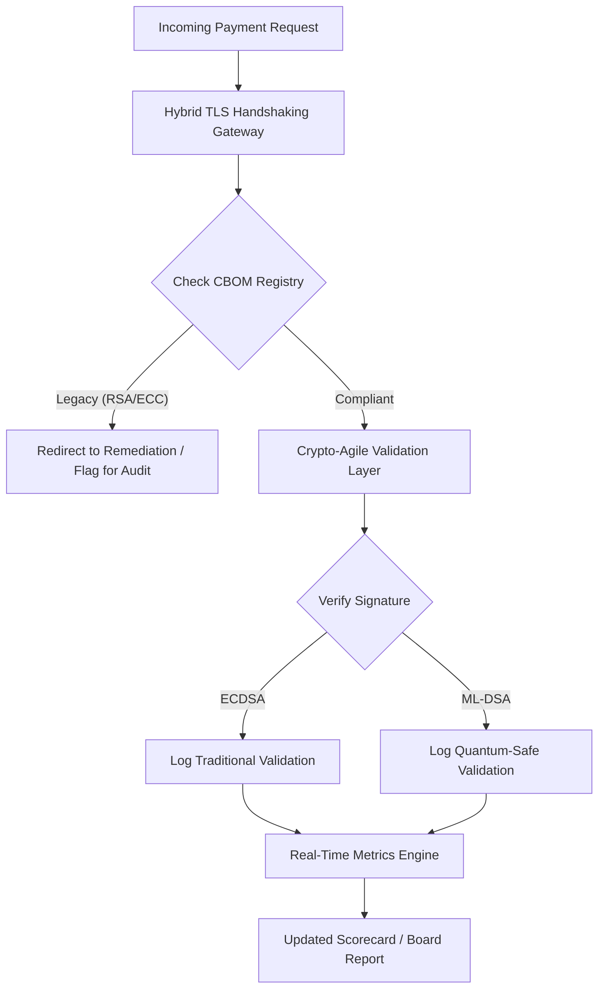

## کارنامهٔ امنیت پساکوانتومی ۲۰۲۶: چارچوب سنجه‌ای در سطح هیئت‌مدیره برای چابکی رمزنگاری امانی

امنیت پساکوانتومی دیگر یک پروژهٔ پژوهشی نیست. «ساعت نظارتی» به سوی مهلت‌های اجرایی اواخر دههٔ ۲۰۲۰ در حال تیک‌زدن است. نهایی‌شدن [NIST FIPS 203 (ML-KEM)](https://csrc.nist.gov/pubs/fips/203/final) و [NIST FIPS 204 (ML-DSA)](https://csrc.nist.gov/pubs/fips/204/final) استانداردهای کپسوله‌سازی کلید و امضای دیجیتال را مدوّن کرده است.

نهادهای ناظر اکنون از بانک‌های رده‌یک انتظار دارند که از برنامه‌های آزمایشی فراتر روند. در سال ۲۰۲۶، تمرکز به سمت صنعتی‌سازی این استانداردها جابه‌جا شده است. ناتوانی در نشان‌دادن مسیر روشن مهاجرت، جریمه‌های نظارتی سنگینی ذیل [قانون تاب‌آوری عملیاتی دیجیتال (DORA)](https://eur-lex.europa.eu/eli/reg/2022/2554/oj) و مسئولیت شخصی بالقوه برای مدیرانی که تهدید قابل‌پیش‌بینی رمزگشایی کوانتومی را نادیده می‌گیرند، به‌همراه دارد.

## ۰۱. کارنامهٔ کوانتومی در سطح هیئت‌مدیره

سنجه‌های زیر چارچوبی استاندارد در اختیار هیئت‌مدیره‌ها قرار می‌دهند تا آمادگی کوانتومی و سلامت رمزنگاری را در سراسر دامنه‌های بانکداری تجاری و سرمایه‌گذاری (CIB) ارزیابی کنند.

### جدول ۱: سنجه‌ها و آستانه‌های کارنامهٔ PQC

| سنجه | فرمول ریاضی | آستانه‌های مصوب هیئت‌مدیره | ریسک در صورت خروج از آستانه |
| ---- | ---- | ---- | ---- |
| **درصد کامل‌بودن سیاهه (ICP)** | (دارایی‌های رمزنگاری شناسایی‌شده / کل دارایی‌های برآوردشده) × ۱۰۰ | > ۹۸٪ | رمزنگاری سایه و نقاط کور در مسیرهای دادهٔ تسویهٔ پرارزش. |
| **نرخ مواجهه با HNDL (HER)** | (دادهٔ بلندعمر روی رمزنگاری قدیمی / کل دادهٔ بلندعمر) × ۱۰۰ | < ۵٪ | افشای دائمی اسرار تجاری، دفاتر بدهی حاکمیتی و سوابق پرداخت‌های عمده. |
| **نرخ پیشرفت مهاجرت NIST (MPR)** | (سامانه‌های اجراکنندهٔ FIPS 203/204 / کل سامانه‌های حیاتی) × ۱۰۰ | > ۶۰٪ (تا پایان سال ۲۰۲۶) | عدم انطباق نظارتی و کنارگذاشته‌شدن از سوی طرف‌های هم‌راستا با G20. |
| **شاخص آمادگی چابکی رمزنگاری (CARI)** | (برنامه‌های دارای لایهٔ رمزنگاری انتزاعی / کل برنامه‌های هسته‌ای) × ۱۰۰ | > ۸۵٪ | بدهی فنی شدید و ناتوانی در واکنش به منسوخ‌شدن‌های آتی الگوریتم‌ها. |

## ۰۲. فهرست اقلام رمزنگاری (CBOM)

سنجهٔ ICP از طریق یک **مرحلهٔ کشف جامع CBOM** مبناگذاری می‌شود. این فرایندی خودکار است که هر نقطهٔ پایانی رمزنگاری را در سراسر سازمان شناسایی می‌کند.

- **کشف نقاط پایانی:** پویش شبکه‌های داخلی و ابری برای یافتن نشست‌های فعال TLS به‌منظور شناسایی کاربرد RSA یا ECC قدیمی.
- **سیاههٔ کلیدها:** نگاشت جفت‌کلیدهای عمومی/خصوصی به مالکان مربوطهٔ آن‌ها و نگاشت تاریخ‌های دقیق انقضا.
- **نگاشت وابستگی‌ها:** شناسایی کتابخانه‌ها و APIهای شخص ثالثی که به الگوریتم‌های منسوخ متکی‌اند.

این مرحلهٔ کشف یک منبع واحد حقیقت پدید می‌آورد و به CISO امکان می‌دهد سلامت رمزنگاری را با همان دانه‌بندی عملکرد مالی گزارش دهد.

## ۰۳. حذف مواجهه با HNDL در پرداخت‌های عمده

دشمنان به‌طور فعال پرداخت‌های عمده و پایگاه‌های دادهٔ شرکتی بلندعمر را هدف قرار می‌دهند. این حملات «برداشت اکنون، رمزگشایی بعد» (HNDL) شامل رهگیری و بایگانی ترافیک رمزنگاری‌شدهٔ امروز است.

حتی اگر یک رایانهٔ کوانتومی مرتبط با رمزنگاری (CRQC) امروز وجود نداشته باشد، داده‌ای که اکنون رهگیری می‌شود در آینده آسیب‌پذیر خواهد بود. کاهش این تهدید مستلزم مهاجرت با اولویت بالای دادهٔ بلندعمر (مثلاً سوابق هویت، قراردادهای اوراق قرضهٔ ۳۰ساله و بایگانی‌های حقوقی) است که مستقیماً سنجهٔ HER را کاهش می‌دهد. ارتقای کانال‌های پرداخت به رمزنگاری ترکیبیِ پساکوانتومی‑سنتی (استفاده از ML-KEM در کنار X25519) دفاعی فوری در برابر تهدیدهای بایگانی فراهم می‌کند.

## ۰۴. عملیاتی‌سازی چابکی رمزنگاری از طریق واسط‌های خوش‌طراحی

چابکی رمزنگاری از طریق انتزاع‌های مهندسی محقق می‌شود. کتابخانه‌های امروزی مانند [KyberLib](https://sebastienrousseau.com/2026-06-12-kyberlib-post-quantum-banking-migration-standards-code-2026) نشان می‌دهند که توسعه‌دهندگان چگونه می‌توانند ماژول‌های کوانتوم‌ایمن را بدون بازنویسی کل پشتهٔ برنامه پیاده‌سازی کنند.

- **پوشش‌های انتزاعی:** برنامه‌ها به‌جای روال‌های ویژهٔ الگوریتم، یک تابع عمومی `encrypt()` یا `sign()` را فراخوانی می‌کنند.
- **جایگزینی در زمان اجرا:** ماژول زیرین می‌تواند به‌جای استقرارهای پیچیدهٔ کد، از طریق تغییرات پیکربندی از ECDSA به ML-DSA جایگزین شود.

این معماری تضمین می‌کند که اگر یک الگوریتم مشخص PQC در آینده افشا شود، سازمان بتواند در چند ساعت به‌جای چند سال چرخش کند.

## ۰۵. جریان‌کار اعتبارسنجی ورودی کوانتوم‌ایمن

نمودار زیر چرخهٔ حیات دادهٔ ورودی به محیط امن را در یک محیط بانکی چابک‌در‑برابر‑کوانتوم نشان می‌دهد.

## جمع‌بندی

دامنهٔ رمزنگاری یک بانک رده‌یک دیگر دغدغهٔ CISO نیست. این یک زیرساخت امانی است. NIST FIPS 203 و 204 الگوریتم‌ها را تعیین می‌کنند؛ مادهٔ ۵ DORA سطح مسئولیت‌پذیری را مشخص می‌کند؛ و SM&CR آن را به یک مدیر ارشد نامشخص گره می‌زند. کارنامهٔ بالا — کامل‌بودن سیاهه، مواجهه با HNDL، پیشرفت مهاجرت و چابکی رمزنگاری — چهار عددی را که هیئت‌مدیره برای راهبری این دامنه بدون نیاز به خواندن کد رمزنگاری لازم دارد، در اختیارش می‌گذارد.

عددی که بیش از همه اهمیت دارد، مواجهه با HNDL است. هر سابقهٔ رمزنگاری‌شدهٔ قدیمی که امروز در بایگانی پرداخت‌های عمده نشسته است، در روزی که نخستین رایانهٔ کوانتومی مرتبط با رمزنگاری عرضه شود، خوانا خواهد بود. این شمارش معکوس خاموش و نامتقارن است: مدافعان تنها می‌توانند روی داده‌ای که در اختیار دارند اقدام کنند، اما دشمنان می‌توانند روی داده‌ای که سال‌ها پیش استخراج کرده‌اند اقدام کنند. یک قرارداد اوراق قرضهٔ شرکتی ۳۰ساله که در سال ۲۰۲۴ با RSA-2048 رمزنگاری شده، قراردادی است که در روز راه‌اندازی یک CRQC تضمین محرمانگی خود را از دست می‌دهد.

[KyberLib](https://sebastienrousseau.com/2026-06-12-kyberlib-post-quantum-banking-migration-standards-code-2026) و همتایانش این کار را از یک بازنویسی چندسالهٔ سکو به یک تغییر پیکربندی بدل می‌کنند. وظیفهٔ هیئت‌مدیره نوشتن کد نیست. وظیفهٔ هیئت‌مدیره این است که مطالبه کند شاخص آمادگی چابکی رمزنگاری — سهم برنامه‌های هسته‌ای که پشت یک واسط رمزنگاری انتزاعی قرار دارند — ظرف دوازده ماه از مرز ۸۵٪ عبور کند، و کارنامهٔ فصلی را بخواند.
